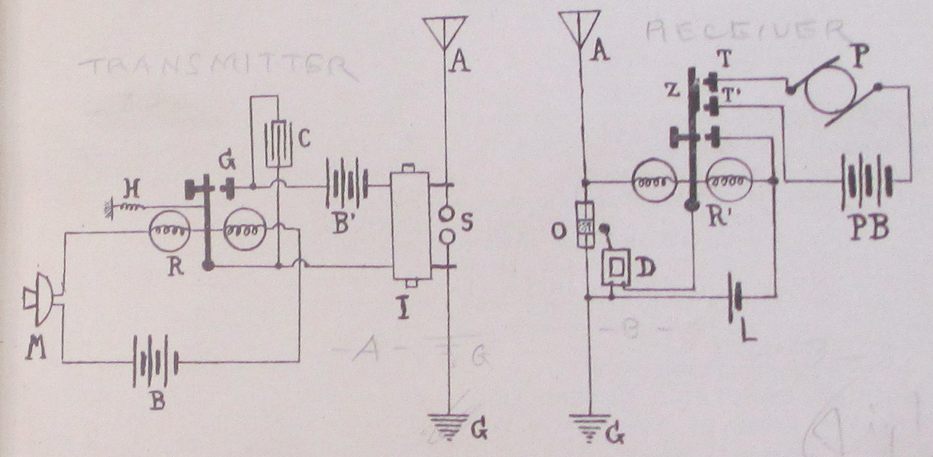
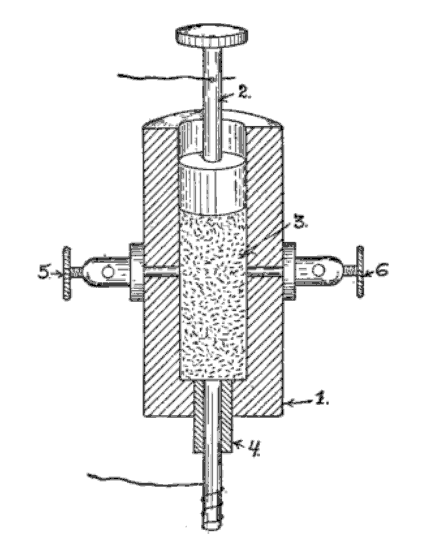

**DRAFT:** *Please do not share without permission of the author. Typeset versions in  [web](http://gernsback.wythoff.net/190805_the_dynamophone.html) \| [pdf](https://github.com/gwijthoff/perversity_of_things/blob/gh-pages/typeset_drafts/190805_the_dynamophone.pdf?raw=true) \| [doc](https://github.com/gwijthoff/perversity_of_things/blob/gh-pages/typeset_drafts/190805_the_dynamophone.docx)*

* * * * * * * * * * * 

While conducting some experiments in wireless telephony I made the discovery of quite an interesting combination which, to my knowledge of the art, has not been tried up to this date.

To produce mechanical effects directly, man is obliged to exert his muscular forces, by bringing his muscles in contact with the object to be moved, or through an indirect way, namely, by interposing a tool between the muscle and the object.[^hum]  This tool might be a lever or it might be a telegraph key, which latter, if desired, will move or disturb the far-off object through another medium, electricity.

To apply power to an object the hand is used more than any other part of the human body; the foot probably ranges next.  The whole body, mostly applied as a lever, follows.  The head is practically never used at all.  The lungs are used very little comparatively, for instance in glass blowing, etc.

The voice has never been used, no case being on record that a motor or a dynamo was started solely by talking, to or through a medium.  I am, of course, well aware that by talking in a transmitter the telephone diaphragm at the other end will vibrate, but that can hardly be called power, it being proved that in most cases the vibrations of a receiver diaphragm measure less that one-five-thousandths of an inch.  To provide a contact on the diaphragm in order that the vibrations should close a certain circuit, which in turn could be relayed, to transmit or start power, has always proved a failure on account of the vibrations of the diaphragm, created by the human voice, being exceedingly weak.

My arrangement, as described below, to transmit or start power, etc., simply by talking into a transmitter, will therefore be found novel, especially if it is considered that the transmitter is not connected with the receiving station whatsoever.  The transmission is made by means of wireless electric radiations.[^wrk]

No new apparatus being needed in my arrangement, any amateur can easily perform the experiment.

Referring to plan, M represents the common transmitter as used on most telephones.  R is a fairly sensitive pony relay of seventy-five ohms.  C is a condenser to absorb excessive sparking; I, induction coil; S, oscillator balls.

The tension of the adjusting spring H on the relay should be just sufficient to keep the armature away from contact G.  With a little experimenting the right tension will be ascertained.

By talking medium loud in the transmitter, the resistance in same will be varied accordingly and the armature will close the circuit at G, through battery B and coil I, which may be a common one-inch spark-coil not deprived of its vibrator.

Every time the circuit is closed at G a series of sparks will jump across the balls at S, creating oscillations.  These oscillations, traveling through the ether, arrive at the receiving station, where they impinge on the antennae A and operate the coherer O through relay R'.  The decoherer D is also shown.  Relay, coherer and decoherer are all operated by a single dry cell L.[^coh]  This is the same circuit as in my "Telimco" wireless system.[^tel]  Relay R' has in addition two stationary contacts T and T', which, when the armature Z closes, complete another circuit, as, for instance, through a small motor P, an incandescent light, etc.

As long as words are spoken in the transmitter M, oscillations will be set up in S and the receiving station will work continuously until the voice at M stops.  Motor P will, of course, be kept in motion only as long as the voice talks into M.[^coi]

* * * * * * * * * * * 

"MODERN ELECTRICS" has had an unparalleled success since its first appearance that it became necessary to give up the old offices and move to larger quarters.  We are now located at 84 West Broadway, in the very heart of New York's electrical district, and our present facilities are adequate to keep pace with the rapid growth of the magazine.

We are proud to say that out of about 600 letters received, there was *not one* that did not contain congratulations, or a few nice words.

We were a little "shaky" at first, and we did not know if we had struck it right, but the avalanche of kind letters received encouraged us enormously, and we know now that we do not have to fear for the future.

We know that "MODERN ELECTRICS" has come to stay, for the simple reason that it fills a long-felt want and because "we have the goods!"

* * * * * * * * * * * 

A strange disease is spreading rapidly over this country and threatens to infect every young man over 15 years old.  No antidote has been discovered so far against its ravages, and parents are greatly alarmed, the new disease at the same time taxing pocketbooks and checkbooks heavily.

The name of the infecting germ is *Bugum Y-erlessum* and creates the so called "Wireless Craze."  The disease is incurable.

Never before was the "craze" so strongly developed as this year; uncountable cases are reported from Portland, Me., to Portland, Ore., and the statistics show that one out of five young men are infected.

* * * * * * * * * * 

Since "MODERN ELECTRICS" made its appearance a month ago, the editor has been flooded with mail.  From the hundreds of congratulating letters received 159 (one hundred and fifty nine) up to this writing deal with nothing but Wireless.  Most readers wish the "Wireless Department" enlarged, some even went as far and asked us to publish nothing but Wireless, a great many wanted a description of an electrolytical Detector, while an equally large audience wanted to build a Silicon Detector.

We had in mind to print a good many interesting articles besides the ones the "Wireless Department," but our motto is: "To print what our readers WANT, not merely what strikes the Editor's fancy."

We remembered this in time and the present issue of "MODERN ELECTRICS" proves that our motto is no idle boast.

[^hum]:  A sentence linking human "muscular force" to "mechanical effects" in a metaphor that isn't signaled as such becomes possible thanks to the rise of the "human motor" as a dominant form of political, social, technical and scientific thought from the late nineteenth century through the interwar period.  Anson Rabinback has shown how labor is transformed into "labor power" over this period, "a concept emphasizing the expenditure and deployment of energy as opposed to human will, moral purpose, or even technical skill."  Predicated on a utopian ideal of a body without fatigue, discourse on the human motor sought to marry the motion of the body with that of the machine:

     > European scientists devised sophisticated techniques to measure the expenditure of mental and physical energy during mechanical work---not only of the worker, but also of the student, and even of the philosopher.  If the working body was a motor, some scientists reasoned, it might even be possible to eliminate the stubborn resistance to perpetual work that distinguished the human body from a machine.  If fatigue, the endemic disorder of industrial society, could be analyzed and overcome ,the last obstacle to progress would be eliminated.

     @rabinbach_human_1992, p. 2.

[^wrk]:  This is a clever workaround:  at a time when the voice couldn't be *transmitted* via wireless, perhaps it could at least be *translated* into a form of electrical or mechanical force.

[^coh]:  The coherer is one of the earliest forms of "detector," the most important component of a wireless set.  The detector is responsible for demodulating radio frequency signals into an audio frequency current, ready to be piped through the listener's headphones.  The idea behind the coherer is that when a radio frequency signal is applied to a glass vial filled with metal powder, the metal filings will "cohere" and an electrical current will pass through the device.  Each telegraphic "dot" or "dash" causes the filings to cohere, after which some form of "decoherer" mechanically taps the vial to loosen them once again.

    The coherer was initially discovered by the physicist and inventor Édouard Branly (1844 – 1940).  "The form and nature of the ordinary filings-tube coherer, as applied to-day in wireless telegraphy, is fairly familiar.  Branley [sic] discovered, in 1891, that the effect of electrical oscillations upon a body of metal fillings was to produce a marked increase in the conductivity of the mass, a conductivity which persisted until the particles were broken apart again by mechanical jar.  Although Varley, Hughes, Onesti and others had previously noted this phenomenon, none of these investigators had fully appreciated the causes involved, or given to the world of science the benefit of their researches in thorough published reports."  @de_forest_electrolytic_1904, p. 424.

     <!-- no figure -->

    It was left for Marconi to, in the words of Thomas H. Lee, combine Hertz's spark-gap transmitter with Branly's coherer and "tinker like crazy."  It is worth noting that the physical principle behind the coherer's operation is still not understood today.  It remains a device with practical applications whose inner workings are nevertheless not understood.  @lee_nonlinear_2004, p. 3.

[^coi]:  Though the coherer wasn't as sensitive as later crystal and electrolytic detectors, it had the merit of being the only one to work in mobile applications until the late 1910s.  In a later editorial on what he refers to as "radio kinetics," Gernsback writes of the shortcomings and unique benefits of the coherer:

    > as far back as 1906 this investigator fired guns, closed doors, started and stopt motors by means of distant radio control. This was in the age of the coherer, and probably due to its inherent shortcomings, the art of radio kinetics was not much advanced until very recently. The coherer is a very unsatisfactory scientific instrument insofar that even if constructed by precision mechanics, it has the great inherent fault of being susceptible to shocks as well as to most extraneous impulses. Thus, for instance, a very sensitive coherer will usually operate on strays or static as well as inductive effects and stray waves. In other words this instrument---even the most balanced one---is not reliable. It will go off when least expected. A coherer heretofore was thought to be the prime necessity for radio kinetics because it was practically the only instrument known that could close the contacts of a relay. Ordinary detectors such as the crystal type and others could not be used until about three or four years ago, at which time very sensitive galvanometer relays were introduced which actually could be used to close a contact by means of a carborundum or silicon detector." "Radio Kinetics," *Radio Amateur News*, vol. 1 no. 12, June 1920.

[^tel]:  The Telimco was the flagship product of The Electro Importing Company, it's name a shortened form of the company's.  It was the first radio set ever sold fully assembled to the public.

<!-- contains instructions in another G article on building a light-sensitive selenium cell alarm clock that goes off when morning sunlight hits it -->