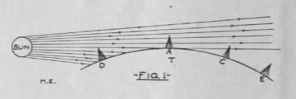
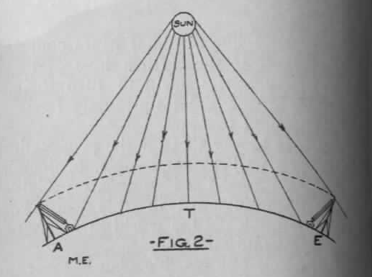
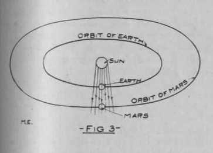
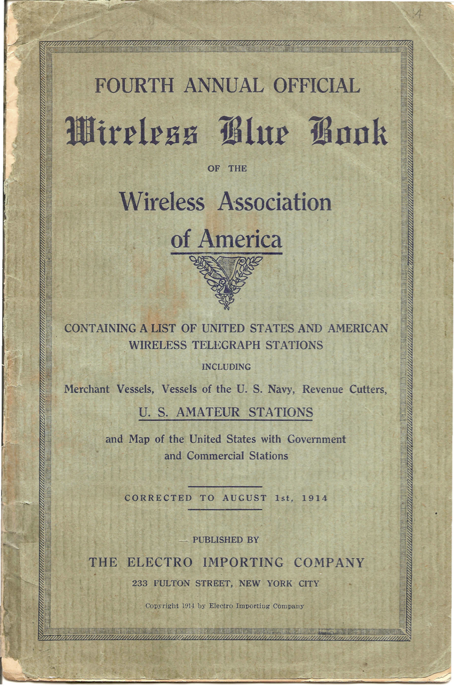

**DRAFT:** *Please do not share without permission of the author. Typeset versions in  [web](http://gernsback.wythoff.net/190905_signaling_to_mars.html) \| [pdf](https://github.com/gwijthoff/perversity_of_things/blob/gh-pages/typeset_drafts/190905_signaling_to_mars.pdf?raw=true) \| [doc](https://github.com/gwijthoff/perversity_of_things/blob/gh-pages/typeset_drafts/190905_signaling_to_mars.docx)*

* * * * * * * 

Every time our neighbor Mars comes in opposition to the earth a host of inventors and others begin to turn their attention to the great up-to-date problem, "signaling to Mars."[^orb]

It is safe to say that all the proposed, possible as well as impossible, projects would fill a good-sized volume, especially the ones invented in this country, which by far leads the world in number of projects and "inventions."

So far only one feasible plan has been worked out.  The writer refers to Professor Pickering's mirror arrangement, now being discussed all over the world.  But even Professor Pickering is skeptical, as he apparently does not like to take the responsibility of spending ten million dollars on a mere idea which might prove fallacious.[^pic]

Wireless telegraphy has been talked of much lately as a probable solution to the problem.  The writer wishes to show why it is not possible at the present stage of development to use wave telegraphy between the two planets, but at the same time he would like to present a few new ideas how it could be done in the near future.

Take the average present-day wireless station having an output of about 2 K. W.  On good nights and under favorable circumstances such a station may cover 1,000 miles.  Very frequently, however, only about 800 miles can be spanned.

Next summer for a few days Mars will be nearer to us than for many years to come.  The distance between the two planets will then be about 35 million miles.

If we base transmission between the earth and Mars at the same figure as transmission over the earth, a simple calculation will reveal that we must have the enormous power of 70,000 K. W. to our disposition in order to reach Mars.

Now it would be absolutely out of the question to build a single station with that output.  Even a station of 700 K. W. would be a monster and a rather dangerous affair to meddle with.  This may be understood better when considering that none, even the most powerful stations, to-day have 100 K. W. at their disposal.

A solution, however, presents itself to the writer's mind.  As it is impossible and impracticable to build and operate a single station with an output of 70,000 K. W., let us divide the 70,000 K. W. in small stations of, say 2, 10 or 50 K. W.  Neither do we have to build these stations for the sole purpose of using them to signal mars; they are already being erected by the governments and commercial stations at the rate of about 150 per month.

At the present time of writing the entire output of the U.S. Government, commercial and ship wireless stations combined, is about 2,500 K. W.  By adding the stations of private individuals, ranging in power from 1/4 to 2 K. W., the total sum is brought up to about 3,500 K. W., as far as the writer is able to ascertain from the latest reports.

If, however, the art progresses as it has during the past four years, it is safe to predict that in 20 or possibly 15 years the United States, Canada and Mexico will reach the combined output of 70,000 K. W.

It will then be comparatively easy to seriously undertake to signal to Mars, and the writer proposes the following plan, which has the great advantage that the experiments can be made at practically no cost, against Professor Pickering's project, involving the enormous expense of ten million dollars.

The idea is simple enough.  A central point of the continent, such as Lincoln, Nebr., should be selected preferably.  By previous arrangement all wireless stations on the continent should be informed that on certain days their stations should be connected with a magnetic key,[^bon] which is connected through the already existing wire telegraph lines with the central station at Lincoln.  As the wires may be leased from the existing wire telegraph lines, it is of course the simplest thing in the world to connect the key of each wireless station (by wire) with the central station.  Each time, therefore, when the operator at Lincoln depresses his key all the keys belonging to the wireless stations connected with his key will be pressed down, and if the combined power of the connected stations is 70,000 K. W., the enormous energy of 70,000 K. W. will be shot out in the ether!

What effect the 70,000 K. W. will have on the weather or climate after they have been radiated for several hours the writer dares not conjecture, but that something will "happen" is almost certain.

Considering the technical side of the project, it is of course feasible.  If the necessary amount of power was to be had to-day, there would be no difficulty to try it next summer; as this is not the case, we must be patient and wait; the writer, however, hopes to see the day when the experiment will be tried.

Referring to the technical side, it will be necessary, of course, to tune all the sending apparatus to exacctly the same wave length, which, naturally---on account of the great distance to be overcome---should be as long as possible.  The frequency of the oscillations should be practically the same for all stations.  The result of this arrangement would be that the effect would be practically the same as if one tremendously large station of 70,000 K. W. capacity was sending.

Just as we may blow two or a dozen whistles of the same pitch at the same time, in order to carry the sound further, and just as Professor Pickering may use thousands of small mirrors all operated at the same time, as if they were one huge mirror, so it may be possible to unite a great number of different wireless senders and operate them as if they were one, provided of courser that, like the whistles, they are tuned to the same "pitch."

There is only one more point to consider.

It has been demonstrated time and again that the action of the sun's rays greatly interfere with wireless telegraphy.  In fact, it is possible to send twice as far over water during the night than during the day.  This may be better understood by quoting Mr. Marconi's views: 

> Messages can now be transmitted across the Atlantic by day as well as by night, but there exists certain periods, fortunately of short duration, when transmission across the Atlantic is difficult and at times ineffective unless an amount of energy greater than that used during what I might call normal conditions is employed.

> Thus in the morning and in the evening when, due to the difference in longitude, daylight extends only part of the way across the Atlantic, the received signals are weak and sometimes cease altogether.[^itn]

Mr. Marconi's explanation is that illuminated space possesses for electric waves a different refractive index to dark space and that in consequence the electric waves may be refracted and reflected in passing from one medium to another.

The writer wishes to offer a different explanation, which seems far more plausible.

Referring to Fig. 1, let T represent a section of the earth.  Let A be a station on the American, E a station of the English coast.  As will be seen, the sun is just setting for the point A, while E has night already (no sun rays reach #).

When A is sending the waves are shot out *parallel* with the sun's rays and *carried with the rays.*  The action of the sun's rays is so strong that most of the electric waves are carried along, and therefore never reach E at all.  Only by using more powerful waves can this effect be overcome.  This action is not surprising at all.  Electromagnetic waves are closely related to light rays.  As Svante Arrhenius has also shown us, the rays of the sun exert a certain amount of pressure on all encountered objects.[^spm]  It is therefore easy to prove that considering the close relationship of light rays and Hertzian waves, the latter *will be carried in the direction away from the sun* under favorable circumstances.  Again considering Fig. 1, such favorable circumstances would be reached during sunset or during sunrise.

That this explanation is not a mere theory is best proved by the fact that a point D and C will communicate with each other best during sunrise and sunset, the signals received being the strongest.  The electric waves during these two periods *travel parallel with the sun's rays, following the line of least resistance.*

During the day (Fig. 2), let A again represent the American, E the English coast station.  Now it will be easily understood why messages can be sent almost twice as far during the night as during the day.  In this instance the electric waves must *cut directly through the vast field of light,* and are being "held down" to a certain degree by the pressure of the light.

Now let us turn our attention to Fig. 3.  This represents the earth and Mars in opposition.  It will be seen immediately that the earth has a great advantage over Mars as far as wireless is concerned.

Messages sent from the earth during the opposition will go in the same direction as the sun's rays, and the writer is of the opinion that instead of the theoretical amount of power---that is, 70,000 K. W.---possibly only one-half or one-quarter will be required to signal to Mars, as the electric waves are undoubtedly assisted toward Mars by the rays of the sun.

On the other hand, Mars will find it difficult to signal back, especially during opposition, when his "operators" would have to work directly against the sun's rays.

However, we can only hope that the Martians are further advanced than we and may signal back to us, using a method new to us and possibly long discarded by them, when thousands of years ago they stopped signaling to us, and gave us up, as we did not have intelligence enough to understand.

* * * * * * * * * * *

# Editorial

We call our readers' especial attention to the first annual official blue book which we are publishing and which is ready now.

This book contains all the information the student of wireless telegraphy is interested in.  It enables him to tell where and from whom a message is sent and thereby increases and stimulates the interest in the art to a great extent.[^blu]

A contemporary publication a few months ago made the statement that it did not consider it wise to publish a list of Government and commercial stations, with their call letters, etc., as this would only tend to put the experimenter in a position where he could successfully annoy the large stations.  This statement is not very flattering to the mentioned publication's readers.  It seems to have very little confidence in its own readers and their honesty.

The world has a right to be enlightened.  There can be no progress without enlightenment.  Any publication keeping valuable and enlightening news from its readers is not working in the readers' interests.

The wireless situation as it stands today, considered from the experimenter's standpoint, may be understood better by an analogy.

Take a blind man who only understands English.  Let him walk over a dangerous road full of deep holes.  The Italian laborer may vainly shout in Italian: "Look out, you will fall!" but the unfortunate blind man, while he hears the shout, of course, pays no heed---and falls in the first hole he encounters.  *He heard, but did not understand.*

The same with the wireless experimenter.  The large stations may vainly shout at him to stop sending.  He hears but does not understand.  He doesn't even know *who* shouts at him.  He is far worse off than the blind man.  If he knew *who* was doing the shouting he would more likely pay heed and respect the station whom he disturbed.

And still some people wish to keep the student in the dark, to refrain him from doing mischief!  Sancta Simplicitas!

[^orb]: As Robert Markley explains, "For a few weeks every twenty-six months, Mars and the Earth are aligned on the same side of the sun in their elliptical orbits.  During these periods of opposition, Mars is visible through comparatively small telescopes, and, since the mid-seventeenth century, scientific observations of the planet's surface and atmosphere have clustered during these periods."  The orbital opposition of 1909 was the first time Percival Lowell tested out his **telescope to take photographs of the surface of Mars and prove his theory of Martian canals.**  @markley_dying_2005, p. 33.

[^pic]: William Henry Pickering was an astronomer with the Harvard Observatory known for discovering Saturn's moon Phoebe, advancing telescopic photography, and advancing popular knowledge of the surface of Mars. In April 1909, Pickering proposed a plan to communicate with Mars using a massive heliograph.  Pickering described the system in a front-page article in *The New York Times:*  

    > My plan of communication would necessitate the use of a series of mirrors so arranged as to present a single reflecting surface toward the planet.  Of course one mirror would do as well, but as the area necessary for reflecting the sunlight over 40,000,000 miles would have to be more than a quarter of a mile of glass a single mirror would not be practicable.  We would have to use a number of mirros.
    
    > These mirrors would all have to be attached to one great axis parallel to the axis of the earth, run by motors, and so timed as to make a complete revolution every twenty-four hours, thus carrying the reflecting surface around with the axis once a day and obviating the necessity of continually readjusting it to allow for the movement of the planets.  @times_plans_1909
    
    An article in *Popular Mechanics* notes that Pickering
    
    > is also among those who seriously doubt that there are any living beings upon Mars, although he has due respect for the theories of those opposed to him, but he does believe that his scheme of sending messages is the one practical way of finding out, once for all, whether there are such beings, although he admits that if no answering signals were made, it would not disprove the theories that Martians exist. @_scheme_1909
    
    A version of the plan was actually carried out in 1924, when Swiss astronomers "mounted a heliograph in the Alps to flash signals to Mars.  The U.S. Navy maintained radio silence for three days to listen to messages from the Martians." @markley_dying_2005, p. 158.

[^bon]: Gernsback: \"Described in the October, 1908, issue of M. E., page 243."

[^itn]: Gernsback: \"Article in the May, 1908, issue M. E., page 55."

[^spm]: Gernsback: \"'Worlds in the Making.' See Panspermie \[sic\]."  This note refers to @arrhenius_worlds_1908.  Panspermia is the theory that some form of microscopic life is spread just as evenly throughout the universe as matter itself.  Arrhenius writes, "According to this theory life-giving seeds are drifting about in space.  They encounter the planets and fill their surfaces with life as soon as the necessary conditions for the existence of organic beings are established" (217).  This would imply that "all organic beings in the whole universe should be related to one another and should consist of cells which are built up of carbon, hydrogen, oxygen, and nitrogen" (229).

[^blu]: Electro Importing Company's annual *Blue Book* was the culmination of Gernsback's calls for greater accountability in "The Wireless Joker."  It listed the names and call signs of amateur radio operators around the country.  Part of the impetus for publishing this phone book of sorts was to encourage greater accountability for the content of wireless messages once the names of their senders were shared openly and freely.

    