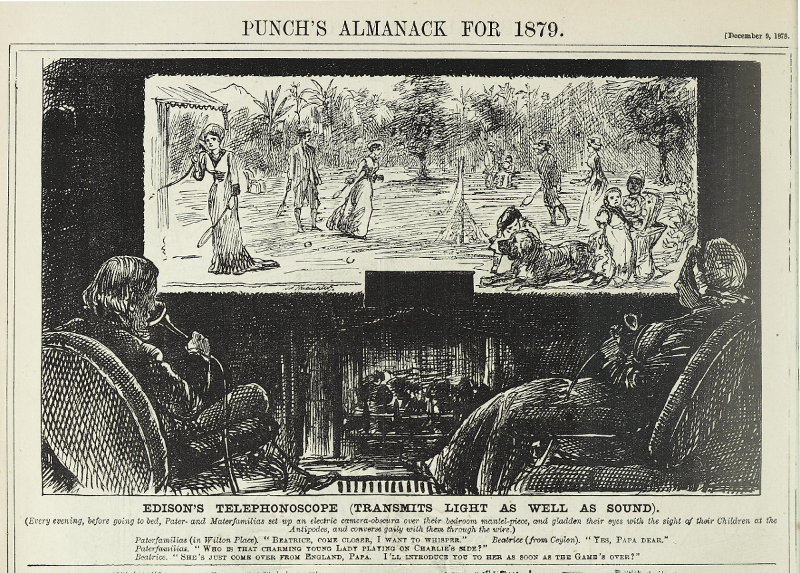
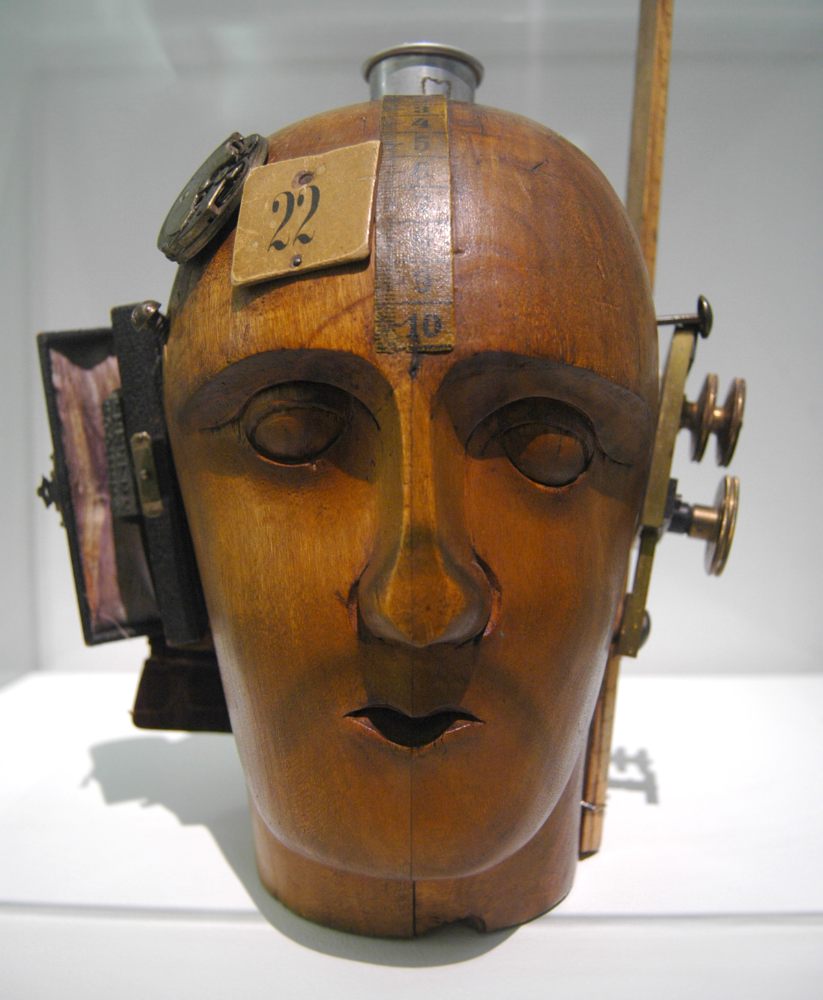

**DRAFT:** *Please do not share without permission of the author. Typeset versions in [web](http://gernsback.wythoff.net/190912_television_and_the_telephot.html) \| [pdf](https://github.com/gwijthoff/perversity_of_things/blob/gh-pages/typeset_drafts/190912_television_and_the_telephot.pdf?raw=true) \| [doc](https://github.com/gwijthoff/perversity_of_things/blob/gh-pages/typeset_drafts/190912_television_and_the_telephot.docx)*

* * * * * * * * 

Every now and then we see newspaper reports that Mr. So and So has discovered the real secret of television, only to be told again a few weeks afterwards that it has not been realized after all.[^tvn]

For 25 years almost, inventors all over the world have been working strenuously to solve the problem, but so far none succeeded, apparently because they all seem to work along wrong lines.

The principle of television may be briefly stated thus: A simple instrument should be invented which should reproduce objects placed in front of a similar instrument (called a Telephot) at the other end of the line. In simple language, it should be possible to connect two mirrors electrically, so that one would show whatever object is placed before the other one and vice versa.

As in a mirror, the objects must be reproduced in motion (at the far-off station). The theory further requires that both instruments (one at each end) must be reversible, that is, each instrument must receive as well as transmit.[^frt]

A good parallel of this requirement is found in the ordinary Bell telephone receiver. As is known, the Bell receiver (without the use of a microphone transmitter) will receive as well as transmit, that is, one can talk in a receiver and also hear the other party, using one and the same instrument.

In the Telephot it should be possible to see the party at the other end while that party should see you, both through the medium of your Telephot.

Unlike the mirror, however, you should not be able to see your own picture in your own Telephot. In this the Telephot differs from the mirror analogy.

From this it will be seen immediately how difficult the problem becomes, as if you could see yourself in your own Telephot, as well as the picture of your friend, it is obvious that there would be a 'mix-up' of personalities, the consequence being that you could not recognize your friend nor yourself, while your friend at the other end could of course not recognize you nor himself.

In the telephone the case is not so difficult, as it is absolutely necessary that one party talks while the other listens; if both talk and listen, none can understand, as the voices mix up.

In the Telephot this parallel does not hold good, as there is nothing to restrain you from looking at your friend at the same time he is looking at you.

Of course the problem can be simplified by getting the true parallel of the telephone, thus: When you wish to see A you keep in the dark, while A stands in full light. If A wants to see you he turns off his light while you switch on yours.

However, this would be impracticable and is not the true solution of the Telephot.

So far most inventors seem to think that the problem can only be solved by means of the selenium cell, which being sensitive to light, can send out electrical impulses in the same ratio as the light falling upon the cell. Thus, if a strong light is thrown on a selenium cell a strong electric impulse is sent over the line which when operating a light relay (described below) can be made to throw a strong light upon a screen.

As a picture is made up of nothing but light and dark points it is easily to be seen that if several thousand very [Fig. 2] small selenium cells were arranged in a plane and just as many light relays at the other end, a good picture could be projected upon a screen––in theory. The trouble is that it is practically impossible to make two selenium cells with equal sensitiveness and just this is the most important part, as if one is not as sensitive as the other, it will of course not transmit the same impulse as the former. It can be imagined easily what kind of a picture a station would transmit having several thousand selenium cells, all of a different sensitiveness!

Then the next trouble is that each cell at best requires one wire (the ground might be used as return).[^cll] Think of two stations which, in order to work, require 3,000 to 5,000 separate wires! This seems to be as bad or worse than Sömmering's first telegraph (in 1809), which required 27 wires to operate. In Morse's subsequent telegraph only one wire is required, which unquestionably will be the case with the perfect Telephot.

Another great trouble with the selenium cell is that it works sluggishly, that is, its resistance will not drop instantaneously from the highest value to the lowest, which is a bad feature, as it would necessarily blur the picture at the other end. Furthermore, to work anywhere satisfactorily the selenium cell requires strong light.

The writer does not wish to throw cold water on selenium and selenium cells, as it is quite possible that the latter may be improved to such an extent as to do entirely away with the shortcomings mentioned above, although the greatest difficulty, the one that each cell requires at least one wire, is and will be the far greatest stumbling block.

Many different systems have been proposed in the past to solve the problem by means of selenium cells and although the list is quite long only a few will be mentioned in this article, as all systems are more or less on the same lines.

A. Knothe proposes to solve the problem as follows: C (Fig. 1), represents a camera into which the lines coming from the batteries enter. The space between each pair of wires is bridged by a selenium cell S. If now light enters the camera it falls on S (and all the other cells), and closes the current which operates the spark coils J. This furnishes a discharge as a single ray in the X-Ray pipe H at the receiving station E. This single ray is thrown as a single point on the fluorescent screen F.

It is understood that several hundred cells, spark coils and parabolic mirrors K are necessary to transmit a picture. The X-Ray tube would therefore necessarily be of monstrous dimensions. All the wires, 1, 2, 3, 4, up to several hundred, must of course, be well insulated, so that no sparking occurs between them. All these requirements make the arrangement almost impossible and quite impracticable.

The latest "Telephot" has been designed by Mr. Ruhmer, the well-known Berlin expert. Last June Mr. Ruhmer demonstrated a working model, which although it did not transmit pictures, served well to demonstrate the usefulness of the selenium cell for certain purposes.[^ruh]

Fig. 2 shows the model clearly. The principle is as follows:

The transmitter has 25 squares, each containing a selenium cell. If any one
oi the 25 cells is exposed to light, it operates a sensitive relay, which sends an alternating current of a certain frequency over the line.

At the receiving end one resonating relay is stationed for each selenium cell at the sending station. The impulse sent from the selenium cell therefore operates only that relay having the right frequency.

Each relay operates an incandescent lamp which is placed in the same square at the receiver as the selenium cell at the transmitter.

If several cells are exposed to light at the transmitter, several alternating currents, but all of different frequencies are sent over the line. These currents do not mix, but operate only the relays for which they are intended.

These in turn operate the lamps in the various squares, assigned to them.

Mr. Ruhmer has perfected the selenium cell a good deal, and as his model worked very rapidly, it will be seen that the sluggishness of the cells has been overcome to a certain extent.[^sur]

Simple geometric figures were transmitted quite successfully as can be seen in the photograph, where 9 squares at the transmitter were lighted and the same amount, in the same position were reproduced at the receiver. This is quite remarkable if it is remembered that only *one wire* is used between transmitter and receiver.

Mr. Ruhmer intends to build a transmitter containing 10,000 cells, to reproduce pictures at the Brussels international exposition in 1910. The cost will be over one and a quarter million dollars and the writer is of the opinion that it is almost impossible to operate such a model on account of the 10,000 different frequencies necessary to accomplish the result.[^xpo]

A simpler way could be brought about by the idea proposed by the writer some eight years ago.

Fig. 3 represents the well-known electrical harmonica, which for the sake of those not knowing the instrument, is described herewith:

A musical steel harp H is fastened to a permanent magnet NS. If any one of the steel harp-prongs is touched it will swing back and forward, at the same time sending an induced current through the windings of the electromagnet E. If we connect a similar instrument H through the line l, and ground LL' to H' it is evident that if we touch any of the steel prongs of one of the instruments the same steel prong on the other will be made to swing. If we have 12 prongs on each instrument and we touch prongs No. 1, 6, 9, 12 of H, all at the same moment, prongs No. 1, 6, 9, 12 of H will be made to sound at the same time too, and so on.

Suppose we build such a harmonica having, say, 500 prongs P, Fig. 4, each responding readily at an extremely light touch.

Exactly over each of the 500 prongs we place a minute electromagnet E, 500 in all (only 6 shown in illustration ), so when one of the small electromagnets is actioned by means of a weak alternating current flowing through same it will cause the prong underneath it to swing as long as current flows through the electromagnet.

Now each of the small electromagnets is connected to a selenium cell of which 500 are placed in a plane.

It will be easily seen that if one or more of the selenium cells are acted upon by light, one or more of the small electromagnets is acted upon AND AS A PROPORTIONATE AMOUNT OF CURRENT IN PROPORTION TO THE INTENSITY OF LIGHT at the selenium cell flows through the small electromagnet, or electromagnets, it will cause the prong or prongs to vibrate IN THE SAME PROPORTION OF INTENSITY as the light falling on the selenium cell.

Thus if cell No. 1 is lighted with 10 C. P., assume that the small electromagnet connected to it causes its prong to swing through the distance of one millimeter. Then if cell No. 50 is only lighted with the intensity of 1 C. P., prong No. 50 will of course only swing 1-10 millimeter and so on. Thus each prong will be caused to swing in exactly the same proportion as the amount of light falling upon the selenium cell, to which it belongs.

As each prong swings it sends a current over the line L' L". If now No. 1 and No. 6 of the electromagnets are energised through the selenium cells both cause their prongs to swing and send impulses over the line. At the receiving station G, prongs 1 and 6 must swing IN THE SAME PROPORTIONATE INTENSITY as the prongs at the sender H, consequently electromagnets E'1 and E'6 are energised (the prong acting as a telephone diaphragm, the electromagnets having for core a permanent magnet). E'1 and E'6 now operate the light relays LRl and LR6.

Now, then, if the selenium cell connected to El is lighted with, say, 10 C.P., a proportionate amount of energy---call it 10 energies---are received at LR1. The light relay therefore passes 10 energies of the small tungsten lamp TL through its opening, and 10 energies are projected on the screen S. If the cell connected to E6 receives the light of 100 C. P. it is evident that LR6 receives 100 energies and the screen is lighted with 100 energies and so on.[^mror]

Thus it will be seen that if we have enough selenium cells at H and enough light relays at G any picture in motion will be transmitted correctly and reproduced in its true phases on the screen S. It is only a matter of building the apparatus and instruments with sufficient precision.

The light-relay used in some of the writer's experiments is described herewith:

A light-relay is an instrument which has the purpose to utilize very weak electric impulses to throw a beam of light on a screen, which in intensity is proportionate to the strength of the electric impulses. In other words, if the impulses are strong, a large amount of light is caused to fall on the screen; if the impulses are weak, a small amount of light falls on the screen, and so on.

Fig. 5 shows the instrument in the perspective. Between the poles of a strong electromagnet NS, two extremely fine metal wires A and A'. are stretched. The wires may be stretched more or less by the regulating crews o and o'.

The two poles N and S, are each provided with a hole O and O', through which light rays are sent in the direction p, p'. On the two wires, A and A', a
very light piece of aluminum foil B is attached in such a way that no light can pass from O to O1 normally.

If, however, a weak current passes from a to a1, the aluminum foil is deviated in the direction f or f1, as the case may be. In order to obtain very exact motions of the foil the thin wires are best replaced by fine metal bands 0.01 millimeters thick, 0.25 millimeters wide and about 6 centimeters long. The resistance of each band is about 7.5 ohms.

As far as the writer knows his plan so far is the only feasible one which can be used to transmit objects in motion over a single wire and at the same time receive a proportionate amount of energy at the receiving end to that received by the selenium cells at the transmitter.

No patents were taken out on this invention by the writer, as he considers the device too complicated for general use. He shall, however, consider himself happy if it will be the means to bring us nearer to the practical Telephot.

[^tvn]: This article contains the first mention of television in the Gernsback magazines, a favorite topic of his writers over the next few decades. Surveying the latest technical approaches to transmitting images across a distance, Gernsback introduces a system by Berlin-based technologist Ernst Ruhmer, one which bears more of a technical resemblance to today's liquid crystal displays (LCDs) than the electromechanical Nipkow disk scanners common at the time. In the photograph, Ruhmer displays a crude prototype with a 5x5 pixel cross transmitted from one display to another. Ruhmer's system used light-sensitive selenium cells arranged in a mosaic, transmitting differences in light intensity through variable current strengths. For more on Ruhmer, see @collins_wireless_1905, which contains a section on Ruhmer's "photo-electric telephone." Ruhmer's selenium plates were "made by winding a pair of wires parallel to each other on a flat piece of glass and filling the space between them with fused selenium." Collins describes the technique:

    > The cell devised by Ruhmer was given a cylindrical form so that the light might be evenly distributed over its surface by the reflector. The selenium cell was made by winding two fine platinum wires in parallel and separated by 7-10 mm. on a glass tube 33 mm. in length and 20 mm. in circumference and then foreing the prepared selenium in the space between the wires. This preparation consists of heating the amorphous red powder, in which state selenium is found, until it is transformed into a black, gummy mass, when it becomes a very good insulator; it is then applied to the interstices of the platinum wires and baked for twelve hours at a constant temperature of 200° F., when it is annealed by gradually reducing the temperature and crystalline selenium results, having a gray color and assuming the remarkable property of varying its electrical resistance under the influence of light. Such a cell is marvelously sensitive to light variations. (290-292)

[^frt]: Though many point to this article as the first either to coin the term "television" or explain the concept to the layman (for instance @oneil_amazing_1963), the technology had been envisioned much earlier and explained in similarly generalist terms. Most historians date the earliest depiction of television *avant la lettre* to a George Du Maurier cartoon in the December 9, 1878 issue of *Punch.* The cartoon, "Edison's Telephonoscope" was a prediction for the following year, part of Punch's "Almanack for 1879." The caption reads, "Every evening, before going to bed, Pater- and Materfamilias set up an electric camera-obscura over their bedroom mantel-piece, and gladden their eyes with the sight of their children at the Antipodes, and converse gaily with them through the wire." Friedrich Kittler dates the coinage of a name for this medium to Raphael Eduard Liesegang's 1891 book *Beiträge zum Problem des elektrischen Fernsehen* \[Contributions to the Problem of Electrical Television\]. For more on the 19th century origins of electric image scanning techniques, see @kittler_optical_2010, 208-12. Further explications of the principle of television for a popular audience in the German context can be found in the writings of the technologist @nesper_elektrische_1923. Nesper was a frequent contributor to the magazine *Der Radio-Amateur* and reviewed several of Gernsback's devices in this publication.

     <!-- no figure -->

[^cll]: The greatest benefit of Ruhmer's set up is that the entire image is transmitted across a single wire, as opposed to one wire for each individual pixel, referred to in the article as "raster." This multiplexing was a unique solution to the problem of translating a two dimensional image into a one-dimensional electrical current, which was seen as the biggest stumbling block to television at that point.

[^ruh]:  The majority of Ruhmer's gorgeously illustrated book, @ruhmer_wireless_1908, deals with the technical requirements, limitations, and possibilities of *image* transmission, rather than audio.

[^xpo]:  A reporter for *Scientific American* visited Ruhmer's laboratory earlier that year, detailing his preparations for the Brussels Exposition:  "Mr. Ernest Ruhmer, of Berlin, well known for his inventions in the field of wireless telephony and telegraphy, has succeeded in perfecting what is probably the first demonstration apparatus which may be said actually to solve the problem of tele-vision. […] In fact, a complete and definite tele-vision apparatus, costing the trifling sum of one and a quarter million dollars, is to be the *clou* of this exposition." @schlenoff_50_2009.  

    According to a New Zealand newspaper, the Belgian government was entirely financing Ruhmer's experiments.  The working version prepared for the Exhibition transmitted geometric patterns from Liege, 75 miles away.  It contained 25 pixels which each cost about 15 New Zealand pounds.  Ruhmer explained to the reporter that an apparatus of at least 4,000 cells would be required "to reproduce the head and shoulders of a person" and would thus cost £60,000, while "a scene or an event requiring the background of a landscape" would require 10,000 cells and £150,000.  Ruhmer, 31 at the time, describes the possibilities of this future, sufficiently powerful apparatus as a public utility placed in major cities for shared use, since its expense would be prohibitive for individual families:
    
    > A father, remote from the scene, might be enabled to see a new-born child. A death-bed scene, a last look at some dying dear one, would even be within the range of possibilities. And I can think of no scientifically insurmountable reason why the Admiralty in Berlin, let us say, might not be able to watch the German Armada at battle in the North Sea, or be in 'eye communication' with the crews, of military airships. It would all be, as I have pointed oat, a question of money that is, a sufficiently powerful apparatus.  @_seeing_1910.

[^sur]: Dada artist Raoul Hausmann, in a letter to the art historian Yves Poupard-Lieussou, mentions that a 1901 book by Ruhmer on electro-acoustic phenomena was influential to his experiments with phonetic poetry using the magnetophone in the 1910s. @hausmann__1959

    Hausmann's most famous work, the "Mechanical Head [The Spirit of Our Time]" (c. 1920), shows a subject whose perception is determined by the mechanical apparatuses affixed to it.
    
     <!-- no figure -->
    
[^mror]: In a 1918 article on the telephot, Gernsback describes how successful two-way moving image communication would require both speakers' faces to be intensely lit in order for "light-relays" to be able to sense variations in the depicted subject:

    > In order that the distant person may see the speaker's face, it is of course necessary that the latter's face be illuminated. For it goes without saying that if the speaker was in the dark, his friend could not possibly see him on the other side because no light impulses would be thrown on the "sending" lens. For this reason it will be necessary to provide a lamp R at the top of the Telephot, which lamp throws its rays on the speaker's face; from here the light rays are thrown onto the lens, thence to be transmitted to the distant station.
    
    @gernsback_television_1918.
    
    Just five years earlier, Gernsback had patented a "luminous electric mirror" whose design mimicked that of his speculative prototypes for the telephot.
    
    @gernsback_luminous_1913.
    
     <!-- no figure -->