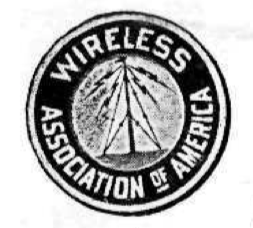

The long threatened wireless bill has made its appearance at last.

The resolution, as introduced by Representative Roberts of Massachusetts, is reprinted in detail on the following page and should be carefully read by every one who has wireless progress at heart.[^3]  Personally, the Editor believes that there is no need of a wireless telegraph board.

It is of no practical value whatsoever, un-American, and will keep down the progress of a young and useful art, which in time may develop into an as yet undreamed-of asset of the nations' power.

Wireless telegraphy and telephony, in a country of such vast distances as America is a very valuable means for cheap transmission of intelligence, and it is the duty of the Government to encourage it, and not to pass a resolution to throttle it like England and Germany have done, in which two countries the art is almost unknown.[^1]

It would be deplorable indeed to see Representative Roberts' resolution passed.  The farmer, who three years hence will be in a position to own his wireless telephone to call up his next neighbor fifty miles distant from him, will much rather install his private wireless 'phone, rather than be forced to subscribe to an exorbitant rent of an instrument owned and controlled by the United Wireless Company or some other wireless trust, to which trusts such a resolution would give full swing to extort high rates.[^2]

At first sight Representative Roberts' resolution appears very tame and gentle, but men acquainted with modern methods at Washington know full well what the "recommendations (!) to Congress" mean, with the big wireless interests dictating the "recommendations."

Despite the present telephone interests the farmer is allowed to put up his personal telephone line from his house to that of his neighbor's.  If the national wireless board comes into power, the same farmer would undoubtedly not be allowed to operate a private wireless telephone between his and his neighbor's house.

As far as wireless telegraphy is concerned, it is ridiculous to maintain now that the amateur can interfere with the business of commercial stations.

With the present efficient weeding out tuners, loose couplers, variable condensers, etc., the amateur can no more interfere with the commercial or government stations than the transatlantic liners---equipped with powerful apparatus---can interfere with the messages flashed from coast to coast.

The trouble is, that the majority of commercial and government stations have antiquated instruments, and do not care to acquire new ones.  Their operators are almost entirely wire telegraph men who have not the slightest idea of wireless, nor are they interested in it.  The Editor, who is personally acquainted with over twentyfive [sic] such operators was amazed to find that *not four of them could draw a diagram how* their instruments were connected up.

All their shortcomings are blamed on the innocent amateur, whose weak spark cannot be heard half a mile, as a rule, and the manager of the station of course takes the word of the operator every time.

There are to-day over sixty thousand experimental and amateur wireless stations in the United States alone.

That means that over sixty thousand young aspiring men stay at home evenings, enjoying an innocent sport, instead of dissipating outside in a questionable pastime.

We have as yet to find the father who objects to his son's "wireless."  He knows it keeps the boy at home, away from mischief.

The Editor sounds a general call, and asks everyone to whom wireless is at heart, to send him at once a letter of protest against the wireless resolution.  State in your letter, before all, the UTILITY of your wireless.  These letters, in mass, will be presented in Washington, to the proper officials.

All letters must be received not later than January 25th.  Act at once!

* * * * * * * * 

## National Wireless Telegraph Board Proposed

Representative Roberts, of Massachusetts, has introduced a resolution in the House at Washington providing for the creation of a wireless telegraph board.  Mr. Roberts said that there is the greatest need for such control, as he has information from the Navy Department, the revenue cutter service and the commercial wireless companies that the effect of the activities of amateur operators has been such as not only to make necessary a change from "C Q D" as the distress signal, but to interfere seriously with the operations of all Governmental and private services.  As a result of these reports, Mr. Roberts, who is a member of the House Committee on Naval Affairs, considers it high time to take cognizance of the situation.

The perfection of wireless apparatus has reached such a stage, he said, that if the service is to be permitted to grow unchecked it is absolutely essential that the Government take steps in the matter.  The simplest solution of the matter lies in the passage of the resolution presented, or a measure of similar character, placing in the hands of a wireless board the control of wireless plants afload and ashore.  It has been brought to his attention in an official way that the wireless service of the navy has been rendered practically useless at times by amateur operators, who send meaningless and oftentimes vile and unmentionable language through the air from their instruments.

Mr. Roberts' resolution authorizes the appointment of a board of seven members, "one expert each from the War, Navy and Treasury departments, three experts representing the commercial wireless-telegraph and wireless-telephone interests, and one scientist well versed in the art of electric wave telegraphy and telephony."

The duties of the board, according to the resolution, shall be "to prepare a comprehensive system of regulations to govern the operation of all wireless plants afload and ashore which come under the cognizance of the United States, with due regard alike for Government and commercial interests."

It is provided that within 30 days of the organization of the board it shall submit its report and recommendations to Congress.  To defray the expenses of the board $2,000 is appropriated.

* * * * * * * * 

## W. A. O. A.

The Wireless Association of America was founded solely to advance wireless.  IT IS NOT A MONEY MAKING ORGANIZATION.  Congress threatens to pass a law to license all wireless stations.  The W. A. O. A. already has over 3,000 members---the largest wireless  organization in the world.  When the time for action arrives, the thousands of members will exert a powerful pressure to oppose the "wireless license" bill.  This is *one* of the purposes of the W. A. O. A.  There are more.

[^3]: Congressman Ernest W. Roberts of Massachusetts's 7th District introduced House Joint Resolution 95.  Though Roberts's proposals did not go far, aspects of this Resolution were incorporated into the Radio Act of 1910 and 1912.

[^1]: "Wireless telephony" here refers to the transmission of audio without wires, rather than the morse code signaling that had already been achieved.  At this time, a point-to-point model of communication was envisioned for the wireless telephone, a medium Gernsback tried to popularize under the name "aereophony" but took hold as "radio."

[^2]: Jonathan Sterne writes on the postwar politics of rural access to television broadcasts, which encountered significant difficulties in particular geographic locations.  "Once potential audience members saw an existing system and its limits, they demanded access on the principle that television was a kind of infrastrucutre, like roads or utilities.  Issues of access and entitlement to television thus grew in importance precisely at the areas where profitability was most limited." (47)  Gernsback's emphatic declaration of wireless as a "utility" is thus an accurate depiction of how American citizens would later identify themselves within a national network of communications relays.  "Television Under Construction: American Television and the Problem of Distribution, 1926-1962" in *Television: Critical Concepts in Media and Cultural Studies,* vol. 1, ed. Toby Miller (New York and London: Routledge, 2003).

<!-- footnote info from next month's editorial, which details the strong response to this plea.  Also, the Burke Wireless Bill, published in the April issue, is fully supported by G. -->