**DRAFT:** *Please do not share without permission of the author. Typeset versions in  [web](http://gernsback.wythoff.net/191100_the_wireless_telephone.html) \| [pdf](https://github.com/gwijthoff/perversity_of_things/blob/gh-pages/typeset_drafts/191100_the_wireless_telephone.pdf?raw=true) \| [doc](https://github.com/gwijthoff/perversity_of_things/blob/gh-pages/typeset_drafts/191100_the_wireless_telephone.docx)*

* * * * * * * * 

# Preface

The present little volume is intended for the experimenter doing research work in wireless telephony and the student who wishes to keep abreast with the youngest branch of the new wireless art.

The author realizes that the fuiure use of the wireless telephone will be confined to the low power or battery system, as the present instruments, necessitating 220 and 550 volts for their successful operation, are not desirable nor practical enough for every day use.

The wireless telephone of the future must be as flexible as the wire telephone of today.

Every farmer will be able to operate his wireless telephone, when the sending and receiving  instruments will be housed in a box a foot square, without depending on the lighting current for its operation. The author predicts that in less than 10 years this stage will have been reached as it is bound to come sooner or later.

Quite a little new matter will be found in these pages and while some old matter has necessarily appeared for the sake of completeness of the book, the author trusts that the necessity of reviewing such matter will be apparent.

The author shall feel happy if this little volume will be the cause to advance the new art if ever so little, and he will be pleased to bear honest criticism and suggestions as to the contents of the book.

> H. Gensback.

> February 1910

# Chatper III: Early Experiments

Wireless telephony by electromagnetic induction is not a new invention.  It has been known for over 50 years, but its use is very limited.

One of the best and simplest devices which may be used to transmit speech over small distances up to 50 feet (through stone or wood walls) can be made as follows:

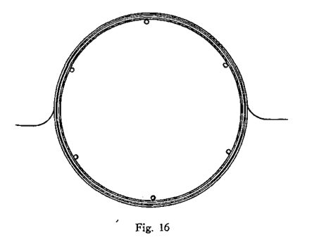

## How to Make a Simple Wireless Telephone

One the wall or on a large table tack 6 or 12 nails in form of a circle of 5 feet diameter, fig. 16.

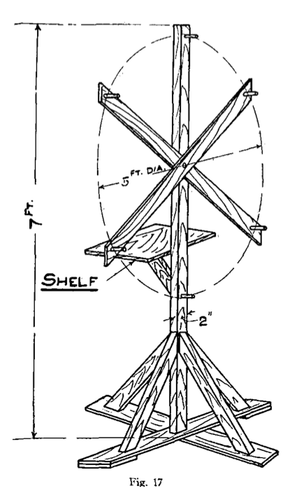

Around the nails wind 80 turns of No. 28 B. & S. wire, enameled wire preferable. Bring out two leads as shown. When completed, wind tape around the coil so the turns will not unwind.  Two layers of tape are advisable as the finished coil will be somewhat stiffer then.

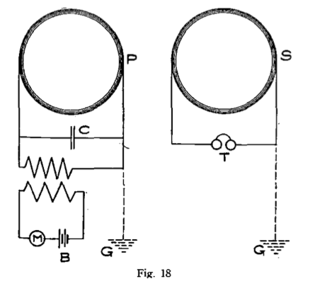

This coil is the secondary.

On the same nails wind 40 turns of No. 18 B. & S. wire and finish it with tape the same as secondary.

This coil is the primary.

Two portable wood  stands  should  then  be  built of wood laths  as per  dimensions  shown  in  fig.  17. A  shelf  is also  provided  on  which  to  place  the  instruments

Each wire coil is attached to stand as shown in dotted lines.

Fig. 18 shows the connections.

P is the primary coil, M a common microphone transmitter, B 6-10 cells, C a condenser composed of 50 sheets of tinfoil 5x3 inches with parafined paper between the sheets.

H is a medium size medical coil (without vibrator).  The primary is connected with M-B, the secondary with C-P.

S is the secondary, to the ends of which is connected an ordinary telephone receiver, or better, a set of double head receivers similar to those used in wireless work.

It is important that both coils face each other, as they do not work wen placed otherwise or at too great an angle.

It has been found that the ground G (shown in dotted lines) sometimes helps to increase the sound, this also is the case of condenser C, which improves the whole arrangement a good deal.  This arrangement has little value and is only used for demonstration purposes, and works up to 50 feet.

The use of an aerial does not seem to improve it.

The outfit may be regulated by cutting in more or less battery at B till best results are obtained at the receiving end.

## Closed Circuit Wireless Telephone

We must also mention another method of wireless telephony, namely, the closed circuit wireless telephone.

Like the induction telephone, the closed circuit systems are of litte value, the greatest distance so far covered being 3 1/2 miles.  Fig. 19 shows the sender.  Two copper plates 2 feet square are sunk in the ground about 4 feet deep.  The plates must be sunk in edgewise at right angles with the surface of the earth as shown in illustration.

To telephone up to a distance of 500 yards, the two plates must be 25 yards apart from each other, for shorter or greater distances, the plates must be separated proportionately to above figures.

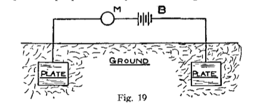

M is the microphone, B the battery.

The receiver is shown in fig. 20.  T is a telephone receiver of 50 or 75 Ohms.  The lower the resistance the better the results.  Two copper plates are provided again, of the same size as those of the sender and spaced the same distance apart as those of the sending station.

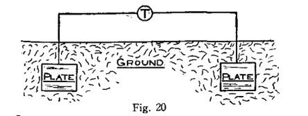

It is very important that the two plates of the sender face the two plates of the receiving end, else no results will be had.

This system may be used successfully to telephone between two houses and will give the experimenters quite a little diversion.

## Author's Experiments

The author, in 1903, was able to telephone over a distance of 3 miles by using the arrangement as shown in figs. 21 and 22.

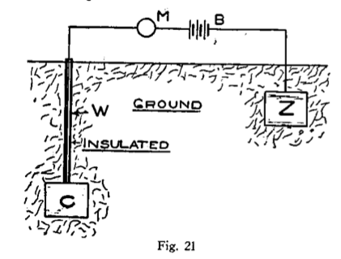

Two plates, fig. 21, 3 feet square, one of copper and the other of zinc, were sunk in the ground in such a manner that C was buried 15 feet deep Z only 3 feet below the surface.  Microphone M and battery B were provided as shown.  At the receiving side, two similar plates of similar size C1 and Z1, were sunk in the same fashion, the only difference being that the plate at the right was buried 15 feet, while that at the left only 3 feet below the surface.

The plates of the sender face those of the receiver.

The perpendicular distance of C and Z was 300 yards, that of Z1 and C1 the same.

The wires, W and W1, leading to C and C1 were carefully insulated and around all plates a saturated solution of chloride of zinc was poured.  This had a double effect.  Firstly, it set up an electromotive force between all the plates, and, secondly, chloride of zinc being very hygroscopic, it kept the earth moist and conductive around the plates.

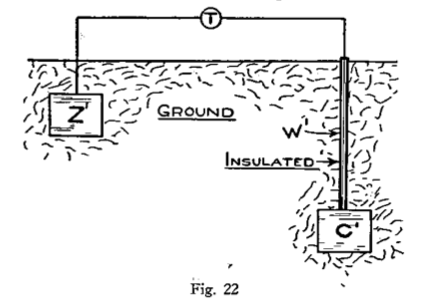

The system proved very successful and was in use for over 8 months.

## Armstrong & Orling System

Another method to telephone wirelessly by the conductive method is described in U. S. Patent No. 744,001 by T. J. Armstrong and A. Orling.

This invention relates to means and apparatus for the transmission of speech and other articulate sounds to a distant receiver or receivers without the employment of wire or other like connection between the transmitter and the receiver, and has for its object the improvements hereinafter set forth.

In carrying out this invention the inventors provide the transmitting apparatus with two or more earth connections, through which are conducted a combination of high-potential discharges and low tension currents whose circuit or circuits are completed through numerous lines of current-flow which traverse the earth.  The transmitted impulses enter the earth by one of the same earth connections and after traversing the same return to complete the other.  This receiving apparatus (hereinafter described) is also provided with two or more earth connections which are adapted to cut the said lines of current-flow (in the neighborhood of the distant receiver) at points of different potential, causing some of the transmitted energy to pass through them and to actuate the receiver.

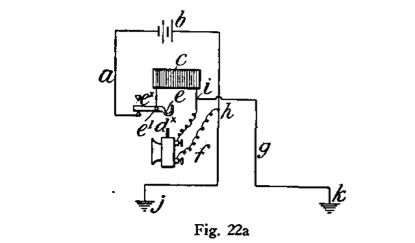

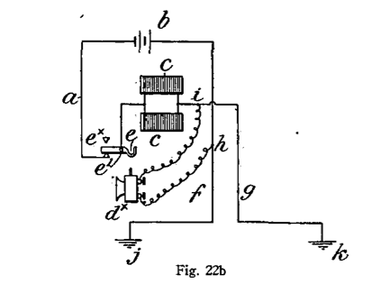

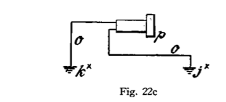

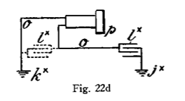

Fig. 22a shows one form of transmitter.  Fig 22b shows a modified form thereof, and Figs. 22c and 22d are respectively different forms of receiving apparatus adapted for use with the transmitter.

According to the arrangement shown in Fg. 22a, they employ an electric circuit a, which is provided with a battery b, or other convenient source of energy, a self-inductance coil c, a microphonic or any other suitable telephone-transmitter dx, and a switch ex which is pivoted at e1 and provided with a hook e2, upon which the transmitter dx is adapted to hang when not in use, so that its weight may cause the said switch to open the circuit.  Suitable connections f and g are made with the circuit a at h and at i on opposite sides of the transmitter dx and are respectively led to earth at j and k in such a manner that the earth is in shunt-circuit.

According to the construction shown in Fig. 22b, a plurality of self-inductance coils c is employed.

In operation the varying resistance of the transmitter dx causes a fluctuating current to pass through the coil or coils c, with the result that "extra" currents are induced, the circuit of which is completed through the transmitter dx and the earth, which is in shunt thereto.  At each increase in the resistance of the transmitter dx a larger proportion of the low-tension-battery current will pass through the earth with a large proportion of the induced direct high-potential extra current.  At each decrease in the resistance of the transmitter dx a larger proportion of the battery-current will pass through the coil or coils c and a large proportion of the induced inverse high-potential extra current will pass through the earth, owing to the resistance of the transmitter dx and the opposing electromotive force of the battery-current.  The electrical effects that are thus led to earth at j and k (which connections are preferably as far apart as practicable when communication is carried on over great distances) set up lines of current-flow which extend to very considerable distances and are intercepted in the neighborhood of the receiver (see Figs. 22c and 22d) by its earth connections jx and kx.  These connections, with the receiving part o of the circuit constitute a species of shunt through which some of the transmitted energy flows.

The receiving apparatus consists of a telephone p, by means of which the passage of the transmitted energy through the receiving shunt o may be detected.

In some cases they employ a condenser lx, as shown either in full or dotted lines in Fig. 22d, to obviate the effect of earth-currents.