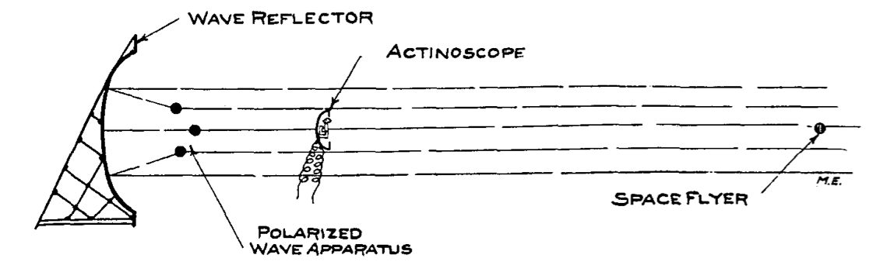
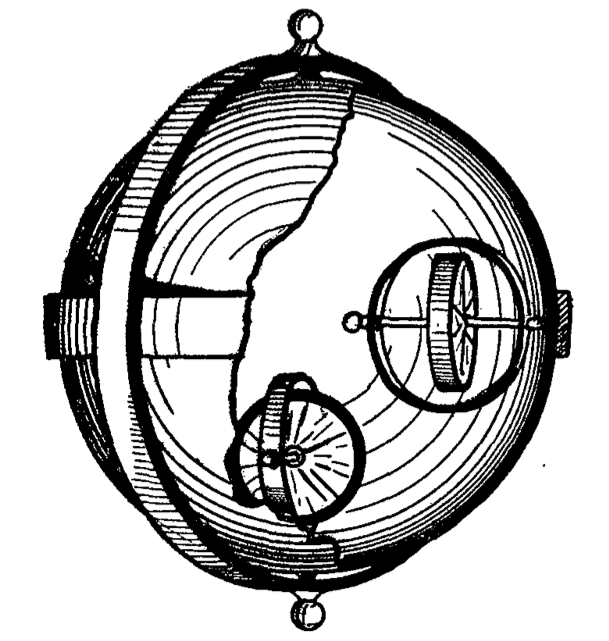

**DRAFT:** *Please do not share without permission of the author. Typeset versions in  [web](http://gernsback.wythoff.net/191112_ralph9.html) \| [pdf](https://github.com/gwijthoff/perversity_of_things/blob/master/typeset_drafts/191112_ralph9.pdf?raw=true) \| [doc](https://github.com/gwijthoff/perversity_of_things/blob/master/typeset_drafts/191112_ralph9.docx)*

* * * * * * * * 

**A**T first thought it might be considered a difficult feat accurately to locate a machine thousands of miles distant from the earth, speeding in an unknown direction somewhere in the bottomless universe. The feat, while remarkable, is easy to accomplish by any up-to-date scientist. As far back as the year 1800 astronomers accurately meas- ured the distance between the earth and small celestial bodies, but it was not until the year 2659 that the famous scientist 124C 41 succeeded in accurately determining the location and distance of space flyers, far out in space, where not even the most powerful telescope could follow any more.

It has long been known that a pulsating polarized ether wave, if directed on a metal object, could be reflected in the same fashion as a light ray can be reflected from a bright surface or from a mirror. Moreover, the reflection factor varies with different metals. Thus the reflection factor from silver is 1,000 units, the reflection from iron 645, alomagnesium 460, etc. If, therefore, a polarized wave generator were trained towards the open space, the waves would take a direction as shown in diagram, providing the parabolic wave reflector was used as shown. By manipulating the entire apparatus like a searchlight, waves would be sent over a large area. Sooner or later, if the search is kept up, these waves must come in the direction of a space flyer. Then a small part of the waves would strike the metal body of the flyer, and these waves would be reflected back to the sending apparatus. Here they would fall on the *Actinoscope* (see diagram), which records only the reflected waves, not the direct ones.

From the actinoscope the reflection factor is then determined, which accurately shows frgm which metal the reflection comes. From the intensity and the elapsed time of the reflected impulses, the distance between the earth and the flyer is then accurately calculated with but little trouble.

The reflection factor of magnelium (the metal of which Fernand 600 lO's machine was constructed) being 1060, Ralph located his rival's space flyer in less than five hours' search. He found that 600 lO's machine at that time was about 400,000 miles distant from the earth and that the abductor of his sweetheart apparently was headed in the direction of the planet Venus. A f ew seconds' calculation showed that he was flying at the rate of about 45,000 miles per hour. This was a great surprise for Ralph and it delighted him at first. He knew that 600 lO's machine was capable of making at least 75,000 miles an hour. This was certainly as strange as it was puzzling. Ralph reasoned that if he were in his rival's place, he certainly would speed up the flyer to the utmost. Why then was 600 10 flying so leisurely? Did he think himself secure? Did he think that nobody could or would follow ? Or did he have trouble with the Anti-Gravitator? Ralph could not understand it. However, his mind had already been made up. He would of course chase his rival, head him off, and, if necessary,---yes, he would kill him.

He gave sharp and quick orders to his attendants and ordered his space flyer, the "Cassiopeia," to be made ready within one hour. Provisions sufficient to last for six months were put on board and Ralph himself brought a large number of scientific instruments to the flyer, many of which he calculated might turn out to be usef ul. He also ordered a large amount of duplicate parts of the flyer's machinery to be put on board in case of emergency, and he then bade farewell to his family.

Although this was, of course, not the first time he journeyed into space, the members of his immediate family were greatly concerned, as they had guessed by this time that Ralph's rival was a formidable foe, one that was not easy to subdue. They knew it would be useless trying to dissuade Ralph from his project ; they knew his inflexible will too well. But one member of his family, who perhaps more than any one desired Ralph to stay, thought of a little ruse, which was shortly to give the young inventor a big surprise.

Everybody of course thought that he would take at least Peter, his faithful butler with him, but to everyone's astonishment he announced that he would go alone. He said that if his rival had no man companion, he certainly would not want any. The fight was to be man to man, brain against brain. As Ralph put it:

"To-day it is not the man that counts. I will show this dog what an up-to-date scientist can accomplish. Iwill demonstrate to the en- tire world that crimes of this kind are no longer necessary nor tolerable."

He said this in front of his space flyer, which by this time was in readiness on the platform of his tower. He then shook hands all around and bade everyone adieu, mentioning that he would be back within at least ten days. He was already on the running board of his flyer when the surprise came, in the shape of a government aero-flyer. A smartly uniformed ycmng man jumped on the platform beside Ralph, before the aeroflyer had even stopped. In a flash the uniformed government official had produced a transcribed telegram which he handed Ralph with the officious words:

"Message from the Planet Governor !"

Ralph, turning slightly pale, broke the seal of the wrapper, and unfolded the document. It read:

*Unipopulis, Sept. 34th, 2660.*

Planet Governor's Capitol.

Sir:

I have just received the sad intelligence of your misfortune.

Allow me to extend to you my sincere sympathies.

I will this af ternoon place at your disposal six Government space flyers, which you may use as you see fit.

I must, however, caution you not to enter into the pursuit in your own person. 

As Planet Governor it is my duty to advise you that you have not the right to place your person in unnecessary danger, your life being considered too valuable to society.

Allow me furthermore to point out to you that under the law "+" scientists are not allowed to endanger their lives under any circumstances.

For this reason I command you not to leave the earth without my permission.

I have ordered your space flyer to be guarded.

You will not touch it as long as my private standard flies over your machine.

In high esteem,

WILLIAM KENDRICK 21K 4,
*The 18th Planet Governor.*

To
Ralph 124C 41+, New York.

Ralph read the radiogram twice in succession, then he folded it slowly and deliberately thrust it in his pocket. He seemed greatly annoyed and to all appearance did not know what to do.

He then slowly withdrew his hand from his pocket, and extending it to the government official, said :

"Well, Isuppose Ihave to obey orders."

The official took the proffered hand, and no sooner had he grasped it than he stiffened up and became as rigid as a stone.

With one bound Ralph jumped into his machine and cried to the stupefied little audience : "Don't worry about him. Ipricked his hand with a little Catalepsol, in fif teen minutes he will be all right again."

With that he slammed the door of his space flyer shut and simultaneously the machine rose as if shot from a cannon, with a terrifying speed, and in ten seconds was lost to all sight.

A f ew words as to the space flyer mentioned in this narrative will perhaps interest some of the readers who have not had a chance to read up on the subject.

Ever since the dark ages of humanity, men have had a powerf ul, singular longing to leave the earth and to visit other heavenly bodies. Towards the end of the twenty-first century, when atmospheric flying had become general, men began seriously to think of constructing machinery by means of which man could leave the confines of the planet to which humanity had been chained for ages.

Towards the beginning of the twenty-second century economic conditions had become acute and the enormous population of the earth, which at that time already had passed the twelve billion mark, clamored for an adequate outlet which the planet itself could no longer furnish.

The moon was regarded with longing eyes, and although that body was known not to have any atmosphere and also was considered sterile, the up-to-date scientists and engineers could in a few years time make the moon habitable, without any doubt.

Atmospheric flying machines were of course totally unsuited, as they could never even reach the boundary of the earth's atmosphere, which is but forty miles· from the surface of the earth.

Obviously to reach the moon or other celestial bodies, it was necessary to invent a machine which could overcome the enigmatical force known as the earth's gravity, which chains all bodies to the planet.

A multitude of inventions and suggestions were made, but none proved to be of any value until the Anti-Gravitator was invented by the American 969L 9 in the year 2210.

This scientist had made extensive studies on the gyroscope and he had finally evolved a 'machine which when set in motion would rise freely into the air, and continue to rise as long as power was supplied.

The action, moreover, is purely gyroscopic. The principle in short is as follows:

969L 9 took a large hollow sphere (the rotor) in the inside of which he built a number of independent gyroscopes, all of which traveled in certain orbits. The large sphere which hung in a gyroscopic frame was made to spin around its axis at an enormous speed. This sphere now acted the same as the fly-wheel of a gyroscope and as such was not influenced by the so-called horizontal gravity. As in the case of an ordinary gyroscope, its axis would always be in a vertical line as long as the spheric rotor was in motion.

If now, however, the independent gyroscopes in the inside of the sphere were set in motion by means of electrical current, the Vertical Gravity (weight) would be overcome at once---the entire contrivance would rise into the air, its rising or lif ting speed to be directly proportional to the speed of the enclosed gyroscope rotors.

The anti-gravitators in the course of time were greatly perf ected, and to-day it is pos- sible to lif t a weight of 1,000 Kilograms with anti-gravitator weighing but 12 Kilograms, strange as it may seem.

Space flyers for a good reason have from six to twelve large anti-gravitators attached at various points over their shell, all of which work in unison, or, if desired by the operator, only certain ones are operated in order to "steer" in a different direction.

Let us now return to Ralph, af ter our little scientific excursion.

As the space flyer rushed through the atmosphere, the friction of the machine against the air made the interior of the flyer uncomfortably hot for a short while, although a space flyer has triple walls, the spaces between the walls being filled up with the best heat insulating materials.

Af ter the flyer, however, had lef t the atmosphere, the stellar cold soon cooled off the machine.

Ralph then took his bearing, af ter he had verified, by means of the polarized wave transmitter on board the machine, that 600 lO's flyer was still going in the same direction as before he lef t the earth. He then locked the steering wheels and the space flyer continued its journey in a straight line towards the machine of his rival.

This done, Ralph then sent off a radiogram asking the Planet Governor's indulgence for disobeying the law and explained that he would rather have died than stay on earth without making a personal effort to snatch his fiancee from the hands of "that monster 600 10."

This accomplished, he took his first look at the earth, which, as he was moving at the rate of 80,000 miles an hour, had shrunk to the dimensions of a medium-sized orange. Inasmuch as he was flying towards the sun, the earth, being directly in line with his machine and the sun, was fully lighted and appeared like the full moon. The continents and the oceans were visible most of the time, but more of ten were hidden from view by mist or clouds.

The general aspect of the earth as seen from Ralph's flyer was that of a delicate faint red ball with white caps at each of the poles. The reddish hue of the ball is due to the earth's atmosphere, the white caps are the snow around the globe's poles.

The brilliantly lighted earth was silhouetted against the inky black sky in a sharp contrast.[^1] The moon, hidden behind the earth, was not in evidence, when Ralph first looked earthward.

The stars shone with a brilliancy never seen on earth ; distant stars which ordinarily cannot be seen, except with a telescope, are plainly visible to the naked eye, in the outer space.

The sun shone with a dazzling brilliancy in a pitch-black sky, and to look directly into its rays was enough to blind one for life.

The heat of the sun in the outside space when striking objects is tremendous. If one holds one's hand against a glass window of the space flyer where the sun can strike it full, the hand will be burned in a f ew seconds.

There is of course no night in the outer space (within the bounds of our planetary system) the sun shines all the time, uninterruptedly.

Time is an unknown quantity. If it were not for the chronometer, reeling off seconds and minutes according to the earth's standard, time in a space flyer would stand still.

Wonderful as these things are to the man who never left the earth, the phenomena encountered inside of a space flyer in the outer space are still more wonderf ul and amazing.

We know that "weight" is synonymous with the gravity of the earth. The larger a celestial body, the greater its gravity. The larger such a body is, the more strongly it will attract its objects. The smaller the body, the smaller its force of attraction.

Thus a man weighing eighty Kilograms on a spring scale on the earth, would weigh but thirty Kilograms on the planet Mars. On the sun, however, he would weigh 2232 Kilograms, and so on.

In the inside of a space flyer, which has an infinitely small gravity, objects weigh practically nothing. They are heaviest near the walls of the machine, but in the exact center of the flyer, all objects lose their weight entirely. Thus any object, no matter what its weight, will hang freely suspended if placed in the center of the space flyer. It cannot fall up, nor down, it will hang stationary, motionless, like a balloon in the air, without any physical means of support.[^2]

The occupant of a space flyer, being relieved of practically all his weight, moves around with astonishing ease. He almost floats around the machine. No physical labor is exerting. The biggest table is no heavier than the lightest match. The human body can perform an incredible amount of work without tiring in the least and without any apparent effort.

One can walk up the walls or walk "upside down" on the ceiling without any danger of falling, as there is no "up" or "down" in outer space.

Lif e seems too pleasant and beautif ul to be true on board of a space flyer. The body, relieved of the great weight to which it is accustomed on earth, experiences a wonderful feeling of well-being impossible to describe.

One never can f eel tired, no matter how hard one works physically, as nothing is hard to do, nothing having any weight, not even one's own body.

*Sleep, in a space flyer is practically impossible.* There being nothing to tire one, sleep is unnecessary. Dozing off is all one can do, and that can never last long, except after strenuous mental work.

As long as a space flyer is not too far distant from the sun (within the orbit of Mars, at least), little artifi.cial heat to warm the flyer's interior is needed. The sun heats up one-half of the flyer's shell to a fierce heat, but the side turned away from the sun is exposed to the terrible stellar cold (absolute zero) and thus a fairly comfortable temperature is the result.

The air supply is manufactured by chemical means on board, but very little is needed, as the original supply taken from the earth is used over and over by working up the carbonic acid by means of automatic generators.

It is of course of the utmost importance ' that no porthole or doors leading to the outside be ever opened as long as the flyer is in the outer space. The result would be that the air would rush from the flyer instantly, resulting in a perfect vacuum in the inside of the space flyer, which of course would kill every living being almost instantly.

The steering of a space flyer is accomplished as follows :

The farther away the flyer is from a celestial body, the less its speed need be. There arc of course exceptions to this. Thus between every two celestial bodies a point will be found where the attraction that one body exerts on the other is zero. If the flyer is brought to this point its gyroscopes can be 'at rest, as the machine will not be attracted by either body. It will "hang" between the two the same as an iron ball will hang between two powerful magnets if carefully balanced. Give it the slightest push, however, and the ball will fly to either of the magnets.

The same is true of a space flyer, between two bodies at the "zero point." If it moves over that point it is immediately attracted by one of the bodies, and if its gyroscopes refuse to work, the flyer will be dashed to pieces against the attracting body.

If, however, the space flyer comes to rest at the "zero point" it will begin to turn around its own axis, at the same time it will move in an elliptical orbit around the sun---our space flyer has become a tiny planet, and as such is subject to the universal laws of the planetary system.

From this it will be easily undestood that it is not hard to steer a space flyer ; the nearer it comes to a celestial body, the faster the gyroscopes must work, the further it draws away from a celestial body the slower the gyroscopes must work.

Af ter Ralph had thoroughly inspected the entire flyer he devoted his full attention to the course of his rival's machine. At the rate at which he was flying he calculated that he would overtake Fernand 600 10, in ten hours, providing the latter did not in the meanwhile increase his speed.

His rival, when Ralph lef t the earth, had a handicap of 400,000 miles. He was moving at the rate of 45,000 miles an hour, Ralph's machine had made 80,000 per hour since its start from the earth. Thus if everything went well he would overtake his rival in about ten or eleven hours.

As there was nothing else to do, he busied
himself in the laboratory near the conning tower in the top of the flyer, and the hours went by rapidly.

At the end of the ninth hour he finally spied 600 !O's machine through his telescope. He then tded to signal by wireless to the other flyer, but his rival either did not hear or else did not care to answer.

At the end of the eleventh hour since his departure from earth, his machine drew up within a f ew hundr!'d meters of his rival's. Af ter careful manoeuvering he brought the machine still closer to the other one, and looking through one of the heavy plate windows he saw the strangely drawn up, ghastly white face of his enemy.

Ralph moved a f ew levers and then closed a switch. A hissing sound was heard, and Fernand 600 10 could be seen falling backwards, the window through which he had just looked turning green at the same time.

Ralph had struck his enemy senseless by means of his Radioper f orer.

In a f ew minutes he had anchored his flyer to the other one by means of a powerful electro-magnet. He then pushed. the enclosed connecting tube of his flyer into the tube-joint of 600 lO's machine. With great care he made the joint air-tight and then he opened the porthole and in high excitement crawled through the tube into the other flyer.

He was as happy as a school-boy; he had conquered his enemy and in a minute his sweetheart would be in his ams ! Arrived at the other end of the tube, he made sure that the joint was air-tight before he moved on.

600 10 lay on the floor and in a twinkling Ralph had bound him with the rope he had brought along.

In high excitement he bounded upstairs, where he knew Alice's quarters must be. '

Arrived on the next floor he stood still for a moment and listened. There was no sound, except for the gentle purring of the gyroscope machinery.

He went from one room to another and finally found what he was sure must IJe Alice's room. The door was open. He entered with a strange f eeling of dread. The room was empty. It furthermore appeared that the room had never been used.

In terror Ralph ran from one end of the flyer to the other, from the top to the bottom. He looked in every corner, in every closet. He did not see Alice nor her maid. Where were they hidden ? To make sure he went all over the ground again in a more thorough
manner.

Af ter a most careful search he limply f ell into a chair, and buried his face in his hands.

*Alice was not on board the flyer!!*

(To be continued.)

[^1]: In the outer space the "sky" is dead black ; the blue color of the sky as seen f rom the earth ls due to the atmosphere. The real sky ls colorless.

[^2]: It is well known that if a shatt were sunk to the center ot the earth, an object placed there would stay suspended.