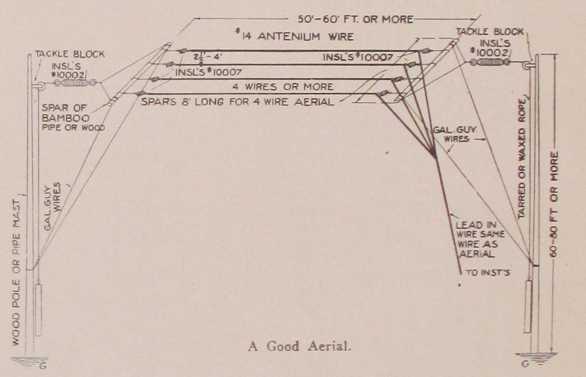
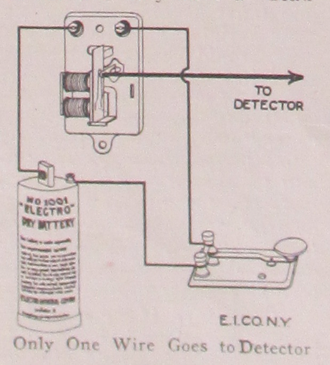
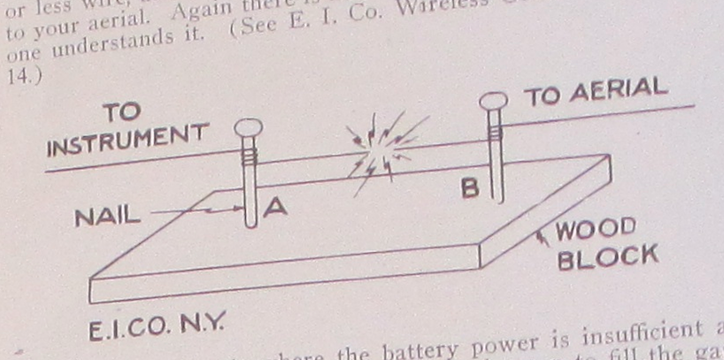
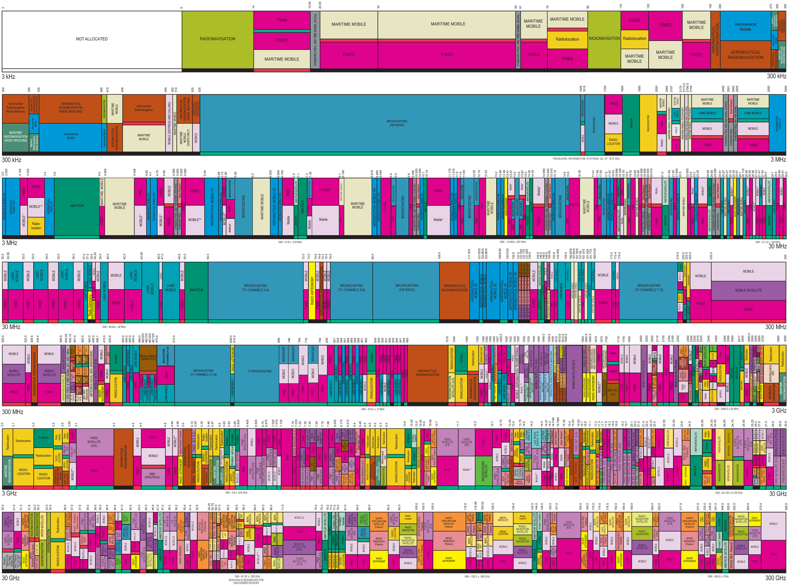
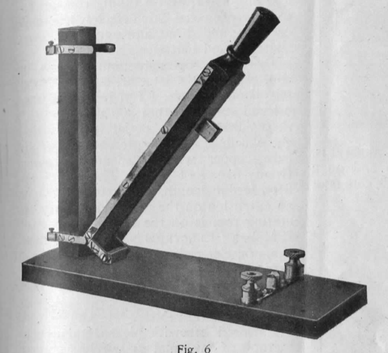

**DRAFT:** *Please do not share without permission of the author. Typeset versions in  [web](http://gernsback.wythoff.net/191305_our_cover.html) \| [pdf](https://github.com/gwijthoff/perversity_of_things/blob/gh-pages/typeset_drafts/191305_our_cover.pdf?raw=true) \| [doc](https://github.com/gwijthoff/perversity_of_things/blob/gh-pages/typeset_drafts/191305_our_cover.docx)*

* * * * * * * * 

# Part One

**O**N December 13, 1912, the new wireless law went into effect.[^ee]  The average wireless "fiend," who has not followed the topic from the start will be interested in the following facts:

The very first talk about Wireless Legislation in the country started in 1908.  The writer in his Editorial in the November, 1908 issue of *Modern Electrics* pointed out that a wireless law was sure to be passed in a very short while.[^wj]  In order to guard against unfair legislation as far as the wireless amateur was concerned the writer, in January, 1909, organized the "Wireless Association of America."[^wf]  This was done to bring all wireless amateurs together and to protest against unfair laws.  Previous to this time there was no wireless club or association in the country.  In January, 1913, there were over 230 clubs in existence, all of which owe their origin to the "Wireless Association of America."

The association had no sooner become a national body than the first wireless bill made its appearance.  It was the famous Roberts Bill, put up by the since defunct wireless "trust."  The writer single handedly, fought this bill, tooth and nail.  He had representatives in Washington, and was the direct cause of having some 8,000 wireless amateurs send protesting letters and telegrams to their congressmen in Washington.  The writer's Editorial which inspired the thousands of amateurs, appeard in the January, 1910, issue of *Modern Electrics.[^rb]  It was the only Editorial during this time that fought the Roberts Bill.*  No other electrical periodical seemed to care a whoop whether the amateur should be muzzled or not.  If the Roberts Bill had become a law there would be no wireless amateurs today.

\begin{center}
\fbox{
  \parbox[c]{7cm}{
  
BY presenting our friends with the first number of the "Electrical Experimenter," we believe that we are covering a field in electrical literature which heretofore has been exploited but little.

\vspace{3mm}

Our sole aim will be to benefit only one class of readers, namely, the electrical experimenters.  This journal will not publish general electrical articles, believing that there are several excellent publications in the field already which publish such matter successfully.

\vspace{3mm}

We invite our readers to contribute articles to this journal and we will pay well for all accepted matter.  New experiments, new designs of electrical apparatus, new electrical tricks, etc., will be welcomed; good photographs are especially desirable.

\vspace{3mm}

We are conceited enough to think that this is the kind of a publication that appeals to you.  We furthermore have a strong "hunch" that you will find five cents worth of new, interesting reading matter within its pages.  For that reason we decided not to place any subscriptions on the free list, not excluding our best and oldest friends.

\vspace{3mm}

We confidently believe that when we ask you to send us 50 cents for a one year's subscription, we are asking but little of you.  As a matter of fact, it is a very small sum considering that the "Electrical Experimenter" will "keep you going" for a whole year; that it only caters to YOU, and that last but not least, it will always contain 96 per cent. of text matter.  This publication, as you may know, accepts no advertisements.

\vspace{3mm}

If you like the "Electrical Experimenter"---and we have fond hopes that you do---tell your friends about it, and let them ask for a free sample copy.

\vspace{3mm}

"Boost the 'Electrical Experimenter' and you boost yourself."
  }
}
\end{center}

That editorial quickly found its way into the press and hundreds of newspapers endorsed the writer's stand.  During January 1910, the *New York American*, the *New York Independent*, the *New York World*, the *New York Times*, the *Boston Transcript*, etc., all lauded and commended the writer's views.  Public sentiment quickly turned against the Roberts Bill and it was dropped.

The first wireless bill not antagonistic to the amateur, The Burke Bill, appeared on March 8, 1910.  It had some defects, however, and was dropped also.

The Depew Wireless Bill appeared May 6, 1910, but did not meet with general approval; as the writer pointed out in his Editorial in the June, 1910, issue of *Modern Electrics,* it had several undesirable features, and the bill was never seriously considered, although it actually passed the Senate.  

At last the Alexander Bill made its appearance on December 11, 1911.  This bill as far as the amateur was concerned was not quite acceptable to the writer, who had the amateurs' rights at heart, and steps were immediately taken to bring about an amendment as the writer, perhaps, more than anyone else, realized that this bill, in some form or other would become a law sooner or later.  This is clearly stated in his Editorial in the February, 1912, issue of *Modern Electrics.[^ab]  In that Editorial is to be found also the first and now historical recommendation that if a wireless law was to be framed it should restrict the amateur form using a higher power than 1 kw, and his wave length should be kept below 200 metres.*  No one else had thought of this before, and it is to be noted that when Congress finally passed the present wireless law, *it accepted the writer's recommendation in full,* thus paying him the greatest compliment, while at the same time acknowledging the fact that he acted as the then *sole* spokesman for and in behalf of the wireless amateur.

In March 1912, the writer, in a letter to the *New York Times* (See page 24, April, 1912, issue *Modern Electrics*) pointed out the shortcomings of the Alexander Bill, and protested against unfair legislation.

*The Times,* as well as a host of other newspapers, took up the cry and published broadcast [sic] the shortcomings of the Alexander Bill.

All this agitation had the desired effect and Mr. Alexander for the first time realized that the amateur could not be muzzled, especially when there was such a periodical as *Modern Electrics* to champion his cause.  Promptly in April the Alexander Wireless Bill, *amended,* appeared and here for the first time in history the amateur and his rights are introduced in any wireless bill.

Mr. Alexander and his advisers accepted the writer's recommendation as set forth in his Editorial in the February, 1912, issue of *Modern Electrics.*  (See Paragraph 15, 2nd Part of this Treatise.)

It will be noted that it copied the writer's recommendation word for word.

The amateur has at last come into his own.  This is all the more remarkable as this is the only country that recognizes the wireless amateurs.

On May 7, 1912, the Alexander Bill, amended, now known as S-6412, passed the United States Senate and on May 8th was sent to the House of Representatives and referred to the Committee on the Merchant Marine and Fisheries.

The bill was signed on August 13th by President Taft, thus making it a law.

This terminated the fight which the writer has waged single-handedly for almost five years in behalf of the American amateur.

Now that it is all over, and that Uncle Sam has set his seal of approval upon the amateur's wireless, the writer cannot but extend his heartiest congratulations to the 400,000 American amateurs; and he furthermore wishes to extend his thanks to all the amateurs who have supported him in his fight to bring about a new wireless era in America.

Long live the Wireless!  Long live the Amateur!!

# Part Two: Wireless and the Layman

## Receiving Wireless Messages.

The question we hear from most beginners is:---"What outfit do you advise me to use?  I know nothing about wireless."

We advise the use of ANY honestly built receiving outfits.  Which one to choose depends upon yourself, your taste and your pocketbook.  This is where YOU must decide.  Of course the lower priced outfits have naturally a short range---they won't catch messages hundreds of miles away, and those without tuning coils cannot be used to "cut out" one of the messages when two of them are in the "air" at the same time.[^tun]  It is self-evident though, that you can start with the very cheapest outfit,---say an E. I. Co. detector and a pony telephone receiver.[^pon]  With such an outfit messages can be picked up astonishingly well indeed.  Many of our enthusiastic young friends started with such an outfit and kept on adding instruments till they finally had up-to-date stations.

The next question hurled at us is:---"How can I receive messages if I don't know the codes?"

A wireless telegram, no matter if it is in Chinese or English, "comes in" in dots and dashes.  When you have the telephone receivers to your ear and a message is coming in, you hear a series of long and short, clear, distinct buzzes.  A long buzz is a dash, a short buzz is a dot.  The E. I. Co. sell a 10c code chart by means of which the dots and dashes are translated into letters.  Thus (in the Morse code), dash, dash, dot, stands for the letter G; dash, dash means M, dash, dot, dash, dot means J and so forth.  Any person with a few weeks' practice "listening to the wireless" can master the code, and read the messages with ease.

*Remember that there are over two thousand high powered wireless stations in this country alone, each being able to transmit messages of over a thousand miles distance!*

There are almost at any minute, during night and day, messages in the air, no matter where you are,---sending YOU messages, only waiting to be picked up by you.  It is truly wonderful; it is the cheapest as well as the most elevating diversion known to modern man, the most inspiring example of the triumph of mind over matter.

"How about the Wireless Law?", you want to know next.

The law does not apply for stations used for *receiving* only.  *There is no law which forbids you to receive all the messages you wish.*  You can receive as many and as long as you please,---Uncle Sam doesn't mind.  But you MUST preserve the secrecy of the message.  You must not make use of any information you receive by wireless, if this information is of such a nature that makes it private property.  Your own conscience will tell you which message to keep secret and which one you can make use of.[^pvt]  Here is the text of the Law:

## Secrecy of Messages.

*"Nineteenth.  No person or persons engaged in or having knowledge of the operation of any station or stations shall divulge or publish the contents of any messages transmitted or received by such station, except to the person or persons to whom the same may be directed, or their authorized agent, or to another station employed to forward such message to its destination, unless legally required to do so by the court of competent jurisdiction or other competent authority.  Any person guilty of divulging or publishing any message, except as herein provided, shall, on conviction thereof, be punishable by a fine of not more than two hundred and fifty dollars or imprisonment for a period of not exceeding three months, or both fine and imprisonment in the discretion of the court."*

Of late a great many stations are beginning to use the wireless telephone.  This art is rapidly being perfected and is the coming thing in "Wireless."  There is hardly a week that you do not read about some new wireless telephone and some new distance record established.

It is of course understood that any receiving apparatus that can receive wireless telegraph messages, 90 times out of 100, can receive wireless telephone messages.  Of course, in that case no code is required as the voice comes through the receiver the same as through the regular telephone.  (For futher details on Wireless Telephony, see "The Wireless Telephone," by H. Gernsback, at 25c; also Lesson No. 18 of the E. I. Co. Wireless Course.)

## Distance.

The question asked mostly by the layman is: "How far can I receive with such and such an outfit, my aerial being so high and so long?"

Nobody can correctly answer such a question.  You can reason it out as well as we can.  For example:  Would you ask us:  "How far away can I hear the steam whistle of the X & Y Cotton Mill?"  No, you wouldn't, for it all depends.  First, how hard the whistle blows, second, how good your hearing is, third, how the wind blows, and fourth, how many and how great are the intervening objects between the whistle and your ear.  Some days you may hear the whistle two miles off with the wind blowing your way.  Or if you are way down in the cellar you may only hear it faintly, although you are but two blocks away from it.  It all depends.  The one thing you are sure of is that the whistle blows with about the same strength each day.  The same reasoning holds true for wireless to a very great extent.

As a rule, the higher up and the bigger your aerial, the better the wireless reception will be.  Naturally if you are a thousand miles off from a station that can but send 500 miles, you won't hear it, no matter how  good your instruments are.  It's like trying to hear the sound of a whistle 10 miles away from you, that can at the very best be heard only within a radius of 5 miles.

Just use a little horse sense and you can do your own deducting:  no wireless expert is required.  It is also evident that the messages cannot come in with the maximum loudness unless the instruments are well in tune, and unless well designed instruments are used.  Thus a loose coupler will give louder signals than a small tuning coil.  It also depends a lot on the detector and its adjustment.

This is the way the detectors range according to their sensitiveness:

1st.  The Audion (the most sensitive detector to date); 2nd, The Electrolytic; 3rd, The Peroxide of Lead; 4th, The Perikon; 5th, Zincite and Bornite; 6th, Silicon and Galena; 7th, Iron Pyrites (Ferron); 8th, Carborundum; 9th, Molybdenite.  (See Lesson No. 10, of the E. I. Co. Wireless Course, on Detectors.) [^cry]

If you are entirely surrounded by high mountains or steel buildings, you naturally will not expect to receive messages as well as if you were on the top of a mountain.  Also remember that wireless waves travel *twice as far over water as over land,* and that you can reach *twice as far after sundown than during the daytime.*[^wea]

## Wave Lengths and Tuning.

This seems to be the greatest stumbling block for most beginners.  Again let us make a comparison.  Take two pianos and place them in the same room.  Or two violins will do as well.  Tune two strings, one on each instrument, so both will give exactly the same note.  Pick one of the strings in order to sound it, and the other "tuned" string, although 10 feet away will sound in unison, although you did not touch it.  *Both are now in tune.*  Both give out the same (sound) wave length.  No mystery here.  The secret lies in the fact that both strings ARE OF THE SAME LENGTH, and have the same tension, roughly speaking.  Make one string longer than the other and both are "out of tune."



The same in wireless.  Nearly all commercial stations operate on a wave length of from 300 to 600 meters.  (A meter measures 39.37 inches.)  Now in order that you can hear such a station, you must be able to tune up to 600 meters; roughly speaking your aerial should be 600 meters long electrically.  That, however, would be a pretty expensive and cumbersome aerial.  Besides it isn't required.  We simply wind, roughly speaking, 600 meters of wire on a coil or drum and our aerial can now be quite small, within certain limits of course, and we can for this reason "catch" the station having a 600 meter wave length, providing our other instruments are sensitive enough.  Thus, for instance, it will be seen that the E. I. Co. No. 8486 tuning coil, as well as their No. 12002 loose coupler have sufficient wave length capacity to catch 700 meter waves.  As they are both provided with adjusting sliders, more or less wire can be put into the circuit and therefore both these instruments can be used to catch wave lengths from 100 up to 700 meters, but not over this amount.[^sli]

Therefore, if we should want to hear a station having 1400 meters wave length, we would connect two No. 8486 tuning coils in series, which would give us 700 + 700 = 1400 meters wave length.  Or we would connect one No. 8486 tuner in series with the primary of the No. 12002 loose coupler and we would get the same effective wave length.  As a rule only stations doing long distance work use excessive wave lengths, thus the Marconi Transatlantic station at Glace Bay has a wave length of about 7100 meters, while the new Government station at Washington, which sends messages over 3,000 miles, has a wave length of about 4,000 meters.[^spc]  By consulting the *"Wireless Blue Book"* the wave length of all important wireless stations can be found, as each station normally uses a certain prescribed wave length.  (See Lessons No. 4, 5, 6, 7, 8, 9, of The E. I. Co. Wireless Course.)

The best all around aerial is about 75 feet long, composed of four strands E. I. Co. "Antenium" wire No. 14, or stranded "Antenium" cable.  One of the best forms is shown herewith.  We recommend E. I. Co. No. 10007 insulators, although others can be used.  For a 75 foot aerial, the strands should be about two to three feet apart.  For a 150 foot aerial from three to four feet apart and so on.  The strands should never be less than 1 1/2 feet apart even for a very small aerial.  All connections should be soldered if posible.  Use as many insulators as feasible, remember you have but little energy when receiving; few and poor insulators waste 50 per cent. of the little incoming energy.  If you have a good spacious roof it is not necessary to use poles to hold up the aerial.  It may be stretched between two chimneys, etc.  The spreaders to hold the wire strands apart may be of bamboo, wood, metal pipe, etc.  If metal is used, the wire strands should be insulated from the former.  (See Lesson No. 11, of the E. I. Co. Wireless Course, on Aerials).

The ground is quite important.  The best wire to use is a No. 12 copper wire run from the instruments to the water or gas pipe using one of the E. I. Co. No. 10003 ground clamps to make an efficient connection.  If no water or gas pipe is to be had, bury a metal plate, copper preferred, not less than three feet square, in a good moist ground; a number of these plates connected to the ground wire would be preferable.  It should be buried at least six feet deep.  Another good ground is a six to ten feet long iron pipe rammed into moist earth, the ground wire being connected to it, either soldered, screwed, etc.  The ground wire running from ground to instruments should never be less than No. 16 B. & S. copper, and can, of course, be bare.  Insulation on a ground wire is just that much waste.

## Connections and Hook-Ups.

The diagrams given in the E. I. Co. catalogue No. 11 show how to connect most of these instruments.  Their $.25 book "Wireless Hook-Ups" and their Wireless Course (Lessons 12 and 13), gives hundreds more of htem, while their Engineering Department, on receipt of 10c to cover postage, will be only too glad to furnish any hook-up to be used in connection with their instruments.  Connections should be made with nothing finer than No. 18 B. & S. copper wire (Annunciator wire).  All connections must be as short and straight as possible.  Avoid all wire crossings as far as practicable, if you can't avoid crosses, the wires should cross each other at right angles; and NEVER wind the connecting wire in coils ("curls") which may *look* pretty, but kills all wireless messages.  Make all connections as tight as possible, a loose connection is worse than no connection at all.

## Reception of Messages.

We presume you have a complete receiving set.  You proceed thus:

First, you must know if your detector is adjusted to its best sensitiveness.  If no message comes in you don't know if your detector is in its best receptive condition.  For this reason, the up-to-date wireless man uses the "Buzzer test."  Aside from giving imitation wireless buzzes, the buzzer may be used *to practice telegraphy.*  It consists of three things:  1st--Any buzzers, such as the E. I. Co. No. 954, or better No. 965 or No. 950: 2nd---E. I. Co. No. 1118 key; 3rd---A dry cell.  Connections MUST be made as shown.  Now every time you press the key you will get a perfect imitation of a wireless signal and it becomes child's play to adjust the detector to its greatest efficiency.  The buzzer test can of course be used with ANY detector.  It saves lots of time and bother and is quite necessary.  Sometimes a detector may have a "dead spot" and you will be "listening in" for hours, without being able to catch as much as one dot.  The buzzer test makes such an occurrence impossible."



In order that the buzzer itself is not heard directly, it is usually wrapped in absorbant cotton or wadding which muffles its sound effectively, or it may also be placed in another room.

When the detector is adjusted the tuning coil (or loose coupler) is regulated by moving the slider or sliders back and forth till the sliders are heard the loudest.  If the loose coupler is used the secondary is moved back and forth in addition, till the best position is reached.  Now the variable condenser (or condensers) are adjusted if required.[^cpl]

The variable condenser is of the greatest use during excessive "static," which sometimes interferes seriously, during summer weather, especially when "taking" a long distance message.  It is also of invaluable help to "cut out" unwanted messages when two or more are "coming in" simultaneously.  Thus by adjusting the tuner (or loose coupler) in conjunction with the variable condenser it is often possible to cut out all interference from unwanted stations.

It is an excellent idea to have several detectors in a station, arranged in such a manner that by means of a multi-point switch any one of them can be thrown into the circuit.  It will thus be found, that some stations, especially during interference, can be heard better on a certain detector than on another.  Some will be found to work best for long distance work, others work best for medium distances, etc., etc.  (See also E. I. Co. "Wireless Course," Lessons No. 8 and 9.)

## Sending Messages.

Let us quote the law, as far as the amateur is concerned, before going any further:

## The Wireless Act.

*"Be it enacted by the Senate and House of Representatives of the United States of America, in Congress assembled; That a person, company, or corporation within the jurisdiction of the United States shall not use or operate any apparatus for radio communication[^eph] as a means of commercial intercourse among the several States, or with foreign nations, or upon any vessel of the United States engaged in interstate or foreign commerce, or for the transmission of radiograms or signals the effect of which* **extends beyond the jurisdiction of the State or Territory in which the same are made,** *or where interference would be caused thereby, with the receipt of messages or signals from beyond the jurisdiction of the said State or Territory, except under and in accordance with a license, revocable for cause, in that behalf granted by the Secretary of Commerce and Labor upon application therefor;* **but nothing in this Act shall be construed to apply to the transmission and exchange of radiograms or signals between points situated in the same State; Provided, That the effect thereof shall not extend beyond the jurisdiction of the said State or interfere with the reception of radiograms or signals from beyond said jurisdiction."**

## General Restrictions on Private Station.

*"Fifteenth.  No private or commercial station not engaged in the transaction of bona fide commercial business by radio communication or in experimentation in connection with the development and manufacture of radio apparatus for commercial purposes shall use a transmitting wave length exceeding two hundred meters or a transformer input exceeding one kilowatt except by special authority of the Secretary of Commerce and Labor contained in the license of the station; Provided, That the owner or operator of a station of the character mentioned in this regulation shall not be liable for a violation of the requirements of the third or fourth regulations to the penalties of one hundred dollars or twenty-five dollars, respectively, provided in this section unless the person maintaining or operating such station shall have been notified in writing that the said transmitter has been found upon tests conducted by the Government, to be adjusted as to violate the said third and fourth regulations,* **and opportunity has been given to said owner or operator to adjust said transmitter in conformity with said regulations.**

## Special Restrictions in the Vicinities of Government Stations.

*"Sixteenth.  No station of the character mentioned in regulation fifteenth situated within five nautical miles of a naval or military station shall use a transforming wave length exceeding two hundred meters or a transformer input exceeding one-half kilowatt."*

Let us explain in plain English just what this means:  As you notice from the first paragraph, the part which we underlined, it is pointed out to you that the law does not concern you unless you send messages from one state into another.  You therefore do not require a license as long as your messages do not reach over the border of your state and if you do not interfere with a station's business (in your state) which receives messages from another state.  Of course, you want to know how you can tell what your transmitting range is.  We will explain.

It has been proved by experience with spark coils, that in almost all cases a one-inch spark cannot possible reach over eight miles.  From this information the following table has resulted.

```                 
 Spark coil size      Maximum trans. dist.
----------------      ----------------------
        1/4 inch      2 Miles         
          1/2 in      4 Miles
            1 in      12 Miles
            2 in      16 Miles
            3 in      24 Miles
            4 in      32 Miles
```

Suppose you live in the city of Columbus, Ohio.  The nearest state line is Kentucky, about 86 miles in a direct line from Columbus.  If you do not wish to be licensed you can use any spark coil up to 10-inch spark, or a 1/2 K.W. close core transformer.

Suppose your home is in Austin, Texas.  The nearest state line is Louisiana, a distance of 230 miles.  Thus you could with perfect safety use, for instance, an E. I. Co. No. S.O. 200 outfit, which does not reach more than 200 miles.

It is also pointed out that if you live within five miles of a Government wireless station you cannot use more than 1/2 K.W. power, though the next state border might be 100 miles or more distant.

Of course if you live close to another state, as for instance, in New York City, you are required to take out a license for any size transmitter.

## What the License Is.

The license has not been created to muzzle you; it is the other way around.  Uncle Sam gives you a written order telling you that you can send messages to your heart's content, *and no one can tell you to stop sending,* as long as you do not create mischief.

*The license is free, it costs not a penny.*  All that is required of you is that you are familiar with the law and that you can transmit messages at a fair degree of speed.

The law does not require that you take an examination in person if you are located too far from the next radio inspector.  All you have to do is to take an oath before a notary public that you are conversant with the law and that you can transmit a wireless message.  If you wish to be licensed---and we urge all amateurs to do so, as it is a great honor to own a license---write your nearest Radio Inspector (See below), and he will forward the necessary papers to you to be signed.

Radio inspectors are located at the following points: (Address him at the Customs House):

Boston, Mass., New York, N. Y., Baltimore, Md., Savannah, Ga., New Orleans, La., San Francisco, Cal., Seattle, Wash., Cleveland, Ohio, and Chicago, Ill.  Also the Commissioner of Navigation, Department of Commerce and Labor, Washington, D. C.

In an interview with the *New York Times*, W. D. Terrell, United States Radio Inspector for the port of New York, said in discussing the new law:

> The new law regulating wireless messages will work no hardship to the amateur operator.  It is the intention first, to classify the various operators and place each operator in his proper class.  They will then be permitted to work or play as much as they please, but under an intelligent, general supervision.  Only those stations are affected which are near enough to the coastal stations to offer interference, or which work across the state lines which brings them under the supervision of the inter-State laws.  I would like to make it very clear that the license costs the amateur nothing, and that the Government is willing to facilitate the wireless operators in every way possible to secure their license.

So much for the law.  Everybody will now understand that the law is just and fair and that it gives the amateur a distinct standing in America, a standing which he does not enjoy in any other country.  He knows what he can do and what he can't do, and no one can come to him and boss or abuse him, as Government or Commercial wireless operators were wont to do before the enactment of the law.

With sending outfits the reasoning is almost the same as with the receiving outfits.

In order to select an outfit you must, of course, know where and how far you wish to send.  Upon all this depends.

As a rule two or more friends get the "Wireless bug" and order two or more complete transmitting sets.  Of course, the outfits selected must necessarily be powerful enough to cover the intervening distance between the houses of the friends, and this only you know.

Therefore if you and your friend decide to converse by wireless and if the distance between your two houses is 10 miles you will buy either the E. I. Co. outfits No. SO-10 or SO-15 (S.O. stands for Sending Outfit, the number indicates the mileage that the outfit will cover).  Of course, a more powerful set may be used, although there is no particular advantage in doing so, except, perhaps, that the incoming signals of necessity will be louder with the more powerful sets.  It goes without saying that almost ANY receiving outfit which the E. I. Co. list can be used with ANY of the sending outfits.  Bear in mind that the selections which they give with their sending outfits do not have to be used if not wanted.  Thus their "Interstate" outfit or even their "Transcontinental" receiving outfit can be used with their SO - 1/4 set.  For if you and your friend live one-quarter of a mile apart and both of you have SO - 1/4 Sending outfits, you probably want to have a receiving outfit with which both of you can pick up messages 2,000 miles distance.  In that case you would order two SO - 1/4 sending outfits only, and two RO-2000 outfits, or else two "Transcontinental" receiving outfits.  If either you or your friend feel that you cannot afford such a set, why then get the set that you can afford best and that suits you best.  As you see there is no hard and fast rule about the relation of sending and receiving outfits.  On the other hand we don't have to tell you that if you wish to obtain two S.O.-200 outfits you require of necessity a good receiving outfit, else you couldn't hear the station 200 miles off.  A little common sense will help everyone decide just what combination to order.

Like receiving sets, the transmitting sets are divided into two groups.  The untuned (open circuit) and the tuned (closed circuit) ones.

The untuned ones have, 1st---a spark coil, 2nd---source of power, usually dry cells or a storage battery, 3rd---the spark gap, 4th---the key.

Such outfits can be used only for very short distances and should never be used above three miles.  When connections are made by following the blue prints, which is supplied with all sets, the pressing of the key gives a strong spark in the spark gap.  The spark gap (the open space between the zinc plugs) from the smallest to the largest sets, must never be more than one-eighth to three-sixteenths of an inch.  A bigger gap does not work.  Pressing the key long gives a dash, pressing it but for a fraction of a second gives a dot.  Combinations of these represent the telegraphic characters;  the code can be learned in a few weeks, practicing twice a day from one-half to one hour.  (See Lesson No. 15, of the E. I. Co. Wireless Course.)

In the tuned outfits, we have in addition to the above enumerated apparatus:  5th---The Leyden jars, or condenser; 6th---The Helix, or oscillation transformer.  The Leyden jars change the red spark obtained from a spark coil, into an intense blue-white crashing spark.  The Leyden jars also create a train of fast oscillations and go to make the outfit far more powerful although no more battery power is required.  The Leyden jars also give better "carrying power," as the signals can be heard more distinctly and not "mushy" as if no Leyden jars were used.  For each outfit the best jars or condensers have been selected by the company and no changes should be made here.

The helix as well as the oscillations transformer, are, to the sending outfit, what the tuner and the loose copuler respectively, are to the receiving outfit.[^cdr]  The helix or the oscillation transformer is the tuning coil pure and simple for the transmitting station.  Like the tuning coil the helix and the oscillation transformer have sliders or else clips by means of which more or less wire convolutions can be put in the circuit of the aerial.  Therefore more or less wire, and consequently more or less wave length is added to your aerial.  Again there is not much of a mystery here.  Anyone understands it.  (See E. I. Co. Wireless Course Lesson No. 14.)



In the larger sets where the battery power is insufficient as well as un-economical we have two methods open to fill the gap.  One is the Gernsback electrolytic interrupter working on 110 volts Direct or Alternating current, which supplies the spark coil (transformer coil) with the power;[^plg] the other method requires the use of a CLOSED core transformer operating without any kind of interrupter direct from the alternating current supply.  This kind of transformer, however, does not work on the direct current, not even in connection with the electrolytic interrupter.  The choice, for this reason lies entirely with you.

The aerial switch is an absolute necessity where both a sending and receiving set is used in one station.  If you are through receiving a message from your friend, you, of course, wish to answer him.  You therefore, must switch the receiving set off form your aerial and switch the sending set onto the aerial.  The aerial switch does all this in one operation.

For sets using nothing higher than a 2 1/2-inch spark coil an ordinary double pole, double throw switch may be used.  For heavier sets using more power the E. I. Co. Antenna switch No. 8100 must be used, as the smaller switch cannot carry the necessary power.

## Sending a Message.

In order to send messages it goes without saying that you must know how to "tap the key."  The easiest way to learn and the cheapest way at the same time, is to get a buzzer set as explained under "Reception of Messages."  With this set, which represents a first class learner's outfit, you can send yoruself dots and dashes to your heart's content until your wrist has limbered up sufficiently to do rapid sending.  After a few weeks' practice it will be as easy to send a telegraphic message as to write on a typewriter. [^fst]

If your friend has a wireless and starts learning the code with you, it becomes very simple for both of you to soon become proficient in the art.  Each will send to the other, the Morse or Continental alphabet, which is sent back and forth till the right speed is obtained.  After this certain words are exchanged between the stations; later on short sentences are sent and so forth, till it becomes possible to converse freely by wireless.

There is but little adjusting to do when sending.  As a rule amateurs converse with only one, seldom two, and rarely three stations.  For this reason much adjusting is unnecesary.  When using a small set comprising spark coil, Leyden jars and helix it becomes necessary to adjust the Leyden jars.  Either more or less jars (which adds more or less capacity to the circuit) are used till the spark sounds loudest in the spark gap and appears most powerful.  A little experimenting will quickly tell when the right capacity is used.  *It is important to understand that the capacity should be adjusted only when the spark gap is connected to aerial and ground.*  (See Lesson No. 14, E. I. Co Wireless Course.)

The next important adjustment is in the helix (or oscillation transformer if this is used in place of a helix).  To change the clips around on the helix (or on the oscillation transformer) it is necessary that a small gap is first made in the aerial circuit.  This is done best by driving two nails in a piece of very dry wood, and connecting the aerial wires to each nail as shown in sketch.  The two wires, A and B are brought close together now and when the key is pressed down a small spark will jump from A to B showing that you are changing the aerial and that energy is radiated from same.  Now change the adjustment on the helix (or oscillation transformer) till the longest and fattest sparks jump between A and B.  To do this A and B are separated until a point is reached where the spark cannot jump any further.  You know now that you are radiating the maximum of energy and the point on the helix (or adjustment on the oscillation transformer) should be carefully marked so you will know at any time just where the maximum is.  It goes without saying that you should also note how many Leyden jars (or how many condensers) you are using when making the test and you should write this information down, for if you were to use more or less Leyden jars (or condensers) you would have to change the adjustemnt on the helix (or oscillation transformer) as explained above.  Now after the maximum "radiation" has been ascertained, the test block with the nails is discarded and the break in the aerial wire connected again.  You know now that your station is radiating the maximum energy and adjustments of the sending set will not be required for some time to come.  Indeed they may be left undisturbed indefinitely.

We believe that we have made everything as plain as possible and that by reading this treatise the elementary points of "Wireless" must become plain to even the layman.  If, however, you desire additional information, we will be only too glad to answer your questions promptly and explicitly.  Now it's up to you to get busy and "start something"!!

[^wj]:  See **"The Wireless Joker."**

[^wf]:  See **"Wireless Association  of America."**

[^rb]:  See **"The Roberts Wireless Bill."**

[^ab]:  See **"The Alexander Wireless Bill."**

[^tun]:  How does a tuning coil work?

[^pon]:  The "pony receiver" is the component of the candlestick style telephones popular throughout the early twentieth century that was held to the ear.  In a pinch, it could be used as a cheap and simple "speaker" for wireless telegraph sets.

[^ee]:  This two-part article began its run in the very first issue of *Electrical Experimenter,* Gernsback's new venture after the sale of *Modern Electrics* to Orland Ridenour, (see Ashley, Gernsback Days, p. 31) the Business Manager of Modern Publishing Company.  Ridenour merged *Modern Electrics* with another publication to become *Modern Electrics and Mechanics,* which lasted for two years until it was acquired by *Popular Science Monthly* in April 1915, a magazine that still runs today.  

    Published in the wake of the 1912 Radio Act and the growing popularity of wireless homewbrew, this editorial served as a primer for newcomers to the art, covering everything from the barest necessary equipment, code, and the secrecy of messages.

    *Electrical Experimenter* incorporated more photographs, broadened the scope of its appeal to include non-specialist readers, and expanded its foray into fiction, even including a story contest among its readers.  "The first prize of $5 went to Thomas W. Benson for a piece about how to set up a range of electrical equipment to play a trick on his sister's boyfriend."  @ashley_time_2000, 94.  That story was "Mysterious Night" in the June 1914 issue.

    The new publication included monthly sections like "Among the Amateurs," which reported on the activities of community wireless organizaitons around the country, a "How-To-Make-It Department," a "Question Box," and a "Patent Advice" column, which printed answers to readers' calls for input on their patent application drafts, for "a nominal charge of $1.00."
    
    This issue's inaugural "Wrinkles---Receipts---Formulas---Hints" section included a primer on "How to Metallize and Electroplate Insects, Flowers, Small Household Goods, Etc.":  "A nice Rose bud, an uncommon Insect, the first shoes of baby, and hundreds of other things can be conserved indefinitely by Metallizing them.  The methods given below, enables any one to do this work very skillfully at a very small outlay."

[^pvt]:  Similar conversations emerged among early Internet communities around privacy and its maintenance.  Eric Hughes, for instance, in his 1993 "A Cypherpunk's Manifesto," writes that "Privacy is not secrecy.  A private matter is something one doesn't want the whole world to know, but a secret matter is something one doesn't want anybody to know.  Privacy is the power to selectively reveal oneself to the world."  The problem is how online communities should go about protecting privacy without restricting free speech, especially given that the very nature of the computational medium depends on the copying of data.

    > If two parties have some sort of dealings, then each has a memory of the interaction.  Each party can speak about its own memory of the encounter.  How could anyone prevent this?  One could pass laws against it, but the freedom of speech, even more than privacy, is fundamental to an open society.  We seek not to restrict any speech at all.  If many parties speak together in the same forum, each can sepak to all the others and aggregate together knowledge about individuals and other parties.  The power of electronic communications has enabled such group speech, and it will not go away merely because we might want it to.
    
    @ludlow_cypherpunks_2001.
    
[^wea]:  Lingering belief in the existence of a luminiferous ether complicated understandings of weather's effect on wireless.  It was clear that messages were received at greater distances and with less interference during the evening, and during cooler weather.  Whether the influencing factor was heat, or humidity, or an effect of the mysterious nature of light itself, was a matter of debate.

[^cry]:  Detectors employing minerals such as silicon, lead, zincite, etc., were all referred to as "crystal detectors."  Most crystal detectors were made of naturally occurring minerals.  But in 1906 Henry Dunwoody, working for the De Forest Wireless Telegraph Company, first tried using carborundum (silicon carbide), a synthetically produced compound used today in bulletproof vests, LEDs, and then a common workshop mainstay "used for grinding and polishing components of electrolytic detectors or coherers."  In effect, the chemical compound used to clean older forms of detectors was put into the construction of a new one.  Though silicon (first used by Greenleaf Whittier Pickard, another employee of De Forest's) outperformed all other minerals, it was incredibly difficult to procure at the time.  Thus carborundum became the material of choice.  For more on this story, see @thackeray_when_1983.  For Pickard's attempts to procure silicon from chemical supply houses around the world (fused, not powdered, which is all he could find), see @douglas_crystal_1981.
    
    Meanwhile, the amateurs developed ingenious ways of constructing and modifying their own crystal detectors.  In the August 1910 issue of *Modern Electrics,* for instance, an amateur named Edward Duvall suggests a method of stripping out an old telegraph sounder (the key pressed to send signals) in order to make a "double detector," recommending molybdenite as the best mineral to use.
    
    One has to wonder about the experience not only of communicating in private, perhaps in secret, through code and the intimacy of a headset, but also of the mineral proficiencies, the material awareness these amateurs had of their apparatus.  News from New York may become audible to a rural midwesterner if only he could find some molybdenite, or a supplier willing to ship him the nitric acid needed to try out a new electrolytic detector.  
    
    Images such as these seem especially especially poignant in light of recent calls for a critical awareness of the mining of rare earth minerals used in today's increasingly complex digital devices, and the environmental toll of electronic waste once we inevitably replace these devices for new ones.  Jussi Parikka writes of materiality in terms of a "persistance that lingers across scales from minerals and chemical elements to the lungs and organic tissue."  He continues:  "The device is enabled by dubious labor practices, including child labor in the mines of Congo; the appalling working conditions, which lead to a number of scuicides in the Foxconn factories in China; and the planned obsolescence designed into the product which also contributes to its weight share of electronic waste problems." @parikka_dust_2013  See also Timothy Morton's recent work on what he calls "hyperobjects": things that "do not rot in our lifetimes.  They do not burn without themselves burning (releasing radiation, dioxins, and so on).  The ecological thought must think the future of these objects, these toxic things that appear almost more real than reality itself, like the acidic blood of the Alien in Ridley Scott's film, which burns through metal floors."  @morton_ecological_2012, p. 130.

[^spc]:  Today, radio spectrum is an endangered resource with the rapid expansion and global adoption of mobile data.  The FCC's National Broadband Plan of 2010, for instance, in the face of a "looming spectrum crisis", proposed a massive transfer of radio spectrum to the mobile broadband industry, which, they argued, already provides all the functionality of television and radio.  The National Broadband Plan seeks to set up at least a more fluid system of spectrum management and at most a full fledged marketplace in which industries can trade their allotted airspace.  This image from the FCC shows the crowded spectrum allotment and potential "white spaces" available for reallocation.

     <!-- no figure -->

[^sli]:  Describe this slider motion, what does it mean to "tune" in this way, what does the gesture look like?  Tuner knob turned at same time as condenser knob?  See "Thus by adjusting the tuner…"

[^cpl]:  A loose coupler could stand in place of a tuning coil?  "In order to obtain maximum sharpness of tuning loose coupling between oscillating and receiving circuits is of utmost importance.  Hitherto it has been the prevailing custom to merely separate the two coils, a method which of course, is very crude.  With powerful and slightly damped received impulses, this separation is frequently required to be so large as to be impractical.  [… The loose coupler] permits of a coupling which is theoretically infinitely loose---something not accomplished by great separation nor by merely turning the axes of two coils at right angles to one another.  The inner spherical coil, showin in the illustration, is made up of several layers of wire on a spherical ebonite drum, wound in a peculiar fashion to bring each wire to the surface equally.  This inner coil can instantly be removed and replaced by another, having a different inductance value.  On account of the design of this coil the air gap between the fixed inner and the rotating outer coil is very small.  The outer coil can be changed in any position and may be used either as primary or secondary of the oscillation transformer, as desired."  Anon., "Modern Wireless Instruments, *Modern Electrics*, January 1909.

     <!-- no figure -->

[^eph]:  Gernsback: "Wireless Telegraph or Telephone sending stations included."

[^fst]:  The cadence or rhythm characteristic of an individual telegraph operator's sending touch was known as their "fist." Individual operators were identifiable by their fist, which would become useful during wartime to track messages and their points of origin.  The later term "ham radio" is a derivation, referring to the awkward keystrokes of ham-fisted amateurs whose wrists had not yet "limbered up sufficiently."  @kahn_codebreakers:_1996, p. 270.  Friendships and even romantic relationships were also maintained via characteristic touches and abbreviations ("Hw r u ts mng?"). See "Friends They Never Met," *The New York Times,* November 30, 1890. For more on telegraph-mediated love stories of the late nineteenth century, see @goble_beautiful_2010.  One romance novel, *Wired Love* (1880) by Ella Cheever Thayer, reads: "Nattie's breath came fast, and her hand trembled so she could not hold the scissors. With a crash they dropped on the table, making one loud, long dash." Mark Goble writes, "'One loud, long dash' would translate literally, in Morse, as 'AAAAAAA.' Her body speaks in code even when excited past the point of language" (56).

[^plg]: The design of this component is first detailed by Gernsback in **"A New Interrupter."**

[^cdr]:  Explain variable condenser/leyden jar and oscillation transformer/helix.