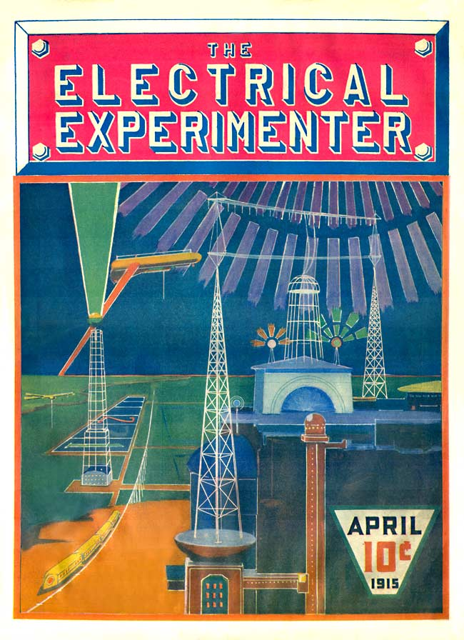

**DRAFT:** *Please do not share without permission of the author. Typeset versions in  [web](http://gernsback.wythoff.net/191305_a_treatise_on_wireless.html) \| [pdf](https://github.com/gwijthoff/perversity_of_things/blob/master/typeset_drafts/191305_a_treatise_on_wireless.pdf?raw=true) \| [doc](https://github.com/gwijthoff/perversity_of_things/blob/master/typeset_drafts/191305_a_treatise_on_wireless.docx)*

* * * * * * * * 

The idea of our cover was conceived by the writer with the intention of inspiring the electrical experimenter at large.[^col]  There is nothing fantastic about this cover, nothing impossible.  It will all be very real in a comparatively short time.  It is up to our experimenters to make it an accomplished fact.

The scene is laid near the coast, in almost any part of the globe.  The time, let us say is in the year 2013.  It is night.  The large aerial system in the foreground radiates, not feeble telegraph impulses, but a tremendous power.  This power is furnished by the large "Powerhouse," beneath the aerial system, some 30,000 Kilowatts being radiated into the ether constantly.  Naturally, such a tremendous power going out into the air gives rise to peculiar phenomenae.  The air becomes luminous for several miles around and above the aerial.  An inverted bowl-shape light dome, with the aerial system at its center, is produced, and this light illuminates the landscape for miles around.  The lower antenna acts partly as a reflecting aerial which prevents the energy from being absorbed by the earth.  It has been found that by using a curious vibratory pulsating wave of tremendous amplitude, almost no energy is lost in transmission through the ether, and for that reason the etheric power station as illustrated can supply energy within a radius of several hundred miles.  The power is derived solely from the tides of the ocean---a tremendous force, which lay unharnessed through the aeons.

On top of the "powerhouse" we see two towers with curious light balls.

These are the *"radiofers."*  You must understand that the "power-house" which shoots forth such a colossal force, can not be frequented by humans.  As a matter of fact no human being could come near the house, or within 500 yards.  For that reason the power is entirely controlled from a distance, by wireless of course.  The control is exercised through the "radiofers."

In the left foreground we see a curious wheeless railroad.  The cars float actually in the air, some feet above the broad, single iron track.  The power is obtained from the distant power aerial by wireless, of course.  One will notice the aerial wires on top of the cars, which receive the energy.  The train is suspended by electromagnetism and glides smoothly along at the rate of some 200 miles an hour.[^pat]

In the left foreground also we see an immense 1,000-foot *"optophor"* tower.  This tower shoots a dazzling colored light shaft of some ten million candle-power straight into the sky.  Such "optophor" towers are stationed exactly 50 miles apart along the coasts, and every tower has a different colored light shaft.  This light beam can be seen some 500 miles out at sea and by its light, transatlantic aerial as well as aquatic craft, can steer with unfailing accuracy towards their point of destination.

[^col]:  A reproduction of this sketch would form the first full-color illustration on the cover a Gernsback magazine, with a similar explanation of its feasibility.  It originally appeared in a black and white version on the cover of the May 1913 issue of *Electrical Experimenter.*

[^pat]:  Gernsback: "In 1912 patent No. 1,020,942 was issued to [Emile] Bachelet on such a suspended train system."