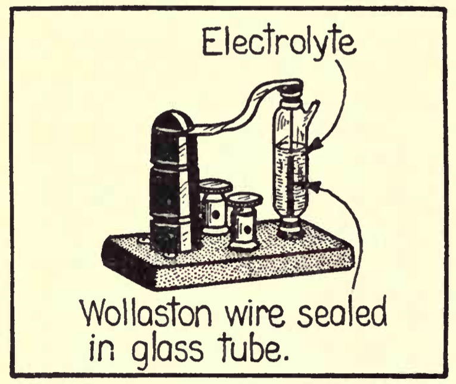

**I**T is a well-known fact that the Electrolytic Detector has always been one of the most sensitive detectors invented since detectors first came into general use.  The reason why it has not been adopted as the universal detector is partly due to the fact that the ordinary Electrolytic Detector, as it has been known in the past, was not a really commercial article, for it cannot be denied that even the best Electrolytic Detectors, as manufactured heretofore, had some serious defects.  One of the reasons, and perhaps the main reason why it was not used universally, is that in all such detectors manufactured heretofore it was always necessary that a certain amount of acid was handled; this naturally is a serious objection, as not everybody likes to have acid around the instrument table, and for the reason, also, that the acid in the Electrolyte (or rather the water in it) evaporates quite readily, and therefore makes continuous adjustment necessary.[^fes]

The Bare-point detector, while excellent in many respects, is subject to every draft of air, as the exceedingly fine platinum wire, which can hardly be seen by the naked eye, is usually subject to drafts, and, as a matter of fact, even the operator's breathing against the detector will readily throw it out of adjustment.  Of course, this is not the case if the detector should be encased by a glass bell or other cover.  However, it cannot be denied that the Electrolytic Detector as a whole is the most sensitive detector if it is put together in its correct fashion.

Many inventors have busied themselves in constructing an Electrolytic Detector that would have only the good features of same and none of its bad ones, but not since the advent of the Radioson has it been possible to produce a really satisfactory article.[^15]  Even the Bare-point detector, which heretofore has always been considered as the most sensitive detector of this class, is only really sensitive in the hands of an operator who is very familiar with its working and knows exactly all its functions.  The writer might state that there are mighty few operators who are fully conversant with the theoretical as well as the practical side of such a detector, and that is the reason why the Electrolytic Detector, as it has been known heretofore, was not as successful as it deserved to be.[^2]

The Radioson Detector has been the outcome of years of experimenting and it is interesting to note that only a platinum wire of a certain size, which has been fond by experiment, will produce the best results.  A few hundred thousandths of an inch variation in thickness will make an enormous difference in the sensitiveness of the Radioson Detector.  It might be stated that only one in about four manufactured will come out fit to pass inspection, and the other three must be discarded as useless; this, perhaps, is the reason that this detector costs more to manufacture, and therefore is more expensive than the regular detector.

Why is the Radioson more sensitive than the ordinary Electrolytic Detector?  Consider the following:

Fig. 1, greatly exaggerated, shows the elements of the ordinary bare-point "Electrolytic," using the finest wire.  By observing the extremely fine (0.0001 inch) Wollaston wire under the lens, it will be seen that the contact between the fine wire, "A", and the surface of the acid is never a mere point-contact, but as the fine wire is so very light it curves around and a considerable portion---about 1/8 inch---usually floats or lays on top of the acid, see sketch.[^3]  This give a contact of 0.0001" x 0.125" = 0.00003927 sq. inches, which is far too much for high sensitivity.  For this reason some makers tried to seal in the Wollaston wire into a class tube and then grinding the point so that only a point of the wire is exposed.  However, this was not an improvement.  Consider Fig. 2.  If the Wollaston wire is sealed in, the silver coating, as well as the platinum wire, comes to the surface.  What happens?  The acid eats away the silver, and a space, "B", "C" remains between the glass and the sides of the fine platinum wire.  The acid by capillary action fills up this space and consequently the contact on such a detector is as large as the one obtained with the bare-point detector.  This "sealed-in" detector, therefore, shows no improvement whatever.  Now, consider Fig. 3---the Radioson way.  By an absolutely new process we succeeded in melting a 0.0002" platinum wire (without silver coating) into a tube made of a specially prepared glass.[^4]  The acid does not attack platinum, as is well known.  Consequently the contact of the Radioson can under no circumstances ever be more than the area of 0.0002" diameter, or 0.0000000314 square inches.  Consider this figure with the former one!  The Radioson is, therefore, 1246 times smaller than the contact of the best bare-point Electrolytic.

It is, therefore, not surprising that the Radioson Detector is so marvelously sensitive.[^45]

The writer has found, and his opinion has been shared by several Radio experts, that the Radioson to-day is unquestionably the most sensitive detector, even far surpassing the Audion, which heretofore was considered the most sensitive detector manufactured.[^5]  It is a matter of record that by connecting a double-pole, double-throw switch on one side of the Radioson and connecting on the other side of the switch to an Audion, it will be found that the Radioson is far more sensitive than the Audion.  In some cases signals that can not be heard at all with the Audion come in fairly loud with the Radioson.

The Radioson is, to-day, the only detector known that needs no adjusting whatsoever.  An important point is that messages come in clearly and distinct even while the detector is shaken, and for this reason it is, of course, never subject to shocks and it is, therefore, indispensable for portable sets, in automobiles, railroad trains, ships, aeroplanes, etc.  The acid as well as other sensitive parts are sealed into the detector cartridge.  For this reason there is never any spilling of the acid nor any danger of the acid coming into contact with the hands of the operator.  The Radioson is adjusted to its highest sensitiveness at the factory, and for that reason it is quite impossible to put it out of adjustment except if the cartridge is broken or unless a high tension discharge is put through the detector.

The Radioson practically requires no attention, it is always ready for use and the operator never loses part of a message on account of bothersome as well as annoying adjustments common to EVERY OTHER detector.

The Radioson is clean as well as very compact.  It works on a shaky table as well as on a steady foundation.[^6]  An interesting fact is that the Radioson does not require the use of a Potentiometer, but it is necessary to use two dry cells (three volts) in connection with the detector.  These cells may be of very small size, such as a flashlight battery.

In order to get the best results with the Radioson it is necessary to use it in connection with at least a 200 ohm head set, or a higher resistance set up to 8000 ohms: either set may be used, but nothing less than 2000 ohm must be used, as too much current would flow, which, in time, would destroy the very fine platinum wire; this naturally would make the detector useless.

The writer, who designed this detector, found that by placing the anode, that is, the member carrying the fine platinum wire (contrary to other sealed-in electrolytic detectors), upside down, better results obtained.  This is done for the reason that it allows the microscopic gas bubbles to disengage themselves more readily from the anode point than if the sealed-in anode was placed in the usual position, namely, point down.  In the latter case, the gas bubbles sometimes adhere to the point, which, of course, decreases the sensitiveness of the detector, as has been often found by many experimenters.

A very interesting fact about the Radioson is, that when it has been used for several months, it is sometimes found that it is not quite as sensitive as it was originally.  All that is necessary to do then is to take out the cartridge and shaking it violently by holding it between two fingers and shaking it in the direction of its axis.  This immediately restores its full former sensitiveness for the following reasons: Although the acid, as well as the other ingredients used in making the electrolyte are chemically pure, there is always a chance that some microscopic particle of material might partly cover the anode, but by shaking the electrolyte, this particle will readily come off, and, besides, the shaking has the effect of also cleaning the glass as well as the anode point in a very efficient manner.  For this reason the Radioson has a very long life, and if it is handled carefully it will last for years; furthermore, the electrolyte used does not affect the platinum wire in any manner whatsoever, even if the detector is used continuously.

Persons familiar with the Electrolytic Detector might be of the opinion that as the acid as well as the anode is sealed in airtight, sooner or later the working of the Radioson might be affected, on account of accumulation of gas.  However, this is not the case, as the gas bubbles on account of the extraordinary small dimension of the anode are microscopically small.  By looking at the figures above, giving the amount of anode area exposed, this will be readily understood, and, while it is not to be denied that there must be a certain amount of gassing, the same is so very slight that, for practical use, it does not come into consideration at all.

Another interesting point in connection with this detector is, that, by placing several Radiosons in parallel, this will increase the volume of the sound, and, although the increase is not more than 10 or 15 per cent., it is quite noticeable.  Placing the detectors in series cuts down the efficiency.

Another very important fact is that heating the Radioson cartridge increases its sensitiveness enormously.  Placing it very near to a steam radiator or letting the sun shine upon it, will bring in the signals sometiems fully 200 per cent. louder.  This phenomenon was discovered by Dr. Branley [sic] of Paris some years ago.[^7]

All in all it may be said that without exaggeration the Radioson Detector is, to-day, the most sensitive detector that has been devised as yet.  The Electro Importing Co., the manufacturers of this detector, guarantees each and every detector in all respects, and the Company furthermore guarantees that every Radioson is absolutely uniform, and it will be observed that all of them, when compared, will be equally sensitive.  This is a very important feature, especially if comparative tests in the intensity of received signals are required.

The author will be glad to answer any questions concerning the Radioson, and he shall be glad to furnish such information as is consistent to give in connection with this detector.

