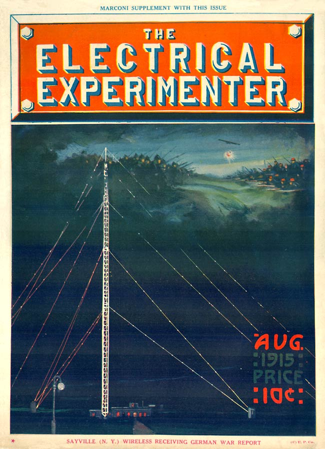

* * * * * * * * 

**S**AYVILLE and Tuckerton are at present the only links connecting the American Continent directly with the German Empire.  Both stations can now receive and transmit wireless messages to and from Germany, without any relaying means, at any given hour of the day.[^lgi]

First Tuckerton and now Sayville have been taken over by our watchful Government with the evident intention of preventing the two stations from committing an unneutral act, in conformity with international law practice.[^tkr]

The layman will immediately ask, that if the United States Government takes over the wireless plants, why does it not also take over the various transoceanic cable stations? He furthermore cannot see what harm the wireless stations can do, because they have been required for some time to use plain English or plain German, no code messages having been allowed since the outbreak of the war.

The answer is simple enough.  A cable message during the time of its dispatch stays on the cable.  It has only one destination; no one can "tap" the message without serious difficulties.  Not so with the "wireless."  Its waves being propagated in every direction, a thousand stations, or more, if properly equipped, can catch the message anywhere within the receiving radius of the sending station.[^sbm]

No doubt the far-seeing shrewd German Government long ago foresaw the possibility of a war with England and the inevitable isolation of the empire which would result in consequence thereof.[^lxg] It clearly foresaw the cutting of its cables by the enemy and it acted accordingly.  Sayville and Tuckerton was the answer.  Thus when England actually did cut the German cables early in August, 1914, Germany was by no means isolated telegraphically.  Thanks to the wireless, which a wise government had long before planted on foreign soil, telegraphic traffic between America and Germany goes on the same as before, with the difference that the messages now travel over the very heads of Germany's enemies.  With the inauguration of the German submarine warfare, the German Admiralty doubtless found a powerful weapon in the shape of the Sayville and Tuckerton wireless stations.  The two stations being controlled almost entirely by German capital, it was reasonable to expect that they would support the German navy and its submarines to the best of their ability.  Before the United States Government took over the Sayville station, early in July of this year, we had been reading a lot of nonsense as to some new devices being employed at that station which were supposed to be used in sending out messages by means of a special time-spacing system between the dots and dashes, as well as by varying the length of the dots and dashes themselves, which latter make up the telegraphic alphabet.  Such a thing is, of course, not impossible, but why should it be done if much simpler means are at our disposal?

Let us imagine the following:  A German spy is located on the ocean liner *Adriatic* headed for Liverpool.  When the ship is two days out the spy learns that the ship, on account of submarine danger, will not dock at Liverpool but at Greenock (Scotland) instead.  This is important information.  Within ten minutes he has sent a wireless to a stockbroker in New York as follows:

> *H.P. Frye & Co.*
> *235 Wall Street, New York*
> *Sell at once 2,000 shares U.S. Steel at 58.*
> *--John Miller.*

When Frye & Co. receive the message they consult their code book and find that it reads thus:

> *Adriatic will dock at Greenock.*

Within twenty-five minutes after John Miller handed his message to the operator on the *Adriatic* Sayville has received and dispatched the following message to its Nauen (Germany) station:[^nn]

> *F.S. Schneider & Co.,*
> *Friedrichstrasse, Berlin.*
> *Cannot dispose 2,000 shares U.S. Steel at 58. Are bid 55 1/2. Advise.*

This message is promptly received by the German commander of the submarine U-69, bobbing up and down not far from the south coast of Ireland.

He also consults his code book and deciphers the harmless message thus:

> *Adriatic will dock at Greenock next Tuesday.*

With this intelligence the German submarine commander is enabled to change his course in order to successfully hunt his quarry.

This is only one of the ways how the wireless stations at Sayville and Tuckerton can be used successfully to violate our neutrality; there are undoubtedly scores more.

In view of the above it is not quite clear how the United States Government, even by exercising the greatest care in censoring messages, can hope to prevent at all times the dispatch of unneutral wireless messages.

[^lgi]: Sayville, New York is located on Long Island.  Tuckerton, New Jersey is on the south-eastern Jersey shore, just north of Atlantic City.  Both towns were the sites of massive wireless telegraph stations owned by the German company Telefunken.

[^tkr]:  The following month's issue explains exactly why the Sayville station was closed.  Charles A. Apgar, an amateur inventor and contributor to Gernsback's magazines, had devised a way to record wireless telegraph signals on phonograph cylinders, the first permanent record of a wireless message ever produced.  Using this method, Apgar produced recordings of covert German transmissions that were sent via Sayville to U-Boats operating in the Atlantic Ocean.  His presentation of these findings to the US Navy precipitated the closing of Sayville and a law banning all amateur wireless activities.  Both a model of the value of the amateur wireless tinkerer and the cause of the entire amateur community's work being put in jeopardy, Apgar was a divisive figure.  

    > Meanwhile, the part played by the magazine \[*Electrical Experimenter*\] aroused sharp resentment from the old Sayville officials. Dr. K[arl] G. Frank, head of the station, wrote a bitter letter to the editor, the point of which was a little blunted by the fact that by the time it was printed, the Government had already closed Sayville. Dr. Frank, incidentally, was later convicted as a German Intelligence agent.
    
    @kennedy_jr._coherer_1958.  For the story of German cryptography channeled through American wireless plants during World War I, see @wythoff_invention_2014.

[^sbm]: This issue includes the latest installment of Gernsback's serial novel, *The Scientific Adventures of Baron Munchausen,* in which the narrator establishes a wireless connection with the Baron as he lands on the surface of the moon.  The next pages switch back to hard technical description with a feature that details precisely how submarines send wireless messages from the depths.

[^lxg]: In a 1918 letter published in the *Chicago American* and later *The New York Times,* Gernsback stresses to the American public the importance of his home country Luxembourg in stemming the aggression of Germany.  Four years after the German invasion of Luxembourg, Gernsback writes:

    > For a generation back Germany has cast covetous glances at the little country---no doubt on the theory that 'he who does not honor the pfennig is unworthy of the thaler'.  Due to its insidious and clumsy methods, however, little headway was made in Germanizing the Luxembourgeois. . . . Of course the Luxembourgeois greatly resent the German occupation, just as much as do the Belgians.  Since the invasion the inhabitants have been in a more or less ugly mood, as testified on good authority by the information which filters through them from time to time.
    
    @gernsback_case_1918.
    
    Paul Lesch argues that Gernsback actively cultivated a Luxembourgish identity throughout his life: "It is particularly interesting that Gernsback, born of German parents, not only insists on the anti-German sentiments existing in Luxembourg at the time, but seems to share them as well." @henzig_hugo_2010, p. 18.

[^nn]: The Nauen station's power was renowned throughout the world, and was the subject of much interwar speculation over secret research conducted by the Germans into "rays."  See **"Predicting Future Inventions"** (August 1923).