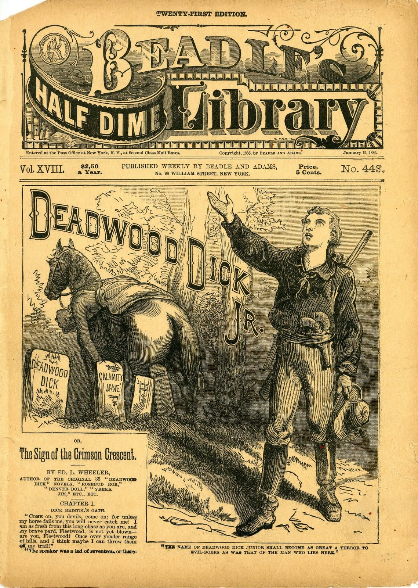

**DRAFT:** *Please do not share without permission of the author. Typeset versions in  [web](http://gernsback.wythoff.net/191511_bookworm.html) \| [pdf](https://github.com/gwijthoff/perversity_of_things/blob/gh-pages/typeset_drafts/191511_bookworm.pdf?raw=true) \| [doc](https://github.com/gwijthoff/perversity_of_things/blob/gh-pages/typeset_drafts/191511_bookworm.docx)*

* * * * * * * * 

## No. Umsteen hundred and forty 'leven

## Pat. applied for 10 minutes 'fore lunch.

## Specification of Phoney Patent---Application Sandpapered September the Tooth

*To those who---consarn it all, here goes:*

I, U. R. Wright, of the Burg of Whereatin, Va., do hereby swear dreadfully, and affirm firmly that I have invented means whereby and by which a confirmed Bookworm may be relieved of all anxiety about reading too late at night, getting wet in the rain, getting overheated or run over by vehicles.

Full description of this wonderful apparatus follows:

A small but powerful dynamo is strapped to the small of the back. On each end of the shaft is an aluminum flywheel covered with fly-paper and having teeth around the inner edge of the rim. Pawls fastened to the legs of the wearer engage these teeth and spin the dynamo when the victim walks along either fro or to, hither or thither. The current thus generated is led by small wires to storage batteries concealed in the high stove-pipe hat which goes with the outfit. So a man, thus fitted out, really has "*bats* in his belfry." The top of this hat is the most ingenious part of the whole mechanism. It consists first of a shallow hard rubber pan, shaped much like a friction tight molasses bucket lid. In this lid are laid narrow strips alternately of copper and zinc, these being connected in parallel. On top of this is an image of Theodore Roosevelt, rampant, carved from a lump of copper sulphate or bluestone. More about this later.

Between the shoulders of the unfortunate is an umbrella which normally hangs down, closed, behind him. On the handle end of the umbrella is a segment of gears which engage with a small motor. Now the action is thus : When a shower starts, and the Bookworm is ambling along, face buried in a volume of "Deadwood Dick," the rain drops trickle over the Bluestone image of "Teddy," partly dissolving him and covering the zinc and copper strips with bluestone solution, thus forming an electric cell.[^dwd] (The bluestone image, after months of constant use, will acquire a likeness to William Jennings Bryan.) The electric current thus set up actuates a switch which cuts in the storage battery to the motor which hoists the umbrella. There is a tiny hole in the bottom of the hard rubber lid or pan which contains the zinc and copper strips so that the bluestone solution trickles very slowly out, and down the back of the wearer's neck. For this reason the patient must wear blue acid proof overalls. When all of the solution has run out, the switch is released and the umbrella is automatically let down to its normal position.

Strapped to the chest (if he has one) of the victim is a small electric fan in circuit with a thermostat so when it is warm the thermostat starts up a delightful mountain breeze.

Reading so much a man is likely to forget to wind his watch, so an electric watch is provided. Injury to the eyes by reading in too dim a light is prevented by a selenium cell, which in dim light releases a switch operating an electro-magnet which pulls a lever to and fro rapidly, on the end of which is a pepper shaker. This shakes pepper in the eyes of the reader and thus calls a halt.

While crossing the street, interested in a book, one pays no attention to approaching autos and cars. A sensitive microphone worn on the person actuates a spark, which explodes a bomb under the coat tails of the bookworm, hefting him gently into the air, while the said vehicle saunters nonchalantly on beneath him upon its wonted way.

To prevent reading in bed too late at night, a 10-pound mallet is fastened in the umbrella socket, and at the appointed time the electric watch connects the circuit and the mallet descends upon the noodle of the victim, giving 40 swift swats, knocking him insensible till morning, when he is awakened by a shock of 10,000 volts from an induction coil.

In testimony whereof, I have hereunto appended my nom-de-feather this day, O Lord, preserve us from further attacks.

U. R. Wright.

By his attorney,

Stanley H. Covington, Lynchburg, Va.

Witnesses : I. B. Darn, Whooda Thoughtit, Ischga Bibble. 

[^dwd]:  *Deadwood Dick* was a series of dime novel westerns written by Edward L. Wheeler from 1877-1885, with the character living on under ghostwriters from 1886-1897.  Wheeler "wore a Stetson hat, and is said to have greeted even strangers as 'pard.'"  @johannsen_house_1950, available online at Northern Illinois University Libraries's Beadle and Adams Dime Novel Digitization Project, <http://www.ulib.niu.edu/badndp/>.  According to Christine Bold, Wheeler was unique in his direct appeal to the reader, making his stories especially seductive for hungry bookworms:

    > In his work, the characters take over all the authorial functions: they invent their own stories, they acknowledge the conventions of their existence and they recognize, finally, that these conventions derive drectly from the commercial contract.
    
    @bold_voice_1983.  Bold cites *Deadwood Dick as Detective* (1879) in particular:
    
    > Fear not that man, for in your hour of need Deadwood Dick is on deck.  When you least dream of it, he is lurking near, watching for your welfare, with a brother's care, and removing such obstacles as will be apt to trip you and throw you into the power of enemies.

    Unfortunately, these "enemies" were almost always signaled through ethnic markers.
    
    > These stories, together with [Edward S.] Ellis's work, set the pattern for future invention stories. The initial model was the dime-novel Western. Stress was on iron technology, with little or no science; narratives contained random, thrilling incidents, often presented in a disjointed and puerile way. Typical social patterns were: a conscious attempt to capitalize on age conflict, with boy inventors outdoing their elders (Edisonade); aggressive, exploitative capitalism, particularly at the expense of "primitive" peoples; the frontier mentality, with slaughter of "primitives" (in the first Frank Reade, Jr. story Frank kills about 250 Native Americans, to say nothing of destroying an inhabited village); strong elements of sadism; ethnic rancour focused on Native Americans, blacks, Irish and, later, Mexicans and Jews.
    
    @bleiler_dime-novel_2014.  Dime novels serve as an important precursor to magazine era science fiction both materially---printed on very cheap paper and "sent to the army in the field by cords, like unsaved firewood" during the civil war---and thematically---featuring stories of marvels, lost races, and inventions like Edward S. Ellis's *Steam Man of the Prairies.*  @jencks_dime_1904.
    
    As Gary Westfahl has argued, Gernsback was a historian of science fiction as well as a founder of the genre, referring to H.G. Wells, Edgar Allan Poe, Jules Verne and the lesser known Luis Senarens in some of his first editorials for *Amazing Stories.*  @westfahl_jules_1992.  This spoof suggests that Gernsback was aware of an even deeper tradition, one that he builds upon with his own magazines.
    
    It wasn't until 19… that dime novels were considered in SF scholarship, beginning with the work of… 
    
     <!-- no figure -->