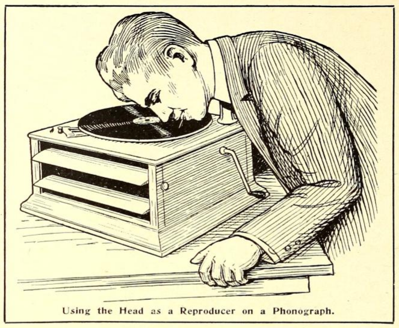
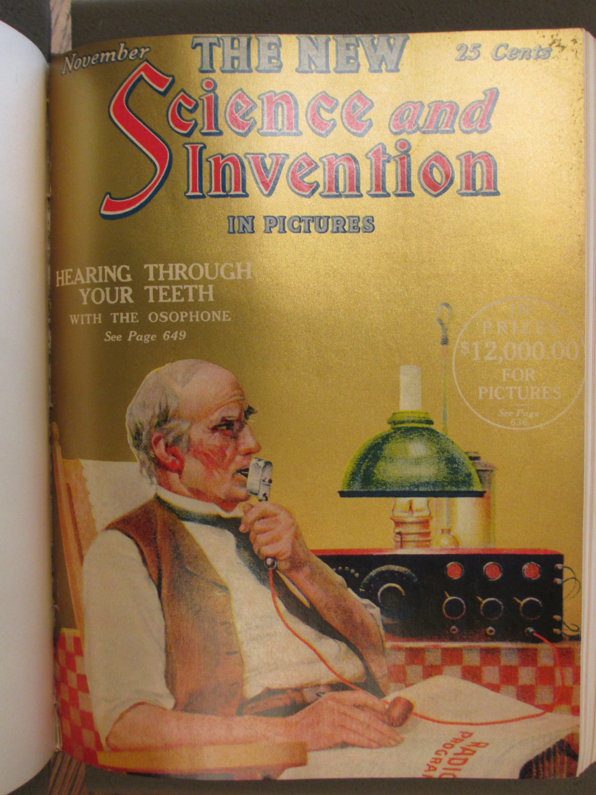

* * * * * * * * 

**T**HE following interesting experiment can be performed by anyone who has an ordinary disc phonograph. It is interesting, in so far as it shows the transmission of sound through the teeth, and through the bony substance of the human skull, which in turn reacts upon the auditory nerve.[^npw] It is not well known but it is a fact nevertheless that sounds do not necessarily have to enter through the oral opening in order that we can hear sounds. Physicians in testing for hearing sometimes use a tuning fork which, after struck, is pressed with its lower part against the back of the skull, right behind the ear. The sound is then heard inside of the head the same as if it had actually entered through the opening of the ear itself. This principle is made use of in the experiment described here, and while it is not electrical by any means, it probably will interest every experimenter who owns a phonograph.[^ggs]

Stop up both of your ears with cotton as tightly as possible so that no sound will be heard from the outside. Now place an ordinary darning needle between your teeth by biting on it; hard, taking care at the same time that the lips or tongue do not touch the needle. The latter is important because if either lips or tongue touch the needle the sound will be decreased considerably. For best results the needle itself should project not more than 1 or 2 inches from the mouth. For that reason the darning needle should be broken off about one and one-half inches from its sharp point. It goes without saying that the sharp point should project out of the mouth while the broken off end should be inside of the mouth.

Now start an ordinary disc phonograph and carefully press down upon the record with the needle's point held at the same angle as the reproducer's needle is held ordinarily. With a little practise one will become proficient in moving the head at the same ratio of speed as the ordinary reproducer arm is moved from the outside of the record towards the inside. As soon as the needle touches the record with sufficient pressure, the inside of the head will be filled immediately with music exceedingly loud and clear.[^def]

A curious result of the experiment is that a person standing near by can bear the music, the head acting as a reproducer in this case.

Of course, it will be understood that a totally deaf person will not be able to hear any sound if the auditory nerve is dead or inactive. It is, however, interesting to note that partly deaf people can hear the music quite well. This is particularly true of persons hard of hearing who cannot ordinarily hear the sounds of a phonograph.

The writer should like to hear from readers, particularly from those who are partly deaf, who have tried this experiment; the *Electrical Experimenter* will be glad to publish the results in subsequent issues.[^ltr]

[^ltr]:  A profile of this experiment was published in the November 1923 issue of *Science and Invention* as the cover story.  See **Are We Intelligent** for an editorial that evokes what might be possible with such alternative forms of communication.

     <!-- no figure -->
    
     <!-- no figure -->

[^ggs]:  Google Glass, the prototype head-mounted-display glasses released in 2013, used the same principle of bone conduction technology to send audio to the user via a small oval-shaped component positioned behind the ear.  @ingraham_google_2013.

[^def]:  In 1923, Gernsback was awarded a patent for a device he called the Osophone and its "sound vibrations transmitted directly to the osseous tissue of the body."  @gernsback_acoustic_1924.

[^npw]:  This issue's installment of *The Scientific Adventures of Baron Münchausen* includes a distant extrapolation of the bone conduction technique in the form of a Martian technology that allows them to communicate as if telepathically.  The story also contains a digression in the form of an instruction manual very similar to this one.

    > Not far from the equator of the planet a central music plant is operated by a single Martian, who, of course, is a musical genius. He operates one of the organ-like instruments of which I spoke before. The "plant" comprises besides the instrument, two Tos rods each 20 feet high. These rods work exactly as the ones just described, except that they are operated at an enormous frequency. I have stood in front of them while they were operating, so close, in fact, that I could have touched both rods with my hands. However, my ears detected not the slightest sound. But, incredible as it seems, millions of Martians were listening to the wonderful music at that minute, produced by these same rods, *but not with their ears.* They were listening with their brains! […]
    
    > Every Martian is required, for reasons which you will understand presently, to wear a peculiar soft metallic cap. From the back of the latter a thin metallic cable runs down the Martian's back and is fastened there to his metallic coat. All Martian clothing, as well as footgear, is invariably of metallic weave. Now as all pavements and all flooring, carpets, as well as rugs, are metallic on Mars, for reasons which will be apparent to you later, a metallic connection with the earth or "ground" is always effected.

    > The metallic cable of which I just spoke does not make contact with the cap itself, but it is insulated therefrom. It connects, however, with a small reddish metallic plate about the size of an American silver dollar. This plate in turn, by means of a flat spring, presses against the temple of the wearer; the cap itself holds the plate in place. A similar plate presses against the other temple, but this plate, unlike the other, is connected metallicly to the cap itself. From this description you will gather that the metallic cap performs the function of a wireless aerial, while the metallic clothing forms the ground. The two reddish plates pressing against the bare temples are made of two metals unknown on earth, and the metals are distributed over the surface of the plate in honeycomb fashion without touching each other. Now if the two plates are pressed against the temples and when wireless waves are passing through them, the waves are translated into vibrations of a certain frequency. It has been found that if these vibrations reach the conscious sense of hearing which is located in the *Temporal Lobe* of the brain, sounds can be impressed upon the brain without requiring the ear and its auditory nerve. In other words, the sound is "heard" directly within the brain without the agency of the ear's mechanism.

    > If this should be somewhat hazy to you a homely (though inaccurate) illustration will not be amiss here. At first blush one would think that the ear is absolutely essential for hearing, but this is not the case. Try the following simple experiment: Stop up both your ears as tightly as possible with cotton so that you will not hear a sound from outside. If you are partly deaf---and I trust you are not---all the better for the experiment. Place a darning needle between your teeth by biting on it hard and take care that your lips do not touch the needle. The needle itself should project about 1 inch from your mouth. Now operate an ordinary disc phonograph and with care press down upon the record with the needle's point held at the same angle as the reproducer's needle is held ordinarily. Your whole brain will be tilled immediately with music, exceedingly loud and and clear. Of course, in this case you still hear with your ear's mechanism, the sound vibrations being carried to the eardrum through the bones of the head; but it is interesting to note that if a truly deaf person tries the experiment he will be enabled to "sense" the sounds, although not perfectly.

    > Of course, the function of the Martian apparatus is based on an entirely different principle, and the above experiment is only cited by way of comparison.