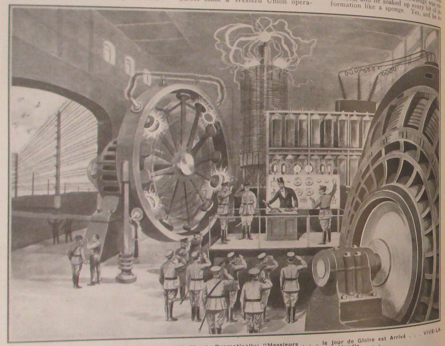

* * * * * * * * 

**"W**HY" Sparks had stopped reading the New York Evening World: He contemplated his old meerschaum pipe meditatively while with his long and lanky index finger, stained by many acids, he carefully rubbed a long, thin and quivering nose. This was always a sign of deep, concentrated thought of the nose's owner. It also, as a rule, induced the birth of a great idea.

Again, and very slowly he re-read the article, which millions that same day had read casually, without a quiver, let alone, a nose quiver. The newspaper item was simple enough:

> NEW YORK, Aug. 10, 1917.---An electromagnetic storm of great violence swept over the eastern section of the United States last night. Due to a brilliant Aurora Borealis,---the Northern Lights,---telegraph and long distance telephone, as well as cable communications were interrupted for hours. No telegraphic traffic was possible between New York and points West. It was impossible to work any of the transatlantic cables between 12:15 A. M. and 9:15 A. M., every one of them having "gone dead." The Aurora Borealis disturbance affected all telegraph and telephone lines extending between Chicago and the eastern cities. On telegraph wires of the Postal Telegraph Co. without regular battery being applied at terminal offices, grounded lines showed a potential of 425 volts positive, varying to 225 volts negative; the disturbance continuing between 12:15 A. M. and 9:15 A. M.

> At Newark, N. J., in the Broad Street office a Western Union operator was severely shocked, trying to operate the key, while long sparks played about his instruments.

Sparks rose excitedly and began pacing the cement floor of the vast Tesla laboratory, totally oblivious to the fact that he was sucking a cold pipe. The more he paced about, the more excited he became. Finally he flung himself into a chair and began feverishly to make sketches on big white sheets of drawing paper. 

"Why" Sparks had been just an ordinary "Bug," an experimenter, when he entered Tesla's great research laboratory at the beginning of the great war in 1914. Tesla liked the keen, red-haired tousled boy, who always seemed to divine your thoughts before you had uttered five words. His clear blue eyes, lying deep in their sockets, sparkled with life and intelligence and what Sparks did not know about electricity was mighty little indeed. I believe there is no electrical book in existence that Sparks had not devoured ravenously in his spare hours, while having lunch or else while in bed, in the small hours of the morning. His thirst for electrical knowledge was unbounded, and he soaked up every bit of information like a sponge. Yes, and he retained it, too. In short, the young prodigy was a living electrical cyclopedia and highly valued by his associates. No wonder Tesla in three short years had made him superintendent of the laboratory.

# Sparks' First Name 

**O**F course, Sparks' first name was not really "Why." But some one had dubbed him with this sobriquet because of his eternal "But why is this,"---*"Why,* why should we not do it this way"---*"Why* do you try to do that?" In short his first word always seemed to be "Why," — it had to be, in his unending quest of knowledge. And his "Why" was always very emphatic, explosive-like, imperative, from which there was no escape.

Ah, yes, his first name. To tell the honest truth, I don't know it. Last year in the spring when I went up to the laboratory, I thought I would find out. So when I finally located the young wonder, behind a bus bar, where he was drawing fat, blue sparks by means of a screwdriver. I told him that I intended to write something about him and his wonderful electrical knowledge. Would he be good enough to give me his real first name?

He was watching a big fuse critically, and in art absent-minded manner exploded: *"Why?"* That finished my mission. And for all I know his real name is "Why" Sparks.

But we left Sparks with his drawings, in the laboratory. That was on a certain evening in 1917. To be exact it was about 10 o'clock. At 10:05 Tesla accompanied by two high army officials strolled into the laboratory where Sparks was still feverishly engaged with sketches lying all about him.

Tesla who was working out a certain apparatus for the Government had dropt in late to show Major General McQuire the result of six weeks' labors. The apparatus had been completed that day and the General, a military electrical expert, had come over specially from Washington to see the "thing" work.

<!-- box -->

\begin{center}
\fbox{
  \parbox[c]{7cm}{
  
IN THE SEPTEMBER "E.E." YOU WILL FIND:

\vspace{3mm}

"New Aerial Lasso to Destroy Enemy Aeroplanes," by H. Gernsback.

\vspace{3mm}

"Recent Electrical Ideas Applied to Submarines and Torpedoes."

\vspace{3mm}

"Telephoning Directly To and From Moving Trains."

\vspace{3mm}

"A New Wave Motor That Uses the Energy in Every Motion," by E. D. Stodder, an expert on Wave Motors.

\vspace{3mm}

"The Einthoven Galvanometer---Its Theory and Construction Details with Photos of Instrument Actually Built," by Samuel D. Cohen.

\vspace{3mm}

"Coney Island's New 1918 War Feature---'Over There'---Read How Electricity Works the Whole Show," by George Holmes.

\vspace{3mm}

"Artificial Diamonds and Rubies---How They Are Made in the Electric Furnace.

\vspace{3mm}

"The Phenomena of Electrical Conduction in Gases V---Weighing an Ion," by Rogers D. Rusk, M.A.

\vspace{3mm}

"An Electrical Laboratory Switchboard---How to Build a Real One," by Harlan Danner

\vspace{3mm}

"Glass-blowing lessons---How to Heat and Bend, As Well As Build Glass Chemical Apparatus---Part I," by Prof. Herbert E. Metcalf.

\vspace{3mm}

"Ohm's Law Applied to Alternating Current Circuits---A Clear Exposition of All the Usual Problems," by Arno A Kluge, Instructor in Radio, University of Nebraska.

\vspace{3mm}

"New Direct Reading Radio Chart Which Solves All Calculations in Wave-length, Inductance and Capacity," prepared by a Marconi Radio Engineer.

\vspace{3mm}

"Popular Astronomy---Third Paper," by Isabel M. Lewis.

\vspace{3mm}

"How and Why of Radio Apparatus---Part X," by H. Winfield Secor.

  }
}
\end{center}

<!-- box -->

But before Tesla had a chance to throw in the switch of the large rotary converter, Sparks had leaped up, and was waving excitedly a large drawing in Tesla's face. He gushed forth a torrent of sentences, and for fully five minutes Tesla and the two Army officials were listening spell-bound to the young inventor. For a minute or two the three men were speechless, looking awe-struck at Sparks, who, having delivered himself of his latest outburst, now became normal again and lit up his still cold pipe. 

It was Tesla who first found his voice. "Wonderful, wonderful. Absolutely wonderful. Sparks. In a month you will be the most talked of man on this planet. And his idea *is* sound." This to the General. "Absolutely without a flaw. And so simple. Why, oh why! did I not think of it before? Come, let me shake the hand of America'a youngest and greatest genius!" Which he did. 

There then followed an excited thirty-minute conversation with the two army men and an endless long distance talk with the War Department at Washington. Then there was a rush trip to Washington by Tesla and Sparks, conferences at the War Department, and finally a few days later Sparks went to the White House and was presented to the President, who was highly enthusiastic about the model which Sparks and Tesla demonstrated to the head of the Nation. Still later there were certain rush orders from the War Department to the General Electric and Westinghouse Companies for many big, queer machines, and these same machines were shortly . . . But here the Censor bids us an emphatic "Halt." One may not even now divulge certain military information. You appreciate that.

# Behind the German Lines

**B**ARON von Unterrichter's flying "Circus" was getting ready to bomb a certain American depot behind the lines. The Americans of late had shot down entirely too many of the Baron's flyers. Only yesterday von der Halberstadt---a German ace himself---and one of von Unterrichter's closest friends had been downed, and killed inside of the German lines. So the Baron was out for blood this sunny morning. As he put it:

*"Verdammte Yankee Schienehunde,*[^g] we will show them who is master of the air hereabouts," shaking his fist at the American lines beyond.

*"Sie Müller,"* this to an orderly.

*"Zu Befehl, Kerr Leutnant,"* replied the young orderly as he came on the run and stood at attention, clicking his heels together, hand at his cap.

*"Versammlung, sofort,"* barked the chief, as he hastened Müller off to summon post haste every man of the aerial squadron for the usual conference before the attack.

In less than ten minutes the thirty flyers were standing drawn up at military attention before their chief, forming a half circle about him. Von Unterrichter's instructions were simple enough. This was a reprisal raid; von der Halberstadt's death must be avenged, fearfully avenged. No quarter was to be given.

*"Dieses Amerikanische Gesindel!"*---here his voice rose to a shrill pitch, "must be taught to respect us, as never before. The orders are to bomb every American base hospital within the sector. . . ."

At this several of the men recoiled involuntarily, which did not escape the keen eye of von Unterrichter, who now incensed to blind fury, by this show of "softheartedness," as he put it, exhorted his men in his harshest possible terms. "And as for their flyers, you must not give quarter. You must not be satisfied with disabling their machines. Kill them! *Schiesst die Lumpen zusammen!*  Pump nickel into them, if you see that they may land unharmed"---this in direct violation of all flying etiquette---a thing abhorred by any decent flyer as a rule. It is bad enough to have your machine shot down, but "sitting on a disabled enemy's tail," and pouring machine gun fire into a helpless man, struggling in mid-air,---where was German prestige coming to with such methods. Plainly the men did not like such liberties with their honor, but orders were orders. They grumbled audibly and cast not very encouraging looks at their chief. Even his parting shout: *"Vorwärts---für Gott und Faterland,"* failed to bring the usual cheers.

# The German Aerial "Circus"

**P**ROMPTLY on the minute of 10 the fifteen flyers of the "Circus" rose, like a flock of big white sea gulls heading in "V" formation towards the American lines. Von Unterrichter was leading his herd in a big *Fokker.* He was out for blood and he meant to have it. His face was set, his jaws clenched like a vice. Hate was written in large characters over his face. . . . Why didn't these *Dollarjäger* stay home and mind their own business chasing their dollars?  What right did they have in this fray, anyway, *"Elendige Schweinebande,"* he spoke out loud, to better vent his overpowering hate.

But where were the Yankee *Flieger* today? The Baron's "Circus" was up one thousand meters and less than a mile away from the American first line trenches, but still no machine in sight, either American or French. Strange. Quite an unheard of occurrence. Afraid? *"Unsinn,"* he muttered to himself, they were not the sort to be afraid.  Von Unterrichter knew that. For the first time he felt a vague sort of uneasiness creeping over him.  He could not understand.  There was not a *Flieger* anywhere in sight. None on the ground either, as he scanned the vast saucer below him through his *Zeiss.* Was it a new trick, was . . . 

Before he finished his train of thought, his engine stopt dead. Cursing volubly he made ready to "bank" his machine in order to volplane down behind his own lines. He congratulated himself that his engines had not stopped later while over the enemy's lines, but his pleasure was short-lived. For he suddenly became aware of the fact that there was a supreme quiet reigning all about him. Why did he not hear the loud roar of the other fourteen engines, now that his own engine was quiet? Looking around he perceived with horror that every one of the fourteen machines of the "Circus" had simultaneously "gone dead," too, *all of them were now volplaning earthward.*

# The "Circus" Descends Disabled

**S**ICK with an unknown terror, von Unterrichter made a clumsy landing in the midst of his other flyers, all of them pale, some shaking, some with a strange animal expression in their eyes. *What unknown, invisible hand had with one stroke disabled the fifteen engines, one thousand meters above the ground?*

*"Himmelkreuzdonnerwetter,"* shrieked von Unterrichter jumping to the ground, near his airdrome. "I . . . I . . . cannot" . . . here his voice broke. For the first time in his life the young Prussian was speechless. He then stamped his foot in a frenzied fury, but finally gave vent to a full round of cursing. At last he collected his senses sufficiently to look for the cause of the mysterious occurrence. It only took five minutes to find it. His mechanician pointed to the magneto.

*"Kaput,"* he said laconically, if not grammatically.

*"Auseinander nehmen,"* commanded the chief.

It took the deft mechanician but a minute to take the magneto apart, and to withdraw the armature. He gave it one look and with a sickly smile uttered:

*"Ausgebrannt, Herr Leutnant." Herr Leutnant* took the armature into his own hand and inspected it critically. Sure enough it was burnt out, if ever there was a burnt out armature. Perhaps fused would be a better term. The armature was beyond repair, a child could see that. He flung it away and went over to the next nearest flyer. But the mechanic had already located the trouble---in the magneto. Burnt out, too!

Von Unterrichter unutterably sick at heart, aimlessly wandered about the other machines. In each case the result was the same: *Every magneto armature of the fifteen flyers was burnt out,* the wires fused together, all insulation gone!

*"Aber so 'was",* muttered von Unterrichter, looking about him helplessly. It took fully five minutes before it filtered through his thick skull that this disaster that overtook his "circus" could by no means be a coincidence.

*"Verfluchte Amerikaner",* he said, "probably a new *Teufelmaschine* of Edison!"

But what would the *Kommando* say to this? Instantly he stiffened as he jumped into a waiting automobile, attached to the airdrome.

*"Zum Kommando, schnell",* he ordered the driver as he sank back into his seat. He must report this queer business to headquarters at once. The driver cranked the engine, then cranked it some more. Pfut . . . pfut . . . pfut . . . sputtered the engine asthmatic-like, but it did not start. He tried again. Same result.

# The Useless Automobile 

**"D**ONNERWETTER nochmal," stormed the Baron vexed over the delay, *"was ist den jetzt los,* why in thunder don't you start you miserable dog?" But the engine would not start. The perplexed chauffeur climbed into the seat of the old style car, which still had its faithful spark coils, so necessary to the ignition system. But the spark coil refused to work, although the storage battery was fully charged and all the connections were right. Cautiously he pulled out one of the spark coil units from its box. One look told the story.

*"Ausgebrannt, Herr Leutnant,"* he said weakly, for he had seen the burnt out magneto armatures a few minutes before.

Von Unterrichter, with eyes almost popping out of his head, was struck absolutely speechless for half a minute. *"Heiliger Strohsack",* he muttered awe-struck, remembering his young sister's favorite expression, whenever something out of the ordinary happened to her. He finally collected himself sufficiently and jumped out of the car.

*"Zum Telefon",* he muttered to himself. He must report this uncanny occurrence at once to the *Kommando.* Not a second was to be lost. He at last understood that something momentous had happened. He made the airdrome on the run and though it was only 200 yards away he surprised himself at the speed he made. Puffing volubly he arrived at the telephone. He gave the handle several quick turns,[^g1] grasped the receiver and simultaneously bellowed into the mouthpiece in front of him:

*"Hallo, hallo"* . . . but he went no further. The receiver flew from his ear, for there had been a loud clattering, rattling, ear-splitting noise in the instrument that almost burst his eardrum. He made a foolish grimace, as he held his ear with his hand. Cautiously he approached the receiver to within a few inches of his other ear and listened. All was quiet, not a sound. Mechanically he unscrewed the receiver cap and looked at the two bobbins. They were charred and black. The telephone was dead.

# To the Radio Transmitting Station

**T**HE instrument slipt from his hand and dangling by its red and purple cord went crashing against the wall of the airdrome, while von Unterrichter limply sank into a chair.

Once more he got up and walked out. He must get in touch with his General at all costs. This was becoming too serious. Ah . . . he had it, the field telegraph. There was one at the other end of the building. He went there as fast as his legs could carry him. He opened the door of the little office, but one look sufficed. The young man in charge of the telegraph sat dejected in a corner, a dumb expression in his eyes. Long purple sparks were playing about the instruments on the table. A child could have seen that it was impossible to either send or receive a telegram under such conditions. . . . Ah! an inspiration. . . .

*"Dummkopf,"* he muttered to himself, "Why didn't I think of it before. *Die Funkenstation!* Surely the wireless must work! Ha, ha, there are no wires there at least to burn out!"

The radio station was over a kilometer away. He knew it well, for he had flown over it a great many times. To get there quick, that was the question. The *Kommando* was at least eight kilometers to the rear, and he knew he could not make that distance on foot very quickly. Ah, yes, there was a horse somewhere around. The cavalry horse was located soon, and as the young airman walked hurriedly about, troubled as he was, he could not help noticing the listless attitude of every man he passed. Men were whispering in a hushed manner, alarm was plainly written on their faces---the fear or the unknown.

Von Unterrichter jumped on to his horse and galloped in the direction of the field radio station. It did not take him long to reach it, and long before he dismounted he could see the bright blue apark of the transmitting station.

*"Gott sei Lob",* he uttered to himself as he jumped to the ground, "at least that's working."

Note here the curious mechanism of the Prussian mind.[^pru]  A Prussian officer, the most arrogant, distasteful creature imaginable, is always the great brave hero when he knows that he is fighting with all the advantages on his side.  As Heinrich Heine, the poet,---himself a German-hater,---puts it:

"The Germans have no self-respect.  They are the only men in the world who, as private soldiers, will stand still while an officer kicks them or bespatters them with mud.  They receive the mud with smiles and stand expectantly, cap in hand."

It is the Prussian-German sort of "honor" that makes a Zabern affair possible, where a foul-mouthed young officer, with his sword, beats a helpless, crippled Alsatian cobbler insensible.

A coward at heart, always ready to blaspheme his maker, when things go right, the Prussian quickly turns to his German *Gott,* as soon as things go against him.

Heine,---himself a German, and he ought to know,---will tell you so.

Now it so happened that von Unterrichter had been an expert wireless man before the war, and while he did not know a great deal about electricity, he well knew how to send and receive messages.

He ran to the wagon which carried the mobile radio field apparatus and peremptorily ordered the operator in charge away. *"Aber Herr Leutnant",* expostulated the thus rudely interrupted man, "I tell you . . ."

*"Maul halten",* thundered von Unterrichter, with which he sat down, clamping the operator's receiver on his own head. 

# At the Wireless Key 

**H**E pressed the key impulsively, and noted with grim satisfaction that the loud blue spark crashed merrily in the not very up-to-date spark gap.

As he sent out the call mechanically, he wondered vaguely what the matter could be with the government, because it did not even supply a modern, up-to-date *Löschfunkenstrecke*---quenched spark gap---for field use. Things must be pretty bad when the government must economize even a few beggarly pounds of brass, so necessary for a noiseless spark gap.

But he could not give that matter further attention for he had thrown the aerial switch from "sending" to "receiving."

He had strained his ears for a reply from the operator from the *Kommando,* but, as the switch was thrown, instead of a reply there was a loud, constant roar in the receivers, so loud that it was painful. Off came the headgear, while von Unterrichter once more sank into a chair.

He was a pitiful spectacle to look at, the fate of a 20th Century man flung back a hundred years. His eyes roamed idly about till the distant railroad embankment struck his eye. No train was moving. Everything was at a standstill---how could a train move without a telegraph? How could a train be dispatched---there would be a thousand collisions. He turned to the radio operator, who as yet had not grasped the situation in its entirety.

*"Nordlicht, nicht wahr, Herr Leutnant?"* he began, thinking no doubt that the phenomenon was an ordinary form of Aurora Borealis,---the northern lights,---in other words, a magnetic storm, that would be over soon.

*"Dummes Rindsvieh"* . . . snapped the *Herr Leutnant,* who knew better by this time. Indeed he was to know still more at once, for while he was speaking there came to his ear a low dull roar, a sound he had heard once before, far back in 1914 when the Germans had retreated very much in a hurry beyond the Marne.

Panic seized him. Yes the sound was unmistakable. The German army once more was in full retreat---no it was a rout---a panic-stricken rabble that made its way back.

# Rumors Spread Through the German Ranks

**L**IKE lightning the news had spread among the men at the front that uncanny things were afoot, that all communications had been annihilated with one stroke, that no orders could be sent or received except by prehistoric couriers, that the *Grosses Kommando* was cut off from the army, and that in short the German army as far as communication was concerned, had suddenly found itself a century hack.

For what had happened to von Unterrichter that morning, had happened on a large scale not only to every one along the front, but all over Germany as well! Every train, every trolley car, every electric motor or dynamo, every telephone, every telegraph had been put out of commission. With one stroke Germany had been flung back into the days of Napoleon. Every modern industry, every means of traffic---except horse-drawn vehicles---were at a standstill. For days the German retirement went on, till on the fifteenth day, the entire German army had retired behind the natural defenses of the Rhine, the victorious Allies, pressing the fleeing hordes back irresistibly.

And it must have been a bitter pill for the German high-command to swallow when they saw that the Allied fliers were constantly flying behind their own lines and that as the Allies advanced, their automobiles and their trains seemed to run as well as ever behind their own lines. But no German succeeded in flying an aeroplane or in running an automobile. That mysterious force obviously was trained only against them, but was harmless behind the Allied lines. Nor did the Germans find out to this date what caused their undoing.

Peace having not been declared as yet, I cannot, of course, divulge the full details of the scheme of just how the Germans were finally driven across the Rhine. That, of course, is a military secret.

But I am permitted to give an outline of just what happened on that memorable morning, when the German "Kultur" was flung back into the dark ages where it belongs.[^rpn]

# In Tesla's Laboratory

**B**UT first we must go back to Tesla's laboratory once more, back to that evening when "Why" Sparks first overwhelmed Tesla and his companions with his idea. This is in part what Sparks said:

"Mr. Tesla! In 1898 while you were making your now historic high-frequency experiments in Colorado with your 300-kilowatt generator, you obtained sparks 100 feet in length. The noise of these sparks was like a roaring Niagara, and these spark discharges were the largest and most wonderful produced by man down to this very day. The Primary coil of your oscillator measured 51 *feet in diameter,* while you used 1100 amperes. The voltage probably was over 20 million. Now then, in your book, *High Frequency Currents,* among other things you state that the current which you produced by means of this mammoth electric oscillator was so terrific that its effect was felt 13 miles away. Altho there were no wires between your laboratory and the Colorado Electric Light & Power Co., five miles distant, your *"Wireless" Energy* burnt out several armatures of the large dynamo generators, *simply by long distance induction from your high frequency oscillator.* You subsequently raised such havoc with the Lighting Company's dynamos that you had to modify your experiments, although you were over five miles away from the Lighting Company.[^g2]

"Now if in 1898, twenty years ago, you could do that, why, WHY cannot we go a step further in 1918, when we have at our command vastly more powerful generators and better machinery. If you can burn out dynamo armatures 13 miles distant with a paltry 300 kilowatts, *why* cannot we burn out every armature within a radius of 500 miles or more.

#Sparks' Great Project

**"T**HE primary coil of your oscillator in 1898 I was 51 feet in diameter. WHY *cannot we build a primary 'coil' from the English Channel down to Switzerland, paralleling the entire Western front?* This is not such a foolish, nor such a big undertaking as you might think. My calculations show that if we were to string highly insulated copper wires one-quarter inch thick on telegraph poles behind the front, the problem would become a simple one. Ordinary telegraph poles can be used, and each pole is to carry twenty wires. Beginning three feet above the ground, each wire is spaced two feet distant from the next one. These wires run continuous from the sea to Switzerland. Moreover, every ten miles or so we place a huge 3,000 kilowatt generating plant with its necessary spark gaps, condensers, etc. The feed wires from these generating plants then run into the thick wires, strung along the telegraph poles, forming the gigantic Tesla Primary Coil. Of course, you realize that in a scheme of this kind it is not necessary to run the telegraph poles actually parallel with every curve of the actual front. That would be a waste of material. But we will build our line along a huge flat curve which will sometimes come to within one-half mile of the front, and sometimes it will be as much as fifteen miles behind it. The total length of the line I estimate to be about 400 miles. That gives us 40 generating plants or a total power of 120,000 kilowatts! A similar line is built along the Italian front, which is roughly one hundred miles long at present. That gives us another 30,000 kilowatts, bringing the total up to 150,000! Now the important part is to project the resultant force from this huge Tesla primary coil in *one direction only,* namely that facing the enemy. This I find can be readily accomplished by screening the wires on the telegraph poles at the side facing our way as well as by using certain impedance coils. The screen is nothing else but ordinary thin wire netting fastened on a support wire between the telegraph poles. This screen will then act as a sort of electric reflector. So." . . . Sparks demonstrated hy means of one of his sketches.

"Everything completed we turn on the high-frequency current into our line from the sea to little Switzerland. Immediately we shoot billions of volts over Germany and Austria, penetrating every corner of the Central empires. *Every closed coil of wire throughout Germany and Austria, be it a dynamo armature, or a telephone receiver coil, will be burnt out, due to the terrific electromotive force set up inductively to our primary current.* In other words every piece of electrical apparatus or machinery *will become the secondary of our Tesla coil, no matter where located.* Moreover the current is to be turned on in the day time only. It is switched off during the night. The night is made use of to advance the telegraph poles over the recaptured land,---new ones can be used with their huge primary coil wires, for I anticipate that the enemy *must* fall back. Turning off the power does not work to our disadvantage, for it is unreasonable to suppose that the Teutons will be able to wind and install new coils and armatures to replace all the millions that were burnt out during the day. Such a thing is impossible. Besides, once we get the Germans moving, it ought to be a simple matter to follow up our advantage, for you must not forget that we will destroy ALL their electrical communications with one stroke. No aeroplane, no automobile, will move throughout the Central States. In other words, we will create a titanic artificial Magnetic Storm, such as the world has never seen. But its effect will be vastly greater and more disastrous than any natural magnetic storm that ever visited this earth. Nor can the Germans safeguard themselves against this electric storm any more than our telegraph companies can when a real magnetic storm sweeps over the earth. Also, every German telegraph or telegraph line in occupied France and Belgium will be our ally! These insulated metallic lines actually help us to "guide" our energy into the very heart of the enemy's countries. The more lines, the better for us, because all lines act as feed wires for our high frequency electrical torrents. . . ."

# At Nomeny Near the Frontier.

**A** FEW kilometers north of Nancy, in the Department of Meurthe et Moselle, there is a little town by the name of Nomeny. It is a progressive, thrifty little French town of chief importance principally for the reason that here for four years during the great war the French army has been nearer to the German frontier than at any other point, with the exception of that small portion of Alsace actually in the hands of the French.

Nomeny in the military sense is in the Toul Sector, which sector early in 1918 was taken over by the Americans. If you happened to go up in a captive balloon near Nomeny you could see the spires of the Metz Cathedral and the great German fortress, but 16 kilometers away, always presuming that the air was clear and you had a good glass.

On a superb warm summer morning there were queer doings at a certain point in the outskirts of Nomeny. All of a sudden this point seemed to have become the center of interest of the entire French, British and American armies. Since dawn the military autos of numerous high Allied officers had been arriving while the gray-blue uniforms of the French officers were forever mixing with the business-like khaki of the British and Americans.

The visitors first gave their attention to the camouflaged, odd-looking telegraph poles which resembled huge harps, with the difference that the wires were running horizontally, the "telegraph" line stretching from one end of the horizon to the other. A few hundred yards back of this line there was an old brewery from which ran twenty thick wires, connecting the brewery with the telegraph poles. To this brewery the high officers next strolled. An inspection here revealed a ponderous 3,000 kilowatt generator purring almost silently. On its shining brass plate was the legend: "Made in U. S. A." There was also a huge wheel with large queer round zinc pieces. Attached to the axis of this wheel was a big electric motor, but it was not running now. There were also dozens of huge glass jars on wooden racks lined against the wall. Ponderous copper cables connected the jars with the huge wheel.

One of the French officers, who, previous to the war, had been an enthusiastic Wireless Amateur, was much interested in the huge wheel and the large glass bottles. "Aha", said he, turning to his questioning American confrère, *"l' éclateur rotatif et les bouteilles de Leyde."*

There was little satisfaction in this, but just then a red-haired, tousled young man who seemed to be much at home in the brewery, came over and adjusted something on the huge wheel.

"What do you call all of these do-funnies?" our young officer asked of him, pointing at the mysterious objects.

"Rotary spark gap and Leyden jars," was the laconic reply. The officer nodded. Just then there was a big commotion. The door flew open and a French officer standing at attention shouted impressively:

*"Le Président de la République!"*

# The President of France Arrives

**I**NSTANTLY every man stood erect at attention, hand at the cap. A few seconds later and President Poincaré walked in slowly, at his side General Pétain. It was then five minutes to 10.

President Poincaré was introduced to the red-haired, tousled young man whom he addressed as Monsieur Sparks. Monsieur Sparks speaking a much dilapidated French, managed, however, to explain to his *excellence* all of the important machinery, thanks to a sleepless night with a French dictionary.

*Monsieur* Poincaré was much impressed and visibly moved, when a French officer had gone over Sparks' ground, and re-explained the finer details.

The President now takes his stand on an elevated platform near a huge switch which has an ebonite handle about a foot long. He then addresses the distinguished assembly with a short speech, all the while watching a dapper young French officer standing near him, chronometer in hand.

Somewhere a clock begins striking the hour of ten. The President still speaks but finishes a few seconds later. The distinguished assemblage applauds and cheers vociferously, only to be stopped by the dapper young officer who slowly raises his right hand, his eyes glued to the chronometer. Immediate silence prevails, only interrupted by the soft purring of the huge generator. The dapper young officer suddenly sings out:

*"Monsieur le Président! A-ten-tion! ALLEZ!!"*

The President of the glorious French Republic then shouts dramatically: *"Messieurs . . . le jour de gloire est arrivzé . . . VIVE-LA-FRANCE!!"*---and throws in the huge switch with its long ebonite handle.

Instantly the ponderous rotary spark gap begins to revolve with a dizzying speed, while blinding blue-white sparks crash all along the inside circumference with a noise like a hundred cannons set off all at once. The large brewery hall intensifies the earsplitting racket so much that every one is compelled to close his ears with his hands.

Quickly stepping outside the party arrives just in time to see fifteen German airplanes volplaning down and disappearing behind the German lines. A French aerial officer who had observed the German airplanes, drops his glass, steps over to the President, salutes smartly and says impressively:

*"Le 'cirque' du Baron d'Unterrichter! Ils sont hors de combat!"*

Hors de combat is correct. Von Unterrichter was not to fly again for many a week.

We look around to tell the glad news to General Pétain, but the latter has disappeared into a low brick building where he now sits surrounded by his staff, poring over military maps ornamented with many vari-colored pencil marks, as well as little brightly colored pin flags. Telephone and telegraph instruments are all about the room.

# The Enemy in Retreat

**A**GAIN the President shakes hands with *Monsieur* Sparks, congratulating him on his achievement. Luncheon is then served in the former office of the brewery, gayly bedecked with the Allied flags along the walls. But even here, far from the titanic rotary spark gap, its crashing sparks are audible. Looking through the window we see a wonderful sight. Although it is broad daylight, the entire queer telegraph line is entirely enveloped in a huge violet spray of electric sparks. It is as if "heat-lightning" were playing continuously about the whole line. No one may venture within fifty feet of the line. It would mean instant death by this man-made lightning.

Luncheon is soon over and more speeches are made. Suddenly the door flings open and General Pétain steps in. One look at his remarkable features, and all talk stops as if by magic. He crosses the room towards the President, salutes and says in a calm voice, though his eyes betray his deep emotion:

*"Monsieur le President, toute l'armeé Allemande est en retraîte!!"*

And so it was. The greatest and final retreat of the Kaiser's "invincible" hordes was in full swing towards the Rhine.

More congratulations are to be offered to Sparks. A medal, . . . Heavens, where is that young man?, But Sparks has slipt over to his machines and is standing in front of the noisy "thunder and lightning" wheel eyeing it enthusiastically.

"Why, oh WHY, do they call you *éclateur!"* he says. "Spark Gap is good enough for me!" "Oh, boy!! But you aren't doing a thing to those *Germins!"*

THE END

# Translation of German and French Terms Used in This Story.

## German

*Verdammte Yankee Schweinehunde:* Damned Yankee Pig-Dogs!

*Sie, Müller:* You, Müller!

*Zu Befehl, Herr Leutnant:* As your orders, Lieutenant!

*Versammlung, sofort:* Assembly, at once!

*Dieses Amerikanische Gesindel:* This American rabble!

*Schiesst die Lumpen zusammen:* Shoot the ragamuffins together!

*Vorwärts für Gott und Vaterland:*  Onward, for God and Fatherland!

*Dollarjäger:* Dollar Chasers

*Elendige Schweinbande:* Miserable band of pigs.

*Unsinn:*  Nonsense.

*Flieger:*  Flyer (aeroplane).

*Himmelkreuzdonnerwetter:*  A popular German cuss word.  Literally it means "sky-cross-thunder."  English equivalent is "A thousand thunders."

*Kaput:*  German slang, equivalent to our slang "busted."

*Auseinander nehmen:*  Take it apart!

*Ausgebrannt:*  Burnt-out.

*Aber so was:*  Such a thing (of all things).

*Verfluchte Amerikaner:*  Cursed Americans.

*Teufelmaschine:*  Diabolic machine.

*Zum Kommando, schnell:*  Quick, to Headquarters!

*Donnerwetter nochmal:*  By all thunders!

*Was ist denn jetzt los?*  What's up now?

*Heiliger Strohsack:*  Holy bag-of-straw; equivalent to "Holly Gee."

*Dummkopf:*  Blockhead.

*Die Funkenstation:*  The Radio Station.

*Gott sei Lob:*  God be thanked.

*Aber Herr Leutnant:*  But, Lieutenant!

*Maul halten:*  Shut up.

*Löschfunkenstrecke:*  Quenched Spark Gap.

*Nordlicht, nicht wahrf:*  Northern lights, is it not?

*Dummes Rindsvich:*  Stupid piece of cattle.

*Grosses Kommando:*  General Headquarters.

## French

*L'éclateur rotatif et les bouteilles de Leyde:*  Rotary spark gap and Leyden jars.

*Le President de la République:*  The President of the Republic.

*Monsieur le President!  Attention!  Allez!*  Mr. President!  Ready!  Go!

*Messieurs, le jour de gloire est arrivé, vive la France!:*  Gentlemen, the day of glory has arrived, long live France!  (This is form the second verse of the "Marseillaise")

*Le "cirque" du Baron d'Unterrichter!  Ils sont hors de combat!:*  Baron von Unterrichter's circus!  They are out of the fighting!

*Monsieur le Président, toute l'armée Allemande est en retraile:*  Mr. President, the entire German army is in retreat.

[^g]: Gernsback: "For translation of foreign terms see end of this story."

[^g1]: Gernsback: "All German telephones are magneto operated. To call Central you mast turn the handle of the ringing magneto."

[^pru]: The following section on the "Prussian mind" was removed from the *Amazing Stories* reprint of this story in July 1926.

[^rpn]: Changed in reprint to: "when the German army was flung back into the dark ages."

[^g2]:  Gernsback: "The above occurrences as well as the cited experiments and effects of the Tesla currents are actual facts checked by Mr. Tesla himself, who saw the proof of this story.---*Editor.*"