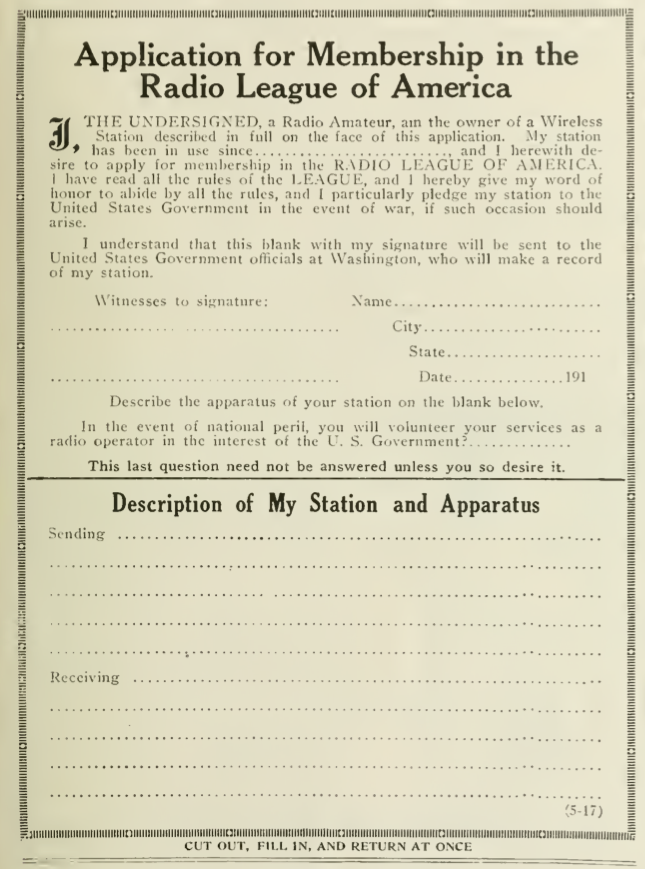

**DRAFT:** *Please do not share without permission of the author. Typeset versions in  [web](http://gernsback.wythoff.net/191906_amateur_radio_restored.html) \| [pdf](https://github.com/gwijthoff/perversity_of_things/blob/gh-pages/typeset_drafts/191906_amateur_radio_restored.pdf?raw=true) \| [doc](https://github.com/gwijthoff/perversity_of_things/blob/gh-pages/typeset_drafts/191906_amateur_radio_restored.docx)*

* * * * * * * * 

**W**INNING one war seems like a great accomplishment, but winning two wars, one after the other, is a historic occurrence for which we have few counterparts.

When on Nov. 11 the glad news came that the great war had been won, the world once more breathed freely, and so did the American Radio Amateur, who had done his "bit" in bringing the war to a successful termination.  But hardly was the armistice signed than the spectre of a new war---to the amateur---crept up over the horizon threatening to take away from him the freedom for which we had fought.

A nation may be opprest by a relentless foe in a similar manner by unust laws which curtail the freedom of its people.  Indeed, when it was proposed last winter to take away from the American Radio Amateur the freedom of the ether, which would have deprived the liberties of over 300,000 young men in this country, war was declared once more.  This was war to the knife; it was as short as it was decisive.  But Right as usual won over Might, and the American Radio Amateur won *his* war, and the Allies won theirs.

And, as the Allies will win the fruits of their victory in the months to come, so will the amateurs reap the fruit of their victory.  Indeed, the reaping has already begun.  On April 15th the ban on Radio, at least for *receiving,* was officially taken off, and a mighty shout went up when Radio Amateurs were again permitted ot use the ether to their hearts' content.  Altho the ban for *sending* has not been removed at this time of writing, the chances are that before the next issue is in your hands the freedom of the ether will be once more restored completely.[^dnls]

As soon as the newspapers published the welcome tidings on April 15th that the ban on receiving was off, hundreds of thousands of amateurs began dusting off their sets and aerials blossomed forth over night by the thousands to resume their former activities once more.

And wonders upon wonders!  When we put our sets away two years ago we were accustomed to hear nothing but the crisp dots and dashes in flute-like, staccato sounds coming from the high power stations which we all had learned to love.  But the war has changed everything---even radio, for now the *radio telephone* has come into its own.

Where formerly there was nothing but the *tah-de-dah* in our phones, the ether is now filled with the human voice flung far and broad over the land---nay, over the oceans---and as the months roll by the dots and dashes will grow less and less, and the human voice will come in over our aerials more and more, which is as it should be.

The writer has always contended that wireless telephony was the logical outcome of radio, and in years to come only the commercial high power stations will operate their dots and dashes with their high speed machines where the voice would not be as reliable.  But the future of Radio Amateurism in this country is centered upon the radio telephone.  While no doubt many of us will still cling to the dots and dashes, the radio telephone will probably soon be used in overwhelming numbers.

\begin{center}
\fbox{
  \parbox[c]{7cm}{
  
NAVY DEPARTMENT

Naval Communications Service

Office of the Director.

Washington, April 14, 1919

\vspace{3mm}

Editor Electrical Experimenter 

\vspace{3mm}

Sir:

\vspace{3mm}

The Acting Secretary of the Navy authorizes the announcement that effective April 15, 1919, all restrictions are removed on the use of radio receiving stations other than those used for the reception of commercial radio traffic.  This applies to amateur stations, technical and experimental stations at schools and colleges, receiving stations maintained by jewelers or others desirous of receiving time signals, receiving stations maintained by manufacturers of radio apparatus, etc.

\vspace{3mm}

The restrictions on transmitting stations of all types are still in effect, as are the restrictions on stations operated regularly for the reception of commercial radio traffic.  Both of the above classes of stations will be permitted to resume operation as soon as the President proclaims that a state of peace exists.

\vspace{3mm}

Attention is invited to the fact that all licenses for transmitting stations have expired, and that it will be necessary, when peace is declared, for the owners of these stations to apply to the Department of Commerce for new licenses.

\vspace{3mm}

Very respectfully,

(Signed) E. B. Woodworth, Commander, U.S. Navy, Assistant Director Naval Communications.

  }
}
\end{center}

**The Above Is the Text Of The Official Notification Restoring the Freedom of the Ether Once More.  The Ban on Sending Is as Yet Not Lifted.  When Peace Is Declared, While Technically the Ban for Sending Will be Off, It Should be Remembered That All Sending Licenses Have Been Cancelled During the War and New Licenses Must Be Secured from the Department of Commercie.  Address the Office of the Radio Inspector at the Custom House of Your District for Further Particulars.**

What a wonderful world it will be in one or two years hence!  You will step out into the star-lit night and myriads of voices---noiselessly and invisibly---will fill the air all over the continent, flung through the ether.  You will hear nothing and you will see nothing.  When you sit on the sea-shore gazing fascinated at the beauty of the tides, as they follow the moon, all the while the invisible and soundless voices will be all around you---nay, even pass through your very body.  But when you step in the humble little amateur radio station and clasp a pair of receivers onto your ears, the ether will be unlocked and all of these myriads of voices will be made audible to your ears.  A perfect Babel of voices will greet you, but by means of your tuning devices you will be able to pick out the very voice you wish to listen to, tuning out all the others.

It is a glorious thought that we are fortunate enough to live in an age where such things are possible, and we must prove worthy of our new-gained liberty, now certain.

And the writer regrets to say that before the war we did not realize how fortunate we were, and we did not show by our actions that we appreciated the freedom of the ether.

There was constant bickering and quarreling on the side of the amateur, among themselves as well as with commercial and government stations.  Profane talk took place not infrequently thru the ether, and many of us annoyed the commercial as well as the government operators by "hogging" the ether.  Hence, it was not surprising that the government tried to pass laws to curb the amateurs and curtail their liberties.

If Radio Amateurism is to prevail in the new era, the amateurs must stop their former nonsense and must settle down strictly to business.  They can and should receive all they want to their hearts' content.  They can and will listen very shortly to President Wilson's voice when he speaks to us from the "George Washington," where everybody is free to listen in.[^prwn]  Amateurs can listen in to their hearts' delight, whether it be to wireless-telephone or wireless telegraph.  But when it comes to sending, we must mend our ways.  If we do not, laws will be past sooner or later to curtail our entire liberties, and here the writer desires to make an important suggestion.

There are now a good many Radio Clubs and Associations all over the country.  We cannot have too many.  The suggestion is that every club and every association should appoint one or a number of expert amateurs to listen in nightly to messages that are violating the common rules, either by profane language, by "hogging" the ether, by Q.R.M. or by willful interference.[^qrm]  The offender should be sought out and promptly warned and should he repeat his offense a second time, he should be promptly reported to the Radio Inspector of the district, and the various publications catering to the amateurs should be notified.  A sworn statement relating the offense should be submitted to the publications, who will pledge themselves to publish the name of the offender.

The ELECTRICAL EXPERIMENTER, for one, will be glad to publish such names regularly, and it is believed that such measures will do more than anything else to increase the prestige of radio amateurism in the United States, and take it out of the school-boy class.  There is little doubt that if we follow such procedures Radio Amateurism in the United States will become one of the great institutions of this country.  We must show the world that we amateurs are serious-minded and do not use one of the greatest inventions for a plaything only or just a mere holiday.

The ELECTRICAL EXPERIMENTER thru the RADIO LEAGUE OF AMERICA shall be only too glad to publish letters from amateurs suggesting new ways and means to benefit the cause of Radio Amateurism, our columns being open to all worthy suggestions.

While for the present there is nothing to be feared of adverse legislation, still it is impossible to forecast that such legislation will not be attempted in the future.  We have won the freedom of the ether due to the splendid cooperation of Radio Amateurs in this country, and if we have won once we will win again.

The RADIO LEAGUE OF AMERICA is a clearing house for all Radio Amateurs in the United States, and today has more members than any other league, but it has not enough members.  It wishes to have every amateur as an enrolled member.  The membership of the Radio League, established in 1915, is gratuitous.  There are no dues or fees to be paid.  All the League wants is the name of every amateur and his address, so that first of all, if a national emergency arises, the Government can rely on the amateurs for quick communication.  Also in case adverse legislation should be attempted, the League wishes to notify every member immediately, as it did last December when the freedom of the ether was threatened.

We ask every amateur who is not a member of the League to sign the blank appended herewith.  It costs nothing but a 3-cent stamp to do so.  Every enrolled member is entitled to the membership certificate free of charge which is mailed to all members.  The membership of the Radio League of America now comprises 21,309 members.  If you are not a member at the present time, you should enroll at once by all means.

LONG LIVE THE RADIO AMATEUR!

[^dnls]: As Gernsback reported three months later, Secretary of the Navy, Josephus Daniels, attempted to maintain government control over radio activities after the war.  @gernsback_government_1919.  However, during the 1919 hearings on permanent naval radio control,

    > two congressmen pointedly criticized [Daniels's] wartime use of navy funds to purchase radio company assets without explicit authorization from Congress.  Further discrediting the secretary was testimony from amateur groups and commercial firms, including E. J. Nally's angry retelling of the travails of Pan-American Wireless [the hybrid government/private entity that incorporated all patents, personnel, and equipment from American Marconi and Federal Telegraph companies during the war].  The committee tabled the bill a month later.  The ire against Daniels spread to the rest of the House.  House Minority Leader James R. Mann publicly called for Daniels's impeachment over the purchase of radio company assets.
    
    @winkler_nexus:_2008, 254.
    
[^qrm]: QRM is the Q code (a set of standardized messages encoded in three Morse code letters) for "Are you being interfered with?"  These codes are often used among wireless communities as nouns rather than complete sentences, as is "QRM" in this paragraph: a stand-in for "willful interference."

[^prwn]: The SS *George Washington* was an ocean liner that carried Woodrow Wilson to Europe for the Paris Peace Conference.  At the request of the Navy Department, the ship was outfitted with a "radio telephone transmitter," purpose-built by General Electric's Research Laboratory.  On July 4, 1919, during its return trip across the Atlantic, Wilson attempted a holiday broadcast address to the troops.  The broadcast failed not for any technical reason, but because Wilson stood too far from the microphone.  As the story goes, the wireless operators were too nervous to ask him to step closer.  See Thomas H. White, "Radiophone  Transmitter  on  the  U.S.S.  George  Washington," *United States Early Radio History,* <http://earlyradiohistory.us/1919wsh.htm>.