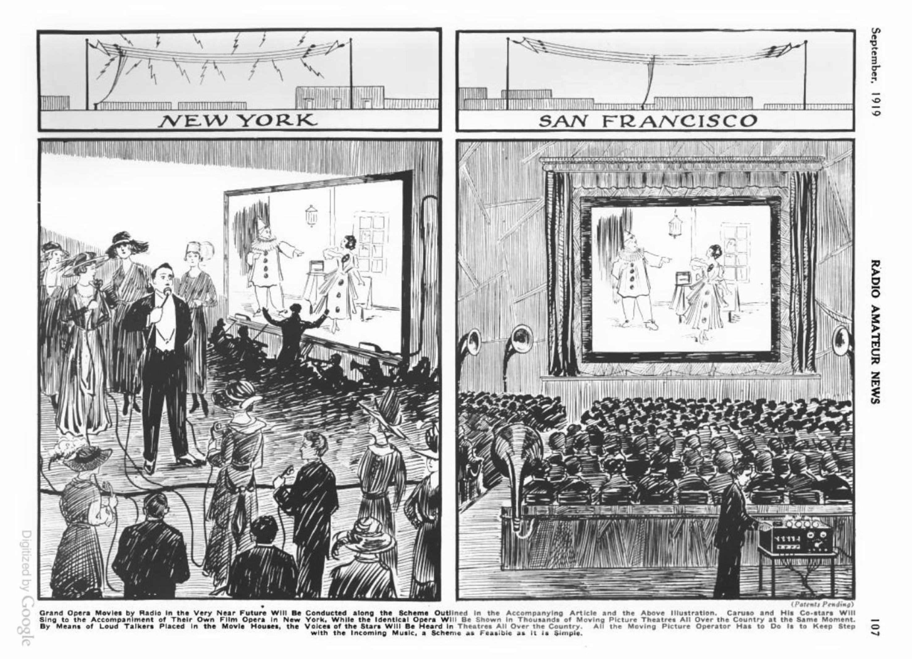

**DRAFT:** *Please do not share without permission of the author. Typeset versions in  [web](http://gernsback.wythoff.net/191909_government_radio_control.html) \| [pdf](https://github.com/gwijthoff/perversity_of_things/blob/gh-pages/typeset_drafts/191909_government_radio_control.pdf?raw=true) \| [doc](https://github.com/gwijthoff/perversity_of_things/blob/gh-pages/typeset_drafts/191909_government_radio_control.docx)*

* * * * * * * * 

A recent newspaper report from Chicago brought the not at all surprising news that grand opera music had been transmitted by wireless telephone for over one hundred miles. Sensitive microphones placed on the stage of the opera house caught the sound waves; the impulses then being stepped up in the usual manner by means of a transformer were led into an amplifying vacuum tube. Here the current was impressed upon the radio telephone transmitter in successive stages and then sent out over the aerial on top of the opera house. Wireless amateurs all about the surrounding country were thus able for the first time to hear grand opera. While this was only an experiment, grand opera by wireless will soon be an accomplished fact.

During the next few years it will be a common enough experience for an amateur to pick up his receivers between eight and eleven o'clock in the evening and listen not only to the voice of such stars as Scotti, Tetrazzini, Mac Cormick and others, but also to the orchestra music as well, which is picked up by the sensitive transmitter along with the voices of the stars. The surprising thing is that it is not being done now.

This probably is due to the fact that as yet no means has been found to reimburse the opera companies for allowing everyone to listen in. While of course listening to the music is not as satisfying as witnessing the performance in person, still many music enthusiasts would rather stay home listening to the music alone than to witness the performance itself. To your true, dyed-in-the-wool opera fiend the performance is of secondary importance, the music always coming first.

But we must give a thought to the management, which cannot subsist on an empty opera house if everyone could listen in to the actual rendering of the opera without paying for the privilege. Needless to say that the producers would soon find themselves bankrupt. For this reason we cannot expect that grand opera by wireless will be an accomplished fact until some means has been found to reimburse the producers, and, as every wireless man knows, this is very difficult to do. Anyone with suitable radio apparatus can "listen in" to the music without much trouble. No matter on what wave-length the music would be rendered, every wireless man would find a way to listen to it without serious inconvenience.

Probably the only logical way out would be for the management of a grand opera company to advertise in the newspapers, stating that no grand opera via radio would be given unless a certain amount of revenue were guaranteed by radio subscribers before "radio performances" would be given. This would mean that probably ten out of one hundred radio stations, amateurs and otherwise would pay monthly or yearly dues to sustain the management, which then would not have to care how many were listening in.

This is the only practical solution. As for technical difficulties, there are of course none. All that is necessary for the producing company is to install a high-class wireless telephone outfit which can be bought on the market right now and which is immediately available. The rest is up to the wireless fraternity, which has nothing else to do but listen in.

At the receiving end, the future up-to-date radio opera enthusiast will of course, have a first-class receiving outfit, using vacuum tube amplifiers, and a loud talker. Then it will be a simple matter to listen to Scotti himself, though he be a thousand miles distant. His voice will come out loud and distinct and the amateur's family will be enabled to " listen in " to their heart's content.

There is still another novel scheme recently originated by the writer.

The underlying idea is not only to give grand opera by wireless, listen to the music and to the singers only, *but to actually see the operatic stars on the screen as well.* This is how it can be readily accomplished *by means which are available to-day,* and without the slightest technical difficulty.[^loby]

Let us say, by way of example, that the opera "Aida" is filmed in its entirety. This may mean a four or five reel feature. The opera will be filmed just like any other photo-play.

Our large illustration shows what happens next. The stars, singers, players, the chorus, orchestra, conductor, etc., are then assembled in a moving picture studio and in front of them is the usual screen. The opera "Aida," which had been filmed before, *is now repeated on the screen* while the entire cast follows the screen picture closely. Each performer, every star, every member of the chorus has his or her own microphone in which he or she sings the regular score, watching closely the film-play as the action is unreeled on the screen. The moving picture opera through the film operator keeps time with the singers, and the singers themselves must keep exact time with the performance as it is unrolled on the screen before their eyes. Inasmuch as the identical cast has been filmed, it will not be difficult for them to keep time with their own performance, as may readily be imagined. *In other words, when Scotti sees his own figure appearing on the screen he will know exactly how and when to sing into the microphone in front of him.*

All of the microphones go to the wireless telephone station located in the radio room above, and there are, of course, sensitive microphones in the studio which pick up the sounds from the orchestra as well. All sounds are then stepped up through the usual amplifiers and are then fed into the high power vacuum pliotrons, *which finally amplify the original sound several million times.* These impulses are then sent out over the usual aerial located on top of the house and are shot out all over the country instantaneously.

Five hundred to 1,000 miles away---and for that matter all over the country---every moving picture house will have been supplied with the identical film at the stated performance, it having been announced days ahead that the grand opera "Aida" will be given at such and such an hour.

Of course, where the distances are large, the hour of rendering the opera will vary. Thus, for instance, if Scotti were singing in New York and a performance would start at eight o'clock in the evening, 12 New York time, it would start in San Francisco at four o'clock in the afternoon, as a matinee, due to the difference of time. Inasmuch as such performance would probably only be held once a month, people would not mind the inconvenience due to slight difference of time.

Every moving picture house will have its receiving apparatus with its usual amplifiers and anywhere from six to one dozen loud talkers scattered through the house. Exactly at the stated time the moving picture operator will begin grinding away the opera has begun. Simultaneously the distant orchestra will begin playing, filling the house with music.

When the actual performance begins, it will be an easy matter for the operator to keep time with the incoming music. All he needs to do is to grind faster or slower, and inasmuch as Scotti with his performers in New York is watching the identical film, the distant operator will have no trouble in having the music keep time with his film. If he finds that he runs ahead for one second, he can readily slow up the next and vice versa. With a little practice it will be easy for the distant operator to time himself perfectly, thus giving the patrons of his house an ideal performance.

From a financial standpoint it would be good business for the opera company, as well as for the moving picture house, *both of which would thus derive a new income running into the hundreds of thousands with hardly any expense whatsoever.* The grand opera with an outlay of from one thousand to three thousand dollars could buy its high power radio telephone outfit, while every live picture house throughout the country would be able with an expenditure of less than five hundred dollars to buy its necessary radio telephone equipment *and this cost would only be initial,* because nothing except burnt-out vacuum tubes need be replaced and there is practically no cost of upkeep.

The writer confidently expects that this scheme will be in use throughout the country very shortly. 

[^loby]: This wasn't the first proposal for broadcasting both the sound and image of live opera performances, but it was one of the most fully developed at the time.  Thomas Edison, for instance, is quoted in an 1893 *New York Times* article as saying, "My intention is to have such a happy combination of photography and electricity that a man can sit in his own parlor, see depicted upon a curtain the forms of the players in opera upon a distant stage and hear the voices of the singers."  See @wlaschin_encyclopedia_2004, p. vii.

    For a musicological account of more recent initiatives to broadcast opera performances to cinema screens around the world, see @steichen_metropolitan_2009.