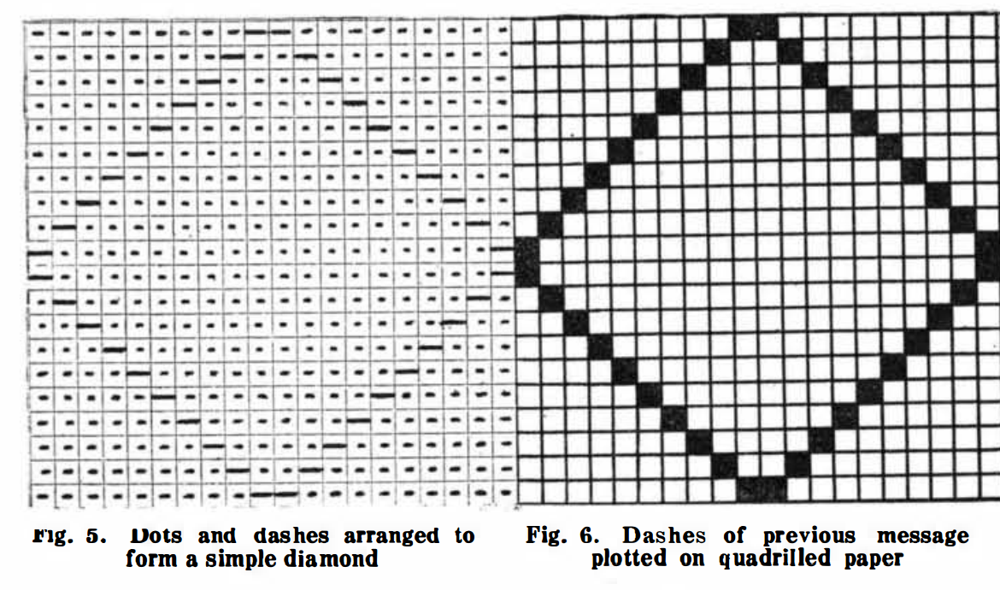
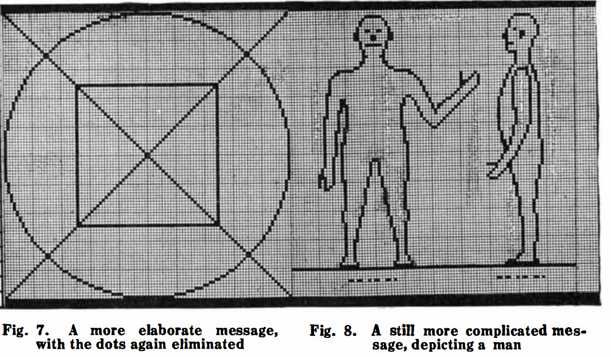
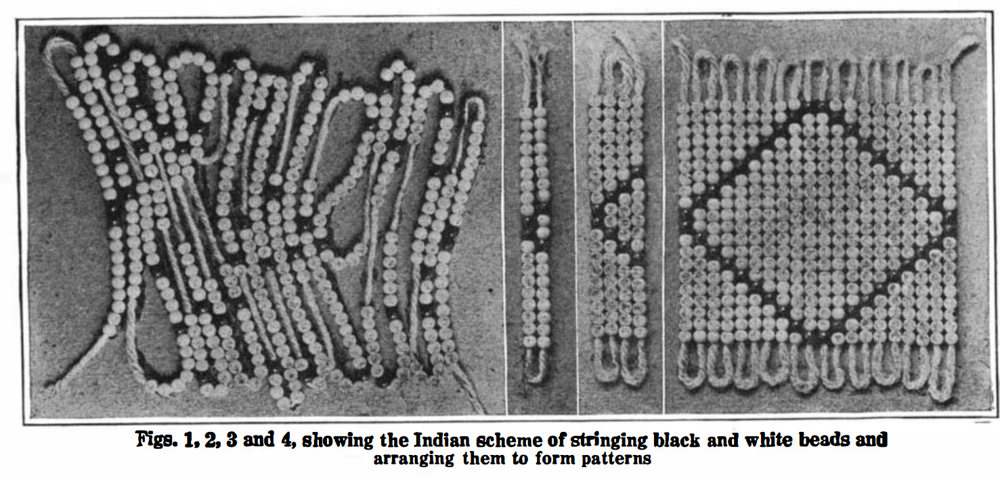

**O**NCE again interplanetarian radio has come to the foreground. For the past few weeks the press has been full with all sorts of talk about radio from Mars and radio from Venus. Even the poor old moon has not escaped.[^nkl]

Signor Marconi recently announced from London:

> We occasionally get very queer sounds and indications, which might come from somewhere outside the earth. We have had them both in England and in America. The Morse signal letters occur with much greater frequency than others, but we have never yet picked up anything that could be translated into a definite message. The fact that the signals have occurred simultaneously at New York and London with identical intensity seems to indicate that they must have originated at a very great distance. We have not yet the slightest proof of their origin. They are sounds. They may be signals. We do not know. They are not static and we have nothing to guide us at present as to how the signals are caused.

> We do not get them unless we set up a special wave length, very much greater than the wave length ordinarily used. Sometimes there may be a long wait before we hear anything, or we may hear these sounds in twenty minutes or half an hour. They occur when we are *using a wave length of approximalely 100 kilometers,* which is three or four times the length used for commercial purposes.

> They might conceivably be due to some natural disturbance at a great distance, for instance, an eruption of the sun causing electrical disturbances.

Asked whether attempts were possibly being made by another planet to communicate, Signor Marconi said:

> I would not rule out the possibility of this, but there is no proof. We must investigate the matter much more thoroly before we venture upon a definite explanation.

He added that the mysterious sounds are not confined to any particular diurnal period. "They are equally frequent by day and night," he said.

Since Marconi made this announcement a great controversy has raged among scientists and would-be scientists. Many interesting things have been printed among the wagon-loads of pure rubbish, that convulse one with its unintentional humor.

Scientists, as a rule, are the most one-sided folk on the face of the globe. It is seldom that you find an expert on astronomy who is at the same time an expert on radio or in physics.

To give but one ludicrous example. Let us only quote Professor Harold Jacoby, the eminent head of the Department of Astronomy of Columbia University of New York. Says the Professor:

> It is highly improbable that the people of another planet, if there are any such, *would be acquainted with the Morse code, which is a complicated system of dashes and dots based on our alphabet. It was invented by Morse and cannot be regarded as universal among civilized peoples.*

> If the people of another planet were seeking to signal us they would probably select a system of signals which would be under stood on any planet where civilization exists. Such a system would much more *probably be based upon number than upon letters of the alphabet, for the People of different planets would be no more likely* to have the same alphabet than different peoples here on earth are to have the same language.

The italics are ours. Evidently the worthy Professor imagines that the Martians would drop wooden or steel numbers over our aerials. We might ask WHAT else the Martians could use besides dots and dashes. A radio telegraph message cannot by any conceivable means be made up of any other code except either dots or either dashes, or else a combination of the two. The dots and dashes may be high or low buzzes, whistlings, flute-like tones or any other form of sound. BUT there must be dots or dashes or both.[^sti] There is only one alternative and that is the voice.---Radio Telephony in other words. We will return to this later. Other eminent scientists such as Dr. Greenleaf W. Pickard, John Hays Hammond, Jr., Professor Svante Arrhenius of the Chair of Physics of the Stockholm Technical Institute, seem to think that the mysterious signals are caused by the sun.[^sva] So thinks Dr. Charles P. Steinmetz, adding that interplanetarian wireless "must be regarded as a wild dream."

Other eminent scientists such as Nikola Tesla, Thomas A. Edison, and of course Marconi think it not impossible that the signals are coming from some planet such as Mars or Venus. Indeed the believers in this theory are far more numerous than the unbelievers.

In his former editorials the writer has often dwelled upon interplanetarian communication, and he is of the firm opinion that if communication is ever establisht between the earth and the outside world, it will of course be by the agency of Radio.

Let us now analyze the situation and draw a logical conclusion from the facts on hand.

The most important fact---entirely overlooked by the press and all would-be scientists---is found in that one line of Marconi's statement:

> The signals occur at a wavelength of approximately 100 kilometers.

That is a fact of tremendous importance.

When radio first was invented some twenty odd years ago, we used but trifling wave lengths from less than 500 meters upward. It was soon found out that to bridge great distances, such as sending across the ocean and further, much longer wave lengths were absolutely necessary. In other words, *the greater the distance we wish to cover the greater the wave-length we require.* Thus today our great transoceanic radio stations operate on wavelengths from 6,000 to 16,000 meters (6 to 16 kilometers). This gives an average of about 10,000 meters.

Let us now assume that the average distance these stations cover is 5,000 miles. That gives us 2,000 meters wave-length for every 1,000 miles we cover.

If now one of our radio engineers were to build a station that could transmit from the earth to Mars---a distance ranging from 60 million miles down to 35 million miles during opposition---he would certainly adapt his wavelength to the distance.  A simple calculation---based upon terrestrial standards---reveals then that the necessary wavelength would he at least 30,000 *kilometers* an unheard of figure compared to our 6 or 12 kilometer pigmy wavelengths.[^wlh]

But we must not forget that the human mind is unused to apply this terrestrial yardstick to celestial distances.

Our conclusion must then be that *if any extra terrestrial messages are picked up by us they will be received on wavelength at least above 20,000 kilometers.* This would make Marconi's 100 kilometers look quite sick!

Here then is a chance for our earnest investigator to get busy at once. Tuning coils or concentrated inductances to tune up to 30,000 kilometers (30,000,000 meters) can be assembled for less than $100 today, if used in connection with a *very* large aerial. If there are any extra-terrestrial messages, I predict quick confirmation of them.

On the other hand, the intelligent creatures who know how to send radio messages across a chasm of 50 million miles, admittedly know a few things about the game themselves. They may have sent these messages for centuries upon centuries, waiting for us to grow up and finally hear them. Thus the Martians and probably the Venerians are surely on an infinitely higher plane of civilization than ourselves. And we with our twenty odd years' experience in radio---don't we really look foolish in the extreme?[^aln]

But to make the point clear, if we *do* get messages, they probably will not all be in dots *and* dashes. They may come in musical notes, the same as we transmit radio band music from a phonograph over hundreds of miles, or they may come in the actual voice (providing these beings talk like we do), in other words, radio telephone messages. But time will tell. In the meanwhile we shall wait a bit longer.

[^nkl]: As early as 1896, Nikola Tesla speculated that disturbances in his equipment during the famous experiments with wireless power transmission could be of extraterrestrial origin.  "It was some time afterward when the thought flashed upon my mind that the disturbances I had observed might be due to an intelligent control.  Although I could not decipher their meaning, it was impossible for me to think of them as having been entirely accidental.  The feeling is constantly growing on me that I had been the first to hear the greeting of one planet to another."  @tesla_talking_1901.  For a complete bibliography of Tesla's comments on the possibility of extraterrestrial communication, see @dick_biological_1996, p. 401 fn. 5.

    The recent flurry of talk mentioned here most likely refers to a January 27 announcement from Guglielmo Marconi that he had received "very queer sounds and indications, which might come from somewhere outside the Earth."  *The New York Times* followed up on this story almost every day for weeks after. @_marconi_1920

[^sti]: One proposal for "building up a common language with our new correspondents" was put forward by H.W. and C. Wells Nieman in the pages of *Scientific American* the month after Gernsback's article was published.  Analogizing Native American beadwork to Morse code ticker tape, the scheme involves sending a message that can be reconstructed on the receiving end line by line as an image, complete with the Morse code word for the depicted object as a caption.

    > As an intelligent being you must be familiar with the principles of pictorial representation, and while this may not conform to the Martian standard of art its intention is unmistakable; your knowledge of gravity, also, will enable you to place it right side up according to the horizontal line.  
    
    @nieman_what_1920
    
     <!-- no figure -->
    
     <!-- no figure -->
    
     <!-- no figure -->
    
    Recourse to Native American weaving techniques in understanding new media technologies was later made in the context of integrated circuits. Lisa Nakamura discusses how the Fairchild Semiconductor built a factory on a Navajo reservation in 1965, purportedly for the community's "manual dexterity, and affective investment in native material craft."  See @nakamura_indigenous_2014.
    
    For an account of indigenous North American recording systems that complicates commonly accepted distinctions in the history of writing technology, see @haas_wampum_2007.   

[^sva]: Despite his skepticism about extraterrestrial wireless messages, Arrhenius was a proponent of the theory that---due to its observed heavy cloud cover---the planet Venus was home to a lush, tropical biosphere.  In his lectures on the evolution of the planets, *The Destinies of the Stars* (1918), he claims: 

    > A very great part of the surface of Venus is no doubt covered with swamps, corresponding to those on the Earth in which the coal deposits were formed, except that they are about 30 degrees C (54 F) warmer. … The temperature on Venus is not so high as to prevent a luxirant vegetation.  The constantly uniform climatic  conditions which exist everywhere result in an entire absence of adaptation to changing exterior conditions.  Only low forms of life are therefore represented, mostly no doubt belonging to the vegetable kingdom; and the organisms are nearly of the same kind all over the planet.  The vegetative processes are greatly accelerated by the high temperatures.
    
    @arrhenius_destinies_1918, p. 251-253.  Quoted in @dick_biological_1996, p. 130.

[^wlh]: By the time Karl Jansky, an engineer with Bell Telephone Laboratories, discovered that natural radio waves emanate from celestial bodies in 1933, giving birth to the field of radio astronomy, the fervor over interplanetary communication had died down significantly. See @jansky_electrical_1933. @jansky_radio_1933.  

    Steven J. Dick writes that no one "considered Jansky's discovery as interstellar signaling, since no regularity was detected in the signal.  Gone were the days of Marconi when any mysterious transmission could be so interpreted, perhaps because the likelihood of intelligence on Mars had declined and the planet in any case was not at one of its favorable oppositions.  But the lure of discussing interplanetary communication at least in theoretical terms was not gone." 
    
    @dick_biological_1996, p. 411.

[^aln]: The then-dominant idea that Martian civilization was much older than humanity in part stemmed from the Kant-Laplace nebular hypothesis of solar system formation.  Developed independently by Immanuel Kant in 1755 and Pierre Simon Laplace in 1796, the theory was that the sun and its planets formed out of a rotating nebula that gradually flattened and compacted under the force of gravity.  In this model, because Mars is smaller than the Earth, it cooled out of the cloud of materials surrounding the young sun faster and therefore began its ecological evolution much earlier.  See @markley_dying_2005, p. 65.