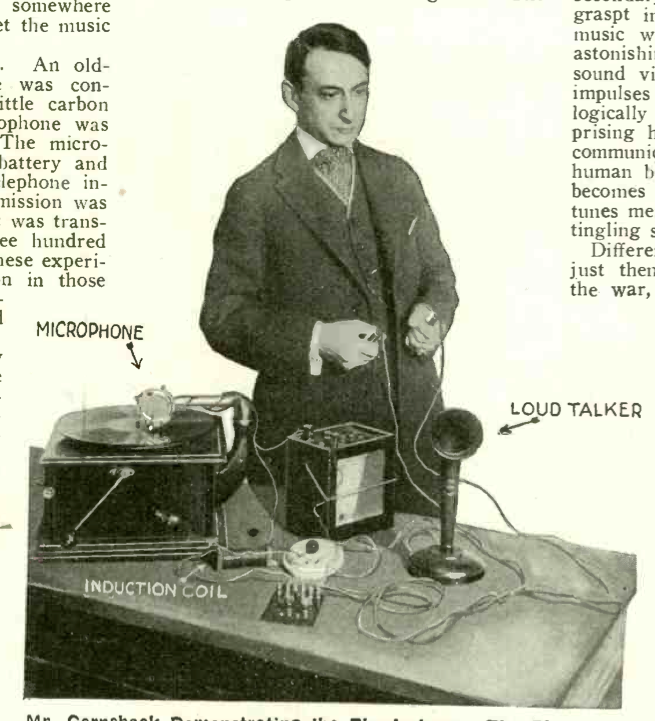
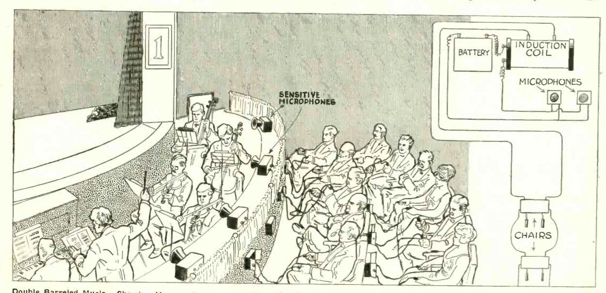
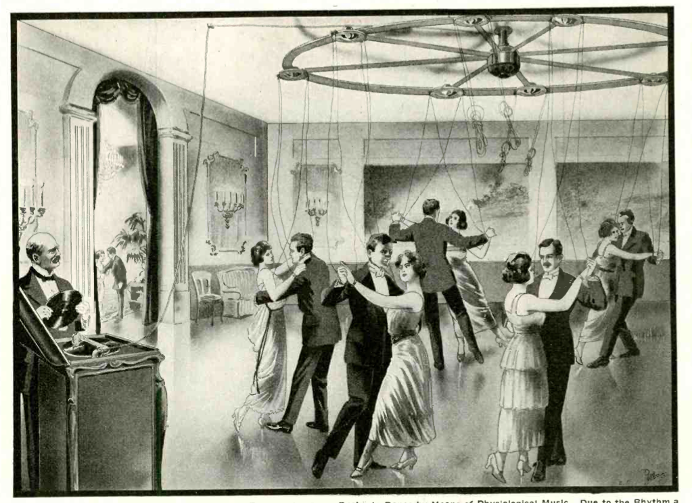
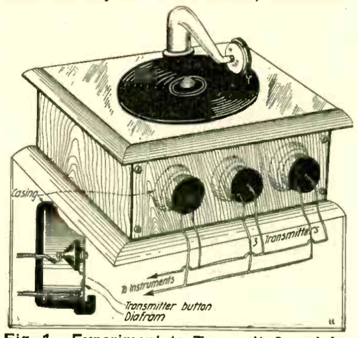
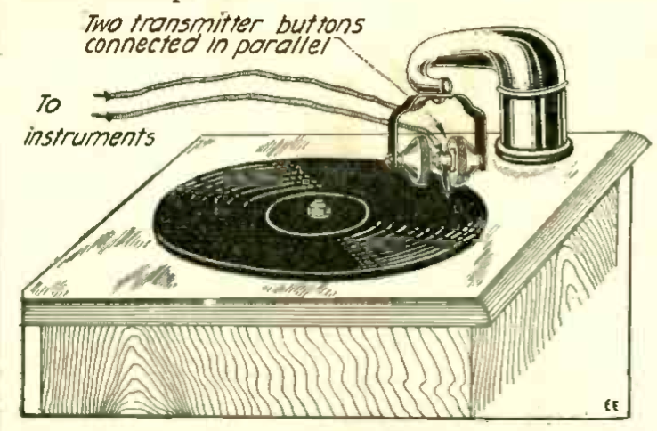
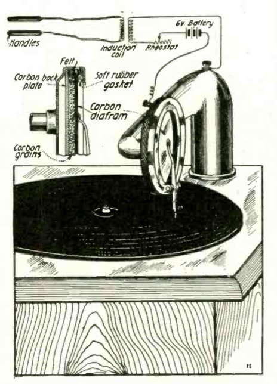
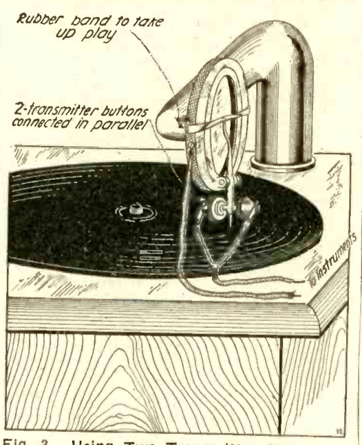
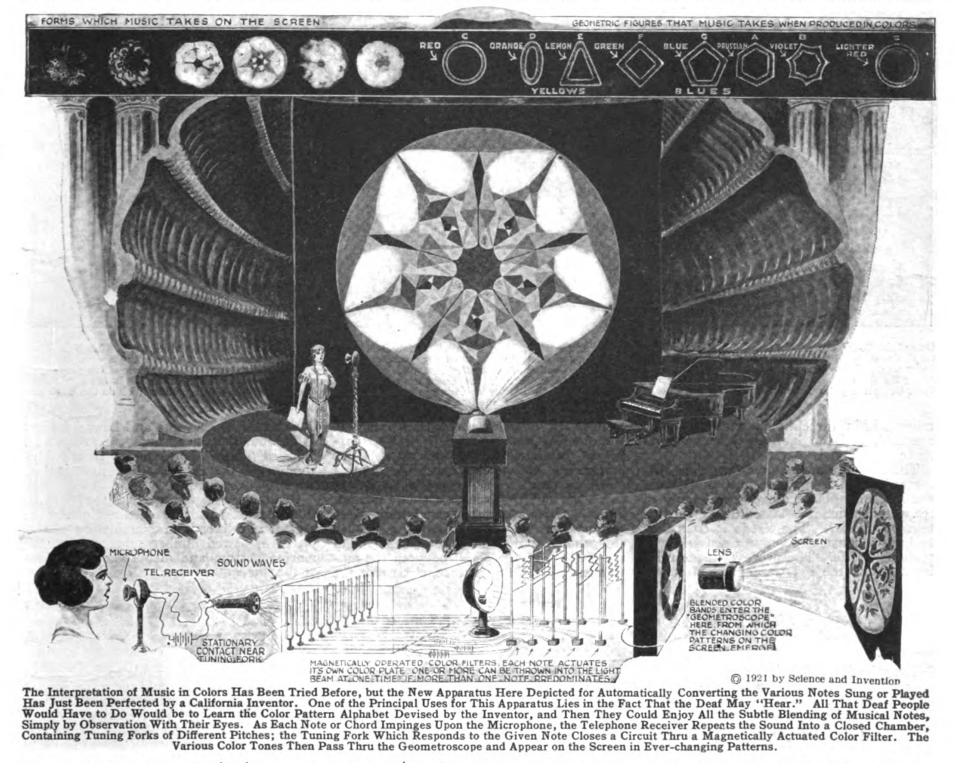

* * * * * * * * 

**W**HEN I was sixteen I secured an old-fashioned Pathé phonograph of the cylindrical record type. You know the kind that was in vogue years ago. Being much interested in electricity in those days, the thought occurred to me, the same as it occurred to thousands of others, namely, why not transmit the music electrically by putting a sensitive microphone somewhere on the phonograph and thus get the music at a distance.

No sooner said than done. An old-fashioned Hughes microphone was constructed by means of three little carbon rods, and this miniature microphone was attached to the sound box. The microphone was in series with a battery and the primary of an ordinary telephone induction coil. The music transmission was excellent and phonograph music was transmitted over a distance of three hundred yards on my father's estate. These experiments created quite a sensation in those days, and my friends, all electrical "bugs," were much elated and pleased with the stunt.

One evening I accidentally touched the two wires of the secondary terminals of the telephone coil and was quite surprised to get a smart and disagreeable shock. That was in 1900. The early experiments were soon forgotten, but in 1917, while editing an article in this magazine, where a young" man had re-discovered the ancient experiment, I thought of that shock, and I understood immediately what that shock really was. I accordingly set to work and immediately built a new transmitter which was attached to a Victor phonograph sound box, and which is shown in Fig. 4. The connections are shown from which it will be seen that the microphone is in series with the 6-volt storage battery and the primary of an induction coil such as is used in telephone work.

The writer used a regulation sound box merely by making a microphone out of it and substituting a carbon diafram for the mica diafram. The space between the back carbon and the carbon diafram is filled out with polisht carbon grains. The mechanical suspension of the carbon diafram must be the same as the one for the mica-diafram. In other words, the vibrations of the phonograph needle must be faithfully past onto the carbon diafram, the same as is the case with the mica type. When the connections are correctly made and two handles are now attached to the secondary of the induction coil, and these graspt in your hands, the rhythm of the music will be felt faithfully and with astonishing fidelity. What we do feel is sound vibration translated into electrical impulses which in turn are felt physiologically by the human nerves. It is surprising how well this translated music is communicated to the nervous system of the human being, and with a little practise it becomes possible to recognize the different tunes merely by the variations of the little tingling shocks.[^trps]

Different records were tried in 1917, but just then the United States entered into the war, and the experiments came to a sudden end. Recently, however, they were taken up again with the following results. Improvements were made on the microphone and a great many new types were tried out, because the original type was not entirely satisfactory. Later experiments, however, proved to me that 1917 type in principle was probably the best that could be produced. From some ten or twelve types which were evolved by me then, a few are shown here. Many different records were tried, and it seemed to be readily establisht that the different tunes, the different musical instruments, as well as voices, could be readily differentiated physiologically *without listening at all to the music,* or without hearing any sound whatsoever.  Of course, it goes without saying that such experiments must be made with the phonograph in a different part of the building with the handles so far away that the music from the phonograph cannot be heard at all. When using the microphone type as shown in Fig. 4, the sound near the phonograph is still audible, altho not anywhere near as loud as if the original mica-diafram were used.

For this reason the handles must be located in another room so that whatever music leaves the phonograph cannot be heard. I used a double-throw switch and a loud talker of the type commercially sold, and invited visitors to first listen to the phonograph record by means of the loud talker. Then the switch was thrown, and of course no sound was heard at all. By grasping the handles, the visitors could readily follow the rhythm of the record, and right here a curious thing happens.

Some people, altho musically inclined, have trouble in following the music, while others immediately recognize the different strains and have no trouble to sing or whistle with this physiological music. There seems to be a difference in the nervous system of individuals, and some people can more readily translate the rhythm than others, altho not necessarily more musically inclined. Other tests were made paralleling the idea *by using no phonograph at all,* but simply a microphone into which a person spoke. By having the experimenter count from one to a hundred, the other party at the far end could feel the voice impulses and after a while managed to "understand" the voice by physiological impulses.

In Fig. 1 is shown another type of transmitter attacht in front of the sound box in the phonograph. It consists simply of three transmitters connected in parallel, the connections being the same as usual. This, however, did not work as well, and very little could be felt at the secondary end.

In Fig. 2 is shown two transmitters, because the writer at one time when working with a single transmitter on a disc type phonograph did not receive all the impulses, that is to say, only one side of the lateral cut vibrated the diafram.

The same idea is shown in Fig. 3 where two transmitters were simply attached to the needle holder, the rubber band serving simply to feather the action, but the results in neither case were good, and the original 1917 type transmitter with certain refinements has been found to work best in all respects.

What purpose is accomplisht by these experiments? Ordinary human beings certainly do not require the translation of musical impulses into their nervous system, *but for the deaf a vast and important field has been opened.* Here we have a means of translating music into the nervous system of a deaf person who has not the slightest conception of music. Of course, it should be understood right here that I do not mean to convey the idea that a deaf person will actually "hear" the music. What he does get, however, is the rhythm, and he certainly gets this very definitely as has been actually demonstrated by tests with deaf persons upon which the writer experimented. It has been found that a deaf person can readily understand the different musical pieces, and ' can even recognize different musical instruments with very little practise.

Of course, the deaf person must learn the same as any other human being, for it is a well-known fact that if a person totally deaf were restored his hearing, he would not be able to understand what you said to him for some time to come.  He would have to learn and judge the sound just the same as a child.  The same is the case with a totally blind person who has never seen daylight.  Experiments made with such people invariably prove that as soon as the eyesight is restored, they do not see in the sense that the normal person does.  They have not the slightest conception of perspective and will invariably put the hands out before the eyes in order to judge the distance.  The far away mountain will look to them just as near as a wall three feet away, and it is only gradually that a previously blind person learns to judge the distance, i. e., by experience.

The same is the case with the deaf person and physiological music.  He must first learn the rhythm of the music, and after a while it will become easy for him to understand what the music or even the human voice is like if introduced to him by means of the Physiophone.

I even go further and predict that sooner or later a totally deaf person will carry around with him an apparatus along the line of the "deaf-phone" type, the apparatus consisting of a sensitive microphone such as is used with the deaf-phones now.  The microphone will be in series with a portable battery and telephone coil, while the secondaries of this coil will go to metallic wrist bands of the wearer.  Then when he is spoken to he will soon be able to understand the meanings of the small electrical shocks which are the result of the human voice impinging upon the sensitive microphone.

Coming back to our phonograph experiments, the deaf person can now enjoy dancing when he certainly could not do before, for he had no music or rhythm to dance by.  One of our illustrations shows how deaf persons will now be able to dance by means of phonograph music and the Physiophone.  The revolving wheel below the ceiling in the room or dance hall has flexible wires hanging down, which in turn connect with the secondaries of the telephone coils.  These are connected with the microphone and battery near the phonograph in the manner stated above.  Wires hanging down from this wheel connect to metal wrist pieces attached to each one of the dancers.  As soon as the music starts, the dancers become conscious of the music and begin to dance, enjoying the dancing, perhaps, even more than normal human beings, due to the electrifying effect of the current.  As the dancers progress, the overhead wheel keeps turning so that the wires do not become entangled.

As for the normal human being he can also enjoy the physiological effect of the electrical current for the principal reason that Faradization is healthy and invigorating and entirely harmless.  Another one of our illustrations shows what can be accomplisht along these lines for the normal human being.  Picture a concert hall, along the stage of which a battery of sensitive microphones is located.  The current is led to the primary of a large induction coil in series with the battery.  Secondary leads go to metallic handles hung at the back of each orchestra chair thruout the theatre.  As soon as the music starts, every one in the audience can grasp the handles, and they will now experience the novel effect of *not only hearing the music but also feeling it in a very invigorating manner.*  This thing has already been tried out by the writer in a small way.  It is perfectly possible to put your body in series with a loud-talker telephone.  Of course, the music coming out of the horn will now be weakened, but if your hands are wet or moist, the weakening of the loud-talker music is not too great.  You are now enabled to *hear* the music as well as *feel it.*  It will be noted in one of the photographs that a rheostat is used, which is quite necessary to reduce the current.  Some phonograph records as for instance band music are so loud and act so powerfully upon the microphone diafram that it is quite impossible to hold onto the handles comfortably.  It should be noted that on some phonograph records not all the sounds can be transmitted.  In other words, very high sounds do not make themselves felt at all, and some such records as the flute or other soft musical instruments do not lend themselves well for physiological effects.  Records containing xylophone, piccolo, band music and the ones with singing voices are probably the best.

[^trps]: Gernsback had an abiding interest in the transposition of the senses and the reproduction of sensory experience.  See, for instance, **After Television, What?**  A 1921 editorial setting up an article by Edwin Haynes on "A New Color-Music Instrument" designed by William Maulsby Thomas in Los Angeles:

    > An interesting feature of the unison color-music instrument is that it gives each note of the musical scale a distinctive geometric figure and definite color, so that when an orchestral performance is translated and projected upon a screen the several geometric figures assemble themselves into a sequence of symmetrical multicolored forms, of great variety and beauty.

    Gernsback speculates that all of the senses may in fact be translatable, not just from sound to sight or touch.

    > Will we stop here? Not at all. We can still transpose the ear for the touch. The writer recently showed this in his Physiophone where ordinary phonograph music was transformed into electrical impulses, which latter were felt by the hands. There was of course here no audible music---nothing was heard---but the rhythm was faithfully preserved. Thus it was possible with but little practice to recognize difierent pieces of music, were they a march or a waltz.

    > How about the sense of smell? Can we transpose music into smells, or rather odors, scents or perfumes? To be sure it is possible, but it will be difficult to convey a sonata of odors to our audience. But with pipes scattered thru an auditorium and powerful blowers as the "odor-organ," it seems not so difficult. The trouble will be to find the proper odor for each note. Thus, to decide if A-flat is represented by jasmine, or violet, or attar of roses, may presumably be left to the future poet-musician.

    > This leaves us with the last of our senses---taste. Can we transpose music into taste? Why not? Our ever-ready servant electricity may solve the problem. We can already taste radio messages, so why not music? We know that placing two wires from a dry cell on the tongue gives us a sour sensation---taste. By using different metals, different tastes are had. Thus copper gives an acrid-metallic taste, silver a clean-sour taste, etc. Suppose we make a "comb" of many metals and conductors to each of which a wire is attached. The comb to be placed into the mouth so that it lies on the tongue. By a little experimenting we will readily transpose music into gustatory sensations---and not to make a pun---we will now be able to suit every taste!
    
    @gernsback_innovations_1921.

      <!-- no figure --> 