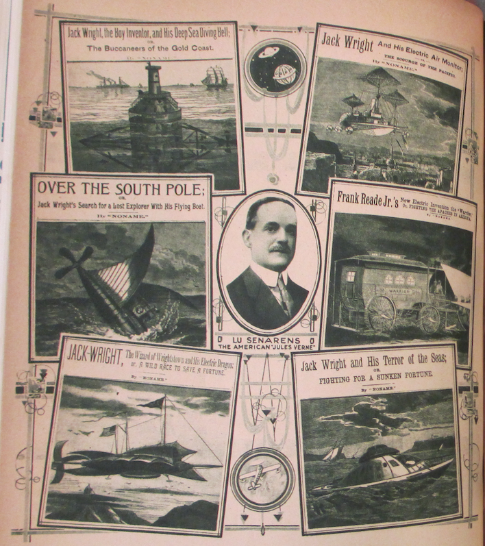
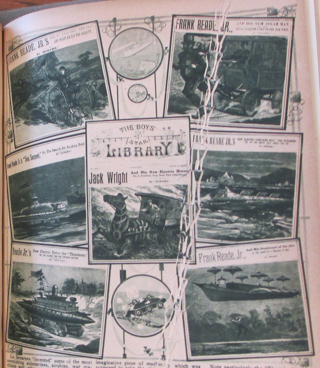

* * * * * * * * 

**A**LTHO not generally known, there lived some forty years ago a personage known to thousands of readers by the *nom de plume* of "Noname."  These were the days of the nickel novels when the Nick Carter series, Jesse James stories and Old King Brady were the talk of the day.[^dmn]  For a nickel you bought a complete 32-page novel on closely printed pages in small type.  These novels were always hair-rasers in more than one respect, and many of them have gone down as classics.

Lu Senarens, known to tens of thousands as "Noname," was perhaps the most prolific of these writers, and one of the most prophetic.[^nnm]  Not only did he turn out a host of these wonderful stories, but he wrote over one thousand of them, each one containing from 35,000 to 50,000 words.[^nbr]  Each of these stories were compete and had no continuations.  The hero of most of the stories was Frank Reade, Jr., "the boy inventor," who supposedly invented all the many marvelous scientific wonders of that day.

Naturally, these were the days before the trolley car, the telephone, the submarine, the aeroplane, and many another modern invention.  Mr. Senarens, a true genius, the same as Jules Verne, had one of the most fertile imaginations.  He was not a technically-trained man nor even an engineer.  His scientific knowledge was obtained solely from reading books and other scientific publications.  His inventions were of course nothing but pure fiction and existed only on paper.[^sen]

Lu Senarens "invented" some of the most astonishing submarines, airships, war machines and other world beaters, but the strangest part about it is that in those days no one believed that either the submarine or the aeroplane would ever be actually invented.  As a matter of fact, they were considered as physically impossible, not only by Senarens himself, but by leading scientists who lived in the early 70's and 80's.  It is not generally known that Senarens corresponded regularly with Jules Verne, who encouraged the American writer and read his stories as well.[^vrn]

The illustrations which we are publishing herewith give but a faint idea of the stories which appeared in the early 80's, almost forty years ago.[^yqy]  We have among others the "Electric Tricycle"; then we have the "Steam Man of the Plains; or Terror of the West," a most marvelous imaginative piece of machinery which was supposed to take the place of a horse and could draw an iron-clad wagon over the prairies.  The "Sea Serpent," as its name implies, was a most ambitious submarine; then we have the "Electrical Horse," an adjunct to the steam man which is propelled similarly.  The "Electric Thunderer" (armored war car) is suggestive of the recent modern war machines and quite as formidable.  The "Electric Submarine Boat," which may be noted, digs its path under an ice field and is worth our atention, because only three years ago Simon Lake, the inventor of the modern submarine, proposed the identical submarine to travel to the North Pole underneath the ice.  The "Greyhound of the Air" approaches the modern airships, while the "Deep Sea Diving Bell" is only little different from those actually used today.

Note particularly the "Electric Air Monitor" engaged in an aerial bombardment.  If you substitute the aerial monsters which were in use during the war and which bombarded the various cities, you have here a prophecy that is not far wrong.  One of the most curious inventions of Mr. Senarens is undoubtedly the "Flying Submarine" as shown in one of our illustrations.  This was a flying machine and submarine combined, and altho we have nothing like it in existence today, who dare say that it will not be in use at not a too distant date?  Then again we had the "Electric Warrior," a war chariot used against Indians, the "Electrical Dragon," the "Terror of the Seas" and many others.

Nine-tenths of Lu Senarens' pictured predictions have actually come true.  Even the helicopter arrangements in some of his airships---to lift them up vertically---are becoming a realization at the present time.  Witness the various helicopter machines that actually have flown in the past few months and which were pictured in this magazine recently.

Nor did Mr. Senarens write vaguely about his wonder machines.  Quite the contrary, he described them minutely.  While of course no such technical data, as for instance that used by Jules Verne, appears in Senarens' descriptions, still the boy who read the stories had a pretty good understanding of the workings of the mechanism, and his imagination always helped him along so that the machine was pictured by him down to the last nut and to the last binding post.  Most interesting is it that Mr. Senarens used electricity as the motive power of most of his devices.  At that time, altho there were as yet no electric lights, electricity had just come into use.  Electricity in those days could do anything, and the people believed that the marvelous new force was capable of doing the impossible, as indeed it has approximated to since.  Not the most interesting part about Senarens' writings were his scientific creations, but the stories themselves were little classics in construction.  Mr. Senarens had written since he was a boy fourteen years old, and was a very accomplisht writer with a fervid imagination, not only in things scientific.  He was a master of romance, ficiton, adventures, plots and everything.

Mr. Senarens is still at it, and altho he is not writing any more scientific stories just now, he is in the ring and doing work as an editor for a New York publishing house at the present time.  Mr. Senarens is fifty-eight years old and is a very active and energetic man who does not show his age.  Perhaps at some not too future date Mr. Senarens will give us some more imaginative stories, picturing the world as it will look fifty years hence.

And the other day when we made him dig out a few hundred of his time-worn yellow paper-covered novels, each adorned with an old-fashioned wood cut on its front cover, Mr. Senarens smiled wistfully.  He had long since forgotten those "wild impossible dreams" of his younger writing days.  Altho he does not like to admit it now, he was actually ashamed to write such "nonsensical wild pipe dreams" those days.  In fact, there were many people who thought that his stuff was too fantastic and would actually hurt the young boys.  And here nearly everyone of his "pipe dreams" has come true!

"Yes," Mr. Senarens sighed deeply, when we called his attention to it, "truth is indeed stronger than fiction.  I believe anything is possible now."

[^dmn]: Now collectively referred to as "dime novels," these late-nineteenth-century saddle stitched pamphlets actually cost five or six cents.  Nick Carter and Old King Brady were a popular private detective characters, the former created by John Russell Coryell (1851-1924) and first appearing in the *New York Weekly* in 1886, the latter by Francis Worcester Doughty (1850-1917) and first appearing in the *New York Detective Library* in 1885.  Fictionalized versions of Jesse James, the notorious frontier outlaw, were omnipresent in dime novel westerns.  For a comprehensive catalogue of dime novel characters, authors, and publications, see @cox_dime_2000.

[^nnm]: Luis Philip Senarens (1863-1939), a Brooklyn-based Cuban American, was one of the few dime novel authors to be known by his given name in addition to his pseudonym.

[^nbr]: Brooks Landon writes that Luis Senarens "wrote between 1,500 and 2,000 dime novel stories during his prolific career," a number that Sam Moskowitz estimates to make up "more than 75 per cent of all the hundreds of prophetic dime novels written during that period … the work of a single man."  In 1911, Senarens transitioned to the film world, writing silent film treatments and editing "one of the earlier film fan magazines, *Moving Picture Stories.*"  @landon_science_2002, p. 45. @moskowitz_explorers_1963, p. 108, 124.

[^yqy]: While the anticipation of these technologies is interesting, the uses to which they are put in Senarens's work stands as a distillation of some of the worst tendencies in the often horrifically racist dime novels.  Take for instance, his first Reade title, *Frank Reade, Jr. and His Steam Wonder* (1882), in which the teenaged protagonist and his friends (including Pomp, "the darkey who had accompanied Frank Reade, Sr., on so many of his wild escapades") massacre two hundred Native Americans in minutes, circling around the group in the Steam Wonder, a tank armed with repeating rifles and cannons that shoot boiling water.  When it is done, they "rejoice":

	> "Hanged if that doesn't clear the field!" cried Sam Watson, in the greatest glee.  "The whole gang is busted!"

	> "Yes," remarked Jack, "we can lick a thousand as well as a hundred, for they can't get in, you know."

	> Why in thunder and chain lightning don't Uncle Sam buy a lot of these machines, and run 'em out here?" demanded Watson.  "They'd clear the plains of red-skins so quick it would make their heads swim.
	
	@senarens_frank_1893, p. 15.

	The dime novel paradigm is a precursor that many histories of science fiction would gladly speed past.  But one wonders the degree to which this predecessor is still with the genre, considering just how many of us have played out the exact tactics of Senarens's Steam Wonder tank scenario in SF-themed first person shooter video games.

[^sen]: In their premature eulogy to Senarens in June 1928 (Senarens actually died in December 1939 at the age of 76), *Amazing Stories* collapsed its celebration of his almost machine-like productivity as a writer with the number of technologies he anticipated.  Senarens wasn't just producing stories, he was creating prototypes:  "The centennial of the birth of Jules Verne is but a few weeks back of us, and it seems fitting to show at this time that we, too, had a Jules Verne, a man whose industry in turning out reams of copy was as remarkable, as was his ingenuity in evolving the strange machines, prototypes of so much of the present, out of his imagination, though he died unheralded and practically unknown." Quoted in @moskowitz_explorers_1963, p. 109.

[^vrn]: According to Sam Moskowitz, Verne first wrote a letter to Senarens in 1879, praising the author's works.

    > Verne did not know who 'Noname' was, but addressed his letter to the publisher, who forwarded it to Senarens.  The youthful author was immensely flattered and grateful that so important a literary figure as Jules Verne should condescend to write him, but he need not have been.  Verne was doing no more than acknowledging a debt, since he had just finished lifting the basic idea for the Frank Reade series *in toto* and incorporating it in his then current novel, *The Steam House.*  Taking the idea of a steam man and a steam horse one step further, Jules Verne used as the basis of his story a steam elephant which carried hunters in India. … Everywhere in Europe and America writers were borrowing from Verne.  Now, sometimes, he borrowed in return.  In the final reckoning he gave far more than he took.
    
    @moskowitz_explorers_1963, p. 116.