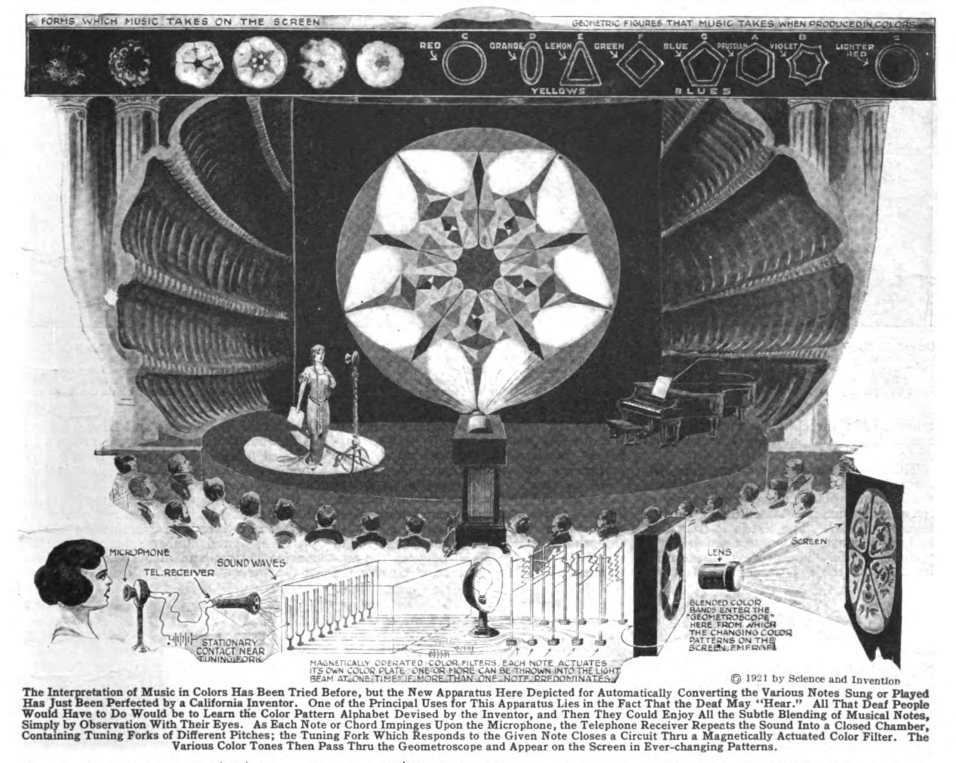

**DRAFT:** *Please do not share without permission of the author. Typeset versions in  [web](http://gernsback.wythoff.net/192112_innovations_in_sensations.html) \| [pdf](https://github.com/gwijthoff/perversity_of_things/blob/master/typeset_drafts/192112_innovations_in_sensations.pdf?raw=true) \| [doc](https://github.com/gwijthoff/perversity_of_things/blob/master/typeset_drafts/192112_innovations_in_sensations.docx)*

* * * * * * * * 

**C**IVILIZATION, as we well know, brings with it a host of novel diseases as well as pleasures. The craving for pleasurable sensations, as the human race advances, becomes more and more pronounced, for reasons only imperfectly understood today. Among mammals and insects rhythmical sensations such as those due to music are not at developed, or very little. Music, altho heard perfectly by a horse or a dog, leaves but little impression upon them, altho certain notes will make a dog howl. Rhythmical music, however, will leave him unresponsive whereas it will stir the human deeply. Dancing, another rhythmical expression is unknown among animals, man being apparently the only living being who can practice and enjoy it. Rhythmical sensations are enjoyed by all mankind; even the lowest aborigine has his tom-tom music and his sacred dance—--crude to our understanding---but well developed nevertheless.

Music, as we understand the term, is of but recent origin. The ancient Egyptians, the Hebrews, the Greeks, had their so-called chants, but they were simple and uncom-plicated. Tho rhythmical dancing was well developed among the Greeks; it was accomplished without the use of real music. Rhythmical beating of drums, or blowing of short horns formed the sole accompaniment as a rule. 

As it took the race several thousand years to learn and cultivate a taste for music, and as the onmarching civilization will most assuredly evolve new pleasurable sensations, one may wonder what the next development will be. 

As a matter of fact it has arrived already. Its name is Color-music. Color-music simply transposes two of our senses.[^1] It substitutes the eye for the ear, but the rhythm remains. Every audible note has its complement in a certain color. If these colors are displayed before our eyes in the same periodical manner as ordinary music, we obtain the same sensation---or a greater one, if we combine color plus music. Few people as yet can appreciate color-music, it is still new and its technique is not perfected, altho we are already building "Color-organs" and the like.

Will we stop here? Not at all. We can still transpose the ear for the touch. The writer recently showed this in his Physiophone where ordinary phonograph music was transformed into electrical impulses, which latter were felt by the hands. There was of course here no audible music---nothing was heard---but the rhythm was faithfully preserved. Thus it was possible with but little practice to recognize difierent pieces of music, were they a march or a waltz.

How about the sense of smell? Can we transpose music into smells, or rather odors, scents or perfumes? To be sure it is possible, but it will be difficult to convey a sonata of odors to our audience. But with pipes scattered thru an auditorium and powerful blowers as the "odor-organ," it seems not so difficult. The trouble will be to find the proper odor for each note. Thus, to decide if A-flat is represented by jasmine, or violet, or attar of roses, may presumably be left to the future poet-musician.

This leaves us with the last of our senses---taste. Can we transpose music into taste? Why not? Our ever-ready servant electricity may solve the problem. We can already taste radio messages, so why not music? We know that placing two wires from a dry cell on the tongue gives us a sour sensation---taste. By using different metals, different tastes are had. Thus copper gives an acrid-metallic taste, silver a clean-sour taste, etc. Suppose we make a "comb" of many metals and conductors to each of which a wire is attached. The comb to be placed into the mouth so that it lies on the tongue. By a little experimenting we will readily transpose music into gustatory sensations---and not to make a pun---we will now be able to suit every taste!

[^1]:  Gernsback is referring to an article in this issue on "A New Color-Music Instrument" designed by William Maulsby Thomas in Los Angeles.  "The unison color-music instrument marks a great advance in all respects in the translation of music into colors.  Its predecessor, the color organ, a ponderous, costly mechanism, is insignificant by comparison, with regard to the results obtained.  The color organ projects upon a screen colors of the visual scale, corresponding to notes of the musical scale as they are sounded upon the keyboard manipulated by an executant.  Its capacity is limited to the production in sequence of colors without form.  The new instrument is compact and comparatively inexpensive---so compact that it can be enclosed in a portable case.  By adjusting relations between sound vibrations and light vibrations translations are made automatically, not only of music but of all kinds of sounds.  An interesting feature of the unison color-music instrument is that it gives each note of the musical scale a distinctive geometric figure and definite color, so that when an orchestral performance is translated and projected upon a screen the several geometric figures assemble themselves into a sequence of symmetrical multicolored forms, of great variety and beauty."

      <!-- no figure -->