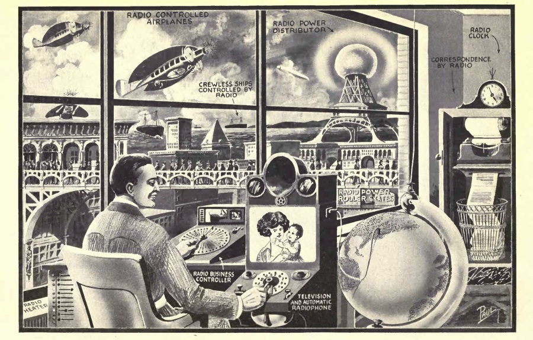
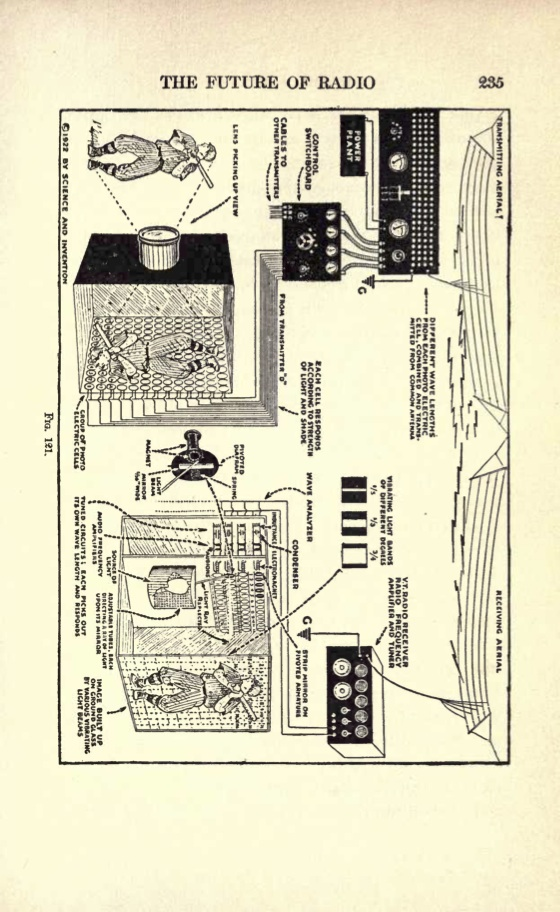

**DRAFT:** *Please do not share without permission of the author. Typeset versions in  [web](http://gernsback.wythoff.net/192200_radio_for_all.html) \| [pdf](https://github.com/gwijthoff/perversity_of_things/blob/master/typeset_drafts/192200_radio_for_all.pdf?raw=true) \| [doc](https://github.com/gwijthoff/perversity_of_things/blob/master/typeset_drafts/192200_radio_for_all.docx)*

* * * * * * * * 

# The Future of Radio

IN this illustration are shown some of the future wonders of Radio. Several of the ideas are already in use, in an experimental way, and it should not be thought that the entire conception is fantastic.

The illustration shows a business man, let us say, fifty years hence. To the right is a television and automatic radiophone. By means of the plug shown to the right of the machine, the man can plug in any city in the United States he desires; then, by means of this automatic control board he can select any number in that city he wishes, merely by consulting his automatic telephone directory. As soon as he has obtained his number, a connection is made automatically and he not only can talk, but he can see the party whom he calls. At the top of the instrument is a loud-talker which projects the voices of the people, while on a ground-glass in front of him the distant party is made visible. This idea is already in use, experimentally.

Directly in front of the man, we see the "radio business control." By means of another television scheme, right in back of the dial, the man, if he chooses to do so, can load and unload a steamer, all by radio telemechanics, or throw a distant switch, or if a storm comes up, look into the interior of his apartment and then, merely by pressing a key, pull down the windows; all of which can be accomplished by radio telemechanics, a science already well known.

His business correspondence comes in entirely by radio. There is a tele-radio-typewriter. This electro-magnetic typewriter can be actuated by any one who chooses to do so. For instance, if we wish to write a letter to Jones & Company, Chicago, Illinois, we call up by radio, that station, and tell the operator that we wish to write a letter to the Company. Once the connection is established, the letter is written in New York, let us say, on a typewriter, and automatically sent out through space by radio; letter for letter, word for word being written by the other typewriter in Chicago. The letter when finished falls into a basket. Instead of sending our correspondence by mail we shall then do our letter-writing by radio. There is nothing difficult about this scheme, and as a matter of fact, it can be put into use today, if so desired. We have all the instrumentalities ready.

Going further, we find the Radio Power Distributor Station that sends out power over a radius of 100 miles or more. This radio power may be used for lighting, and other purposes.

In front of the bridge we see a number of people who are propelled by Radio Power Roller Skates. On their heads we see curious 3-prong metallic affairs. These collect the radio power from a nearby railing, which, however, is not in view, and which they do not touch. The power is sent through space from the rail to the 3-pronged affair and then is conveyed to the skates, which are operated by small electric motors. Thee roll at the rate of 15 to 20 miles an hour, and there is no visible connection between the wearer and the Radio Power Distributor.

We next see the crewless ships controlled by radio. This has been made possible today. Indeed, several U. S. battleships have already been manoeuvred over a considerable distance by radio. The time will come when we can direct a ship across the ocean without a human being on board. Future freight will be sent in this manner. The ship, every ten minutes, gives its location by radio, so that the land dispatcher will know at any time where the ship is located. Collisions are avoided by a number of instruments into details of which we need not go here, but which have already been perfected. Collision with icebergs also is avoided by thermo-couples which divert the ship away from the iceberg as soon as it enters water which has been cooled below a certain degree.

The radio-controlled airplane works similarly to the radio-controlled ship, and it will be possible to control such airships very readily in the future. As a matter of fact, John Hays Hammond, Jr., in this country, has done this very thing. Radio-controlled airplanes will play a great role in the next war.

It is a mistake to think that radio is only good for the distribution of intelligence. As the illustration shows, the great uses of radio have not been touched upon as yet.

* * * * * * * * * * * 

# Chapter XI: The Future of Radio

As the author has mentioned often in his various editorials published in Modern Electrics, the Elec- trical Experimenter, Science & Invention, as well as Radio News, the radio business may be likened to the amateur photographic business. Within the next few years, we shall see every drug store selling complete radio outfits that can be put on top of the phonograph at home, and which can be worked by your six year old sister. All that is required of you is to mani- pulate a few knobs, and from a concealed horn, the latest j azz band music will then issue forth. To be sure, this music is broadcasted from a central sta- tion which may be a thousand miles away or farther.

Then too, the day of the radio newspaper is quickly coming. Important news of the day will be broadcasted by radio telephone daily at stated intervals, as will be weather reports and other infor- mation useful in every community. But of course, the development of radio will not stop at radio tele- phony alone. Great and wonderful things are com- ing in radio which are undreamt of today. New uses are constantly being found. New improve- ments are being made almost over night. We cease to wonder when we hear of some new marvel that is being performed by radio, and simply shrug our shoulders and say "well that was predicted long ago." Thus, recently, a physician several hundred miles inland listened to the heart beats of a man lying unconscious on a ship three miles out on the ocean. Every heart beat was transmitted clearly and faithfully by radio to the physician, who was thus enabled to make a diagnosis.

We now move ships and steer airplanes by radio. Very recently in Germany, radio was used in mines underground to locate ores and coal veins accurately, surely a surprising use for the art! In this invention use is made of a receiving and sending station, both located underground, one signalling to the other. When the signals pass through a coal field, a variation is heard at the receiving end and by triangulation, the exact location of the coal veins can be found.

Recently, in Italy, radio has been used for prospecting metal ores. Here the Italian inventors use very sensitive vacuum tube outfits, and by means of a certain condenser arrangement, it becomes possible to plot accurately the exact location of the future mine. Today, every radio station has its ubiquitous a?rial on top of the house. This soon will be a thing of the past. Already two American inventors have demonstrated that far better results may be had by putting the aerial underground. In their experiments, the inventors use the so-called underground loops. Of course, these are necessary for long distance reception, but for your radio outfit on top of the victrola in the parlor, no underground loop, or serial on the roof is necessary. The serial will be right inside of the outfit. We are already doing this very thing today, and the outfit need not be larger than a foot square. That gives us sufficient space for the concealed serial within the box. This is not a dream of the future, as it has already been accomplished for the reception of radio music over distances of several hundred miles.

It is even possible to do away with the loop entirely. There has appeared lately upon the market, an electrical plug which is simply screwed into any lighting fixture in your house. It makes no difference if your lighting current is 110-volt alternating current, or 110-volt direct current, or even 220-volts. This plug consists simply of a condenser arrangement, and the idea of it is as follows : We have seen in former chapters that any serial wire will pick up radio waves. Now then, every lighting circuit forms a sort of loop serial itself. This is particularly true in the country where the wires run for great distances out doors. By proper arrangement, as for instance, using such a plug, the radio waves are conveyed right over the lighting circuit without interfering with the electric light bulbs, and other electric appliances in your house. These condenser plugs are already a great success but they do not work under all circumstances. For instance, in apartment houses in which much steel enters into their construction, the results are not so good as in the country where we have a stone or wood house, and where the electric lighting wires run outdoors. These condenser plugs work satisfactorily in nearly all instances, even in apartment houses, in connection with vacuum tube sets, but they do not work well as a rule with crystal receivers. Much experimental work is as yet to be done in this line, but the chances are that ten years from now, the serial for receiving purposes will be a thing of the past.

Perhaps the greatest development will be the radio power transmission of the future. This is, of course, today, only a dream, but Nikola Tesla has demonstrated that it can be done, and it is interesting to note that this great savant's ideas are coming more and more to the front. Dr. Tesla contends that our radio conceptions are wrong from start to finish. He claims that it is not the radio waves that travel through the ether following the curvature of the earth, but rather currents that travel through the earth, and we seem to be coming to just this. If Tesla is right, power transmission by radio should be a simple thing. It will enable us to tap the earth at any point and receive our energy to light and heat our houses. Of course all this is in the future, but we are surely coming to it.

Another new use for radio is sending pictures, photographs, etc., through the ether, and the author believes that he cannot do better than quote part of his editorial from the November 1921 issue of Radio News.

"Recently the signatures of General Foch and General Pershing were sent across the Atlantic by radio on the Belin apparatus. There is no good reason why the amateur cannot do the same thing for smaller distances at any time.

"In the very near future, the amateur in New York will buy the first copy of a New York newspaper, wrap it around his cylinder, and send out a whole sheet by radio. A thousand miles away another amateur will have a receiving machine that will reproduce the printed page, type, pictures, and all in less than a half-hour. This is a thing impossible to do by ordinary wireless telegraphy, if every word must be transmitted. The radio picture transmission solves all this. Thus, in time, a great piece of news 'breaking' in the city, will be sent broadcast by the enterprising amateur, who will send the entire front page of the newspaper, for instance, and the radio facsimile can then be exhibited in a distant town from 10 to 24 hours in advance of the receipt of the actual newspaper.

"All this is not a mere dream, but it already has been accomplished today. It is up to the amateur to make the thing popular."

To go still a step further, the author in a recent article in Science & Invention magazine proposed a radio system, which theoretically is sound. It is nothing else than Television by Radio. (Fig. 121). The fundamentals of this proposed scheme are correct, and there is little doubt that we will have radio television within a very few years on a scale that will be tremendous. The idea in short follows:

At the Polo Grounds of New York, let us say, we have a radio transmitting station in a box-like affair of about three or four times the size of a movie camera. We have a box with a lens in front, the back of the camera being composed of a great number of photo-el ectric cells. These cells have the property of passing more or less electric current, depending upon how much light falls upon the cell. A strong light will pass much current through a cell, while a weak light will pass little current. By means of these cells, we influence a modulator vacuum tube connected to the radio transmitter. This modulator sends out radio waves into space. If a strong light falls upon the electric cell, No. 1, we send out a radio wave of a certain intensity at a certain wave length, let us say 500^ meters. At the receiving end, this wave is received and is passed through the regulation radio outfit and thence through a condenser, vacuum tube and audio-frequency transformer. This audio-frequency transformer operates a small magnet which in turn influences a pivoted diaphragm. This diaphragm has mounted upon it a strip mirror about y^- inch long and 1/16-inch wide. Normal and at rest, a light ray from a common source, let us say an electric lamp, directs a single beam of light upon the diaphragm in such a manner that the light ray just misses the mirror. The least vibration of the diaphragm, however, will intercept the light ray and will reflect it upon a ground glass plate. It is evident that the more the diaphragm vibrates, the more the light ray will vibrate back and forward upon the ground glass screen.

If we now imagine at the sending end several hundred of the photo-electric cells and at the receiving end a like number of vibrating mirrors, we can readily see how a picture sent out from the sender can be recomposed and reconstructed at the receiver. It must be understood that our photo-electric cell sends out its own wave-length. Thus, as mentioned before, photo-electric cell No. 1 sends out a wave length of 500y 2 meters. Photo-electric cell No. 2 will send out a wave of 500>4 meters and so on. All these waves are sent out from the same aerial, and all the incoming waves are caught upon the same aerial, each wave operating its own electro-magnet and consequently the light beam. We can now see from this how our future audience will be able to witness a baseball game five hundred or five thousand miles distant, as if it were witnessing the game itself. It is, of course, understood that this transmission takes place instantaneously, so we will be enabled in the future to view distant games or other important events at the time they are taking place. This differs from the movies where we are not able to view the events at the time they take place, but always at a later date. In the future there will be the possibility of our seeing the President of the United States make an important speech, and we will be enabled to not only hear every word he utters, but see him in person as well.

Of course, it goes without saying that the scheme here advanced will project the picture in black and white only. In other words, the picture will look just like a movie film with the sole difference that we are witnessing the event at the time it takes place.

Here is an interesting feature of which few people are aware. Some months ago, in one of the writer's editorials he mentioned the fact that radio waves are eternal, as are light waves; they travel according to our present conception out into space at the rate of 186,000 miles a second. We see today the light waves shot off by some far away star, which light may have originated from that star perhaps 10,000 or 100,000 years ago. And those light rays are just coming down to us now. It is the same with radio waves. Any radio message, any broadcasted radio selection that is sent out on radio waves goes out into eternity never to return, never stopping, ever traveling onward. The thought is appalling that while you are listening to a famous operatic star, who is singing from some broadcasting station, her voice may be heard 100,000 years from now on some distant planet belonging to its own little solar system.

For to believe that there is intelligence only on this earth is grotesque and foolish in the extreme. What this superior intelligence, listening to this broadcasted song will think of it 100,000 years hence, is difficult to imagine. But, there seems to be little doubt that this superior intelligence will smile at the idea of our feeble endeavors. This intelligence will probably view our attempts with the same amusement as we look upon children using a string telephone.

At the time this volume is written, radio is just about twenty-five years old. If we have accomplished such wonders in a quarter of a century, who dares say what will be accomplished in twenty-five or fifty years more. Our wildest and most impossible prophesies will seem feeble. When we, therefore, say that one of the coming things is transporting solids through space, that is, sending a carload of coal from Pittsburgh to Paris within a few minutes, all by radio, and all by the invisible self-same waves, we will probably be laughed at by our experts. The thing, however, is perfectly feasible today, as we shoot solid particles through glass walls every time an X-ray picture is taken. X-rays are composed of solid particles which are just as solid as bricks or lumps of coal. When, therefore, we are asked what the future of radio is, we may say in one word, ANYTHING ! There seems to be nothing impossible that radio cannot accomplish in the future!

