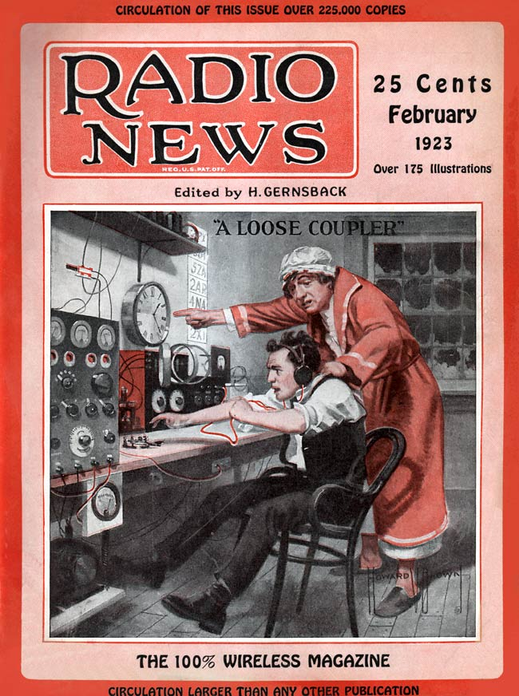

**DRAFT:** *Please do not share without permission of the author. Typeset versions in  [web](http://gernsback.wythoff.net/1923_who_will_save_amateur.html) \| [pdf](https://github.com/gwijthoff/perversity_of_things/blob/gh-pages/typeset_drafts/1923_who_will_save_amateur.pdf?raw=true) \| [doc](https://github.com/gwijthoff/perversity_of_things/blob/gh-pages/typeset_drafts/1923_who_will_save_amateur.docx)*

* * * * * * * * * * * 

**I**N our October issue we published a special \$500.00 prize contest, entitled: "Who Will Save the Radio Amateur?"  This was in connection with Mr. Armstrong Perry's article, "Is The Radio Amateur Doomed?"[^arm]

All thinking men, and most intelligent amateurs themselves had long come to the conclusion, ever since the broadcasting popularity started, that the radio amateur was indeed doomed.  By "doomed" is meant not that the radiophone popularity was to wipe out the amateur, but, rather, that IT WAS THE AMATEUR WHO DOOMED HIMSELF, and who put himself out of business.  The reason is so simple and so obvious that it is difficult to understand why the rank and file of the amateurs have not seen it for themselves long ago.

OF WHAT REAL USE IS THE AMATEUR OF TODAY?  What does he really do to make the world a better place to live in?  Of what use is he to the community at large?  If the amateur will ask himself these questions, and search his heart, he will come to the conclusion that, indeed, his utility is microscopic.  It is true that amateurs are sending each other messages, which roughly covers 90 per cent of their utility.  A purely selfish pastime!  It is true that some amateurs are sending free messages for their friends, to be transmitted and relayed to distant friends, but investigation of the subject shows that this traffic is indeed exceedingly small.  It is a fact that out of 100 messages actually filed with amateurs, not 50 per cent reached their destination!  The number of such messages actually delivered is exceedingly small.  It certainly has never assumed any proportion where the commercial telegraph interests have even felt it necessary to take any notice of such free-message work.[^fmsg]

It is true that amateurs have made credible records in sending messages, not only across the continent and further, but have sent messages and are sending them right along, across the oceans.  This, certainly, is a very credible scientific undertaking.

Then, too, amateurs, in isolated cases, have helped the police in running down criminals.  Such cases, however, do not happen once in six months.

Also, it is not to be forgotten that during the war amateurs helped in building up a radio force that was of great help in the war.  Indeed, the writer himself was instrumental in recruiting the amateurs, and secured over 1,000 enlistments, for which he received a very flattering letter from Ex-Secretary of the Navy, the Hon. Mr. Daniels.[^npb5]  No doubt the amateurs would do the same thing again, if called upon, but, as one correspondent in this contest put it *"The amateurs can not rest upon past laurels, particularly when there is not a new war every day."*

Summing up, therefore, the real usefulness of the American amateur in the United States is practically nil.  This does not sound very nice, but it is the whole, unvarnished truth.  The writer, who has been an amateur, and still is, feels that he knows whereof he speaks.  The question simmers down to this:  "Is there a real usefulness for the radio amateur?"  THERE IS NOT!  That is, if the amateur is honest with himself.  Sending a few messages to each other, making transatlantic records, and waiting for the next war, to show what we can do, does not enhance our standing with the public.  *As far as the public is concerned, the radio amateur does not even exist.*  Make the following test, which we made recently in New York, and which some correspondents made in various communities in the United States, and you will get a good idea of what the populace thinks or imagines the radio amateur of today to be.

Stand on any street corner, and as 100 people who pass by the following question: *What is a radio amateur?*  The answers, boiled down, in about 90 per cent of the cases actually tested, will be as follows:  *"Oh! A radio amateur is an experimenter who tinkers with radio apparatus."*

This is then what some 95,000,000 or more people in the United States think of us.  In other words, we have never sold ourselves to the public---for a very good reason:  WE HAD NOTHING TO SELL, for our usefulness in the United States, up to this time, was nil.

* * * * * * * * * * * 
  
# PRIZE WINNERS

- First Prize (\$200.00)---Mr. L. W. Gundy (1 BZL), P. O. Box 67, Phillips, Me.
- Second Prize (\$100.00)---Mr. Jesse Marsten, 909 Beck St., N. Y. C.
- Third Prize (\$75.00)---Mr. Hugh Wingett, 1205 Stainback Ave., Nashville, Tenn.
- Fourth Prize (\$50.00)---Mr. E. T. Jones, 3997 Dumaine St., New Orleans, La.
- Fifth Prize (\$25.00)---Mr. L. VanSlyck, 123 Hibbard St., Ironwood, Mich
- Sixth Prize (\$25.00)---Mr. Stem Anderson, 3257 Q St., Lincoln, Neb.
- Seventh Prize (\$25.00)---Mr. Frank H. Fanning, 301 Holt St., Ashland, Ky.

* * * * * * * * * * * 

# HONORABLE MENTION:

- Mr. Ernest G. Underwood, Elwood, Calif.
- Mr. Allen H. Duncan, 32 Waverly Pl., New York City
- Mr. Sumter B. Young, (1 AE) Associate Member I. R. E., formerly Chariman Boston Executive Radio Council, Dorchester 24, Mass.
- Mr. A. W. Parks, Easton, Pa.
- Mr. J. F. Tolley, New Orleans, La.
- Mr. Thomas C. Howard, Newport, R. I. (1 A F N)
- Mr. L. R. Felden, 979 55th St., Brooklyn, N. Y.
- Mr. H. F. Rook, Ridgefield Park, N. J.
- Mr. Rex Durant, Cricklewood, London, England.

* * * * * * * * * * * 

When radio was young, it was all right for radio amateurs to do just what they were doing, that is, sending each other messages, doing research work, etc., *but the world moves on*---WHILE THE RADIO AMATEUR STANDS STILL.  As the writer mentioned before, the radio amateur is in a rut, and deep down in his heart he knows it.

If the great and wonderful art of Radio means nothing more to the radio amateur than sending a few messages, catching a burglar MAYBE, sending a few dots and dashes across the ocean, and waiting for the next war to come along to prove, MAYBE, that he can help---then it certainly would have been far better that Radio had never been invented.

We thought that there must be somewhere, somehow, some way to put the radio amateur on the map so that when the name "radio amateur" was mentioned anywhere, in a crowd, or to any layman, there would be instant attention---not a questioning raise of the shoulders, as is the case now.  This brings us to our Contest:

As we had foreseen, and as we mentioned in our columns of the October issue, the two articles, "IS THE RADIO AMATEUR DOOMED?" and "WHO WILL SAVE THE RADIO AMATEUR?" brought a number of letters from the narrow-minded and misguided amateurs, who, in their simplicity, thought that we were "knocking" the game, and trying to put the radio amateur out of business.  We were assailed from all sides, with many "brick-bats," and even the mouthpiece of the American Radio Relay League, who certainly should know better, said things about this contest that not even a third-rate, slandering, country newspaper would stoop to utter.[^brbt]  That, however was expected.  We were even questioned about the \$500.00 Prize Contest, and it was darkly hinted that we were chasing the dollar in making this offer, but just how we were to do this was not mentioned.  We offered the \$500.00 in prizes in good faith, and are paying out these same \$500.00 today in the same good faith, cheerfully, because we know that we have accomplished something that will help to make radio amateurism in this country a real force.

The contest, from every point of view, with one exception, was the biggest we ever staged.  Over 5,000 replies were received from amateurs all over the world, and we received many wonderful and inspiring letters.  A thing that pleased us particularly was that letters from the best amateurs in this country were in the majority, and many hundreds were received from members of the American Radio Relay League, the Radio League of America, and all of the prominent radio clubs in the country.  The one fly in the ointment was that nearly one half of the contributors did not take the time to read the conditions, and indeed did not get the spirit of the Contest.  On page 795 of our October issue, in the gist of the entire contest, in these words:  *"What we wish, therefore, fellow amateurs, is a manuscript of not more than 1,000 words, setting forth your ideas to the best plan to put the radio amateurs on solid footing, where they can perform the greatest good for the community, and for the radio art."*  That was our message.  Nearly one half of those who answered, evidently did not take the trouble to read this, or, if they did, they thought the contest referred to something else.  The fact remains that 50 per cent of the contributors tried to save the amateur by trying to devise new legislation, to protect him!  What these contributors did not see at all was that _*no force in the whole world can save the amateur except the amateur himself.*_  Most of these correspondents had an idea that the amateur was doomed on account of the interference which he is making.  Nothing can be more erroneous.  We never had such an idea in mind, and nowhere did we print a single line about such a thing, or even suggest it.

The truth is that the amount of interference that the public is getting form the amateur is insignificant.  There is very much more interference from the commercial stations than from the amateurs, and we believe the public at large knows and appreciates this.  Moreover, amateurs are learning not to send during broadcasting hours, and within the next six months *this problem will be solved entirely by the amateurs themselves,* so there is little need of legislation on that score.  Even a single circuit crystal set, unless it is right under the shadow of an amateur's transmitting aerial, does not, as a rule, experience much interference from 200 meters.  The wave-length of most amateurs does not go much above 250 meters, and this, we might say, is exceptional, so why worry on that score?[^atw]

To resume, our contest has been a great success.  The suggestions that are made in the seven prize-winning letters are very substantial, and, if followed, will surely put the amateur on the map in avery short time, but---like your doctor---we can only give the prescription.  It is up to the patient, the radio amateur, to take his medicine, which, in this case, is quite pleasant, and, we are certain, effective.  The judges of the contest were as follows:

- H. Gernsback, Editor of RADIO NEWS
- L. G. Pacent, President of Pacent Electric Co.
- Robert E. Lacault, Associate Editor of RADIO NEWS
- Armstrong Perry, Author, and
- L. M. Clement.

The judges were almost unanimous in their decision on the seven prize-winning letters, and there was little divergence of opinion.  Mr. L. W. Grundy was awarded first prize, mainly on account of his suggestion to re-transmit broadcast programs over the electric light lines.  This, indeed, is one of the best suggestions advanced, and we have more to say about this in another section of the magazine.  (See article: "Popularizing Radio.")  In addition to the prize winners, there were eight letters which were deemed of sufficient importance to be awarded Honorable Mention.  These letters will be published in subsequent issues.  Some of the prize-winning letters follow:

* * * * * * * * * * * 

Is the Radio Amateur Doomed?
==============================

**By L. W. Grundy, 1 BZE**

**FIRST PRIZE**

If he becomes selfish and self-centered he is doomed; but he won't, he will adjust himself to circumstances and be as indispensable as he was yesterday.  Time will arrange all things.

Broadcasting is here to stay.  The public wants it; they will get it; they ought to have it.  If amateur transmission interferes, we must suspend same during reasonable hours.  However, the listener to broadcasts must share the air, he cannot expect full control from 10 A.M. until midnight.  8-10 P.M. or 7:30-9:30 is time enough when one considers he has it every evening.  The amateur's work is valuable.  Most broadcasting is mere amusement.  It has its place but it cannot be selfish and "hog the ether."

Let's own up we all like to listen in once in a while.  What is to be the amateur's attitude toward broadcasting?  We must gracefully accept it and as a public need, help further it.  There is chaos in broadcasting now but the inexorable law of evolution, the survival of the fittest will prevail.  How can we help?  Let's give kindly unbiased advice in regard to selection of sets to cover the required distances.  This will prevent the buying of inferior, hence unsatisfactory goods.  I butted in once when I heard a misinformed clerk tell a young woman that a crystal set would bring in KDKA six hundred miles away.[^kdk]  I simply suggested that a regenerative set would do much better.  The clerk sold the better set, it worked, everybody happy and satisfied.  Let us show novices how to tune their sets, and get the most from them, for few novices can handle a tube set without guidance.  Let us tackle receivers, freedom from QRM means freedom to transmit.

\begin{center}
\fbox{
  \parbox[c]{7cm}{
  
WHEN we announced our \$500.00 Prize Contest, we maintained that the radio amateur was doomed unless he did something to become a power in the community instead of being a question mark.  We said that the amateur activities at the present time gained the community nothing.  We offered \$500.00 in prizes to have the amateurs evolve plans to make a force in the community.

\vspace{3mm}

Some of the good points brought out in this contest, and which were awarded prizes, were as follows:

\vspace{3mm}

- Re-transmitting broadcast programs over the electric light lines, for the benefit of users of cheaper sets, and for those who are out of range of the big broadcasting stations.
- Single Control Receiver, to popularize Radio with the public.
- Signboards in front of amateurs' houses, giving bulletins of all important news to the community.
- Relaying weather, crop, and market reports.
- Doing away with spark transmitters---using C.W. only.
- Nationwide publicity through local newspapers, for amateur activities, performing real service.
- Equipping all transmitting sets with phone, to inform local listeners that amateurs are not interfering with broadcasting.

  }
}
\end{center}

But we want to transmit.  When the new White Radio Bill becomes law let's retransmit some of the excellent programs over the electric light lines or through the air for the benefit of users of cheaper sets.[^wrb]  Here's a field experimentation and service.  Let us open our homes to the public, let's put our loud speakers in halls, homes, churches, schools, etc., and give them a free concert.  The public will appreciate the public-minded amateur.  Let us post market and weather reports, news items and other things of public interest.  One amateur posted the World's Series' results before they came over the wire.  A friend of mine invited in a father and mother to listen to a glee club broadcast four hundred miles away and their son was an accompanist.  Did they enjoy it?  Just imagine!  In some of our small towns no Marine Bands nor high class performers ever come.  Broadcasting is their blessing.

Let us prepare ourselves for the new era.  Let us ban, as quickly as possible, by example and advice, the spark transmitter.  Let's push C.W.[^cw]  It's the thing we need.  We will experiment with directional transmission and hence avoid interference.  Above all we need a wave meter, using it to keep strictly within our wave bands.  When we have opportunity for self-policing let us do it efficiently.  We should make our relay and DX work of greater value.[^dx]  Let's make the subject matter of the message as important as distance itself.  It seems that we may add greatly to the radio art by doing research work.

Another field for service is the realm of the boy.  Radio keeps boys at home instead of in mischief-making gangs.  It stills a thirst for scientific knowledge and hence stimulates manhood.  A few dollars in radio supplies coupled with a friendly interest wil save many a lad from going wrong.  Boys often lack cash.  Let's teach them the possibilities of materials at hand---cardboard tubes,---brass screws, a spool of magnet wire.  The writer used, one winter, a regenerative set made of ice cream containers, brass screws for switch points, ink bottle stoppers for knobs.  The set cost without battery \$14.80 and it covers a range of about 500-800 miles.  As I have been writing, a lad has just brought in for my inspection some tubes made of sheathing paper and shellac.  But let us teach painstaking care, efficient layout and mechanical thoroughness even with humble materials.  We can teach code classes, we can broadcast interesting materials as code practise.  We can show that a single amplifying tube can outrange the average spark coil.

If we amateurs will lead the boys of our communities we will make ourselves indispensable and contribute to community and national welfare.

Ours is an educational task.  Amateur leaders must make the rank and file see the light.  We must work through the various organizations, we might add a home service branch to our Relay League with distinct and definite duties in regard to community and public servie.

The writer is a deep-dyed amateur, he has tried to serve.  Four hundred people listened in at his home during November and December, 1921.  A new cage aerial lately swung into place has elicited commendation and within 24 hours a neighbor "tickled his palm" with a five spot, "in recognition of your willingness to let folks listen in and because you have helped the boys of this town."  Let us be patient to serve rather than arbitrarily selfish and we can make ourselves and our cause, amateur radio, positively vital.  I do not worry, the amateur is resourceful enough to adjust himself to any condition and he will: and *Long will he live.*

* * * * * * * * * * * 

# A Suggestion for Utilizing the Amateur's Technical Knowledge and Avoiding the Clash with the Lay Radio Public

**By Jesse Marsten**

**SECOND PRIZE**

The radio industry will develop and flourish in direct proportion as the number of people who take an interest in it increases.  Just as the talking machine industry could not thrive if it had to depend for its business on a handful of musicians, so the radio industry cannot depend upon the handful of technical amateurs for its business.[^tkmh]  It must interest the average man and woman in the street.

To secure this essential interest of the enormous lay public it is essential that the radio instruments, like the talking machine, be models of simplicity as ar as operating features are concerned.  And simplicity today means a minimum of controls, and preferably a single control.  It is the single control receiver which will popularize radio more and more, and it happens that the only type of circuit available to-day permitting of such simplified control is the single circuit receiver.[^ctl]

Naturally the single circuit receiver therefore finds favor with the layman, but its prevalent use has brought in its train difficulties and a big problem.  The single circuit tuner is of course less selective than a double or triple digit tuner.  As a result, with transmitting amateurs around him particularly in congested districts, the layman has experienced the considerable code interference while receiving the broadcasting.  The radio lay public therefore insists that the amateurs keep of the air during broadcasting hours.  The amateurs just as staunchly insist what they consider the arrogant interference of an uninformed public which is just entering the radio circle.  They generally cite their long standing in the radio community, that they have made radio what it is to-day, and that the single circuit tuner causes most of the layman's interference.

It is true that the amateur has made radio history and is in the vanguard of the radio army.  The amateur, however, cannot rest on his laurels or past performances if the layman---who is to furnish the radio industry with practically all of its business---is interfered with.  It must be remembered that the average non-technical layman who constitutes the bulk of the nation is being sold on a big, brand-new idea---RADIO, and he has to be catered to and his requirements have to be met.  If he is told that his requirements cannot be fully met and he must yield because some amateurs were here first, he will rightly answer in no uncertain terms that he cannot embrace this new idea of radio and that the amateurs can have the field to themselves all of the time.  Which means that the radio industry goes back to what it was two or more years ago, a picayune, little industry.

As a matter of single circuit receivers causing the trouble the amateur must remember that Tom Jones, the bookkeeper, the salesman, the clerk, the lawyer and what not, knows as much about technical radio as he does about music.  He may appreciate both, but he knows little about either.  The reason there is a talking machine in almost every home is that talking machines were not designed for skilled musicians, but were designed for average musically unskilled persons.  And there will be a radio set in every home---which is the aim of the radio industry---when radio sets are designed in the same way.  This means a minimum of controls on the receiver and to-day the single circuit tuner is about the only tuner that permits such easy control.  And the radio industry has the single circuit tuner to thank for whatever popularity radio has achieved to-day.

If the amateur's transmission were of material benefit either to the public or the radio art there might be some ground for their stand on the question.  But it serves no advantageous purpose.  The mere act of relaying and seeing how far one's transmitter can reach, while the personal interest and pride of the individual amateur, has not any other importance.  On the other hand broadcasting is gradually assuming the importance of a public utility, and as such is deserving of the first consideration.

The technical knowledge and ability possessed by the amateur is of tremendous potential value and it would be a great loss to the radio art should anything occur to make the amateur's interest in radio wane.  However, from considerations enumerated above his chief radio occupation, *namely relaying, is of no value in itself and must give way to the broadcasting.*  The only way out of the dilemma is the opening of *new spheres of activity for the technical amateur.*

From this point of view the writer has a solution which may sound very ambitious, but which has the merits of affording sufficient scope for the amateur's technical interest and affording a minimum of interference with the broadcasting.

Instead of an Amateur Radio Relay League it is suggested than an Amateur Radio Research League be formed, which may be a nation wide organization just as the former is.[^inv]  The various existing amateur stations are potential miniature laboratories which by proper direction can be effectively utilized in securing data and information of great importance to the art.  Thus there are a great many problems which are functions of time, locality and climate; as for example, the intensity and directional effect of static, if any; the problem of fading and signals, etc.  Range data of telegraph and telephone transmitters are very meagre.  By properly co-ordinating the efforts of the various stations throughout the country data of inestimable value may thus be obtained.  Besides there are any number of problems which can be taken up and investigated with the facilities the amateurs possess.  This would require, of course, very good organization, with central headquarters and districts divided under the supervision of the most capable amateurs.  The ability and a considerable part of the facilities are available.  What is lacking is the organization and exact plan of procedure.  A nation wide organization for systematic relay transmission was efficiently accomplished and with the same talent an organization for this far more important purpose of research can also be accomplished.  It is obvious that the purpose of avoiding a clash with the newcomers will be thereby effected and at the same time the ability of the amateur will be expended in a manner far more beneficial to the public and the art than heretofore.

* * * * * * * * * * * 

The Radio Amateur
==================

**By Hugh H. Wingett**

**THIRD PRIZE**

The radio amateur's trouble to-day is that he does not advertise himself in the right way.  A few so-called amateurs or "hams" congest the ether by sending more or less meaningless messages, using a kilowatt of power, to a brother "ham" around the corner.  The radio public which is trying to listen in on a radio program or musical concert, is of course drowned out and the blame is laid on the shoulders of the amateur, thereby giving the whole body of amateurs over the entire country a black eye, for the misdeed perpetrated by a few "hams" who don't know the meaning of tuning, 200 meters, and broadwave.  There is no reason why this condition should exist.  The well meaning, hard working amateur should take it upon himself to remonstrate with the owner of such a station or exterminate him, thereby doing away with the nuisance that is menacing their very existence.

This done, the amateur should try to organize the surrounding amateurs, and form a club, having operating rules and regulations.  They should, where possible, hold concerts, showing and informing the people of the community or town just what they are doing for the betterment of radio conditions.  They should when possible try to influence the amateurs in the neighboring community or town to organize, and thereby perpetuate the once respected order of amateurs.

This organization of amateurs should publish a daily bulletin, consisting of:  the weather reports, boxing, baseball and football results, and many other topics of interest that are broadcast.  Be of service to those of your community and they will begin to appreciate the amateur.  The contents of this bulletin would of course depend largely upon the people of the different communities.  This bulletin could be fastened upon a small, neat sign board, placed in front of the house of each amateur, where the neighbors in passing could read it.  It would cost next to nothing and would bring in large returns.  Not money perhaps, but reinstatement of the amateur in the esteem of the general public, which is a thing to be desired at present.  If thought necessary, the amateur could devise some means of defraying the expense of this bulletin, by popular subscription for instance.  The people of the community would be glad to aid in defraying the expenses for the service and pleasure rendered.  There should be no trouble encountered in this.

Again, the club could issue a weekly or monthly bulletin, costing only a few cents, informing the public, as to the aims and achievements of the amateur in the art of radio.  In this they should lay much stress upon the many advancements and inventions brought about by the amateur experimenter.

It would be well also if the clubs would have it known that they would be pleased to have visitors.  Also that the radio enthusiast who can tune in a radio concert, but who knows nothing much about the theory and science of radio, may be present at the discussions brought up at the club if he is in earnest and wishes to learn.  If he shows interest and intelligence, receive him into your club.

In every club or community there is a person or amateur who is well versed in the theory and rudiments of radio.  Let this one act as instructor.  The more one knows about the operation of a set, the less likely it is that he will create a disturbance that shall threaten the extermination of the amateur.  Do not be afraid to correct mistakes and to offer suggestions to another amateur, just because he happens to be your senior.  I do not care how old an amateur is; if he is a real "bug," he won't resent being shown his mistakes, even by one many years his junior.

By now the amateur should recognize his danger and try to organize and cooperate with others in order that he may avoid bringing down upon himself the wrath of the radio public.  It will never do to have them turn against us, for they outnumber us and practically control our future, and our very existence.  They are in the majority, and they will hardly tolerate anything which they think will deprive them of their amusement and pleasure.  We had better squelch these "brass-pounders" who create such a disturbance, and who cause the ire of the pleasure seekers to be directed against us, or the "Ancient Order of Amateurs" is likely to be presented with some such motto as: "Say it with flowers," or "Peace be with you forever more," meaning that we will pass out of existence.

To my mind the remedy lies with the amateurs themselves and it is only through them that the existing conditions can be bettered.

I hope that the above mentioned suggestions will aid in pacifying the misunderstanding at present between we amateurs and the pleasure seeking public.

So fellows, let's band together and fight for our rights as one.

[^arm]: Armstrong Perry, who had previously written articles for *Science and Invention* and other periodicals like *Radio Age,* published this piece on amateurism in *Literary Digest* alongside an interview with Sir Oliver Lodge, in which Lodge argues that the theory of the luminiferous aether should be rescued despite the scientific community having decisively moved on from the idea.  @perry_is_1922.  

    Perry would go on to publish short fiction about radio operators in *Radio News,* albeit of a non-speculative type.  See for instance @perry_ham_1927; @perry_radio_1927.
    
[^fmsg]: Messages sent without a fee were significant, as commercial stations could charge more than a dollar per word for a wireless telegraph transmission.

[^npb5]: Gernsback was a great critic of Daniels, who attempted to maintain Naval control over all civilian airwaves after the war.  See **Amateur Radio Restored.**
    
[^brbt]: "Brickbats" was a slang term for insults or criticisms that became a favorite among science fiction fans and readers in their letters to the editor later in the 1920s and 30s.

[^atw]: One of the problems with the 1912 Radio Act's restriction of amateur radio operators to wavelengths of 200 meters or less was that early sets "could not always adhere to a wavelength with any degree of accuracy and receivers also experienced drift."  Under the leadership of Herbert Hoover, the Department of Commerce sought to further limit not just the range but the content of amateur activities on the airwaves with the following line inserted into amateur radio station licenses in 1922:
    
    > This station is not licesned to broadcast weather reports, market reports, music, concerts, speeches, news, or similar information or entertainments."
    
    @bensman_beginning_2000, 41.

[^kdk]:  Broadcasting from Pittsburgh, KDKA was made famous for announcing the results of the 1920 presidential election over the airwaves, an event that many historians of radio see as "*the* beginning date of United States radio broadcasting." @barfield_listening_1996, 3.

    KDKA was run by Frank Conrad out of his garage and began the first regularly scheduled broadcast programming, "initially called wireless concerts, which consisted primarily of pushing a Victrola up to a microphone and playing records."  KDKA became a magnet for operators around the world trying to tune in to distant stations, and inaugurated what Susan Douglas calls the "broadcasting boom" in the early 1920s.  @douglas_listening_1999, 64.

[^wrb]:  The debate between Congressional Representative Wallace White of Maine and Senator Clarence Dill from Washington over the regulation of the airwaves resulted in the formation of the Federal Radio Commission in 1927, which was renamed Federal Communications Commission in 1934.  The White Bill, mentioned here, proposed putting radio broadcasting under the oversight of the Department of Commerce, then led by Herbert Hoover.  While "White sought to protect the economic interests of RCA and the rest of the radio industry, … freshman Senator Dill aligned himself with the Senate's insurgent Progressives whose goal was to protect the average person from corporate greed.  The insurgents wanted the federal government to regulate the industry for common good, but they believed that experts would manage radio better than partisan politicians." @goodman_ideological_2000, 118.

[^cw]: An abbreviation for continuous wave, a form of radio transmission that gradually came to replace the noisy and interference-producing spark gap transmission systems favored by amateurs in the 1910s.  It is also the name for the second volume of Hugh Aitken's seminal history of radio. For a condensed account of the technical and regulatory paradigm shift from spark transmitters to continuous wave transmitters, see @aitken_continuous_1985, 3-27.

[^tkmh]: "Talking machine" was the name the Victor Company used for their record players.

[^dx]: DXing is the practice of listening for and identifying transmissions from as far away as possible.

[^ctl]:  Christopher Sterling and John Kittross credit John V.L. Hogan, an assistant to Lee de Forest, with the invention of "uni-tuning" receivers in 1927: radios that need only one knob to move between frequencies.  Previously, tuning required multiple knobs that controlled several stages of reception, including radio frequency, the detector, and audio frequency amplification.  @sterling_stay_2002, 91.  As Susan J. Douglas writes, "Tuning was a fine art, requiring endless patience and technical acuity as the listener adjusted four or five knobs to bring in stations.  When these were adjusted improperly, he was jolted by earsplitting whistles and squeals.  And through the headphones of the crystal set, the human voice sounded like a distant, otherworldly squeak or vibration."  @douglas_listening_1999, 71.

[^inv]: Unfortunately, it seemed no such organization was ever formed.  In the first half of the twentieth century, Eric Hintz writes,

    > "Independent inventors struggled to form durable professional groups.  This rendered them politically impotent and unable to push through certain legislative reforms.  Also, without a flagship organization to speak on behalf of the profession, independent inventors were at a disadvantage in their rhetorical battles with industrial researchers, who characterized them as unsophisticated and obsolete."
    
    @hintz_post-heroic_2011, 745.