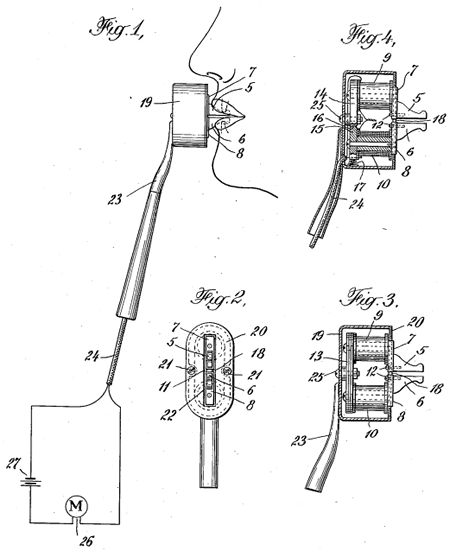

--- 
title: Are We Intelligent?
author: | 
    *Science and Invention*, vol. 11 no. 7
date: November 1923
---

**T**HE members of the human race, who think themselves preeminent on this planet, have long since come to the conclusion that the human animal is a superior living being, quite distinct and far above all other living creatures.[^1]  This conclusion, so general that it seems to be inborn, has been handed down through the ages, mainly for the reason that we imagine all of our acts and thinking are based upon intelligence.  For instance, we say that a dog or a cat cannot think and reason.  They are, therefore, not endowed with intelligence.  Or perhaps to put it in a better way, we think that an animal or insect cannot reason the way we do.  Consequently, in our arrogance, we maintain that they are inferior to us.

\begin{center}
\fbox{
  \parbox[c]{7cm}{

**I BELIEVE**

\vspace{3mm}

THAT a patent in the shop is worth three in the patent office.

  }
}
\end{center}

We have subdued nearly all of the larger animals to our will and have either turned them into domestic servants or else have nearly exterminated them.

But are these proofs that we are intelligent?  Intelligence among other things should call for a thorough understanding of every subject.  Every human being, however, will admit that we comprehend practically nothing.  We cannot fathom the simplest acts of the animals that we class beneath us.  Our mentality is such that we cannot even interpret the simplest “thoughts” or instincts of a dog.  But when we come to such creatures as insects, which have existed on this planet hundreds and thousands of years longer than we have, we are forced to admit the fact that certain species are far more intelligent than we are.

\begin{center}
\fbox{
  \parbox[c]{7cm}{

**I BELIEVE**

\vspace{3mm}

THAT invention and science are directly responsible for nearly all of our great industries today.

  }
}
\end{center}

Take the ants for instance!  With them the welfare of the nation is preeminent.  Everything is subordinated to this thought; call it instinct if you wish.  The ant does not require newspapers to get the news, as all news is transmitted instantaneously by a sort of “radio” system that reaches every ant in a fraction of a second.[^2]  Similar cases prevail with bees, as well as many other highly civilized insects.

Only because our senses are as poor as they are, do we find it necessary to use such artifices, as the printed page, railroads, the telephone, the telegraph, and nearly every other artifice that you can think of.  You can imagine, perhaps, a million years hence, a central “radio” station broadcasting the news of the day, not in the spoken word, but in thought waves, so that everyone on the planet will get the news instantaneously.  This does not mean intelligence only, but pictures and everything.  In other words, intelligence will be transmitted by thought waves which bring into our minds the exact news or information transmitted.  Naturally, if we ever reach this stage, the telephone and telegraph will be unnecessary because we will be able to transmit our thoughts direct to our friends in a less cumbersome way than we do today.[^3]  We need our railroads and transportation systems in the present era, simply because we have not learned to live as does the ant, for instance.  We still must roam the planet in order to find the food and clothing we need.  We may be sure that 100,000 years hence, such a situation will not prevail.  We will be able to convert everything on the spot, for the simple reason that a piece of gold is exactly the same as a brick, and that a drop of water is the same as a piece of granite.  Science knows that all kinds of matter are alike and that they appear differently only because their electrons are grouped in a different way.  It will even be possible for us to make our own food without first planting the seed, which grows into the planet, which is eaten by the animal, so that we in turn may eat the animal.  Synthetic food made from rocks found at our doors 100,000 years hence will be far more palatable, far more nutritious, and less poisonous, than anything we eat today.

\begin{center}
\fbox{
  \parbox[c]{7cm}{

**I BELIEVE**

\vspace{3mm}

THAT the patent office in the future will be the mother of all great fortunes.

  }
}
\end{center}

The next few centuries will bring about a great era of simplification.  Everything we are doing now is too cumbersome.  Everything will be freed from complexity.  Our lives are entirely too crowded.  Where we used to have countless wires and cables, slowly these are making way for radio, where no wires are are required.  Railroads will be discontinued when aerial navigation comes into general use.  Reading and studying of books is already on the wane due to the greater educational and entertaining force of the motion picture.  The printed page is being supplanted by the picture everywhere.

In some quarters, it is thought that this is a sign of retrogression of the race.  Nothing could be more erroneous.  The scientific explanation is very simple.  Our lives are crowded to such an extent, that it is impossible to read as much as our grandfathers could.  We are constantly being speeded up mentally and if a picture can tell the story in two seconds why should one read a typed story which might occupy 10 or 15 minutes of one’s time.[^4]  This, by the way, is the answer to the unprecedented popularity of the New SCIENCE AND INVENTION magazine.

[^1]:  Depicted on the cover of this issue of *Science and Invention* is Gernsback’s osophone, a device for conveying audio through bone conduction.  Gernsback was awarded a patent for the device’s “sound vibrations transmitted directly to the osseous tissue of the body” the same year (US 1,521,187).  Google Glass, the optical head-mounted display released in 2013, uses this same bone conduction technology for audio.  Considering Gernsback’s comparison of ant swarms to the possibility of the direct transmission of information via “thought waves,” it seems that he has some sort of extra-sensory perception model of communication in mind here.

    
    
[^2]:  Jussi Parikka, writes on the long tradition of insects serving as metaphorical models for “modes of aesthetic, political, economic, and technological thought.”  *Insect Media: An Archaeology of Animals and Technology* (University of Minnesota Press, 2010), xiii.  For more on how metaphors influence the design and reception of new media, see Georg Tholen, “Media Metaphorology: Irritations in the Epistemic Field of Media Studies,” *South Atlantic Quarterly.* Summer 2002 101(3): 659-672

[^3]:  This vision of thought transmission is not far from the one put forward today by critics and pundits who worry that mobile media’s blurring of the boundaries between “online” and “real” life will lead to a literal dissolution of interpersonal space.  See especially Nicholas Carr, *The Shallows: What the Internet Is Doing to Our Brains* (New York: W.W. Norton, 2010).  For a refutation of the theory that mobile media entail a cognitive shift or drain, see Betsy Sparrow et al, “Google Effects on Memory: Cognitive Consequences of Having Information at Our Fingertips.” *Science* 333, no. 6043 (August 5, 2011): 776–778.

[^4]:  The material simplification Gernsback cites in the previous paragraph (from countless wires and cables to complete wirelessness) takes on a cognitive bearing here, where simplification is an evolutionary response to information overload.  This passage evokes Whitehead’s definition of technology:  "Civilization advances by extending the number of important operations which we can perform without thinking of them,” operations which today we might refer to as “high-level,” after those computer languages whose simple, human-readable elements entail a high degree of complexity when compiled by the computer.