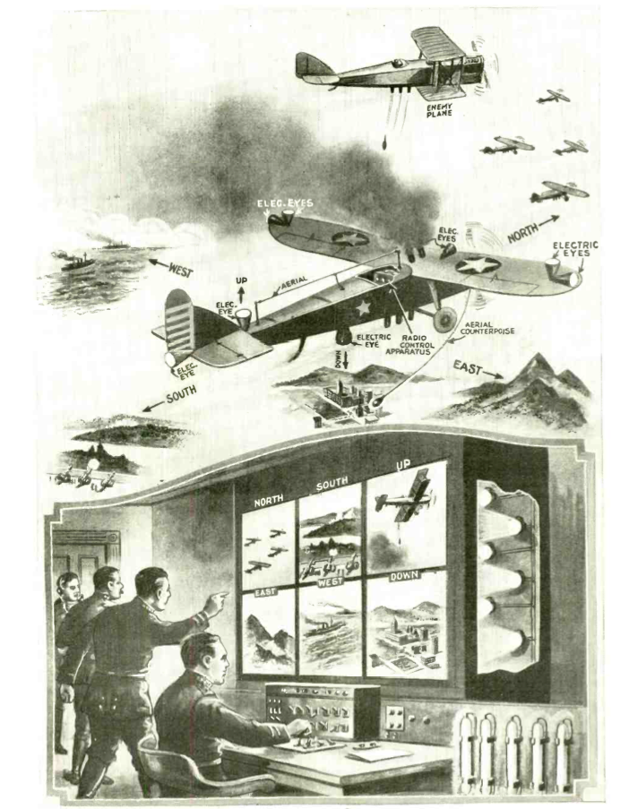
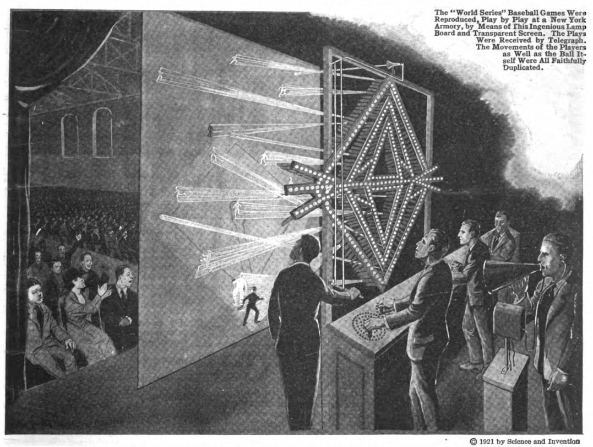

**DRAFT:** *Please do not share without permission of the author. Typeset versions in [web](http://gernsback.wythoff.net/192411_radio_tv_plane.html) \| [pdf](https://github.com/gwijthoff/perversity_of_things/blob/gh-pages/typeset_drafts/192411_radio_tv_plane.pdf?raw=true) \| [doc](https://github.com/gwijthoff/perversity_of_things/blob/gh-pages/typeset_drafts/192411_radio_tv_plane.docx)*

* * * * * * * * 

**Tomorrow we shall find a new order of things if a war should occur.  Pilot-less Radio-controlled planes fitted with "Television" eyes will flash back what they see to headquarters.**[^pqpb]

**O**N a recent trip to Washington the writer visited the laboratories of C. Francis Jenkins, the well-known experimenter of international reputation. It was Mr. Jenkins who perfected the shutter that made our present-day motion pictures possible. He was paid over $1,000,000 for this invention.[^cfjs]

Of late he has been experimenting with television and has already obtained astonishing results. At the time of the writer's visit Mr. Jenkins demonstrated his television machine before a number of Government representatives, including the Chief of the Signal Corps. At that time the writer actually saw his own waving hand, projected by radio over a distance of some thirty feet, the shadow of the waving hand being transmitted to a screen at that distance. Every motion made by the writer's hand was faithfully reprod uced on the distant screen. Opaque substances such as a cross, knife, pencil. etc., were also successfully transmitted and projected by the Jenkins Television machine.

It is the writer's opinion that, within two or three years, it will be possible for a man in New York to listen over his radio to a ball game 500 miles away and see the players on a screen before him at the same time. Whether it will be the Jenkins machine or some other machine that will achieve this result is of little consequence. The main thing is that experimenters all over the world are working frantically on television and sooner or later the problem will be solved.[^mlb]

An entirely new age will then be opened up and it is not necessary for the writer to expatiate at length on this phase; as it has been exploited by him in his past writings and by others for some time.

In this article, we shall concern ourselves with the radio-controlled television plane, which will come into being immediately the minute the television problem is put on a practical basis. It should not be construed that the radio television plane is merely a monstrous war machine, but it also has its uses during peace time, as will be explained. At the present time it costs great effort, time and aviators' lives in order to train our perfect flyers.

A radio-controlled airplane has already been demonstrated by the French and American Governments, and it flew for a lengthy period without anyone on board. The entire control was from the ground while the machine was aloft. The plane arose, cut figure eights, volplaned, ascended, descended and went through all the ordinary evolutions; the control being effected entirely and solely by radio. The same kind of a machine is also being experimented with successfully by our own and several other Governments, and it may be said therefore that the radio-controlled airplane has passed the experimental stages and has become practical and feasible for military use.

But the great trouble with radio-controlled airplanes is that the operator must see the plane. If his machine were to make a landing at a great distance he might land the airplane on top of a building or in a river, or it might collide with a mountain.

# A Pilot-less Plane Which "Sees" 

Imagine now a radio-controlled pilot-less airplane which is also equipped with electrical eyes, which eyes transmit the impulses---or rather what these eyes "see," by radio---to the distant-control operator on the ground. Our illustration on the opposite page, which shows a war machine, depicts this phase. Here we have a radio-controlled airplane equipped with a number of lenses which gather in the light from six different directions, namely, north, south, east, west, up and down. The impulses are sent to the operator on the ground, who has in front of him six television screens labeled "North," "South." "East." "West," "Up" and "Down." Each screen corresponds to one of the electric eyes attached firmly to the body of the airplane, as shown in the illustration.[^eye]

Let us now see what happens. The airplane is started from the ground and is sent over the enemy territory. During every second of its fight the control operator, although 50, 100 or possibly 500 miles away, will see exactly what goes on around the plane, just the same as if he himself were seated in the cockpit; with the further advantage that, sitting before a screen, he can scan six directions all at once, which no human aviator can do. If, for instance, an enemy airplane suddenly comes out of a cloud and starts dropping bombs on our machine below, the control operator sees this enemy machine quicker 500 miles away, than if an aviator sat in the cockpit one-quarter of a mile away from or below the enemy bomber. The control operator will send a radio signal that will immediately discharge a smoke screen from his radio television plane, hiding his craft in smoke. He can also make it turn about if such an operation should be necessary, or he can increase its speed if it is desired to escape.

If he outdistances, or otherwise eludes the enemy, the radio-controlled television airplane can then be directed to the spot where it is supposed to drop its bombs. Moreover, the distant-control operator can see exactly when his machine arrives over a given spot. A sighting arrangement can be attached to the plane in such a manner that, when the object to be bombed comes over the cross-wires in the range-finder, the bomb or bombs are dropped at the exact moment. Suppose that the enemy becomes too strong and that a great number of machines attack the radio-controlled plane and that there is no escape from the enemy. In that case the control operator will simply set the radio television plane on fire, bringing it down in flames! Thus it would be useless to the enemy and no lives will have been risked or taken---it being cheaper to destroy a machine than the valuable life of a highly trained pilot.

In the future such radio-controlled television planes may be used not only singly but in squadrons as well. They can be used for attacking the enemy if necessary. They can be used in pursuit of the enemy, for taking aerial photographs, and for any other military or peace-time operation, just the same as a present-day plane piloted by an aviator. Suppose the enemy has the same kind of machines, which, of course, he will have. It then becomes a matter of 'playing chess,' the same as if the machines contained live aviators. The battle, of course, would not be bloody, but practically the same results will be achieved as far as the military maneuver is concerned.

For peace-time purposes it goes without saying that the advantages of such a mechanical and "almost human" airplane are unlimited. It will be possible in the future to send mail planes from one end of the country to the other without a human being on board and such planes will be just as safe letter-carriers, as if they were manned by human beings. Every second of the flight would be watched by a Post Office Department operator and the plane would, of course, be able to defend itself against attack. It could readily be equipped with electrically-operated guns if such should be necessary or desirable. Particularly for transporting mail and the like, the radio-controlled television plane will be invaluable.

There are, of course, hundreds of other applications of the idea which readily suggest themselves to anyone. The writer is certain that such planes will be in existence during the next ten years.

[^pqpb]: This article was republished unchanged in the March-April 1931 issue of *Television News.*

[^cfjs]: For more on Charles Francis Jenkins, see **Predicting Future Inventions.**

[^mlb]: Two years earlier, an article in *Science and Invention* reported on experiments with telegraphic broadcasts of the 1922 World Series between the New York Giants and the New York Yankees.  An observer at the Polo Grounds telegraphed the game's events as they unfolded to a group operating a number of light projectors that would throw the image of players' movements onto a transparent screen.  Earlier incarnations of this setup involved massive baseball diamond boards on display outside of newspaper offices, where crowds would gather to watch light bulbs representing each baserunner, defensive players' positions, and the count.  Live radio broadcasts were only a few years away.

    @_baseball_1922.
    
    For more on the history of baseball as one of many prime movers in the development of broadcast technologies, see @tygiel_new_2001.

    
    
[^eye]:  Gernsback's use of "electric eyes" isn't just a metaphor.  In other contexts, he describes the physiology of the eye as a literal "television apparatus":

    > The animal eye is the most marvelous television apparatus ever invented. Moreover, it is non-electrical. If we look at an object, the latter is thrown into our eye, which is nothing but a marvelously efficient camera, but instead of a photographic plate, the impulses are thrown up on the Retina which records the object, not only in black and white as does the photographic plate, but the picture is recorded in its natural colors on the retina. From here numerous fine nerve strings interlocked in the retina connect with the optical nerve, which nerve in turn connects with the occipital lobes of the brain, translating the various light impulses, (stimuli) with their component colors into a "picture," which is then "seen" in our mind. We say "seen" advisedly, because of course the picture is not actually seen in the mind, but the impulses which the retina has picked up are translated into another form, which we experience in turn as the sensation of seeing.
    
    @gernsback_television_1918.