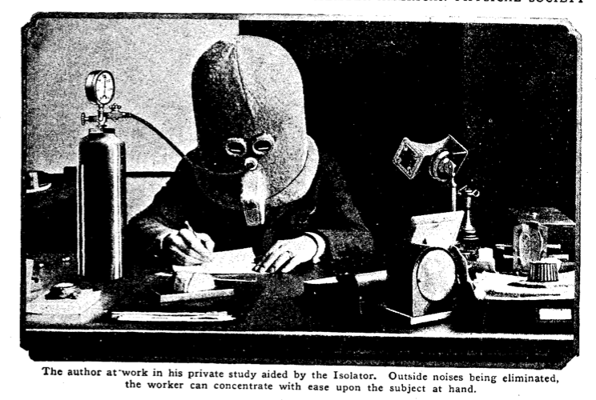
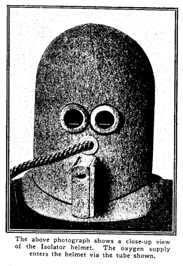
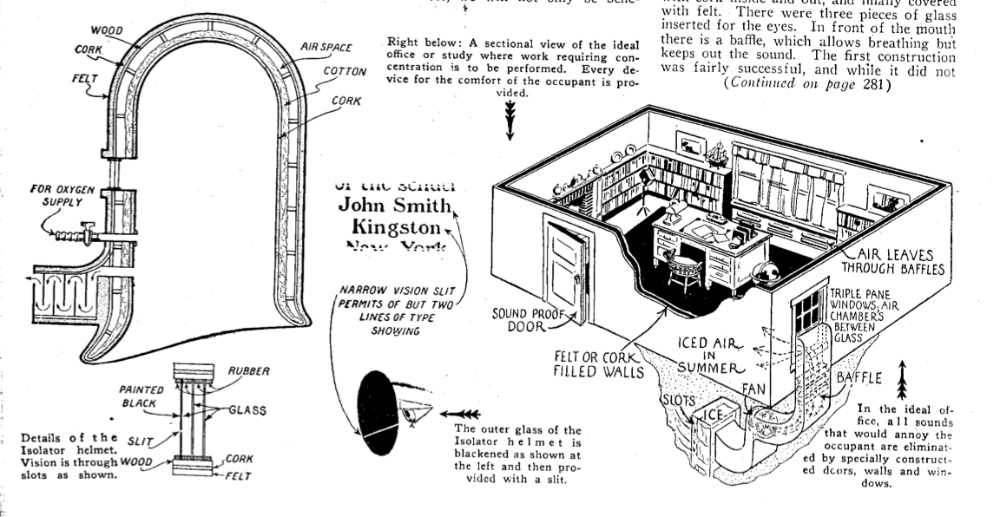

**DRAFT:** *Please do not share without permission of the author. Typeset versions in [web](http://gernsback.wythoff.net/192507_isolator.html) \| [pdf](https://github.com/gwijthoff/perversity_of_things/blob/gh-pages/typeset_drafts/192507_isolator.pdf?raw=true) \| [doc](https://github.com/gwijthoff/perversity_of_things/blob/gh-pages/typeset_drafts/192507_isolator.docx)*

* * * * * * * * 

**P**ERHAPS the most difficult thing that a human being is called upon to face is long, concentrated thinking.  Whether you are a lawyer, trying to formulate or memorize the pleading of a special case, whether you are an inventor with an intricate problem to be solved, whether you are a playwright trying to hatch out a knotty plot---assiduous concentration on the subject becomes necessary.

Most people who desire thus to concentrate find it necessary to shut themselves up in an almost soundproof room in order to go ahead with their work, but even here there are many things that distract their attention.

Suppose you are sitting in your study or your work room, ready for the task.  Even if the window is shut, street noises filter through, and distract your attention.  Some one slams a door in the house, and at once your trend of thought is disturbed.

A telephone bell or a door bell rings somewhere, which is sufficient, in nearly all cases, to stop the flow of thought.[^atsm]

But even if supreme quiet reigns, you are your own disturber practically fifty per cent. of the time.  You will lean back in your chair and begin to study the patron of the wallpaper, or you will see a fly crawl along the wall, or a window curtain will be moving back and forth, all of which is often sufficient to turn your mind away from the immediate task to be performed.

The writer repeats that the greatest difficulty that the human mind has to contend with is lack of concentration, mainly due to outside influences.

If, by one stroke, we can do away with these influences, we will not only be benefitted greatly thereby, but our work would be accomplished more quickly and the results would be vastly better.

The writer, who has to perform, almost daily, in connection with his editorial duties, many tasks that involve considerable concentration, has found out that it is almost impossible to keep his mind on a subject for five minutes without disturbance.  For that reason, he constructed the helmet shown in the accompanying illustrations, the purpose of which is to do away with all posible interferences that prey on the mind.

The problem was first to do away with the outside noise.  The first helmet constructed as per illustration was made of wood, lined with cork inside and out, and finally covered with felt.  There were three pieces of glass inserted for the eyes.  In front of the mouth there is a baffle, which allows breathing but keeps out the sound.  The first construction was fairly successful, and while it did not shut out all the noises, it reached an efficiency of about 75 per cent.  The reason was that solid wood was used.

In a subsequent helmet under construction, an air space is included, as per our line illustration, no wood entering into the construction at all.  This feature should give almost 90 per cent. to 95 per cent. efficiency, thereby excluding practically all sounds.

It will be noted that the glass windows directly in front of the eyes are black.  The construction involved the use of ordinary window glass, the outer glass being painted entirely black.  Two small white lines were scratched into the paint, as shown.  The idea of this is as follows:

The writer thought that shutting out the noises was not sufficient.  The eye would still wander around, thereby distracting attention.  By having the two white lines scratched on the glass, the field through which the eye can move is comparatively small.  In illustration No. 1, it will be seen that it is almost impossible to see anything except a sheet of paper in front of the wearer.  There is, therefore, no optical distraction here.

It was also found that if the helmet was used alone for more than fifteen minutes at a time, the wearer would become more or less drowsy.  This is not conductive to hard thinking, and for that reason the writer introduced a small oxygen tank, attached to the helmet.  This increases the respiration and livens the subject considerably.

With this arrangement it is found that an important task can be completed in short order and the construction of the Isolator will be found to be a great investment.

[^atsm]: In his definitive history of autism and its cultural meanings, Steve Silberman connects what Gernsback describes as the the particular "radio mind" possessed by amateur radio experimenters to "the curious fascination that many autistic people have for quantifiable data, highly organized systems, and complex machines [that] runs like a half-hidden thread through the fabric of autism research."  Moreover, the highly scripted and ritualized conversations conducted via wireless and later ham radio offered "ways of gaining social recognition outside traditional channels. . . . Hams who struggled with spoken language could avoid talking altogether by communicating in code."

    According to Silberman, Gernsback himself may have been "an undiagnosed Aspergian":

    > His peers regarded him as an unsociable figure who remained coolly distant from the communities he created. The people he counted as friends tended to be prominent scientists, influential politicians, and other notable figures with whom he corresponded by mail; historian James Gunn observed in *Alternate Worlds* that he was "a strange mixture of personal reserve and aggressive salesmanship."

    Silberman refers to the Isolator in particular as Gernsback's "most blatantly autistic creation."

    @silberman_neurotribes:_2015.