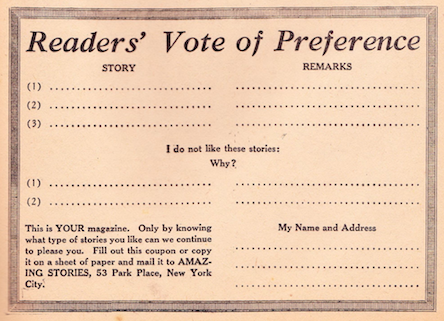

* * * * * * * * 

*Extravagant Fiction Today . . . . . . . . Cold Fact Tomorrow*

**A** NUMBER of letters have reached the Editor's desk recently from enthusiastic readers who find fault with the name of the publication, namely, AMAZING STORIES.

These readers would greatly prefer us to use the title *"Scientifiction"* instead. The message that these letters seem to convey is that the name really does not do the magazine justice, and that many people get an erroneous impression as to the literary contents from this title.

Several years ago, when I first conceived the idea of publishing a scientifiction magazine, a circular letter was sent to some 25,000 people, informing them that a new magazine by the name "Scientifiction" was shortly to be launched. The response was such that the idea was given up for two years. The plain truth is that the word "Scientifiction" while admittedly a good one, scares off many people who would otherwise read the magazine.

Before the name of AMAZING STORIES was first decided upon, a prize contest was held, but no better name than AMAZING STORIES, out of a list of some 200 names, could be found. The name "Scientifiction" would undoubtedly frighten many readers who would perhaps otherwise be interested in this new type of fiction. After mature thought, the publishers decided that the name which is now used was after all the best one to influence the masses, because anything that smacks of science seems to be too "deep" for the average type of reader.

We knew that once we could make a new reader pick up AMAZING STORIES and read only one story, our cause was won with that reader, and this is indeed what happened. Although the magazine is not as yet six months old, we are already printing 100,000 copies per month, and it also seems that whenever we get a new reader we keep him. A totally unforeseen result of the name, strange to say, was that a great many women are already reading the new magazine.[^npq]  This is most encouraging. We know that they must have picked up AMAZING STORIES out of curiosity more than anything else, and found it to their liking, and we are certain that if the name of the magazine had been "Scientifiction," they would not have been attracted to it at a newsstand.[^wmn]

And after all, we really need not make any excuses for AMAZING STORIES, because the title represents exactly what the stories really are. There is a standing rule in our editorial offices that unless the story is *amazing,* it should not be published in the magazine. To be sure, the amazing quality is only *one* requisite, because the story must contain science in *every* case.

A great many letters are also received, from readers who wish to contribute material to AMAZING STORIES. The formula in all cases is that first the story must be frankly amazing; second, it must contain a scientific background; third, it must possess originality. At the present time we are booked far ahead for long stories of the novel type, and therefore can only accept short new stories. Stories that do not run more than six to eight pages when printed are most welcome providing they fill the above requirements. We believe the era of scientifiction is just commencing. We are receiving a great many fine short stories, and as time goes on we will publish more and more new material besides the classics which we are publishing now, and for which we have many requests from readers.[^hox]

The Editors also wish it to be understood that this is *your* magazine in all respects; they will always be guided by the wishes of the majority. We will publish from time to time a sort of voting blank in which you may show your preference as to the type of stories published in the various issues. You will find such a blank elsewhere in this issue.

At this point we wish to say that the voting contest we conducted several months ago has now been closed. The vote stood as follows:

Leave the magazine monthly as it is now---498.

Make it a semi-monthly---32,644.

We will probably accede to the wishes of the readers as soon as the circulation of the magazine has become stabilized, which will probably be some time before the end of this year.

* * * * * * * * * * * 

Mr. Hugo Gernsback speaks every Monday at 9 P. M. from WRNY on various scientific and radio subjects.

[^npq]: A similar debate broke out among readers when *Science Wonder Stories* shortened its title to *Wonder Stories* in June 1930.  And, once again, the conversation conflated genre and gender.  See @cheng_astounding_2012, 116.

[^wmn]: Mrs. H. O. De Hart of Anderson, Indiana writes:  "Well, I've written Mr. Wastebasket a rather lengthy letter this time, but I do not really expect you to clutter up your columns with it.  I am only a comparatively uneducated young (is twenty-six young? Thank you!) wife and mother of two babies, so about the only chance I get to travel beyond the four walls of my home is when I pick up your magazine." @de_hart_kind_1928.
    
    A reply came a few months later from Mrs. L. Silverberg of Augusta, GA:  "It is the letter of Mrs. H. O. De Hart in the June issue of your publication that is the cause of my writing my little say.  For more than a year I have been a reader of this magazine, and this is the first time I have seen a letter from a woman reader.  In fact I was somewhat surprised as I had believed that I was the only feminine reader of your publicaiton.  However, it is with pleasure that I note that another of my sex is interested in scientifiction." @silverberg_lady_1928.  Quoted in @larbalestier_battle_2002

    The next year, Gloria Rosselli of Hickory Street, Seaford, NY writes: "I am a Senior in a small high school in an adjoining town.  Because I am only seventeen (and a girl at that!), maybe I'm not supposed to enjoy the highly educational and scientific stories which you publish … but I do."  @rosselli_letter_1929.
          
    And Barbara Baldwin of 566 College Avenue SE, Grand Rapids, MI writes:  "This is another letter from a *mere* girl.  I am seventeen years old and have been reading *Amazing Stories* for about a year.  What we want is more interplanetarian stories and less detective stories.  I think that most other girls will agree with me in that respect. … It might interest you to know that I have bought a three-inch telescope since I first became interested in astronomy through *Amazing Stories.*  @baldwin_mere_1930.  Quoted in @cheng_astounding_2012, 116.

    Larbalestier's book shows how letters among female readers allowed for the construction of a community that paved the way for later female science fiction writers who would thematize the terms of these conversations.  By April 1931, Leslie F. Stone ("one of the earliest women writers of science fiction") published "The Conquest of Gola" in *Wonder Stories,* the first of an SF tradition Larbalestier calls battle-of-the-sexes texts:
    
    "I want to emphasize that the battle-of-the-sexes stories' engagement with debates about the social constructions of women and men and the organization of relations between them is made possible by science fiction's generic rules.  Science fiction is not tied to a 'mimetic faithfulness to the world as it is.'  The process of imagining a world in which women are the dominant sex immediately exposes many of the processes that normally operate to keep women subordinate; it renders these processes of power *visible.*" (8)

[^hox]:  Among this issue's stories was "The Moon Hoax": reprints of articles published by the *New York Sun* throughout August 1835 that erroneously claimed the astronomer Sir John Herschel had recently discovered vegetation, animals, and an intelligent species that built temples on the moon.  The editorial introduction states that it was due to a lack of modern media that the hoax spread so easily to an incredulous public:  "At that time, when there were no cables and no radio, and communication was slow, it was a simple matter to spring such a hoax, where today it would not last twenty-four hours, because verification or denial would speedily be brought about."  Despite the series' obvious falsehood, this intro calls it "a charming story that will live forever … this remains one of the finest pieces of imagination that has ever appeared."  Thus the ever expanding catalogue of scientifiction "classics" included texts that worked upon the reader with a semblance of scientific veracity.  But the mark of a truly modern work of scientifiction was the speed with which the truth of the story could be proven or disproven by the community.