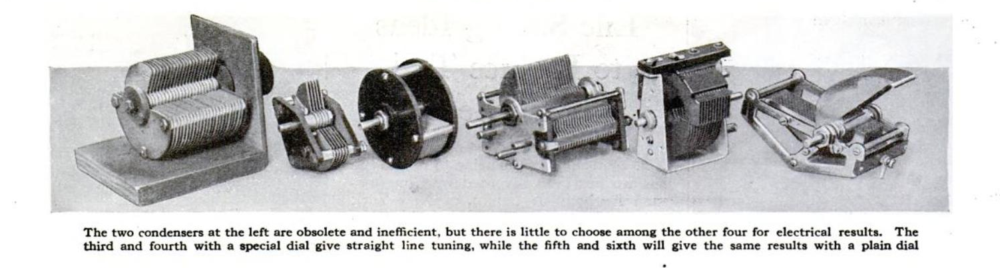
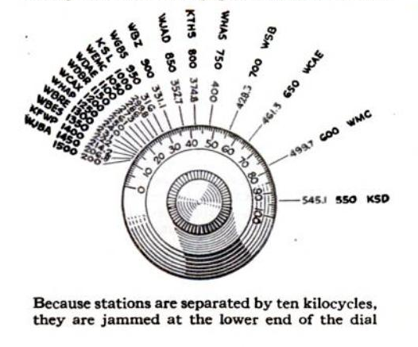
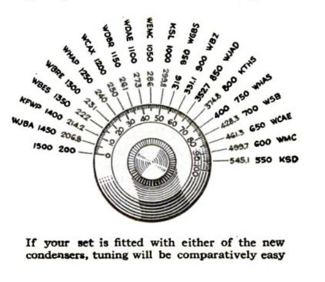

**DRAFT:** *Please do not share without permission of the author. Typeset versions in  [web](http://gernsback.wythoff.net/192609_is_radio_standstill.html) \| [pdf](https://github.com/gwijthoff/perversity_of_things/blob/gh-pages/typeset_drafts/192609_is_radio_standstill.pdf?raw=true) \| [doc](https://github.com/gwijthoff/perversity_of_things/blob/gh-pages/typeset_drafts/192609_is_radio_standstill.docx)*

* * * * * * * * 

\begin{center}
\fbox{
  \parbox[c]{7cm}{

…wherein the editor compares the Radio Industry to the Automobile Industry---in which the gradual evolution of radio is sketched---how it is shown that the rate of radio patents is increasing---in which batteries and eliminators are discussed---and why radio sets use five times less energy now than in 1920.

  }
}
\end{center}

During the course of conversation with any people in all walks of life, the question is frequently asked me, if radio has now settled down, in the same degree as the automobile industry, and whether it has become stabilized?

I have answered, a great many times during the past few years, that we need not look for any revolutionary improvements in radio at the present time.  The chances are against any invention that will entirely upset the radio industry.  Just as in the automobile industry, we may not look for any revolutionary invention that will upset the entire trend of the automobile---unless it should be a flying attachment, which might be applied to any automobile---and this, while not impossible, nevertheless will not appear in the immediate future.

It is the same with radio.  Television, to be sure, is in the offing, but several years will elapse before you will be able to sit before your radio at home and witness a baseball game 100 miles distant.  On the broadcasting end, no great and epochal improvements need be expected shortly.  While improvements are being made right alone, these are now more in the nature of finer touches rather than revolutionary; but we can expect better and better transmission and greater clarity.  One of the great troubles in the United States at the present time is the heterodyning between different stations nearly on the same wave-lengths.[^dyn]  This is particularly true of the low wave-lengths, where there is serious congestion, and there does not seem to be any immediate remedy for this.  Technically, there seems to be no possible way to separate two stations less than 1,000 miles apart and operating on the same wave-length.  As Congress has adjourned for some six months, and the Department of Commerce is left with little authority, there seems to be little hope that the heterodyning evil can be done away with in the immediate future.

On the receiving end it does not seem that sets will be altered radically in the next few years.  Five- and six-tube sets probably will prevail for quite a long time to come; although there is always the possibility that a single-tube super-regenerative set, which in output may equal the present 4- and 5-tube set, can be developed.  So far the super-regenerative circuit, while admitted to be one of the great possibilities, has been and remains nothing but an experiment.  It is, as yet, too tricky and has never left the laboratory stage.

From these remarks no rash conclusions should be reached that radio is stagnant and does not progress.  Quite the contrary.  During the entire year of 1925 over nine hundred radio patents were issued by the Patent Office; and during the first six months of 1926, almost six hundred radio patents have been issued.  As a matter of fact, it will be seen from these figures, our inventors in the various laboratories all over the country are still tremendously busy devising new and better things in radio.  It would seem that this activity should keep on increasing rather than decreasing in the immediate future.

Radio in this country goes through various strange cycles.  When broadcasting started off with a rush, we were in the crystal-set stage.  That prevailed during some six months, until the single-tube epidemic set in, which lasted for a year.  With one bound we jumped from the single-tube to the 5-tube set which, even today, is more or less standard.  At first the sets were built in a box to put on the table.  That continued for about a year, when the industry was affected with the console-set fever, which does not yet seem to have abated.

As to the parts,---components---conditions were much the same.  Last year we saw a small epidemic of straight-line-frequency condensers, which have practically displaced the old straight-wave type.  Then came the vernier-dial tempest, which is still blowing strong.[^uen]

This year seems to be an "A" and "B" eliminator year; because more firms are becoming encaged in the manufacture of eliminators than in possibly any other single radio accessory.  There are several million radio sets in use today, and the market for batteries and "A" and "B" eliminators is therefore very large.  As in all such phenomena, there is sure to be a race for supremacy between the manufacturers of eliminators and those of batteries.  And we may be certain that the battery people are not standing by idly.[^elm]

When radio first came along, it seemed that the deathknell of the phonograph had definitely been sounded; but the phonograph people merely rolled up their sleeves and went to work producing such phonographs as they had never before believed it possible to build.  The immediate result was that the phonograph today is in far greater demand than it was before the advent of radio; and, whereas in 1922 every phonograph manufacturer had 'nerves' every time the word 'radio' was mentioned, he sits back today, complacently, and is not worried at all.

So it will probably come about that the battery manufacturers will be spurred on to meet the invasion and give the eliminator people a still battle.  Already the storage-battery folk have seen the light, and are putting out radio power plants that connect right to the lighting circuit.  These miniature power plants give "A" and "B" battery current with a minimum of attention from the owner.  No longer is he required to lug around heavy "A" and "B" storage batteries; now he leaves the unit in the cellar and it is charged automatically.

As to the radio sets, they are getting better and better as time goes on.  More attention is being paid now to reduction of losses, shielding, and mechanical perfection, than at any time during the history of radio.  It is safe to say that an up-to-date set bought today will be in service for many, many years to come.  In the meanwhile, the sets are becoming more sensitive as well, and will have better and better range, by virtue of the improvement in vacuum tubes, which are being made more sensitive every month.  Not only are they more sensitive, but htey are being made more economical as well.  The 5-tube set in 1920 required 5 amperes at 6 volts, which is 30 watts, to light its filaments.  It meant, then, recharging your storage battery every few days.  The like set today uses only about 1 1/4 amperes at 5 volts, or 6 1/4 watts.  It is safe to say that the consumption of current by the average radio set, at the end of the next five years, will not be even half what it is today.

During the coming season, the shielding idea seems possibly the greatest advancement in radio receiver building.[^bpbr]  More and more firms are adopting the shielding system, whereby coils, tubes, and condensers are completely shielded by metallic containers, to do away with stray currents set up not only within the thing itself, but from outside sources.  This results in much sharper tuning and very much better reception.

[^dyn]: In Fessenden's case, contorolled heterodyning could boost a signal.  But with the number of broadcast stations crowding the airwaves in the 1920s, natural heterodyning occured when two stations operating at closely-spaced frequencies produced unwanted interference for each of the signals.  For more on the heterodyne principle, see **The Dynamophone.**
    
[^uen]: Both of these were innovations in tuning knob construction.  As more and more broadcasters began to crowd the airwaves in the late 1920s, straight line frequency condensers made tuning easier by spacing out frequencies at the lower end of the dial so that the distance between stations was uniform from one end of the dial to the other.  "At the lower end of the broadcasting band, ten kilocycles do not change the wavelength nearly as much as the same change does at 500 meters, for instance."  Straight line condensers were a solution to this problem.

    > As the shaft is turned, the plates engage with each other more and more rapidly.  The result of this construction is to give slow changes in capacity when the plates are nearly disengaged, and rapid changes when the dial is turned to the higher numbers. … This means that as you turn the dial toward zero, the condenser plates move slower and slower in proportion to the amount of motion on the dial.
    
    @lane_new_1926

    Vernier dials allowed for large movements on a knob to result in fine-grained input: "each complete rotation of the control knob causes only a fraction of a revolution of the main shaft, permitting fine and accurate adjustment."  @_vernier_2003.  It is named for the vernier scale, which performs a similar function for measurement: a secondary scale on a pair of calipers indicates with more granularity where a measurement lies *between* two marks on the primary scale.  It was invented by the French mathematician Pierre Vernier (1580-1637).  @_vernier_2015.
    
     <!-- no figure -->
    
     <!-- no figure -->
    
     <!-- no figure -->

[^elm]: "Eliminator" sets, first appearing on the market in 1926, drew their power from household wall outlets rather than batteries.  No batteries meant much less wiring and a reduced appliance weight of 40 to 50 pounds. @sterling_stay_2002, 91.

[^bpbr]: Shielding a radio set involved placing electrically conductive or magnetic materials between individual components in order to reduce the possibility of electromagnetic interference.