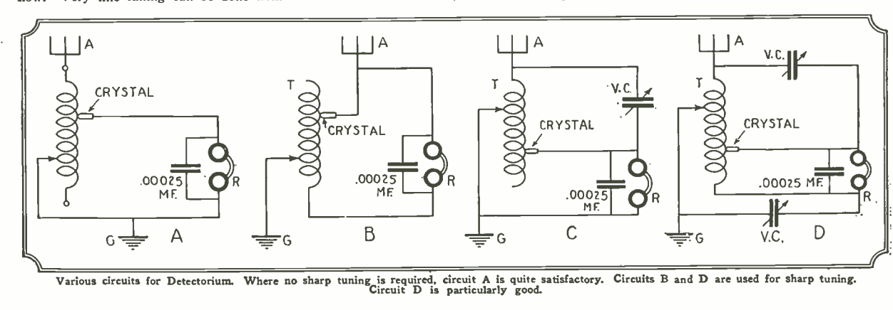
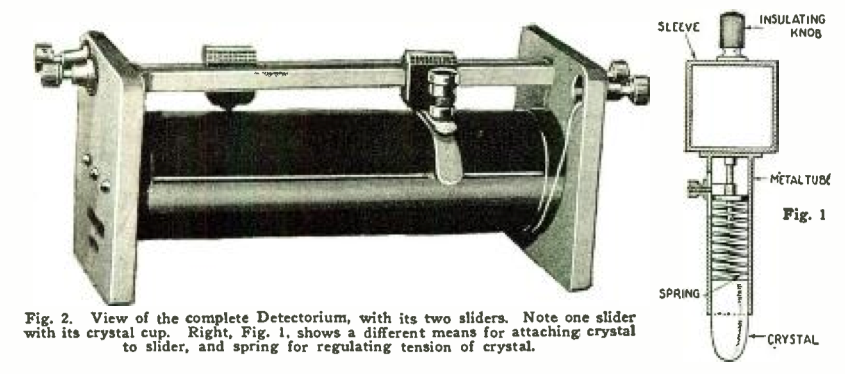
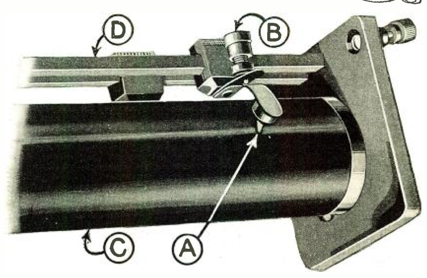
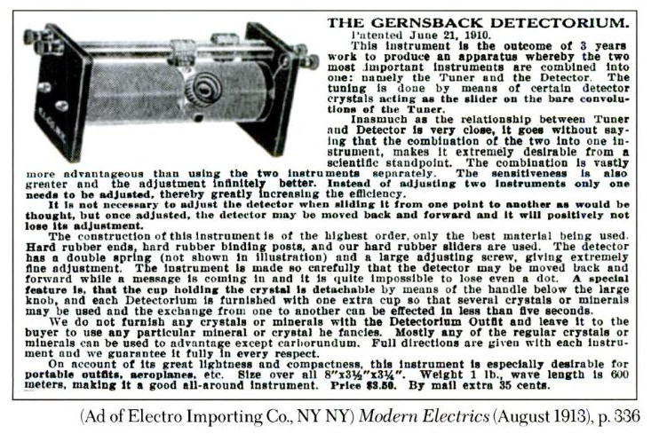

* * * * * * * * 

**I**N view of the growing popularity of the crystal detector, especially in our large cities, I believe that experimenters all over, particularly the new-comers, will be interested in an instrument invented by me in 1910. The Detectorium, as it was designated by me at that time, was patented June 21, 1910 (U. S. Patent No. 961,855).[^855]

During all the years since broadcasting has come into vogue, I do not recall having seen the device described; but it was so good in the old days, and performed so remarkably well, that I feel it my duty to bring it again to light. It was originally described in the world's first radio magazine, which I published; namely, "MODERN ELECTRICS," in the July, 1910, issue.[^dtc]

The Detectorium is interesting chiefiy because it does two things at once. Instead of first adjusting the detector and then tuning by means of switches or sliders, in the Detectorium these two operations are performed in one. As the illustration shows, *the detector has become the tuning slider.*

The great utility of a device of this kind will be seen immediately, particularly for sets that are to be transported a good deal.[^prt]

In my 1910 experiments I quickly found that the only good minerals were Silicon, Copper Pyrites, Iron Pyrites, Zincite, and Carborundum, in the order named.

A number of circuits showing Detectorium connections are shown on this page.

At this point I wish to say that I believe that our 1910 tuning coils with sliders are still way ahead of anything that is in use now. Very fine tuning can be done with a double-slide tuning coil; much better, in fact, than in most devices used today.

CONSTRUCTION IS EASY
=====================

The Detectorium can be readily constructed by an experimenter, and no particular directions need be given here as to sizes. The illustrations show a tuning coil which was common in 1910, but whose range is greater than the present broadcast range. The coil at that time consisted of a two-inch tube about eight inches long, wound with No. 24 enameled or bare wire. The same size tube can be used today, with the exception that the wire should be about No. 18 or No. 20 B & S bare copper, which will cover the broadcast range surprisingly well.[^wniv]

The tube is put in a lathe, or similar winding device, and bare copper wire is used, winding with it, at the same time, a thick thread, to separate the wire convolutions so that they do not touch. The thread can remain, if so desired.

A slider arrangement as shown in Fig. 1, can be used if desired, or otherwise the arrangement shown in Figs. 2 and 3, which was the better arrangement, can also be used. If the slider shown at Fig. 1 is used, it is necessary of a form somewhat as shown; that is, a bullet-like shape. The ends can be rounded off nicely by grounding on an enemy stone and afterwards polishing the crystal perfectly smooth. The end curvature should not be too small, otherwise two turns on the tuning inductance will be short-circuited.

The better way is shown in Figs. 2 and 3. The slider in this case may be a piece of wood with a square-filed hole. Contact is made with the slider rod by means of a small spiral spring, which presses against the metal screw B, which serves to vary the tension of the lower leaf spring, which carries the detector cup A. C represents the wire convolutions, D the second slider rod.

The detector cup A is a metal cup, in which the detector crystal is held by means of a fusible alloy. The part of the crystal making contact with the wire should not be sharp, but rounded off. If it is sharp it will scratch the wire and stick between the convolutions.

SIMPLE, SHARP, SATISFACTORY
============================

If the Detectorium is constructed with care, a great amount of satisfaction can be had from it; because it places the detector right underneath one's finger, and tuning is done very rapidly. Particularly with silicon and iron pyrites, the tension adjustment is not very critical, and a little more or less pressure does not seem to make much difference, as reception is usually excellent in all cases.

The Detectorium is a most efficient instrument, because it does away with a number of extra parts and extra wires; and is therefore really a low-loss detector instrument. If carefully adjusted, it will be found that the Detectorium will surpass in loudness of reception almost any other crystal combination. Not only that, *but exceedingly sharp tuning can be done,* much sharper that you are accustomed to obtain with the usual crystal-detector arrangement. 

The circuit diagrams, Figs. B and D, are excellent for sharp tuning; no value is given for the variable condensers, as this depends a great deal upon the construction of the Detectorium. .0005-µf. condensers, however, are satisfactory in nearly all cases.[^frd]

In Figs. 2 and 3 the detector-bearing cup is shown soldered right to the lower leaf spring. If desired, the lower leaf spring may be slotted, and by means of a screw arrangement, different crystals screwed in or out if different sensitivities are desired. It is understood that the Detectorium uses no batteries of any kind, as the rectified current of the incoming wave is sufficient to operate the telephone receivers.

I shall be glad to hear from those who have constructed the Detectorium.[^rdr]

[^rdr]: H. Catchpole from London, England reported in the February 1927 issue that he had success building the Detectorium using iron pyrite, and that the results were "louder than any crystal set I have made to date."  W. M. Cos, EAA., Chatham, England, wrote in a letter, published in the December 1926 issue:

    > I constructed this instrument in 1918 when I first commenced radio research. Details were then published in your handbook, "Wireless Telegraph and Telephony." The instance remains vivid in my memory as the tuner, when incorporated in a portable set was extremely efficient and decidedly unique. The only trouble that I experienced was due to the crystal. Silicon was the most satisfactory although it has a tendency to crumble. This applies to zincite while carborundum cannot be ground and is therefore not smooth in action. The tuning was extremely sharp, and when the secondary was shunted by a .0003-µf. variable condenser results were all that could be desired. I take this opportunity to compliment you on the high standard of your publications, which with all due respect to our English periodicals, are on a much higher scientific basis. Our papers only cater to the broadcast listener, and the experimenter who dabbles in everything electrical is left in the dark.

[^855]: @gernsback_detectorium_1910.

    For more on the multiple sliders and knobs that the Detectorium replaced, see **A Treatise on Wireless.**

[^dtc]: The Detectorium was sold by Electro Importing, fully assembled, for $3.50 in 1913.

     <!-- no figure -->

[^prt]: In a handbook published by Gernsback's brother Sidney and other Electro Importing employees, one lesson is devoted to the construction of the Detectorium, recommending that a kite be used to lift the aerial to a sufficient height.  They write that the apparatus is

    > very well adapted to the requirements of all portable wireless stations, such as those in mule pack sets, aeroplane airship sets, and in a hundred other places, where light weight and great compactness are prime requisites. … This method of using a loading coil is the only way by which so long a wave length may be obtained within such a limited space.  
    
    @gernsback_experimental_1916, 62-3.
    
[^frd]: The farad is the standard unit for measuring electrical capacitance. It is named after Michael Faraday (1791-1876), the physicist who pioneered research in electromagnetism. A µf denotes a microfarad, or one millionth of a farad.

[^wniv]: B & S refers to the size of the wire.  The Brown & Sharpe metal gauge favored by early electrical engineers and contractors to measure the diameter of a wire is still in use today. 