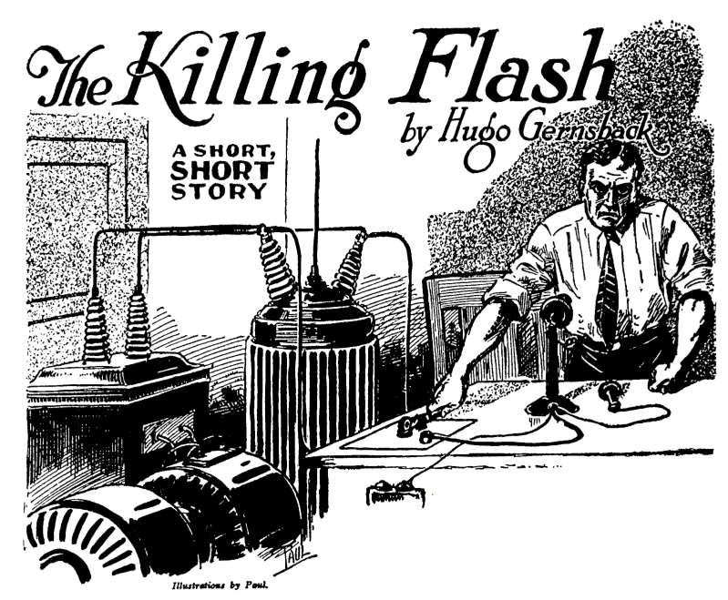

**DRAFT:** *Please do not share without permission of the author. Typeset versions in  [web](http://gernsback.wythoff.net/192911_killing_flash.html) \| [pdf](https://github.com/gwijthoff/perversity_of_things/blob/master/typeset_drafts/192911_killing_flash.pdf?raw=true) \| [doc](https://github.com/gwijthoff/perversity_of_things/blob/master/typeset_drafts/192911_killing_flash.docx)*

* * * * * * * * 

March 1.
ESTERDAY Lindenfeld signed his own doom,  although  he  did  not  suspect  it.
Years ago it started at college. I stood one sly insult, one injury after another. Always he came out on top. Always he won. I was always the vanquished, the one bested. He beat me in every sport and every competition. So that, at the end of the term, we were bitter enemies.
But, by that queer chance of destiny, it did not stop there, for we both settled down in Beauford; and, by another stroke of Fate—that irresponsible goddess who often governs our lives—we both went into the same line  of business, almost at the same time. It took each of us a few weeks to find this out, and then it was too late. My pride forbade me to go into another venture, so I stuck it out. Within the year, Lindenfeld had put me out of business. That, however, could have been endured; but not his
last and crowning insult.
Yesterday, he eloped with my fiancée. That signs his death warrant. Of the long list of insults, offenses and near-crimes, this one must be the last. The sooner the world is rid of this monster, the better.
As soon as he returns, I shall kill him with my own hands, but so subtly, oh, so subtly, that only he will know that I killed him. And no one will know how he met his death.
As a scientist, this should be easy for me. I will use an entirely new method, something new in murder. Simple. Yet subtle. Very. And the police will never find out how it was accomplished, because I will kill Lindenfeld by long distance.
This is the plan. I will rent a little loft in the busy east end of the town. Here I will gradually assemble my high-tension apparatus, a 5-kilowatt generator, a 350,000-volt step-up transformer, condensers, and various other electrical paraphernalia. When everything is connected up, I will   attach   the   output   of   the   350,000-volt
transformer to my telephone line. I will then call up Lindenfeld on the telephone and make sure that it is he who answers. I will make it my business to find out that he is home alone. I can readily find that out by one or two extra phone calls to his house. Then, when he answers me, I have but to step back from my phone and press a switch which  controls  the  350,000-volt
high-tension current. The deadly current will leap over the telephone wire to Lindenfeld’s house. A long spark will jump between the receiver and the transmitter, and as Lindenfeld’s head is between them he will be electrocuted instantly— not, however, without first having heard my voice.

March 15.
Everything is in  readiness. The machinery is installed. It works beautifully. Of course, I rented the little place under an assumed   name,   and   I   wear   a
disguise. No one can trace me, even if they knew how the beast was killed. Most murderers overlook one little detail. I don’t. Everything is planned scientifically. Minutely. Painstakingly. I put a phone call in five minutes ago. I asked for Mrs. Lindenfeld, my former sweetheart, in a disguised voice. He answered, the cur. She is out.
I call up River 2650. He answers. I say: “Do you know who this is?” There is a momentary pause: “Sure I know,” he laughs derisively. “My dear old friend, John Bernard, what gives me ... ?”
I   cut   him   short   with:   “Take   that,   you monster!”—and,
jumping back, I press the switch. There is a blinding  flash,  as  the transformer discharges into the telephone line. I	have	killed
Lindenfeld!

*	*	*
March 22.
BEAUFORD TELEPHONE Co.
Beauford, N. Y., March 21,1929.

Mr. John Bernard, 16 Locust Ave., City

Dear Sir:
We received your interesting letter, as well as the manuscript entitled, “THE KILLING FLASH.”
You ask our advice whether or not it is possible to kill a person over a telephone line as indicated by you in your ingenious manuscript.
For the benefit of the country, we are glad to state that we believe the scheme to be impractical.
While there are isolated instances of people having been killed by high-tension discharges, due to telephone wires having crossed with power lines, such cases
are exceedingly rare.
The reason is that the high-tension discharge usually becomes grounded before it has traveled 100 feet over the telephone line.
In your case, the suppositious Lindenfeld would no doubt, have heard a series of loud noises in his phone, but he would not have come to harm.
Sincerely yours,  BEAUFORD TELEPHONE Co.

March 22.
(Newspaper account from the afternoon edition of
the Beauford Eagle.) John  Bernard,  26,
of this city, single, manufacturer	of patented appliances, was found dead this morning in a loft at No. 627 East Worth Street. His terribly mutilated body was identified by Henry Lindenfeld who, it was divulged, owned the loft.
From an unopened letter, found at his residence, with an enclosed manuscript sent by The Beauford Telephone Co. to him, it is clear
April 1st.

SCIENCE WONDER STORIES
Office of the Editor
that  he  planned  to  kill  Henry  Lindenfeld  by
connecting a 350,000-volt high-tension transformer to the telephone line. Upon calling up his enemy, he is presumed to have closed the switch which was to electrocute Lindenfeld.
Bernard, however, never received the letter from the Beauford Telephone Co. telling him his murderous scheme was impractical as, indeed, it proved to be. Lindenfeld at 9:30 P. M. yesterday received a telephone call from Bernard who spoke threateningly over the ‘phone, ending up with: “Take that, you....” That was all. Lindenfeld hung up his ‘phone and later retired.
But as Bernard pressed the switch, 200 lbs. of high explosives stored on the floor above—no doubt set off by the high-tension discharge traveling along the joint telephone cable to the next floor—blew up and in the wreck Bernard was crushed to death, hoist as it were by his own petard. His funeral will be held from Levitow’s Funeral Parlors tomorrow.

*	*	*

Mr. David Friendly 119 W. 46 Ave.,
Springfield, Ill.

Dear Sir:
Sorry to find it necessary to return to you your manuscript entitled “THE KILLING FLASH.”
It is a nice story and fairly original; but there are a number  of  weak points  which  should be eliminated before we can use the manuscript. For instance, the worst is that, in the story, Bernard certainly would not have written to the telephone company telling them about his plot to kill Lindenfeld. That would, of course, have caused his arrest.
Then, too, the story is improbable; because Bernard, if he had any sense, would not have written down the assertion that he killed Lindenfeld. If you can fix these various points, maybe we can use the story.
Sincerely Yours, SCIENCE WONDER STORIES
By O. Utis, Ass. Editor

THE END
