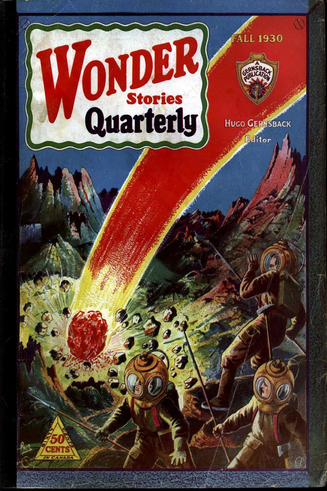

. . . Prophetic Fiction is the Mother of Scientific Fact . . . 

**I**N time to come, there is no question that science fiction will be looked upon with considerable respect by every thinking person. The reason is that science fiction has already contributed quite a good deal to progress and civilization and will do so increasingly as time goes on.

It all started with Jules Verne and his *Nautilus,* which was the forerunner of all modem submarines. The brilliant imagination of Jules Verne no doubt did a tremendous bit to stimulate inventors and constructors of submarines. But then of course, Jules Verne was an exception in that he knew how to use fact and combine it with fiction.

In time to come, also, our authors will make a marked distinction between science fiction and science *faction,* if I may coin such a term.

The distinction should be fairly obvious. In science fiction the author may fairly let his imagination run wild and, as long as he doesn't turn the storey into an obvious fairy tale, he will still remain within the bounds of pure science fiction. Science fiction may be prophetic fiction, in that the things imagined by the author may come true in some time; even if this "some time" may mean a hundred thousand years hence. Then, of course, there are a number of degrees to the fantastic in science fiction itself. It may run the entire gamut between the probable, possible and near-impossible predictions.

In sharp counter-distinction to science fiction, we also have science *faction.* By this term I mean science fiction in which there are so many scientific facts that the story, as far as the scientific part is concerned, is no longer fiction but becomes more or less a recounting of fact.

For instance, if one spoke of rocket-propelled fliers a few years ago, such machines obviously would have come under the heading of science fiction. Today such fliers properly come under the term science *faction* because the rocket is a fact today. And, while rocket-propelled flying machines are as yet in a stage similar to the Wright brothers' first airplane, yet the few experimenters who have worked with rocket-propelled machines have had sufficient encouragement to enable us to predict quite safely that during the next twenty-five years, rocket flying will become the order of the day.

Which is the better story, the one that deals with pure science fiction or the one that deals with science *faction?* That is a difficult thing to say. It depends, of course, entirely upon the story, its treatment and the ingenuity of the author.

Of course, the man of science, the research worker, and even the hard-headed business man will perhaps look with more favor upon science *faction* because here he will get valuable information that may be of immediate use; whereas the information contained in the usual run of science fiction may perhaps be too far in advance of the times and may often be thought to be too fantastic to be of immediate use to humanity. So between science fiction and science *faction* there will always be a great gap---and each will have its thousands and perhaps millions of adherents.