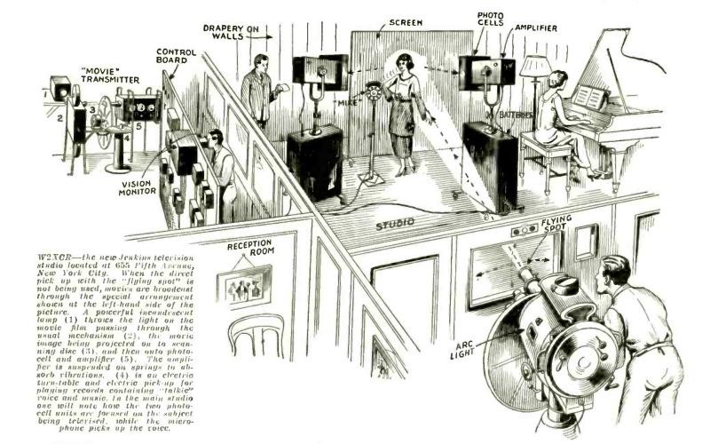

**DRAFT:** *Please do not share without permission of the author. Typeset versions in [web](http://gernsback.wythoff.net/193107_television_technique.html) \| [pdf](https://github.com/gwijthoff/perversity_of_things/blob/gh-pages/typeset_drafts/193107_television_technique.pdf?raw=true) \| [doc](https://github.com/gwijthoff/perversity_of_things/blob/gh-pages/typeset_drafts/193107_television_technique.docx)*

* * * * * * * * 

**A**S the television art advances and tends to become popularized, so the technique of television presentation will advance as well.  Radio people will appreciate this fact when they think back how broadcasting first started, and how crude the transmitting technique was.

At the transmitter, somebody spoke into a poor-grade microphone which, like as not, often suddenly went out of commission. It took several years to discover that you should have two independent microphone transmitters, with two independent lines; so that, when one went out of commission, the station was not cut off the air. Then, at the radio transmitter itself, neither the high nor the low notes passed through; and the result at the listening end was consequently poor.

Also, too, there were often long waits, whenever one program went off the air, before another came on. Broadcasters started with a single studio and, when an orchestra went off the air, it took some time to get out of the studio, and there was an interval before the next performer could go on the air. Of course, these things sound ludicrous now; but in those days, when each station had only a single studio, and there was no switching arrangement from one studio to a multiplicity of others, as there is today, the problem did not appear so simple.

When television finally gets running along the lines of broadcasting, we will have all the refinements that we find in audible radio today, plus a good many additional contributions which the television art demands.

Just as we used to have a single microphone in the old days, so we now have a single transmitting scanning mechanism which, as like as not, in the midst of the program, becomes defective; and the image vanishes from the television receiver. In the future, of course, we shall have double and even triple scanning transmitting apparatus, which will overcome possible failure of one of them; and, secondly, this will also give us more intensity, a thing which---in television particularly---is highly desirable.

The other day we were listening in and viewing a television performance from one of the local television stations. After the singing team got through, we were greeted with an announcement that we should stand by for some five minutes, until the carbons were changed on the television transmitter![^C] Of course, such crudities as this will not happen in the future. The "listening" and "seeing" audience will not stand for this in the future; while today, of course, they are glad to see anything.

Then, as we have in present broadcasting, the so-called fade-in and fade-out (that is, where we first hear the music or voice in the background and then hear it come up to full volume) so we will have one screen image merge into another in television. We will have the "fade-out," as we have today in motion pictures. We will have superimposed scenes, and even a multiplicity of scenes at the same time.[^edt]

We will have all sorts of novelties, once television gets under way; and some enterprising network will soon show us one ship in the Atlantic Ocean and one in the Pacific, both at the same time, side by side. Then, of course, we will have trick television, just as we have trick motion pictures today. It will be possible even to have two well-known actors appear on two different stages in different parts of the country; while, by television, the audience will see the two actors (actually separated by hundreds of miles) together on the television screen, going through their act as if they were actually side by side. Of course, it would not be possible, for instance, for them to shake hands; but they could go through a performance; speak their lines, and act the parts just as if they were together. This naturally would be accomplished by televising the two scenes independently, and bringing them together on one screen.

Quite a good many tricks which are now being accomplished in motion pictures can be adapted to television as well. We can have the usual close-up; we can have the heroine shedding glycerine tears, while the audience is none the wiser.

We will have our thrillers (like, for instance, Harold Lloyd doing his "impossible " stunts on the face of a skyscraper) because most of these effects can be easily enacted in the studio, without the television audience seeing the technique, any more than the motion-picture audience knows the "inside" of the movie trickery.

We will see pre-view "ticklers" of important motion pictures, giving us a few snatches here and there; similar to what we see in motion picture houses now. The difference, however, is that the enterprising motion-picture directors will have the scenes actually enacted for the benefit of the visionists right at the location, while the sets in Hollywood or elsewhere are still intact; since it will cost very little to have a television transmitter on location and take a few "shots" for the edification of the television "audience" who will wish to see the motion picture in its entirety later on, if the few televised snatches are sufficiently interesting.

Then, of course, we shall have almost immediately the good old sponsored program. We will see Amos 'n' Andy in person; we will see the Cliquot Eskimos doing their stuff; we will see the Armstrong Quakers; the Empire Builders and many others. The television programs enacted by the scenists at the television transmitter are going to be vastly more expensive than the mere aural programs are today. You can fake a train and a galloping horse to perfection by sound alone, at practically no cost, but, when television comes in in earnestness, you can't fake a horse, and you can't fake a collision between trains (except by transmitting motion pictures, which would probably be detected by the audience).

It will be necessary, in other words, for the television broadcasting companies of the future to become practically motion-picture producers on a vast scale, where everything that is thrown on the receiving screen will be backed up by the actual happening at the transmitter.[^rqrn]

* * * * * * * * 

**TELEVISION NEWS IS PUBLISHED ON THE 15TH OF EVERY OTHER MONTH**

*THE NEXT ISSUE COMES OUT AUGUST 15TH*

[^C]: The mechanical television Gernsback discusses here is a flying spot scanner, which produces an image by casting a bright beam of light onto an object and detecting its reflection off the surface of that object.  The "carbons" he refers to as frequently requiring replacement are likely the powerful arc lamps projecting that beam of light.  In a profile of Charles F. Jenkins's television studio later this issue, the flying spot scanning system is described as

    > comprising the beam projector and the photo-electric cell banks.  The former is a powerful arc lamp in a large housing, provided with an enclosing scanning disc and with three lenses of different focal lengths; the assembly being mounted on a swivel pedestal resembling the usual barber's chair base.  The operator can readily aim the flying-spot beam at the subject and, by using the proper lens, cover the desired area for a close-up, half length or long shot, without changing the relative positions of either the subject or scanner.  The scanner operates on the standard system of 60 lines, 20 pictures per second.
    
     <!-- no figure -->
    
    @replogle_jenkins_1931.
    
    A working replica of the apparatus was made by the Early Television Museum in Ohio. <http://www.earlytelevision.org/fss_camera.html>.

[^edt]: For more on the comparative development of film and television editing techniques in the late 1920s and early 1930s, see @barnouw_tube_1990, especially chapters two and three.

[^rqrn]: Gernsback's first editorial for this magazine emphasized a slightly different point: that the large corporations---who by necessity had to be depended on to produce these incredibly complex and expensive technologies---were actually stifling competition by "jealously guarding whatever improvements are made, because these large firms naturally wish to come out with a complete set that can be sold ready-made to the public."  Continuing his argument that communities of amateur tinkerers, openly sharing their results, were a necessary element in the development of new media, Gernsback continues:

    > Everyone knows that, the more people who are working on an art, the more rapid the progress will be in the end.  Many improvements in radio have been due to experimenters who started in a small way and, later on, became outstanding figures in radio. … The more experimenters and the more television fans who become interested in the art, the quicker it will advance and the sooner it will be put on the stable basis which it deserves.
    
    He saw *Television News* as providing an entry point for this community of amateur television experimenters that had yet to come into being:  "To this purpose I am dedicating this new publication, and the future will demonstrate the correctness of the assumption."

    @gernsback_television_1931.