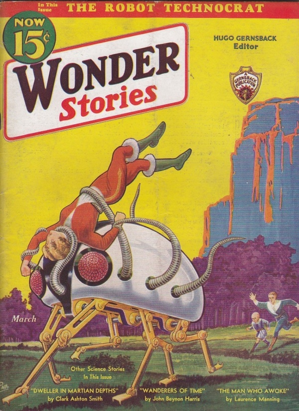

**DRAFT:** *Please do not share without permission of the author. Typeset versions in  [web](http://gernsback.wythoff.net/193302_machine_and_the_depression.html) \| [pdf](https://github.com/gwijthoff/perversity_of_things/blob/gh-pages/typeset_drafts/193302_machine_and_the_depression.pdf?raw=true) \| [doc](https://github.com/gwijthoff/perversity_of_things/blob/gh-pages/typeset_drafts/193302_machine_and_the_depression.docx)*

* * * * * * * * 

# The Purpose of Technocracy Review

**I**N presenting this, the first issue of TECHNOCRACY REVIEW, for your consideration, a few words as to the purpose and the aspirations of this magazine are in order.

Since Technocracy has taken the country by storm, so many opinions and so many ideas on the subject have sprung up, that it was felt that an unbiased national organ, to disseminate the viewpoints of all factions on this intensely important movement should be presented in an authoritative publication.

Let me say right at the start, that TECHNOCRACY REVIEW voices no opinion of its own.  It is a forum not only for the extreme conservatives, but also for the extreme revolutionists on this highly debatable subject.

TECHNOCRACY REVIEW feels that the subject is so new and so highly controversial that it must leave a decision to the reader himself as to which party or parties are right.  Only by presenting both sides of the question or, for that matter, all sides can we hope to make this world a better place to live in.

It is too soon to tell whether Technocracy will show us the way out of our present-day troubles and whether the movement will survive indefinitely.  Personally, we believe that the subject is an important one---perhaps the most important one of the present day---and for that reason, it should have every chance to be heard.

The movement has already become so big, and the questions which it brings up are so tremendous and so far-reaching, that it will be difficult to foresee what the outcome will be.

Technocracy, in any event, will not have smooth sailing.  It will be loved, it will be attacked, it will be condemned everywhere.

And that is the reason why TECHNOCRACY REVIEW will not take sides with any faction, be it the spokesmen for Technocracy itself, be it the capitalists, the socialists or communists.

All of these factions, and many others besides, are tremendously interested in the new movement.  Each may have its say in TECHNOCRACY REVIEW.  All sides will be presented.  The magazine itself will print as many diversified articles as it is possible to do in a single issue, giving as many viewpoints as humanly possible.

Readers' opinions, whether *pro* or *anti,* will be published with the same idea in mind; *i.e.,* all may have their say and the best letters will be published in future issues.

As to the publishers themselves, they feel they are particularly well fitted to publish a magazine of this sort.  They have published technical and semi-technical magazines for the past twenty-five years, and are, therefore, well versed in technology, as well as publishing.

Their editorial staff is sufficiently diversified to include not only technicians but economists as well, to present fairly both sides of the question.

This being the first issue of the magazine, we naturally would like to have a few words from you, the readers, also on your attitude toward TECHNOCRACY REVIEW.

# The Machine and the Depression

FOR the first time in the history of the world, it has been certified by official, charitable and other organizations, through their investigations, millions of people find themselves actually starving in the midst of plenty.[^1]  A recent German book---*"Amerika---Untergang am Ueberflus,"* (America---Perishing Amid Plenty) by A. E. Johann, is highly illuminating on this particular point.

Many well-informed people immediately jump to the conclusion that it is the machine, pure and simple, which causes the depression by producing too much of everything; which in turn debases the prices, consequently reducing profits and earnings, and throwing many people out of employment.

It is perfectly true that the machine has speeded up output a good deal, which is as it should be; but to say that the machine is the sole cause or even the major cause of depressions is foolish.  Moreover, it can easily be proved that this assertion is not true.  It is only necessary, for example, to point to China, where periodically people ar starving; and where literally millions are always living on a few pounds of rice, with no other foods, for entire weeks.  Yet China is not yet industrialized, and is not overrun with machines.

The same logic can be applied to other countries which have not been industrialized, but where people are also starving, and where there is also a tremendous amount of unemployment.  Evidently, then, the idea that the machine is the sole cause of depression must be wrong.  But most people who so glibly denounce the machine have never gone to the trouble to get statistics of how many people the machine employs.

In his book, "Jobs, Machines and Capitalism," Prof. Arthur Dahlberg points out that only one of ten employed people is concerned with work directly on or with machines.  The rest of labor has no direct contact with the machine itself, but only *takes care of the output of the machine.*  In other words, they may be shipping clerks, salesmen, clerks of the so-called "white-collar" labor class; or they may be in the professions---doctors, lawyers and the like.  But remember, that even during 1929, when there was very little unemployment, there were employed only ten million workmen who came in direct contact with the machine itself or who had anything to do with the so-called industrial machinery.

\begin{center}
\fbox{
  \parbox[c]{7cm}{
  
For the first time in the world's history, PEOPLE ARE STARVING IN THE MIDST OF PLENTY.
\vspace{3mm}
The author of this highly illuminating article has spent a number of months in trying to get at the direct causes of the depression.  All of the conclusions reached in this article are not his own; he has quoted from authoriative sources wherever it was found desirable to do so.
\vspace{3mm}
In the main, this article tends to prove conclusively that the usual idea, that the depression is caused by the machine, is pure bunk.
\vspace{3mm}
Only one out of ten people have directly to do with machines or products by the machine.  The rest of the adult population are business men, professionals, salesmen, common labor, and the like.  Out of the fourteen million unemployed, there are, therefore, only about three millions, so far as an estimate can be made, directly connected with the so-called machine.
  }
}
\end{center}

There were, on the other hand, forty millions of men and women employed outside of machine operations.  Form this, it will be seen that the idea of the machine's displacing millions and millions of people is erroneous.

Incidentally, this claim leaves out of the argument entirely that the machine itself creates employment which would otherwise never be there.  Take such a recent addition as the radio industry, for instance, which was created out of "blue sky."  It was not existent before 1920 because there was no broadcasting.  Immediately (that is during the years from 1921 until the present) it gave employment to literally millions of workers for whom there would not have been employment otherwise.  The same statement is true of electricity in general; and it is true even more so of such a tremendous invention of our machine age, the automobile.

I have stated all this before, editorially and otherwise.  This time I will not repeat my own observations, but quote from a recent issue of *Fortune Magazine,* as follows:

"As to the statistics, it appeared, if the figures given by the U.S. Bureau of Foreign and Domestic Commerce in 1928 were valid, the demand for automobiles, radios, telephones, moving pictures, etc., had so increased during the same period that 1,280,000,000 men had found employment since 1920 as chauffeurs and the like, 100,000 had been taken in in the servicing of electric refrigerators, oil burners, etc., 185,000 had been hired as teachers, and 100,000 had become life-insurance agents.  There was also between 1920 and 1928 an increase in the school population of 3,500,000.  But part of this was due to the rise in population.  The actual increase in percentage of the school-age population attending schools was 2.7 per cent.  Other surveys found an enormous increase (407,000) in the medical and allied professions, and in hotels, restaurants, moving pictures, and banking, with the result that 1,907,000 new positions 

* * * * * * * * * * *

[^1]: This inaugural issue of *Technocracy Review* contained essays by

Probably use one of the following editorials instead, using only the opening editorial announcement of Technocracy Review as a footnote.  In the later editorial, sees technocracy as a form of SF, imagining nothing new really.

WS March 1933: Wonders of Technocracy
WS July 1931: Wonders of the Machine Age 
both in original page images

Ashley on Schachner: "Schachner generally supported technocracy in his stories, because it favored a scientific solution to problems, but he also recognized that there needed to be a balancing of all skills.  There was no simple answer to the nation's problems, but rebelling against science rather than utilizing its knowledge was not the answer." @ashley_gernsback_2004, 210.

Scientifiction that treats technocracy with a great degree of skepticism.  Out of the total ruins of American society in the year 1954 comes Hugh Corbin, leader of a movement called the Reconstructionists, who seek to "rebuild the machines that the masses destroyed in their blind rage against overproduction."  A Russian scientist named Anton Kalmikoff creates a massive computer that "can predict the future from a series of political, scientific, and socio-economic factors" (Ashley).  Predicts current state of social collapse if continued, if Hitler's reign continues, and "Corbin's" new vision, which is the only viable one.  In the story, the government battles with scientists for control.

Technocracy Review only ran for two (or three?) issues.  According to Moskowitz, "made uncomfortable by the company he was keeping", Seekers of Tomorrow p. 357.  Lasser became more involved in fighting unemployment and became a member of the Socialist Party in 1933.  According to Lasster, HG called him into his office and said, "If you like working with the unemployed so much, I suggest you go and join them."  Fired from his role w/ Wonder Stories.  HG needed capital to launch Sexology, which became a hit w/ its first issue in _______.  Lasser's salary freed up space, and Gernsback hired a sixteen-year-old fan Charles D. Hornig who could work at 20/week rather than Lasser's 70/week.  So, fuck your political movement, I have a new idea for some escapism amid the depression that can make me more money.  Took place in the summer of 1933.