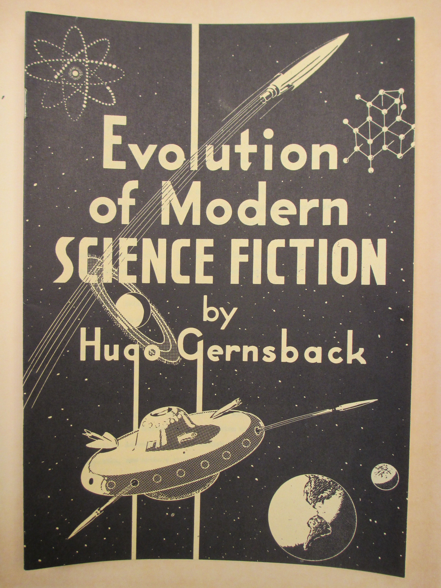

**DRAFT:** *Please do not share without permission of the author. Typeset versions in  [web](http://gernsback.wythoff.net/195200_evolution_of_modern_sf.html) \| [pdf](https://github.com/gwijthoff/perversity_of_things/blob/gh-pages/typeset_drafts/195200_evolution_of_modern_sf.docx) \| [doc](https://github.com/gwijthoff/perversity_of_things/blob/gh-pages/typeset_drafts/195200_evolution_of_modern_sf.docx)*

* * * * * * * * 

The writer has frequently been called the "Father of Science Fiction" (TIME magazine, January 3, 1942; NEW YORKER magazine, February 13, 1943; and many others).  Usually authors not quite familiar with the writer's early work set the date of the start of modern science fiction in the year 1926, which date coincides with the first science fiction magazine, "Amazing Stories," the first issue of which was launched by the writer in April, 1926.

We would like to correct this view tor historical purposes.  Modern science fiction, like so many other endeavors, had an orderly evolution,  as the preaent paper will clearly demonatrate.
The date whioh the writer would  like to fix the year [is] 1911,not 1926.  1911 was the year in which the writer's novel, RALPH 124C 41+, ran serially in "Modern Electrics," which, at the time, had a circulation of around 100,000 copies.  The novel caused so much comment and brought so much mail from readers that, at the end of the serial in 1912, it was found necessary to continue science fiction in some manner.  We thereupon endeavored to secure authors who could continue science fiction in "Modern Electrics."

Jacques Morgan was one of the first authors, and he wrote a long series of humorous science fiction under the title, "The Scientific Adventures of Mr. Fosdick."  Later, in other Gernsback magazines, new authors such as George Frederic Stratton, Charles S. Wolfe, C.M. Adams, Clement Fezandié, Ernest K. Chapin, Herbert L. Moulton, and many others came into the fold.  In 1923, we persuaded H.G. Wells to run a few of his less well-known science fiction stories in the writer's magazine, "Science and Invention."

1923 also marked the debut of veteran author Ray Cummings, who has left his impress upon modern science fiction.  From then on, there were many other well-known authors who continued writing for our magazines, including Professor Doctor Donald Menzel, now of the Harvard University Observatory.  We also secured the veteran science fiction author Abraham Merritt's "The Metal Emperor," which ran serially in "Science and Invention."  During the radio boom, in the writer's former magazine, "Radio News," we secured a number of science fiction humorous stories by that outstanding humorist, Ellis Parker Butler.  Other science fiction stories in "Radio News" were by the outstanding science fiction author, Robert Francis Smith.

We also made a reprint of Victor MacClure's famous science fiction story, "The Ark of the Covenant."  This ran serially in "Practical Electrics" and "The Experimenter," both Gernsback magazines.  For the record, the total circulation of the magazines listed in this paper ran considerably better than 1,000,000 copies---"Radio News" alone, in the height of the 1920-23 radio boom, ran over 400,000 copies a month.

Little wonder, therefore, that modern science fiction got an excellent start, and the avidity with which the readers of the time absorbed science fiction was remarkable, as testified by the thousands of letters which poured into our publication offices month after month.  Thie birth of the first science fiction magazine, "Amazing Stories," published by the writer in 1926, therefore was an orderly evolutionary process of modern science fiction.

As newer science fiction readers cannot very well be acquainted with the facts cited above, it was thought apropos to compile a complete list of early science fiction stories sa they appeared in the Gernsback magazines.  The list which follows was compiled by Mr. Theodore Engel, of New York.  It took him several months to go through all the old bound volumes in order to complete his work, and our grateful thanks are due to him for his labors.

The writer sincerely trusts that this compilation of early modern science fiction stories will be useful to serious researchers in the future.  Photostats of the stories may be secured by researchers any time by contacting the writer or his office.

New York, N.Y.

25 West Broadway

August, 1952

* * * * * * * * * * * * 

Science Fiction in *Modern Electrics*
======================================

The First three volumes, dated from April, 1908 to March, 1911, contained no fiction.

- Hugo Gernsback \| Ralph 124C 41+ \| Modern Electrics \| 4 \| 1 \| Apr-1911
- Hugo Gernsback \| Ralph 124C 41+ \| Modern Electrics \| 4 \| 2 \| May-1911
- Hugo Gernsback \| Ralph 124C 41+ \| Modern Electrics \| 4 \| 3 \| Jun-1911
- Hugo Gernsback \| Ralph 124C 41+ \| Modern Electrics \| 4 \| 4 \| Jul-1911
- Hugo Gernsback \| Ralph 124C 41+ \| Modern Electrics \| 4 \| 5 \| Aug-1911
- Hugo Gernsback \| Ralph 124C 41+ \| Modern Electrics \| 4 \| 6 \| Sep-1911
- Hugo Gernsback \| Ralph 124C 41+ \| Modern Electrics \| 4 \| 7 \| Oct-1911
- Hugo Gernsback \| Ralph 124C 41+ \| Modern Electrics \| 4 \| 8 \| Nov-1911
- Hugo Gernsback \| Ralph 124C 41+ \| Modern Electrics \| 4 \| 9 \| Dec-1911
- Hugo Gernsback \| Ralph 124C 41+ \| Modern Electrics \| 4 \| 10 \| Jan-1912
- Hugo Gernsback \| Ralph 124C 41+ \| Modern Electrics \| 4 \| 11 \| Feb-1912
- Hugo Gernsback \| Ralph 124C 41+ \| Modern Electrics \| 4 \| 12 \| Mar-1912
- Jacque Morgan \| The Scientific Adventures of Mr. Fosdick \| Modern Electrics \| 5 \| 7 \| Oct-1912
- Jacque Morgan \| The Scientific Adventures of Mr. Fosdick \| Modern Electrics \| 5 \| 8 \| Nov-1912
- Jacque Morgan \| The Scientific Adventures of Mr. Fosdick \| Modern Electrics \| 5 \| 9 \| Dec-1912
- Jacque Morgan \| The Scientific Adventures of Mr. Fosdick \| Modern Electrics \| 5 \| 10 \| Jan-1913
- Jacque Morgan \| The Scientific Adventures of Mr. Fosdick \| Modern Electrics \| 5 \| 11 \| Feb-1913
 
Science Fiction in *Electrical Experimenter*
=============================================

- Hugo Gernsback \| Baron Münchhausen's New Scientific Adventures \| Electrical Experimenter \| 3 \| 1 \| May-1915
- Hugo Gernsback \| Baron Münchhausen's New Scientific Adventures \| Electrical Experimenter \| 3 \| 2 \| Jun-1915
- Hugo Gernsback \| Baron Münchhausen's New Scientific Adventures \| Electrical Experimenter \| 3 \| 3 \| Jul-1915
- Hugo Gernsback \| Baron Münchhausen's New Scientific Adventures \| Electrical Experimenter \| 3 \| 4 \| Aug-1915
- George Frederic Stratton \| Omegon \| Electrical Experimenter \| 3 \| 5 \| Sep-1915
- Hugo Gernsback \| Baron Münchhausen's New Scientific Adventures \| Electrical Experimenter \| 3 \| 6 \| Oct-1915
- George Frederic Stratton \| The Gravitation Nullifier (Sequel to "Omegon") \| Electrical Experimenter \| 3 \| 6 \| Oct-1915
- Hugo Gernsback \| Baron Münchhausen's New Scientific Adventures \| Electrical Experimenter \| 3 \| 7 \| Nov-1915
- Hugo Gernsback \| Baron Münchhausen's New Scientific Adventures \| Electrical Experimenter \| 3 \| 8 \| Dec-1915
- Hugo Gernsback \| Baron Münchhausen's New Scientific Adventures \| Electrical Experimenter \| 3 \| 9 \| Jan-1916
- George Frederic Stratton \| The Poniatowski Ray \| Electrical Experimenter \| 3 \| 9 \| Jan-1916
- George Frederic Stratton \| The Shirikari Tentacle \| Electrical Experimenter \| 3 \| 10 \| Feb-1916
- Hugo Gernsback \| Baron Münchhausen's New Scientific Adventures \| Electrical Experimenter \| 3 \| 11 \| Mar-1916
- Hugo Gernsback \| Baron Münchhausen's New Scientific Adventures \| Electrical Experimenter \| 3 \| 12 \| Apr-1916
- Hugo Gernsback \| Baron Münchhausen's New Scientific Adventures \| Electrical Experimenter \| 4 \| 2 \| Jun-1916
- George Frederic Stratton \| Trailing Aravilla \| Electrical Experimenter \| 4 \| 3 \| Jul-1916
- Thomas W. Benson \| The Wireless "Wiz" Turns Detective \| Electrical Experimenter \| 4 \| 4 \| Aug-1916
- Hugo Gernsback \| Baron Münchhausen's New Scientific Adventures \| Electrical Experimenter \| 4 \| 7 \| Nov-1916
- Thomas W. Benson \| How the "Wireless Wiz" Turned Evangelist \| Electrical Experimenter \| 4 \| 8 \| Dec-1916
- Hugo Gernsback \| Baron Münchhausen's New Scientific Adventures \| Electrical Experimenter \| 4 \| 10 \| Feb-1917
- Thomas W. Benson \| The "Wireless Wiz" and the Card Sharks \| Electrical Experimenter \| 4 \| 12 \| Apr-1917
- C.M. Adams \| Eddy Currents \| Electrical Experimenter \| 5 \| 1 \| May-1917
- C.M. Adams \| Joe's Experiment \| Electrical Experimenter \| 5 \| 2 \| Jun-1917
- Harlan A. Eveleth \| "Ham" Jones--Scientist \| Electrical Experimenter \| 5 \| 3 \| Jul-1917
- C.M. Adams \| The Radio Bomb \| Electrical Experimenter \| 5 \| 4 \| Aug-1917
- Charles S. Wolfe \| Too Late \| Electrical Experimenter \| 5 \| 9 \| Jan-1918
- John T. Dwyer \| How Jimmy Saved the Troop Train \| Electrical Experimenter \| 5 \| 10 \| Feb-1918
- R. & G. Winthrop \| At War with the Invisible (pt. 1) \| Electrical Experimenter \| 5 \| 11 \| Mar-1918
- R. & G. Winthrop \| At War with the Invisible (pt. 2) \| Electrical Experimenter \| 5 \| 12 \| Apr-1918
- Thomas Reed \| A Tight Squeeze for Uncle George \| Electrical Experimenter \| 6 \| 1 \| May-1918
- Hugo Gernsback \| The Magnetic Storm \| Electrical Experimenter \| 6 \| 4 \| Aug-1918
- F.W. Russell \| How Jimmy Saved the Bank \| Electrical Experimenter \| 6 \| 11 \| Mar-1919
- Mabel M. Davis \| How Don Flashed the "S.O.S." \| Electrical Experimenter \| 7 \| 3 \| Jul-1919
- John White \| Plan T \| Electrical Experimenter \| 7 \| 7 \| Nov-1919
- E. H. Johnson \| The Golden Vapor \| Electrical Experimenter \| 7 \| 10 \| Feb-1920
- Charles S. Wolfe \| Whispering Ether \| Electrical Experimenter \| 7 \| 11 \| Mar-1920
- Charles S. Wolfe \| The Educated Harpoon \| Electrical Experimenter \| 7 \| 12 \| Apr-1920
- Charles S. Wolfe \| Aladdin's Lamp \| Electrical Experimenter \| 8 \| 1 \| May-1920
- Charles S. Wolfe \| The Phantom Arm \| Electrical Experimenter \| 8 \| 2 \| Jun-1920
- Charles S. Wolfe \| Alarm No. 18 \| Electrical Experimenter \| 8 \| 3 \| Jul-1920
- Clement Fezandié \| My Message to Mars \| Electrical Experimenter \| 8 \| 3 \| Jul-1920

**NOTE:** With the next issue, this magazine changed its name to "Science and Invention."
 
Science Fiction in *Science and Invention*
===========================================
 
- Chas. I. Horne, Ph.D. \| Jules Verne, The World's Greatest Prophet \| Science and Invention \| 8 \| 4 \| Aug-1920
- Ray Whitcomb \| The Ultimate Ray \| Science and Invention \| 8 \| 4 \| Aug-1920
- Charles S. Wolfe \| The Master Key \| Science and Invention \| 8 \| 4 \| Aug-1920
- Thomas W. Benson & Charles S. Wolfe \| The Whirling Eye \| Science and Invention \| 8 \| 5 \| Sep-1920
- Charles S. Wolfe \| The "Loaded" Line \| Science and Invention \| 8 \| 6 \| Oct-1920
- J. Mac-Richard \| The Electric Shoes \| Science and Invention \| 8 \| 6 \| Oct-1920
- Charles S. Wolfe \| Applied Chemistry \| Science and Invention \| 8 \| 7 \| Nov-1920
- John De Quer \| Dr. Pringle Discusses Life \| Science and Invention \| 8 \| 7 \| Nov-1920
- John De Quer \| A Prophet of Science \| Science and Invention \| 8 \| 8 \| Dec-1920
- Charles S. Wolfe \| Life or Death \| Science and Invention \| 8 \| 8 \| Dec-1920
- H.L. Johnstone \| The Elixir of Life \| Science and Invention \| 8 \| 9 \| Jan-1921
- Charles S. Wolfe \| A Radiogenes \| Science and Invention \| 8 \| 10 \| Feb-1921
- Charles S. Wolfe \| The Devil's Understudy \| Science and Invention \| 8 \| 11 \| Mar-1921
- John De Quer \| Dr. Pringle Discusses Mind \| Science and Invention \| 8 \| 11 \| Mar-1921
- Franklin Ruth \| In 1999 \| Science and Invention \| 8 \| 12 \| Apr-1921
- Charles S. Wolfe \| The Love Machine \| Science and Invention \| 8 \| 12 \| Apr-1921
- Clement Fezandié \| Doctor Hackensaw's Secrets: The Secret of Artificial Reproduction \| Science and Invention \| 9 \| 1 \| May-1921
- Herbert L. Moulton \| The Deflecting Wave \| Science and Invention \| 9 \| 2 \| Jun-1921
- Clement Fezandié \| Doctor Hackensaw's Secrets: The Secret of the Atom \| Science and Invention \| 9 \| 3 \| Jul-1921
- Harold F. Richards \| The Red Vote \| Science and Invention \| 9 \| 4 \| Aug-1921
- George R. Wells \| The Transformation of Professor Schmitz \| Science and Invention \| 9 \| 5 \| Sep-1921
- Clement Fezandié \| Doctor Hackensaw's Secrets: The Secret of Suspended Animation \| Science and Invention \| 9 \| 6 \| Oct-1921
- Charles S. Wolfe \| The Filled Tooth \| Science and Invention \| 9 \| 7 \| Nov-1921
- Charles S. Wolfe \| Without Residue \| Science and Invention \| 9 \| 8 \| Dec-1921
- Harold F. Richards, Ph.D. \| The Vibrator of Death \| Science and Invention \| 9 \| 9 \| Jan-1922
- Hugo Gernsback \| 10,000 Years Hence \| Science and Invention \| 9 \| 10 \| Feb-1922
- Ernest K. Chapin \| An Excursion Into the Past \| Science and Invention \| 9 \| 10 \| Feb-1922
- Charles S. Wolfe \| The Ninth Spool \| Science and Invention \| 9 \| 11 \| Mar-1922
- Carl S. Wallace \| The Psychic Lens \| Science and Invention \| 9 \| 11 \| Mar-1922
- Clelland J. Ball \| The Gravity King \| Science and Invention \| 9 \| 12 \| Apr-1922
- Clement Fezandié \| Doctor Hackensaw's Secrets: The Super-Nose \| Science and Invention \| 9 \| 12 \| Apr-1922
- Clement Fezandié \| Doctor Hackensaw's Secrets: The Secret of Invisibility \| Science and Invention \| 10 \| 1 \| May-1922
- Robert C. Parker \| The Radio Explorers \| Science and Invention \| 10 \| 1 \| May-1922
- Russ Simonton \| The Ray of Hercules \| Science and Invention \| 10 \| 2 \| Jun-1922
- Clement Fezandié \| Doctor Hackensaw's Secrets: The Secret of Tel-Automaton \| Science and Invention \| 10 \| 2 \| Jun-1922
- Clement Fezandié \| Doctor Hackensaw's Secrets: The Secret of Life \| Science and Invention \| 10 \| 3 \| Jul-1922
- Ernest K. Chapin \| Unlimited Destruction \| Science and Invention \| 10 \| 4 \| Aug-1922
- Burnie L. Bevill \| Restoring the Moon \| Science and Invention \| 10 \| 5 \| Sep-1922
- Clement Fezandié \| Doctor Hackensaw's Secrets: The Secret of Electrical Transmission \| Science and Invention \| 10 \| 5 \| Sep-1922
- Clement Fezandié \| Doctor Hackensaw's Secrets: The Secret of Television \| Science and Invention \| 10 \| 6 \| Oct-1922
- Nellie E. Gardner \| A Sub-Conscious Murder \| Science and Invention \| 10 \| 6 \| Oct-1922
- Clement Fezandié \| Doctor Hackensaw's Secrets: The Secret of Tel-Hypnotism \| Science and Invention \| 10 \| 7 \| Nov-1922
- Clement Fezandié \| Doctor Hackensaw's Secrets: A Journey to the Year 2025 \| Science and Invention \| 10 \| 8 \| Dec-1922
- Clement Fezandié \| Doctor Hackensaw's Secrets: The Secret of the Philosopher's Stone \| Science and Invention \| 10 \| 9 \| Jan-1923
- Clement Fezandié \| Doctor Hackensaw's Secrets: The Secret of the Artificial Gills \| Science and Invention \| 10 \| 10 \| Feb-1923
- H.G. Wells \| The New Accelerator \| Science and Invention \| 10 \| 10 \| Feb-1923
- Chas. Fred. Carter \| Navigating Interstellar Space \| Science and Invention \| 10 \| 10 \| Feb-1923
- H.G. Wells \| The Star \| Science and Invention \| 10 \| 11 \| Mar-1923
- Clement Fezandié \| Doctor Hackensaw's Secrets: The Secret of the Motorless Airplane \| Science and Invention \| 10 \| 11 \| Mar-1923
- Clement Fezandié \| Doctor Hackensaw's Secrets: The Secret of the Sixth Sense \| Science and Invention \| 10 \| 12 \| Apr-1923
- George Allan England \| The Thing From---Outside \| Science and Invention \| 10 \| 12 \| Apr-1923
- Felix Leo Goeckeritz \| Hunting Criminals in 2000 A.D. \| Science and Invention \| 11 \| 1 \| May-1923
- Clement Fezandié \| Doctor Hackensaw's Secrets: The Secret of the Earthquake \| Science and Invention \| 11 \| 1 \| May-1923
- Clement Fezandié \| Doctor Hackensaw's Secrets: The Secret of the Walking Automobile (Radiobile) \| Science and Invention \| 11 \| 2 \| Jun-1923
- Burnie L. Bevill \| The Great Food Panic \| Science and Invention \| 11 \| 2 \| Jun-1923
- Ray Cummings \| Around the Universe (pt 1) \| Science and Invention \| 11 \| 3 \| Jul-1923
- Clement Fezandié \| Doctor Hackensaw's Secrets: The Secret of the Talking Ape \| Science and Invention \| 11 \| 3 \| Jul-1923
- Clement Fezandié \| Doctor Hackensaw's Secrets: The Secret of the Super-Telescope \| Science and Invention \| 11 \| 4 \| Aug-1923
- Ray Cummings \| Around the Universe (pt 2) \| Science and Invention \| 11 \| 4 \| Aug-1923
- G. Peyton Wertenbaker \| The Man From the Atom \| Science and Invention \| 11 \| 4 \| Aug-1923
- Jack G. Huekels \| Advanced Chemistry \| Science and Invention \| 11 \| 4 \| Aug-1923
- Hugo Gernsback \| The Electric Duel \| Science and Invention \| 11 \| 4 \| Aug-1923
- Teddy J. Holman \| Vanishing Movies \| Science and Invention \| 11 \| 4 \| Aug-1923
- Ray Cummings \| Around the Universe (pt 3) \| Science and Invention \| 11 \| 5 \| Sep-1923
- Clement Fezandié \| Doctor Hackensaw's Secrets: A Car for the Moon \| Science and Invention \| 11 \| 5 \| Sep-1923
- Clement Fezandié \| Doctor Hackensaw's Secrets: Doctor Hackensaw's Trip to the Moon \| Science and Invention \| 11 \| 6 \| Oct-1923
- Ray Cummings \| Around the Universe (pt 4) \| Science and Invention \| 11 \| 6 \| Oct-1923
- Ray Cummings \| Around the Universe (pt 5) \| Science and Invention \| 11 \| 7 \| Nov-1923
- Clement Fezandié \| Doctor Hackensaw's Secrets: What Doctor Hackensaw Found on the Moon \| Science and Invention \| 11 \| 7 \| Nov-1923
- Clement Fezandié \| Doctor Hackensaw's Secrets:  The Secret of the Memory Obliterator \| Science and Invention \| 11 \| 8 \| Dec-1923
- Ray Cummings \| Around the Universe (pt 6) \| Science and Invention \| 11 \| 8 \| Dec-1923
- Ray Cummings \| The Man on the Meteor (pt 1) \| Science and Invention \| 11 \| 9 \| Jan-1924
- Clement Fezandié \| Doctor Hackensaw's Secrets: The Secret of the Submarine City \| Science and Invention \| 11 \| 9 \| Jan-1924
- Clement Fezandié \| The Secret of Perpetual Youth \| Science and Invention \| 11 \| 10 \| Feb-1924
- Ray Cummings \| The Man on the Meteor (pt 2) \| Science and Invention \| 11 \| 10 \| Feb-1924
- Ray Cummings \| The Man on the Meteor (pt 3) \| Science and Invention \| 11 \| 11 \| Mar-1924
- Clement Fezandié \| Doctor Hackensaw's Secrets: The Secret of the Mermaid \| Science and Invention \| 11 \| 11 \| Mar-1924
- Clement Fezandié \| Doctor Hackensaw's Secrets: The Secret of Size \| Science and Invention \| 11 \| 12 \| Apr-1924
- Ray Cummings \| The Man on the Meteor (pt 5) \| Science and Invention \| 11 \| 12 \| Apr-1924
- Ray Cummings \| The Man on the Meteor (pt 5) \| Science and Invention \| 12 \| 1 \| May-1924
- Charles C. Winn \| The Infinite Vision \| Science and Invention \| 12 \| 1 \| May-1924
- Clement Fezandié \| DHS: Around the World in 80 Hours \| Science and Invention \| 12 \| 2 \| Jun-1924
- Ray Cummings \| The Man on the Meteor (pt 6) \| Science and Invention \| 12 \| 2 \| Jun-1924
- Ray Cummings \| The Man on the Meteor (pt 7) \| Science and Invention \| 12 \| 3 \| Jul-1924
- Clement Fezandié \| DHS: The Secret of the Flying Horse \| Science and Invention \| 12 \| 3 \| Jul-1924
- Clement Fezandié \| DHS: The Secret of the Dream Machine \| Science and Invention \| 12 \| 4 \| Aug-1924
- Ray Cummings \| The Man on the Meteor (pt 8) \| Science and Invention \| 12 \| 4 \| Aug-1924
- Hugo Gernsback \| Evolution on Mars \| Science and Invention \| 12 \| 4 \| Aug-1924
- Ray Cummings \| The Man on the Meteor (pt 9) \| Science and Invention \| 12 \| 5 \| Sep-1924
- Clement Fezandié \| DHS: The Secret of the Gravitation Screen \| Science and Invention \| 12 \| 5 \| Sep-1924
- Clement Fezandié \| DHS: The Secret of the Microscopic World \| Science and Invention \| 12 \| 6 \| Oct-1924
- J. Martin Leahy \| The Living Death (pt 1) \| Science and Invention \| 12 \| 6 \| Oct-1924
- J. Martin Leahy \| The Living Death (pt 2) \| Science and Invention \| 12 \| 7 \| Nov-1924
- Clement Fezandié \| DHS: The Secret of Perpetual Motion \| Science and Invention \| 12 \| 7 \| Nov-1924
- Clement Fezandié \| DHS: The Secret of the Extinct Microbe \| Science and Invention \| 12 \| 8 \| Dec-1924
- J. Martin Leahy \| The Living Death (pt 3) \| Science and Invention \| 12 \| 8 \| Dec-1924
- J. Martin Leahy \| The Living Death (pt 4) \| Science and Invention \| 12 \| 9 \| Jan-1925
- Clement Fezandié \| DHS: A Journey to the Year 3000 \| Science and Invention \| 12 \| 9 \| Jan-1925
- Clement Fezandié \| DHS: The Mystery of the Z-Ray Spectacles \| Science and Invention \| 12 \| 10 \| Feb-1925
- J. Martin Leahy \| The Living Death (pt 5) \| Science and Invention \| 12 \| 10 \| Feb-1925
- J. Martin Leahy \| The Living Death (pt 6) \| Science and Invention \| 12 \| 11 \| Mar-1925
- Clement Fezandié \| DHS: The Mystery of the Walking Skeleton \| Science and Invention \| 12 \| 11 \| Mar-1925
- Clement Fezandié \| DHS: The Mystery of the Radio Cipher Machine \| Science and Invention \| 12 \| 12 \| Apr-1925
- J. Martin Leahy \| The Living Death (pt 7) \| Science and Invention \| 12 \| 12 \| Apr-1925
- Clement Fezandié \| DHS: The Mystery of Atomic Energy \| Science and Invention \| 13 \| 1 \| May-1925
- J. Martin Leahy \| The Living Death (pt 8) \| Science and Invention \| 13 \| 1 \| May-1925
- J Martin Leahy \| The Living Death (pt 9) \| Science and Invention \| 13 \| 2 \| Jun-1925
- Clement Fezandié \| DHS: A Journey to the Center of the Earth 1 \| Science and Invention \| 13 \| 2 \| Jun-1925
- Clement Fezandié \| DHS: A Journey to the Center of the Earth 2 \| Science and Invention \| 13 \| 3 \| Jul-1925
- Ray Cummings \| Tarrano the Conquerer 1 \| Science and Invention \| 13 \| 3 \| Jul-1925
- Ray Cummings \| Tarrano the Conquerer 2 \| Science and Invention \| 13 \| 4 \| Aug-1925
- Clement Fezandié \| DHS: A Journey to the Center of the Earth 3 \| Science and Invention \| 13 \| 4 \| Aug-1925
- Clement Fezandié \| DHS: A Journey to the Center of the Earth 4 \| Science and Invention \| 13 \| 5 \| Sep-1925
- Ray Cummings \| Tarrano the Conquerer 3 \| Science and Invention \| 13 \| 5 \| Sep-1925
- Ray Cummings \| Tarrano the Conquerer 4 \| Science and Invention \| 13 \| 6 \| Oct-1925
- Ray Cummings \| Tarrano the Conquerer 5 \| Science and Invention \| 13 \| 7 \| Nov-1925
- Ray Cummings \| Tarrano the Conquerer 6 \| Science and Invention \| 13 \| 8 \| Dec-1925
- Ray Cummings \| Tarrano the Conquerer 7 \| Science and Invention \| 13 \| 9 \| Jan-1926
- Ray Cummings \| Tarrano the Conquerer 8 \| Science and Invention \| 13 \| 10 \| Feb-1926
- Ray Cummings \| Tarrano the Conquerer 9 \| Science and Invention \| 13 \| 11 \| Mar-1926
- Ray Cummings \| Tarrano the Conquerer 10 \| Science and Invention \| 13 \| 12 \| Apr-1926
- Ray Cummings \| Tarrano the Conquerer 11 \| Science and Invention \| 14 \| 1 \| May-1926
- Ray Cummings \| Tarrano the Conquerer 12 \| Science and Invention \| 14 \| 2 \| Jun-1926
- Ray Cummings \| Tarrano the Conquerer 13 \| Science and Invention \| 14 \| 3 \| Jul-1926
- Ray Cummings \| Tarrano the Conquerer 14 \| Science and Invention \| 14 \| 4 \| Aug-1926
- Donald Menzel \| The World's Greatest Cataclysm \| Science and Invention \| 14 \| 5 \| Sep-1926
- Ray Cummings \| Into the Fourth Dimension 1 \| Science and Invention \| 14 \| 5 \| Sep-1926
- Ray Cummings \| Into the Fourth Dimension 2 \| Science and Invention \| 14 \| 6 \| Oct-1926
- Ray Cummings \| Into the Fourth Dimension 3 \| Science and Invention \| 14 \| 7 \| Nov-1926
- Ray Cummings \| Into the Fourth Dimension 4 \| Science and Invention \| 14 \| 8 \| Dec-1926
- Ray Cummings \| Into the Fourth Dimension 5 \| Science and Invention \| 14 \| 9 \| Jan-1927
- Ray Cummings \| Into the Fourth Dimension 6 \| Science and Invention \| 14 \| 10 \| Feb-1927
- Ray Cummings \| Into the Fourth Dimension 7 \| Science and Invention \| 14 \| 11 \| Mar-1927
- Ray Cummings \| Into the Fourth Dimension 8 \| Science and Invention \| 14 \| 12 \| Apr-1927
- Ray Cummings \| Into the Fourth Dimension 9 \| Science and Invention \| 15 \| 1 \| May-1927
- Donald P. Beard \| The Canal-Geometers of Mars \| Science and Invention \| 15 \| 1 \| May-1927
- Charles Magee Adams \| The Dynamo Terror \| Science and Invention \| 15 \| 2 \| Jun-1927
- Ray Cummings \| Tales from the Scientific Club 1: A Bar of Poisoned Licorice \| Science and Invention \| 15 \| 3 \| Jul-1927
- Ray Cummings \| Tales from the Scientific Club 1: A Bar of Poisoned Licorice \| Science and Invention \| 15 \| 4 \| Aug-1927
- Karyl Kanet \| The Radio Séance \| Science and Invention \| 15 \| 5 \| Sep-1927
- Abraham Merritt \| The Metal Emperor 1 \| Science and Invention \| 15 \| 6 \| Oct-1927
- Abraham Merritt \| The Metal Emperor 2 \| Science and Invention \| 15 \| 7 \| Nov-1927
- Abraham Merritt \| The Metal Emperor 3 \| Science and Invention \| 15 \| 8 \| Dec-1927
- Abraham Merritt \| The Metal Emperor 4 \| Science and Invention \| 15 \| 9 \| Jan-1928
- Abraham Merritt \| The Metal Emperor 5 \| Science and Invention \| 15 \| 10 \| Feb-1928
- Abraham Merritt \| The Metal Emperor 6 \| Science and Invention \| 15 \| 11 \| Mar-1928
- Abraham Merritt \| The Metal Emperor 7 \| Science and Invention \| 15 \| 12 \| Apr-1928
- Abraham Merritt \| The Metal Emperor 8 \| Science and Invention \| 16 \| 1 \| May-1928
- Abraham Merritt \| The Metal Emperor 9 \| Science and Invention \| 16 \| 2 \| Jun-1928
- Abraham Merritt \| The Metal Emperor 10 \| Science and Invention \| 16 \| 3 \| Jul-1928
- Abraham Merritt \| The Metal Emperor 11 \| Science and Invention \| 16 \| 4 \| Aug-1928

Science Fiction in *Radio News*
================================
 
**NOTE:** *Radio Amateur News* for Volume 1 only

- Julian K. Henney \| The Third Pill \| Radio News \| 1 \| 5 \| Nov-1919
- Julian K. Henney \| A Case of Nerves \| Radio News \| 1 \| 7 \| Jan-1920
- Robert W. Allen \| When the Lights Grew Dim \| Radio News \| 1 \| 9 \| Mar-1920
- Thomas W. Benson & Charles S. Wolfe \| The "President's Special" \| Radio News \| 2 \| 1 \| Jul-1920
- Thomas W. Benson & Charles S. Wolfe \| The Simplest Hook-Up \| Radio News \| 2 \| 2 \| Aug-1920
- Robert W. Allen \| Mystic Waves \| Radio News \| 2 \| 3 \| Sep-1920
- Erald A. Schive \| The Radio Man's Code \| Radio News \| 2 \| 4 \| Oct-1920
- Erald A. Schive \| The Man Who Stands By \| Radio News \| 2 \| 5 \| Nov-1920
- Erald A. Schive \| The Spirit of Christmas \| Radio News \| 2 \| 6 \| Dec-1920
- Herbert Warren Dodge \| Raided by Radio \| Radio News \| 2 \| 6 \| Dec-1920
- Volney G. Mathison \| A Phony Phone \| Radio News \| 2 \| 7 \| Jan-1921
- Herbert L. Moulton \| The Mystery of the Dampt-Undampt Messages \| Radio News \| 2 \| 7 \| Jan-1921
- R.A. Chath \| The Phantom Call \| Radio News \| 2 \| 8 \| Feb-1921
- Charles Osborne Parks \| The Phantom and the Circuit \| Radio News \| 2 \| 9 \| Mar-1921
- Erald A. Schive \| Martian Madness \| Radio News \| 2 \| 9 \| Mar-1921
- Harry Welton \| Found by Radio \| Radio News \| 2 \| 10 \| Apr-1921
- G. Ridleak, V.T. per Fred A. Burgess \| News From My Station \| Radio News \| 2 \| 10 \| Apr-1921
- G. Ridleak, V.T. per Fred A. Burgess \| Some Practical Radiophone Experiments \| Radio News \| 2 \| 11 \| May-1921
- Sparks \| The Death Dash \| Radio News \| 2 \| 11 \| May-1921
- Bernard S. Greensfelder \| The Thirteenth Tap \| Radio News \| 2 \| 12 \| Jun-1921
- Erald A. Schive \| Married Via Radio \| Radio News \| 2 \| 12 \| Jun-1921
- W. Andrews \| The Mystery of the "V.T." \| Radio News \| 3 \| 1 \| Jul-1921
- George L. Sharp \| The Acid Test \| Radio News \| 3 \| 1 \| Jul-1921
- Harold Van Riker \| When Romance Meets Up With Science \| Radio News \| 3 \| 2 \| Aug-1921
- Charles A. Reberger \| A Derelict of the Storm (Playlet) \| Radio News \| 3 \| 2 \| Aug-1921
- Charles S. Wolfe \| Radiomania \| Radio News \| 3 \| 3 \| Sep-1921
- Kenneth Warner \| Power by Radio \| Radio News \| 3 \| 3 \| Sep-1921
- George M. Bramann \| Ghosts by Radio \| Radio News \| 3 \| 4 \| Oct-1921
- Richard E. Morris \| High Voltage \| Radio News \| 3 \| 4 \| Oct-1921
- Elliot Marner \| Inland Castaways \| Radio News \| 3 \| 5 \| Nov-1921
- George A. Gibson \| The Wireless Third Degree \| Radio News \| 3 \| 5 \| Nov-1921
- Stanley Edgar \| So This is the Wireless! \| Radio News \| 3 \| 6 \| Dec-1921
- Clyde C. Young \| World's Record \| Radio News \| 3 \| 6 \| Dec-1921
- Erald A. Schivo \| Over the Wireless Phone \| Radio News \| 3 \| 7 \| Jan-1922
- Charles K. Fulghum \| The Fable of the Ham and the 4 KW \| Radio News \| 3 \| 7 \| Jan-1922
- Raymond F. Guy \| Mr. sparks at Sea \| Radio News \| 3 \| 8 \| Feb-1922
- R. O'Head \| Larry Doyle's Wireless \| Radio News \| 3 \| 8 \| Feb-1922
- Erald A. Schivo \| The Ordeal \| Radio News \| 3 \| 9 \| Mar-1922
- Armand C. Ross \| There's Nothing Too Good for the Man With Brains \| Radio News \| 3 \| 9 \| Mar-1922
- Bernard S. Greensfelder \| The Crystal 1 \| Radio News \| 3 \| 10 \| Apr-1922
- Bernard S. Greensfelder \| The Crystal 2 \| Radio News \| 3 \| 11 \| May-1922
- Erald A. Schivo  \| Too Much Efficiency (one-act play) \| Radio News \| 3 \| 12 \| Jun-1922
- G. Ridleak, V.T. \| My C.W. Experiments \| Radio News \| 3 \| 12 \| Jun-1922
- H.M. Sutherland \| Gunbarrel Radio \| Radio News \| 4 \| 1 \| Jul-1922
- Monroe Worthington \| A Hill Billy's Radio \| Radio News \| 4 \| 2 \| Aug-1922
- Perry Poorman \| The Detective Detector \| Radio News \| 4 \| 3 \| Sep-1922
- Ortherus Gordon \| It Happens to the Best of Us \| Radio News \| 4 \| 3 \| Sep-1922
- Erald A. Schivo \| One Way or Another (play) \| Radio News \| 4 \| 4 \| Oct-1922
- S.P. Wright \| The Newspaper Radio Editor \| Radio News \| 4 \| 4 \| Oct-1922
- George Bronson Howard, novelized from the movie serial by Robert Dillon \| The Radio King 1 \| Radio News \| 4 \| 5 \| Nov-1922
- George Bronson Howard, novelized from the movie serial by Robert Dillon \| The Radio King 2 \| Radio News \| 4 \| 6 \| Dec-1922
- Ellis Parker Butler \| Mr. Murchison's Radio Party \| Radio News \| 4 \| 7 \| Jan-1923
- L. Hectron \| My Trip in the Electron Bottle \| Radio News \| 4 \| 7 \| Jan-1923
- Ellis Parker Butler \| Mr. and Mrs. Brownlee Hold Hands \| Radio News \| 4 \| 8 \| Feb-1923
- Ellis Parker Butler \| Mr. Bimberry Hears the Banquet \| Radio News \| 4 \| 9 \| Mar-1923
- Mohammed U.S. Fips \| Borrowing an Aerial (or Two) \| Radio News \| 4 \| 9 \| Mar-1923
- Ellis Parker Butler \| Mr. Brownlee's Loud-Talker \| Radio News \| 4 \| 10 \| Apr-1923
- William A. Griffith, Jr. \| C.W. \| Radio News \| 4 \| 10 \| Apr-1923
- Ellis Parker Butler \| Mr. Bink's Radio \| Radio News \| 4 \| 11 \| May-1923
- Ellis Parker Butler \| Mr. Filbert Tunes In \| Radio News \| 4 \| 12 \| Jun-1923
- Ellis Parker Butler \| Casey's High-Voltage Cat \| Radio News \| 5 \| 1 \| Jul-1923
- Ellis Parker Butler \| Hetterby's Set \| Radio News \| 5 \| 2 \| Aug-1923
- Ellis Parker Butler \| The McNoodle Brothers' Radio Mystery \| Radio News \| 5 \| 3 \| Sep-1923
- Ellis Parker Butler \| The Celebrated Pilkey Radio Case \| Radio News \| 5 \| 4 \| Oct-1923
- Ellis Parker Butler \| The Great Radio Message from Mars \| Radio News \| 5 \| 5 \| Nov-1923
- Ellis Parker Butler \| Solander's Radio Tomb \| Radio News \| 5 \| 6 \| Dec-1923
- Allison Phelps \| The Proof \| Radio News \| 5 \| 7 \| Jan-1924
- Howard S. Pyle \| Toll of the Sea \| Radio News \| 5 \| 7 \| Jan-1924
- S.P. Wright \| The Warning \| Radio News \| 5 \| 8 \| Feb-1924
- Ellis Parker Butler \| The Sad Story of AZZ \| Radio News \| 5 \| 9 \| Mar-1924
- Ellis Parker Butler \| The Golden Rabbit \| Radio News \| 5 \| 10 \| Apr-1924
- Howard Wilmot \| What Station Do You Want \| Radio News \| 5 \| 11 \| May-1924
- Ellis Parker Butler \| Too Much Waves \| Radio News \| 5 \| 12 \| Jun-1924
- Warren Ordway \| Lucy's Radio Present \| Radio News \| 6 \| 1 \| Jul-1924
- Robert Francis Smith \| Allez, Houpla! \| Radio News \| 6 \| 2 \| Aug-1924
- Ellis Parker Butler \| Regulate or Bust! \| Radio News \| 6 \| 3 \| Sep-1924
- Robert Francis Smith \| The Wail of the Lonesome Shrine \| Radio News \| 6 \| 4 \| Oct-1924
- Robert Francis Smith \| Cent from Heaven \| Radio News \| 6 \| 5 \| Nov-1924
- Jason C. Grant \| A First Night with a First Set \| Radio News \| 6 \| 6 \| Dec-1924
- Warren Ordway \| Books in the Air \| Radio News \| 6 \| 7 \| Jan-1925
- Robert Francis Smith \| The Master Puts One Over \| Radio News \| 6 \| 8 \| Feb-1925
- Robert Francis Smith \| The Insurrecto Hook-up \| Radio News \| 6 \| 9 \| Mar-1925
- Robert Francis Smith \| The Great Bedtime Story Conspiracy \| Radio News \| 6 \| 10 \| Apr-1925
- Robert Francis Smith \| The Strong Arm Circuit \| Radio News \| 6 \| 11 \| May-1925
- Robert Francis Smith \| A Midsummer Night's Scheme \| Radio News \| 6 \| 12 \| Jun-1925
- Robert Francis Smith \| The Juice Hangs High \| Radio News \| 7 \| 1 \| Jul-1925
- Robert Francis Smith \| Drink to Me Only With Thine Ears \| Radio News \| 7 \| 2 \| Aug-1925
- Robert Francis Smith \| Ride and Seek \| Radio News \| 7 \| 3 \| Sep-1925
- Mohammed U.S. Fips \| The Poor Fish \| Radio News \| 7 \| 3 \| Sep-1925
- Marius Logan \| The Times Flies \| Radio News \| 7 \| 4 \| Oct-1925
- Robert Francis Smith \| Justice is Death \| Radio News \| 7 \| 6 \| Dec-1925
- Robert Francis Smith \| The Master Laughs it Off \| Radio News \| 7 \| 7 \| Jan-1926
- Marius Logan \| Radio Beats the Ticker \| Radio News \| 7 \| 9 \| Mar-1926
- Marius Logan \| "So's Your Old Ghost" \| Radio News \| 7 \| 10 \| Apr-1926
- Ernest M. Thompson \| The Radio Burglar \| Radio News \| 7 \| 11 \| May-1926
- Marius Logan \| "S.O.S.!" Searchin' Out Sadie \| Radio News \| 7 \| 12 \| Jun-1926
- Volney G. Mathison \| Sam Jones, Radio Tube Bootlegger \| Radio News \| 8 \| 1 \| Jul-1926
- Armstrong Perry \| Budge Puts It Through \| Radio News \| 8 \| 2 \| Aug-1926
- George A. Ludwig \| Now If You'll Take My Advice \| Radio News \| 8 \| 2 \| Aug-1926
- George B. Ludlum \| Echoing Silence 1 \| Radio News \| 8 \| 3 \| Sep-1926
- George B. Ludlum \| Echoing Silence 2 \| Radio News \| 8 \| 4 \| Oct-1926
- C. Sterling Gleason \| Came the Dawn (a scenario) \| Radio News \| 8 \| 5 \| Nov-1926
- Charles Magee Adams \| The Invisible Net \| Radio News \| 8 \| 7 \| Jan-1927
- Armstrong Perry \| The "Ham" \| Radio News \| 8 \| 8 \| Feb-1927
- Robert Francis Smith \| Horatio at the Bridge \| Radio News \| 8 \| 9 \| Mar-1927
- Robert Francis Smith \| Gentlemen Prefer Broadcasts \| Radio News \| 8 \| 10 \| Apr-1927
- Robert Francis Smith \| The Face That Vamped a Thousand Guys \| Radio News \| 8 \| 12 \| Jun-1927
- Robert Francis Smith \| He Bloops to Conquer \| Radio News \| 9 \| 1 \| Jul-1927
- Armstrong Perry \| Radio Revenge \| Radio News \| 9 \| 2 \| Aug-1927
- C. Sterling Gleason \| Silent Dynamite \| Radio News \| 9 \| 3 \| Sep-1927
- Robert Francis Smith \| Listen, My Children \| Radio News \| 9 \| 4 \| Oct-1927
- Joseph D. Mountain & C. Sterling Gleason \| The Voice of the People \| Radio News \| 9 \| 5 \| Nov-1927
- Robert Francis Smith \| Till the Clouds Roll Dry \| Radio News \| 9 \| 6 \| Dec-1927
- A.M. Jones \| Love in the Air \| Radio News \| 9 \| 7 \| Jan-1928
- Joseph D. Mountain & C. Sterling Gleason \| The Switch Engine \| Radio News \| 9 \| 8 \| Feb-1928
- C. Sterling Gleason \| Roasted by Radio \| Radio News \| 9 \| 9 \| Mar-1928
- Robert Francis Smith \| The Old Dray Mare \| Radio News \| 9 \| 10 \| Apr-1928
- C. Sterling Gleason \| In the Bright Darkness \| Radio News \| 9 \| 11 \| May-1928
- C. Sterling Gleason \| The Port of Missing Airplanes \| Radio News \| 9 \| 12 \| Jun-1928

Science Fiction in *Practical Electrics*
=========================================
 
**NOTE:** The first two volumes contained no fiction.
 
- George Frederick Stratton \| Sam Graves' Electric Mind Revealer \| Practical Electrics \| 3 \| 4 \| Feb-1924
- George Frederick Stratton \| Sam Graves' Gravity Nullifier \| Practical Electrics \| 3 \| 5 \| Mar-1924
- J. Kay London \| Premonitions \| Practical Electrics \| 3 \| 6 \| Apr-1924
- James Pevey \| The Man Who Saw Beyond \| Practical Electrics \| 3 \| 7 \| May-1924
- Charles Magee Adams \| Specs \| Practical Electrics \| 3 \| 8 \| Jun-1924
- J. Kay London \| The Rain Maker \| Practical Electrics \| 3 \| 9 \| Jul-1924
- Robert Joergensen \| When Sound Was Annihilated \| Practical Electrics \| 3 \| 10 \| Aug-1924
- Robert Rollins \| An Electrocution that Failed \| Practical Electrics \| 3 \| 11 \| Sep-1924
- H.P. Clay \| The Radio Vision \| Practical Electrics \| 3 \| 12 \| Oct-1924

Science Fiction in *The Experimenter*
======================================
 
**NOTE:** Name changed from *Practical Electrics* and continued
 
- Victor MacClure \| The Ark of the Covenant 1 \| The Experimenter \| 4 \| 1 \| Nov-1924
- Victor MacClure \| The Ark of the Covenant 2 \| The Experimenter \| 4 \| 2 \| Dec-1924
- Victor MacClure \| The Ark of the Covenant 3 \| The Experimenter \| 4 \| 3 \| Jan-1925
- Victor MacClure \| The Ark of the Covenant 4 \| The Experimenter \| 4 \| 4 \| Feb-1925
- Victor MacClure \| The Ark of the Covenant 5 \| The Experimenter \| 4 \| 5 \| Mar-1925
- Victor MacClure \| The Ark of the Covenant 6 \| The Experimenter \| 4 \| 6 \| Apr-1925
- Victor MacClure \| The Ark of the Covenant 7 \| The Experimenter \| 4 \| 7 \| May-1925
- Victor MacClure \| The Ark of the Covenant 8 \| The Experimenter \| 4 \| 8 \| Jun-1925
- Victor MacClure \| The Ark of the Covenant 9 \| The Experimenter \| 4 \| 9 \| Jul-1925
- Victor MacClure \| The Ark of the Covenant 10 \| The Experimenter \| 4 \| 10 \| Aug-1925
- Victor MacClure \| The Ark of the Covenant 11 \| The Experimenter \| 4 \| 11 \| Sep-1925
- Victor MacClure \| The Ark of the Covenant 12 \| The Experimenter \| 4 \| 12 \| Oct-1925
- Victor MacClure \| The Ark of the Covenant 13 \| The Experimenter \| 5 \| 1 \| Nov-1925
- Victor MacClure \| The Ark of the Covenant 14 \| The Experimenter \| 5 \| 2 \| Dec-1925
- Victor MacClure \| The Ark of the Covenant 15 \| The Experimenter \| 5 \| 3 \| Jan-1926