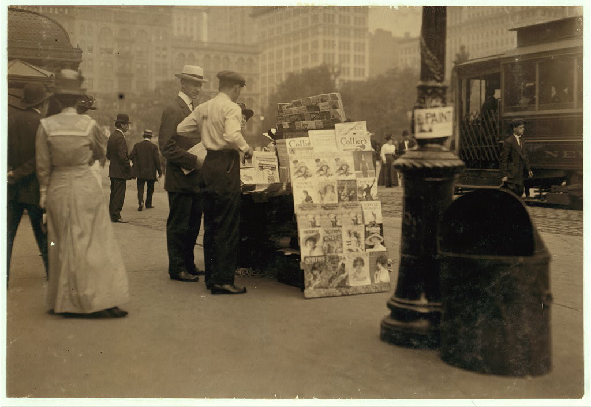

It's the summer of 1906 in downtown Manhattan and Louis Coggeshall hovers over a bucket of dimes in the back room of the Electro Importing Company's retail store, filing them down to a coarse powder.  Sitting amid shelves of electrolytic detectors, circuit switches, ammeters, and Geissler tubes ready for sale to the city's growing community of amateur experimenters, he lets the metal filings fall into a small cardboard box at his feet.  Making a coherer, one of the earliest forms of radio receiver, required a certain amount of culinary improvisation in order to find the proportion of metals that would produce the strongest signal possible.  At the time, dimes were minted on ninety percent silver, so Coggeshall’s next steps were to mix the filings with the perfect ratio of iron powder and finally to pour that mixture into a small glass vial.[^mrc]  When a radio frequency wave comes into contact with this coherer, the metal filings cling together, allowing a signal to flow between electrodes connected to either end of the vial and, depending on how long the telegraph key on the transmitting end of that radio wave is depressed, produce a *dot* or a *dash* in Morse code.  Mounting this final element onto a wooden base dotted with other handmade components, Coggeshall completes the construction of another one of the Electro Importing Company's flagship products: the Telimco wireless telegraph set, a portmanteau of the company's name and one of the first fully-assembled radio sets ever sold to the American public.^[@_telimco_2002. @gernsback_50_1956.]

[^mrc]:  Marconi's original “recipe” for the coherer called for one part silver to nineteen parts nickel (as opposed to iron).  @lee_nonlinear_2004, p. 4.  Coggeshall, who began his career as a telegraph operator for the Erie Railroad, first met Gernsback at a boardinghouse on 14th Street where they were both staying.  @moskowitz_explorers_1963, 231.  Coggeshall also did the cover art for the first issues of the *Electro Importing Company Catalog.  @gernsback_old_1938.

Meanwhile in the offices upstairs, the founder of Electro Importing Hugo Gernsback writes increasingly breathless advertising copy for the Telimco, promising it to be a means of professional success and upward mobility.  In one issue of the *Electro Importing Company Catalog*---a mail-in marketplace that provided access to "Everything for the Experimenter"---Gernsback claimed that with the Telimco, "We give you the opportunity to tick yourself up to the head of a future wireless telegraph company as did Marconi, De Forest and others."  Priced at $7.50, the set was an attractive proposition from a company who claimed to be "the largest makers of experimental Wireless Material in the world", requiring little more than a working knowledge of Morse code in order to get started.  First advertised in the November 25, 1905 issue of *Scientific American,* the Telimco appeared thereafter every two weeks, quickly becoming one of Electro Importing's best selling items.  In order to reach a wider public, Gernsback---a twenty-one year old Jewish immigrant from Luxembourg who at that point had been in the United States for only two years---visited retailers around the city like Macy’s, Gimbels, Marshall Field's, and FAO Schwartz, giving demonstrations of the device to incredulous salespeople who had no conceptual framework through which to understand “wireless.”  And for good reason: not only was wireless still in its infancy and largely unknown to the public, it was a technology whose successful transmission of information through the air wasn’t fully understood even by the scientific community.  From the physical substrate of metal filings to an entirely new means of communication that would soon be in every home, Gernsback and his colleagues were in the process of transubstantiating one medium into a medium of another kind.

This is the story of a literary genre's emergence.  But it is likely not one that the reader is familiar with.  Hugo Gernsback is remembered today as the founding editor of the first science fiction magazine, *Amazing Stories,* a large-format title printed on thick pulp paper that debuted on newsstands in early March 1926.  *Amazing Stories* gave a name to fiction treating the speculative and the otherworldly through a systematically realist lens:  scientifiction.  And it established a forum for fans of the genre to debate and influence the future of its development.  In recognition of this legacy, Gernsback's name adorns the awards given out each year to the best works in the genre, the Hugo Awards, and many scholars use the launch of *Amazing Stories* in 1926 to date the invention of modern science fiction.  This book is devoted to the idea that the project of science fiction as Gernsback understood it in fact had its origins in an earlier context:  as a series of interlinking devices, debates, and visions shared by a community of tinkerers that formed around Gernsback's electrical supply shop and technology magazines.  Largely thanks to the iconographies and standardized plots codified by *Amazing Stories,* the term *science fiction* today conjures up images of bug-eyed monsters, ray guns, and starships.  But in the opening decades of the twentieth century, before the accretion of a hundred years' worth of narratives, images, and clichés, that which was not yet called science fiction consisted of a number of concrete practices all geared toward a reckoning with technological revolutions in the fabric of everyday life.  Before it was a particular kind of story or plot, science fiction was a way of thinking about and interacting with emerging media.

What began with the *Electro Importing Catalog* and its miscellany of strange devices like the Telimco soon expanded into a number of companion magazines for the amateur tinkerer like *Modern Electrics* (first published in 1908), *Electrical Experimenter* (1913), and *Radio News* (1919).  In these richly illustrated magazines, one could find blueprints for a home-brewed television receiver (well before the technology was feasible) alongside a literary treatise on how scientifiction stories should be structured.  Giving equal space to the soberly technical and the wildly utopian meant that Gernsback's translation of an influential German handbook titled *The Practical Electrician,* for instance, could run alongside a speculative article on what it would take to provide a global system of free electricity powered by ocean currents.  Each issue showcased designs submitted by readers, their own personal "wrinkles, recipes, and formulas" that would be taken up and debated by others through letters printed in subsequent issues, much like the famous letter column in later science fiction magazines.^[For a history of science fiction fandom and what Samuel R. Delany calls "the vast tributary system of informal criticism," see @moskowitz_immortal_1974.]  Long before Gernsback founded *Amazing Stories,* these magazines and their readers used speculative thought to find a language suited to the analysis of emerging media like radio, television, or the more exotic osophone and telegraphone.  While Gernsback for better or worse has been enshrined as science fiction's founding figure (fans refer to him as "Uncle Hugo"), less well known are the ways in which he is "the father of American electronic culture," in the words of Franz Pichler, curator of a recent exhibit on Gernsback at the ZKM (Center for Art and Media Technology).[^bwbp]  In order to come to terms with the place from which both of these nascent discourses emerged, scientifiction and media culture, we have to see them as part of a continuum.

[^bwbp]:  Co-curated by Pichler and the media theorist Peter Weibel, this exhibit at the ZKM in Karlsruhe was one of two recent museum showcases of Gernsback's life and work.  The other was held at Luxembourg's National Center for Literature in 2011.  @pichler_hugo_2013.

One of the challenges in recovering an understanding of science fiction *avant la lettre* is the fact that many of the variables its stories revolve around---science, media, and technology---the very subjects and objects of scientifiction, were concepts still very much in flux.  Science as it was understood in the public sphere was a highly variable entity, and had no settled explanations for the accomplishments of new technologies like wireless telegraphy.  These technical media were only just beginning to be understood as *media* in the modern sense of mass communications, and even the term *technology* itself wasn't used in the American English vernacular until the 1920s, as we will see later.^[@guillory_genesis_2010. @marx_technology:_2010.]  The essays that follow, therefore, represent a media theory in the making, in which *media* are addressed not primarily as mass-cultural forms like cinema or television programming, but as the affordances of and possibilities inherent in the smallest individual components:  the selenium-coated plate, the tungsten lamp, the chromic plunge battery.  In his monthly editorials, feature articles, and short fiction, Gernsback pioneered a kind of writing that combined hard technical description with an openness to the fantastic.  Using interleaving descriptive and narrative frameworks to describe a particular device, experience, or vision of the future, Gernsback followed the smallest of technological developments through to their most logical, and sometimes extreme, conclusions:  the increased availability of a light-sensitive alloy implied that the coming of visual telephones was near, and the number of amateurs sending in their own designs for primitive television receivers only served to confirm the immanence of this new mode of communication.

Regardless of how advanced the devices detailed in the pages of *Modern Electrics* and *Electrical Experimenter* seemed---solar cells, automobile mounted radiotelephones, electric keyboards powered by vacuum tubes---Gernsback and his staff reported on them as if they only required a combination of already existing electrical principles and components.  These new media appeared as little more than the sum of individual building blocks that one could pick and choose from of the pages of the *Electro Importing Catalog.*  Even the long-term projections like thought wave recorders and videophones were described as handicraft futures that would come to pass with just a little more tinkering.  As Samuel R. Delany writes,

> The new American SF took on the practically incantatory task of naming nonexistent objects, then investing them with reality by a host of methods, technological and pseudotechnological explanations, embedding them in dramatic situations, or just inculcating them by pure repetition.^[@delany_critical_2009.]

These gadgets appeared so frequently and in such diverse contexts---as props in short stories, as homemade designs in letters to the editor, as profiles of similar developments across Europe---that one gets the sense paging through the magazines that they are all part of a coherent fictional world, built up across many years and many issues.  Given the pace of technological change in the early twentieth century, it seemed as if any one element of this fictional world could bleed into everyday life at any moment.

It's perhaps this penchant in his work to dwell in the extremes of both technical detail and fantastic speculation that accounts for Gernsback's absence in the pages of science fiction studies and the history of technology.  For the former, he is too obsessed with material details and as an editor and writer merely produces stylistically bland lists of technological marvels, what are dismissively referred to as "gadget stories."  For historians of technology, Gernsback's inventions and technical writings are never able to back up their promises, being far too concerned with future contingencies to merit serious attention.  But it's precisely the novel coexistence of these diametrically opposed modes throughout Gernsback's work---radically practical and radically speculative---that led to the explosive popularity of his ideas in several different forums.  Across the thirty year period covered by this book, the reader will find technical precision and utopian speculation in varying proportions, and articles that toggle from one end of this spectrum to the other with ease.

By this point the American magazine reading public was familiar with the idiom of popular science reportage.  While nineteenth-century scientific periodicals in the United States took the form of highly specialized *Proceedings* or *Transactions* or *Reports* of academic research organizations, the *fin de siécle* saw a proliferation of titles aimed at a much broader audience.  *Scientific American* for instance, the best known of these publications and one that still runs today, attracted a readership that included credentialed researchers, industrial manufacturers, an interested general public, as well as a "nebulous community of inventors (ranging from the local tinkerer to manufacturer and professional inventor/technologist)."  Science in these new magazines was made accessible to a growing number of readers seeking to educate themselves or simply desiring to remain informed about recent developments.[^psci]  But while Gernsback's magazines may seem familiar to us today through their progeny such as *Wired,* *Popular Science,* and *Popular Mechanics* (the latter two of which are the direct successors to Gernsback titles through mergers and acquisitions) in many ways they bear more in common with a deeper tradition of popular science that blurred the lines between illusion and truth, skepticism and belief.  As many historians of science have recently shown, from medieval displays of the natural world's wondrous curiosities to nineteenth-century phantasmagoria and other audiovisual spectacles, "the positive sciences and the fantastic arts [have been] linked in a dialectic of doubt and certainty."^[@tresch_prophet_2011; @daston_wonders_1998; @andriopoulos_ghostly_2013.]  Unseen forces were at work in the miracle of wireless telegraphy, a literally unbelievable technology that meant disembodied thoughts from around the world could be skimmed from the air in the comfort of your home.  If this miracle were possible, what else might be?

[^psci]:  @whalen_periodicals_1980.  For a history of the view that a scientifically educated public was an imperative for American democracy in the early twentieth century, a period during which the concept of "science" itself was being determined largely by secondary school curricula, see @jewett_science_2014, especially Chapters 4 and 7.

For Gernsback and his staff, rapid developments in the electrical arts made the speculative sciences of antigravitation and "thought waves" seem within reach.  From a belief in the presence of the luminiferous ether, to an argument that gravity is an electrical phenomenon, to the suggestion that humans may be able to tap into the so-called sixth senses of animals, or that the earth's core is made of radium and drives recurring cycles of life's evolution, Gernsback's purportedly "scientific" titles reveled in the fantastic.^[@gernsback_ether_1916; @gernsback_gravitation_1918; @gernsback_unknown_1920; @gernsback_radium_1916]  And while competing magazines like *The Wireless Age, QST,* and *Popular Science Monthly* were gradually opening up the specialist orientation of the sciences to a wider public through sober reportage, Gernsback addressed a growing readership who found the products of science to increasingly form a bewildering part of their everyday lives, addressing them from this perspective.  "As time goes on it becomes more apparent that our senses are becoming more and more involved directly due to scientific progress," he wrote.  Listing a miscellany of sensory illusions that had become commonplace, from "blazing names being written out in the night sky" by moving electric signs, to the "radio illusion" of reproduced sound, to the simulated effects of motion in new carnival rides, Gernsback warns that "We should never trust our senses too much in these latter days of scientific progress."^[@gernsback_modern_1927.]  Given the rate of this "progress," the reader should not be surprised if the next great scientific advance, seemingly impossible today, should become commonplace tomorrow.  As we will see over the course of Gernsback's writings, this almost spiritual faith in technoscientific progress remains remarkably unscathed in the wake of the First World War and the Depression, a faith that only an American technologist could claim, at a remove from the horrors of the trenches and doubling down with the idea that cultural welfare could be technocratically managed by machines and their engineers (**Human Progress; Wonders of the Machine Age**).  "Progress in science is as infinite as time, it is inconvceivable how either would stop" (**Imagination Versus Facts**).

But for Gernsback, projections of the future or progress and its wonders were never simply bewildering.  They were the occasion for a material education in the way things worked.  As a reader of and contributor to *Amazing Stories,* G. Peyton Wertenbaker, wrote in a letter to the editor, in characteristically pulp prose, "Beauty is a groping of the emotions towards realization of things which may be unknown only to the intellect" (**Fiction Versus Facts**).  The behavioral archaeologist and historian of radio Michael Schiffer refers to Gernsback and his writers as "techno-mancers," arguing that their depictions of wide-ranging futures created a "cultural imperative" for inventors, engineers, and scientists to make these dreams a reality.^[@schiffer_portable_1991, 136]  And in a sense, this is true, with many speculative ideas as described by Gernsback retrospectively seeming like "predictions" of modern technologies (**Television and the Telephot; What to Invent; Predicting Future Inventions**).  But what makes sense as a neat, two-step model for literature as a source of inspiration and invention was actually a much messier process in practice, like a melody played so fast that the notes become indistinguishable.[^sfvt]  The Gernsback titles were unique in their willingness to tackle fantastic topics that other publications wouldn't, and did so through the lens of hands-on technical know-how.  Behind the gadgets of **Ralph 124C 41+,** Gernsback's famous serial novel of 1911, was a marketplace of evocative objects, a forum for amateurs experimenting with these strange new things, and an emerging consensus vision of their possible applications.  Over the course of long-running serial novels and the exchange of reader correspondence, the material basis of scientifiction's marvelous futures was gradually refined.

[^sfvt]: This two-part model of invention forms a common thread in science fiction criticism, with the genre providing a thinktank of sorts in magazines, novels, and films, continuously replenishing a reservoir of ideas for technologists to draw upon in their own inventive process.  See for instance @disch_dreams_1998;  @shedroff_make_2012.

This book won't offer an answer to tired arguments over whether science fiction had its origins in the pulps or is best considered in relation to a deeper tradition of precursors by Mary Shelley, Edgar Allan Poe, Jules Verne, even John Wilkins's *The Discovery of a World Inside the Moone* (1638) or Thomas More's *Utopia* (1516).  Returning to the works of Hugo Gernsback is of course not meant to suggest that the cultural, sexual, and ecological complexities of novels like Samuel R. Delany's *Dhalgren* (1975), Kathy Acker's *Empire of the Senseless* (1988), or Paolo Bacigalupi's *The Windup Girl* (2009) can be directly traced to the techno-utopian texts first published in *Amazing Stories.*  As Carl Freedman writes, "current Anglo-American science fiction draws on far more than the pulp tradition that constitutes *one* of its filiations."^[@freedman_critical_2000, p. 15.]  *The Perversity of Things* instead takes seriously Delany's idea that science fiction and literature are two entirely separate cultural forms.  In order to fully understand "a tradition of writers who considered themselves craftsmen first and artists secondarily, if at all," we have to move beyond literary critical frameworks that are entirely unsuited to thinking about craft, materiality, and collective practice.^[@delany_silent_1994, p. 200.]  Gernsback's handicraft futures seemed so seductive because they were futures that you, the reader, could build yourself.  With practice and experience, the reader of these magazines could pick up any object and sense its affordances, or what Gernsback called “the perversity of things.”  In other words, objects exert an influence on thought, eliciting unique responses in skilled and novice users alike.  It was Gernsback's lifelong project to educate a public in the tenets of science and technology so that they might contribute to an iterative process of making within what the American pragmatists referred to as a community of inquiry.

The prevailing approach in science fiction studies has been to dismiss the Gernsback magazines as embarrassingly simplistic, tasteless, and even detrimental to the eventual emergence of a mature literature.  This casual judgment of a Jewish immigrant who throughout his life was in search of a respectability as a technologist and editor that always seemed to elude him is ironic.^[For a history of the relationship between Jewish identity and science fiction, see @fingeroth_disguised_2009.]  A certain tone seems to have been set early on by the spectacularly racist H.P. Lovecraft's monicker for Gernsback: "Hugo the Rat."  The overwhelming attention that science fiction critics, to this day, give to the low rates he paid his writers (a common source of tension between *all* pulp writers and their editors) is unfortunate, and their misplaced derision of Gernsback's literary quality often carries with it an explicit disgust at his perceived character.[^asmt]  One can be forgiven for wondering why so much attention is given to bankruptcy proceedings, profits, and wages in literary historical scholarship.  In the meantime, entirely overlooked has been the way that the overlapping publics attracted to Gernsback's magazines opened a space for voices that were otherwise explicitly occluded from public discourse.  As Steve Silberman has shown, "Both amateur radio and science fiction fandom offered ways of gaining social recognition outside traditional channels."^[@silberman_neurotribes:_2015.]  The populist education in new scientific and technical principles promised by these magazines offered social inroads for wage laborers hoping to secure middle class careers, women who took advantage of the anonymity of Morse code and the power to reach an audience of countless listeners from home, and those "who found it nearly impossible to communicate through speech," a neurological condition we might associate today with autism.

[^asmt]: For Brian Stableford, Gernsback's "cowardly" launch of *Amazing Stories* was "purely a commercial adventure, which Gernsback undertook because he thought his existing subscription lists might help establish a secure commercial base for such a magazine."  @stableford_creators_1997.  Malcolm J. Edwards argues that Gernsback “bestowed upon his creation provincial dogmatism and an illiteracy that bedeviled US SF for years."  @clute_gernsback_1995, p. 491.  Richard Bleiler sees him as "a disastrous (if not a pernicious) figure, a man whose stultifying vision and lack of literary taste led to the establishment of a literature that for too many years was considered a laughingstock, that emphasized other elements than literary quality, and, perhaps worse [sic] of all, that paid the majority of its writers badly."  @grossman_hugo_2011.

*The Perversity of Things* thus seeks to provide a reappraisal of the "hard" technical roots of American science fiction, the highly speculative orientation toward media technologies that was prevalent during this period, as well as the communities that participated in the emergence of new technological media.  Science fiction in its early days wasn't just a literary form, it was a mode of interacting with and understanding new media.  The literary historical gambit of this book is to recover the radical sense of openness that greeted not only the basement tinkerer working through the feasibility of transmitting images over a wire, but also the author of scientifiction stories who possessed a highly sophisticated awareness of the fact that "Two hundred years ago, stories of this kind were not possible" (**A New Sort of Magazine**).  Often, these individuals were one and the same, weaving together functional and fictional devices in a manner that served for them as a form of scientific discovery in itself.  This isn't the story of an Edison or a Jobs, inventors whose creations for better or worse have changed the way we inhabit the world.  Gernsback's career left us with a way of participating in that change, imagining its possible futures, and debating which future it is that we should live in.  This is the story of the development of a community, of a series of practices and a way of approaching the technologized world.

"up-to-date technic":  Hugo Gernsback and Media Theory in the Making
========================================================

Born Hugo Gernsbacher in 1884, the third son of German émigrés to Luxembourg, Gernsback was raised in Hollerich, a tiny suburb of the nation's capital.  His parents, Moritz and Bertha Gernsbacher (née Dürlacher), raised him in comfortable circumstances thanks to Moritz's successful wine wholesaling business.  Growing up off the grid (Hollerich wasn't yet connected to Luxembourg City's new electricity network), the young Gernsback's passion for technology began with the battery after a handyman employed by his father, Jean-Pierre Görgen, taught him at six years old how to wire a series of bells to a Leclanché cell.  Gernsback recalls being instantly enchanted by the bell "ringing amid a shower of wonderful green sparks," and would soon acquire a reputation for wiring homes and businesses in the area with telephones and these ringers.^[@oneil_amazing_1963. @gernsback_old_1938.]  According to a story he often told later in life, Gernsback received special permission from Pope Leo XIII at thirteen years old to enter the Carmelite convent of Luxembourg City to install a series of electric call bells for the nuns there.^[@siegel_hugo_1988, 16.]

Though this story is partially verifiable through a certificate of thanks from the Convent found by the Luxembourgeois Centre National de Littérature, it's worth pointing out here that the portrait of Gernsback's life we are left with in the historical record consists largely of a series of self-propagated stories that border on braggadocio:  that a police officer intruded on the Electro Importing Company offices to interrogate them for fraud with the Telimco set in 1906, for "no wireless combination could be sold at this low price"^[Reportedly, the officer shot back after the demonstration: "I still think youse guys is a bunch of fakers. This ad here says that you are selling a *wireless* machine. Well, if you do, what are all them wires for?" @gernsback_old_1938.]; that Gernsback coined the term "television" in his December 1909 editorial **Television and the Telephot** (he didn't); that his recommendations were incorporated "word for word" into the Radio Act of 1912 (while the recommendation was, the wording wasn't---see **The Alexander Wireless Bill** and **Wireless and the Amateur**).  Once the influential science fiction historian and Gernsback's friend Sam Moskowitz recorded these stories in his many profiles of Gernsback, they became established as gospel truth, with Moskowitz playing the apostle to Gernsback's prophecies.  Evidence contrary to or even in excess of the received doxa is hard to come by, with many press and literary critical accounts barely rephrasing Moskowitz's prose.^[Beginning with @moskowitz_hugo_1959.]

We do know that despite the precociousness of his youth, Gernsback was by most measures a terrible student, falling at the bottom of his class at an industrial school near home from the ages of twelve to fifteen.  When he left to attend the Technikum in Bingen, Germany (now the Fachhochschule Bingen) from seventeen to eighteen, he regularly skipped classes and received poor grades in all subjects save electricity and physics.  It was during these teenage years that Gernsback acquired a penchant for gambling with the money he earned doing various electrical jobs in poker games, though his tendency to be cleaned out by older players seemed to keep him from falling too deep into this habit.^[@henzig_hugo_2010, 15.]  Outside of school, Gernsback was drawn to American culture from an early age.  He was a fan of John Philip Sousa's military marches and even composed his own patriotic Luxembourgish piece in the style of Sousa titled *Rǒd, Wêis, Blo* that continued to be performed by the Military Band at the Place d'Armes in Luxembourg into the 1930s.^[@henzig_hugo_2010, 15-16.]  He was a devoted reader of cowboy stories and was such a fan of Mark Twain that he wrote a now-lost novel of his own at seventeen, *Der Pechvogel,* under the name Huck Gernsbacher.  But it was stories of the otherworldly that truly fired his imagination.  Reading the astronomer Percival Lowell's book *Mars* at the age of nine, with its fusion of the hard sciences and speculation about alien life, served as Gernsback's introduction to the literature he would later come to think of as a distinct genre of scientifiction.  He dove headfirst into the work of Jules Verne and H.G. Wells, claiming to have nearly memorized many of their novels while still very young.^[@moskowitz_explorers_1963, 229.]

Despite his predilection for journeys into unknown frontiers, whether the American West or Martian canals, Gernsback remained tied to his home even after leaving, if not physically -- there is no proof he ever returned -- then through a meticulous self-fashioning.  Gernsback cultivated a distinctively (one might say distinctively unique) Luxembourgish identity throughout his life.  Though raised by German parents, he grew up in Luxembourg at a moment in which the tiny country's national identity was becoming more developed than ever before.  The anti-German sentiments of Gernsback's editorials and short fiction published during World War I (especially **The Magnetic Storm**) largely echo the growing importance already sensed by "a good part of the Luxembourgish people at the end of the Nineteenth century to demarcate between the two [Germany and Luxembourg] when faced with the more or less well marked pan-Germanic designs of Germany."^[@henzig_hugo_2010, 19.]  But the many identities attributed to Gernsback throughout his life -- he is described variously in the press as Prussian, German, Belgian, French, a "multilingual dandy"^[@oneil_amazing_1963.] -- also seemed to allow him a kind of ambiguity that he relished.

> In the era of tie-dye and sandals, Gernsback continued to dress like a visiting dignitary. For evenings on the town, he favored formal wear, including spats, an opera cape and an expensive silk homburg. He even affected a monocle, though he didn't really need it.^[@stashower_dreamer_1990.]

But hiding just beneath this severe exterior, according to Sam Moskowitz, was a sharp sense of humor:  "The truth is that Gernsback socially is a man of almost rapier-like wit, with a mischievous gleam in his eyes and with the rare ability to joke about his own misfortunes."^[@moskowitz_explorers_1963, 235.]  Throughout his life, friends and colleagues noted Gernsback's relentless energy and the way that it seemed to sweep up everyone around him.  Visions completely out of step with his surroundings seemed to fall out of him wherever he went.  A distant relative recalls a 1910 visit from Gernsback on his way to Chicago to purchase new equipment for Electro Importing.  When a ringing telephone interrupted one of his many stories of "robot doctors, retirement colonies on Mars, domed cities orbiting Earth," Gernsback (who had arrived in a horse-drawn carriage) reminded his seven-year-old niece as she ran toward the receiver, "Hildegarde, fix your hair. It won't be long before the caller can see your face over the telephone wires."^[@stashower_dreamer_1990.]]]

Throughout his youth, Gernsback's parents never approved of his interest in electrics, and especially didn't see it as a viable career choice for him.  But when Moritz died in 1903 at the age of 57, Gernsback sensed that it was time to branch out on his own.  With either his share of the family's money or the savings from his electrical installation work (depending on which version of the story one finds), he booked a first class ticket to the United States, a fare that was prohibitively expensive for most.^[@gernsback_old_1938]  In February 1904, he arrived in New York by himself at the age of 19, in an elaborate three piece suit.  Perhaps inspired by his first experiences with that Leclanché cell as a boy, Gernsback carried with him the design for a new kind of dry cell battery whose electrolytic paste could replace the inefficient liquid of wet cells like that of the Leclanché.  Having been denied patents in both France and Germany for the battery, Gernsback decided to try his luck in the United States.  A year later, he began publishing on his ideas, with his first printed article appearing in *Scientific American* again under that most American of names, "Huck" (**A New Interrupter**).  He was able to sell his battery technology to the Packard Motor Car Company, who ended up using the device in their ignition systems.  With the profits of his sale, Gernsback formed the Electro Importing Company, an importer of specialized electrical equipment from Europe and one of the first mail-order radio retailers in the country.  Through their catalog and retail store at 84 West Broadway, the company provided access to specialized wireless and electrical equipment not found anywhere outside of Europe.  Electro Importing catered to a diverse clientele, first manufacturing the Telimco in 1905 for their novice users, and providing their more advanced amateur experimenters with the first vacuum tube offered for sale to the general public in 1911.

After several issues of their mail order catalog and a growing subscription list, Electro Importing began including features, editorials, and letters to the editor. Between 1906 and 1910, the catalog evolved into a monthly magazine for the wireless homebrewer, *Modern Electrics* in 1908.  The transition from the mail-order catalog to the monthly magazine format was a smooth one, evidenced by the fact that the third and fourth editions (1907 and 1908) of the Electro Importing catalog bears the title of the new full-format magazine, "Modern Electrics."  The offshoot Experimenter Publishing Company, founded in 1915, published expanded how-to manuals, pamphlets, and complete books like *The Wireless Telephone,* *One Thousand and One Formulas,* and *The Wireless Course.*  While *Modern Electrics* still advertised the equipment Electro Importing offered for sale in a familiar grid layout with ordering instructions, it also included feature articles detailing the latest research into experimental media technologies in America, throughout Europe, and in Gernsback's own company offices.  Each 36-page, 6 x 9.5" issue sold on newsstands for ten cents and contained regular reports from E.I. Co. employees like Harry Winfield Secor and René Homer, who would contribute to Gernsback titles for years to come.  Some freelancers attributed their decision to pursue science as a profession to their experiences with *Modern Electrics,* as did Donald H. Menzel, later director of the Harvard Observatory, who earned money for college by writing for the magazine.^[@oneil_amazing_1963.]  Celebrity guest contributors like Lee De Forest, and later Thomas Edison and Nikola Tesla in the pages of *Electrical Experimenter,* raised the profile of the magazine among a readership hoping to emulate the success of these famous inventors.^[Tesla first published his autobiography in serial installments in *Electrical Experimenter,* a book that was recently republished by Penguin Classics. @tesla_my_2011.]  Regular dispatches and photographs printed on the magazine's slick paper from the unnamed Paris, Berlin, and Brussels Correspondents kept readers informed on developments in television, wireless telephony, and the use of novel electrical apparatuses in film and theatrical productions, each of which would go into a great degree of technical detail.  

But the hallmark of the magazine became its more speculative articles, those that were willing to extrapolate fantastic scenarios out of the technical details at hand.  Gernsback and his contributors wrote as if the more detail a particular technology's description contained, the more plausible were the projections of its future possibilities.  There was a way in which the future stood as the horizon of technical description.  As Lewis Mumford wrote in his autobiography, "In my youth, as a zealous reader of Hugo Gernsback's *Modern Electrics,* I shared my generation's pious belief in our future."^[Quoted in @westfahl_hugo_2007, 62.]  In **Signaling to Mars,** for example, Gernsback detailed the conditions that would have to be met in order for Earth to send messages via wireless telegraph to the red planet.  The quantitative description of the transmitting apparatus in terms of its necessary output (a gargantuan 70,000 kilowatts) and best time of year to signal (summer) only constitutes one aspect of this scenario.  Gernsback goes on to take into account the nature of Martian intelligence that would be necessary for such a communicative circuit to be completed:

> we can only hope that the Martians are further advanced than we and may signal back to us, using a method new to us and possibly long discarded by them, when thousands of years ago they stopped signaling to us, and gave us up, as we did not have intelligence enough to understand.

Continuing in the tradition of astronomers Percival Lowell and William Henry Pickering---the latter of whom offered a similar proposal on the front page of *The New York Times* to communicate with Mars using a series of mirrors^[@_planned_1909]---the projection of Martian technology (not to mention ecology) provided a topos upon which readers might asses the direction of its terrestrial analogues.

For readers of *Modern Electrics*, the technical context in which this highly speculative article appeared only lent credence to an idea as fanciful as the one that contact with an alien civilization was right around the corner. In the copy of this issue at Princeton University's Firestone Library, someone inserted a newspaper clipping (now a permanently affixed leaf within the bound volume) that tells of a new distance record for wireless signaling, from San Francisco to the Pacific Mail Line steamship Korea as it made its way across the ocean. Left there as if to vouch for the plausibility of the idea that we'll soon be able to connect with our nearest planetary neighbor, the clipping provides a wonderful sense of how it was people read these magazines.[^clp]  Though the Gernsback titles eventually became notable for some of their more outlandish claims---that electric current might clean us better than water, that the success of a marriage can be predicted using gadgets assembled out of various household supplies---they were always presented through a lens of supposedly scientific rationality. This frame affected the reception of the magazines by their readers, the design ethos that grew up around them, and the kind of fiction they eventually produced.

[^clp]: While I haven't been able to determine the provenance of this particular clipping, other articles reporting on the Korea's distance signaling record were published in the *New York Times*on November 8, 1909 and the *Boston Evening Transcript*, November 6, 1909.

From the earliest of the Gernsback titles, we find science configured as an instrumentalized form of technological achievement that bore little relationship to what was happening in laboratories.  Contrary to the common division between the purely theoretical nature of the sciences and their application in the development of new technologies, Gernsback argues that science and invention are part of a continuum in a later editorial for a magazine of that title:

> The word *Science,* from the Latin *scientia,* meaning knowledge, is closely related to *Invention,* which, derived from the Latin *inventio,* means, finding out.  There is little in Science that did not at one time require some inventive powers, while conversely most of the world's inventions are based upon one or more of the sciences.  (**Science and Invention**)

This article is a key of sorts for the many valences *science* can take throughout the Gernsback magazines.  Science is the sum of its many products progressively connecting the modern world, a hybrid of science and technology that saw no distinction between theories and their application.  It is defined as what the average person understands of its growing presence in their daily life:  "science no longer is the sombre book closed with seven seals.  Quite the contrary, it is the public that popularizes science---not our scientists" (**Science and Invention**).  It is even configured as a form of belief when Gernsback argues that skepticism is an entirely unscientific attitude:

> But our *real* scientists are as backward as in Galileo's times.  The public applauds and instantly believes in anything new that is scientific, whereas the true scientist scoffs and jeers, just as he did in Galileo's times when that worthy stoutly maintained that the earth moved and did not stand still.

In many ways, this starry-eyed fanaticism for science as the sum of its progressive advance in the material world reflects the way in which the public discourse was shifting on a larger scale as science entered mass market newsstands, corporate research facilities, and public school classrooms.  As John Rudolph has argued, it was during this period that the "scientific method" emerged not among professional or academic researchers but in secondary school pedagogy:

> while the manner in which practicing scientists went about their work (the research strategies they used, their modes of inquiry, norms of argumentation, etc.) changed relatively little if at all from the 1880s to the 1920s, portrayals of the scientific method in American schools underwent a marked transformation.^[@rudolph_epistemology_2005.] 

If science was a highly variable concept for Gernsback, discourse surrounding its application was just as muddled.  *Technology* was a word largely unknown to the English speaker, which should also complicate the way we read these essays.  So, for instance, when Gernsback writes in 1922 that "steam, electricity, and up-to-date technic have completely altered not only the face of the globe, but our very lives as well," the usage of the word *technic* where we might expect something like *technology* reflects an important terminological confusion at the time (**10,000 Years Hence**).  While Google Ngram shows *technic* being used over three times more often than *technology* in 1922, this situation changes rapidly over the next decade.  In nineteenth-century English, according to Eric Schatzberg, *technology* referred to "a field of study concerned with the practical arts; except in anomalous usage, [it] did not refer to industrial processes or artifacts."  Just as sociology names the study of society, technology was the science of technique, making, the useful or practical arts.  Somewhere around 1930, Schatzberg argues, 

> new meanings derived primarily from the writings of American social scientists who imported elements of the German discourse of *Technik* into the English term technology, thus shifting the latter from its original definition as the science or study of the useful arts to a new one that embraced the industrial arts as a whole, including the material means of production.^[This masterful history of the interrelated concepts of *Technik,* technology, and technique, is highly recommended.  @schatzberg_technik_2006.]

This hybridized and highly materialist understanding of science and technology was foundational for Gernsback's later conceptualization of scientifiction.

Hoping to build on the success of *Modern Electrics,* Gernsback sold the magazine to the competing publisher of *Electrician and Mechanic* and launched a new title in May 1913: *Electrical Experimenter.*[^psmm]  Continuing the work that began with *Modern Electrics's* monthly radio set building contest and correspondence section, *Electrical Experimenter* introduced several new ways for readers to participate.  A section called "The Constructor" included tips for the home workshop, like a technique for tightly winding a spark coil using a hand-cranked drill.  The "How-To-Make-It Department" offered prizes for designs submitted by readers that specifically "accomplishing new things with old apparatus and old material," such as an alarm that activated a simple electric bell in the house when a mailbox's door was opened and closed.  The "Electrical Magazine Review" provided a roundup of news recently published in other electrical magazines like *Electrical World* and London's *The Electrician,* while the "Patent Advice" column offered input on inventions that readers hoped to patent at the price of $1 per question.  By May 1918, the magazine had reached a circulation of a hundred thousand copies per month, almost doubling *Modern Electrics's* readership seven years previously.

[^psmm]: *Modern Electrics* continued under new ownership as *Modern Electrics and Mechanics* for two years before acquiring and taking on the name of *Popular Science Monthly* in April 1915, a magazine whose publishers were looking to update the format it had run since 1872: reprints of European science periodicals with little to no illustration.  Under the editorship of Waldemar Kaempffert, the new *Popular Science* tried to increase its readership with short form writing, dense photo spreads packed onto every page, and a far more generalist approach to "science."  One would now find articles on developments in criminology, warfare, and motion pictures in a magazine that only a year earlier covered entomology, evolution, and pathology.  It continues to be published today.  For an overview of Kaempffert's editorial philosophy, see @kaempffert_vision_1916.

Paging through the print run of the *Electrical Experimenter* across the 1910s is like watching the activities of a quirky group of hobbyists grow into a mass cultural phenomenon.  Over the course of its publication, Gernsback and his staff gradually widened their focus from the highly specialized electrical arts of *Modern Electrics* to a range of topics geared more toward the general public.  As "recipes, wrinkles, and formulas" were joined by sensational depictions of future technologies, Gernsback changed the magazine's tagline from "The Electrical Magazine for the Experimenter" to "The Electrical Magazine for Everybody."  By the decade's end, the title was completely rebranded as *Science and Invention,* a change that once again nearly doubled the magazine's circulation to almost 200,000 copies per month.^[*Science and Invention* continued for another decade before being bought out and merged into the September 1931 issue of *Popular Mechanics,* another title still published today.]  The new look was accompanied by a significant change in editorial policy, beginning with the idea that the image is the most effective way to communicate complicated scientific information to the public.  

> All of our departments, as you will note, have been reduced to pictures and captions, with the exception of our scientific fiction stories which for the time being will run on as usual.  The reason is that the average man or woman does not wish to laboriously wander through miles of text of scientific facts, which means concentration and study. . . . *we have tried to reduce all scientific matter to entertainment instead of study.* (**The 'New' Science and Invention**)

Gernsback's visions were lent a shape and a color thanks to two new illustrators who were able to "illustrate difficult subjects in such a way that words really become superfluous," as Gernsback put it in the previous editorial.  Though Howard V. Brown's career as a cover artist spanned a variety of subjects and techniques -- his work appeared everywhere from from *Scientific American* to *Argosy All-Story Weekly* to the children's magazine *St. Nicholas* -- the signature of his Gernsback covers was the Rockwellesque way he was able to tell the story of an entirely speculative technology through facial expressions and dramatic gestures.^[@gustafon_brown_2015.]  Seemingly familiar domestic scenes, detailed in vividly realistic brush strokes, were punctured by the presence of a strange apparatus and became the starting point for conversations on how a technology of the future might function.  It was in no small part due to the vivid illustrations that readers were so drawn to these visions of the future.  As a character in Robert A. Heinlein's 1940 short story "Requiem" says, he was one of those fans "who thought there was more romance in an issue of the *Electrical Experimenter* than in all the books Dumas ever wrote."^[Quoted in @erisman_stratemeyer_2000.]

The shape of media to come took on an iconography all its own through the illustrations of Frank R. Paul.  Trained in Vienna, London, and Paris as an architectural draftsman, Paul is known for his exquisitely detailed cityscapes as well as the bug-eyed monsters that would later adorn the covers of *Amazing Stories.*^[@moskowitz_explorers_1963, 234.]  

* * * * * * * * 

Gernsback says that producing realistic illustrations of the future is the most difficult, and most rewarding part of the magazine, and that the idea is to fire the imagination of a reader/experimenter:  "It is no easy matter to think out new things of the future and illustrating them adequately by means of expensive washdrawings or three-color cover illustrations.  Indeed, there is nothing more difficult connected with the publication." (**Imagination Versus Facts**)

* * * * * * * * 

As the magazines in which they appeared gained a wider following, these images began to circulate far beyond their original venues.  Plans for the Osophone, a device Gernsback designed to replace headphones by transmitting sound through vibrations in the jawbone of the listener (**Hearing Through Your Teeth**), were published and reviewed in the German journal *Der Radio-Amateur.*^[@nesper_osophon_1924.  For the history of *Der Radio-Amateur* magazine, see @sarkowski_springer-verlag_1996.]  Paul's sketch of a man using a tuning fork to calibrate the speed of the 1928 *Science and Invention* Nipkow disk television receiver was republished the following year in the Chinese film journal *Yingxi zazhi* (*Shadow Play Magazine*) as an illustration of recent research into television, what was referred to in the article as, directly translated, "wireless cinema."^[@bao_sympathetic_2011. Bao located Paul's illustration of the *Science and Invention* television receiver in @shen_dianyingjie_1929. The term for television used in this article is "wuxian dianying (wireless cinema, or, more literally, wireless electric shadow, or radio shadow)." Paul's images were originally published as the accompaniment to @gernsback_radio_1928.]  Many more *Electrical Experimenter / Science and Invention* articles were translated into French, German, Italian, Spanish, Japanese, Dutch, and Arabic, circulating widely along with their illustrations.^[@_this_1919]

It's the wide currency of these images then and now (especially as they're given new life as retrofuturist visions circulating on Twitter and Tumblr) that perhaps has resulted in the description of Gernsback for better or worse as a "prophet" of the future.  Unfortunately, this approach tends to flatten out the richness of his work into a list of the impressively early dates by which he had described the coming of technologies like in vitro fertilization, the transistor radio, atomic war, education by video, and telemedicine.  Gernsback himself seemed to enjoy the continued notoriety these predictions brought him (yet another reason why, in writing about him, we have to be careful to cut through the self-image he crafted).  In a sense, their sheer number is of course impressive, as it was for Arthur C. Clarke who dedicated his *Profiles of the Future: An Inquiry Into the Limits of the Possible* "to Hugo Gernsback, who thought of everything."[^prdt]  Though many of these ideas were in the air at the time, Gernsback simply had a knack for tuning in like no other, for distilling the essence of a technosocial development from a cloud of diverse possibilities into a sleek, attractive form.

[^prdt]: Moskowitz lists the predictions in *Ralph 124C 41+* alone: "Fluorescent lighting, skywriting, automatic packaging machines, plastics, the radio directional range finder, juke boxes, liquid fertilizer, hydroponics, tape recorders, rustproof steel, loud speakers, night baseball, aquacades, microfilm, television, radio networks, vending machines dispensing hot and cold foods and liquids, flying saucers, a device for teaching while the user is asleep, solar energy for theat and power, fabrics from glass, synthetic materials such as nylon for wearing apparel, and, of course, space travel are but a few." @moskowitz_explorers_1963, 233.

But descriptions of Gernsback as a prophet miss the way in which these imminent futures felt so close to hand thanks to a collective endeavor among contributing writers, assistant editors, illustrators, and readers.  Throughout his writings, Gernsback relies on input from readers, quoting them sometimes at great length.  As his magazines began to grow in both number and circulation, Gernsback inceasingly delegated work to assistant editors like T. O’Conor Sloane, C.A. Brandt, Wilbur C. Whitehead, and Charles Hornig.  While Gernsback wrote under a number of pseudonyms for *Modern Electrics* when he still didn't have many contributors, over time this situation was apparently reversed, with "Gernsback" operating as a kind of collective editorial voice by the time of the science fiction magazines.  As Justine Larbalestier writes, 

> Gernsback did not necessarily write all or even the majority of the editorial comments during the periods in which he was the publisher and editor of such magazines as *Amazing Stories* and *Wonder Stories* [1926-1936].  However, such is the mythic force of Gernsback, the founding father, that in the majority of the work I have read on this period he is spoken of as though he wrote every word of editorial comment in the magazines he published.  ‘Gernsback’ has come to operate as synonymous with the magazines he founded, whether he was actively contributing to them or not.^[@larbalestier_battle_2002, p. 17.  Larbalestier cites @tymn_science_1985 and @clute_encyclopedia_1995.]

E.F. and Richard Bleiler report that "Charles Hornig claims to have written Gernsback's editorials while editor of *Wonder Stories,* and the same situation may have existed earlier."^[@bleiler_science-fiction:_1998, p. 147]  There is no telling how much of a hand Gernsback had in writing these later articles, from offering up his often clunky, non-native speaking prose for editorial revision, to simply suggesting the idea of a piece to one of his assistant editors.  Manuscript versions at the Hugo Gernsback Papers in Syracuse and in the possession of private collectors show that he did, in fact, author material for the technical magazines in longhand with little revision before the articles went to print.  But following Larbalestier and other science fiction critics, I think that it's important to continue "allowing 'Gernsback' to stand for the house editorial voice" not just as a convenient shorthand, but as a means of tracing the many overlapping discourses on fiction, making, and science that emerged in these magazines over their thousands upon thousands of pages.^[@larbalestier_battle_2002, p. 17.]  Whether Gernsback wrote every word of the later articles bearing his name or merely provided editorial input, we are left with the record of a new kind of conversation on technology among a growing community of participants.  Gernsback, about whom we know little outside of the self-propagated myths, is thus best understood as a representative of this moment that falls between the gaps of literary and technological history, a distillation of what was in the air at the moment.  To make Gernsback synonymous with his magazines, each of which was highly responsive to the interests and activities of its readership, is to follow the voice of the community that developed over the course of three decades.

"'phone and code": mass media / communities / users
=======================================================

"We are constantly being speeded up mentally," writes Gernsback in 1923 with the concision of a Marshall McLuhan aphorism (**Are We Intelligent?**).  Understanding media was one of the primary goals of these magazines, not just from the perspective of the expert experimenter but also of the bemused end user.  "Everything we are doing now is too cumbersome. . . . Our lives are crowded to such an extent, that it is impossible to read as much as our grandfathers could."  Sensory environments had become so packed, so distracting, that it was time to find a better medium to communicate complex information to the public.  During this period, as Susan Douglas has shown, "the press’s method of covering and interpreting technological change was developed.  In other words, what scholars have identified as the functions of the mass media in the late twentieth century were being formulated and refined during the first twenty-three years of radio’s history."^[@douglas_inventing_1987, p. xix.]  It's no mistake that Gernsback explicitly refers to the magazine itself as a "medium" capable of matching the new speeds at which people took in the world (**A New Sort of Magazine; The 'New' Science and Invention**).  His publications, his ideas, and his prose were purpose-built to move fast in a pulp environment with short deadlines and low overhead, and it was for this reason that they were uniquely suited to the analysis of rapidly shifting media conditions.  While this speed sometimes results in seeming contradictions and an all-too hasty embrace of the new, it also contributes to an inviting sense of openness for a diverse community of inquiry.  A core set of his essays take up the question of where new media come from, as well as how ordinary people could participate in the conditions of their emergence rather than feeling like they had been swept up in their wake.

Many writings in this collection will leave the reader with a sense that media "evolve" according to their own logic.  In **Is Radio at a Standstill?,** Gernsback makes a striking media historical analogy between the supposed threat that the rise of radio broadcasting posed to established phonograph manufacturers, and the impact of the “eliminator” (a lighter, more portable, and rechargeable source of power developed in the mid-1920s) to conventional battery manufacturers.  In the model that Gernsback outlines here of the historical cycles that the technology industry goes through, competing formats do not replace but rather force one another to find their own unique attributes, simply as a matter of survival.  In his media historical writings, Gernsback often speaks of the "perfection" of an apparatus, a question of medium specificity he almost always raises through the lens of viable business models.  Despite his penchant for projecting far-flung futures, Gernsback was often remarkably conservative when it came to the specifics of precisely how long such perfection would take, and what it would mean for developments in emerging media like wireless and television.  Given the small sample size of these very young histories, there was little the technologist had to go on when thinking about the stable, almost Platonic forms that might emerge from the parallax interplay of rapidly changing technologies and new cultural forms.  As he writes in **Edison and Radio**:

> The radio industry today is only five years old, and it may safely be predicted that when it becomes as old as the phonograph is today we shall hardly be able to recognize it as the same development.  It is admitted that radio is not yet perfect.  Neither is the phonograph, nor the automobile, or motion pictures, nor electric lights; nor, for that matter, a pair of shoes.

Not only was the concept of "wireless" itself---and later "television"---a moving target for its early adopters, but also for legislators who scrambled to craft regulatory frameworks for information in the air.  Gernsback's magazines avidly followed broadcast policy debates, and much of the power of their arguments against regulation derived from an understanding of media technologies as highly fluid entites that no legislation could hope to keep up with:

> Radio has always been able to take care of itself, and will continue to do so in the future.  To be sure, we all want a radio law to straighten out some of our present tangles, but in the end radio engineering will make the best law obsolete.^[@gernsback_broadcasting_1926]

In the years leading up to World War I, when Gernsback was most active in organizing communities of amateur experimenters against proposed federal broadcast regulation, the magazine's staff had to rely on significant amounts of conjecture in reporting on developments that took place largely behind closed doors between the US Department of Commerce and Labor and various private entities:  "all of this maneuvering that could have so altered American communications and culture transpired behind the scrim of corporate confidentiality, not to be made public until scholarly investigation decades later."^[@wu_master_2010, p. 80.]  Nevertheless, *Modern Electrics* was able to recommend best practices for wireless amateurs so that the community could avoid drawing the scrutiny of regulators (**The Wireless Joker**), play nicely with government stations whose aparatuses were "three years behind time" and whose manners were even worse (**The Roberts Wireless Bill**), and make technical recommendations on frequency allocation that were later incorporated into Congress's Wireless Act of 1912 (**The Alexander Wireless Bill**).  The Electro Importing Company began publishing it's annual *Blue Book* in 1909, a telephone book of sorts that listed the names and call signs of amateur wireless operators around the country, and later, the world.  Its presence was designed to encourage greater accountability for the content of wireless messages once the names of their senders were shared openly and freely (**Signaling to Mars**).  In addition, Gernsback and his associates formed **The Wireless Association of America** in 1910, an education and outreach organization that ended up training many of the wireless operators that the Navy would need once the U.S. entered the Great War in 1917, one of who even developed a means of recording clandestine German U-boat commands that were being relayed through a New Jersey wireless station, unbeknownst to the American government (**Sayville**).  With the outbreak of the war, the Navy outlawed all amateur wireless broadcasting activities and took sole control of the airwaves.  *Modern Electrics* thus became a community forum for frustrations over this policy, as well as a drawing board for what broadcast regulation should look like once the war was over.  While the positions taken up by contributors to and readers of the Gernsback magazines don't amount to a full-scale regulation policy, their arguments against hasty legislation that restricted the rights of everyday users, a series of reactions to conditions on the ground, are very much reminiscent of advocates for free and open-source software today.

So, while at certain moments Gernsback evokes the seeming perversity of emerging media that allowed them to evolve as if according to their own internal logic, at others it was clear that communities of users were driving the developments in these new cultural forms in a way that would make any existing, and likely future, legal frameworks obsolete.  In this sense, the merits of one detector over another were far less important than the new kinds of connection they made possible.  Similar to the approach Gernsback took to many other ideas, this difference in emphasis didn't necessarily happen over a certain period of time or unfold in any sort of linear fashion.  While there were of course the signature themes that he returned to throughout his career, Gernsback's media theory doesn't constitute a rigorous, internally consistent philosophical system.  Writing two, sometimes three or more articles a month meant that he was firing off ideas as they came to him, ideas that were picked up and discarded as utility demanded.  For this reason, it's not quite accurate to describe these variations as contradictions.  Instead, they reflect the thinking of a tinkerer, comfortable with fragments and capable of applying any one of multiple perspectives to a single issue.

When Gernsback's writings weren't emphasizing the material specificity of wireless as a means of understanding the shape that medium might take in the future, they were describing it as an inherently ethereal meeting place of people from around the globe.  In "the most inspiring example of the triumph of mind over matter" (**A Treatise on Wireless Telegraphy**), simple minerals like zinc and copper could be harnessed to transmit the self, live across the ocean.  "We are now on the threshold of the wireless era, and just beginning to rub our intellectual eyes, as it were" (**Wireless Association of America**).  Wireless promised constant contact between friends, family, and complete strangers regardless of location.  "The radiophone," he wrote using another short-lived name for radio before the fact, "will link moving humanity with the stationary one" (**The Future of Wireless**).^[Gernsback continues to use the term "radiophone" as late as 1923, signaling an understanding of radio as a point-to-point means of interpersonal communication even as the national broadcast networks were flickering to life.]  In other words, developing "wireless tele-mechanics" meant that even people driving in automobiles could maintain a conversation with someone sitting at home.  "In our big cities thousands of ears listen every minute of the day to what is going on in the vast ether-ocean" (**War and the Radio Amateur**).  The announcement of the annual *Blue Book* not only promised more and more citizens of the ether popping up on the map with each passing year, it appeared alongside Gernsback's feature on sending and receiving wireless signals from Mars, making it seem as if soon we will even be able to look up our Martian friends in the universal wireless directory.

As Gernsback welcomed these newly minted citizens of the ether stepping "out into the star-lit night and myriads of voices" (**Amateur Radio Restored**), one wonders throughout his writings just how inclusive this global village of amateur experimenters was in practice.  Though Gernsback himself is remarkably silent on all questions regarding race, gender, and class---perhaps in an effort to avoid alienating any potential readers---his magazines' advertisements for radio parts, books, and professional schools largely addressed a male audience.  The most vocal participants in the technology magazines' correspondence section, and thus their most immediately visible readers, were roughly 16-24 year old males, who often equated the pursuit of science with masculinity itself.  As one reader commented, pursuing radio as a hobby "stills a thirst for scientific knowledge and hence stimulates manhood" (**Who Will Save the Radio Amateur?**).  But this doesn't mean that other demographics weren't reading and using Gernsback's magazines.  Eric Drown has convincingly argued that historians of science fiction have "repressed the working-class accents of pulp SF and been content to characterize it as a form of children's literature justly and rapidly replaced by a more mature form of 'speculative fiction.'"^[@drown_business_2006, p. 28]  Drawing on Michael Denning's scholarship on the complex relationship between writers and readers of nineteenth-century dime novels in which "mostly middle-class writers ventriloquized the working-class accents of their readers to advance their views of the world," Drown reminds us that texts that have all too often been dismissed as "semi-literate" and "adolescent" in fact contain complex voicings among hourly laborers about the promise of securing middle-class occupations through the "scientific" education these magazines provided.

> . . . readers were largely but not exclusively wage-earning people who describe themselves in letter columns as students, engineers, radio operators, amateur scientists, mill hands, office workers, salesmen, lathe operators, enlisted men, and government bureaucrats. While there was a significantly visible contingent of precocious mostly middle-class boys among the letter-writers, most readers were the adults who provided the routine intellectual, clerical, mechanical and physical labor that made the new mass production economy function.  Too often these working readers of pulp science fiction are neglected, resulting in a serious distortion of its history, a misunderstanding of its wage-earning accents, and an inability to see the cultural work it once performed.^[@drown_business_2006, p. 8.]

Further, this community may have been more heterogeneous than is initally apparent on the surface of the magazines.  Steve Silberman identifies wireless amateurism as a haven for voices that may have otherwise been excluded from public discourse:

> The culture of wireless was also a strict meritocracy where no one cared about what you looked like or how gracefully you deported yourself in public.  If you knew how to set up a rig and keep it running, you were welcome to join the party. . . . [It] also enabled shy introverts to study the protocols of personal engagement from a comfortable distance. “Through amateur radio . . . I’ve learned so much about communication between people.  I’ve had the opportunity to observe and participate in the giving and getting process, which is what communication is all about,” recalled Lenore Jensen, who co-founded the Young Ladies’ Radio League in 1939 to encourage more women to join the conversation.^[@silberman_neurotribes:_2015.]

Highly scripted conversational formats and the anonymity of code allowed for a neurodiversity and gender inclusion within this community that is difficult to recover from the pages of Gernsback's magazines alone.  One has to read *Electrical Experimenter* and *Radio News* against the grain to find the presence of women.  But there are several notable examples in reports from contributors, including Maria Dolores Estrada, a Mexican civil war refugee turned licensed wireless operator, and Graynella Packer, "the first woman wireless operator to serve aboard a steamship in a commercial capacity."^[@_mexican_1917.]  A woman identified as "Mrs. Alexander MacKenzie" used her son's wireless outfit in the service of the New York Women's Suffrage Party's twenty-four-hour election night demonstration in November 1915 to make speeches and relay messages "from various celebrities and other suffragists."^[@_feminine_1916.]  And the "Autobiography of a Girl Amateur" offers an anonymous account of one woman's success in attaining a respected status among the wireless community by never revealing more about herself then her call letters, which she of course doesn't reveal in the article.^[@_autobiography_1920]  This archive demands further digging.

Though it is indeed rare that women make more than a cameo appearance in the pages of these magazines, one *Science and Invention* editorial by Gernsback makes clear that they played a vital role at virtually every level of the magazine's production.  A 1928 issue opens with a fanciful tale in which King Outis VII of Erehwon, a great fan of the magazine, visits the offices of Experimenter Publishing to witness how the magazine is made.  He meets with editors, artists, advertising staff, linotypers, compositors, proof-readers, the binding department, and photographers.  Following the supply chain even deeper, Gernsback introduces the King to the "chemical houses who furnished the chemicals for making the pulp and bleaching it," the coal mines that made possible the steam to make that sulphite pulp paper, even the hens that laid the eggs "used in the photo-engraving process to supply albumen."  When the King finally asks "who all the pretty girls were that had clustered together in one aggregation," 

> We informed him immediately that they were secretaries, stenographers and typists, as well as editors and proofreaders and many others who had directly to do with the production of the magazine.  The firm that did the composing had several dozen girls that performed various jobs in connection with the magazine.  The printer had a number of girls who were either bookkeepers or stenographers, through whose hands passed the bills for the magazine, and the same was true of practically every other industry connected with the production of the magazine.^[@gernsback_magazine_1928.]

Rarely made visible in the content of the magazines themselves, women were there at every stage in the process of their production, from the chemical supply houses to the newsdealers, even if Gernsback can't conceptualize this contribution as anything more than the circuits that connect and regulate all of the magazine's material inputs and outputs.^[For a history of the influential role women played in periodical publishing throughout the nineteenth century, see @harris_blue_2004.]

Given the potential diversity within the overlapping communities of wireless amateurism and later science fiction fandom, Gernsback's technoutopianism seems somewhat empty.  To what end was this future progressing, and who got to make decisions about the direction it took?  In many ways, Gernsback's faith in the ceaseless advance of technological progress (he would write in **Wonders of the Machine Age** that "science fiction is based upon the progress of science; that is its very foundation.  Without it, there could be no science fiction") makes his late flirtation with the short-lived political movement of Technocracy seem inevitable.  Technocracy blossomed in the United States during the Depression with its plan to put engineers and skilled technologists in charge of the government.  While American socialists were reading Marx, the Technocrats took their inspiration from Thorstein Veblen, the American sociologist who advocated in *The Engineers and the Price System* (1921) for a more equitable form of price management through what he called a "Soviet of Technicians."  These engineers and technically educated managers would be able to govern more effectively the production and equal distribution of energy, goods, and quality of life than capitalist bureacrats or politicians were capable.  His ideas were picked up by Howard Scott, a leading figure in the movement who formed Technocracy Inc., an organization whose "militaristic demeanor, its rigid hierarchial structure, its special insignia, its special salute, its grey uniforms, and its fleet of grey automobiles" raised the eyebrows of more than a few observers during fascism's spread across Europe.[^wbxo]

[^wbxo]: @segal_technological_2005, p. 123.  Harold Loeb, another leading proponent, headed up the rival Continental Committee on Technocracy and wrote the utopian roadmap *Life in a Technocracy: What it Might Be Like* (1933), a book that advocated a theory of value based on units of energy.  For Howard Segal, Technocracy and other associated efforts to forge a better society through technology (e.g. the New Machine, the Technical Alliance, the Utopian Society of America) marked a shift in the 1920s and 30s in utopian thinking from the possible to the probable.  For more on the Technocracy movement, see @bell_veblen_1991 \[1963\];  @akin_technocracy_1977.

Gernsback's short-lived *Technocracy Review* attempted to serve as a forum for the exchange of Technocratic ideas.  This bimonthly magazine lasted only for two issues, and Gernsback himself attempted to remain entirely neutral in its pages save for the argument that machines have throughout history created more jobs than they have taken.[^bn2i]  But Gernsback's career-long project to provide a complete education in science and technical principles for the masses was fundamentally incompatible with Technocracy, in which there was absolutely no place for public participation.  As Langdon Winner describes it, 

> In the technocratic understanding, the real activity of governing can have no place for participation by the masses of men.  All of the crucial decisions to be made, plans to be formulated, and actions to be taken are simply beyond their comprehension.  Confusion and disorder would result if a democratic populace had a direct voice in determining the course the system would follow.  Science and technics, in their own workings and in their utility for the polity, are not democratic, dealing as they do with truth on the one hand and optimal technical solutions on the other.^[@winner_autonomous_1978, p. 146.]

[^bn2i]:  The argument is developed in **Wonders of the Machine Age.**  The inaugural issue of the *Technocracy Review* (February 1933) contained articles by Howard Scott ("Technocracy Speaks"), Paul Blanshard ("A Socialist Looks at Technocracy"), William Z. Foster ("Technocracy and Communism"), and Gernsback's assistant editor David Lasser ("Technocracy---Hero or Villain?").

Though Gernsback tried not to be overtly political, and he rarely formulated his positions as such, his gestures toward community participation, grassroots education, and social mobility were anything but apolitical.  Sometimes this simply meant taking a step back from the bleeding edge of increasingly corporate innovation.  Throughout **Radio for All,** a book designed to transform a novice readership into a polity of wirelessly connected citizens, Gernsback purposefully uses what were by then slightly outmoded (and thus simpler to understand) components in all of his examples.  Daniel Czitrom describes this approach to educating a new public in the very technology that would constitute their awareness of themselves *as* a public as Gernsback's "hardware socialism."^[@czitrom_dialectical_1987.]  At other times, this meant promising that anyone, even an immigrant with no professional credentials and little formal education like himself, could produce inventions that were beneficial to social progress for all.  "Gernsback’s electric futurism was a variation on progressive thought," writes Eric Drown.^[@drown_usable_2001, p. 81-2.]  Above all, Gernsback was determined, in the words of Andrew Ross, that *science* "would not be associated with exclusive rhetorical idioms or with obfuscatory accounts of the object world by overaccredited experts.  For Gernsback, scientific language was a universal language of progress that ought to be accessible even to those without a college degree."^[@ross_strange_1991, p. 111.]

Unfortunately, the rapid progress so valued by Gernsback in the electrical arts ended up rendering obsolete the circuits of amateur cooperation and frugal ingenuity he helped institute.  By the 1920s, large corporations hoarded patents with the support of the federal government, research and development became an increasingly formalized institution, and these hybrid public/private entities were able to draw on capital that no independent amateur could hope to compete with.  Gernsback's picture of popular scientific education and homespun innovation weren't always able to adapt quickly enough.  Of course, not everyone could transform themselves into an Edison, Marconi, or Tesla.  But the truth of what amateur experimenters were actually capable of is often more interesting than Gernsback's incongruous fantasy of socially contingent yet independent genius inventors.