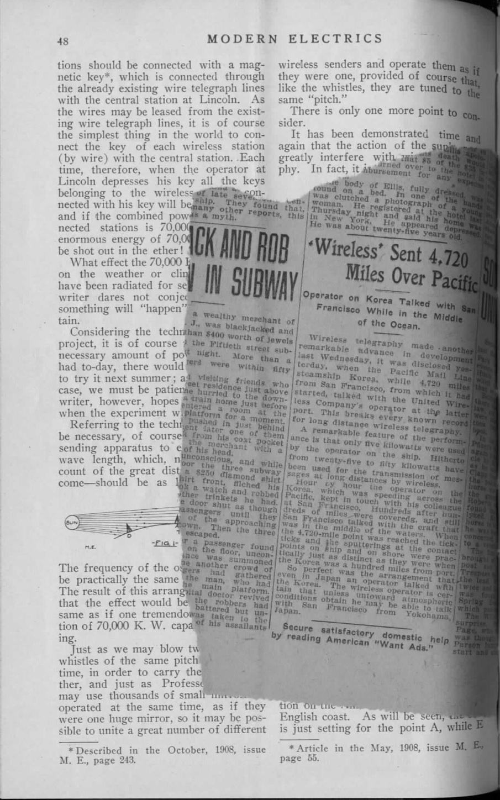

Open
======

It's the summer of 1906 in downtown Manhattan and Louis Coggeshall hovers over a bucket of dimes in the back room of the Electro Importing Company's retail store, filing them down to a coarse powder.  Sitting amid shelves of electrolytic detectors, circuit switches, ammeters, and Geissler tubes ready for sale to the city's growing community of amateur experimenters, he lets the metal filings fall into a small cardboard box at his feet.  Making a coherer, one of the earliest forms of radio receiver, required a certain amount of culinary improvisation in order to find the proportion of metals that would produce the strongest signal possible.  At the time, dimes were minted on ninety percent silver, so Coggeshall’s next steps were to mix the filings with the perfect ratio of iron powder and finally to pour that mixture into a small glass vial.[^mrc]  When a radio frequency wave comes into contact with this coherer, the metal filings cling together, allowing a signal to flow between electrodes connected to either end of the vial and, depending on how long the telegraph key on the transmitting end of that radio wave is depressed, produce a *dot* or a *dash* in Morse code.  Mounting this final element onto a wooden base dotted with other handmade components, Coggeshall completes the construction of another one of the Electro Importing Company's flagship products: the Telimco wireless telegraph set, a portmanteau of the company's name and one of the first fully-assembled radio sets ever sold to the American public.^[@_telimco_2002. @gernsback_50_1956.]

[^mrc]:  Marconi's original “recipe” for the coherer called for one part silver to nineteen parts nickel (as opposed to iron).  @lee_nonlinear_2004, p. 4.  Coggeshall, who began his career as a telegraph operator for the Erie Railroad, first met Gernsback at a boardinghouse on 14th Street where they were both staying.  @moskowitz_explorers_1963, 231.  Coggeshall also did the cover art for the first issues of the *Electro Importing Company Catalog.  @gernsback_old_1938.

Meanwhile in the offices upstairs, the founder of Electro Importing Hugo Gernsback writes increasingly breathless advertising copy for the Telimco, promising it to be a means of professional success and economic mobility.  In one issue of the *Electro Importing Company Catalog*---a mail-in marketplace that provided access to "Everything for the Experimenter"---Gernsback claimed that with the Telimco, "We give you the opportunity to tick yourself up to the head of a future wireless telegraph company as did Marconi, De Forest and others."  Priced at $7.50, the set was an attractive proposition from a company who claimed to be "the largest makers of experimental Wireless Material in the world", requiring little more than a working knowledge of Morse code in order to get started.  First advertised in the November 25, 1905 issue of *Scientific American,* the Telimco appeared thereafter every two weeks, quickly becoming one of Electro Importing's best selling items.  In order to reach a wider public, Gernsback -- a twenty-one year old Jewish immigrant from Luxembourg who at that point had been in the United States for only two years -- visited retailers around the city like Macy’s, Gimbels, Marshall Field's, and FAO Schwartz, giving demonstrations of the device to incredulous salespeople who had no conceptual framework through which to understand “wireless.”  And for good reason: not only was wireless still in its infancy and largely unknown to the public, it was a technology whose successful transmission of information through the air wasn’t fully understood even by the scientific community.  From the physical substrate of metal filings to an entirely new means of communication that would soon be in every home, Gernsback and his colleagues were in the process of transubstantiating one medium into a medium of another kind.

![A replica of the Telimco receiver made by Gernsback for the Ford Museum in 195….  The coherer is the glass tube mounted between the two binding posts next to the bell.  Other components include the spark gap and the large cylindrical battery.]

This is the story of a literary genre's emergence.  But it is likely not one that the reader is familiar with.  Hugo Gernsback is remembered today as the founding editor of the first science fiction magazine, *Amazing Stories,* a large-format title printed on thick pulp paper that debuted on newsstands in early March 1926.  *Amazing Stories* gave a name to fiction treating the speculative and the otherworldly through a systematically realist lens:  scientifiction.  And it established a forum for fans of the genre to debate and influence the future of its development.  In recognition of this legacy, Gernsback's name adorns the awards given out each year to the best works in the genre, the Hugo Awards, and many scholars use the launch of *Amazing Stories* in 1926 to date the invention of modern science fiction.  This book is devoted to the idea that the project of science fiction as Gernsback understood it in fact had its origins in an earlier context:  as a series of interlinking devices, debates, and visions shared by a community of tinkerers that formed around Gernsback's electrical supply shop and technology magazines.  Largely thanks to the iconographies and standardized plots codified by *Amazing Stories,* the term *science fiction* today conjures up images of bug-eyed monsters, ray guns, and starships.  But in the opening decades of the twentieth century, before the accretion of a hundred years' worth of narratives, images, and clichés, that which was not yet called science fiction consisted of a number of concrete practices all geared toward a reckoning with technological revolutions in the fabric of everyday life.  Before it was a particular kind of story or plot, science fiction was a way of thinking about and interacting with emerging media.

What began with the *Electro Importing Catalog* and its miscellany of strange devices like the Telimco soon expanded into a number of companion magazines for the amateur tinkerer like *Modern Electrics* (first published in 1908), *Electrical Experimenter* (1913), and *Radio News* (1919).  In these richly illustrated magazines, one could find blueprints for a home-brewed television receiver (well before the technology was feasible) alongside a literary treatise on how scientifiction stories should be structured.  Giving equal space to the soberly technical and the wildly utopian meant that Gernsback's translation of an influential German handbook titled *The Practical Electrician,* for instance, could run alongside a speculative article on what it would take to provide a global system of free electricity powered by ocean currents.  Each issue showcased designs submitted by readers, their own personal "wrinkles, recipes, and formulas" that would be taken up and debated by others through letters printed in subsequent issues, much like the famous letter column in later science fiction magazines.^[FN SF FANDOM BOOK BY MOSKOWITZ, IMMORTAL STORM?]  Long before Gernsback founded *Amazing Stories,* these magazines and their readers used speculative thought to find a language suited to the analysis of emerging media like radio, television, or the more exotic osophone and telegraphone.  While Gernsback for better or worse has been enshrined as science fiction's founding figure (fans refer to him as "Uncle Hugo"), less well known are the ways in which he is "the father of American electronic culture," in the words of Franz Pichler, curator of a recent exhibit on Gernsback at the ZKM (Center for Art and Media Technology).[^bwbp]  In order to come to terms with the place from which both of these nascent discourses emerged, scientifiction and media culture, we have to see them as part of a continuum.

[^bwbp]: @pichler_hugo_2013.  Co-curated by Pichler and the media theorist Peter Weibel, this exhibit at the ZKM in Karlsruhe was one of two recent museum showcases of Gernsback's life and work.  The other was held at Luxembourg's National Center for Literature in 2011.  In addition, the visual artist Eric Schockmel is currently developing an animated documentary film about Gernsback.

One of the challenges in recovering an understanding of science fiction *avant la lettre* is the fact that many of the variables its stories revolve around -- science, media, and technology -- the very subjects and objects of scientifiction, were concepts still very much in flux[ cite Jameson?

Grant Wythoff, 9/28/15, 4:53 PM].  Science as it was understood in the public sphere was a highly variable entity, and had no settled explanations for the accomplishments of new technologies like wireless telegraphy.  These technical media were only just beginning to be understood as *media* in the modern sense of mass communications, and even the term *technology* itself wasn't used in the American English vernacular until the 1920s, as we will see later.^[@guillory_genesis_2010. @marx_technology:_2010.]  The essays that follow, therefore, represent a media theory in the making, in which *media* are addressed not primarily as mass-cultural forms like cinema or television news, but as the affordances of and possibilities inherent in the smallest individual components:  the selenium-coated plate, the tungsten lamp, the chromic plunge battery.  In his monthly editorials, feature articles, and short fiction, Gernsback pioneered a kind of writing that combined hard technical description with an openness to the fantastic.  Using interleaving descriptive and narrative frameworks to describe a particular device, experience, or vision of the future, Gernsback followed the smallest of technological developments through to their most logical, and sometimes extreme, conclusions:  the increased availability of a light-sensitive alloy implied that the coming of visual telephones was near, and the number of amateurs sending in their own designs for primitive television receivers only served to confirm the immanence of this new mode of communication.

* * * * * * * * 

The pace at which pulp media theory has to move. Multiple articles per month. Often ghostwritten? An idea machine 

* * * * * * * * 

It's perhaps this penchant in his work to dwell in the extremes of both technical detail and fantastic speculation that accounts for Gernsback's absence in the pages of both science fiction studies and the history of technology.  For the former, he is too obsessed with material details and as an editor and writer merely produces stylistically bland lists of technological marvels, what are dismissively referred to as "gadget stories."  For historians of technology, Gernsback's inventions and technical writings are never able to back up their promises, being far too concerned with future contingencies to merit serious attention.  But it's precisely the novel coexistence of these diametrically opposed modes throughout Gernsback's work -- radically practical and radically speculative -- that led to the explosive popularity of his ideas in several different forums.  Across the thirty year period covered by this book, you will find technical precision and utopian speculation in varying proportions, and articles that toggle from one extreme of this spectrum to the other with ease.

  [[NOT THE RIGHT IMAGE]]

Writings that begin with seemingly dry engineering specifications[ Silberman: "He demanded that all scientific theory in stories he published be verifiable—an insistence on literal accuracy dubbed “the Gernsback Delusion” by his stable of authors."  http://fancyclopedia.wikidot.com/gernsback-delusion

Grant Wythoff, 10/7/15, 5:04 PM] don't take long to spin out into wondrous possibilities, futures that seem to proceed organically from the most minuscule of details.  The Telimco, for instance, was not exactly the revolutionary device that first brought radio to the masses Gernsback later liked to claim it was.  Though its advertisements claimed the set was "guaranteed to work up to one mile," the Telimco was notoriously finicky.^[@_wireless_1905]  As it was sold, the outfit had a range of merely 300-500 feet and could only receive signals from further distances when a large antenna was hooked up.  Further, it was highly susceptible to any kind of electrical interference, such as the elevator motor in the Electro Importing Company building, which caused difficulties during in-store demonstrations of the apparatus.  The Telimco's untuned circuits, which would produce a high degree of interference for any nearby radio station, would soon be outlawed by federal legislation.  For these reasons, its metal filings coherers "had all but disappeared from commercial work in 1910" according to historian of early radio Thomas White.^[@white_pioneering_1996]  From this perspective, the Telimco seems less a practical means of communication than a proof of concept for a growing group of "electrics" hobbyists.  (A similar tone can be found in profiles of other Gernsback inventions, **The Radioson Detector** and **The Physiophone**.)  In essence, it was little more than a gimmick, a parlor trick: press a button and a bell in another room would ring without the need for any intervening wires.  But the Telimco was a rough prototype, an aggregate of handmade compontents that encouraged and enabled a conversation on what the wireless medium may look like in the future.  The technical limitations of the device as it then stood didn't stop Gernsback from publishing instructions in 1908 on connecting a telephone mouthpiece to the transmitting end of the Telimco and an engine to the receiving end, so that the "power" of the human voice could be used to start that engine (**The Dynamophone**).  Or in the following year, describing how thousands of perfectly synchronized home wireless sets would be capable of sending a message to the aliens that surely must be listening for us on Mars (**Signaling to Mars**).  Or months later, laying out in great technical detail how it would be possible to send and receive motion pictures over the airwaves using currently available equipment (**Television and the Telephot**).  

The Telimco was one of countless artifacts profiled in the Gernsback magazines that blurred the lines between the real and the imaginary.  While some were awarded patents and others were available for sale, others seem more like branding exercises or rallying calls for a community of active amateur experimenters to run with the as-of-yet unrealizable idea.  More often than not, these above categories bleed into one another.  Gernsback gave names to these ideas like Aerophone (a name for wireless audio transmission, rather than merely telegraphic code), Telephot (an early conceptualization of the videophone), and Hypnobioscope (an automated thought transcription and playback machine).  Regardless of how advanced the devices detailed in the pages of the *Electro Importing Catalog* seemed -- solar cells, automobile mounted radiotelephones, electric keyboards powered by vacuum tubes -- Gernsback and his staff reported on them as if they only required a combination of already existing electrical principles and components.  These new media appeared as little more than the sum of individual building blocks that one could pick and choose from of the pages of the *Catalog.*  Even the long-term projections like thought wave recorders and videophones were described as handicraft futures that would come to pass with just a little more tinkering.  As Samuel R. Delany writes,

> The new American SF took on the practically incantatory task of naming nonexistent objects, then investing them with reality by a host of methods, technological and pseudotechnological explanations, embedding them in dramatic situations, or just inculcating them by pure repetition.^[@delany_critical_2009.]

These gadgets appeared so frequently and in such diverse contexts -- as props in short stories, as homemade designs in letters to the editor, as profiles of similar developments across Europe -- that one gets the sense paging through the magazines that they are all part of a coherent fictional world, built up across many years and many issues.  Given the pace of technological change in the early twentieth century, it seemed as if any one element of this fictional world could bleed into everyday life at any moment.

* * * * * 

In many ways this book can be read as a coherent work of science fiction in its own right, developed over the course of thirty years but a coherent project 

(can also be used in "how to read this book")

* * * * * 

Other Gernsback essays proceed along the spectrum in the opposite direction, from recent developments in some highly speculative science to its potential applications in consumer technologies.  But again, the terms of the trasnfer are weird.  By this point the American magazine reading public was familiar with the idiom of popular science reportage.  While nineteenth-century scientific periodicals in the United States took the form of highly specialized *Proceedings* or *Transactions* or *Reports* of academic research organizations, the *fin de siécle* saw a proliferation of titles aimed at a much broader audience.  *Scientific American* for instance, the best known of these publications and one that still runs today, attracted a readership that included credentialed researchers, industrial manufacturers, an interested general public, as well as a "nebulous community of inventors (ranging from the local tinkerer to manufacturer and professional inventor/technologist)."  Science in these new magazines was made accessible to a growing number of readers seeking to educate themselves or simply desiring to remain informed about recent developments.[^psci]  But while Gernsback's magazines may seem familiar to us today through their progeny such as *Wired,* *Popular Science,* and *Popular Mechanics* (the latter two of which are the direct successors to Gernsback titles) in many ways they bear more in common with a deeper tradition of popular science that blurred the lines between illusion and truth, skepticism and belief.  As many historians of science have recently shown, from medieval displays of the natural world's wondrous curiosities to nineteenth-century phantasmagoria and other audiovisual spectacles, "the positive sciences and the fantastic arts [have been] linked in a dialectic of doubt and certainty."^[@tresch_prophet_2011; @daston_wonders_1998; @andriopoulos_ghostly_2013.]  Unseen forces were at work in the miracle of wireless telegraphy, a literally unbelievable technology that meant disembodied thoughts from around the world could be skimmed from the air in the comfort of your home.  If this miracle were possible, what else might be?

[^psci]: @whalen_periodicals_1980.  For a history of the view that a scientifically educated public was an imperative for American democracy in the early twentieth century, a period during which the concept of "science" itself was being determined largely by secondary school curricula, see @jewett_science_2014, especially Chapters 4 and 7.

For Gernsback and his staff, rapid developments in the electrical arts made the speculative sciences of antigravitation and "thought waves" seem within reach.  From a belief in the presence of the luminiferous ether, to an argument that gravity is an electrical phenomenon, to the suggestion that humans may be able to tap into the so-called sixth senses of animals, or that the earth's core is made of radium and drives recurring cycles of life's evolution, Gernsback's purportedly "scientific" titles reveled in the fantastic.^[@gernsback_ether_1916; @gernsback_gravitation_1918; @gernsback_unknown_1920; @gernsback_radium_1916]  And while competing magazines like *The Wireless Age, QST,* and *Popular Science Monthly* were gradually opening up the specialist orientation of the sciences to a wider public through sober reportage, Gernsback addressed a growing readership who found the products of science to increasingly form a bewildering part of their everyday lives, addressing them from this perspective.  "As time goes on it becomes more apparent that our senses are becoming more and more involved directly due to scientific progress," he wrote.  Listing a miscellany of sensory illusions that had become commonplace, from "blazing names being written out in the night sky" by moving electric signs, to the "radio illusion" of reproduced sound, to the simulated effects of motion in new carnival rides, Gernsback warns that "We should never trust our senses too much in these latter days of scientific progress."^[@gernsback_modern_1927.]  Given the rate of this "progress," the reader should not be surprised if the next great scientific advance, seemingly impossible today, should become commonplace tomorrow.  As we will see over the course of Gernsback's writings, this faith in technoscientific progress remains remarkably unscathed in the wake of the First World War and the Depression, a faith that only an American technologist could claim, at a remove from the horrors of the trenches and doubling down with the idea that cultural welfare could be technocratically managed by machines and their engineers (**Human Progress; Wonders of the Machine Age**).

But for Gernsback, projections of the future or progress and its wonders were never simply bewildering, they were the occasion for a material education in the way things worked.  "Beauty is a groping of the emotions towards realization of things which may be unknown only to the intellect" (**Fiction Versus Facts** -- one of these stylistically unique passages of his, where you can't tell if their quirks come from the pulp speed of publication or the fact that English was HG's third language.  REPEAT LINE).  The behavioral archaeologist and historian of radio Michael Schiffer refers to Gernsback and his writers as "techno-mancers," arguing that their depictions of wide-ranging futures created a "cultural imperative" for inventors, engineers, and scientists to make these dreams a reality.^[@schiffer_portable_1991, 136]  And in a sense, this is true, with many speculative ideas as described by Gernsback retrospectively seeming like "predictions" of modern technologies (**Television and the Telephot; What to Invent; Predicting Future Inventions**).  But what makes sense as a neat, two-step model for literature as a source of inspiration and invention was actually a much messier process in practice, like a melody played so fast that the notes become indistinguishable.[^sfvt]  The Gernsback titles were unique in their willingness to tackle fantastic topics that other publications wouldn't, and did so through the lens of hands-on technical know-how.  Behind the gadgets of **Ralph 124C 41+,** Gernsback's famous serial novel of 1911, was a marketplace of evocative objects, a forum for amateurs experimenting with these strange new things, and an emerging consensus vision of their possible applications.  Over the course of long-running serial novels and the exchange of reader correspondence, the material basis of scientifiction's marvelous futures was gradually refined.  These were handicraft futures that seemed so seductive because they were futures that you, the reader, could build yourself.  With practice and experience, the amateur experimenter could pick up any object and sense its affordances, participating in this iterative process of making.

[^sfvt]: This two-part model of invention forms a common thread in science fiction criticism, with the genre providing a thinktank of sorts in magazines, novels, and films, continuously replenishing a reservoir of ideas for technologists to draw upon in their own inventive process.  See for instance @disch_dreams_1998;  @shedroff_make_2012.

This particular ability is what Gernsback called “the perversity of things,” or the innate capacity of objects to elicit unique responses in users, skilled or novice.  Objects exert an influence on thought.

*The Perversity of Things: Writings on Media, Technology, and Science Fiction* makes available texts by Gernsback[ Hugo Gernsback has been given very little attention in science fiction studies, with the field's leading critics often assuming that *Amazing Stories* was little more than a marketing gimmick for Gernsback's technical ventures.  The fiction published in the pages of his magazines is often seen to have very little aesthetic or literary value.  So when Gernsback is given credit in the foundation of modern American SF, it is as a kind of marketer of a new brand name, rather than a writer or editor.  As Alexi and Cory Panshin write, "In the pages of *Amazing*, SF literature at last became identified by a single name: 'scientifiction.' It was provided with a history. It was defined and demonstrated. It was consolidated and unified. In *Amazing*, SF became conscious of itself."^[@panshin_world_1989, 170.]  According to John Clute and Peter Nicholls, Gernsback "gave the genre a local habitation and a name," and for James Gunn, he "provided a focus for enthusiasm, for publication, for development," and bestowed science fiction with its "characteristic content, a characteristic form, and characteristic purposes."^[@clute_encyclopedia_1995, 491. @gunn_alternate_1975, 128.] 

These critical histories (each of which are written by SF novelists in their own right) proceed as if propelled by their own fantastic, alternate history: what if science fiction left us with texts as highly valued as the works of modernism from the very beginning? No doubt the field of science fiction studies has done a great deal of work in order to elevate certain works of the genre (mainly from the 1960s and 70s New Wave) to a kind of academic respectability. But these assumptions about the genre's magazine era beginnings have never been questioned, nor have any of Gernsback's publications save for *Amazing Stories* been submitted to any kind of rigorous analysis. The editorial function many SF histories begrudgingly ascribe to Gernsback overlooks the much more interesting heritage of magazine SF within a wider tradition of thinking about new media.

Grant Wythoff, 10/21/15, 9:10 PM] that were foundational for both science fiction and the emergence of media studies.  This collection of Gernsback's editorials, blueprints, literary critical essays, and media histories that have been out of print since their original publication between 1905 and 1933.  Together, they show how his publications evolved from an electrical parts catalog into a fully-fledged literary genre.  Not only was Gernsback an active inventor and advocate for the rights of the amateur, he developed a means of describing and assessing the cultural impact of new media long before it was an academic discipline.

*The Perversity of Things* thus seeks to provide a reappraisal of both the "hard" technical roots of American science fiction and the highly speculative orientation toward media technologies that was prevalent during this period.  Science fiction in its early days wasn't just a literary form, it was a mode of interacting with and understanding new media.  The literary historical gambit of this book is to recover the radical sense of openness that greeted not only the basement tinkerer working through the feasibility of transmitting images over a wire, but also the author of "scientifiction" stories who possessed a highly sophisticated awareness of the fact that "Two hundred years ago, stories of this kind were not possible" (**A New Sort of Magazine**).  Often, these individuals were one and the same, weaving together functional and fictional devices in a manner that served for them as a form of scientific discovery in itself.

Overlapping publics and occluded voices…

This isn't the story of an Edison or a Jobs, inventors whose creations for better or worse have changed the way we inhabit the world.  Gernsback's career left us with a way of participating in that change, imagining its possible futures, and debating which future it is that we should live in.  This is the story of the development of a community, of a series of practices and a way of approaching the world.

* * * * * * * * 

It is not my intention here to wade into debates over whether science fiction was invented in the pages of the pulps or whether it has its proper beginnings in texts by Mary Shelley, Edgar Allan Poe, Jules Verne, even John Wilkins's *The Discovery of a World Inside the Moone* (1638) or Thomas More's *Utopia* (1516).  I don't mean to suggest here that the cultural, sexual, and ecological complexities of later texts like Samuel R. Delany's *Dhalgren* (1975), Kathy Acker's *Empire of the Senseless* (1988), or Paolo Bacigalupi's *The Windup Girl* (2009) can be directly traced to the techno-utopian work published in *Amazing Stories.*  As Carl Freedman writes, "current Anglo-American science fiction draws on far more than the pulp tradition that constitutes *one* of its filiations."  @freedman_critical_2000, 15.

Instead, I intend to follow the suggestion of Samuel R. Delany that science fiction and literature are two entirely separate cultural forms / phenomena.  There's a craft that goes into SF, and if this is so, then THIS is the proper place to understand SF's emergence.  Make this argument.  Don't just stand back and be like, oh I don't want to make an argument for where SF comes from.  I'm following Delany's lead here, and giving a sourcebook for thinking further about how this argument might be the case.

Craft:  "a tradition of writers who considered themselves craftsmen first and artists secondarily, if at all." @delany_silent_1994, p. 200.

Even though critical discussions of Gernsback (as few as there are) tend to revolve around "firsts" -- in no small part due to his own claims to the mantle of science fiction's "father" -- arguments about primacy and filiation are not my goal here.  Instead, what interests me is the idea that this period in the genre's history has been too quickly dismissed as embarrassingly simplistic.  This is not surprising if we focus solely on the fiction that appeared in these magazines using literary merit and style as our criterion.  I would like to assess this work not as a "first" from which the entire genre proceeds, but as a unique moment in its history that we have yet to approach in its own terms.

* * * * * * * * * * 

The essays that follow are representative of a discussion among overlapping publics that sometimes explicitly occluded certain groups and at others offered a way in for the otherwise occluded voices of women and, in the argument of Steve Silberman, allowed people on the Autism spectrum to 

> Both amateur radio and science fiction fandom offered ways of gaining social recognition outside traditional channels. . . . For people who found open-ended conversations daunting, the byzantine customs and rituals of fandom furnished reassuring scripts for interaction. 

> By routing around the face-to-face interactions they found so daunting, even people who found it nearly impossible to communicate through speech were able to reach out to kindred spirits, find potential mentors, and gain the skills and confidence they needed to become productive members of society.^[@silberman_neurotribes:_2015]

and later, in *Sexology* (1933), a relatively progressive treatment of masturbation, homosexuality, and premarital sex into the 1950s and 60s, although articles on "breastfeeding fathers, women with extra breasts, Hitler's sex life, [and] rubber fetishism" were more common.^[Though it's outside the scope of this volume, for a selection of articles from this magazine see @yoe_best_2008.]

But the need for this volume is now becoming apparent as we experience technological revolutions in the fabric of the everyday similar to those that brought readers to the Gernsback publications a century ago.  The ability of Gernsback's ideas to speak to us today can be seen in the ways that images from his magazines circulate online through a wide variety of social image sharing sites and blogs, like Reddit, Tumblr, and the Scientific American blog *Paleofuture*.

Reputation:  "a disastrous (if not a pernicious) figure, a man whose stultifying vision and lack of literary taste led to the establishment of a literature that for too many years was considered a laughingstock, that emphasized other elements than literary quality, and, perhaps worse of all, that paid the majority of its writers badly."^[@grossman_hugo_2011]  Attention to the poor rates he paid his writers (a common gripe among pulp authors and their editors) that has more than a little hint of antisemitism to it -- the spectacularly racist H.P. Lovecraft's monicker "Hugo the Rat" stuck with Gernsback and, even while many commentators don't embrace the name, they do cite the poor wages he paid as if it's evidence of his character.  a Jewish identity that, like many Jewish immigrants to the United States, Gernsback never fully embraced.  (say this in a way that doesn't implicate the cited author as himself being antisemitic…)

A Jewish immigrant in search of a respectability that always seemed to elude him, as a Jew, pigeonholed as a "pulp" editor,  (see @fingeroth_disguised_2009)

Delany mentioned in a conversation that pulp editors were often Jewish, hardback, "literary" publishers Protestant.  A big part of HG's identity here, and a meaningful silence on his identity.

"up-to-date technic"
===================

Born Hugo Gernsbacher in 1884, the third son of Jewish German émigrés to Luxembourg, Gernsback was raised in Hollerich, a tiny suburb of the nation's capital.  His parents, Moritz and Bertha Gernsbacher (née Dürlacher), raised him in comfortable circumstances thanks to Moritz's successful wine wholesaling business.  Growing up off the grid (Hollerich wasn't yet connected to Luxembourg City's new electricity network), the young Gernsback's passion for technology began with the battery after a handyman employed by his father, Jean-Pierre Görgen, taught him at six years old how to wire a series of bells to a Leclanché cell.  Gernsback recalls being instantly enchanted by the bell "ringing amid a shower of wonderful green sparks," and would soon acquire a reputation for wiring homes and businesses in the area with telephones and these ringers.^[@oneil_amazing_1963. @gernsback_old_1938.]  According to a story he often told later in life, Gernsback received special permission from Pope Leo XIII at thirteen years old to enter the Carmelite convent of Luxembourg City to install a series of electric call bells for the nuns there.^[@siegel_hugo_1988, 16.]

Though this story is partially verifiable through a certificate of thanks from the Convent found by the Luxembourgeois Centre National de Littérature, it's worth pointing out here that the portrait of Gernsback's life we are left with in the historical record consists largely of a series of self-propagated stories that border on braggadocio:  that a police officer intruded on the Electro Importing Company offices to interrogate them for fraud with the Telimco set in 1906, for "no wireless combination could be sold at this low price"^[Reportedly, the officer shot back after the demonstration: "I still think youse guys is a bunch of fakers. This ad here says that you are selling a *wireless* machine. Well, if you do, what are all them wires for?" @gernsback_old_1938.]; that Gernsback coined the term "television" in his December 1909 editorial **Television and the Telephot** (he didn't); that his recommendations were incorporated "word for word" into the Radio Act of 1912 (while the recommendation was, the wording wasn't---see **The Alexander Wireless Bill** and **Wireless and the Amateur**).  Once the influential science fiction historian and Gernsback's friend Sam Moskowitz recorded these stories in his many profiles of Gernsback, they became established as gospel truth, with Moskowitz playing the apostle to Gernsback's prophecies.  Evidence contrary to or even in excess of the received doxa is hard to come by, with many press and literary critical accounts barely rephrasing Moskowitz's prose.^[Beginning with @moskowitz_hugo_1959.]

We do know that despite the precociousness of his youth, Gernsback was by most measures a terrible student, falling at the bottom of his class at an industrial school near home from the ages of twelve to fifteen.  When he left to attend the Technikum in Bingen, Germany (now the Fachhochschule Bingen) from seventeen to eighteen, he regularly skipped classes and received poor grades in all subjects save electricity and physics.  It was during these teenage years that Gernsback acquired a penchant for gambling with the money he earned doing various electrical jobs in poker games, though his tendency to be cleaned out by older players seemed to keep him from falling too deep into this habit.^[@henzig_hugo_2010, 15.]  Outside of school, Gernsback was drawn to American culture from an early age.  He was a fan of John Philip Sousa's military marches and even composed his own patriotic Luxembourgish piece in the style of Sousa titled *Rǒd, Wêis, Blo* that continued to be performed by the Military Band at the Place d'Armes in Luxembourg into the 1930s.^[@henzig_hugo_2010, 15-16.]  He was a devoted reader of cowboy stories and was such a fan of Mark Twain that he wrote a now-lost novel of his own at seventeen, *Der Pechvogel,* under the name Huck Gernsbacher.  But it was stories of the otherworldly that truly fired his imagination.  Reading the astronomer Percival Lowell's book *Mars* at the age of nine, with its fusion of the hard sciences and speculation about alien life, served as Gernsback's introduction to the literature he would later come to think of as a distinct genre of scientifiction.  He dove headfirst into the work of Jules Verne and H.G. Wells, claiming to have nearly memorized many of their novels while still very young.^[@moskowitz_explorers_1963, 229.]

Despite his predilection for journeys into unknown frontiers, whether the American West or Martian canals, Gernsback remained tied to his home even after leaving, if not physically -- there is no proof he ever returned -- then through a meticulous self-fashioning.  Gernsback cultivated a distinctively (one might say distinctively unique) Luxembourgish identity throughout his life.  Though raised by German parents, he grew up in Luxembourg at a moment in which the tiny country's national identity was becoming more developed than ever before.  The anti-German sentiments of Gernsback's editorials and short fiction published during World War I (especially **The Magnetic Storm**) largely echo the growing importance already sensed by "a good part of the Luxembourgish people at the end of the Nineteenth century to demarcate between the two [Germany and Luxembourg] when faced with the more or less well marked pan-Germanic designs of Germany."^[@henzig_hugo_2010, 19.]  But the many identities attributed to Gernsback throughout his life -- he is described variously in the press as Prussian, German, Belgian, French, a "multilingual dandy"^[@oneil_amazing_1963.] -- also seemed to allow him a kind of ambiguity that he relished.

> In the era of tie-dye and sandals, Gernsback continued to dress like a visiting dignitary. For evenings on the town, he favored formal wear, including spats, an opera cape and an expensive silk homburg. He even affected a monocle, though he didn't really need it.^[@stashower_dreamer_1990.]

But hiding just beneath this severe exterior, according to Sam Moskowitz, was a sharp sense of humor:  "The truth is that Gernsback socially is a man of almost rapier-like wit, with a mischievous gleam in his eyes and with the rare ability to joke about his own misfortunes."^[@moskowitz_explorers_1963, 235.]  Throughout his life, friends and colleagues noted Gernsback's relentless energy and the way that it seemed to sweep up everyone around him.  Visions completely out of step with his surroundings seemed to fall out of him wherever he went.  A distant relative recalls a 1910 visit from Gernsback on his way to Chicago to purchase new equipment for Electro Importing.  When a ringing telephone interrupted one of his many stories of "robot doctors, retirement colonies on Mars, domed cities orbiting Earth," Gernsback (who had arrived in a horse-drawn carriage) reminded his seven-year-old niece as she ran toward the receiver, "Hildegarde, fix your hair. It won't be long before the caller can see your face over the telephone wires."^[@stashower_dreamer_1990.]]]

Throughout his youth, Gernsback's parents never approved of his interest in electrics, and especially didn't see it as a viable career choice for him.  But when Moritz died in 1903 at the age of 57, Gernsback sensed that it was time to branch out on his own.  With either his share of the family's money or the savings from his electrical installation work (depending on which version of the story one finds), he booked a first class ticket to the United States, a fare that was prohibitively expensive for most.^[@gernsback_old_1938]  In February 1904, he arrived in New York by himself at the age of 19, in an elaborate three piece suit.  Perhaps inspired by his first experiences with that Leclanché cell as a boy, Gernsback carried with him the design for a new kind of dry cell battery whose electrolytic paste could replace the inefficient liquid of wet cells like that of the Leclanché.  Having been denied patents in both France and Germany for the battery, Gernsback decided to try his luck in the United States.  A year later, he began publishing on his ideas, with his first printed article appearing in *Scientific American* again under that most American of names, "Huck" (**A New Interrupter**).  He was able to sell his battery technology to the Packard Motor Car Company, who ended up using the device in their ignition systems.  With the profits of his sale, Gernsback formed the Electro Importing Company, an importer of specialized electrical equipment from Europe and one of the first mail-order radio retailers in the country.  Through their catalog and retail store at 84 West Broadway, the company provided access to specialized wireless and electrical equipment not found anywhere outside of Europe.  Electro Importing catered to a diverse clientele, first manufacturing the Telimco in 1905 for their novice users, and providing their more advanced amateur experimenters with the first vacuum tube offered for sale to the general public in 1911.

After several issues of their mail order catalog and a growing subscription list, Electro Importing began including features, editorials, and letters to the editor. Between 1906 and 1910, the catalog evolved into a monthly magazine for the wireless homebrewer, *Modern Electrics* in 1908.  The transition from the mail-order catalog to the monthly magazine format was a smooth one, evidenced by the fact that the third and fourth editions (1907 and 1908) of the Electro Importing catalog bears the title of the new full-format magazine, "Modern Electrics."  The offshoot Experimenter Publishing Company, founded in 1915, published expanded how-to manuals, pamphlets, and complete books like *The Wireless Telephone,* *One Thousand and One Formulas,* and *The Wireless Course.*  While *Modern Electrics* still advertised the equipment Electro Importing offered for sale in a familiar grid layout with ordering instructions, it also included feature articles detailing the latest research into experimental media technologies in America, throughout Europe, and in Gernsback's own company offices.  Each 36-page, 6 x 9.5" issue sold on newsstands for ten cents and contained regular reports from E.I. Co. employees like Harry Winfield Secor and René Homer, who would contribute to Gernsback titles for years to come.  Some freelancers[ Mention other young readers who went on to big careers?  Lewis Mumford, pioneering computer engineer John McCarthy.

Silberman:

> When he was eight years old, [computer engineer John] McCarthy decided that he wanted to be a scientist, spurred on by Gernsbackian how-to guides like Electricity for Boys. His mother was a suffragette and his father was a union organizer and a member of the Communist party; their idealism would infuse his hope for computers as facilitators of democracy at a time when many left-wingers had a visceral distrust of technology.

Grant Wythoff, 9/29/15, 11:33 PM] attributed their decision to pursue science as a profession to their experiences with *Modern Electrics,* as did Donald H. Menzel, later director of the Harvard Observatory, who earned money for college by writing for the magazine.^[@oneil_amazing_1963.]  Celebrity guest contributors like Lee De Forest, and later Thomas Edison and Nikola Tesla in the pages of *Electrical Experimenter,* raised the profile of the magazine among a readership hoping to emulate the success of these famous inventors.^[Tesla first published his autobiography in serial installments in *Electrical Experimenter,* a book that was recently republished by Penguin Classics. @tesla_my_2011.]  Regular dispatches and photographs printed on the magazine's slick paper from the unnamed Paris, Berlin, and Brussels Correspondents kept readers informed on developments in television, wireless telephony, and the use of novel electrical apparatuses in film and theatrical productions, each of which would go into a great degree of technical detail.  

But the hallmark of the magazine became its more speculative articles, those that were willing to extrapolate fantastic scenarios out of the technical details at hand.  Gernsback and his contributors wrote as if the more detail a particular technology's description contained, the more plausible were the projections of its future possibilities.  There was a way in which the future stood as the horizon of technical description.  As Lewis Mumford wrote in his autobiography, "In my youth, as a zealous reader of Hugo Gernsback's *Modern Electrics,* I shared my generation's pious belief in our future."^[Quoted in @westfahl_hugo_2007, 62.]  In **Signaling to Mars,** for example, Gernsback detailed the conditions that would have to be met in order for Earth to send messages via wireless telegraph to the red planet.  The quantitative description of the transmitting apparatus in terms of its necessary output (a gargantuan 70,000 kilowatts) and best time of year to signal (summer) only constitutes one aspect of this scenario.  Gernsback goes on to take into account the nature of Martian intelligence that would be necessary for such a communicative circuit to be completed:

> we can only hope that the Martians are further advanced than we and may signal back to us, using a method new to us and possibly long discarded by them, when thousands of years ago they stopped signaling to us, and gave us up, as we did not have intelligence enough to understand.

Continuing in the tradition of astronomers Percival Lowell and William Henry Pickering---the latter of whom offered a similar proposal on the front page of *The New York Times* to communicate with Mars using a series of mirrors^[@_planned_1909]---the projection of Martian technology (not to mention ecology) provided a topos upon which readers might asses the direction of its terrestrial analogues.

For readers of *Modern Electrics*, the technical context in which this highly speculative article appeared only lent credence to an idea as fanciful as the one that contact with an alien civilization was right around the corner. In the copy of this issue at Princeton University's Firestone Library, someone inserted a newspaper clipping (now a permanently affixed leaf within the bound volume) that tells of a new distance record for wireless signaling, from San Francisco to the Pacific Mail Line steamship Korea as it made its way across the ocean. Left there as if to vouch for the plausibility of the idea that we'll soon be able to connect with our nearest planetary neighbor, the clipping provides a wonderful sense of how it was people read these magazines.[^clp]  Though the Gernsback titles eventually became notable for some of their more outlandish claims---that electric current might clean us better than water, that the success of a marriage can be predicted using gadgets assembled out of various household supplies---they were always presented through a lens of supposedly scientific rationality. This frame affected the reception of the magazines by their readers, the design ethos that grew up around them, and the kind of fiction they eventually produced.

[^clp]: While I haven't been able to determine the provenance of this particular clipping, other articles reporting on the Korea's distance signaling record were published in the *New York Times*on November 8, 1909 and the *Boston Evening Transcript*, November 6, 1909.

From the earliest of the Gernsback titles, we find science configured[ This section will be easier to edit once I know what I need to include in the SF section.

Grant Wythoff, 8/27/15, 1:45 PM] as an instrumentalized form of technological achievement that bore little relationship to what was happening in laboratories.  Contrary to the common division between the purely theoretical nature of the sciences and their application in the development of new technologies, Gernsback argues that science and invention are part of a continuum in a later editorial for a magazine of that title:

> The word *Science,* from the Latin *scientia,* meaning knowledge, is closely related to *Invention,* which, derived from the Latin *inventio,* means, finding out.  There is little in Science that did not at one time require some inventive powers, while conversely most of the world's inventions are based upon one or more of the sciences.  (**Science and Invention**)

This article is a key of sorts for the many valences *science* can take throughout the Gernsback magazines.  Science is the sum of its many products progressively connecting the modern world, a hybrid of science and technology that saw no distinction between theories and their application.  It is defined as what the average person understands of its growing presence in their daily life:  "science no longer is the sombre book closed with seven seals.  Quite the contrary, it is the public that popularizes science---not our scientists" (**Science and Invention**).  It is even configured as a form of belief when Gernsback argues that skepticism is an entirely unscientific attitude:

> But our *real* scientists are as backward as in Galileo's times.  The public applauds and instantly believes in anything new that is scientific, whereas the true scientist scoffs and jeers, just as he did in Galileo's times when that worthy stoutly maintained that the earth moved and did not stand still.

In many ways, this starry-eyed fanaticism for science as the sum of its progressive advance in the material world reflects the way in which the public discourse was shifting on a larger scale as science entered mass market newsstands, corporate research facilities, and public school classrooms.  As John Rudolph has argued, it was during this period that the "scientific method" emerged not among professional or academic researchers but in secondary school pedagogy:

> while the manner in which practicing scientists went about their work (the research strategies they used, their modes of inquiry, norms of argumentation, etc.) changed relatively little if at all from the 1880s to the 1920s, portrayals of the scientific method in American schools underwent a marked transformation.^[@rudolph_epistemology_2005.] 

If science was a highly variable concept for Gernsback, discourse surrounding its application was just as muddled.  *Technology* was a word largely unknown to the English speaker, which should also complicate the way we read these essays.  So, for instance, when Gernsback writes in 1922 that "steam, electricity, and up-to-date technic have completely altered not only the face of the globe, but our very lives as well," the usage of the word *technic* where we might expect something like *technology* reflects an important terminological confusion at the time (**10,000 Years Hence**).  While Google Ngram shows *technic* being used over three times more often than *technology* in 1922, this situation changes rapidly over the next decade.  In nineteenth-century English, according to Eric Schatzberg, *technology* referred to "a field of study concerned with the practical arts; except in anomalous usage, [it] did not refer to industrial processes or artifacts."  Just as sociology names the study of society, technology was the science of technique, making, the useful or practical arts.  Somewhere around 1930, Schatzberg argues, 

> new meanings derived primarily from the writings of American social scientists who imported elements of the German discourse of *Technik* into the English term technology, thus shifting the latter from its original definition as the science or study of the useful arts to a new one that embraced the industrial arts as a whole, including the material means of production.^[This masterful history of the interrelated concepts of *Technik,* technology, and technique, is highly recommended.  @schatzberg_technik_2006.]

This hybridized and highly materialist understanding of science and technology was foundational for Gernsback's later conceptualization of scientifiction.

Hoping to build on the success of *Modern Electrics,* Gernsback sold the magazine to Orland Ridenour[ [WHO?? HG'S NEIGHBOR?]

Grant Wythoff, 9/3/15, 12:22 PM] and launched a new title in May 1913: *Electrical Experimenter.*[^psmm]  Continuing the work that began with *Modern Electrics's* monthly radio set building contest and correspondence section, *Electrical Experimenter* introduced several new ways for readers to participate.  A section called "The Constructor" included tips for the home workshop, like a technique for tightly winding a spark coil using a hand-cranked drill.  The "How-To-Make-It Department" offered prizes for designs submitted by readers that specifically "accomplishing new things with old apparatus and old material," such as an alarm that activated a simple electric bell in the house when a mailbox's door was opened and closed.  The "Electrical Magazine Review" provided a roundup of news recently published in other electrical magazines like *Electrical World* and London's *The Electrician,* while the "Patent Advice" column offered input on inventions that readers hoped to patent at the price of $1 per question.  By May 1918, the magazine had reached a circulation of a hundred thousand copies per month, almost doubling *Modern Electrics's* readership seven years previously.

[^psmm]: *Modern Electrics* continued under Ridenour's Modern Publishing Company as *Modern Electrics and Mechanics* for two years before acquiring and taking on the name of *Popular Science Monthly* in April 1915, a magazine whose publishers were looking to update the format it had run since 1872: reprints of European science periodicals with little to no illustration.  Under the editorship of Waldemar Kaempffert, the new *Popular Science* tried to increase its readership with short form writing, dense photo spreads packed onto every page, and a far more generalist approach to "science."  One would now find articles on developments in criminology, warfare, and motion pictures in a magazine that only a year earlier covered entomology, evolution, and pathology.  It continues to be published today.  For an overview of Kaempffert's editorial philosophy, see @kaempffert_vision_1916.

Paging through the print run of the *Electrical Experimenter* across the 1910s is like watching the activities of a quirky group of hobbyists grow into a mass cultural phenomenon.  Over the course of its publication, Gernsback and his staff gradually widened their focus from the highly specialized electrical arts of *Modern Electrics* to a range of topics geared more toward the general public.  As "recipes, wrinkles, and formulas" were joined by sensational depictions of future technologies, Gernsback changed the magazine's tagline from "The Electrical Magazine for the Experimenter" to "The Electrical Magazine for Everybody."  By the decade's end, the title was completely rebranded as *Science and Invention,* a change that once again nearly doubled the magazine's circulation to almost 200,000 copies per month.^[*Science and Invention* continued for another decade before being bought out and merged into the September 1931 issue of *Popular Mechanics,* another title still published today.]  The new look was accompanied by a significant change in editorial policy, beginning with the idea that the image is the most effective way to communicate complicated scientific information to the public.  

> All of our departments, as you will note, have been reduced to pictures and captions, with the exception of our scientific fiction stories which for the time being will run on as usual.  The reason is that the average man or woman does not wish to laboriously wander through miles of text of scientific facts, which means concentration and study. . . . *we have tried to reduce all scientific matter to entertainment instead of study.* (**The 'New' Science and Invention**)

Gernsback's visions were lent a shape and a color thanks to two new illustrators who were able to "illustrate difficult subjects in such a way that words really become superfluous," as Gernsback put it in the previous editorial.  Though Howard V. Brown's career as a cover artist spanned a variety of subjects and techniques -- his work appeared everywhere from from *Scientific American* to *Argosy All-Story Weekly* to the children's magazine *St. Nicholas* -- the signature of his Gernsback covers was the Rockwellesque way he was able to tell the story of an entirely speculative technology through facial expressions and dramatic gestures.^[@gustafon_brown_2015.]  Seemingly familiar domestic scenes, detailed in vividly realistic brush strokes, were punctured by the presence of a strange apparatus and became the starting point for conversations on how a technology of the future might function.  It was in no small part due to the vivid illustrations that readers were so drawn to these visions of the future.  As a character in Robert A. Heinlein's 1940 short story "Requiem" says, he was one of those fans "who thought there was more romance in an issue of the *Electrical Experimenter* than in all the books Dumas ever wrote."^[Quoted in @erisman_stratemeyer_2000.]

The shape of media to come took on an iconography all its own through the illustrations of Frank R. Paul.  Trained in Vienna, London, and Paris as an architectural draftsman, Paul is known for his exquisitely detailed cityscapes as well as the bug-eyed monsters that would later adorn the covers of *Amazing Stories.*^[@moskowitz_explorers_1963, 234.]  

* * * * * * * * 
Gernsback says that producing realistic illustrations of the future is the most difficult, and most rewarding part of the magazine, and that the idea is to fire the imagination of a reader/experimenter:  "It is no easy matter to think out new things of the future and illustrating them adequately by means of expensive washdrawings or three-color cover illustrations.  Indeed, there is nothing more difficult connected with the publication." (**Imagination Versus Facts**)
* * * * * * * * 

As the magazines in which they appeared gained a wider following, these images began to circulate far beyond their original venues.  Plans for the Osophone, a device Gernsback designed to replace headphones by transmitting sound through vibrations in the jawbone of the listener (**Hearing Through Your Teeth**), were published and reviewed in the German journal *Der Radio-Amateur.*^[@nesper_osophon_1924.  For the history of *Der Radio-Amateur* magazine, see @sarkowski_springer-verlag_1996.]  Paul's sketch of a man using a tuning fork to calibrate the speed of the 1928 *Science and Invention* Nipkow disk television receiver was republished the following year in the Chinese film journal *Yingxi zazhi* (*Shadow Play Magazine*) as an illustration of recent research into television, what was referred to in the article as, directly translated, "wireless cinema."^[@bao_sympathetic_2011. Bao located Paul's illustration of the *Science and Invention* television receiver in @shen_dianyingjie_1929. The term for television used in this article is "wuxian dianying (wireless cinema, or, more literally, wireless electric shadow, or radio shadow)." Paul's images were originally published as the accompaniment to @gernsback_radio_1928.]  Many more *Electrical Experimenter / Science and Invention* articles were translated into French, German, Italian, Spanish, Japanese, Dutch, and Arabic, circulating widely along with their illustrations.^[@_this_1919]

It's the currency of these images then and now (especially as they're given new life on Twitter and Tumblr) that perhaps has resulted in the description of Gernsback for better or worse as a "prophet" of the future.  Unfortunately, this approach tends to flatten out the richness of his work into a list of the impressively early dates by which he had predicted the coming of technologies like in vitro fertilization, the transistor radio, atomic war, education by video, and telemedicine[ 1925's Teledactyl

Grant Wythoff, 9/8/15, 11:54 AM].  Gernsback himself seemed to enjoy the continued notoriety these predictions brought him (yet another reason why, in writing about him, we have to be careful to cut through the self-image he crafted).  In a sense, their sheer number is of course impressive, as it was for Arthur C. Clarke who dedicated his *Profiles of the Future: An Inquiry Into the Limits of the Possible* "to Hugo Gernsback, who thought of everything."[^prdt]  Though many of these ideas were in the air at the time, Gernsback simply had a knack for tuning in like no other, for distilling the essence of a technosocial development from a cloud of diverse possibilities into a digestible, attractive form.

[^prdt]: Moskowitz lists the predictions in *Ralph 124C 41+* alone: "Fluorescent lighting, skywriting, automatic packaging machines, plastics, the radio directional range finder, juke boxes, liquid fertilizer, hydroponics, tape recorders, rustproof steel, loud speakers, night baseball, aquacades, microfilm, television, radio networks, vending machines dispensing hot and cold foods and liquids, flying saucers, a device for teaching while the user is asleep, solar energy for theat and power, fabrics from glass, synthetic materials such as nylon for wearing apparel, and, of course, space travel are but a few." @moskowitz_explorers_1963, 233.

But descriptions of Gernsback as a prophet miss the way in which the future[ Making + the future mentioned in opening section w/ title Perversity of Things, here as a pivot point, and in the following section on tinkering.  Figure out how best to space out this story.

But if you look at other popular science and electrical magazines of the period, the future is never discussed.  The future infuses everything about science and technology in these magazines.

Grant Wythoff, 9/5/15, 5:50 PM], a topic almost entirely absent from other electrical and science magazines of the period, felt so close to hand.  Because Brown and Paul's images of thought recorders and visual telephones were accompanied by reader-submitted blueprints and parts for sale, it was as if one could reach out and touch these wonders.  This wasn't a matter of mere prognostication:  tinkering and material interaction among a community of interconnected readers brought about a uniquely critical understanding of what the future might hold.  "Invention" was an activity that logically and temporally preceded science and required a form of instinctual know-how or "knack," a term Gernsback returns to in many of his writings.  It's also a capacity that he thought might be learned, which meant that a literal roadmap to the wondrous future was possible.

* * * * * * * * * * * 

End with something on "Gernsback" as the house editorial voice, and as a self-created character.  Fitting, because what's less important is him as a person than the many communities he created.

What's really interesting is the community that these magazines represent, less than HG as a person. HG as a house editorial name. He's representative of a moment that falls between the gaps of literary and technological history, and his writings serve as the best introduction to that discourse.

“His publishing endeavors after that date [when he lost control of Wonder Stories in 1936] had far less influence on the field, and throughout the 1920s and 1930s he delegated the editorial work on these magazines to T. O’Conor Sloane, C.A. Brandt, and Wilbur C. Whitehead (Clute and Nicholls 1993: 490-91; Tymn and Ashley 1985: 14-57).  This means that Gernsback did not necessarily write all or even the majority of the editorial comments during the periods in which he was the publisher and editor of such magazines as Amazing Stories and Wonder Stories.  However, such is the mythic force of Gernsback, the founding father, that in the majority of the work I have read on this period he is spoken of as though he wrote every word of editorial comment in the magazines he published.  ‘Gernsback’ has come to operate as synonymous with the magazines he founded, whether he was actively contributing to them or not.  I will continue this practice, allowing ‘Gernsback’ to stand for the house editorial voice.”  An important point to emphasize here, that Gernsback is more or less the magazines.  A collection of “his” writings is a collection of the voice that stood in for the conversation of this growing community, this growing discourse on media, technology, and the future.  

"'phone and code"
=================================

Guillory:  "As we shall see, the extrapolation of a process of mediation from the fact of a particular communicative medium (speech, writing, print) depended not on the incorporation of the concept of medium into a more general conceptual framework but the reverse, a reduction of the social totality to communication as its representative in- stance."  @guillory_genesis_2010, 344

SF or 90s media theory?
--------------------------------

A number of quotes in the intro. And play a game: science fiction or 90s media theory?  Some of the following quotes are taken from works of science fiction, and others from works of 1990s media theory.  Can you tell which is part of which genre?  Goes to show the common threads of both SF and media theory, the way works in both genres from the 90s seem so similar.

"We are constantly being speeded up mentally" (Are We Intelligent) by Gernsback reads like a line right out of The Gutenberg Galaxy.  That our sensory environments are too packed, too distracting, and we need a better medium to communicate to the masses through because of this.

media history / media archaeology
-------------------------------------------

> *Later works that read current inventions in light of their not so distant precursors, profiling forgotten (and often quirky) paths not taken in the development of radio and television.*

In Gernsback's editorials, media history is evoked not merely as a nostalgic trip back to the devices of yesteryear, as it often is today in retro-kitsch, but as an archive of possibilities ripe for future experimentation. For instance, in a 1927 editorial ("Radio Steps Out"), at a moment when national broadcast networks were flickering to life and music and variety programs were flooding the country, the medium of radio had become a fixed idea in people's minds that papered over the inherent abilities of the underlying technology. Looking back on that strange trajectory in which the technology underlying wireless telegraphy became "radio," an everyday part of household furniture, Gernsback writes, "the public at large is not aware of the fact that the art of radio is used for hundreds of different purposes aside from broadcasting and telegraphy. … There is hardly any industry today that cannot make use of radio instruments in some phase of its work."

His examples range from a force-field like burglar alarm, to automating the recording of lightning strikes, from measuring the minute weight and touch of a fly to scanning factory workers for stolen metals. And, in a forgotten example of Gernsback's own from the 1900s (which he christened the "Dynamophone") electric motors can be started remotely by the human voice, proving that "the apparatus foreshadowed broadcasting: the human voice actually did create effects at the receiving end," both for machines and humans.  Gernsback consistently reminds us that the inherent abilities of wireless, i.e. of information transmitted through the air, has now itself been scattered by the winds of technological evolution and inflects our understanding of and interaction with a fantastic number of techniques, technologies, and media.

As in **New Radio 'Things' Wanted,** basically remixing and retrofitting old technologies to imagine the next great advance in radio.

A trip back to the archives for forgotten curiosities in radio history, both to educate an expanding public on precisely how this technology works, and to find new paths forward that may have been overlooked.

In 192704_radio_steps_out, it's shown how radio technology infuses many other devices and media, including sound film and the phonograph.  The interweaving of these seemingly disparate cultural forms just goes to show how much emerging media were a product of alchemical combinations between components and imaginaries -- the idea here being that "radio" could have been anything, not just the consumer-friendly broadcast medium it was being solidified as in 1927.  Given a different combination of shared elements between new media, many other configurations were possible.

media evolution
-------------------------

In a September 1926 article, he makes a striking media historical analogy between the threat of radio broadcasting to phonograph manufacturers, and that of the “eliminator” (a lighter, more portable, and rechargeable source of power developed in the mid-20s) to battery manufacturers. In Gernsbackʼs model of the historical “cycles” that the tech industry goes through, competing methods of delivering media— whether the medium is electricity or audio—do not replace but rather force one another to find their own unique attributes, simply as a matter of survival. In his media historical writings, Gernsback often speaks of the “perfection” of an apparatus, a question of medium specificity he almost always raises through the lens of viable business models. Gernsback, Hugo, “Is Radio at a Standstill?” Radio News vol. 8 no. 3 (September 1926), p. 203.

* * * * * * * * 

“Coming Developments in Radio”

“…in which the Editor points out that there have not been any revolutionary improvements in radio and it is likely there will not be any"

* * * on media evolution:  “It is this process of slow evolution that we may expect in the future, as well, and the old adage also holds true in radio: “Natura non facit saltum”—which, translated, says that Nature does not make jumps.  In other words, all developments are part of a slow-moving plan of evolution.  Even revolutionary inventions, when they do come along, will be found in the end to be not half as great a departure as they were thought to be at first.”

Actually tempers boosterish or wide-eyed furor or excitement over new technologies:  when broadcasting first initiated, “It was foretold, on all sides, that every school would have radio outfits installed, by means of which the pupils would be instructed by lectures from a central place, where some men of great eminence would lecture, so that the classes all over the country would get the same information simultaneously.”

From **Edison and Radio**:  Platonic forms:  “The radio industry today is only five years old, and it may safely be predicted that when it becomes as old as the phonograph is today we shall hardly be able to recognize it as the same development.  It is admitted that radio is not yet perfect.  Neither is the phonograph, nor the automobile, or motion pictures, nor electric lights; nor, for that matter, a pair of shoes.”

wireless
------------

context and optimism
-----------------------------

American nationalist/colonialist aspirations after the Spanish American War is an important context for thinking about networking (and securing) a public, a polity, as well as the question of whose future was being imagined as existing within this public, whose wonder in the face of self-awareness as being a part of this public.  See the footnote in "Wired Radio Versus Space Radio" on strategic control of submarine cables.

In a sense, G's optimism about technological progress is only possible in the unscathed US after World War I.

A classic SF question: how can national borders remain with global networks unifying all peoples?

"radiophone" still being used as late as 192302_who_will_save

ether community
-----------------------

Wireless as an inherently elevated, intellectual phenomenon.  Ethereal, both in how raw minerals like zinc and copper can be used to communicate through the air for miles and miles, but the fact that voices now exist on the air, that we can commune in that way:  "the most inspiring example of the triumph of mind over matter," from "A Treatise."  Later in an article on regulation, says, "We are now on the threshold of the wireless era, and just beginning to rub our intellectual eyes, as it were" ("Wireless Association of America").

wireless blue book announcement right after signaling to mars editorial… individuals lighting up on a wireless map, as if soon the martians will also be addressable in the wireless blue book.

On **The Wireless Telephone:** at a time in which wireless telephony was still very much a speculative technology, workable only in limited, experimental demonstrations, here was a book that introduced a popular audience to a medium of the future by encouraging them to build it.

"The radiophone will link moving humanity with the stationary one." (**The Future of Wireless**)  Things such as Wireless Tele-Mechanics (v2n03 p. 112), surveying the wide and almost limitless range of applications for the new techniques of wireless.  (Radio Kinetics elsewhere?)  not just moving humanity with stationary, but translating human motion and agency from one space to another.  The radio doctor (telemedicine), for instance, in an Evernote.

"In our big cities thousands of ears listen every minute of the day to what is going on in the vast ether-ocean." (**War and the Radio Amateur**)

Silberman:

> But those who enjoyed gabbing away could “chew the rag” with other hams for hours, employing a lexicon as witty and ritualized as the jargon of fandom. The culture of wireless was also a strict meritocracy where no one cared about what you looked like or how gracefully you deported yourself in public. If you knew how to set up a rig and keep it running, you were welcome to join the party.

> The society of hams also enabled shy introverts to study the protocols of personal engagement from a comfortable distance. “Through amateur radio . . . I’ve learned so much about communication between people. I’ve had the opportunity to observe and participate in the giving and getting process, which is what communication is all about,” recalled Lenore Jensen, who co-founded the Young Ladies’ Radio League in 1939 to encourage more women to join the conversation. By interacting with other hams over the airwaves, she learned to conduct herself in social situations gracefully and went on to become an actress celebrated for her performances in The Beverly Hillbillies, General Hospital, and Father Knows Best.

In fact, it's impressive the degree to which race and gender are absolutely invisible in almost all of Gernsback's writings, a kind of "white washing" that perhaps would only be possible for a male Jewish immigrant.

Though Gernsback seldom addressed women, his writers sometimes reported on women in wireless, with some very interesting examples.  Mexican war refugee, women's suffragists.

When not simply listening in, operating wireless telegraph sets afforded a degree of anonymity to women who otherwise would have been excluded from these conversations and various forms of activities (DXing, mischief, etc.).

Though it is indeed rare that women are made visible in the pages of these magazines except as occasional curiosities, a later editorial by Gernsback makes clear that they played a vital role at virtually every level of the magazine's production.  A 1928 issue of *Science of Invention* opens with a fanciful tale in which King Outis VII of Erehwon, a great fan of the magazine, visits the offices of Experimenter Publishing to witness how the magazine is made.  He meets with editors, artists, advertising staff, linotypers, compositors, proof-readers, the binding department, and photographers.  Following the supply chain even deeper, Gernsback introduces the King to the "chemical houses who furnished the chemicals for making the pulp and bleaching it," the coal mines that made possible the steam to make that sulphite pulp paper, even the hens that laid the eggs "used in the photo-engraving process to supply albumen."  When the King finally asks "who all the pretty girls were that had clustered together in one aggregation," 

> We informed him immediately that they were secretaries, stenographers and typists, as well as editors and proofreaders and many others who had directly to do with the production of the magazine.  The firm that did the composing had several dozen girls that performed various jobs in connection with the magazine.  The printer had a number of girls who were either bookkeepers or stenographers, through whose hands passed the bills for the magazine, and the same was true of practically every other industry connected with the production of the magazine.^[@gernsback_magazine_1928.]

Though women are rarely made visible in the content of these magazines themselves, they are there at every stage in the process of their production, from the graphite mines to the chemical supply houses to the newsdealers.  Women are the very circuits that connect and regulate all of the magazine's material inputs and outputs.^[For a history of the influential role women played in the history of periodical publishing throughout he nineteenth century, see @harris_blue_2004.]

Replicated on Mars, with Martian women part of a "Tos rod" correspondence technology in *Baron Münchausen.*  For some reason, direct thought transference needs a secretary to make a record of it.  A "sensitive recording mechanism" that is "in charge of a secretary" -- one would think he means in *the* charge of a secretary, but who knows.  the role of the female secretary in this procedure is strange.  the entire process is described as the product of a machine, a stylus.  nowhere does she come into the operation, unless she’s occluded by the passive voice…  “is always recorded,” “is carefully labeled and stored away.”^[citation?]

amateur avant garde
--------------------------

A detente throughout the 1910s after the Radio Act is passed, wherein amateurs could still be seen as the avant garde.

Though HG and collaborators feel left out of the broadcast boom, Radio News is still a beacon for tinkerers around the world, who feel that their sets are far superior to the "average" sets sold by companies, in department stores, etc., and that they serve as the vanguard of advancing the "science."

The amateur avant garde:  

> The set builder naturally is well able to compete with the manufacturer, for two reasons. First, his time costs him little, and in price, therefore, he can compete easily with the factory-made set. Secondly, he has the jump on the manufactured set for the simple reason that, as like as not, his circuit is the latest out, and, therefore, will have improvements that the manufactured set can not boast for some months to come.(**Radio Enters a New Phase**)

But later, when the technology and the regulation of radio becomes too complicated for amateurs to follow, when WRNY is forced to shut down by the FCC because it's too small, we see a different track being taken (can draw on diss chapter here for Gernsback's archaeology of radio):

Exactly one year after Gernsback launched *Amazing Stories,* he returned his attention to the wireless industry that had given him his start in publishing.  In an April 1927 editorial for his flagship electronics publication, Radio News, Gernsback asked his readers to forget everything they knew about radio.  With the rise of big broadcast networks and programs, the medium of radio had become a fixed idea in people’s minds that papered over the inherent abilities of the underlying technology.

> There was a day, many years ago, when radio was not ‘radio’ at all, but merely ‘wireless.’  The art at that time was merely one of communication; that is, the transmission of intelligence by signals from one point to another without intervening wires.  So things stood, more or less, until the advent of the vacuum tube, after which soon followed the first really successful wireless telephone, which today we term the ‘radiophone,’ as applied to broadcasting.(**Radio Steps Out**)

By 1927, the radio was firmly cemented in the American mind as an everyday piece of household furniture.  Not only were radios rapidly spreading into every American home after the “radio Christmas” of 1924 [find in Douglas -- maybe just say “after several “Radio Christmases” brought the sets into many homes…  so that focus remains on 1927], but the legislative frameworks that would determine the structure of American broadcasting were finally being hammered out.  1927 was the year that the Federal Radio Commission, established by the Radio Act of 1927, came to power, replacing the Department of Commerce as having power to regulate and divide radio stations.  Government regulation of radio had been anticipated for some time, and congressional debates were held as early as 190… over the wild west of the airwaves and how to prevent interference (of the then narrow range of tunable frequencies) and mischief (relaying false messages to ships).

Looking back on that strange trajectory in which the technology underlying “wireless telegraphy,” or more simply “wireless,” as it was known under the Marconi configuration, became “radio,” that everyday part of household furniture, Gernsback writes:

> But radio does not stop here, although the public at large is not aware of the fact that the art of radio is used for hundreds of different purposes aside from broadcasting and telegraphy.” (**Radio Steps Out**)

True to form for Gernsback, a notorious self-promoter, many of the following examples were either invented by him, or “now famous” devices that were first written about and introduced to the public in the pages of Modern Electrics, Gernsback’s first magazine, which ran from 1908 to 1913.  The Dynamophone, for instance, “an apparatus whereby it was possible, with the human voice, to start an electric motor or any other electrical appliance from a distance.”  Or… find more examples

These contradictions [extolling the virtues of the amateur and the tinkerer while being bankrolled by RCA and AT&T(?) advertising revenue] abounded in the pages of Gernsback’s publications.  

1925 Sept -- "General Harbord Explains the Patent Situation" 252+ president of RCA.  192509

The May 1920 issue (v8n1) described C.D. Wagoner, “The New Radio Corporation,” on the formation of RCA, and two years later, their ads were being run in HG publications:  “[RCA ad]” p. 877.  Science and Invention Jan 1922, v9n9  RCA ads in a Gernsback mag as early as Jan 1922.  “Listening to Broadcasted News and Music from the Radio Telephone.”  In bed with their money early on.  

From **Radio Enters Into a New Phase,** HG defends patents as a monopoly:  RCA holds a patent on virtually every important radio related invention.  Gernsback argues that every patent is a monopoly.  Any small set manufacturer has to pay expensive royalties, phasing out all but the largest firms.  G is strangely optimistic about this possibility:  “What has been predicted for a number of years has thus come to pass.  The radio set business will be in the hands of a few strong corporations, which will control the legitimate set business in the United States on a highly competitive basis.  All other reports to the contrary, this certainly is not a general monopoly of the set business; and we believe that, in time to come, it will work out to the advantage of the public.”  But set manufacturers are slower to change than the experimenter.

As Tim Wu argues, Radio News even served as one of the first broadcast programming guides in the country’s history, publishing lists of each radio station in operation, along with their frequencies and “what one might expect to hear on them—a forerunner of the once hugely profitable TV Guide” (39)  What these lists reveal is that much of the chatter on the air as early as 1922 came from corporate sources:  “many early stations were run by radio manufacturers such as Westinghouse, the pioneer of the ready-to-plug-in model [a claim Gernsback would certainly dispute], and RCA, botho f which had an obvious interest in promoting the medium.  Still many stations were run by amateurs, ‘radio clubs,’ universities, churches, hotels, poultry farms, newspapers, the U.S. Army and Navy” (39).

The example of the lists (apparently published many times in Radio News?) cited by Wu is Armstrong Perry, “What Anyone Can Hear: Complete List of Broadcasting Stations in U.S.”  March 1922, 814.

“[RCA ad]” p. 877.  Science and Invention Jan 1922, v9n9  RCA ads in a Gernsback mag as early as Jan 1922.  “Listening to Broadcasted News and Music from the Radio Telephone.”  In bed with their money early on.

In the **Radio Broadcasting** issue, another article by Mrs. Christine Frederick, “The Radiophone Now a Household Necessity”

Gernsback, “Radio Town Crier”, illustration of a massive skyscraper that broadcasts audio news, in v11n10 192402

G., “The Garrett Inventor” v15n11, 192803 — “It was pointed out, in all sincerity, that no great inventions could possibly come from the small inventor in the future.” …  “The story sounded plausible enough, because in all of the laboratories of our large industrial companies, research scientists are busy, day and night, in inventing and perfecting new devices.”  Gives examples of how this is not the case. 

“By July 1928 … Gernsback was convinced that experimenter culture existed only as an ideal.  He had been running a monthly contest that rewarded radio constructors for ‘novel and practical sets’ (“Radio News Monthly Prize”).  But too many entries featured only hackneyed old ideas or worse, no sign of practical development at all.  By January 1929, Gernsback killed the contest in palpable disgust for the people who called themselves experimenters (“End of Monthly).”  (Drown 100) 

Andrew Ross:  “Industrial corporations either controlled or purchased most invention patents, hoarding them in order to suppress competition, while independent inventors lacked the big capital that was increasingly required for research and development of their alternative technologies.  As a result, the explosive age of industrial invention lay in the past, viewed as much too volatile in its effects for the scientifically regulated process of production favored by monopoly capitalism.  The new emphasis on control, precision, uniformity, predictability, and standardization meant the extinction of the entrepreneur-inventor, whose heyday had included the likes of George Westinghouse, Francis Richards, Edward Weston, Alexander Graham Bell, Thomas Edison, Lee De Forest, Elihu Thomson, Charles Brush, Charles Hall, Edward Dean Acheson, and Elmer Sperry.  While scientists became increasingly ‘proletarianized,’ the new Fordist compromise meant that monopoly cartels, often in agreement with labor unions, would seek new uses for old technology rather than risking the potential instability offered by new labor-saving, and ecologically sound, technologies.” (124)

“the number of decreasing dealers selling radio parts went from 30,000 during the radio boom [c. 1922] to around 2500 at the end of 1926.” Massie and Perry

television and community experimentation
-------------------------------------------------------

definitely use, then delete or rephrase from 193107 Television Technique:

[^rqrn]: Gernsback's first editorial for this magazine emphasized a slightly different point: that the large corporations---who by necessity had to be depended on to produce these incredibly complex and expensive technologies---were actually stifling competition by "jealously guarding whatever improvements are made, because these large firms naturally wish to come out with a complete set that can be sold ready-made to the public."  Continuing his argument that communities of amateur tinkerers, openly sharing their results, were a necessary element in the development of new media, Gernsback continues:

> Everyone knows that, the more people who are working on an art, the more rapid the progress will be in the end.  Many improvements in radio have been due to experimenters who started in a small way and, later on, became outstanding figures in radio. … The more experimenters and the more television fans who become interested in the art, the quicker it will advance and the sooner it will be put on the stable basis which it deserves.

He saw *Television News* as providing an entry point for this community of amateur television experimenters that had yet to come into being:  "To this purpose I am dedicating this new publication, and the future will demonstrate the correctness of the assumption."^[@gernsback_television_1931.]

Mixing up sensory inputs: television signals become tacticle and auditory sensation.  Media are synonymous with the mechanical transportation and simulation of sensory inputs.

“An interesting phenomenon in connection with television itself is that, if the output currents of the light-sensitive cell are listened to in a telephone receiver, they can be heard as sounds, and every object or scene has its own peculiar characteristic sound.  For example, the fingers of a hand held in front of the transmitter will give rise to a sound similar to the grating of a very coarse file, while the human face will cause a high-pitched whistle which will vary in pitch as the head is turned or even when the features are moved.  For experimental purposes Mr. Baird had some phonograph records made of the sounds made by different persons’ faces, and by listening carefully to the reproductions of these records it is possible to distinguish between one face and another by the sounds they make!  With practice, faces may even be recognized by the sounds produced.”^[@dinsdale_television_1927]

lifting from Edison patent language on cinema/phonograph:  “To the layman who does not as yet know what television is, I may say that the term describes an electrical process, whereby it is possible to see at a distance and to view distant events as they are taking place.  In this way television does for the eye what the telephone does for the ear.  Your friend, using the telephone, talks to you from his office, while you are sitting in yours; while the television process is comparable in that you will see your friend as he is talking to you, and, vice versa, he will see you.”^[@gernsback_television_1927]

"a perfect Babel of voices"
======================

As these newly minted citizens of the ether stepped "out into the star-lit night and myriads of voices" (**Amateur Radio Restored**), what would be the social and legal pacts that held them together, by which they organized their conversations?

HG’s social ideology through technology, as a technocrat and a utopian.

There are many parallels to the ways that politics are reorganizing themselves around the Internet today.  We can hear echoes of free culture / open source activist Lawrence Lessig in Gernsback's rejoinder to wired radio that information wants to be free, more or less.  We can hear net libertarians in his…

Use??
	- rival leagues in **Wireless Association of America**
	- amateur defense of interference in **Roberts Wireless Bill**

Do these articles amount to a full scale policy or philosophy of regulation?  Probably not.  More a series of reactions to conditions on the ground.  Tries to remain as agnostic as possible.

And how much of the reporting Gernsback was doing on these policy debates at the time must have been a matter of speculation.  Much of the regulation battles Gernsback was reporting on must largely have been a matter of conjecture on little bits of information received and reported on by the newspapers.  Much of the negotiations between the FTC, RCA and AT&T were done behind closed doors.  “And all of this maneuvering that could have so altered American communications and culture transpired behind the scrim of corporate confidentiality, not to be made public until scholarly investigation decades later.”  (Wu 80)

Gernsback’s publications avidly followed these debates using the highly specialized language and expertise reminiscent of today’s tech press / gadget bloggers…  What makes this difficult is that the legislation wasn’t the only variable in the stories… “radio” itself was a moving target.  Susan Douglas:  during the late nineteenth and early twentieth centuries, “the press’s method of covering and interpreting technological change was developed.  In other words, what scholars have identified as the functions of the mass media in the late twentieth century were being formulated and refined during the first twenty-three years of radio’s history.” (Inventing American Broadcasting, 1899-1922, p. xix)

For an early "information wants to be free" argument, see 192707 Wired Radio Versus Space Radio.  Nothing super quotable, can just paraphrase his arguments.  It's also like the contrast between OTA television and cable, and the idea that amateurs will always find a way to pirate content, no matter what.  So many of the twentieth century's debates over the social use of mass media and whether or not that use is at odds with corporate interests, already played themselves out in the opening decades of the century.

In the confluence of engineering, technics, and the law, HG echoes the concerns of Lawrence Lessig in his argument that technology is replacing law in the digital age, that the newest technology makes the slower moving law obsolete, in 192610 v8n4, "The Broadcasting Situation": 

> In the meanwhile radio broadcasting has not been ruined.  Far from it.  Radio has always been able to take care of itself, and will continue to do so in the future.  To be sure, we all want a radio law to straighten out some of our present tangles, but in the end radio engineering will make the best law obsolete.”

again, in 192701 v8n7, "Radio Progresses," the argument that law moves slower than technology.  on telephone chaos in the early days, hearing many voices on the same call:  “However, it required no law to rectify this situation, and in a few years the telephone engineers had solved the problem satisfactorily.”

social ideology
--------------------

Grundy's letter about saving the amateur, 192302: "It stills a thirst for scientific knowledge and hence stimulates manhood."  science = manhood

technoutopianism / technocracy
------------------------------------------

Managing capitalism’s excesses through technocracy:  “While some genre SF suggests a need to restrain capitalist excesses, this typically takes the form not of democratic contorl but of technocratic management and engineering inverventions, as in Robert A. Heinlein’s “The Roads Must Roll” (1940) and George O. Smith’s Venus Equilateral stories (1942-7).  More commonly, from Hugo Gernsback’s Ralph 124C 41+: A Romance of the Year 2660 (1911-12) onward, SF normalizes capitalism by assuming its endless unquestioned perpetuation, a tendency that leads Bruce Sterling’s Schismatrix (1985) for example, to treat neoliberal economics as if they are laws of physics.” (Mark Bould in Cambridge Companion to US SF, p. 87)

“Csicsery-Ronay calls particular attention to those “fantasies of physical mastery and engineering know-how” that continue to drive so much science fiction as part and parcel of the way imperialism “facilitated the subjugation of less developed cultures, wove converging networks of technical administration, and established standards of ‘objective measurement’ that led inevitably to myths of racial and national supremacy.” @canavan_introduction_2015, 10 — quoting “Science Fiction and Empire,” in SF Studies 30.2 (July 2003)

Less faith in progress than one might otherwise think?  Reminds readers that the gains made by progress are fragile, and could be taken away at any moment.  "The penalty of our present civiliztion is that it makes us soft and without resistance.” From 192210_human_progress

But here, about as positivist as you can get, in 193107_wonders_machine_age: "Famines, pestilence and other scourges were the usual thing long before the Machine Age, when there was no machine to put the blame on. Today, thanks to the Machine Age, we no longer have country-wide famines of the severity of the past; and thanks to science, we no longer have the scourges and pestilences that our ancestors had to contend with. Quick communication by rail, water, and air, tends to do away with both acute famine and widespread diseases.”  States that “science fiction is based upon the progress of science; THAT IS ITS VERY FOUNDATION. Without it, there could be no science fiction.”  Faith in technological progress is synonymous with SF, for Gernsback.  Adds that if we go back to a Middle Age, the Machine Age will not be the cause of it.  Humans will

Maybe use footnotes on Technocracy and HG's ambiguous adoption of their ideas in 193107 Wonders of the Machine Age?

see Chapter 4 of "Autonomous Technology" by Langdon Winner; Evernote titled "Langdon Winner on technocracy"

There is of course a direct line to the gadget obsession of today, focusing only on devices and what they can do rather than who designed them and why, who gets to use them and how those uses differ.  But HG was *always* interested in how things worked, and sharing that knowledge with the world.  He believed that understanding technology meant making it from scratch, or at least taking it apart to understand how it worked.  So yes, sometimes socially blind, but his maker's ethos constituted a social imperative in its own right.

populism / community
------------------------------

(from footnote)  Throughout *Radio for All,* Gernsback uses by then slightly older, outmoded technologies to open up radio's possible futures to a new community of wirelessly connected citizens.  Daniel Czitrom describes this approach to educating a new public in the very technology that would constitute their awareness of themselves *as* a public as Gernsback's "hardware socialism."

Farah Mendelsohn, audience for Amazing was "the white middle-class male for whom American society is supposedly constructed but who is predominantly a consumer rather than a producer of ideology."  "the concerned—but not necessarily politically active—managerial and scientific middle-class."  in @westfahl_science_2002.

Eric Drown sees HG as a modernist and a progressive:

> Gernsback melded his own version of middle-class progressivism with a grass-roots liberal republican techno-utopianism he found among the amateur radio operators and home electrical experimenters to whom he sold apparatus, supplies, and a compelling view of the world.  As an immigrant bearing no professional credentials himself, Gernsback could not wear the mantle of progressive reform without making significant alterations in it.  First, while he believed in the usefulness of a formal technical education, he also gave considerable weight to innate talent and hard work.  Successful inventors like Thomas Edison and Lee de Forest were possessed of innate abilities that could not be taught in schools.  In such men talent combined with dedication to produce visionaries far superior to the products of universities, engineering schools, training programs, or correspondence courses.  …  progressive reform sought to integrate Americans with the new realities: corporate capitalism, mass culture, and expert government.  For Gernsback, these new realities were a mixed blessing.  He was an entrepreneur, competing increasingly with corporations, his business was impacted by government regulation, and in danger of being left behind by national broadcasting chains established through co-operation between the Department of Commerce, General Electric, Westinghouse, and AT&T.  As long as he credibly could, he insisted on the autonomy of the entrepreneur.  …  Promoting the notion that social progress would follow on the heels of the technological innovations produced by visionary men of genius, Gernsback’s electric futurism was a variation on progressive thought.  Still, Gernsback was offering technically-minded men an autonomy they would rarely if ever achieve.  He focused them on the glories of the entrepreneurial life even while machines put them out of work and raised the entrance costs to capitalist competition.  Though the future would belong not to the men Gernsback’s magazines tried to produce, but to the organizations that shaped them and American culture to organizational needs, his vision of the amateur inventor compensated readers with a vision of themselves as men capable of shaping their own future.  (81-2, 84) 

“Critics of Gernsbackianism have charged that Gernsback’s devotion to the pragmatic, hardware-oriented tradition of invention was a formula for technological fiction only and had little to do with a properly scientific fiction that fully questioned the nature of the objective world.  …  At the core of the Gernsback formula, however, was a populist principle that science could be explained and understood by everyone, and that its name would not be associated with exclusive rhetorical idioms or with obfuscatory accounts of the object world by overaccredited experts.  For Gernsback, scientific language was a universal language of progress that ought to be accessible even to those without a college degree.  (Ross 111)

regulation & activism
-----------------------------

"However, the competition magazine, Electrician and Mechanic, soon adopted this idea and founded a club of radio amateurs named The Wireless Club.”  @tesla_reprint_2007

Anonymity online: "Wireless Joker", "Signaling to Mars" (announcing first Blue Book), "Wireless Association."

With the outbreak of World War I, the U.S. Navy outlawed all amateur wireless broadcasting activities and took sole control of the airwaves.  *Modern Electrics* thus became a community forum for frustrations over this policy, as well as a drawing board for what broadcast regulation should look like once the war was over.  Gernsback and his associates formed "The Wireless Association of America" in 1910, an education and outreach organization that ended up training many of the wireless operators that the Navy would need once the U.S. entered the war, one of who even developed a means of recording clandestine German U-boat commands that were being relayed through a New Jersey wireless station, unbeknownst to the U.S. Government (**Sayville**).  As Gernsback liked to proudly claim later in life, language from his *Modern Electrics* editorial on broadcast regulation (**The Alexander Wireless Bill**) was eventually taken up by the Congress's Wireless Act of 1912.  Finally, as Tim Wu writes, *Radio News* later served as one of the first broadcast programming guides in the country's history, publishing lists of each radio station in operation, along with their frequencies and "what one might expect to hear on them -- a forerunner of the once hugely profitable *TV Guide.*"^[@wu_master_2010, 39.]

“Unquestionably the entire credit for obtaining the amateur’s rights belongs to *Modern Electrics*” (**Wireless and the Amateur: A Retrospect**, February 1913)

* * * * * * * * 

from intro to Kipling’s “Night Mail”:  “The benign anti-democratic rule of Kipling’s A.B.C. anticipate the direction of H.G. Wells and his followers in the 1930s.  The journal of the H.G. Wells society, Cosmopolis, advanced tha cuase of world unity then merged with The Plan, the journal for the Federation of Progressive Societies and Individuals.  The disparate groups on the left recognised the need to band together to resist the fascist agglomeration, an aggressive praxis that Wells described in a lecture as ‘liberal fascism.’  They stood for a planned economy, the rule of the intellectual, production for use rather than profit and resisistance to the racial myths and discredited eugenics of Hitler.  One clear distinction between liberal fascism and its Nazi enemy was that the airships of the progressive forces remained on the drawing board of the imagination.” (17)

Suffragists and radio
------------------------------

Taking over her son's set to broadcast suffragist messages.  "Mrs. Alexander MacKenzie, of the New York Women's Suffrage party, Yonkers".

> Mrs. MacKenzie's son had rigged up a wireless outfit on the roof of her Yonkers home and she learned to send messages and to receive them to a limited extent. During the summer of 1915 she went to the instruments every day at stated hours, morning, noon and night, and flashed out the words---*Votes for women*---400 miles into space.  Usually she got replies, sometimes from land wireless stations and sometimes from ships at sea, ranging from "Good for you old lady!" and "We're with you!" to "Oh, piffle!" Then again she assumed to be the Goddess of Liberty, and made quite a wireless "speech" explaining how she had grown old waiting for woman suffrage.

According to Mrs. MacKenzie, the Yonkers organization used wireless in their 24-hour election night demonstration in November 1915, making speeches in Manor House Square and receiving messages in between "from various celebrities and other suffragists."

> Again, this is not the end and all of the proposition at all.  We have before us the great and as yet, but little explored field of *radio engineering.*  Women seem to progress excellently in the engineering branches.  Primarily this is so because her brain is quick of action, and moreover she usually will be found to have extremely well-balanced ideas as to proportions, so essential in designing. A wonderful imagination coupled to a number of other worthy faculties help to make a really fine combination, so that we find a steadily growing number of women architects, mechanical and electrical experts, radio operators, civil engineers, *ad lib.*  What we need is more of them in the higher positions, where the square root and binomial theorem are everyday quantities.^[@_feminine_1916.]

"certain future instrumentalities”: Tinkering, Making, and Mineral Proficiencies
==================================================

In *Electrical Experimenter's* January 1916 "Wrinkles, Recipes, and Formulas" section, amid a recipe for writing fluid and instructions for a homemade heliograph printing process, there appears a curious piece by Gernsback that recommends the reader try biting a sewing needle tightly between his teeth while holding the sharp end to the groove of a phonograph record:

> With a little practise one will become proficient in moving the head at the same ratio of speed as the ordinary reproducer arm is moved from the outside of the record towards the inside. As soon as the needle touches the record with sufficient pressure, the inside of the head will be filled immediately with music exceedingly loud and clear. A curious result of the experiment is that a person standing near by can bear the music, the head acting as a reproducer in this case.  (**Hearing Through Your Teeth**)^[This author, having successfully performed the experiment himself, for legal reasons probably shouldn't recommend that the reader try this at home.]

The experiment may have seemed familiar to those who had just read the latest installment of Gernsback's *The Scientific Adventures of Baron Münchausen* earlier that issue, in which a very strange Martian technology known as the Tos Rod is described, which allows the Martians to hear "not with their ears. They were listening with their brains!"

> The two reddish plates pressing against the bare temples are made of two metals unknown on earth, and the metals are distributed over the surface of the plate in honeycomb fashion without touching each other. Now if the two plates are pressed against the temples and when wireless waves are passing through them, the waves are translated into vibrations of a certain frequency. It has been found that if these vibrations reach the conscious sense of hearing which is located in the *Temporal Lobe* of the brain, sounds can be impressed upon the brain without requiring the ear and its auditory nerve. In other words, the sound is "heard" directly within the brain without the agency of the ear's mechanism.

Martians in mind, the reader could now have a felt sense of the operative principle behind this alien technology thanks to the sewing needle experiment:  that the ear itself is not "absolutely essential for hearing."  This is just one of many examples of how, throughout the Gernsback magazines, tinkering with something as simple as available household materials became the starting point for new inventions, both functional and fictional.  Gernsback would in fact patent a device he called the Osophone seven years later, a "small, compact and handy instrument which can be easily carried about and used without attracting undue attention."  The Osophone employed the same principle as the *Electrical Experimental* editorial, this time with a finished mouthpiece attached to a wire that provided a "simple and practical means by which hearing may be effected by sound vibrations transmitted directly to the osseous tissue of the body."^[@gernsback_acoustic_1924.]  Projecting out from these available materials and describing their experience in the future was a means of aiding design practice.  And it was due to the perspective of the future that Gernsback developed his tinkerer's ethic.

What did it mean to be a tinkerer in the 1910s and 20s?  The appellation was variable.  Gernsback himself used *tinkerer, experimenter,* and *amateur,* while Edison preferred *mucker.*^["'A mucker is an experimenter -- a scientific experimenter,' Mr. Hutchinson explained.  'Mr. Edison is a mucker himself.  He call all experimenters muckers.'  It was explained that Mr. Edison had been president of a muckers club.  So there you are, muckers!"  @_edison_1916.]  Today, we might refer to these people who took pride in their ability to build seemingly complex technologies from scratch as *makers.*  Not just a hobby, tinkering in the early twentieth century was a special form of intuition or creativity, a means of advancement for a self-educated working class, as well as a political position against the increasingly complex and unreliable consumer technologies produced by corporations like RCA and AT&T.  Throughout his editorials on technology in the older, Aristotelian sense of "a reasoned state of capacity to make," Gernsback argued that the incremental modification associated with a term like *tinkering* involved just as much creative expression, expertise, and skill as the whole cloth production of a new technology we might associate with *invention.*^[@_nicomachean_2009, 105.]  

Across Europe, political circumstances in the wake of World War I led some amateur radio groups to become highly politicized, as was the case with the *Arbeiterradio-Bewegung* (Workers' Radio Movement) in Germany.  What began as "a loose assocation of amateurs who wanted to learn how to build their own apparatus so that they could transmit and receive radio messages themselves" soon grew into a radical movement operating in an environment of high unemployment and growing government repression.  Associated with this movement and its publications like *Der neu Rundfunk* [New Radio], *Arbeiter-Funk* [Workers' Radio], and *Unser Sender* [Our Radio Station], were Walter Benjamin, Bertolt Brecht, Paul Hindemeith, and Kurt Weill.

> They began to criticise the programmes of established radio broadcasting and presented their own suggestions for organising the medium according to their interests, organised evenings for collective listening (particuarly to Soviet radio stations), and protested about censorship of programmes.^[@zielinski_audiovisions:_1999, p. 126-7.]

While tinkering never evolved into a coherent political position in the United States, its practitioners nevertheless saw themselves as advocates of what we might think of today as "free culture," both by operating in opposition to the hoarding of intellectual property by corporate interests and in freely sharing their knowledge and skills.  Forms of self-education during the period varied widely according to class.  While middle class Americans were now able to culturally enrich themselves during their leisure time through several new "great book" series geared toward mass audiences, like the Book of the Month Club and the Harvard Classics "Five Foot Shelf" collection, the urban working classes "were asked to invest their sense of self in hands-on technical knowledge," writes Eric Drown.  Commercial technical institutes and correspondence schools promised upward mobility and job security within a number of growing fields like automobile repair and electrical engineering, in addition to radio.^[@drown_usable_2001, p. 77-78.  @rubin_making_1992.]  Companies began selling products that allowed young men to learn electrical principles at home:

> Parents eager to set their children on the right path bought them chemistry sets with names like Chemcraft, produced by the Porter Chemical Company, which also sponsored Chemists Clubs.  Young adult books on electricity and technology flourished, many of them written for boys and intended to instill the noble desire to invent. . . . This was certainly a far cry from the genteel instruction on natural philosophy to promote polite drawing room conversation on scientific theory published just a few decades earlier.  It’s interesting to consider just what a young Michael Faraday would make of such a book or of *Harper’s Electricity Book for Boys* (1907) in which the author, Joseph H. Adams, wrote: "Theory is all very well, but there is nothing like mastering principles, and then applying them and working out results for one's self."^[@schlesinger_battery:_2011, p. 200-1.  Schlesinger adds an amateur experimenter culture preceded Gernsback's magazines, noting that L. Frank Baum, author of *The Wizard of Oz,* wrote *The Master Key: An Electrical Fairy Tale,* in 1901, in which a young man sets out on "an electrical adventure with all manner of gadgets and gizmos that benefit mankind.  The book, as Baum noted in the preface, was "Founded Upon the Mysteries of Electricity and the Optimism of Its Devotees."]

* * * * * * * * * * * 

More importantly, during the period of such rapid change in radio manufacture we saw in the previous section, new applications of older technologies was a form of dissent for tinkerers.  Designs for cheaply-made, easy to reproduce components like **The Radioson Detector** could rival the newer, industrially produced vacuum tube sets by being cheaper, easier to fix, and most importantly, easily understood by most home experimenters.

machine shop / individual invention
-----------------------------------------------

Takes place between the machine shop model of innovation w/ the telegraph, according to Paul Israel (an age that some mythologize as the era of the independent inventor) and its transition, thanks largely to Edison, to corporate R&D (which many also mythologize as being solely the province of scientists disconnected from practical innovation, when in fact there was a great deal of small-scale tinkering, and, according to Hintz, independent inventors lived on).

A literature (Israel, Hintz) that troubles this transition between lone, independent inventors to collective, massively funded corporate research labs … and the HG articles take place in this moment, making it too easy to say that their readership was part of a dying breed, or that the transition to scientifiction magazines in the late 1920s was a product of this readership feeling left out of the community of invention, as we will discuss later.

"the rise of modern corporate-based industrial research laboratories in the twentieth century" @israel_machine_1992, 2

a parallel between this twentieth century transition and another moment in the nineteenth century with the rise of machine shops:  "In the place of many lone, independent inventors we begin to see a pattern of cooperative shop invention in which skilled operatives, superintendents, machinists, and manufacturers make up technological communities that draw on practical experience to design, build, and refine new technology." @israel_machine_1992, 2  Communicating through trade journals like *The Telegrapher* in the 1860s.

In this shop culture, "few inventors [working on the telegraph] actually worked alone and none worked in complete isolation.  Conceptualization was often stimulated by access to new information.  And the construction, testing, and redesigning of apparatus necessary for practical application almost invariably required an inventor to seek the assistance of others, whose own contributions often altered the original design.  The power of the popular heroic model of invention, which treats initial conceptualization as the true inventive act, has caused the more methodical activities involved in the development of a practical invention to often be treated as ancillary, thus obscuring the diversity of other contributions oftne necessary to the successful inventive enterprise." @israel_machine_1992, 57

As Hugh Aitken puts it, the most meaningful development in the emergence of radio -- the transition from spark gap sets to continuous wave transmission -- wasn't primarily a question of how science and technology defined themselves in relation to one another.  Rather, this transition happened "at the hazy boundary where radio stopped being a matter for visionary experimenters and started to become a hardheaded business capable of gaining and holding a commercial market."^[@aitken_continuous_1985, p. 9-10.]

(from 192302: [^keq]: Though Gernsback is obviously trying to stir up his readership, this article touches on a very real anxiety about the role of the amateur in a world of increasingly professionalized engineering and invention. But historian of technology Eric S. Hintz argues that despite commonly accepted wisdom, independent inventors continued to be a source of viable innovations well into the twentieth century, when corporate research and development was gradually beginning to take on greater importance. Well after the "heroic" era of inventors like Thomas Edison and Alexander Graham Bell:)

"The amateur's work is valuable."  from Grundy's letter on who will save the radio amateur 192302 -- not just blind tinkering, but "work."

use fn on radio set building contest ending in intro, from 192702, p. 6?

use fn on 20th century independent inventors in intro? 192302_who_will_save

use big NYU prof activist guy on frustrated amateurs moving into science

tie back to previous section's comments on "science" -- what role does the tinkerer have between 19thC and institutionalized science?  And, contextualize push for public science education in the US

I have seen many different editions of these magazines in various archives, academic and private, and seen many scans available in various places online.  Many of the issues have scribbles in the margins, newspaper articles and other ephemera attached between the pages.  An active readership, working out technical issues, solving problems, thinking actively.

Don't even have to use the technologies, if you can't afford them.  Reading a form of experimentation:  1923 Feb -- Letter.  1434.  Stephens, Richard J.  "You can better realize what these magazines mean to me when I say that I seldom, if ever, get a chance to have the material to experiment with, so I must content myself with reading matter, and I do like to read, especially such a wealth of material as is combined in the pages of your three publications."  That the readers can think of themselves as experimenters while reading… "as long as Gernsback addressed his readers in semi-technical terms." (Drown 91)

Mineral proficiencies, rolling expertise
--------------------------------------------------

Gernsback devoted space in many of his editorials to thinking about the process by which "new things" come into the world, and the special forms of creativity that emerge when an inventor draws equally upon science and the arts to design a technology.  In many ways, he was far ahead of his time in proposing several frameworks for understanding invention, even if they were underdeveloped.  It wouldn't be for many years that the social and historical study of technology would be accepted as a serious academic pursuit, as Hugh Aitken writes in the 1976 prologue to his magisterial, two-volume history of radio:

> If the 'new things' of science, technology, and economic life often seem overwhelming and uncontrollable, the reason may well be that we have, in modern societies, created highly efficient structures for the generation of new knowledge without seriously attending to the processes by which new knowledge is put to use. . . . historians of the future will find it strange that so few social scientists of the twentieth century could bring themselves, in their work, to treat science as one of the great social institutions of the time.[^nwpn]

[^nwpn]: @aitken_syntony_1976, 9.  Aitken is citing here @merton_priorities_1957.

This is of course no longer the case, with the vibrant field of Science, Technology, and Society (STS) beginning to have a great influence on a diverse number of disciplines.  But it's important to note here that the questions raised by Gernsback in a pulp publishing context wouldn't have sufficient answers even among academic historians and sociologists of technology for many decades to come.

Gernsback's views on these issues evolved over the years thanks in part to the debates, suggestions, and questions he and his staff printed in lively correspondence sections like The Oracle and Patent Advice.  Questions from readers ranged from the factual (how many feet come in a pound of No. 12 B.&S. triple-braided weather proof wire?) to the experimental (might two lead plates submerged in sulphuric acid make a good storage battery?).  It was important for knowledge to be freely shared among readers, contributors, and editors, since the construction of wireless sets involved many different forms of expertise.  "A radio set builder," wrote Gernsback in a 1925 editorial, "must be a carpenter, an electrician, a metal worker, a tinsmith, and a radio engineer, all rolled into one."^[@gernsback_radio_1925.]  [[AT CERTAIN POINTS INTEGRATES THE SKILLS OF MANY DIFFERENT PEOPLE INTO ONE MYTHICAL FIGURE, A LONE INVENTOR.  AND YET OFFERS UP HIS DEVICES TO A COMMUNITY OF TINKERERS, WHICH MORE ACCURATELY REFLECTS THE WAY PEOPLE OF DIFFERENT SKILL SETS COLLABORATE ON INVENTING NEW THINGS.  CAN I MAKE A CHRONOLOGICAL NARRATIVE OF HIS VIEWS DEVELOPING IN THIS MANNER?  OR JUST POINT OUT THE CONTRADICTION AS SUCH?]]  Initially, Gernsback argued that such impressively skilled inventors were born, not made.  While many could learn to be "mechanical" inventors, or those "who are suddenly confronted with a certain device that to their minds seems imperfect, whereupon they will bend their energies towards improving the existing device," true inventors were hard to come by (**The Born and the Mechanical Inventor**).  In cultural studies of media and technology today, we might think of these two styles of invention as Gernsback formulates them -- the whole cloth innovation of shiny new tools versus incremental acts of modification and repair -- as reflections of a hemispheric divide.  Steven J. Jackson argues that "a Western and productivist imagination" biases much of media studies today, obscuring the vast majority of technological practices in the developing world:  "breakdown, maintenance, and repair constitute crucial but vastly understudied sites or moments within the worlds of new media and technology today."^[For more on "the distinctive repair ecologies of the developing world," see @jackson_rethinking_2014.]

Eventually, Gernsback began to shift his views on invention so that they were more in line[ Maybe it was the impressive designs sent in by amateurs over the years that made Gernsback change his mind, that invention could be learned rather than instinctual and born?

Grant Wythoff, 9/9/15, 1:56 PM] with the educational goals of his magazines.  In **Why The Radio Set Builder,** we begin to understand that the biggest contributions to this community of makers were not necessarily made by its most broadly educated members.  To the contrary, the most important things that an experimenter needed to know would emerge organically from the process of tinkering, in a dialogue between a person and an inanimate object.  Gernsback advocated making things by hand not just as a hobby, a means of diversion or release after the working day is over (he seems in the below editorial to be addressing the white collar worker in particular), but as a complete education in tools, materials, and techniques:

> If, for instance, you are making an elaborate radio console for your living room, you will get more information on the subject than you could possibly get from the best text-books.  You will, first of all, become familiar with the various tools necessary to fashion the wood, and if you own a woodworking lathe you will learn quite a good deal about the operation of wood-turning and the tools to be used for this particular purpose.  You will learn what it means to sandpaper, you will learn to recognize the different kinds of wood, and you will know the difference between green and kiln-dried variety of woods.  You will soon know how to use glue, and what kind.  You will study the various fillers, and, last but not least, you will get a thorough education in varnishes and paints, and the use of all of these.^[@gernsback_handicraft_1927]

For Gernsback, the know-how that emerges from making things is cascading: hands gradually feeling their way along an interlocking series of dependent skills and material properties.  As we see in **The Perversity of Things,** objects only ever seem like frustrating "obstacles" in the way of a good idea when we don't fully understand the proper affordances of those objects.  "It is not the things that are perverse, it is ourselves who make them seem perverse."  With enough experience, barriers and constraints begin to look like creative opportunities.  Gernsback refers to this capacity to see finished form in raw materials as a "knack" or an "intuition."  It's what allows one reader to build an audion tube from scratch, that ultimate symbol of inscrutable corporate complexity, by learning glassblowing.^[@reed_unterrified_1916.]  Or another to make the first ever permanent recording of a radio broadcast by modifying his phonograph player so that it could register the signals from his wireless set.^[@apgar_amateur_1915.]  The more experience an experimenter had with a wide variety of materials and techniques, the better attuned his intuition would become when it came to making new devices.

Today, the intense material specificity of the technologies as they were described to the readers of these magazines is highly impressive.  In Gernsback's writings, one is struck not only by the romance of communicating in private through secret codes and the intimacy of a headset, but also by the exotic materials that made this experience possible.  Pieces like **The Dynamophone** and **A Treatise on Wireless Telegraphy** address a readership with an already impressive material awareness of their apparatus, and introduce new possibilities each month to the wireless medium's construction and operation.  Thanks to these mineral proficiencies, a rural midwestern reader would know that news from New York may become audible if only he could find some molybdenite, or a supplier willing to ship him the nitric acid needed to try out a new electrolytic detector.^[For more on molybdenite and how amateurs used it, see **A Treatise on Wireless**.]  The sheer alchemy that went into the construction of these apparatuses -- glass light bulbs filled with argon gas, impure silicon crudely fused into thin wafers, influential experiments conducted by an employee of AT&T with the contents of a "Minerals of Maine" souvenir box -- makes the effects they were able to achieve seem all the more wonderful.^[The "Minerals of Maine" box included iron pyrite, galena, chalcopyrite, and magnetite.  See @douglas_crystal_1981; @thackeray_when_1983.]

Details such as these seem especially poignant in light of recent calls for a critical awareness of the rare earth minerals[ See also *Digital Rubbish* book

Grant Wythoff, 9/10/15, 2:37 PM] used in the production of today's increasingly complex digital devices, as well as the environmental toll of the electronic waste these devices leave behind once we inevitably acquiesce to their fragility by replacing them with the latest release.  In an article on the dust produced during the manufacture and disposal of hardware, Jussi Parikka writes of a "persistence that lingers across scales from minerals and chemical elements to the lungs and organic tissue."^[@parikka_dust_2013.]  Timothy Morton refers to these persistent objects, often produced and disposed of under appalling working conditions in China and countries across Africa, as "hyperobjects":  manufactured materials or devices that "do not rot in our lifetimes.  They do not burn without . . . releasing radiation, dioxins, and so on."^[@morton_ecological_2012, p. 130.]  That gadgets like smartphones and tablets today are described as "magical[ QUOTE LORI EMERSON HERE

Grant Wythoff, 9/10/15, 3:34 PM]" or like "touching the future" should come as no surprise.  Not only are they black boxes that with every passing year become increasingly difficult to modify, repair, or tinker with, they are blissfully disconnected from the labor practices and material conditions that go into producing them.  We encounter a very different kind of moment through Gernsback's writings.  Of course the emerging technology of wireless was pure magic:  it allowed people to skim disembodied voices from the air.  But wireless was magical to Gernsback's readers not because they didn't understand how the trick worked, but because they did.  That elemental, raw materials could produce such effects was absolutely fantastic, and provided an endless source of fascination.

Gernsback's own tinkering was conducted with his staff alongside their magazine publishing activities, beginning with the Electro Importing Company's main factory and office building at 233 Fulton Street, now on the site of Ground Zero.  Alongside Coggeshall, Harry Winfield Secor, and his brother Sidney Gernsback, Hugo manufactured not only traditional electrical equipment like telephone parts and headphones, but more speculative devices.^[@_e._1915]  The magazines served as lab reports, detailing the progress made in these experiments in a way that opened them up to suggestions from the community.  The range and nature of the "inventions" detailed in the magazine is diverse.  The operative principle behind new devices like the Osophone were demonstrated through experiments that could be reproduced at home (**Hearing Through Your Teeth**).  **The Physiophone** introduced a means of transforming the music from a phonograph record into rhythmic pulses that could allow people with hearing impairments to enjoy music.  More farfetched devices like **The Isolator,** a chamber worn over the head that aided concentration, were interspersed with the more serious proposals.

Experimentation continued when Gernsback founded WRNY, a broadcast station… that was used to test out even more devices.

@moskowitz_explorers_1963, p. 238, quotes a NY Times announcement of a WRNY regular TV broadcast.  The face of a performer sent out after a normal audio radio broadcast.

Gernsback would have a very rapid change of heart in the coming year, when the Federal Radio Commission included his own WRNY in its list of 164 smaller-scale stations who had to justify their existence or be forced to shut down.^[“In effecting its program of clearing the airwaves, the agency relied on a new distinction between so-called general public service stations and propaganda stations.  These were, in effect, synonyms for ‘large’ and ‘small’ respectively, but it was apparently easier to assault the underdog if one could label him a propagandist, even though the term’s present pejorative sense would not take hold until used to describe communications in Nazi Germany.  In any case, by whatever name, the FRC favored the large, networked stations affiliated with NBC (and later CBS).  Because the large operators had superior equipment, and fuller and more varied schedules, the FRC could claim not implausibly that they better served the public.”  Tim Wu.  The Big Switch.  83.]

Gernsback oversaw experiments with broadcast media and the effects of various instruments and signal processing techniques on the auditory perception of the station's listeners from his radio station WRNY.  Several articles and editorials cover these experiments, including a concert broadcasting some of some of the earliest electronic instruments developed at the E.I. Company offices (**The Pianorad**) as well as one of the earliest television broadcasts on record, using a unique method of interleaving audio and visual signals across a single frequency (**Television and the Telephot**).

**The Pianorad,** stands as one of the earliest electric keyboards in history.  It looks like an automobile engine with a horn attached to the end of it, covered in radio tubes that looked like engine cylinders, each tube controlling a single note on the keyboard.

While conducting these groundbreaking experiments, Gernsback kept these developments open to the contributions and participation of his readers.  In one editorial for *Radio News*, ("Television to the Front") Gernsback describes the television as just a simple add-on or expansion kit to a normal domestic radio set.  "I am quite certain that the final television apparatus on your radio set will take up no more room than your present cone speaker."  Regardless of how advanced the devices detailed in the pages of Gernsback's magazines seemed—solar cells, automobile mounted radiotelephones, electric keyboards powered by vacuum tubes—his staff reported on them as if they only required a combination of already existing electrical principles and components.  These new media appear as little more than the sum of individual building blocks that one can pick and choose from out of the pages of the *Electro Importing Catalog*.

While Gernsback always made the work done in his labs and at WRNY "open" to the public, he is often describing finished devices that would be offered for sale in subsequent issues of the same magazine.  This often makes the mode of address confusing, as it is in **The Radioson Detector.**  What begins as an objective description of a new wireless component seems eventually to boil down to a product pitch.  Indeed, the Radioson would be advertised for sale from the Electro Importing Company in competitor's publications in the coming months.  But the level of detail Gernsback goes into here is unique, making this essay not just a product announcement, but a detailed discussion of how the device is constructed and why.  Which is surprising given that the intense commercial competition to make the next best detector "meant that there often was a great deal of secrecy about technical details."^[@thackeray_when_1983]

One wonders then who Gernsback is pitching this device to, and why.  If this is such a valuable advance in radio technology, and if Gernsback was truly the obsessive profit-seeker that SF historians like to claim he is, why would he share blueprints for his design?  Why make this public and allow any experimenter to reproduce the results he's achieved?  Did he already try to pitch this to companies and they turned it down because, obviously, a Radioson detector can't be more powerful than the Audion?  Perhaps it is the best possible version:  that Gernsback was on to something, and he thought the best way for ideas travel is to share them, make them public, allow others to "fork" or "version" his hardware so that the idea grows faster that way.  Was this a possible model of collective tinkering before corporatized R&D and professional engineering?

inventing the future
---------------------------

The material possibility of an invention before it exists.

interested in the material possibility of inventions before they are an idea.  See 191608_perversity and… (fn text: media theorists have attempted to come up with a language for the idea of something before it's material possibility, citing Bazin)

Invention vs. "philosophical" research about the future.  Edison on atomic technology:  "You know, Mr. Gernsback, I am an inventor, and as such I do not concern myself overmuch with philosophical research."  What Gernsback does as "philosophy" about future possibilities.

John Taggart from a 1999 book of poems: "Technique is the way art means, and sometimes it thinks back, meaning more than we meant it to mean."

Latency of a medium that just isn't recognized.  Guillory writes that "this peculiar latency is characteristic of discourse about media from the sixteenth to the later nineteenth centuries":

> The transposition of writing into print did not elicit at first a theoretical recognition of media as much as a reflection on the latency of print in the technology of writing itself. It was as though print were there, already, in the medium of writing. This is how Bacon understands print in the New Organon: “the technique of printing certainly contains nothing which is not open and almost obvious.” Bacon explains that “men went without this magnificent invention (which does so much for the spread of learning) for so many centuries” because they somehow failed to notice that letters and ink might be used for inscription with a different instrument than the pen, namely “letter types” inked and pressed on paper, an ingenious form of endlessly reproducible writing.^[@guillory_genesis_2010, 324.]

"we exploit the future"
=======================

In many ways, the transition to fiction magazines was nothing new

fiction explained the technologies detailed as it did in the technology magazines (like the osophone and Martian telepathy).  A defense of imagining the future was launched at several points, as was a defense of self learning, of home pedagogy, of teaching amateurs the most complicated sciences.  The letter column hosted lively debates among readers about technology, fiction, and the future.  Gernsback solicited "plots" from readers, in the same way that he solicited "wrinkles, recipes, and formulas."  In the November 1929 issue of *Science Wonder Stories* for instance, he offers a prize of $150 in gold for story treatments: "…the more interesting, the more exciting, and *the more scientifically probable* you can make it, the better.  Remember, *anyone* can participate in this contest" (485).  Much like the list of prompts in **What to Invent**, the magazine presents seemingly porous boundaries with its readership.  It invites an active readership.

(Begin with Mars -- each section begins with how the seemingly strange, to us, was totally commonplace in the weird early 20th century -- EMBRACE THE WEIRD).

So in 1909, when Gernsback published **"Signaling to Mars,"** his was one of the more hard nosed proposals to communicate with the red planet.  The article is all about the possibility of sending a wireless message through space, and a concrete proposal for how to turn what may seem like a fanciful idea (the fantasy of extraterrestrial communication is, here at least, held at bay) into a technical reality.  For the most part, this would be the blueprint, the … core at the heart of what would become scientifiction over the next two decades.  Much like *narrative* scientifiction, early future-directed articles consist simply of a speculative technology and its engineering specifications.  The horizon of these proposals can be a few years, as it is for the feasibility of a workable prototype for television, decades, as it is in the Mars proposal, or several centuries, as it is in **"Our Cover,"** (1913) with its description of a cityscape that utilizes vertical space not through skyscrapers but floating buildings and infrastructure.  It's for this reason that Gernsback referred to Clement Fezandié as a "titan of science fiction"^[@gernsback_guest_1961].  These stories do exactly what G's earlier, ostensibly non-fiction editorials about the future do---posit a technology a technology, describe in minute detail how it works, and briefly explore why that technology will be economically and sometimes socially important.

^[According to Sam Moskowitz, Gernsback's most important finds included David H. Keller, M.D., "the pioneer in what later was to become popular as 'psychological' science fiction stories; Edward E. Smith, the creator of the super-sceince tale; John W. Campbell, Jr.; Philip FRancis Nowlan, whose stories of Anthony (Buck) Rogers ran in *Amazing Stories* some time before they appeared as a comic strip; Stanton A. Coblentz, poet and, in his fiction, magazine science fiction's best satirist in the tradition of Jonathan Swift; A. Hyatt Verrill, outstanding archaeologist; Fletcher Pratt, later celebrated naval writer; Harl Vincent, Bob Olsen, Miles J. Breuer, M.D., and Jack Williamson." @moskowitz_explorers_1963, p. 237.]

Characters in SF described by Delany as the "subject-that-doesn't-even-exist-without-objects." @delany_silent_1994, p. 200.

His own fiction works that way:

Selected fiction
---------------------

Other short stories by Gernsback that have not been reprinted include "The Magnetic Storm" (1918), "The Electric Duel" (1927), and "The Killing Flash" (1929).

Also, the instrumental nature of the narrative, not just in its content but its form.  Serially, the story goes, written month by month, to fill space in issues of ME as needed.  Gernsback was learning as we went as he went along not only how to write fiction but specifically how *scientifiction* narrative should work.

It appears that Ralph changes radically around the time HG discovers Mark Wicks's 1911 book…

On Ralph:  according to @henzig_hugo_2010, p. 93, HG was largely inspired by Mark Wicks' 1911 book *To Mars via the Moon: An Astronomical Story.*  It was reviewed anonymously, probably by HG in the September 1911 issue of ME, and from the November 1911 issue of ME on, "the layout and the content of Gernsback's story consequently changed.  Suddenly, illustrations appear in the text (similar to the style Wicks used in his book) and the narrative evolves to an interplanetary space opera.  As Gary Westfahl comments, Wicks himself had a very important impact on the way Gernsback would approach his conception of Science Fiction in the coming years.  Up to that point, he concentrated on being a prophet or visionary, from the end of 1911 he was convinced that he had to add a stronger educational aspect and some action to his writings."  Find Westfahl's comments on Wicks either in HG and the Century of OR Mechanics of Wonder.

* * * * * * * * 

This was certainly not the first speculation that using wireless we would be able to communicate with Mars.  “If any of the planets be populated with beings like ourselves, then if they could oscillate immense stores of electrical energy to and fro in telegraphic order, it would be possible for us to hold ocmmune by telephone with the people of Mars.”  William Preece, entineer-in-chief of the British Post Office and radio experimenter (qtd in Susan Douglas, “Amateur Operators and American Broadcasting”).  Reveiew of Reviews 18, December 1898.  p. 715.  and Thomas Waller, “Can We Radio a Message to Mars?”  Illustrated World 33, April 1920, p. 242 

"Science," wrote Gernsback in the inaugural issue of *Amazing Stories*,

> through its various branches of mechanics, astronomy, etc., enters so intimately into all our lives today, and we are so much immersed in this science, that we have become rather prone to take new inventions and discoveries for granted. Our entire mode of living has been changed with the present progress, and it is little wonder, therefore, that many fantastic situations [...] are brought about today. It is in these situations that the new romancers find their great inspiration. (**"A New Sort of Magazine"** (1926))

* * * * * * * * * * * 

imagination as invention
------------------------------

Imagination as invention -- Senarens "invented" submarines, in "American Jules Verne."

The strange idea embedded in the Münchausen story included here that "there is no fiction":

> If, as often---no, always---has been proved that the most violent fiction at some time or other invariably comes true, then by all proceeds of modern logic, there cannot be such thing as fiction. It simply does not exist. This brings us face to face with the startling result that if fiction always comes true some time or other, why then, bless their dear souls, all fiction writers must be prophets!!

"We admit that all of this sounds extremely fantastic, but the truths of tomorrow will surpass the wildest fiction." (192202_10k_years)

defining the genre
-------------------------

"If we may voice our own opinion [after the beautiful sentiments of young Wertenbaker in his letter qtd in 192607 Fiction Versus Facts] we should say the ideal proportion of a scientifiction story should be seventy-five per cent literature interwoven with twenty-five per cent science."  Itself a scientific, rote formula for genre production.

Proper proportion of science to fiction, see fn to "Fiction Versus Facts" and consider removing the piece.  Just use quote from Wertenbaker.  What’s interesting is that the genre partly begins around a conversation on a problem to be solved: how to marry quality with technical complexity, how precisely science and fiction fit together in the best ratio?  See @westfahl_mightiest_2015, 25, on early complains about story quality and true fans’ dislike of space opera.

The defense of "fiction," "imagination," and "fantasy," as opposed to "facts."  See Donna Haraway in the opening to *Primitive Acts.*  “Facts are opposed to opinion, to prejudice, but not to fiction.  Both ficiton an fact are rooted in an epistemology that appeals to experience.”  Fiction is “an active form, referring to a present act of fashioning” and fact “is a descendant of a past participle, a word form which masks the generative deed or performance.  A fact seems done, unchangeable, fit only to be recorded” while “ficiton seems always inventive, open to other possibilities, other fashionings of life.” (quoted in Cheng, p. 103)

191305_our_cover -- Defending the presence of the future and the "fantastic" in this technology magazine, which would have been foreign to other publications of the time (QST? Wireless World? Directly compare them!)  The point of these future scenes/portraits is to inspire the electrical experimenter.

191604_imagination_versus_facts -- Yes, these magazines emphasize imaginary things, the imagination, but *progress* makes anything possible with time.  With time, the imagination becomes fact.  And it is the job of *Electrical Experimenter* to fire the imagination.

192010_american_verne -- w/ Lu Senarens, imagination is quite literally invention

193212_reasonableness_in -- a strong rejoinder to authors (and Campbell) that SF must be plausible!

193009_science_faction -- There is a spectrum of the fantastic:  "probable, possible, and near-impossible."  But the best SF is "prophetic."  This SF, once read in the future, mutates with time, it becomes "science faction."  It loses its imaginative charge and just becomes a list of facts.  This is HG's take on paleofuturism.  **Relate this to "The Gernsback Continuum" idea of old futures.**  Re-read this article -- it shows there's not just a temporal divide between old and new futures, but a matter of taste.  Maybe *Scientific Detective Stories* are faction because they're set in the present with all real technologies?

192202_10k_years -- an article on the horizon of predictability for the "up-to-date scientist," then jumps 10,000 years to show just how good of a prophet HG is, perhaps.  Future truths will surpass today's wildest "fiction" or fantasies.

As one reader put it:  “I have been more or less narrow-minded myself.  I could not see, for the life of me, why it was that the editor continued the story of the ‘Baron Münchausen’s Scientific Adventures,’ but after reading a few installments I began to look at improbabilities with the far distant view of probability.”  E.A. Norstadt, Electrical Experimenter, Sept. 1916: 331.

What is invention?

192308_predicting_inventions -- Invention considered as a form of prophecy:  Working over the abstract idea of something that doesn't exist (what Chu calls the "cognitively estranging referent") using the raw material of hope and the imagination.  This leads to the strange idea that the inventor of the automobile wasn't Ford or ……… but nineteenth century approximators who constructed steam-powered prototypes of what they would later "know" to be the automobile:  "inventors over 150 years back knew the automobile."  So too is Verne seen as quite literally inventing the submarine, Leonardo da Vinci the steam engine and breech-loading gun, and Roger Bacon the telescope and gun powder (see "Lure of Scientifiction").  This is the essay where the idea of "exploiting the future" comes into play

Footnoted in this piece is "The Mentality of Inventors," an article that isn't included, which seems to contradict his thoughts in "Born and the Mechanical."  In the former, an inventor is someone who takes an existing idea and clarifies or perfects it.  In the latter, an inventor's idea emerges whole cloth from his mind.  Also, the following essay, "Are We Intelligent," cites the information overload for everyday people w/ modern technology, and that S&I is designed to match the speed with which people disseminate information now.  A very familiar sounding approach now, with digestible news stories and the time to read listed in the header, etc.

192610_imagination_and_reality -- Gernsback's emphasis on the signature of scientifiction shifts in this editorial (192610_imagination_and_reality) away from objectively verifiable probability (as in **"Fiction Versus Facts"**) and toward an inspiration to future invention, no matter how seemingly fantastic. Given the fact that the wonders we've seen in the past years, the argument goes, the prophecies of the past that have seemingly been fulfilled, one would be a fool to dismiss anything as impossible.  He does, however, in this editorial, separate the author (stimulus) from the inventor (realization).  So, again, a slightly different version here.  How does it square with the idea above that invention works through a series of mistakes (a mousetrap is really a good burglar alarm?)

But what is the "truth" of "The Moon Hoax", included in the canon? This is verifiably false yet counted as charming and imaginative. Gernsback clarifies the difference a bit in "Science Fiction Versus Science Faction." An economy by which (prophetic) fiction is transformed into (scientific) fact.  The Moon Hoax isn't prophetic scientifiction, because it didn't become fact.  Only the best does.

19302_how_to_write -- scientific apparatus and methods are like clouds: the background, the setting of fiction.  And successful scientifiction writing requires research.  Also, first article in which HG uses the phrase "science fiction" (at least in this collection).

19th C, race, women
---------------------------

As Gary Westfahl has persuasively argued, Gernsback not only set up the conditions in which a genre of science fiction could flourish, he also referenced and republished the work of nineteenth century authors in an attempt to establish a tradition upon which it could build.  In addition to his appreciation for Luis Senarens (**An American Jules Verne**) and Clement Fezandié (**Predicting Future Inventions**), Gernsback reprinted stories by Richard Adams Locke and Fitz James O'Brien.  Frequently mentioned nineteenth century authors mentioned in the pages of *Amazing* included H. Rider Haggard, Edward Bellamy, Garrett P. Serviss, M.P. Shiel, and Arthur Conan Doyle.  Contrary to later histories of proto-SF that emphasized texts commenting on the social or political context from which they emerged, Gernsback's nineteenth-century canon revolved around prognostication.  Westfahl: 

> In associating writers whose careers began in the 19th century with SF, Gernsback, unlike later historians, did not attribute their work to larger events in that era; they were rather persons ahead of their time, 'prophets' who anticipated both the value of scientific progress and the value of literature about scientific progress.  All on his own, Poe 'conceive[d] the idea of a scientific story.'  Thus, according to Gernsback, 19th-century SF was simply the product of isolated individual geniuses.^[@westfahl_jules_1992, p. 242-3, citing **The Lure of Scientifiction.**]

Using this definition of scientifiction as a "prophetic vision" of future machines and inventions "that were only to materialize centuries later," Gernsback argues that scientifiction can be traced all the way back to Leonardo Da Vinci and Francis Bacon (**The Lure of Scientifiction**).  Contrary to claims that the genre definitively began in 1926 with the introduction of *Amazing Stories,* these pieces make it clear that a very sophisticated understanding of the genre's roots as both deep and broad was already in place by the 1910s.  For instance, in a 1915 satirical patent application for a wearable apparatus for bookworms who would read both day and night, the illustration depicts an insatiable reader holding a copy of *Deadwood Dick,* suggesting that Gernsback and his colleagues were aware of an even broader tradition upon which they built (**Phoney Patent Offizz: Bookworm’s Nurse**).  *Deadwood Dick* was a series of dime novel westerns written by Edward L. Wheeler from 1877-1885, and under ghostwriters from 1886-1897.^[Wheeler "wore a Stetson hat, and is said to have greeted even strangers as 'pard.'"  @johannsen_house_1950, available online at Northern Illinois University Libraries's Beadle and Adams Dime Novel Digitization Project, <http://www.ulib.niu.edu/badndp/>.]  Dime novels serve as an important precursor to magazine era science fiction both materially---printed on very cheap paper and "sent to the army in the field by cords, like unsaved firewood" during the American Civil War---and thematically---featuring stories of marvels, lost races, and inventions like Edward S. Ellis's *Steam Man of the Prairies.*^[See @jencks_dime_1904; @bleiler_newark_1989.]

"Modern" scientifiction is distinguished from older by the speed with which a fantastic idea could be proven or disproven, through communications media.  footnote in **Editorially Speaking**

Writing SF stories as craft, and anonymous craftspeople who refered to themselves as writers rather than authors (Cheng).

Though dime novels and the popular pulp magazines that followed were the product of 'a revolution in industrial mass production that capitalized on North America’s vastly increased immigrant population, its decline in illiteracy rates, its rural postal delivery, and its increased urbanization,” the thinly drawn "enemies" were almost always signaled through ethnic markers.^[@ross_strange_1991, p. 106]  Everett F. Bleiler, in his entry on the dime novel in the *Encyclopedia of Science Fiction,* writes:
    
> Stress was on iron technology, with little or no science; narratives contained random, thrilling incidents, often presented in a disjointed and puerile way. Typical social patterns were: a conscious attempt to capitalize on age conflict, with boy inventors outdoing their elders (Edisonade); aggressive, exploitative capitalism, particularly at the expense of "primitive" peoples; the frontier mentality, with slaughter of "primitives" (in the first Frank Reade, Jr. story Frank kills about 250 Native Americans, to say nothing of destroying an inhabited village); strong elements of sadism; ethnic rancour focused on Native Americans, blacks, Irish and, later, Mexicans and Jews.^[@bleiler_dime-novel_2014.]

 <!-- no figure -->

These nineteenth-century writers championed by Gernsback were often known only by a penname, which means that writers and readers could do interesting things with identity.  Luis Senarens (1863-1939) was an exception to this rule, a Brooklyn-based Cuban American, was one of the few dime novel authors to be known by his given name, beyond the pseudonym he published under: "Noname."  Considering Samuel R. Delany's comments on what we lose along with authorial identities in the history of science fiction, Senarens's background is especially interesting:

> I believe I first heard Harlan Ellison make the point that we know of dozens upon dozens of early pulp writers only as names: They conducted their careers entirely by mail---in a field and during an era when pen names were the rule rather than the exception.  Among the 'Remington C. Scotts' and the 'Frank P. Joneses' who litter the contents pages of the early pulps, we simply have no way of knowing if one, three, or seven of them---or even many more---were blacks, Hispanics, women, Native Americans, Asians, or whatever.  Writing is like that.^[@delany_racism_2000.]

It would be nice if Senarens could prove the exception to this rule.  Much like Lisa Yaszek's work on the hundreds of female authors (many publishing under male pen names) for whom writing science fiction in postwar suburban America was "virtually the only vehicle of political dissent," one wishes that Senarens as a Cuban author could shed light on marginalized communities that participated (as editors, readers, storytellers) in the otherwise suffocatingly white male world of dime novel---and later pulp---fiction.^[@yaszek_galactic_2008, p. 3, quoting Judith Merril.]  Unfortunately, Senarens's work is in fact a distillation of the absolute worst tendencies of the dime novels' virulent racism and gleeful violence.  E.F. Bleiler's catalogue barely scratches the surface: "sadism, a rancorous disparaging of all races with the exception of WASPS, factual ignorance, coarse imperialist clichés about Manifest Destiny and the right of the White Man to rule the world."^[@bleiler_senarens_2014]

Of course, as a genre writer, one's work must inherently fit within a given paradigm.  But take, for instance, Senarens's first Reade title, *Frank Reade, Jr. and His Steam Wonder,* in which the teenaged protagonist and his friends (including Pomp, "the darkey who had accompanied Frank Reade, Sr., on so many of his wild escapades") massacre two hundred Native Americans in minutes, circling around the group in the Steam Wonder, a tank armed with repeating rifles and cannons that shoot boiling water.  When it is done, they "rejoice":

> "Hanged if that doesn't clear the field!" cried Sam Watson, in the greatest glee.  "The whole gang is busted!"

> "Yes," remarked Jack, "we can lick a thousand as well as a hundred, for they can't get in, you know."

> Why in thunder and chain lightning don't Uncle Sam buy a lot of these machines, and run 'em out here?" demanded Watson.  "They'd clear the plains of red-skins so quick it would make their heads swim.^[@senarens_frank_1893, p. 15.]

The dime novel paradigm is a precursor[ too much info here on Senarens, keep it restricted to why the heritage of the dime novel is important, and the play with identity.  quotes from senarens stories, etc., can be footnoted in the "american jules verne" piece.

Grant Wythoff, 10/21/15, 8:38 PM] that many histories of science fiction would gladly speed past.  But one wonders the degree to which this predecessor is still with the genre, considering just how many of us have played out the exact tactics of Senarens's Steam Wonder tank scenario in SF-themed first person shooter video games.

John Rieder has persuasively argued in *Colonialism and the Emergence of Science Fiction* that interplanetary invasion narratives common in the 1920s and 30s invoked the specters of colonial encounters between different cultures at the time.  In a mirror image of colonial encounters on Earth, stories confront white male heroes with civilizations and individuals far more advanced than anything they have seen before.  Within these stories

> lurks the possibility of finding oneself reduced by someone else’s progress to the helplessness of those who are unable to inhabit the present fully, and whose continued existence on any terms other than those of the conquerors has been rendered an archaism and anomaly.  Colonial invasion is the dark counter-image of technological revolution.  In relation to technology, as in other contexts, the history, ideology, and discourses of colonialism dovetail with the crucial, double perspective that runs throughout the genre:  on one hand, the wondrous exploration of the new and the marvelous encounter with the strange, but on he other, the post-apocalyptic vision of a world gone disastrously wrong.”^[@rieder_colonialism_2008, p. 32-3.]

While Gernsback stays remarkably silent on all issues regarding race, class, and gender, one would imagine in an effort to avoid alienating any potential subscribers, he was not entirely above the discourse of race and otherness that pervaded early science fiction.  For example, though the Martians have technologies far beyond the understanding even of Ralph, and are far more advanced than huamns in every way, the Martian villain of *Ralph,* Ferdinand, who runs off with the helpless Alice 212B 423 is described as "black, he was black all over."^[Ralph asks a store clerk for more details about Ferdinand's face, which he initially says was black but then concedes it was "covered with a black cloth." (165)]

So when we ask whose future is at stake here, whose future is being imagined, often it seems that the “universal” language of science was meant for white men and boys only.  “In particular, this language functioned as a mark of the heroes’ superiority in coping with conditions in exotic localities like Mars or Venus, whose climates were simply displaced from the popular action-adventure regions of the arid West and tropical Africa respectively.”^[@ross_strange_1991, p. 111.]  Women weren't exempt from this exclusion either -- or, sometimes inclusion among a marketplace of paying subscribers became a means of exclusion.  Gernsback, for instance, defends the title Amazing Stories over “Scientifiction,” because it might frighten off people who would otherwise be interested in the type of fiction offered.  The title is “the best one to influence the masses, because anything that smacks of science seems to be too ‘deep’ for the average type of reader.”  This title important not only to attract “the masses,” but women as well, who Gernsback is happy to report are reading the magazine. 

> A totally unforeseen result of the name, strange to say, was that a great many women are already reading the new magazine.  This is most encouraging. We know that they must have picked up AMAZING STORIES out of curiosity more than anything else, and found it to their liking, and we are certain that if the name of the magazine had been "Scientifiction," they would not have been attracted to it at a newsstand.  (**Editorially Speaking**)

The question, of course, became why it is that women wouldn't be drawn to magazines on science.  A similar debate over the identity and construction of scientifiction broke out among readers when *Science Wonder Stories* simplified its name to *Wonder Stories* in June 1930.  And just as it does here, the conversation insidiously conflated genre and gender.  John Cheng writes, 

> readers' responses were swift, heated, and divided.  Those readers interested in science fiction's science were appalled.  'Your aim, I take it, is to make the title more "catchy,"' wrote Lloyd E. Foltz of Indianapolis, Indiana, 'to that class of magazine addicts who are already reading, "Sappy Stories," "Slushy Romances," and so on, ad nauseam.'  He argued that the changes betrayed science fiction's premise.  'I believe this is a mistake,' he said.  'It will attract a type of reader to whom S. A. means sex appeal and not scientific adventure.'  Other readers disagreed.  'Now for the burden that some of the readers seem to carry---romance,' wrote Darrel Richards, 8620 Hamilton Avenue, Detroit Michigan.  'Why shouldn't "females" … be included in the science fiction stories?' he asked.  'Remember, "Love makes the world go around."'^[@cheng_astounding_2012, 116.]

Justine Larbalestier points out that in many conversations on genre among readers, "the terms 'love interest,' 'romance,' 'sex,' and 'women' are used interchageably.  They become one and the same.  On the whole this equivalence between 'women' and 'love interest' disqualifies women from the field of science fiction, since love belongs to the field of romance" (10).  An argument for minimizing the presence of romance elements in the scientifiction genre thus becomes---in some cases explicitly---about marginalizing women.^[For an account of a late 1930s debate among readers of *Astounding Science Fiction* that typifies this equivalency between genre and gender, (including an eighteen-year-old Isaac Asmiov who writes, "When we want science-fiction, we don't want swooning dames, and that goes double. … Come on, men, make yourself heard in favor of less love mixed with our science!"), see @larbalestier_battle_2002, 117-135.  Larbalestier provides readings of women SF writers as well, including Claire Winger Harris, the first regular female writer in the SF magazines, and Leslie F. Stone, whose story "The Conquest of Gola" in *Wonder Stories* April 1931 issue thematized the "battle of the sexes."]  One reader, Mary Byers of Springfield, OH, in a response to Asimov that Larbalestier argues echoes later feminist science fiction critics like Joanna Russ, writes:  "To his plea for less hooey I give my whole-hearted support, but less hooey does not mean less women; it means a difference in the way they are introduced into the story and the part they play." @byers_other_1938.  What's interesting though, is the way in which the very structure of SF actually ended up giving women a way into an arena they were formerly excluded from.  The rules of that supposedly masculine genre allowed it to call into question the hard and fixed gender norms enforced by many readers.

"science" and wonder
-----------------------------

Being taught without knowing it.  Wonder vs. technical knowledge.

> In the early years of pulp science fiction magazines in the 1920s and 1930s there are not many letters that discuss what science fiction or scientifiction is.  Everyone knew what ‘it’ was — it had something to do with ‘science’ — but everyone seemed to have a different notion of what constituted ‘science,’ what does and does not belong to the universe of science fiction and who has the rights to make these decisions.  What science fiction is, the genre, is taken for granted in the letters, but the texts, the instances of this genre, are not so defined, so that attempts to limit the field become a series of test cases about which there is not always agreement.^[@larbalestier_battle_2002, 33.]

See Larbalestier section, “the science in science fiction,” 31-38

“For interwar science fiction, ‘amazing,’ ‘astounding,’ and ‘wonder’ were more than magazine titles; they were also metaphors for a specific style to imagine science, clarion calls for its conversation.  … Gernsback developed a view of participatory science before he began his science fiction ventures…” @cheng_astounding_2012

See next 192310 “The New Science and Invention” on how he sees the magazine’s role in popular science
	"The reason is that the average man or woman does not wish to laboriously wander through miles of text of scientific facts, which means concentration and study. With fiction, however, this does not hold true because fiction is an entertainment; it does not require study. On the other hand, *we have tried to reduce all scientific matter to entertainment instead of study.*"

* * * * * * * * * * * 

@moskowitz_explorers_1963, 320, "scientifiction" seems like it was very much a marketing idea, with other magazines responding in editorials that their stories *weren't* pseudo-scientific.  Like Argosy and Weird Tales.