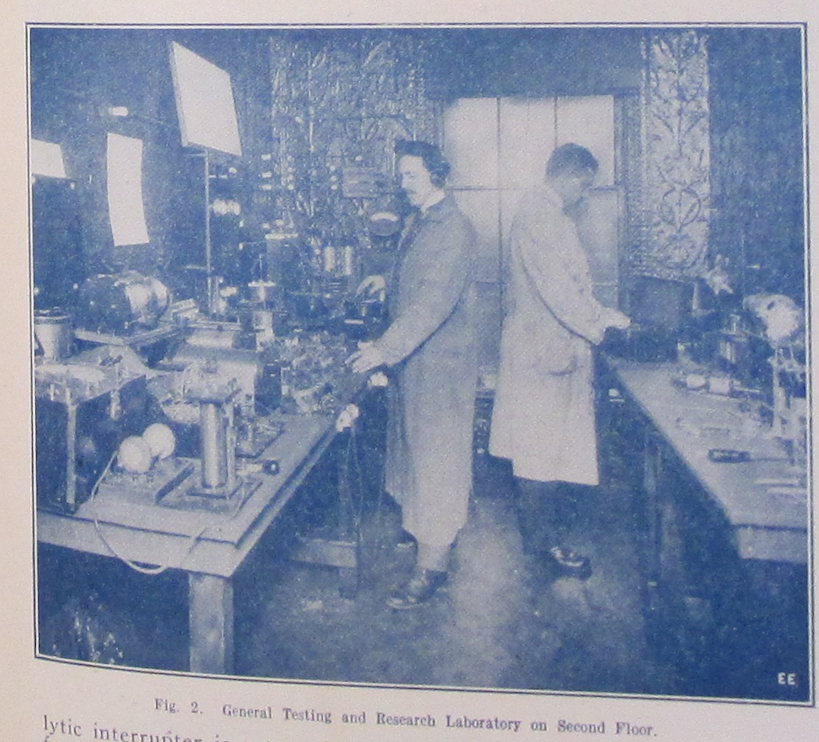

It's the summer of 1906 in downtown Manhattan and Louis Coggeshall hovers over a bucket of dimes in the back room of the Electro Importing Company's retail store, filing them down to a coarse powder.  Sitting amid shelves of electrolytic detectors, circuit switches, ammeters, and Geissler tubes ready for sale to the city's growing community of amateur experimenters, he lets the metal filings fall into a small cardboard box at his feet.  Making a coherer, one of the earliest forms of radio receiver, required a certain amount of culinary improvisation in order to find the proportion of metals that would produce the strongest signal possible.  At the time, dimes were minted on ninety percent silver, so Coggeshall’s next steps were to mix the filings with the perfect ratio of iron powder and finally to pour that mixture into a small glass vial.[^mrc]  When a radio frequency wave comes into contact with this coherer, the metal filings cling together, allowing a signal to flow between electrodes connected to either end of the vial and, depending on how long the telegraph key on the transmitting end of that radio wave is depressed, produce a *dot* or a *dash* in Morse code.  Mounting this final element onto a wooden base dotted with other handmade components, Coggeshall completes the construction of another one of the Electro Importing Company's flagship products: the Telimco wireless telegraph set, a portmanteau of the company's name and one of the first fully-assembled radios ever sold to the American public.^[@_telimco_2002. @gernsback_50_1956.]

[^mrc]:  Marconi's original "recipe" for the coherer called for one part silver to nineteen parts nickel (as opposed to iron).  @lee_nonlinear_2004, p. 4.  Coggeshall, who began his career as a telegraph operator for the Erie Railroad, first met Gernsback at a boardinghouse on 14th Street where they were both staying.  @moskowitz_explorers_1963, 231.  Coggeshall also did the cover art for the first issues of the *Electro Importing Company Catalog.*  @gernsback_old_1938.

Meanwhile in the offices upstairs, the founder of Electro Importing Hugo Gernsback writes increasingly breathless advertising copy for the Telimco, promising it to be a means of upward mobility.  In one issue of the *Electro Importing Company Catalog*---a mail-in marketplace that provided access to "Everything for the Experimenter"---Gernsback claimed that with the Telimco, "We give you the opportunity to tick yourself up to the head of a future wireless telegraph company as did Marconi, De Forest and others."  Priced at $7.50, the set was an attractive proposition from a company who claimed to be "the largest makers of experimental Wireless Material in the world", requiring little more than a working knowledge of Morse code in order to get started.  First advertised in the November 25, 1905 issue of *Scientific American,* the Telimco appeared thereafter every two weeks, quickly becoming one of Electro Importing's best selling items.  In order to reach a wider public, Gernsback---a twenty-one year old Jewish immigrant from Luxembourg who at that point had been in the United States for only two years---visited retailers around the city like Macy’s, Gimbels, Marshall Field's, and FAO Schwartz, giving demonstrations of the device to incredulous salespeople who had no conceptual framework through which to understand “wireless.”  And for good reason: not only was wireless still in its infancy and largely unknown to the public, it was a technology whose successful transmission of information through the air wasn’t fully understood even by the scientific community.  From the physical substrate of metal filings to an entirely new means of communication that would soon be in every home, Gernsback and his colleagues were in the process of transubstantiating one medium into a medium of another kind.

*The Perversity of Things* is the story of a literary genre's emergence.  But it is likely not one that the reader is familiar with.  Hugo Gernsback is remembered today as the founding editor of the first science fiction magazine, *Amazing Stories,* a large-format title printed on thick pulp paper that debuted on newsstands in early March 1926.  *Amazing Stories* gave a name to fiction treating the speculative and the otherworldly through a systematically realist lens:  scientifiction.  And it established a forum for fans of the genre to debate and influence the future of its development.  In recognition of this legacy, Gernsback's name adorns the awards given out each year to the best works in the genre, the Hugo Awards, and many scholars use the launch of *Amazing Stories* in 1926 to date the invention of modern science fiction.  This book is devoted to the idea that the project of science fiction as Gernsback understood it in fact had its origins in an earlier context:  as a series of interlinking devices, debates, and visions shared by a community of tinkerers that formed around Gernsback's electrical supply shop and technology magazines.  Largely thanks to the iconographies and standardized plots codified by *Amazing Stories,* the term *science fiction* today conjures up images of bug-eyed monsters, ray guns, and starships.  But in the opening decades of the twentieth century, before the accretion of a hundred years' worth of narratives, images, and clichés, that which was not yet called science fiction consisted of a number of concrete practices all geared toward a reckoning with technological revolutions in the fabric of everyday life.  Before it was a particular kind of story or plot, science fiction was a way of thinking about and interacting with emerging media.

What began with the *Electro Importing Catalog* and its miscellany of strange devices like the Telimco soon expanded into a number of companion magazines for the amateur tinkerer like *Modern Electrics* (first published in 1908), *Electrical Experimenter* (1913), and *Radio News* (1919).  In these richly illustrated magazines, one could find blueprints for a home-brewed television receiver (well before the technology was feasible) alongside a literary treatise on how scientifiction stories should be structured.  Giving equal space to the soberly technical and the wildly utopian meant that Gernsback's translation of an influential German handbook titled *The Practical Electrician,* for instance, could run alongside a speculative article on what it would take to provide a global system of free electricity powered by ocean currents.  Each issue showcased designs submitted by readers, their own personal "wrinkles, recipes, and formulas" that would be taken up and debated by others through letters printed in subsequent issues, much like the famous letter column in later science fiction magazines.^[For a history of the science fiction fandom that has constituted what Samuel R. Delany calls a "vast tributary system of informal criticism," see @moskowitz_immortal_1974.]  Long before Gernsback founded *Amazing Stories,* these magazines and their readers used speculative thought to find a language suited to the analysis of emerging media like radio, television, or the more exotic osophone and telegraphone.  While Gernsback for better or worse has been enshrined as science fiction's founding figure (fans refer to him as "Uncle Hugo"), less well known are the ways in which he is "the father of American electronic culture," in the words of Franz Pichler, curator of a recent exhibit on Gernsback at the ZKM (Center for Art and Media Technology).[^bwbp]  In order to come to terms with the place from which both of these nascent discourses emerged, scientifiction and media culture, we have to see them as part of a continuum.

[^bwbp]:  Co-curated by Pichler and the media theorist Peter Weibel, this exhibit at the ZKM in Karlsruhe was one of two recent museum showcases of Gernsback's life and work.  The other was held at Luxembourg's National Center for Literature in 2011.  @pichler_hugo_2013.

One of the challenges in recovering an understanding of science fiction *avant la lettre* is the fact that many of the variables its stories revolve around---science, media, and technology---the very subjects and objects of scientifiction, were concepts still very much in flux.  Science as it was understood in the public sphere was a highly variable entity, and had no settled explanations for the accomplishments of new technologies like wireless telegraphy.  These technical media were only just beginning to be understood as *media* in the modern sense of mass communications, and even the term *technology* itself wasn't used in the American English vernacular until the 1920s, as we will see later.^[@guillory_genesis_2010. @marx_technology:_2010.]  The essays that follow, therefore, represent a media theory in the making, in which *media* are addressed not primarily as mass-cultural forms like cinema or television programming, but as the affordances of and possibilities inherent in the smallest individual components:  the selenium-coated plate, the tungsten lamp, the chromic plunge battery.  In his monthly editorials, feature articles, and short fiction, Gernsback pioneered a kind of writing that combined hard technical description with an openness to the fantastic.  Using interleaving descriptive and narrative frameworks to describe a particular device, experience, or vision of the future, Gernsback followed the smallest of technological developments through to their most logical, and sometimes extreme, conclusions:  the increased availability of a light-sensitive alloy implied that the coming of visual telephones was near, and the number of amateurs sending in their own designs for primitive television receivers only served to confirm the imminence of this new mode of communication.

Regardless of how advanced the devices detailed in the pages of *Modern Electrics* and *Electrical Experimenter* seemed---solar cells, automobile mounted radiotelephones, electric keyboards powered by vacuum tubes---Gernsback and his staff reported on them as if they only required a combination of already existing electrical principles and components.  These new media appeared as little more than the sum of individual building blocks that one could pick and choose from of the pages of the *Electro Importing Catalog.*  Even the long-term projections like thought wave recorders and videophones were described as handicraft futures that would come to pass with just a little more tinkering.  As Samuel R. Delany writes,

> The new American SF took on the practically incantatory task of naming nonexistent objects, then investing them with reality by a host of methods, technological and pseudotechnological explanations, embedding them in dramatic situations, or just inculcating them by pure repetition.^[@delany_critical_2009.]

These gadgets appeared so frequently and in such diverse contexts---as props in short stories, as homemade designs in letters to the editor, as profiles of similar developments across Europe---that one gets the sense paging through the magazines that they are all part of a coherent fictional world, built up across many years and many issues.  Given the pace of technological change in the early twentieth century, it seemed as if any one element of this fictional world could bleed into everyday life at any moment.

It's perhaps this penchant in his work to dwell in the extremes of both technical detail and fantastic speculation that accounts for Gernsback's absence in the pages of science fiction studies and the history of technology.  For the former, he is too obsessed with material details and as an editor and writer merely produces stylistically bland lists of technological marvels, what are dismissively referred to as "gadget stories."  For historians of technology, Gernsback's inventions and technical writings are never able to back up their promises, being far too concerned with future contingencies to merit serious attention.  But it's precisely the novel coexistence of these diametrically opposed modes throughout Gernsback's work---radically practical and radically speculative---that led to the explosive popularity of his ideas in several different forums.  Across the thirty-year period covered by this book, the reader will find technical precision and utopian speculation in varying proportions, and articles that toggle from one end of this spectrum to the other with ease.

By this point the American magazine reading public was familiar with the idiom of popular science reportage.  While nineteenth-century scientific periodicals in the United States took the form of highly specialized *Proceedings* or *Transactions* or *Reports* of academic research organizations, the *fin de siécle* saw a proliferation of titles aimed at a much broader audience.  *Scientific American* for instance, the best known of these publications and one that still runs today, attracted a readership that included credentialed researchers, industrial manufacturers, an interested general public, as well as a "nebulous community of inventors (ranging from the local tinkerer to manufacturer and professional inventor/technologist)."  Science in these new magazines was made accessible to a growing number of readers seeking to educate themselves or simply desiring to remain informed about recent developments.[^psci]  But while Gernsback's magazines may seem familiar to us today through their progeny such as *Wired,* *Popular Science,* and *Popular Mechanics* (the latter two of which are the direct successors to Gernsback titles through mergers and acquisitions) in many ways they bear more in common with a deeper tradition of popular science that blurred the lines between illusion and truth, skepticism and belief.  As many historians of science have recently shown, from medieval displays of the natural world's wondrous curiosities to nineteenth-century phantasmagoria and other audiovisual spectacles, "the positive sciences and the fantastic arts [have been] linked in a dialectic of doubt and certainty."^[@tresch_prophet_2011, p. 18; @daston_wonders_1998; @andriopoulos_ghostly_2013; @williams_aesthetic_1995.]  Unseen forces were at work in the miracle of wireless telegraphy, a literally unbelievable technology that meant disembodied thoughts from around the world could be skimmed from the air in the comfort of your home.  If this miracle were possible, what else might be?

[^psci]:  See @whalen_periodicals_1980.  For a history of the view that a scientifically educated public was an imperative for American democracy in the early twentieth century, a period during which the concept of "science" itself was being determined largely by secondary school curricula, see @jewett_science_2014, especially Chapters 4 and 7.

For Gernsback and his staff, rapid developments in the electrical arts made the speculative sciences of antigravitation and "thought waves" seem within reach.  From a belief in the presence of the luminiferous ether, to an argument that gravity is an electrical phenomenon, to the suggestion that humans may be able to tap into the so-called sixth senses of animals, or that the earth's core is made of radium and drives recurring cycles of life's evolution, Gernsback's purportedly "scientific" titles reveled in the extraordinary.^[@gernsback_ether_1916; @gernsback_gravitation_1918; @gernsback_unknown_1920; @gernsback_radium_1916]  And while competing magazines like *The Wireless Age, QST,* and *Popular Science Monthly* were gradually opening up the specialist orientation of the sciences to a wider public through sober reportage, Gernsback addressed a growing readership who found the products of science to increasingly form a bewildering part of their everyday lives, addressing them from this perspective.  "As time goes on it becomes more apparent that our senses are becoming more and more involved directly due to scientific progress," he wrote.  Listing a miscellany of sensory illusions that had become commonplace, from "blazing names being written out in the night sky" by moving electric signs, to the "radio illusion" of reproduced sound, to the simulated effects of motion in new carnival rides, Gernsback warns that "We should never trust our senses too much in these latter days of scientific progress."^[@gernsback_modern_1927.]  Given the rate of this "progress," the reader should not be surprised if the next great scientific advance, seemingly impossible today, should become commonplace tomorrow.  As we will see over the course of Gernsback's writings, this almost spiritual faith in technoscientific progress remains remarkably unscathed in the wake of the First World War and the Depression, a faith that only an American technologist could claim at a remove from the horrors of the trenches and doubling down with the idea that cultural welfare could be technocratically managed by machines and their engineers (**Human Progress; Wonders of the Machine Age**).  "Progress in science is as infinite as time, it is inconceivable how either would stop" (**Imagination Versus Facts**).

But for Gernsback, projections of the future or progress and its wonders were never simply bewildering.  They were the occasion for a material education in the way things worked.  As a reader of and contributor to *Amazing Stories,* G. Peyton Wertenbaker, wrote in a letter to the editor with characteristically pulp prose, "Beauty is a groping of the emotions towards realization of things which may be unknown only to the intellect" (**Fiction Versus Facts**).  The behavioral archaeologist and historian of radio Michael Schiffer refers to Gernsback and his writers as "techno-mancers," arguing that their depictions of wide-ranging futures created a "cultural imperative" for inventors, engineers, and scientists to make these dreams a reality.^[@schiffer_portable_1991, 136]  And in a sense, this is true, with many speculative ideas as described by Gernsback retrospectively seeming like "predictions" of modern technologies (**Television and the Telephot; What to Invent; Predicting Future Inventions**).  But what makes sense as a neat, two-step model for literature as a source of inspiration and invention was actually a much messier process in practice, like a melody played so fast that the individual notes become indistinguishable.[^sfvt]  The Gernsback titles were unique in their willingness to tackle fantastic topics that other publications wouldn't, and did so through the lens of hands-on technical know-how.  Behind the gadgets of **Ralph 124C 41+: A Romance of the Year 2660,** Gernsback's famous serial novel of 1911, was a marketplace of evocative objects, a forum for amateurs experimenting with these strange new things, and an emerging consensus vision of their possible applications.  Over the course of long-running serial novels and the exchange of reader correspondence, the material basis of scientifiction's marvelous futures was gradually refined.

[^sfvt]: This two-part model of invention forms a common thread in science fiction criticism, with the genre providing a think tank of sorts in magazines, novels, and films, continuously replenishing a reservoir of ideas for technologists to draw upon in their own inventive process.  See for instance @disch_dreams_1998;  @shedroff_make_2012.

This book won't attempt to offer an answer to longstanding debates over whether science fiction had its origins in the pulps or is best considered in relation to a deeper tradition of precursors by Mary Shelley, Edgar Allan Poe, Jules Verne, even John Wilkins's *The Discovery of a World Inside the Moone* (1638) or Thomas More's *Utopia* (1516).  Returning to the works of Hugo Gernsback is of course not meant to suggest that the cultural, sexual, and ecological complexities of novels like Samuel R. Delany's *Dhalgren* (1975), Kathy Acker's *Empire of the Senseless* (1988), or Paolo Bacigalupi's *The Windup Girl* (2009) can be directly traced to the techno-utopian texts first published in *Amazing Stories.*  As Carl Freedman writes, "current Anglo-American science fiction draws on far more than the pulp tradition that constitutes *one* of its filiations."^[@freedman_critical_2000, p. 15.]  *The Perversity of Things* instead takes seriously Delany's idea that literature and science fiction are two entirely separate phenomena that obey different rules.  In order to fully understand "a tradition of writers who considered themselves craftsmen first and artists secondarily, if at all," we have to move beyond literary critical frameworks that are poorly suited to thinking about craft, materiality, and collective practice.^[@delany_silent_1994, p. 200.  See also @delany_critical_2009.]  Gernsback's handicraft futures seemed so seductive because they were futures that you, the reader, could build yourself.  With the practice and experience promised by these magazines, the reader could pick up any object and sense its affordances instead of what Gernsback called "the perversity of things."  For Gernsback, objects exert an influence on thought.  The question was how to understand that influence as an inherent promise or beauty, rather than a stubbornness or recalcitrance.  Because the complex things of the modern world seemed to further impinge on daily life with each passing year, it was Gernsback's lifelong project to educate a public in the tenets of "science" through a kind of instinctual know-how or "knack"---a term he returns to in many of his writings---so that they might contribute to the making of things rather than simply being overwhelmed by them.

Unfortunately, the prevailing approach in science fiction studies has been to dismiss the Gernsback magazines as embarrassingly simplistic, tasteless, and even detrimental to the eventual emergence of a mature literature.  This is an ironic and all-too casual judgment of a Jewish immigrant who throughout his life was in search of a respectability as a technologist and editor that always seemed to elude him.^[For a history of the relationship between Jewish identity and science fiction, see @fingeroth_disguised_2009.]  A certain tone seems to have been set early on by the spectacularly racist H.P. Lovecraft's monicker for Gernsback: "Hugo the Rat."  The overwhelming attention that many science fiction critics give, to this day, to the low rates he paid his writers (a common source of tension between *all* pulp writers and their editors) leads to a misplaced derision of Gernsback's literary quality that often carries with it an explicit disgust at his perceived character.[^asmt]  One can be forgiven for wondering why so much attention is given to bankruptcy proceedings, profits, and wages in works of literary historical scholarship.  In the meantime, entirely overlooked has been the way that the overlapping publics attracted to Gernsback's magazines opened a space for voices that were otherwise explicitly occluded from public discourse.  As Steve Silberman has shown, "Both amateur radio and science fiction fandom offered ways of gaining social recognition outside traditional channels."^[@silberman_neurotribes:_2015.]  These magazines promised a populist education in new scientific and technical principles that would offer social inroads for wage laborers hoping to secure middle class careers, women who took advantage of the anonymity of Morse code and the power to reach an audience of countless listeners from home, as well as those "who found it nearly impossible to communicate through speech," a neurological condition we might associate today with autism.

[^asmt]: For Brian Stableford, Gernsback's "cowardly" launch of *Amazing Stories* was "purely a commercial adventure, which Gernsback undertook because he thought his existing subscription lists might help establish a secure commercial base for such a magazine."  @stableford_creators_1997.  Malcolm J. Edwards argues that Gernsback “bestowed upon his creation provincial dogmatism and an illiteracy that bedeviled US SF for years."  @clute_gernsback_1995, p. 491.  Richard Bleiler sees him as "a disastrous (if not a pernicious) figure, a man whose stultifying vision and lack of literary taste led to the establishment of a literature that for too many years was considered a laughingstock, that emphasized other elements than literary quality, and, perhaps worse [sic] of all, that paid the majority of its writers badly."  @grossman_hugo_2011.

*The Perversity of Things* thus seeks to provide a reappraisal of the communities of amateur experimenters that participated in the emergence of new technologies in the early twentieth century, the "hard" technical roots of American science fiction, as well as the highly imaginative orientation toward media technologies that was prevalent during this period.  Science fiction in its early days wasn't just a literary form, it was a mode of interacting with and understanding media.  For media studies scholars, many of the forms of argumentation and analysis in the pages that follow may seem familiar in ways that suggest a kind of pulp media theory may constitute a forgotten point of origin for today's academic discipline.  The literary historical gambit of this book is to recover the radical sense of openness that greeted not only the basement tinkerer working through the feasibility of transmitting images over a wire, but also the author of scientifiction stories who possessed a highly sophisticated awareness of the fact that "Two hundred years ago, stories of this kind were not possible" (**A New Sort of Magazine**).  Often, these individuals were one and the same, weaving together functional and fictional devices in a manner that served for them as a form of scientific discovery in itself.  This isn't the story of an Edison or a Jobs, inventors whose creations for better or worse have changed the way we inhabit the world.  Gernsback's career left us with a way of participating in that change, imagining its possible futures, and debating which future it is that we should live in.  This is the story of the development of a community, of a series of practices and a way of approaching the technologized world.

"up-to-date technic":  Hugo Gernsback's Pulp Media Theory
===================================================

Born Hugo Gernsbacher in 1884, the third son of German émigrés to Luxembourg, Gernsback was raised in Hollerich, a tiny suburb of the nation's capital.  His parents, Moritz and Bertha Gernsbacher (née Dürlacher), raised him in comfortable circumstances thanks to Moritz's successful wine wholesaling business.  Growing up off the grid (Hollerich wasn't yet connected to Luxembourg City's new electricity network), the young Gernsback's passion for technology began with the battery after a handyman employed by his father, Jean-Pierre Görgen, taught him at six years old how to wire a series of bells to a Leclanché cell.  Gernsback recalls being instantly enchanted by the bell "ringing amid a shower of wonderful green sparks," and would soon acquire a reputation for wiring homes and businesses in the area with telephones and these ringers.^[@oneil_amazing_1963. @gernsback_old_1938.]  According to a story he often told later in life, Gernsback received special permission from Pope Leo XIII at thirteen years old to enter the Carmelite convent of Luxembourg City to install a series of electric call bells for the nuns there.^[@siegel_hugo_1988, 16.]

Though this story is partially verifiable through a certificate of thanks from the Convent found by the Luxembourgeois Centre National de Littérature, it's worth pointing out here that the portrait of Gernsback's life we are left with in the historical record consists largely of a series of self-propagated stories that border on braggadocio:  that a police officer intruded on the Electro Importing Company offices to interrogate them for fraud with the Telimco set in 1906, for "no wireless combination could be sold at this low price"^[Reportedly, the officer shot back after the demonstration: "I still think youse guys is a bunch of fakers. This ad here says that you are selling a *wireless* machine. Well, if you do, what are all them wires for?" @gernsback_old_1938.]; that Gernsback coined the term "television" in his December 1909 editorial **Television and the Telephot** (he didn't); that his recommendations were incorporated "word for word" into the Radio Act of 1912 (while the recommendation was, the wording wasn't---see **The Alexander Wireless Bill** and **Wireless and the Amateur**).  Once the influential science fiction historian and Gernsback's friend Sam Moskowitz recorded these stories in his many profiles of Gernsback, they became established as gospel truth, with Moskowitz playing the apostle to Gernsback's prophecies.  Evidence contrary to or even in excess of the received doxa is hard to come by, with many press and literary critical accounts barely rephrasing Moskowitz's prose.^[Beginning with @moskowitz_hugo_1959.]

We do know that despite the precociousness of his youth, Gernsback was by most measures a terrible student, falling at the bottom of his class at an industrial school near home from the ages of twelve to fifteen.  When he left to attend the Technikum in Bingen, Germany (now the Fachhochschule Bingen) from seventeen to eighteen, he regularly skipped classes and received poor grades in all subjects save electricity and physics.  It was during these teenage years that Gernsback acquired a penchant for gambling with the money he earned doing various electrical jobs in poker games, though his tendency to be cleaned out by older players seemed to keep him from falling too deep into this habit.^[@henzig_hugo_2010, 15.]  Outside of school, Gernsback was drawn to American culture from an early age.  He was a fan of John Philip Sousa's military marches and even composed his own patriotic Luxembourgish piece in the style of Sousa titled *Rǒd, Wêis, Blo* that continued to be performed by the Military Band at the Place d'Armes in Luxembourg into the 1930s.^[@henzig_hugo_2010, 15-16.]  He was a devoted reader of cowboy stories and was such a fan of Mark Twain that he wrote a now-lost novel of his own at seventeen, *Der Pechvogel,* under the name Huck Gernsbacher.  But it was stories of the otherworldly that truly fired his imagination.  Reading the astronomer Percival Lowell's book *Mars* at the age of nine, with its fusion of the hard sciences and speculation about alien life, served as Gernsback's introduction to the literature he would later come to think of as a distinct genre of scientifiction.  He dove headfirst into the work of Jules Verne and H.G. Wells, claiming to have nearly memorized many of their novels while still very young.^[@moskowitz_explorers_1963, 229.]

Despite his predilection for journeys into unknown frontiers, whether the American West or Martian canals, Gernsback remained tied to his home even after leaving, if not physically---there is no proof he ever returned---then through a meticulous self-fashioning.  Gernsback cultivated a distinctively (one might say distinctively unique) Luxembourgish identity throughout his life.  Though raised by German parents, he grew up in Luxembourg at a moment in which the tiny country's national identity was becoming more developed than ever before.  The anti-German sentiments of Gernsback's editorials and short fiction published during World War I (especially **The Magnetic Storm**) largely echo the growing importance already sensed by "a good part of the Luxembourgish people at the end of the Nineteenth century to demarcate between [Germany and Luxembourg] when faced with the more or less well marked pan-Germanic designs of Germany."^[@henzig_hugo_2010, 19.]  But the many identities attributed to Gernsback throughout his life -- he is described variously in the press as Prussian, German, Belgian, French, a "multilingual dandy"---also seemed to allow him a kind of ambiguity that he relished.^[@oneil_amazing_1963.]

> In the era of tie-dye and sandals, Gernsback continued to dress like a visiting dignitary. For evenings on the town, he favored formal wear, including spats, an opera cape and an expensive silk homburg. He even affected a monocle, though he didn't really need it.^[@stashower_dreamer_1990.]

Hiding just beneath this severe exterior, according to Sam Moskowitz, was a sharp sense of humor:  "The truth is that Gernsback socially is a man of almost rapier-like wit, with a mischievous gleam in his eyes and with the rare ability to joke about his own misfortunes."^[@moskowitz_explorers_1963, 235.]  Throughout his life, friends and colleagues noted Gernsback's relentless energy and the way that it seemed to sweep up everyone around him.  Visions completely out of step with his surroundings seemed to fall out of him wherever he went.  A distant relative recalls a 1910 visit from Gernsback on his way to Chicago to purchase new equipment for Electro Importing.  When a ringing telephone interrupted one of his many stories of "robot doctors, retirement colonies on Mars, domed cities orbiting Earth," Gernsback (who had arrived in a horse-drawn carriage) reminded his seven-year-old niece as she ran toward the receiver, "Hildegarde, fix your hair. It won't be long before the caller can see your face over the telephone wires."^[@stashower_dreamer_1990.]

Throughout his youth, Gernsback's parents never approved of his interest in electrics, and especially didn't see it as a viable career choice for him.  But when his father Moritz died at the age of 57, Gernsback sensed that it was time to branch out on his own.  In February 1904, he emigrated to New York by himself at the age of 19, appearing in a photograph wearing an elaborate three piece suit aboard the S.S. Pennsylvania on his way across the Atlantic.^[@henzig_hugo_2010, p. 40.]  Perhaps inspired by his first experiences with that Leclanché cell as a boy, Gernsback carried with him the design for a new kind of dry cell battery whose electrolytic paste could replace the inefficient liquid of wet cells like that of the Leclanché.  Having been denied patents in both France and Germany for the battery, Gernsback decided to try his luck in the United States.  A year later, he began publishing on his ideas, with his first printed article appearing in *Scientific American* again under that most American of names, "Huck" (**A New Interrupter**).  He was able to sell his battery technology to the Packard Motor Car Company, who ended up using the device in their ignition systems.  With the profits of his sale, Gernsback formed the Electro Importing Company, an importer of specialized electrical equipment from Europe and one of the first mail-order radio retailers in the country.  Through their catalog and retail store at 84 West Broadway, the company provided access to specialized wireless and electrical equipment not found anywhere outside of Europe.  Electro Importing catered to a diverse clientele, first manufacturing the Telimco in 1905 for their novice users, and providing their more advanced amateur experimenters with the first vacuum tube offered for sale to the general public in 1911.

After several issues of their mail order catalog and a growing subscription list, Electro Importing began including features, editorials, and letters to the editor. Between 1906 and 1910, the catalog evolved into a monthly magazine for the wireless homebrewer, *Modern Electrics* in 1908.  The transition from the mail-order catalog to the monthly magazine format was a smooth one, evidenced by the fact that the third and fourth editions (1907 and 1908) of the Electro Importing catalog bears the title of the new full-format magazine, "Modern Electrics."  The offshoot Experimenter Publishing Company, founded in 1915, published expanded how-to manuals, pamphlets, and complete books like *The Wireless Telephone,* *One Thousand and One Formulas,* and *The Wireless Course.*  While *Modern Electrics* still advertised the equipment Electro Importing offered for sale in a familiar grid layout with ordering instructions, it also included feature articles detailing the latest research into experimental media technologies in America, throughout Europe, and in Gernsback's own company offices.  Each 36-page, 6 x 9.5" issue sold on newsstands for ten cents and contained regular reports from E.I. Co. employees like Harry Winfield Secor and René Homer, who would contribute to Gernsback titles for years to come.  Some freelancers attributed their decision to pursue science as a profession to their experiences with *Modern Electrics,* as did Donald H. Menzel, later director of the Harvard Observatory, who earned money for college by writing for the magazine.^[@oneil_amazing_1963.]  Lewis Mumford, the architectural critic, philosopher of technology, and author of the now-classic *Technics and Civilization,* published his first piece of writing at the age of 15 in the same issue of *Modern Electrics* that carried the first installment of Gernsback's serial novel *Ralph 124C 41+.*  And computer scientist John McCarthy was inspired to pursue his profession by reading Gernsback's standalone how-to pamphlets.^[@silberman_neurotribes:_2015.]  Celebrity guest contributors like Lee De Forest, and later Thomas Edison and Nikola Tesla in the pages of *Electrical Experimenter,* raised the profile of the magazine among a readership hoping to emulate the success of these famous inventors.^[Tesla first published his autobiography in serial installments in *Electrical Experimenter,* a book that was recently republished by Penguin Classics. @tesla_my_2011.]  Regular dispatches and photographs printed on the magazine's quality stock from the unnamed Paris, Berlin, and Brussels Correspondents kept readers informed on developments in television, wireless telephony, and the use of novel electrical apparatuses in film and theatrical productions, each of which would go into a great degree of technical detail.  

But the hallmark of the magazine became its more speculative articles, those that were willing to extrapolate fantastic scenarios out of the technical details at hand.  Gernsback and his contributors wrote as if the more detail a particular technology's description contained, the more plausible were the projections of its future possibilities.  There was a way in which the future stood as the horizon of technical description.  As Mumford wrote in his autobiography, "In my youth, as a zealous reader of Hugo Gernsback's *Modern Electrics,* I shared my generation's pious belief in our future."^[Quoted in @westfahl_hugo_2007, 62.]  With **Signaling to Mars,** for example, Gernsback detailed the conditions that would have to be met in order for Earth to send messages via wireless telegraph to the red planet.  The quantitative description of the transmitting apparatus in terms of its necessary output (a gargantuan 70,000 kilowatts) and best time of year to signal (summer) only constitutes one aspect of this scenario.  Gernsback goes on to take into account the nature of Martian intelligence that would be necessary for such a communicative circuit to be completed:

> we can only hope that the Martians are further advanced than we and may signal back to us, using a method new to us and possibly long discarded by them, when thousands of years ago they stopped signaling to us, and gave us up, as we did not have intelligence enough to understand.^[Continuing in the tradition of astronomers Percival Lowell and William Henry Pickering---the latter of whom offered a similar proposal on the front page of *The New York Times* to communicate with Mars using a series of mirrors---the projection of Martian technology (not to mention ecology) provided a topos upon which readers might asses the direction of its terrestrial analogues.  See @_planned_1909.]

For readers of *Modern Electrics*, the technical context in which this highly speculative article appeared only lent credence to an idea as fanciful as the one that contact with an alien civilization was right around the corner. In the copy of this issue at Princeton University's Firestone Library, someone inserted a newspaper clipping (now a permanently affixed leaf within the bound volume) that tells of a new distance record for wireless signaling, from San Francisco to the Pacific Mail Line steamship Korea as it made its way across the ocean. Left there as if to vouch for the plausibility of the idea that we'll soon be able to connect with our nearest planetary neighbor, the clipping provides a wonderful sense of how it was people read these magazines.[^clp]  Though the Gernsback titles eventually became notable for some of their more outlandish claims---that electric current might clean us better than water, that the success of a marriage can be predicted using gadgets assembled out of various household supplies---they were always presented through a lens of supposedly scientific rationality. This frame affected the reception of the magazines by their readers, the design ethos that grew up around them, and the kind of fiction they eventually produced.

[^clp]: While I haven't been able to determine the provenance of this particular clipping, other articles reporting on the Korea's distance signaling record were published in the *New York Times*on November 8, 1909 and the *Boston Evening Transcript*, November 6, 1909.

From the earliest of the Gernsback titles, we find science configured as an instrumentalized form of technological achievement that bore little relationship to what was happening in laboratories.^[For a theoretical overview of the relationship between science and technology, as well as an intellectual history of the intermediary term "applied sciences," see @alexander_thinking_2012.]  Contrary to the common division between the purely theoretical nature of the sciences and their application in the development of new technologies, Gernsback argues that science and invention are part of a continuum in a later editorial for a magazine of that title:

> The word *Science,* from the Latin *scientia,* meaning knowledge, is closely related to *Invention,* which, derived from the Latin *inventio,* means, finding out.  There is little in Science that did not at one time require some inventive powers, while conversely most of the world's inventions are based upon one or more of the sciences.  (**Science and Invention**)

This article is a key of sorts for the many valences *science* can take throughout the Gernsback magazines.  Science is the sum of its many products progressively connecting the modern world, a hybrid of science and technology that saw no distinction between theories and their application.  It is defined as what the average person understands of its growing presence in their daily life:  "science no longer is the sombre book closed with seven seals.  Quite the contrary, it is the public that popularizes science---not our scientists."  It is even configured as a form of belief when Gernsback argues that skepticism is an entirely unscientific attitude:

> But our *real* scientists are as backward as in Galileo's times.  The public applauds and instantly believes in anything new that is scientific, whereas the true scientist scoffs and jeers, just as he did in Galileo's times when that worthy stoutly maintained that the earth moved and did not stand still.

In many ways, this starry-eyed fanaticism for science as the sum of its progressive advance in the material world reflects the way in which the public discourse was shifting on a larger scale as science entered mass market newsstands, corporate research facilities, and public school classrooms.  As John Rudolph has argued, it was during this period that the "scientific method" emerged not among professional or academic researchers but in secondary school pedagogy:

> while the manner in which practicing scientists went about their work (the research strategies they used, their modes of inquiry, norms of argumentation, etc.) changed relatively little if at all from the 1880s to the 1920s, portrayals of the scientific method in American schools underwent a marked transformation.^[@rudolph_epistemology_2005.] 

If science was a highly variable concept for Gernsback, discourse surrounding its application was just as muddled.  *Technology* was a word largely unknown to the English speaker, which should also complicate the way we read these essays.  So, for instance, when Gernsback writes in 1922 that "steam, electricity, and up-to-date technic have completely altered not only the face of the globe, but our very lives as well," the usage of the word *technic* where we might expect something like *technology* reflects an important terminological confusion at the time (**10,000 Years Hence**).  In nineteenth-century English, according to Eric Schatzberg, *technology* referred to "a field of study concerned with the practical arts; except in anomalous usage, [it] did not refer to industrial processes or artifacts."  Just as sociology names the study of society, technology was the science of technique, making, the useful arts.  Somewhere around 1930, Schatzberg argues, 

> new meanings derived primarily from the writings of American social scientists who imported elements of the German discourse of *Technik* into the English term technology, thus shifting the latter from its original definition as the science or study of the useful arts to a new one that embraced the industrial arts as a whole, including the material means of production.^[This masterful history of the interrelated concepts of *Technik,* technology, and technique, is highly recommended.  @schatzberg_technik_2006.]

Science and technology for Gernsback are collapsed into one another, meeting somewhere in the middle as the thoughtful use of tools and making.  This highly materialist understanding of science was foundational for Gernsback's later conceptualization of scientifiction.

Hoping to build on the success of *Modern Electrics,* Gernsback sold the magazine to the competing publisher of *Electrician and Mechanic* and launched a new title in May 1913: *Electrical Experimenter.*[^psmm]  Continuing the work that began with *Modern Electrics's* monthly radio set building contest and correspondence section, *Electrical Experimenter* introduced several new ways for readers to participate.  A section called "The Constructor" included tips for the home workshop, like a technique for tightly winding a spark coil using a hand-cranked drill.  The "How-To-Make-It Department" offered prizes for designs submitted by readers that specifically "accomplishing new things with old apparatus and old material," such as an alarm that activated a simple electric bell in the house when a mailbox's door was opened and closed.  The "Electrical Magazine Review" provided a roundup of news recently published in other electrical magazines like *Electrical World* and London's *The Electrician,* while the "Patent Advice" column offered input on inventions that readers hoped to patent at the price of $1 per question.  By May 1918, the magazine had reached a circulation of a hundred thousand copies per month, almost doubling *Modern Electrics's* readership seven years previously.

[^psmm]: *Modern Electrics* continued under new ownership as *Modern Electrics and Mechanics* for two years before acquiring and taking on the name of *Popular Science Monthly* in April 1915, a magazine whose publishers were looking to update the format it had run since 1872: reprints of European science periodicals with little to no illustration.  Under the editorship of Waldemar Kaempffert, the new *Popular Science* tried to increase its readership with short-form writing, dense photo spreads packed onto every page, and a far more generalist approach to "science."  One would now find articles on developments in criminology, warfare, and motion pictures in a magazine that only a year earlier covered entomology, evolution, and pathology.  It continues to be published today.  For an overview of Kaempffert's editorial philosophy, see @kaempffert_vision_1916.

Paging through the print run of the *Electrical Experimenter* across the 1910s is like watching the activities of a quirky group of hobbyists grow into a mass cultural phenomenon.  Over the course of its publication, Gernsback and his staff gradually widened their focus from the highly specialized electrical arts of *Modern Electrics* to a range of topics geared more toward the general public.  As "recipes, wrinkles, and formulas" were joined by sensational depictions of future technologies, Gernsback changed the magazine's tagline from "The Electrical Magazine for the Experimenter" to "The Electrical Magazine for Everybody."  By the decade's end, the title was completely rebranded as *Science and Invention,* a change that once again nearly doubled the magazine's circulation to almost 200,000 copies per month.^[*Science and Invention* continued for another decade before being bought out by the Chicago publisher of *Popular Mechanics* and merged into that title with the September 1931 issue.  It is still published today.  @ashley_gernsback_2004, p. 189-90.]  The new look was accompanied by a significant change in editorial policy, proceeding from the idea that the image is the most effective way to communicate complicated scientific information to the public.  

> All of our departments, as you will note, have been reduced to pictures and captions, with the exception of our scientific fiction stories which for the time being will run on as usual.  The reason is that the average man or woman does not wish to laboriously wander through miles of text of scientific facts, which means concentration and study. . . . *we have tried to reduce all scientific matter to entertainment instead of study.* (**The 'New' Science and Invention**)

Gernsback's visions were lent a shape and a color thanks to two new illustrators who were able to "illustrate difficult subjects in such a way that words really become superfluous," as Gernsback put it in the previous editorial.  Though Howard V. Brown's career as a cover artist spanned a variety of subjects and techniques -- his work appeared everywhere from from *Scientific American* to *Argosy All-Story Weekly* to the children's magazine *St. Nicholas* -- the signature of his Gernsback covers was the Rockwellesque way he was able to tell the story of an entirely speculative technology through facial expressions and dramatic gestures.^[@gustafon_brown_2015.]  Seemingly familiar domestic scenes, detailed in vividly realistic brush strokes, were punctured by the presence of a strange apparatus and became the starting point for conversations on how a technology of the future might function.  It was in no small part due to the vivid illustrations that readers were so drawn to these visions of the future.  As a character in Robert A. Heinlein's 1940 short story "Requiem" says, he was one of those fans "who thought there was more romance in an issue of the *Electrical Experimenter* than in all the books Dumas ever wrote."^[Quoted in @erisman_stratemeyer_2000.]

The shape of media to come took on an iconography all its own through the illustrations of Frank R. Paul.  Trained in Vienna, London, and Paris as an architectural draftsman, Paul is known for his exquisitely detailed cityscapes as well as the bug-eyed monsters that would later adorn the covers of *Amazing Stories.*^[@moskowitz_explorers_1963, 234.]  Gernsback greatly respected these artists's realist futurism, writing that it was their ability to fire the imagination of the reader that was one of the most important components of his magazines:  "It is no easy matter to think out new things of the future and illustrating them adequately by means of expensive washdrawings or three-color cover illustrations.  Indeed, there is nothing more difficult connected with the publication." (**Imagination Versus Facts**)

As the magazines in which they appeared gained a wider following, these images began to circulate far beyond their original venues.  Plans for the Osophone, a device Gernsback designed to replace headphones by transmitting sound through vibrations in the jawbone of the listener (**Hearing Through Your Teeth**), were published and reviewed in the German journal *Der Radio-Amateur.*^[@nesper_osophon_1924.  For the history of *Der Radio-Amateur* magazine, see @sarkowski_springer-verlag_1996.]  Paul's sketch of a man using a tuning fork to calibrate the speed of the 1928 *Science and Invention* Nipkow disk television receiver was republished the following year in the Chinese film journal *Yingxi zazhi* (*Shadow Play Magazine*) as an illustration of recent research into television, what was referred to in the article as, directly translated, "wireless cinema."^[@bao_sympathetic_2011. Bao located Paul's illustration of the *Science and Invention* television receiver in @shen_dianyingjie_1929. The term for television used in this article is "wuxian dianying (wireless cinema, or, more literally, wireless electric shadow, or radio shadow)." Paul's images were originally published as the accompaniment to @gernsback_radio_1928.]  Many more  articles from *Electrical Experimenter* and *Science and Invention* were translated into French, German, Italian, Spanish, Japanese, Dutch, and Arabic, circulating widely along with their illustrations.^[@_this_1919]  Gernsback even published a Spanish-language edition of *Radio News* from March 1926 through April 1927 titled *Radio Internacional.*

It's the wide currency of these images then and now (especially as they're given new life as retrofuturist visions circulating on Twitter and Tumblr) that perhaps has resulted in the description of Gernsback for better or worse as a "prophet" of the future.  Unfortunately, this approach tends to flatten out the richness of his work into a list of the impressively early dates by which he had described the coming of technologies like in vitro fertilization, the transistor radio, atomic war, education by video, and telemedicine.  Gernsback himself seemed to enjoy the continued notoriety these predictions brought him (yet another reason why, in writing about him, we have to be careful to cut through the self-image he crafted).  In a sense, their sheer number is of course impressive, as it was for Arthur C. Clarke who dedicated his *Profiles of the Future: An Inquiry Into the Limits of the Possible* "to Hugo Gernsback, who thought of everything."[^prdt]  Though many of these ideas were in the air at the time, Gernsback simply had a knack for tuning in like no other, for distilling the essence of a technosocial development from a cloud of diverse possibilities into a sleek, attractive form.

[^prdt]: Moskowitz lists the predictions in *Ralph 124C 41+* alone: "Fluorescent lighting, skywriting, automatic packaging machines, plastics, the radio directional range finder, juke boxes, liquid fertilizer, hydroponics, tape recorders, rustproof steel, loud speakers, night baseball, aquacades, microfilm, television, radio networks, vending machines dispensing hot and cold foods and liquids, flying saucers, a device for teaching while the user is asleep, solar energy for heat and power, fabrics from glass, synthetic materials such as nylon for wearing apparel, and, of course, space travel are but a few." @moskowitz_explorers_1963, 233.

But descriptions of Gernsback as a prophet miss the way in which these imminent futures felt so close to hand thanks to a collective endeavor among contributing writers, assistant editors, illustrators, and readers.  Throughout his writings, Gernsback relies on input from readers, quoting them sometimes at great length.  As his magazines began to grow in both number and circulation, Gernsback increasingly delegated work to assistant editors like T. O’Conor Sloane, C.A. Brandt, Wilbur C. Whitehead, and Charles Hornig.  While Gernsback wrote under a number of pseudonyms for *Modern Electrics* when he still didn't have many contributors, over time this situation was apparently reversed, with "Gernsback" operating as a kind of collective editorial voice by the time of the science fiction magazines in the late 1920s.  As Justine Larbalestier writes, 

> Gernsback did not necessarily write all or even the majority of the editorial comments during the periods in which he was the publisher and editor of such magazines as *Amazing Stories* and *Wonder Stories* [1926-1936].  However, such is the mythic force of Gernsback, the founding father, that in the majority of the work I have read on this period he is spoken of as though he wrote every word of editorial comment in the magazines he published.  ‘Gernsback’ has come to operate as synonymous with the magazines he founded, whether he was actively contributing to them or not.^[@larbalestier_battle_2002, p. 17.  Larbalestier cites @tymn_science_1985 and @clute_encyclopedia_1995.]

In one of the few existing interviews with Gernsback's editorial staff, Charles Hornig claimed in 1986 to have written the editorials while editor of *Wonder Stories,* as well as "handled 'The Reader Speaks' letters section, wrote all the blurbs and captions, and chose the work of all artists except for Frank Paul."^[@davin_conversation_1999.  Hornig, who grew up in poverty, gained the attention of Gernsback as the editor of a fanzine and was hired as assistant editor at the age of seventeen.  He remained with *Wonder Stories* until Gernsback sold it to Beacon Magazines in 1936.  Out of a job and still just nineteen years old, Hornig "bought a large-sized paperback entitled *100 Ways to Make a Living.*  In the thirties everybody wanted desperately to make a living, so it was a good seller.  I thought I ought to be able to find one way that worked out of a hundred.  The book had pictures and descriptions of all kinds---you could invent your own chemical formulae, invent products to sell, and whatnot."]  There is no telling how much of a hand Gernsback had in writing any of these later articles, from offering up his often clunky, non-native prose for editorial revision, to suggesting the idea of a piece to one of his assistant editors, to simply allowing his staff full discretion.  Manuscript versions at the Hugo Gernsback Papers in Syracuse and in the possession of private collectors show that he did, in fact, author material for the technical magazines in longhand with little revision before the articles went to print.  But following Larbalestier and other science fiction critics, I think that it's important to continue "allowing 'Gernsback' to stand for the house editorial voice" not just as a convenient shorthand, but as a means of tracing the many-voiced, overlapping discourses on making, fiction, and science that emerged in these magazines over their thousands upon thousands of pages.^[@larbalestier_battle_2002, p. 17.]  Whether Gernsback wrote every word of the later articles bearing his name or merely provided editorial guidance, we are left with the record of a new kind of conversation on technology.  Gernsback, about whom we know little outside of the self-propagated myths, is thus best understood as an embodiment of this moment that falls between the gaps of literary and technological history, a distillation of what was in the air.  To make Gernsback synonymous with his magazines, each of which was highly responsive to the interests and activities of its readership, is to follow the voice of a community that developed over the course of three decades.

"'phone and code": Communities of Inquiry and Wireless Publics
=======================================================

"We are constantly being speeded up mentally," writes Gernsback in 1923 with the concision of a Marshall McLuhan aphorism (**Are We Intelligent?**).  Understanding media was one of the primary goals of these magazines, not just from the perspective of the expert experimenter but also of the bemused end user.  "Everything we are doing now is too cumbersome. . . . Our lives are crowded to such an extent, that it is impossible to read as much as our grandfathers could."  Sensory environments had become so packed, so distracting, that it was time to find a better medium to communicate complex information to the public.  During this period, as Susan Douglas has shown, "the press’s method of covering and interpreting technological change was developed.  In other words, what scholars have identified as the functions of the mass media in the late twentieth century were being formulated and refined during the first twenty-three years of radio’s history."^[@douglas_inventing_1987, p. xix.]  It's no mistake that Gernsback explicitly refers to the magazine itself as a "medium" capable of matching the new speeds at which people took in the world (**A New Sort of Magazine; The 'New' Science and Invention**).  His publications, his ideas, and his prose were purpose-built to move fast in a pulp environment with short deadlines and low overhead, and it was for this reason that they were uniquely suited to the analysis of rapidly shifting media conditions.  While this speed sometimes results in seeming contradictions and an all-too hasty embrace of the new, it also contributes to an inviting sense of openness for a diverse community of inquiry.  A core set of his essays take up the question of where new media come from, as well as how ordinary people could participate in the conditions of their emergence rather than feeling like they had been swept up in their wake.

Many writings in this collection will leave the reader with a sense that media "evolve" according to their own logic.  In **Is Radio at a Standstill?,** Gernsback makes a striking media historical analogy between the supposed threat that the rise of radio broadcasting posed to established phonograph manufacturers, and the impact of the “eliminator” (a lighter, more portable, and rechargeable source of power developed in the mid-1920s) to conventional battery manufacturers.  In the model that Gernsback outlines here of the historical cycles that the technology industry goes through, competing formats do not replace but rather force one another to find their own unique attributes, simply as a matter of survival.  In his media historical writings, Gernsback often speaks of the "perfection" of an apparatus, a question of medium specificity he almost always raises through the lens of viable business models.  Despite his penchant for projecting far-flung futures, Gernsback was often remarkably conservative when it came to the specifics of precisely how long such perfection would take, and what it would mean for developments in emerging media like wireless and television.  Given the small sample size of these very young histories, there was little the technologist had to go on when thinking about the stable, almost Platonic forms that might emerge from the parallax interplay of rapidly changing technologies and new cultural forms.  As he writes in **Edison and Radio**:

> The radio industry today is only five years old, and it may safely be predicted that when it becomes as old as the phonograph is today we shall hardly be able to recognize it as the same development.  It is admitted that radio is not yet perfect.  Neither is the phonograph, nor the automobile, or motion pictures, nor electric lights; nor, for that matter, a pair of shoes.

Not only was the concept of "wireless" itself---and later "television"---a moving target for its early adopters, but also for legislators who scrambled to craft regulatory frameworks for information in the air.  Gernsback's magazines avidly followed broadcast policy debates, and much of the power of their arguments against regulation derived from an understanding of media technologies as highly fluid entities that no legislation could hope to keep up with:

> Radio has always been able to take care of itself, and will continue to do so in the future.  To be sure, we all want a radio law to straighten out some of our present tangles, but in the end radio engineering will make the best law obsolete.^[@gernsback_broadcasting_1926]

In the years leading up to World War I, when Gernsback was most active in organizing communities of amateur experimenters against proposed federal broadcast regulation, the magazine's staff had to rely on significant amounts of conjecture in reporting on developments that took place largely behind closed doors between the US Department of Commerce and Labor and various private entities:  "all of this maneuvering that could have so altered American communications and culture transpired behind the scrim of corporate confidentiality, not to be made public until scholarly investigation decades later."^[@wu_master_2010, p. 80.]  Nevertheless, *Modern Electrics* was able to recommend best practices for wireless amateurs so that the community could avoid drawing the scrutiny of regulators (**The Wireless Joker**), play nicely with government stations whose apparatuses were "three years behind time" and whose manners were even worse (**The Roberts Wireless Bill**), as well as make technical recommendations on frequency allocation that were later incorporated into Congress's Wireless Act of 1912 (**The Alexander Wireless Bill**).  The Electro Importing Company began publishing it's annual *Blue Book* in 1909, a telephone book of sorts that listed the names and call signs of amateur wireless operators around the country, and later, the world.  Its presence was designed to encourage greater accountability for the content of wireless messages once the names of their senders were shared openly and freely (**Signaling to Mars**).  In addition, Gernsback and his associates formed **The Wireless Association of America** in 1910, an education and outreach organization that ended up training many of the wireless operators that the Navy would need once the U.S. entered the Great War in 1917, one of whom even developed a means of recording clandestine German U-boat commands that were being relayed through a New Jersey wireless station, unbeknownst to the American government (**Sayville**).^[See also @wythoff_invention_2014.]  With the outbreak of the war, the Navy outlawed all amateur wireless broadcasting activities and took sole control of the airwaves.  *Electrical Experimenter* thus became a community forum for frustrations over this policy, as well as a drawing board for what broadcast regulation should look like once the war was over.  While the positions taken up by contributors to and readers of the Gernsback magazines don't amount to a full-scale regulation policy, their arguments against hasty legislation that restricted the rights of everyday users were a series of reactions to conditions on the ground that are very much reminiscent of advocates for free and open-source software today.

So, while at certain moments Gernsback evokes the seeming perversity of emerging media that allowed them to evolve as if according to their own internal logic, at others it was clear that communities of users were driving the developments in these new cultural forms in a way that would make any existing, and likely future, legal frameworks obsolete.  In this sense, the merits of one detector over another were far less important than the new kinds of connection they made possible.  Similar to the approach Gernsback took to many other ideas, this difference in emphasis didn't necessarily happen over a certain period of time or unfold in any sort of linear fashion.  While there were of course the signature themes that he returned to throughout his career, Gernsback's media theory doesn't constitute a rigorous, internally consistent philosophical system.  Writing two, sometimes three or more articles a month meant that he was firing off ideas as they came to him, ideas that were picked up and discarded as utility demanded.  For this reason, it's not quite accurate to describe these variations as contradictions.  Instead, they reflect the thinking of a tinkerer, comfortable with fragments and capable of applying any one of multiple perspectives to a single issue.

When Gernsback's writings weren't emphasizing the material specificity of wireless as a means of understanding the shape that medium might take in the future, they were describing it as an inherently ethereal meeting place of people from around the globe.  In "the most inspiring example of the triumph of mind over matter" (**A Treatise on Wireless Telegraphy**), simple minerals like zinc and copper could be harnessed to transmit the self, live across the ocean.  "We are now on the threshold of the wireless era, and just beginning to rub our intellectual eyes, as it were" (**Wireless Association of America**).  Wireless promised constant contact between friends, family, and complete strangers regardless of location.  "The radiophone," he wrote using another short-lived name for radio before the fact, "will link moving humanity with the stationary one" (**The Future of Wireless**).^[Gernsback continues to use the term "radiophone" as late as 1923, signaling an understanding of radio as a point-to-point means of interpersonal communication even as the national broadcast networks were flickering to life.]  In other words, developing "wireless tele-mechanics" meant that even people driving in automobiles could maintain a conversation with someone sitting at home.  "In our big cities thousands of ears listen every minute of the day to what is going on in the vast ether-ocean" (**War and the Radio Amateur**).  The announcement of the annual *Blue Book* not only promised more and more citizens of the ether popping up on the map with each passing year, it appeared alongside Gernsback's feature on sending and receiving wireless signals from Mars, making it seem as if soon we will even be able to look up our Martian friends in the universal wireless directory.

As Gernsback welcomed these newly minted citizens of the ether stepping "out into the star-lit night and myriads of voices" (**Amateur Radio Restored**), one wonders throughout his writings just how inclusive this global village of amateur experimenters was in practice.  Though Gernsback himself is remarkably silent on all questions regarding race, gender, and class---perhaps in an effort to avoid alienating any potential readers---his magazines' advertisements for radio parts, books, and professional schools largely addressed a male audience.  The most vocal participants in the technology magazines' correspondence section, and thus their most immediately visible readers, were roughly 16-24 year old men, who often equated the pursuit of science with masculinity itself.  As one reader commented, pursuing radio as a hobby "stills a thirst for scientific knowledge and hence stimulates manhood" (**Who Will Save the Radio Amateur?**).  But this doesn't mean that other demographics weren't reading and using Gernsback's magazines.  Eric Drown has convincingly argued that historians of science fiction have "repressed the working-class accents of pulp SF and been content to characterize it as a form of children's literature justly and rapidly replaced by a more mature form of 'speculative fiction.'"^[@drown_business_2006, p. 28]  Drawing on Michael Denning's scholarship on the complex relationship between writers and readers of nineteenth-century dime novels in which "mostly middle-class writers ventriloquized the working-class accents of their readers to advance their views of the world," Drown reminds us that the common dismissal of these texts as "semi-literate" and "adolescent" constitutes a serious misunderstanding of the complex voicings of hourly laborers seeking the promise of secure, middle-class occupations through the "scientific" education these magazines provided.

> . . . readers were largely but not exclusively wage-earning people who describe themselves in letter columns as students, engineers, radio operators, amateur scientists, mill hands, office workers, salesmen, lathe operators, enlisted men, and government bureaucrats. While there was a significantly visible contingent of precocious mostly middle-class boys among the letter-writers, most readers were the adults who provided the routine intellectual, clerical, mechanical and physical labor that made the new mass production economy function.^[@drown_business_2006, p. 8.]

Further, this community may have been more heterogeneous than is initially apparent on the surface of the magazines.  Steve Silberman identifies wireless amateurism as a haven for voices that may have otherwise been excluded from public discourse:

> The culture of wireless was also a strict meritocracy where no one cared about what you looked like or how gracefully you deported yourself in public.  If you knew how to set up a rig and keep it running, you were welcome to join the party. . . . [It] also enabled shy introverts to study the protocols of personal engagement from a comfortable distance. “Through amateur radio . . . I’ve learned so much about communication between people.  I’ve had the opportunity to observe and participate in the giving and getting process, which is what communication is all about,” recalled Lenore Jensen, who co-founded the Young Ladies’ Radio League in 1939 to encourage more women to join the conversation.^[@silberman_neurotribes:_2015.]

Highly scripted conversational formats and the anonymity of code allowed for a neurodiversity and gender inclusion within this community that is difficult to recover from the pages of Gernsback's magazines alone.  One has to read *Electrical Experimenter* against the grain to find the presence of women, for instance.  But there are several notable examples in reports from contributors, including profiles of Maria Dolores Estrada, a refugee of the Mexican civil war turned licensed wireless operator, and Graynella Packer, "the first woman wireless operator to serve aboard a steamship in a commercial capacity."^[@_mexican_1917.]  A woman identified as "Mrs. Alexander MacKenzie" used her son's wireless outfit in the service of the New York Women's Suffrage Party's twenty-four-hour election night demonstration in November 1915 to make speeches and relay messages "from various celebrities and other suffragists."^[@_feminine_1916.]  And the "Autobiography of a Girl Amateur" offers an anonymous account of one woman's success in attaining a respected status among the wireless community by never revealing more about herself then her call letters, which she of course doesn't give up in the article.^[@_autobiography_1920]  This archive demands further digging.

Though it is indeed rare that women make more than a cameo appearance in the pages of these magazines, one *Science and Invention* editorial by Gernsback makes clear that they played a vital role at virtually every level of the magazine's production.  A 1928 issue opens with a fanciful tale in which King Outis VII of Erehwon, a great fan of the magazine, visits the offices of Experimenter Publishing to witness how the magazine is made.  He meets with editors, artists, advertising staff, linotypers, compositors, proof-readers, the binding department, and photographers.  Following the supply chain even deeper, Gernsback introduces the King to the "chemical houses who furnished the chemicals for making the pulp and bleaching it," the coal mines that made possible the steam to make that sulfite pulp paper, even the hens that laid the eggs "used in the photo-engraving process to supply albumen."  When the King finally asks "who all the pretty girls were that had clustered together in one aggregation," 

> We informed him immediately that they were secretaries, stenographers and typists, as well as editors and proofreaders and many others who had directly to do with the production of the magazine.  The firm that did the composing had several dozen girls that performed various jobs in connection with the magazine.  The printer had a number of girls who were either bookkeepers or stenographers, through whose hands passed the bills for the magazine, and the same was true of practically every other industry connected with the production of the magazine.^[@gernsback_magazine_1928.]

Rarely made visible in the content of the magazines themselves, women were there at every stage in the process of their production, from the chemical supply houses to the newsdealers, even if Gernsback can't conceptualize this contribution as anything more than the circuits that connect and regulate all of the magazine's material inputs and outputs.^[For a history of the influential role women played in periodical publishing throughout the nineteenth century, see @harris_blue_2004.]

Given the potential diversity within the overlapping communities of wireless amateurism and later science fiction fandom, Gernsback's techno-utopianism seems somewhat empty.  To what end was this future progressing, and who got to make decisions about the direction it took?  In many ways, Gernsback's faith in the ceaseless advance of technological progress (he would write in **Wonders of the Machine Age** that "science fiction is based upon the progress of science; that is its very foundation.  Without it, there could be no science fiction") makes his late flirtation with the short-lived political movement of Technocracy seem inevitable.  Technocracy blossomed in the United States during the Depression with its plan to put engineers and skilled technologists in charge of the government.  While American socialists were reading Marx, the Technocrats took their inspiration from Thorstein Veblen, the American sociologist who advocated in *The Engineers and the Price System* (1921) for a more equitable form of price management through what he called a "Soviet of Technicians."  These engineers and technically educated managers would be able to govern more effectively the production and equal distribution of energy, goods, and quality of life than capitalist bureaucrats or politicians were capable.  His ideas were picked up by Howard Scott, a leading figure in the movement who formed Technocracy Inc., an organization whose "militaristic demeanor, its rigid hierarchal structure, its special insignia, its special salute, its grey uniforms, and its fleet of grey automobiles" raised the eyebrows of more than a few observers during fascism's spread across Europe.[^wbxo]

[^wbxo]: @segal_technological_2005, p. 123.  Harold Loeb, another leading proponent, headed up the rival Continental Committee on Technocracy and wrote the utopian roadmap *Life in a Technocracy: What it Might Be Like* (1933), a book that advocated a theory of value based on units of energy.  For Howard Segal, Technocracy and other associated efforts to forge a better society through technology (e.g. the New Machine, the Technical Alliance, the Utopian Society of America) marked a shift in the 1920s and 30s in utopian thinking from the possible to the probable.  For more on the Technocracy movement, see @bell_veblen_1991 \[1963\];  @akin_technocracy_1977.

Gernsback's short-lived *Technocracy Review* attempted to serve as a forum for the exchange of Technocratic ideas.  This bimonthly magazine lasted only for two issues, and Gernsback himself attempted to remain entirely neutral in its pages save for the argument that machines have throughout history created more jobs than they have taken.[^bn2i]  But Gernsback's career-long project to provide a complete education in science and technical principles for the masses was fundamentally incompatible with Technocracy, in which there was absolutely no place for public participation.  As Langdon Winner describes it, 

> In the technocratic understanding, the real activity of governing can have no place for participation by the masses of men.  All of the crucial decisions to be made, plans to be formulated, and actions to be taken are simply beyond their comprehension.  Confusion and disorder would result if a democratic populace had a direct voice in determining the course the system would follow.  Science and technics, in their own workings and in their utility for the polity, are not democratic, dealing as they do with truth on the one hand and optimal technical solutions on the other.^[@winner_autonomous_1978, p. 146.]

[^bn2i]:  The argument is developed in **Wonders of the Machine Age.**  The inaugural issue of the *Technocracy Review* (February 1933) contained articles by Howard Scott ("Technocracy Speaks"), Paul Blanshard ("A Socialist Looks at Technocracy"), William Z. Foster ("Technocracy and Communism"), and Gernsback's assistant editor David Lasser ("Technocracy---Hero or Villain?").

Though Gernsback tried not to be overtly political, and he rarely formulated his positions as such, his gestures toward community participation, grassroots education, and social mobility were anything but apolitical.  Sometimes this simply meant taking a step back from the bleeding edge of increasingly corporate innovation.  Throughout **Radio for All,** a book designed to transform a novice readership into a polity of wirelessly connected citizens, Gernsback purposefully uses what were by then slightly outmoded (and thus simpler to understand) components in all of his examples.  Daniel Czitrom describes this approach to educating a new public in the very technology that would constitute their awareness of themselves *as* a public as Gernsback's "hardware socialism."^[@czitrom_dialectical_1987.]  At other times, this meant promising that anyone, even an immigrant with no professional credentials and little formal education like himself, could produce inventions that were beneficial to social progress for all.  "Gernsback’s electric futurism was a variation on progressive thought," writes Eric Drown.^[@drown_usable_2001, p. 81-2.]  Above all, Gernsback was determined, in the words of Andrew Ross, that *science* "would not be associated with exclusive rhetorical idioms or with obfuscatory accounts of the object world by over-accredited experts.  For Gernsback, scientific language was a universal language of progress that ought to be accessible even to those without a college degree."^[@ross_strange_1991, p. 111.]

Unfortunately, the rapid progress so valued by Gernsback in the electrical arts ended up rendering obsolete the circuits of amateur cooperation and frugal ingenuity he helped institute.  By the 1920s, large corporations hoarded patents with the support of the federal government, research and development became an increasingly formalized institution, and these hybrid public/private entities were able to draw on capital that no independent amateur could hope to compete with.  Gernsback's picture of popular scientific education and homespun innovation weren't always able to adapt quickly enough.  Of course, not everyone could transform themselves into an Edison, Marconi, or Tesla.  But the truth of what amateur experimenters were actually capable of is often more interesting than Gernsback's incongruous fantasy of socially contingent, lone genius inventors.

"'phone and code":  Dynamophone, Radioson, and Other Emerging Media
================================================================

The early twentieth century is commonly seen as a transitional period in American invention, from a reliance on the work of independent, almost mythologically brilliant inventors to corporate-based industrial research laboratories.  For radio historian Hugh Aitken, the most meaningful development in the emergence of radio---the move from the spark gap to continuous wave transmission, which allowed the broadcasting of voice and audio rather than simple telegraphic code---happened at this "hazy boundary where radio stopped being a matter for visionary experimenters and started to become a hardheaded business capable of gaining and holding a commercial market."^[@aitken_continuous_1985, p. 9-10.]  But recent scholarship has explored the ways that the corporate model was both preceded by older forms of collaborative invention, as well as accommodated independent inventors who worked well into the twentieth century.  Historian of technology Eric S. Hintz argues that despite the commonly accepted story, independent inventors continued to be a source of viable ideas well after the "heroic" era of inventors like Thomas Edison and Alexander Graham Bell:

> . . . lesser-known "post-heroic" inventors continued to contribute many important innovations throughout the twentieth century, among them [Samuel] Ruben's mercury battery, Edwin Land's Polaroid film, and Chester Carlson's Xerox photocopying process. . . . There is certainly no denying the importance of science-based R&D at firms like GE, AT&T, and DuPont, but vertically integrated industrial research was not the only path to successful innovation.  Small and medium-sized firms often pursued innovation strategies---licensing independent inventors, hiring consultants, and outsourcing inventions---that were much different from the ones followed by bigger firms.^[@hintz_portable_2009, p. 26-7, 56.  See also @hintz_post-heroic_2011 for a chart showing that patents issued to independent inventors outnumbered corporate patents until 1933 and "still represented nearly 50 percent of total patents throughout the 1950s."]

Muddling the distinctiveness of this transition from the other side is Paul Israel, who shows that many of the developments in telegraph technology throughout the 19th century were the product of a machine shop style of collaborative problem solving "in which skilled operatives, superintendents, machinists, and manufacturers make up technological communities that draw on practical experience to design, build, and refine new technology."^[@israel_machine_1992, p. 2.]  In this shop culture,

> few inventors actually worked alone and none worked in complete isolation.  Conceptualization was often stimulated by access to new information.  And the construction, testing, and redesigning of apparatus necessary for practical application almost invariably required an inventor to seek the assistance of others, whose own contributions often altered the original design.^[@israel_machine_1992, p. 57.]

Much like the wrinkles and questions shared by wireless amateurs in the Gernsback magazines, these nineteenth-century craftsmen communicated through trade journals like *The Telegrapher: A Journal of Electrical Progress* (1864-1877).  Indeed, the communities making use of Gernsback's magazines, perhaps in spite of the rhetoric they contained, are yet further evidence of collaborative development forming a continuous tradition from the mid-nineteenth century on, calling into question whether there ever was anything like the mythological, lone inventor.

Falling somewhere in the middle of this collaborative versus individualistic divide, Gernsback framed his writings on the development of new devices in terms of amateurism.  A recurring argument in his editorials throughout the 1920s had it that the next great innovations, like television, would come not from corporate laboratories, but from the avant garde of enterprising amateurs who could afford to take risks and try out wacky ideas (**Why the Radio Set Builder**).  But these amateurs were up against an establishment that was rapidly consolidating its power.  After the federal government took control of the airwaves during World War I and assumed ownership of all wireless patents in order to aid the war effort, RCA was formed as a partnership between the government, General Electric and the Marconi Wireless Telegraph Company of America in order to continue advancing radio technology in the interests of national security (**Silencing America's Wireless; Radio Enters a New Phase**).^[@wenaas_radiola:_2007, p. 29.]  "As a result," Andrew Ross writes, "the explosive age of industrial invention lay in the past, viewed as much too volatile in its effects for the scientifically regulated process of production favored by monopoly capitalism.  The new emphasis on control, precision, uniformity, predictability, and standardization meant the extinction of the entrepreneur-inventor."^[@ross_strange_1991, p. 124.]  Radio amateurs could feel the effects immediately, with the number of radio parts dealers in the US (as opposed to consumer-ready, complete radio set retailers) falling from an estimated 30,000 in 1922 to 2,500 in 1926.^[@massie_hugo_2002.]  At the same time, the coming of continuous wave transmission and vacuum tube sets meant not only that radio was becoming increasingly complex for the average amateur, but exploding in popularity among an American public who could comfortably listen in to nightly broadcasts.  Seemingly overnight, radio was firmly cemented in American life as an everyday piece of household furniture.  Not only were radios rapidly spreading into homes across the country after the so-called "radio Christmas" of 1924, but the legislative frameworks that would determine the structure of American broadcasting were finally being hammered out.^["More than ten times the number of tube sets were manufactured in 1925 than just two years earlier, and four times as many speakers as in 1923."  @douglas_listening_1999, 78.]  No longer was wireless the province of technically savvy experimenters chatting about whatever came to mind, it was big entertainment.

Given this situation, it was an interesting time for a new magazine to emerge as the voice of radio amateurism.  While *Electrical Experimenter* had begun as a specialized companion magazine for tinkerers, by 1918 it owed its 100,000 issue per month circulation to an increasingly general focus.  A magazine whose tagline was "The Electrical Magazine for the Experimenter" became "The Electrical Magazine for Everybody."  It later changed its name to *Science and Invention* in 1920 and began covering a much wider array of developments across the sciences.  In order to maintain a relationship with his original readership of experimenters, Gernsback launched a new title, *Radio Amateur News* (later shortened to *Radio News*) in 1919.  *Radio News* became the new home for hands-on readers, a magazine that took seriously the role of the independent experimenter throughout the 1920s, when, in Gernsback's words, "In all of the laboratories of our large industrial companies, research scientists are busy, day and night, in inventing and perfecting new devices."^[@gernsback_garrett_1928.]

In a 1923 editorial for *Radio News,* Gernsback touches on the anxieties among his readership about the role of the amateur in a world of increasingly professionalized engineering and invention.  Explicitly issuing a challenge to this group, he argues that the amateur is nothing if he isn't seen and valued by the public.

> Of what real use is the amateur of today?  What does he really do to make the world a better place to live in?  Of what use is he to the community at large?  If the amateur will ask himself these questions, and search his heart, he will come to the conclusion that, indeed, his utility is microscopic. . . . *As far as the public is concerned, the radio amateur does not even exist.* (**Who Will Save the Radio Amateur**)

The response from a passionate readership was swift.  "The amateur's work is valuable," argues one reader with the conviction that tinkering is not play but important "work."  Another recommends the approach of a "public-minded amateur," who hosts concerts, relays news, weather, and other useful information for free to small neighborhood gatherings.  Still another suggests forming an Amateur Radio Research League whose sharing of expertise and ideas in "miniature laboratories" might be able to compete with the large corporations.  I have seen many different editions of these magazines in various university and personal archives, and it is clear from the many issues containing underlines and annotations, scribbles in the margins from readers working out measurements, and relevant newspaper clippings attached to the pages, that this was a highly active readership.  Some readers couldn't afford the components detailed in the experiments and diagrams published in *Radio News.*  But as one writes in a letter to the editor, "You can better realize what these magazines mean to me when I say that I seldom, if ever, get a chance to have the material to experiment with, so I must content myself with reading matter, and I do like to read, especially such a wealth of material as is combined in the pages of your three publications."^[@stephens_opinion_1925.]  These readers counted themselves as experimenters simply by reading the magazines.

Though Gernsback's collaborators and readers in many ways felt left out of the broadcast boom, *Radio News* remained a beacon for tinkerers around the world who knew that their homebrewed sets were far superior to the average RCA or Westinghouse radios sold in department stores.  Gernsback argued that it was the amateurs forming the true vanguard in the advance of the radio "science."

> The set builder naturally is well able to compete with the manufacturer, for two reasons. First, his time costs him little, and in price, therefore, he can compete easily with the factory-made set. Secondly, he has the jump on the manufactured set for the simple reason that, as like as not, his circuit is the latest out, and, therefore, will have improvements that the manufactured set can not boast for some months to come.  (**Radio Enters a New Phase**)

One incredibly fruitful area of experimentation for the amateurs focused on the short wave portion of the radio spectrum, which was initially deemed useless by government regulators and commercial operators.  Amateurs discovered in the early 1920s that short waves were easily reflected off the ionosphere, and could travel great distances around the globe with small antennas and very little power (**The Short-Wave Era**).  Gernsback started an entirely new magazine devoted to this field in 1930, *Short Wave Craft.*^[The evolution of titles for *Short Wave Craft* reflects a history of technologies in which "craft" was seen to be applicable.  It became *Short Wave and Television* in 1937, *Radio and Television* in 1938, and was finally folded into *Radio Craft* in 1941.]  As the previously speculative dreams of television came closer to fruition, Gernsback founded *Television News* in 1931.  In his first editorial for this magazine, he emphasized that large corporations---who by necessity had to be depended on to produce these incredibly complex and expensive prototypes---were actually stifling competition by "jealously guarding whatever improvements are made, because these large firms naturally wish to come out with a complete set that can be sold ready-made to the public."  Continuing his argument that communities of amateur tinkerers who openly shared their results were a necessary element in the development of new media, Gernsback adds:

> Everyone knows that, the more people who are working on an art, the more rapid the progress will be in the end.  Many improvements in radio have been due to experimenters who started in a small way and, later on, became outstanding figures in radio. . . . The more experimenters and the more television fans who become interested in the art, the quicker it will advance and the sooner it will be put on the stable basis which it deserves.

Unlike *Modern Electrics* or *Electrical Experimenter,* *Television News* attempted to serve as the voice of a community of amateur experimenters that had not yet come into being:  "To this purpose I am dedicating this new publication, and the future will demonstrate the correctness of the assumption."^[@gernsback_television_1931.]  The idea that amateurs would eventually offer the world some of the most important contributions to the development of television was perhaps one of Gernsback's most far-flung science fictions, with many articles having simply to begin with a definition of what, precisely, television even was.  One of Gernsback's articles slightly lifts Edison's now famous patent language for the phonograph, in saying that "television does for the eye what the telephone does for the ear."[^tvqt]

[^tvqt]: For a reading of Edison's speculative description of cinema before the fact, see @gunning_doing_2001.  Gernsback's entire definition reads:  "To the layman who does not as yet know what television is, I may say that the term describes an electrical process, whereby it is possible to see at a distance and to view distant events as they are taking place.  In this way television does for the eye what the telephone does for the ear.  Your friend, using the telephone, talks to you from his office, while you are sitting in yours; while the television process is comparable in that you will see your friend as he is talking to you, and, vice versa, he will see you."  @gernsback_television_1927.

But the unfounded optimism of the idea that amateur experimenters were the engine of emerging media became clear by the end of the decade.  *Radio News* announced in January 1929 that it would end its monthly "constructional prize contest" due to a lack of quality submissions.  In the initial announcement to the contest, Gernsback reminded readers that their ideas must be experimentally demonstrated:  "It is not the idea, *but the putting of it into execution,* that makes a man an inventor.  In addition to this, most purely theoretical ideas are impracticable."^[@_radio_1928.]  It seems that with the complexities of consumer radio by 1929, too few amateurs were capable of realizing their ideas in any material way:

> The rules of the contest stated very plainly that no one would be eligible for a prize unless some experimental work had been done and the practicability of the device had been demonstrated by the builder.  Most of the entries consisted merely of ideas or suggestions, accompanied by the request that *Radio News* do the experimental work necessary for their full development.^[@_end_1929.]

Perhaps sensing this problem, Gernsback had already begun focusing on older technologies in recommendations for what to build.  During a period of such rapid change in radio manufacture, new applications of older technologies was a form of dissent for tinkerers.  Designs for cheaply-made, easy to reproduce components like **The Radioson Detector** could rival the newer, industrially produced vacuum tube sets in that they were cheaper, easier to fix, and most importantly, easily understood by most home experimenters.  In a move that is perhaps unexpected for a technofuturist like Gernsback, he even begins to temper what he saw as a boosterish fervor over the rapid developments in radio.  Despite this seemingly overnight explosion, Gernsback writes in 1927, “there have not been any revolutionary improvements in radio and it is likely there will not be any."  Instead, people should expect a long process of gradual refinement:

> It is this process of slow evolution that we may expect in the future, as well, and the old adage also holds true in radio: "Natura non facit saltum"---which, translated, says that Nature does not make jumps.  In other words, all developments are part of a slow-moving plan of evolution.  Even revolutionary inventions, when they do come along, will be found in the end to be not half as great a departure as they were thought to be at first.^[@gernsback_coming_1926.]

Taking the longer view allowed Gernsback to read current inventions in light of their not so distant precursors, profiling forgotten (and often quirky) paths not taken in the development of emerging media.  In many of his editorials, the history of media is evoked not merely as a nostalgic trip back to the devices of yesteryear, but as an archive of possibilities ripe for future experimentation.  For instance, in another 1927 editorial, at a moment in which music and variety programs were flooding the country, the medium of radio had become a fixed idea in people's minds that papered over the inherent abilities of the underlying technology.  Looking back on that strange trajectory in which the technology underlying wireless telegraphy became "radio," a presence in virtually everyone's daily life, Gernsback writes, "the public at large is not aware of the fact that the art of radio is used for hundreds of different purposes aside from broadcasting and telegraphy. . . .  There is hardly any industry today that cannot make use of radio instruments in some phase of its work."^[@gernsback_radio_1927.]  His examples range from a force-field burglar alarm to automating the recording of lightning strikes, from measuring the minute weight of a fly to scanning factory workers for stolen metals.  This wasn't merely a historiographical move, to remind us that the inherent features of wireless---information transmitted through the air---have now been scattered by the winds of media evolution in a way that influences countless other devices.  In articles like **New Radio 'Things' Wanted,** Gernsback encouraged amateurs to remix and retrofit old technologies in order to imagine what the next great advance in radio might look like.  Pieces like this both educated an increasingly interested public on precisely how this technology worked, as well as sought out new paths forward that may have been overlooked.

One of the examples of media historical curiosities listed by Gernsback in this editorial is **The Dynamophone,** his own invention from 1908.  First published as a set of instructions in *Modern Electrics,* the Dynamophone setup involved a telephone mouthpiece connected to the transmitting end of a Telimco and an engine to the receiving end, so that the "power" of the human voice could be used to start that engine.  "While it was at that time but a toy," Gernsback wrote in the 1927 retrospective, "the apparatus foreshadowed broadcasting, because this was before the days of the wireless telephone, and the human voice actually did create effects at the receiving end."  This was a clever workaround:  at a time when the voice couldn't be *transmitted* via wireless, perhaps it could at least be *translated* into a form of electrical or mechanical force.  Just like the affective voice of a news bulletin or an operatic tenor transmitted over the airwaves in the late 1920s, the 1908 Dynamophone used the power of the human voice to "create effects."  While Reginald Fessenden had already produced an elegant solution to the technical problem of using radio waves to produce frequencies in the audible range with his discovery of the heterodyne principle, in which two electrical waves of different frequencies can amplify one another, Gernsback's Dynamophone was a kind of metaphorical resolution to the same problem.^[For a discussion of heterodyning, see the annotations in **The Dynamophone.**]  It was a trickster solution to one of the biggest stumbling blocks in the history of radio.  Gernsback, like many of the amateurs he represented, is perhaps best understood not as an "inventor," but a tinkerer whose idiosyncratic know-how lent his creations a quirkiness, a sense of humor.

Gernsback's own activities as a tinkerer were conducted alongside his publishing endeavors, beginning with the Electro Importing Company's main factory and office building at 233 Fulton Street, now on the site of Ground Zero, in the *Modern Electrics* days.  Alongside Coggeshall, Harry Winfield Secor, and his brother Sidney Gernsback, Hugo manufactured not only traditional electrical equipment like telephone parts and headphones, but far more speculative devices.^[@_e._1915]  The magazines often read like lab reports detailing the progress made in these experiments in a way that opened them up to suggestions from the community, and the operative principle behind new devices like were demonstrated through experiments that could be easily reproduced at home.  **The Physiophone** introduced a means of transforming the music from a phonograph record into rhythmic pulses that could allow people with hearing impairments to enjoy music.  Other, more farfetched creations like **The Isolator,** an oxygen-filled, soundproof helmet that aided concentration, were interspersed with the more serious proposals.

Experimentation continued when Gernsback founded WRNY in 1925, a medium-range broadcast station operating out of New York that was used to debut new broadcast media and analyze the effects of various instruments and signal processing techniques on the auditory perception of the station's listeners.  Several articles cover these experiments, including a live radio concert broadcast that included one of the earliest electronic keyboards in history, developed at the successor to the E.I. Company, Radio News Laboratories.  **The Pianorad** looked like an automobile engine with a horn attached to the end, covered in radio tubes that looked like engine cylinders, with each tube controlling a single note on the keyboard.  WRNY is also notable for conducting one of the earliest regular television broadcasts on record, using a unique method of interleaving audio and visual signals across a single frequency (**Television and the Telephot**).^[The *New York Times* printed an announcement that WRNY would begin regular television broadcasts.  During an otherwise regular radio broadcast, the image of the performer's face was sent out periodically throughout the program.  @_wrny_1928.]  While conducting these groundbreaking experiments, Gernsback kept developments at WRNY open to the contributions and participation of his readers.  Regardless of how advanced the devices seemed---solar cells, automobile mounted radiotelephones, electric keyboards powered by vacuum tubes---his staff reported on them as if they only required a combination of already existing electrical principles and components.[^2b9d]

[^2b9d]: WRNY was short-lived.  In 1927, under the guidance of then-Secretary of Commerce Herbert Hoover, the newly formed Federal Radio Commission included WRNY in its list of 164 smaller-scale stations who had to justify their existence or be forced to shut down.  Tim Wu:  “In effecting its program of clearing the airwaves, the agency relied on a new distinction between so-called general public service stations and propaganda stations.  These were, in effect, synonyms for ‘large’ and ‘small’ respectively, but it was apparently easier to assault the underdog if one could label him a propagandist, even though the term’s present pejorative sense would not take hold until used to describe communications in Nazi Germany.  In any case, by whatever name, the FRC favored the large, networked stations affiliated with NBC (and later CBS).  Because the large operators had superior equipment, and fuller and more varied schedules, the FRC could claim not implausibly that they better served the public.”  @wu_master_2010, p. 83.]

While Gernsback always opened up the work done in his labs and later at WRNY to the public, he often does so in describing a finished device that would be offered for sale in subsequent issues of the same magazine.  This often makes the mode of address confusing, as it is in **The Radioson Detector.**  What begins as an objective description of a new wireless component seems eventually to boil down to a product pitch.  Indeed, the Radioson would be advertised for sale from the Electro Importing Company in competitor publications in the coming months.  But the level of detail Gernsback goes into here is unique, making this essay not just a product announcement, but a detailed discussion of how the device is constructed and the decisions that went into its design.  This is surprising, especially given that the intense commercial competition to improve on detector technology "meant that there often was a great deal of secrecy about technical details."^[@thackeray_when_1983.]  One wonders then who Gernsback is pitching this device to, and why.  If the Radioson is such a valuable advance in radio technology, why would he share the detailed blueprints for his design for the cost of a magazine issue?  

I think these pieces and others like them are best considered as a proof of concept for a growing group of "electrics" hobbyists.  The Telimco, for instance, was not exactly the revolutionary device that first brought radio to the masses Gernsback later liked to claim it was.  Though its advertisements claimed the set was "guaranteed to work up to one mile," the Telimco was notoriously finicky.^[@_wireless_1905]  As it was sold, the outfit had a range of merely 300-500 feet and could only receive signals from further distances when a large antenna was hooked up.  Further, it was highly susceptible to any kind of electrical interference, such as the elevator motor in the Electro Importing Company building, which caused difficulties during in-store demonstrations of the apparatus.  The Telimco's untuned circuits, which would produce a high degree of interference for any nearby radio station, would soon be outlawed by federal legislation.  For these reasons, its metal filings coherers "had all but disappeared from commercial work in 1910" according to historian of early radio Thomas White.^[@white_pioneering_1996]  From this perspective, the Telimco seems less a practical means of communication than the promise of its future iterations.

So while in essence, the Telimco was little more than a gimmick, a parlor trick---press a button and a bell in another room would ring without the need for any intervening wires---it was also a rough prototype, an aggregate of handmade components that encouraged and enabled a conversation on what the wireless medium may look like in the future.  The technical limitations of the device as it then stood didn't stop Gernsback from describing how thousands of perfectly synchronized home wireless sets would be capable of sending a message to the aliens that surely must be listening for us on Mars (**Signaling to Mars**).  Or months later, laying out in great technical detail how it would be possible to send and receive motion pictures over the airwaves using currently available equipment (**Television and the Telephot**).  The Radioson and the Telimco were two of countless artifacts profiled in the Gernsback magazines that blurred the lines between the real and the imaginary.  While some were awarded patents and others were available for sale, others seem more like branding exercises or rallying calls for a community of active amateur experimenters to run with the as-of-yet unrealizable idea.  More often than not, these above categories bleed into one another.  Above all, Gernsback thought that the best way for new ideas travel was to make them public, and allow others to "fork" or "version" his hardware so that the idea could grow faster.  While the work of these amateur experimenters in the aggregate may not have been technically responsible for ushering in the futures Gernsback loved to claim he had predicted, they formed a collective endeavor to find the material means of realizing ideas that were still, as of yet, physically impossible.

"certain future instrumentalities”: The Mineral Proficiencies of Tinkering
================================================================

Media theorists have been attempting to devise a conceptual language for an object that is collectively imagined before the conditions of its material possibility, from André Bazin's writings on the pre-cinematic myth of total cinema ("The concept men had of it existed so to speak fully armed in their minds, as if in some Platonic heaven, and what strikes us most of all is the obstinate resistance of matter to ideas") to Friedrich Kittler's description of occult traditions and late-eighteenth-century magic lantern shows as a "relay race from illusionists to engineers."[^ap32]  For his part, Gernsback was able so successfully to outline the material possibility of an invention before it existed thanks to his understanding of tinkering as a practice through which we might catch glimpses of the future.  While Thomas Edison would respond to Gernsback's question about the future in their interview (**Thomas Edison Speaks**), "You know, Mr. Gernsback, I am an inventor, and as such I do not concern myself overmuch with philosophical research," for Gernsback, invention was every bit a matter of this so-called "philosophy" of the future.

[^ap32]:  See @bazin_myth_2005, p. 17.  @kittler_optical_2010, p. 101.  @gunning_doing_2001.  @batchen_burning_1999.  In a similar vein, John Guillory writes that "this peculiar latency is characteristic of discourse about media from the sixteenth to the later nineteenth centuries. . . . The transposition of writing into print did not elicit at first a theoretical recognition of media as much as a reflection on the latency of print in the technology of writing itself. It was as though print were there, already, in the medium of writing. This is how Bacon understands print in the New Organon: 'the technique of printing certainly contains nothing which is not open and almost obvious.' Bacon explains that 'men went without this magnificent invention (which does so much for the spread of learning) for so many centuries' because they somehow failed to notice that letters and ink might be used for inscription with a different instrument than the pen, namely 'letter types' inked and pressed on paper, an ingenious form of endlessly reproducible writing."  @guillory_genesis_2010, 324.

Take for instance *Electrical Experimenter's* January 1916 "Wrinkles, Recipes, and Formulas" section.  Amid instructions for a homemade heliograph printing process, all the way down to a recipe for concocting the ink, there appears a curious piece by Gernsback that recommends the reader try biting a sewing needle tightly between his teeth while holding the sharp end to the groove of a phonograph record:

> With a little practise one will become proficient in moving the head at the same ratio of speed as the ordinary reproducer arm is moved from the outside of the record towards the inside. As soon as the needle touches the record with sufficient pressure, the inside of the head will be filled immediately with music exceedingly loud and clear. A curious result of the experiment is that a person standing near by can bear the music, the head acting as a reproducer in this case.  (**Hearing Through Your Teeth**)

The experiment may have seemed familiar to those who had just read the latest installment of Gernsback's *The Scientific Adventures of Baron Münchausen* earlier that issue, which introduced a very strange Martian technology known as the Tos Rod that allows Martians to hear "not with their ears. They were listening with their brains!"

> The two reddish plates pressing against the bare temples are made of two metals unknown on earth, and the metals are distributed over the surface of the plate in honeycomb fashion without touching each other. Now if the two plates are pressed against the temples and when wireless waves are passing through them, the waves are translated into vibrations of a certain frequency. It has been found that if these vibrations reach the conscious sense of hearing which is located in the *Temporal Lobe* of the brain, sounds can be impressed upon the brain without requiring the ear and its auditory nerve. In other words, the sound is "heard" directly within the brain without the agency of the ear's mechanism.

Martians in mind, the reader could now have a felt sense of the operative principle behind this alien technology thanks to the sewing needle experiment:  that the ear itself is not "absolutely essential for hearing."  This is just one of many examples of how, throughout the Gernsback magazines, tinkering with something as simple as available household materials became the starting point for new inventions, both functional and fictional.  Gernsback would eventually patent a device he called the Osophone seven years later, a "small, compact and handy instrument which can be easily carried about and used without attracting undue attention."  The Osophone employed the same principle as the *Electrical Experimental* editorial, this time with a finished mouthpiece attached to a wire that provided a "simple and practical means by which hearing may be effected by sound vibrations transmitted directly to the osseous tissue of the body."^[@gernsback_acoustic_1924.]  Projecting out from these available materials and describing their experience in the future was a means of aiding design practice.  And it was through the perspective of the future that Gernsback developed his tinkerer's ethic.

What did it mean to be a tinkerer in the early twentieth century?  The appellation was variable.  Gernsback himself used *tinkerer, experimenter,* and *amateur,* while Edison preferred *mucker.*^["'A mucker is an experimenter---a scientific experimenter. . . . Mr. Edison is a mucker himself.  He calls all experimenters muckers.'  It was explained that Mr. Edison had been president of a muckers club.  So there you are, muckers!"  @_edison_1916.]  Today, we might refer to people who take pride in their ability to build seemingly complex technologies from scratch as *makers.*  Not just a hobby, tinkering in the early twentieth century was a special form of intuition or creativity, a means of advancement for a self-educated working class, as well as a political position against the increasingly complex and unreliable consumer technologies produced by corporations like RCA and AT&T.  Throughout his editorials on technology understood in the older, Aristotelian sense of "a reasoned state of capacity to make," Gernsback argued that the incremental modification associated with a term like *tinkering* involved just as much creative expression, expertise, and skill as the whole cloth production of a new technology we might associate with *invention.*^[@_nicomachean_2009, 105.]

Across Europe, political circumstances in the wake of World War I led some amateur radio groups to become highly politicized, as was the case with the *Arbeiterradio-Bewegung* (Workers' Radio Movement) in Germany.  What began as "a loose association of amateurs who wanted to learn how to build their own apparatus so that they could transmit and receive radio messages themselves" soon grew into a radical movement operating in an environment of high unemployment and growing government repression.  Associated with this movement and its publications like *Der Neu Rundfunk* [New Radio], *Arbeiter-Funk* [Workers' Radio], and *Unser Sender* [Our Radio Station], were prominent artists and intellectuals such as Walter Benjamin, Bertolt Brecht, Paul Hindemeith, and Kurt Weill.  According to Siegfried Zielinski, 

> They began to criticise the programmes of established radio broadcasting and presented their own suggestions for organising the medium according to their interests, organised evenings for collective listening (particularly to Soviet radio stations), and protested about censorship of programmes.^[@zielinski_audiovisions:_1999, p. 126-7.]

While tinkering never evolved into a coherent political position in the United States, its practitioners nevertheless saw themselves as operating in opposition to the hoarding of intellectual property by corporate interests and advocates of freely sharing their knowledge and skills.  Forms of self-education during the period varied widely according to class.  While middle class Americans were now able to culturally enrich themselves during their leisure time through several new "great book" series geared toward mass audiences, like the Book of the Month Club and the Harvard Classics "Five Foot Shelf" collection, the urban working classes "were asked to invest their sense of self in hands-on technical knowledge," writes Eric Drown.  Commercial technical institutes and correspondence schools promised upward mobility and job security within a number of growing fields like automobile repair and electrical engineering, in addition to radio.^[@drown_usable_2001, p. 77-78.  @rubin_making_1992.]  Companies began selling products that allowed youths to learn electrical principles at home:

> Parents eager to set their children on the right path bought them chemistry sets with names like Chemcraft, produced by the Porter Chemical Company, which also sponsored Chemists Clubs.  Young adult books on electricity and technology flourished, many of them written for boys and intended to instill the noble desire to invent. . . . This was certainly a far cry from the genteel instruction on natural philosophy to promote polite drawing room conversation on scientific theory published just a few decades earlier.  It’s interesting to consider just what a young Michael Faraday would make of such a book or of *Harper’s Electricity Book for Boys* (1907) in which the author, Joseph H. Adams, wrote: "Theory is all very well, but there is nothing like mastering principles, and then applying them and working out results for one's self."^[@schlesinger_battery:_2011, p. 200-1.  Schlesinger points out that an amateur experimenter culture preceded Gernsback's magazines, noting in particular L. Frank Baum of *The Wizard of Oz* fame and his novel *The Master Key: An Electrical Fairy Tale* (1901), in which a young man sets out on "an electrical adventure with all manner of gadgets and gizmos that benefit mankind.  The book, as Baum noted in the preface, was "Founded Upon the Mysteries of Electricity and the Optimism of Its Devotees."]

This was the environment into which Gernsback introduced his editorials on the process by which "new things" come into the world, and the special forms of creativity that emerge when an amateur draws equally upon his familiarity with science and the arts to imagine a new technology.  In many ways, he was far ahead of his time in proposing several frameworks for understanding invention, even if they were underdeveloped.  It wouldn't be for many years that the social and historical study of technology would be accepted as a serious academic pursuit, as Aitken writes in the 1976 prologue to his magisterial, two-volume history of radio:

> If the 'new things' of science, technology, and economic life often seem overwhelming and uncontrollable, the reason may well be that we have, in modern societies, created highly efficient structures for the generation of new knowledge without seriously attending to the processes by which new knowledge is put to use. . . . historians of the future will find it strange that so few social scientists of the twentieth century could bring themselves, in their work, to treat science as one of the great social institutions of the time.^[@aitken_syntony_1976, 9.  Aitken is citing here @merton_priorities_1957.]

Though this is of course no longer the case, it's important to note here that the questions raised by Gernsback in a pulp publishing context wouldn't have sufficient answers even among academic historians and sociologists of technology for many decades to come.

Gernsback's views on these issues evolved over the years thanks in part to the debates, suggestions, and questions he and his staff printed in lively correspondence sections like The Oracle and Patent Advice.  Questions from readers ranged from the factual (how many feet come in a pound of No. 12 B.&S. triple-braided weather proof wire?) to the experimental (might two lead plates submerged in sulphuric acid make a good storage battery?).  It was important for knowledge to be freely shared among readers, contributors, and editors, since the construction of wireless sets involved many different forms of expertise.  "A radio set builder," wrote Gernsback in a 1925 editorial, "must be a carpenter, an electrician, a metal worker, a tinsmith, and a radio engineer, all rolled into one."^[@gernsback_radio_1925.]  Initially, Gernsback argued that such impressively skilled inventors were born, not made.  While many could learn to be "mechanical" inventors, or those "who are suddenly confronted with a certain device that to their minds seems imperfect, whereupon they will bend their energies towards improving the existing device," true inventors were hard to come by (**The Born and the Mechanical Inventor**).  In cultural studies of media and technology today, we might think of these two styles of invention as Gernsback formulates them---the whole cloth innovation of shiny new tools versus incremental acts of modification and repair---as reflections of a hemispheric divide.  Steven J. Jackson argues that "a Western and productivist imagination" biases much of media studies today, obscuring the vast majority of technological practices in the developing world:  "breakdown, maintenance, and repair constitute crucial but vastly understudied sites or moments within the worlds of new media and technology today."^[For more on "the distinctive repair ecologies of the developing world," see @jackson_rethinking_2014.]

Eventually, perhaps in response to the variety and number of designs sent in by amateurs over the years, Gernsback began to shift his views on invention so that they were more in line with the educational goals of his magazines.  In **Why The Radio Set Builder,** we begin to understand that the biggest contributions to this community of makers were not necessarily made by its most broadly educated members.  To the contrary, the most important things that an experimenter needed to know would emerge organically from the process of tinkering, in a dialogue between a person and an inanimate object.  Gernsback advocated making things by hand not just as a hobby, a means of diversion or release after the working day is over, but as a complete education in tools, materials, and techniques:

> If, for instance, you are making an elaborate radio console for your living room, you will get more information on the subject than you could possibly get from the best text-books.  You will, first of all, become familiar with the various tools necessary to fashion the wood, and if you own a woodworking lathe you will learn quite a good deal about the operation of wood-turning and the tools to be used for this particular purpose.  You will learn what it means to sandpaper, you will learn to recognize the different kinds of wood, and you will know the difference between green and kiln-dried variety of woods.  You will soon know how to use glue, and what kind.  You will study the various fillers, and, last but not least, you will get a thorough education in varnishes and paints, and the use of all of these.^[@gernsback_handicraft_1927]

For Gernsback, the know-how that emerges from making things is cascading: hands gradually feeling their way along an interlocking series of dependent skills and material properties.  As we see in **The Perversity of Things,** objects only ever seem like frustrating "obstacles" in the way of a good idea when we don't fully understand the proper affordances of those objects.  "It is not the things that are perverse, it is ourselves who make them seem perverse."  With enough experience, barriers and constraints begin to look like creative opportunities.  Gernsback refers to this capacity to see finished form in raw materials as a "knack" or an "intuition."  It's what allows one reader to build an audion tube from scratch, that ultimate symbol of inscrutable corporate complexity, by learning glassblowing.^[@reed_unterrified_1916.]  Or another to make the first ever permanent recording of a radio broadcast by modifying his phonograph player so that it could register the signals from his wireless set.^[@apgar_amateur_1915.]  The more experience an experimenter had with a wide variety of materials and techniques, the better attuned his intuition would become when it came to making new devices.

Today, the intense material specificity of the technologies as they were described to the readers of these magazines is highly impressive.  In Gernsback's writings, one is struck not only by the romance of communicating in private through secret codes and the intimacy of a headset, but also by the exotic materials that made this experience possible.  Pieces like **The Dynamophone** and **A Treatise on Wireless Telegraphy** address a readership with an already impressive material awareness of their apparatus, and introduce new possibilities each month to the wireless medium's construction and operation.  Thanks to these mineral proficiencies, a rural midwestern reader would know that news from New York may become audible if only he could find some molybdenite, or a supplier willing to ship him the nitric acid needed to try out a new electrolytic detector.^[For more on molybdenite and how amateurs used it, see **A Treatise on Wireless**.]  The sheer alchemy that went into the construction of these apparatuses---glass light bulbs filled with argon gas, impure silicon crudely fused into thin wafers, influential experiments conducted by an employee of AT&T with the contents of a "Minerals of Maine" souvenir box---makes the effects they were able to achieve seem all the more wonderful.^[The "Minerals of Maine" box included iron pyrite, galena, chalcopyrite, and magnetite.  See @douglas_crystal_1981; @thackeray_when_1983.]

Details such as these seem especially poignant in light of recent calls for a critical awareness of the rare earth minerals used in the production of today's increasingly complex digital devices, as well as the environmental toll of the electronic waste these devices leave behind once we inevitably acquiesce to their fragility by replacing them with the latest release.^[See especially @gabrys_digital_2011.]  In an article on the dust produced during the manufacture and disposal of hardware, Jussi Parikka writes of a "persistence that lingers across scales from minerals and chemical elements to the lungs and organic tissue."^[@parikka_dust_2013.]  Timothy Morton refers to these persistent objects, often produced and disposed of under appalling working conditions in China and countries across Africa, as "hyperobjects":  manufactured materials or devices that "do not rot in our lifetimes.  They do not burn without . . . releasing radiation, dioxins, and so on."^[@morton_ecological_2012, p. 130.]  That gadgets like smartphones and tablets today are described as "magical" or like "touching the future" should come as no surprise.^[Lori Emerson writes on the rhetoric of magic as it is applied to contemporary screen interfaces in -@emerson_reading_2014, pp. 1-46.]  Not only are they black boxes that with every passing year become increasingly difficult to modify, repair, or tinker with, they are blissfully disconnected from the labor practices and material conditions that go into producing them.  We encounter a very different kind of moment through Gernsback's writings.  Of course the advent of wireless was pure magic:  it allowed people to skim disembodied voices from the air.  But wireless was magical to Gernsback's readers not because they didn't understand how the trick worked, but because they did.  That elemental, raw materials could produce such effects was absolutely fantastic, and provided an endless source of fascination.

"we exploit the future": Scientifiction's Debut
======================================

In many ways, Gernsback's new fiction magazines didn't contain anything that hadn't already been introduced in one form or another by his technical titles.  The future continued to be defended as a topic of serious discussion (**Our Cover**).  Fantastic fiction served as a means of describing and explaining present-day technologies.  The letter column hosted lively debates among readers, the importance of self-instruction was emphasized throughout, and Gernsback invited "plots" from readers in a manner similar to the "wrinkles, recipes, and formulas" solicited by the technology magazines (**What to Invent**).  In the November 1929 issue of *Science Wonder Stories* for instance, he offers a prize of $150 in gold for story treatments:  "the more interesting, the more exciting, and *the more scientifically probable* you can make it, the better.  Remember, *anyone* can participate in this contest" (485).  The approach taken by *Modern Electrics, Electrical Experimenter, Science and Invention* and *Radio News* served as the blueprint for narrative works appearing in *Amazing Stories* and *Science Wonder Stories:*  extrapolate a technology of the future from given materials and describe its engineering specifications.  The "story" itself was almost of secondary concern.  In A. Hyatt Verrill's "The Man Who Could Vanish," for instance, the narrator prepares the reader for the amount of technical detail that will follow in a tale of invisibility technology:

> To many readers much of this matter will, no doubt, prove rather dry, and, if I were writing fiction, I would omit all those portions of the tale which deal with the scientific side and the preliminaries.  But both Dr. Unsinn and myself feel that to omit such matters would be a great mistake, and that as the story is of as much interest and importance to the scientific world as to the layman, nothing should be left untold.  Moreover, we feel that unless such matters were included my story would be considered as purely fictitious.  And at any rate the reader is at liberty to skip such portions of my narrative as the appreciative reader may find to be lacking in real and genuine interest.

In stories by Abraham Merritt, Murray Leinster, and Philip Francis Nowlan, characters similarly recede into the background as the pretense for setting a parade of gadgets in motion, endowing a field of inanimate objects with agency and conflict.[^bpq6]  The character in a work of scientifiction, in the words of Samuel R. Delany, is a "subject-that-doesn't-even-exist-without-objects."^[@delany_silent_1994, p. 200.]  It's for this reason that Gernsback, as late as the 1960s when science fiction was taking on far more socially and culturally complex topics, referred to Clement Fezandié as a "titan of science fiction"^[@gernsback_guest_1961].  Fezandié, author of the dry series of lectures masquerading as short stories "Doctor Hackensaw's Secrets", simply posits a technology, describes in minute detail how it works, and briefly explores why that technology will be economically and socially important.

[^bpq6]:  According to Sam Moskowitz, Gernsback's most important finds as an editor included Dr. David H. Keller, author of a ten-volume *Sexual Education Series* later published by Gernsback and "the pioneer in what later was to become popular as 'psychological' science fiction stories; Edward E. Smith, the creator of the super-science tale; John W. Campbell, Jr.; Philip Francis Nowlan, whose stories of Anthony (Buck) Rogers ran in *Amazing Stories* some time before they appeared as a comic strip; Stanton A. Coblentz, poet and, in his fiction, magazine science fiction's best satirist in the tradition of Jonathan Swift; A. Hyatt Verrill, outstanding archaeologist; Fletcher Pratt, later celebrated naval writer; Harl Vincent, Bob Olsen, Miles J. Breuer, M.D., and Jack Williamson." @moskowitz_explorers_1963, p. 237.  Other notable writers published by Gernsback include Francis Flagg, Claire Winger Harris, the first regular female writer in the specialized SF magazines, R.F. Starzl, Edmond Hamilton, Abraham Merritt, and Murray Leinster.

Gernsback's own short fiction perhaps best exemplifies this form.  **The Killing Flash** (1929) explores the idea that, with news, operas, and dramas now sent over the airwaves, one might now be able to conduct a wireless murder.  A fictional apprentice to Nikola Tesla named Why Sparks devises a means of harmlessly disabling German weapons in **The Magnetic Storm** (1918), providing an imaginary resolution to the tensions of the Great War at its height.  And in the October 1915 installment of **The Scientific Adventures of Baron Münchhausen,** the Baron explains how he set up the very communications relay between Mars and the Earth that transmits his story to readers.  Much like the Baron, stringing electrical components together in order to tell a story, Gernsback was inventing the form of scientifiction as he wrote, altering the narrative's setting, tone, and emphasis over the course of his serial novels.^[Scientifiction was utilitarian not just in content but form as well.  One story has it that Gernsback's decision to write *Ralph* was an editorial stopgap in order to fill space in a *Modern Electrics* issue that was running short of its page quota.  @moskowitz_explorers_1963, p. 232.  @westfahl_hugo_2007, p. 98-99.]  It was sometime during the summer of 1911, for instance, that Gernsback first discovered Mark Wicks's utopia *To Mars via the Moon: An Astronomical Story* (1911).  According to Gary Westfahl, this encounter radically changed the course of *Ralph 124C 41+,* which had been running since the beginning of that year as a guided tour of the brilliant Ralph's amazing inventions and the marvelous future city in which he lived.  By the November 1911 installment, the narrative shifts drastically to an interplanetary space opera that included much more illustrations and footnotes, elements borrowed from Wick.^[Westfahl argues that the anonymous review of Wicks's book in the September 1911 issue of *Modern Electrics* was probably written by Gernsback.  The review refers to the Wicks text as a "scientific novel," according to Westfahl, "the first Gernsback-magazine use of a term for science fiction." @westfahl_hugo_2007, p. 101.]  Other generic influences included stock romantic intrigue borrowed from melodrama, "the colorful storylines of villainy, pursuit, and resurrection" from other contemporary popular fiction, and "his own emphasis on imagining and explaining at length new scientific achievements."^[@westfahl_hugo_2007, p. 105]  

So when we say that Hugo Gernsback was one of the first critical commentators on the genre[ Westfahl: SF's three functions: provides entertainment, education, and offers inspiration to inventors.  So, three audiences: general public for entertainment, young readers looking to be educated, and working scientists and inventors anxious to find new ideas

Grant Wythoff, 10/28/15, 10:35 AM] of science fiction, we have to understand the word "critic" in a very specific sense.  Gernsback was primarily a technologist.  He "almost certainly never read any contemporary book reviews, literary magazines, prefaces to literary works, or critical studies, and he did not research such materials from previous eras."^[@westfahl_hugo_2007, p. 18.]  Unlike the insularity of many literary critical debates, his arguments about the nature of scientifiction were honed through engagement with its readers.  As John Cheng has shown, the publication of readers' letters in the pages of *Amazing Stories* allowed writers, editors, and readers to engage in a dialogue not only on scientifiction, but a form of science itself that wasn't merely a passive spectator sport.  These dialogues built a popular consensus on what counted as scientific fact: 

> As they redefined the character of participation that publishers sought to create for them, readers' exchanges also reshaped the character of science within their writers' fiction and their editors' features, reading it with unanticipated intent and unintended consequence.  Science fiction's conversations not only fostered a community of readership, they imagined and reimagined science and fiction within the social dynamics and historical circumstances of the 1920s and 1930s.^[@cheng_astounding_2012, p. 78.  Justine Larbalestier agrees on this point:  "In the early years of pulp science fiction magazines in the 1920s and 1930s there are not many letters that discuss what science fiction or scientifiction is.  Everyone knew what ‘it’ was---it had something to do with ‘science’---but everyone seemed to have a different notion of what constituted ‘science,’ what does and does not belong to the universe of science fiction and who has the rights to make these decisions.  What science fiction is, the genre, is taken for granted in the letters, but the texts, the instances of this genre, are not so defined, so that attempts to limit the field become a series of test cases about which there is not always agreement.  @larbalestier_battle_2002, 33.]

One of these readers (and later contributor of the famous short story "The Man from the Atom"), G. Peyton Wertenbaker, offered perhaps one of the most eloquent of these letters.  Gernsback quotes Wertenbaker's letter in the editorial **Fiction Versus Facts** and attempts to answer his warning that if a writer attempts to capture the sublime through too rigorously objective of a lens (scientifiction being the only modern literature truly capable of approaching the sublime), scientifiction could lose much of its power:

> Scientifiction goes out into the remote vistas of the universe, where there is still mystery and so still beauty. For that reason scientifiction seems to me to be the true literature of the future.

> The danger that may lie before *Amazing Stories* is that of becoming too scientific and not sufficiently literary. It is yet too early to be sure, but not too early for a warning to he issued amicably and frankly.

Ironically, Gernsback responds with a completely mechanical formula:  "If we may voice our own opinion we should say the ideal proportion of a scientifiction story should be seventy-five per cent literature interwoven with twenty-five per cent science."  Nevertheless, one can see here that the genre began forming itself around a problem to be solved.  As if anticipating Darko Suvin's highly influential definition of science fiction as a negotiation between "cognition," or empirical verifiability, and degrees of "estrangement" from the author's given world, pulp practitioners were already thinking in their own way about how to marry technical complexity with fictional potency.^[@suvin_poetics_1972.]  Technocratic solutions to this problem in poetics were of course favored, as we can see from the 1928 *Amazing Stories* contest to design a logo for scientifiction and the image that resulted, with its dual cogs of "fact" and "theory" working in lock step to automatically ink the genre's name.  Gernsback describes the results of the contest:

> It was our aim to incorporate as much science as possible in the design, so the frame of the design, representing structural steel, suggests more machinery. The flashes in the central wheel represent Electricity. The top of the fountain pen is a test tube, which stands for Chemistry; while the background with the moon and stars and planet, give us the science of Astronomy.^[@gernsback_results_1928.]

What precisely counts as "fact" and "theory" (the latter category is also referred to as "fiction," "imagination," and "fantasy") in Gernsback's most programmatic definitions of the science fiction genre (**A New Sort of Magazine; The Lure of Scientifiction; How to Write 'Science' Stories**) changes with time, and he mixes the categories in different proportions.  Gernsback of course demanded that the works of scientifiction he published be sufficiently plausible (**Reasonableness in Science Fiction**), but he had an unusually high tolerance for what constituted plausibility.  Receiving criticism as early as *Electrical Experimenter* for lending "so much space to the exploitation of the future," Gernsback argues that progress makes anything possible with time.  "We are fully aware of the fact that some of the imaginary articles which we publish are wildly extravagant---now.  But are we so sure that they will be extravagant fifty years from now?  It is never safe in these days of rapid progress to call any one thing impossible or even improbable" (**Imagination Versus Fact**).^[Readers responded favorably to Gernsback's defense.  As one put it:  “I have been more or less narrow-minded myself.  I could not see, for the life of me, why it was that the editor continued the story of the ‘Baron Münchausen’s Scientific Adventures,’ but after reading a few installments I began to look at improbabilities with the far distant view of probability.”  @norstadt_letter_1916.]  This simultaneous faith in technological progress and sense of satisfaction that the present day has fulfilled the utopian dreams of the past leads to a strange idea embedded in the *Baron Münchhausen* installment included here, that there is no fiction:

> If, as often---no, always---has been proved that the most violent fiction at some time or other invariably comes true, then by all proceeds of modern logic, there cannot be such thing as fiction. It simply does not exist. This brings us face to face with the startling result that if fiction always comes true some time or other, why then, bless their dear souls, all fiction writers must be prophets!!

All fiction is in this sense "true," be it the most seemingly unrealistic or the description of the most mundane day-to-day occurrences.  This is no small point, evoking the argument of several contemporary literary theorists who see all fiction to be in fact a subgenre of science fiction.  If science fiction deals in degrees of difference from the "real" world, realistic or literary fiction then exists at a specific point on the spectrum of variation from the real.[^bp2d]

[^bp2d]:  Carl Freedman writes: 

	> As we argue that the qualities that govern texts universally agreed to be science fiction can be found to govern other texts as well, it may be difficult to see just where the argument will stop. It may even begin to appear that ultimately nearly *all* fiction---perhaps even including realism itself---will be found to be science fiction. Does not that conclusion preclude success in defining science fiction as a recognizable *kind* of fiction? In fact, I do believe that all fiction is, in a sense, science fiction. It is even salutary, I think, sometimes to put the matter in more deliberately provocative, paradoxical form, and to maintain that fiction is a subcategory of science fiction rather than the other way around.

	@freedman_critical_2000, p. 16.  Seo-Young Chu also touches on this idea in the opening section to -@chu_metaphors_2010.

Gernsback follows this line of thought in **Science Fiction Versus Science Faction,** where he outlines a spectrum of the fantastic that includes the "probable, possible, and near-impossible."  A given story's horizon of predictability is dependent on the technical expertise of the writer, who must be an "up-to-date scientist" (**10,000 Years Hence**).  Crafting an important work of scientificiton thus involves more of the mind of a technologist than a literary writer, as we see in a piece he wrote for *Writer's Digest,* **How to Write 'Science' Stories.**  Of paramount importance is "description," and to make that description interesting for the reader:  "What description of clouds and sunsets was to the old novelist, description of scientific apparatus and methods is to the modern" scientifiction writer.  The very best works in the genre are "prophetic," and slide along the continuum of plausibility as its real world referents change.  These works mutate with time, shifting in parallax with historical developments and gradually aging from works of science fiction into what he calls "science faction," losing their imaginative charge as they become simple lists of facts.  Much like the gradually decaying futures haunting the protagonist of William Gibson's short story "The Gernsback Continuum," one of scientifiction's signature characteristics is that its works have a half life.[^gbsn]  There is some particular quality that decays over time from prophetic vision to what SF writers today refer to as the realism that exists outside of the genre: "mundane fiction."

[^gbsn]: "I'd say you saw a semiotic ghost.  All these contactee stories, for instance, are framed in a kind of sci-fi imagery that permeates our culture.  I could buy aliens, but not aliens that look like Fifties' comic art.  They're semiotic phantoms, bits of deep cultural imagery that have split off and taken on a life of their own, like the Jules Verne airships that those old Kansas farmers were always seeing.  But you saw a different kind of ghost, that's all.  That plane was part of the mass unconscious, once.  You picked up on that, somehow.  The important thing is not to worry about it."  @gibson_gernsback_1981.

Given the high degree of technical detail scientifiction writers engaged in, Gernsback often referred to imagination as a form of invention.  In this sense, Luis Senarens literally "invented" the submarine when he described it in a nineteenth-century story (**An American Jules Verne**).  So too did Leonardo da Vinci "invent" the breech-loading gun and Roger Bacon the telescope (**The Lure of Scientifiction**).  Likewise, the automobile was invented by eighteenth century approximators who constructed steam-powered prototypes of what would later evolve into the modern car:  "inventors over 150 years back *knew* the automobile" (**Predicting Future Inventions**).  But "modern" scientifiction is distinguished from these older forms of technical prophecy by the speed with which a fantastic idea could be proven through communications media.  Among the fiction in the September 1926 issue of *Amazing Stories* was "The Moon Hoax," a reprint of a series of articles published by the *New York Sun* throughout August 1835 that erroneously claimed the astronomer Sir John Herschel had recently discovered vegetation, animals, and an intelligent species that built temples on the moon.  The editorial introduction to the story states that it was due to a lack of modern media that the hoax spread so easily to an incredulous public:  

> At that time, when there were no cables and no radio, and communication was slow, it was a simple matter to spring such a hoax, where today it would not last twenty-four hours, because verification or denial would speedily be brought about.

"The Moon Hoax," a "charming story that will live for ever . . . [and] one of the finest pieces of imagination that has ever appeared," nevertheless by Gernsback's standards for modern scientifiction fell short not only because it didn't end up becoming fact, but also because it couldn't participate in the economy by which prophetic scientifiction is translated into fact:  debated, proven, or disproven by a networked community of afficionados.

The nineteenth century nevertheless provided an endless source of inspiration for Gernsback and his writers.  As Gary Westfahl has persuasively argued, Gernsback not only set up the conditions in which a genre of science fiction could flourish, he also referenced and republished the work of nineteenth century authors in an attempt to establish a tradition upon which it could build.  In addition to his appreciation for Luis Senarens (**An American Jules Verne**) and Clement Fezandié (**Predicting Future Inventions**), Gernsback reprinted stories by Richard Adams Locke and Fitz James O'Brien.  Frequently mentioned nineteenth century authors mentioned in the pages of *Amazing* included H. Rider Haggard, Edward Bellamy, Garrett P. Serviss, M.P. Shiel, and Arthur Conan Doyle.  Contrary to later histories of proto-SF that emphasized texts commenting on the social or political context from which they emerged, Gernsback's nineteenth-century canon revolved around prognostication.  Westfahl: 

> In associating writers whose careers began in the 19th century with SF, Gernsback, unlike later historians, did not attribute their work to larger events in that era; they were rather persons ahead of their time, 'prophets' who anticipated both the value of scientific progress and the value of literature about scientific progress.  All on his own, Poe 'conceive[d] the idea of a scientific story.'  Thus, according to Gernsback, 19th-century SF was simply the product of isolated individual geniuses.^[@westfahl_jules_1992, p. 242-3, citing **The Lure of Scientifiction.**]

Using this definition of scientifiction as a "prophetic vision" of future machines and inventions "that were only to materialize centuries later," Gernsback argues that scientifiction can be traced all the way back to Leonardo Da Vinci and Francis Bacon (**The Lure of Scientifiction**).  Contrary to claims that the genre definitively began in 1926 with the introduction of *Amazing Stories,* these pieces make it clear that a very sophisticated understanding of the genre's roots as both deep and broad was already in place by the 1910s.  For instance, in a 1915 satirical patent application for a wearable apparatus for bookworms who would read both day and night, the illustration depicts an insatiable reader holding a copy of *Deadwood Dick,* suggesting that Gernsback and his colleagues were aware of an even broader tradition upon which they built (**Phoney Patent Offizz: Bookworm’s Nurse**).  *Deadwood Dick* was a series of dime novel westerns written by Edward L. Wheeler from 1877-1885, and under ghostwriters from 1886-1897.^[Wheeler "wore a Stetson hat, and is said to have greeted even strangers as 'pard.'"  @johannsen_house_1950, available online at Northern Illinois University Libraries's Beadle and Adams Dime Novel Digitization Project, <http://www.ulib.niu.edu/badndp/>.]  Dime novels serve as an important precursor to magazine era science fiction both materially---printed on very cheap paper and "sent to the army in the field by cords, like unsaved firewood" during the American Civil War---and thematically---featuring stories of marvels, lost races, and inventions like Edward S. Ellis's *Steam Man of the Prairies.*^[See @jencks_dime_1904; @bleiler_newark_1989.]  And though dime novels and the popular pulp magazines that followed were the product of "a revolution in industrial mass production that capitalized on North America’s vastly increased immigrant population, its decline in illiteracy rates, its rural postal delivery, and its increased urbanization,” the thinly drawn "enemies" were almost always signaled through ethnic markers.^[@ross_strange_1991, p. 106]  Everett F. Bleiler, in his entry on the dime novel in the *Encyclopedia of Science Fiction,* writes:
    
> Stress was on iron technology, with little or no science; narratives contained random, thrilling incidents, often presented in a disjointed and puerile way. Typical social patterns were: a conscious attempt to capitalize on age conflict, with boy inventors outdoing their elders (Edisonade); aggressive, exploitative capitalism, particularly at the expense of "primitive" peoples; the frontier mentality, with slaughter of "primitives" (in the first Frank Reade, Jr. story Frank kills about 250 Native Americans, to say nothing of destroying an inhabited village); strong elements of sadism; ethnic rancor focused on Native Americans, blacks, Irish and, later, Mexicans and Jews.^[@bleiler_dime-novel_2014.]

Take, for instance, the example of Gernsback's favorite nineteenth-century writer, Luis Senarens (1863-1939) who would go on writing into the twentieth.  The nineteenth-century writers championed by Gernsback were often known only by a *nom de plume,* which means that writers and readers alike could do interesting things with identity.  Luis Senarens (1863-1939), a Brooklyn-based Cuban American, was one of the few dime novel authors to be known by his given name in addition to the pseudonym he published under: "Noname."  Considering Samuel R. Delany's comments on what we lose along with authorial identities in the history of science fiction, Senarens's background is especially interesting:

> I believe I first heard Harlan Ellison make the point that we know of dozens upon dozens of early pulp writers only as names: They conducted their careers entirely by mail---in a field and during an era when pen names were the rule rather than the exception.  Among the 'Remington C. Scotts' and the 'Frank P. Joneses' who litter the contents pages of the early pulps, we simply have no way of knowing if one, three, or seven of them---or even many more---were blacks, Hispanics, women, Native Americans, Asians, or whatever.  Writing is like that.^[@delany_racism_2000.]

It would be nice if Senarens could prove the exception to this rule.  Much like Lisa Yaszek's work on the countless female authors (many publishing under male pen names) for whom writing science fiction in postwar suburban America was "virtually the only vehicle of political dissent," one wishes that Senarens as a Cuban author could shed light on marginalized communities that participated (as editors, readers, storytellers) in the otherwise suffocatingly white male world of dime novel, and later pulp fiction.^[@yaszek_galactic_2008, p. 3, quoting Judith Merril.]  Unfortunately, Senarens's work is in fact a distillation of the absolute worst tendencies of the dime novels' virulent racism and gleeful violence.  E.F. Bleiler's catalogue barely scratches the surface: "sadism, a rancorous disparaging of all races with the exception of WASPS, factual ignorance, coarse imperialist clichés about Manifest Destiny and the right of the White Man to rule the world."^[@bleiler_senarens_2014].

Four decades later, what had scientifiction learned from the earlier example of dime novels?  John Rieder has persuasively argued in *Colonialism and the Emergence of Science Fiction* that interplanetary invasion narratives popular in the 1920s and 30s invoked the specters of colonial encounters between different cultures at the time.  In a mirror image of colonialism on Earth, stories confront white male heroes with civilizations and individuals far more advanced than anything they have seen before.  Within these stories

> lurks the possibility of finding oneself reduced by someone else’s progress to the helplessness of those who are unable to inhabit the present fully, and whose continued existence on any terms other than those of the conquerors has been rendered an archaism and anomaly.  Colonial invasion is the dark counter-image of technological revolution.  In relation to technology, as in other contexts, the history, ideology, and discourses of colonialism dovetail with the crucial, double perspective that runs throughout the genre:  on one hand, the wondrous exploration of the new and the marvelous encounter with the strange, but on the other, the post-apocalyptic vision of a world gone disastrously wrong.^[@rieder_colonialism_2008, p. 32-3.]

For Andrew Ross, the language of technical wizardry "functioned as a mark of the heroes’ superiority in coping with conditions in exotic localities like Mars or Venus, whose climates were simply displaced from the popular action-adventure regions of the arid West and tropical Africa respectively.”^[@ross_strange_1991, p. 111.]  The futures imagined in the pages of *Amazing Stories* were, perhaps unsurprisingly, overwhelmingly white.  The participation of women in these futures was circumscribed in very specific ways as well.  At one point, Gernsback defended the title *Amazing Stories* over the originally-proposed *Scientifiction* that was favored by many readers, because such the foregrounding of science might frighten off female readers.  The title is “the best one to influence the masses, because anything that smacks of science seems to be too ‘deep’ for the average type of reader. . . . we are certain that if the name of the magazine had been *Scientifiction,* [women] would not have been attracted to it at a newsstand." (**Editorially Speaking**).

A similar debate over the social identity of scientifiction broke out among readers when *Science Wonder Stories* simplified its name to *Wonder Stories* in June 1930.  Just as Gernsback does above, the conversation insidiously conflated genre and gender.  Describing the change in title, John Cheng writes that

> readers' responses were swift, heated, and divided.  Those readers interested in science fiction's science were appalled.  'Your aim, I take it, is to make the title more "catchy,"' wrote Lloyd E. Foltz of Indianapolis, Indiana, 'to that class of magazine addicts who are already reading, "Sappy Stories," "Slushy Romances," and so on, ad nauseam.'  He argued that the changes betrayed science fiction's premise.  'I believe this is a mistake,' he said.  'It will attract a type of reader to whom S. A. means sex appeal and not scientific adventure.'  Other readers disagreed.  'Now for the burden that some of the readers seem to carry---romance,' wrote Darrel Richards, 8620 Hamilton Avenue, Detroit Michigan.  'Why shouldn't "females" … be included in the science fiction stories?' he asked.  'Remember, "Love makes the world go around."'^[@cheng_astounding_2012, 116.]

Justine Larbalestier points out that in many conversations on genre among readers, "the terms 'love interest,' 'romance,' 'sex,' and 'women' are used interchangeably.  They become one and the same.  On the whole this equivalence between 'women' and 'love interest' disqualifies women from the field of science fiction, since love belongs to the field of romance."^[larbalestier_battle_2002, p. 10.]  An argument for minimizing the presence of romance elements in scientifiction thus becomes---in some cases explicitly---about marginalizing women.[^s28b]  One reader, Mary Byers of Springfield, OH, in a response to a young Isaac Asimov who wrote: "When we want science-fiction, we don't want swooning dames, and that goes double. . . . Come on, men, make yourself heard in favor of less love mixed with our science!", writes:  "To his plea for less hooey I give my whole-hearted support, but less hooey does not mean less women; it means a difference in the way they are introduced into the story and the part they play."^[@byers_other_1938.]  Larbalestier argues that Byers's retort echoes later feminist science fiction critics like Joanna Russ.  Interesting for our purposes is Larbalestier's argument that, given the communal, conversational nature of scientifiction, the very structure of the genre actually ended up giving women a way into an arena they were formerly excluded from.  The rules of that supposedly masculine genre allowed it to call into question the hard and fixed gender norms enforced by many readers.

[^s28b]: For an account of a late 1930s debate among readers of *Astounding Science Fiction* that typifies this equivalency between genre and gender, (including an eighteen-year-old Isaac Asmiov who writes, "When we want science-fiction, we don't want swooning dames, and that goes double. … Come on, men, make yourself heard in favor of less love mixed with our science!"), see @larbalestier_battle_2002, 117-135.  Larbalestier provides readings of women SF writers as well, including Claire Winger Harris, the first regular female writer in the SF magazines, and Leslie F. Stone, whose story "The Conquest of Gola" in *Wonder Stories* April 1931 issue thematized the "battle of the sexes."

"Science," wrote Gernsback in the inaugural issue of *Amazing Stories*,

> through its various branches of mechanics, astronomy, etc., enters so intimately into all our lives today, and we are so much immersed in this science, that we have become rather prone to take new inventions and discoveries for granted. Our entire mode of living has been changed with the present progress, and it is little wonder, therefore, that many fantastic situations [...] are brought about today. It is in these situations that the new romancers find their great inspiration. (**A New Sort of Magazine**)

Gernsback envisioned scientifiction as a form of popular education in which the reader might not even be aware that she was learning about the science that went into the construction of her everyday experience.  Because "The average man or woman does not wish to laboriously wander through miles of scientific facts . . . we have tried to reduce all scientific matter to entertainment instead of study" (**The New Science and Invention**).  What Gernsback couldn't have anticipated was the way in which the genre itself would end up learning from the diverse makeup of its community.  Today, this is a powerful reminder during a moment in which the Hugo Awards have become the occasion for a celebration of voices that have gone unrecognized in science fiction for far too long.[^sdpp]  From its humble beginnings, scientifiction would actually become expansive enough to address "all our lives" in a way that reminds us that there's an entire universe of radically different vistas to experience right here at home.

[^sdpp]:  For an overview of the 2015 Hugo Awards controversy, and the defeat of a movement calling themselves the Sad Puppies that mirrored recent Gamer Gate debates, see @wallace_sci-fis_2015.