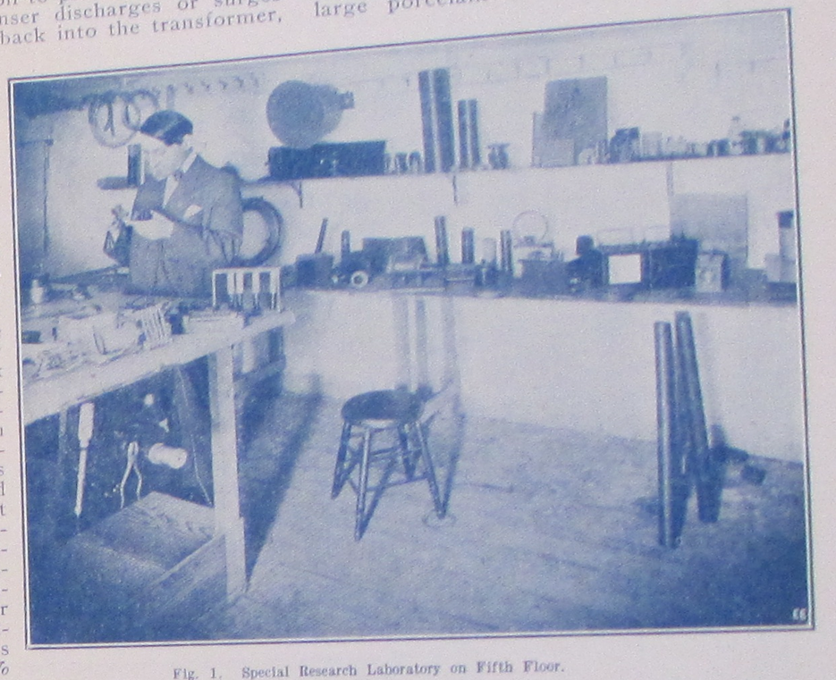

open
=====

It's the summer of 1906 in downtown Manhattan and Louis Coggeshall hovers over a bucket of dimes in the back room of the Electro Importing Company's retail store, filing them down to a coarse powder.  Sitting amid shelves of electrolytic detectors, circuit switches, ammeters, and Geissler tubes ready for sale to the city's growing community of amateur experimenters, he lets the metal filings fall into a small cardboard box at his feet.  Making a coherer, one of the earliest forms of radio receiver, required a certain amount of culinary improvisation in order to find the proportion of metals that would produce the strongest signal possible.  At the time, dimes were minted on ninety percent silver, so Coggeshall's next steps were to mix the filings with the perfect ratio of iron powder and finally to pour that mixture into a small glass vial.[^mrc]  When a radio frequency wave comes into contact with this coherer, the metal filings cling together, allowing a signal to flow between electrodes connected to either end of the vial and, depending on how long the telegraph key on the transmitting end of that radio wave is depressed, produce a *dot* or a *dash* in Morse code.  Mounting this final element onto a wooden base dotted with other handmade components, Coggeshall completes the construction of another one of the Electro Importing Company's flagship products: the Telimco, a portmanteau of the company's name and one of the first fully-assembled radio sets ever sold to the American public. ^[@_telimco_2002. @gernsback_50_1956. @gernsback_old_1938.]

[^mrc]:  Marconi's original "recipe" for the coherer called for one part silver to nineteen parts nickel (as opposed to iron).  @lee_nonlinear_2004, p. 4.  Coggeshall, who began his career as a telegraph operator for the Erie Railroad, first met Gernsback at a boardinghouse on 14th Street where they were both staying.  @moskowitz_explorers_1963, 231.  Coggeshall also did the cover art for the first issues of the *Electro Importing Company Catalog.  @gernsback_old_1938.

…a twenty-one-year-old Jewish immigrant from Luxembourg who had been in the United States for only two years

Meanwhile in the offices upstairs, the founder of Electro Importing Hugo Gernsback writes increasingly breathless advertising copy for the Telimco, promising it to be a means of professional success and economic mobility.  In one issue of the *Electro Importing Company Catalog*---a mail-in marketplace that provided access to "Everything for the Experimenter"---Gernsback claimed that with the Telimco, "We give you the opportunity to tick yourself up to the head of a future wireless telegraph company as did Marconi, De Forest and others."  Priced at $7.50, the set was an attractive proposition from a company who claimed to be "the largest makers of experimental Wireless Material in the world", requiring little more than a working knowledge of Morse code in order to get started.  First advertised in the November 25, 1905 issue of *Scientific American,* the Telimco appeared thereafter every two weeks, quickly becoming one of Electro Importing's best selling items.  In order to reach a wider public, Gernsback visited retailers around the city like Macy's, Gimbels, Marshall Field's, and FAO Schwartz, giving demonstrations of the device to incredulous salespeople who had no conceptual framework through which to understand "wireless."  And for good reason: not only was wireless still in its infancy and largely unknown to the public, it was a technology whose successful transmission of information through the air wasn't fully understood even by the scientific community.  From the physical substrate of metal filings to an entirely new means of communication that would soon be in every home, Gernsback and his colleagues were in the process of transubstantiating one medium into a medium of another kind.

![A replica of the Telimco receiver made by Gernsback for the Ford Museum in 195….  The coherer is the glass tube mounted between the two binding posts next to the bell.  Other components include the spark gap and the large cylindrical battery.]

This is the story of a literary genre's emergence.  But it is likely not one that the reader is familiar with.  While Hugo Gernsback is remembered today as the founding editor of the first science fiction magazine, *Amazing Stories,* this book is devoted to the idea that the project of science fiction in fact had its origins among the community of tinkerers and hams reading Gernsback's earlier technology magazines.  *Amazing Stories* debuted on newsstands in April 1926, a glossy, large format magazine that gave a name to fiction treating the fantastic through a systematically realistic lens.  It established a forum for fans of the genre to debate and influence the future of its development.  And in recognition of this legacy, the Hugo Awards are given out each year to the best works in the genre.  Largely thanks to the iconographies and standardized plots codified by *Amazing Stories,* the term *science fiction* today conjures up images of bug-eyed monsters, ray guns, and starships.  But in the opening decades of the twentieth century, before the accretion of a hundred years' worth of narratives, images, and clichés, that which was not yet called science fiction consisted of a great number of concrete practices all geared toward a reckoning with technological revolutions in the fabric of everyday life.

It becomes difficult to recover an understanding of science fiction *avant la lettre* because many of the entities commonly used to understand this genre [many of the historical variables by which we understand the genre] -- science, media, and technology -- the very objects and subjects of science fiction, were themselves still in flux.  Science as it was understood in the public sphere was a highly variable entity, it had no good explanation for the effects of new media like wireless telegraphy (which *itself* wouldn't be referred to or understood as a *medium* for several decades), and even the term *technology* wasn't used in the American English vernacular until the 1930s, as we will see later.  What we have instead is a scene in which amateurs are coming into contact with unfamiliar and strange electrical components, thanks largely to the access provided by the Electro Importing Company, and figuring out what the hell it is they do.  The essays that follow are in a sense a form of media theory in that they ….

discourse without keywords.  Or at least, keywords that lived very short lives as they were suggested, forgotten, replaced by new ideas.

But the "media" in question are not cinema or radio programming.  Instead, the magazines direct their attention to the affordances of the smallest individual components:  the selenium-coated plate, the tungsten lamp, the chromic plunge battery.  In the blueprints of *Modern Electrics* all the way through the short fiction of *Amazing Stories*, the addition and subtraction of each wire, condenser, or tuning hookup constituted a full-scale shift in the abilities and sensory affects of the apparatus being constructed as well as the narrative form through which it was described.  Moreover, these publications developed interleaving descriptive and narrative frameworks within which to describe these devices and experiences.  No longer was it sufficient to profile the technical specifications of a device or the mechanical arrangement of its parts.  Instead, magazines like *Radio News* and *Science and Invention* followed technological developments through to their most logical, and sometimes extreme, conclusions:  the increased availability of a light-sensitive alloy implied that the coming of visual telephones was near, and the number of amateurs sending in their own designs for primitive television receivers only served to confirm the immanence of this new mode of communication.

Beginning with the array of exotic equipment on display in the *Electro Importing Catalog* and continuing into magazines like *Modern Electrics* (first published in 1908), *Electrical Experimenter* (1913), and *Radio News* (1919), Gernsback developed a speculative language for describing and assessing the cultural impact of new media.  Regardless of how advanced the devices detailed in the pages of the *Electro Importing Catalog* seemed---solar cells, automobile mounted radiotelephones, electric keyboards powered by vacuum tubes---Gernsback and his staff reported on them as if they only required a combination of already existing electrical principles and components.  These new media appeared as little more than the sum of individual building blocks that one could pick and choose from of the pages of the *Catalog.*  

In part, this is a book about the origins of American science fiction.  It's also a look at the emergence of new media around community practices rather than new technical standards or innovations.

Technical literacy was encouraged not only through blueprints and instruction manuals for the amateur tinkerer, but also through thought experiments and graphical projections of what these new media might look like.  This was Gernsback's forté: reading fantastic possibilities for the future of technologically advanced societies off the shape of the most mundane of material objects, techniques and processes.

  [NOT THE RIGHT IMAGE]

The Telimco was one of countless artifacts profiled in the Gernsback magazines that blurred the lines between the real and the imaginary.  Part branding exercise, part rallying call for a community of active amateur experimenters, Gernsback gave names to these ideas like the Aerophone (a name for wireless audio transmission, rather than merely telegraphic code), the Telephot (an early conceptualization of the videophone), and the Hypnobioscope (an automated thought transcription and playback machine).  These gadgets appeared so frequently and in such diverse contexts---as props in short stories, as homemade designs in letters to the editor, as profiles of similar developments across Europe---that one gets the sense paging through the magazines that they are all part of a coherent fictional world, built up across many years and many issues.  Given the pace of technological change in the early twentieth century, it seemed as if any one element of this fictional world could bleed into everyday life at any moment.

* * * * 

The Telimco, for instance, was not exactly the revolutionary device that first brought radio to the masses Gernsback later liked to claim it was.  Though its advertisements claimed the set was "guaranteed to work up to one mile," the Telimco was notoriously finicky.^[@_wireless_1905]  As it was sold, the outfit had a range of merely 300-500 feet and could only receive signals from further distances when a large antenna was hooked up.  Further, it was highly susceptible to any kind of electrical interference, such as the elevator motor in the Electro Importing Company building, which caused difficulties during in-store demonstrations of the apparatus.  The Telimco's untuned circuits, which would produce a high degree of interference for any nearby radio station, would soon be outlawed by federal legislation.  For these reasons, its metal filings coherers "had all but disappeared from commercial work in 1910" according to historian of early radio Thomas White.^[@white_pioneering_1996]  From this perspective, the Telimco seems less a practical means of communication than a proof of concept for a growing group of "electrics" hobbyists.  In essence, it was little more than a gimmick, a parlor trick: press a button and a bell in another room would ring without the need for any intervening wires.

This didn't stop Gernsback from publishing instructions in 1908 on connecting a telephone mouthpiece to the transmitting end of the Telimco and an engine to the receiving end, so that the "power" of the human voice could be used to start that engine (**The Dynamophone**).  Or in the following year, describing how thousands of perfectly synchronized home wireless sets would be capable of sending a message to the aliens that surely must be listening for us on Mars (**Signaling to Mars**).  Or months later, laying out in great technical detail how it would be possible to send and receive motion pictures over the airwaves using currently available equipment (**Television and the Telephot**).  Designing a new technology that could be played with by amateur users was only ever the first step for Gernsback.  These technologies were always elaborated through projections of how they might work in the future, it was the way in which they were explained.  … These were handicraft futures that would come to pass with just a little more tinkering.

**magazine history - transition?**

While nineteenth-century scientific periodicals in the United States took the form of highly specialized *Proceedings* or *Transactions* or *Reports* of professional research groups, the *fin de siécle* saw a proliferation of titles aimed at a broader audience.  *Scientific American* for instance, the best known of these publications and one that still runs today, attracted a readership that included credentialed researchers, industrial manufacturers, an interested general public, as well as a "nebulous community of inventors (ranging from the local tinkerer to manufacturer and professional inventor/technologist)."  Science in these new magazines was made accessible to a growing number of readers seeking to educate themselves or simply desiring to remain informed about recent developments.^[@whalen_periodicals_1980.  For a history of the view that a scientifically educated public was an imperative for American democracy in the early twentieth century, a period during which the concept of "science" itself was in flux, see @jewett_science_2014, especially Chapters 4 and 7.]

But while Gernsback's magazines may seem familiar to us today through their progeny such as *Wired,* *Popular Science,* and *Popular Mechanics* (the latter two of which are the direct successors to Gernsback titles) in many ways they bear more in common with a deeper tradition of popular science that blurred the lines between illusion and truth, skepticism and belief.  From medieval displays of the natural world's wondrous curiosities, to renaissance performances of… [ANOTHER EX FROM DASTON], to nineteenth-century phantasmagoria and other audiovisual spectacles, "the positive sciences and the fantastic arts [have been] linked in a dialectic of doubt and certainty."^[@tresch_prophet_2011; @daston_wonders_1998; @andriopoulos_ghostly_2013.]  Unseen forces were at work in the miracle of wireless telegraphy, a literally unbelievable technology that meant disembodied voices from around the world could be skimmed from the air in the comfort of your home.  If this miracle were possible, what else might be?

From a belief in the presence of the luminiferous ether, to an argument that gravity is an electrical phenomenon, to the suggestion that humans may be able to tap into the so-called sixth senses of animals, or that the earth's core is made of radium and drives recurring cycles of life's evolution, certain Gernsback titles reveled in the scandalous yet somehow strangely intuitive realms of scientific speculation.^[@gernsback_ether_1916; @gernsback_gravitation_1918; @gernsback_unknown_1920; @gernsback_radium_1916]

Writes a lot in the 1919-1922 period, esp. in Science and Invention, about dormant forces all around us, unknown, unseen, and not yet understood — just as electricity was to the ancients.  Gravitation, attraction, etc.  Esp. "Into the Unknown, S&I v10n8.  See also Gernsback, "Alice in Sound-Land," in which Hugo meets Alice, and shows him his Sonophones, turn any frequency (X-Ray, solar radioation, etc) into audible sound for the human ear, and walk around listening to invisible things. Also, "Invisible Worlds," SI 6/24" 

See pseudoscience tag!

G., "Modern Illusions," on how our understanding of, willing belief in, and acceptance of illusions have increased to such a crazy amount, from cinema to the telephone to neon street signs.  Somehow ties this in to whether or not we should trust our senses in science, re: illusions.  Ties back in to "Invisible Worlds" piece. v15n03 192707

v3n6 191510, anon, "Can Electricity Transfer Thought Waves."  This issue starts pushing in new directions with what electricity makes possible, and its epistemology — as gravitation, as the substance of thought.

v4n6 191610 -- Gernsback, "Electrical Frauds."  Ironically, this profile of ridiculous ideas that are just marketing ploys is the page after Gernsback's editorial on how gravity is an electrical phenomenon that can be overcome.  Accompanied by images — all are bodily — electrical arch supports, hair growers, hair grower, etc. "P.T. Barnum was right: 'The people want to be fooled!'"

v12n02 192406 -- G, "Invisible Worlds" — on how while you read this, invisible microbes and radio waves and radiation are passing through you without you even knowing it.  We shouldn't trust our eyes anymore in this day and age.  "We will then reverse the old adage—'seeing is believing' into 'not seeing is believing.'" 

v13n08 192512 -- G, "How Science Affects Our Lives" — we forget that science is all around us 

Yes some speculative pseudoscience, but at the same time a hard-nosed approach to applied science, with real practical results.  Building a new form of crystal radio set (**Radioson**) whose performance could not only rival new tube sets, but were much cheaper, easier to fix, and most importantly, more easily understood by home experimenters.  A tinkerer's ethic.

A moment in which the specialist orientation of the sciences was opened up to a wider public who had a lot of questions.  This was not only because there was an audience for science, but also because the products of science were all around us.  Science fiction was a response to new experiences in everyday life.

The (paleolithic?) archaeologist and historian of radio Michael Schiffer calls Gernsback and his associates "techno-mancers," and that their stories created a "cultural imperative" for the new media they envisioned, like pocket-sized radios and color television (136).

What was new about Gernsback's approach is that this understanding of the complexities of the natural and artificial world would come about through the hands: handicraft and making.

At work here is a certain form of magic[ There was more than a little competition at work here, magicians discrediting other magicians through tricks of the trade that couldn't be revealed.

Magicians discrediting other magicians:  Landy, How to Do Things With Fictions:  "In the wake of [Jean-Eugène] Robert-Houdin, more or less every magician adopted sober evening dress, and more or less every magician took a swipe at something while on stage, whether past impostors, present spiritualists, or even his own tricks.  The demolition of lingering belief in actual sorcery became, thanks to Robert-Houdin, a primary function of the magic show at large."  

Cook, The Arts of Deception (Harvard UP, 2001)

in the early 18th century, "Robertson and Rubens Peale were presenting their 'phantasmagorias' as the very antidote to belief" (Cook, 172-3, 177)

Grant Wythoff, 9/8/15, 12:01 PM], when we don't know how something works but we can see that, plainly, it does (see Mauss).  Our suspicion is elicited, nonetheless.  It's also a form of advertising rhetoric, a hucksterism to sell more sets.  A more charitable version of this would say that HG was out to build a genuine community of practice around building, tinkering, and communicating through this new medium in the making.  But this is also about prototyping the future — understanding what the future will be like, setting up the conditions in which we can assess and critique its coming, with ready to hand, available material objects.  "Beauty is a groping of the emotions towards realization of things which may be unknown only to the intellect." 192607 Fiction Versus Facts

while people like Tesla had already established the fact that invention was part of an entire discursive network of speculations, projections, etc., Gernsback was able to popularize these forms of using technology.  His work is all about amateurs thinking in the same way, and everyday people feeling this amazement as they use technology, not as dumb spectators with their minds blown by the magician Tesla, but as active participants.  Which actually makes him an interesting figure in Lori Emerson's argument that technology today (Apple especially) has become too magical.  Gernsback, especially in his writings on "spritism", was totally against magic.  Let's get our hands dirty with this technology, *while* we appreciate at the same time exactly how "amazing" it is.

This is what Gernsback called "the perversity of things," or the innate capacity of objects to elicit unique responses in users, skilled or novice.  (briefly introduce)

Titled after an essay of his on the influence that objects exert on thought, *The Perversity of Things: Writings on Media, Technology, and Science Fiction* makes available texts by Gernsback that were foundational for both science fiction and the emergence of media studies.  These editorials, speculative blueprints, literary critical essays, and media histories have been out of print since their original publication in Gernsback's magazines from 1905-1933.  Together, they show how his publications evolved from an electrical parts catalog into a fully-fledged literary genre, an altogether untold story in American literary and media history.  As the curator of a recent exhibit on Gernsback at the ZKM (Center for Art and Media Technology), Franz Pichler writes, "Hugo Gernsback is the father of American electronic culture."^[@pichler_hugo_2013]  With his monthly editorials, feature articles, and short fiction, Gernsback pioneered a kind of writing that combined hard technical description with an openness to the fantastic. It was a mixture out of which an entire literary genre emerged to tackle the question of the distinctive specificity of "medium" in a new wireless age in the opening decades of the twentieth century.  

This story has held sway over the reception of Gernsback until very recently.  Gernsback's life and works are now beginning to receive a more formal treatment as well, with two major museum exhibits recently held: one at Luxembourg's [National Center for Literature](http://www.cnl.public.lu/agenda/2011/5/Expo_Hugo_Gernsback/index.html?highlight=gernsback) in 2011, and another in 2013 at the [ZKM (Center for Art and Media Technology)](http://on1.zkm.de/zkm/stories/storyReader8492) in Karlsruhe, curated by Franz Pichler and the media theorist Peter Weibel.^[A video of this exhibit can be seen at <http://www.youtube.com/watch?v=aEq6Mlu9j8I>.]  In addition, the visual artist Eric Schockmel is currently developing an animated documentary film about Gernsback.

Science fiction emerged in the United States as a discourse on media.

The incredibly rich context of the science fiction's birth in Gernsback's fleet of technical publications for the amateur experimenter, as well as his work as a pioneer in media technologies and broadcasting techniques, have been entirely overlooked.  In his illustrated magazines and compendiums of amateur designs, one could find a literary treatise on what the genre of "scientifiction" should look like alongside blueprints for a homebrewed television receiver well before its commercial possibility.  Gernsback's translation of an influential German handbook titled *The Practical Electrician* ran next to a speculative article on what it would take to provide a global system of free electricity powered by ocean currents.  Long before Gernsback founded *Amazing Stories,* these magazines used speculative fiction to find a language suited to the analysis of emerging media like radio, television, or the more exotic osophone and telegraphone.

*The Perversity of Things* thus seeks to provide a reappraisal of both the "hard" technical roots of American science fiction and the highly speculative orientation toward media technologies that was prevalent during this period.  Science fiction in its early days wasn't just a literary form, it was a mode of interacting with and understanding new media.  The literary historical gambit of this book is to recover the radical sense of openness that greeted not only the basement tinkerer working through the feasibility of transmitting images over a wire, but also the author of "scientifiction" stories who possessed a highly sophisticated awareness of the fact that "Two hundred years ago, stories of this kind were not possible."  Often, these individuals were one and the same, weaving together functional and fictional devices in a manner that served for them as a form of scientific discovery in itself.

This isn't the story of an Edison or a Jobs, inventors whose creations for better or worse have changed the way we inhabit the world.  Gernsback's career left us with a way of participating in that change, imagining its possible futures, and debating which future it is that we should live in.  This is the story of the development of a community, of a series of practices and a way of approaching the world.

* * * * * * * * * * 

What's really interesting is the community that these magazines represent. HG as a house editorial name. He's representative of a moment that falls between the gaps of literary and technological history, and his writings serve as the best introduction to that discourse. 

* * * * * * * * * * * 

notes
--------

- The gap between technical realities and narrative exposition, storyboarding, storytelling

- knowledge through one's hands, through the nerves.  and not just knowledge, but understanding the future

- MAKE SURE that it's clear this is an argument not just about the emergence of SF, but an early media theory.  A discourse on media as it played out in everyday life that drew on applied forms of speculative science.

- The opening should be a condensation of the introduction, hitting all of the main points: SF as making, early media theory, speculative science

- But the need for this volume is now becoming apparent as we experience technological revolutions in the fabric of the everyday similar to those that brought readers to the Gernsback publications a century ago.  The ability of Gernsback's ideas to speak to us today can be seen in the ways that images from his magazines circulate online through a wide variety of social image sharing sites and blogs, like Reddit, Tumblr, and the Scientific American blog *Paleofuture*. 

"up-to-date technic"
===================

Born Hugo Gernsbacher in 1884, the third son of Jewish German émigrés to Luxembourg, Gernsback was raised in Hollerich, a tiny suburb of the nation's capital.  His parents, Moritz and Bertha Gernsbacher (née Dürlacher), raised him in comfortable circumstances thanks to Moritz's successful wine wholesaling business.  Growing up off the grid (Hollerich wasn't yet connected to Luxembourg City's new electricity network), the young Gernsback's passion for technology began with the battery after a handyman employed by his father, Jean-Pierre Görgen, taught him at six years old how to wire a series of bells to a Leclanché cell.  Gernsback recalls being instantly enchanted by the bell "ringing amid a shower of wonderful green sparks," and would soon acquire a reputation for wiring homes and businesses in the area with telephones and these ringers.^[@oneil_amazing_1963. @gernsback_old_1938.]  According to a story he often told later in life, Gernsback received special permission from Pope Leo XIII at thirteen years old to enter the Carmelite convent of Luxembourg City to install a series of electric call bells for the nuns there.^[@siegel_hugo_1988, 16.]

Though this story is partially verifiable through a certificate of thanks from the Convent found by the Luxembourgeois Centre National de Littérature, it's worth pointing out here that the portrait of Gernsback's life we are left with in the historical record consists largely of a series of self-propagated stories that border on braggadocio:  that a police officer intruded on the Electro Importing Company offices to interrogate them for fraud with the Telimco set in 1906, for "no wireless combination could be sold at this low price"^[Reportedly, the officer shot back after the demonstration: "I still think youse guys is a bunch of fakers. This ad here says that you are selling a *wireless* machine. Well, if you do, what are all them wires for? @gernsback_old_1938.]; that Gernsback coined the term "television" in his December 1909 editorial **Television and the Telephot** (he didn't); that his recommendations were incorporated "word for word" into the Radio Act of 1912 (while the recommendation was, the wording wasn't---see **The Alexander Wireless Bill** and *Wireless and the Amateur**).  Once the influential science fiction historian and Gernsback's friend Sam Moskowitz recorded these stories in his many profiles of Gernsback, they became established as gospel truth, with Moskowitz playing the apostle to Gernsback's prophecies.  Evidence contrary to or even in excess of the received doxa is hard to come by, with many press and literary critical accounts barely rephrasing Moskowitz's prose.^[Beginning with @moskowitz_hugo_1959.]

We do know that despite the precociousness of his youth, Gernsback was by most measures a terrible student, falling at the bottom of his class at an industrial school near home from the ages of twelve to fifteen.  When he left to attend the Technikum in Bingen, Germany (now the Fachhochschule Bingen) from seventeen to eighteen, he regularly skipped classes and received poor grades in all subjects save electricity and physics.  It was during these teenage years that Gernsback acquired a penchant for gambling with the money he earned doing various electrical jobs in poker games, though his tendency to be cleaned out by older players seemed to keep him from falling too deep into this habit.^[@henzig_hugo_2010, 15.]  Outside of school, Gernsback was drawn to American culture from an early age.  He was a fan of John Philip Sousa's military marches and even composed his own patriotic Luxembourgish piece in the style of Sousa titled *Rǒd, Wêis, Blo* that continued to be performed by the Military Band at the Place d'Armes in Luxembourg into the 1930s.^[@henzig_hugo_2010, 15-16.]  He was a devoted reader of cowboy stories and was such a fan of Mark Twain that he wrote a now-lost novel of his own at seventeen, *Der Pechvogel,* under the name Huck Gernsbacher.  But it was stories of the otherworldly that truly fired his imagination.  Reading the astronomer Percival Lowell's book *Mars* at the age of nine, with its fusion of the hard sciences and speculation about alien life, served as Gernsback's introduction to the literature he would later come to think of as a distinct genre of scientifiction.  He dove headfirst into the work of Jules Verne and H.G. Wells, claiming to have nearly memorized many of their novels while still very young.^[@moskowitz_explorers_1963, 229.]

Despite his predilection for journeys into unknown frontiers, whether the American West or Martian canals, Gernsback remained tied to his home even after leaving, if not physically -- there is no proof he ever returned -- then through a meticulous self-fashioning.  Gernsback cultivated a distinctively (one might say distinctively unique) Luxembourgish identity throughout his life.  Though raised by German parents, he grew up in Luxembourg at a moment in which the tiny country's national identity was becoming more developed than ever before.  The anti-German sentiments of Gernsback's editorials and short fiction published during World War I (especially **The Magnetic Storm**) largely reflect the growing importance sensed by "a good part of the Luxembourgish people at the end of the Nineteenth century to demarcate between the two [Germany and Luxembourg] when faced with the more or less well marked pan-Germanic designs of Germany."^[@henzig_hugo_2010, 19.]  But the many identities attributed to Gernsback throughout his life -- he is described variously in the press as Prussian, German, Belgian, French, a "multilingual dandy" [ direct quote from the LIFE article?

Grant Wythoff, 8/27/15, 10:44 AM]-- also seemed to allow him a kind of ambiguity that he relished.

> In the era of tie-dye and sandals, Gernsback continued to dress like a visiting dignitary. For evenings on the town, he favored formal wear, including spats, an opera cape and an expensive silk homburg. He even affected a monocle, though he didn't really need it.^[@stashower_dreamer_1990.]

Despite the seeming seriousness of his demeanor, Sam Moskowitz testifies to Gernsback's sharp sense of humor:  "The truth is that Gernsback socially is a man of almost rapier-like wit, with a mischievous gleam in his eyes and with the rare ability to joke about his own misfortunes."^[@moskowitz_explorers_1963, 235.]  Throughout his life, friends and colleagues commented on Gernsback's relentless energy and the way that it seemed to sweep up everyone around him.

[And these stories simply fell out of him wherever he went.  A distant relative recalls a 1910 visit from Gernsback on his way to Chicago to purchase new equipment for Electro Importing.  When a ringing telephone interrupted one of his many stories of "robot doctors, retirement colonies on Mars, domed cities orbiting Earth," he reminded the seven-year-old girl running toward the receiver, "Hildegarde, fix your hair. It won't be long before the caller can see your face over the telephone wires."^[@stashower_dreamer_1990.]]

Because Gernsback's parents didn't approve of his interest in electrics, Gernsback booked a first class ticket to the United States using the savings from his electrical installation work, even though such a ticket was prohibitively expensive for most.^[@gernsback_old_1938]  In February 1904, he arrived in New York by himself at the age of 19, in an elaborate three piece suit.  Perhaps inspired by his first experiences with that Leclanché cell as a boy, Gernsback carried with him the design for a new kind of dry cell battery whose electrolytic paste could replace the inefficient liquid of wet cells like that of the Leclanché.  Having been denied patents in both France and Germany for the battery, Gernsback decided to try his luck in the United States.  A year later, he began publishing on his ideas, with his first printed article appearing in *Scientific American* again under that most American of names, "Huck" (**A New Interrupter**).  He was able to sell his battery technology to the Packard Motor Car Company, who ended up using the device in their ignition systems.  With the profits of his sale, Gernsback formed the Electro Importing Company, an importer of specialized electrical equipment from Europe and one of the first mail-order radio retailers in the country.  Through their catalog and retail store at 84 West Broadway, the company provided access to specialized wireless and electrical equipment not found anywhere outside of Europe.  Electro Importing catered to a diverse clientele, first manufacturing the Telimco in 1905 for their novice users, and providing their more advanced amateur experimenters with the first vacuum tube offered for sale to the general public in 1911.

After several issues of their mail order catalog and a growing subscription list, Electro Importing began including features, editorials, and letters to the editor. Between 1906 and 1910, the catalog evolved into a monthly magazine for the wireless homebrewer, *Modern Electrics* in 1908.  The transition from the mail-order catalog to the monthly magazine format was a smooth one, evidenced by the fact that the third and fourth editions (1907 and 1908) of the Electro Importing catalog bears the title of the new full-format magazine, "Modern Electrics."  The offshoot Experimenter Publishing Company, founded in 1915, published expanded how-to manuals, pamphlets, and complete books like *The Wireless Telephone,* *One Thousand and One Formulas,* and *The Wireless Course.*  While *Modern Electrics* still advertised the equipment Electro Importing offered for sale in a familiar grid layout with ordering instructions, it also included feature articles detailing the latest research into experimental media technologies in America, throughout Europe, and in Gernsback's own company offices.  Each 36-page, 6 x 9.5" issue sold on newsstands for ten cents and contained regular reports from E.I. Co. employees like Harry Winfield Secor and René Homer, who would contribute to Gernsback titles for years to come.  Some freelancers attributed their decision to pursue science as a profession to their experiences with *Modern Electrics,* as did Donald H. Menzel, later director of the Harvard Observatory, who earned money for college by writing for the magazine.^[@oneil_amazing_1963.]  Celebrity guest contributors like Lee De Forest, and later Thomas Edison and Nikola Tesla in the pages of *Electrical Experimenter,* raised the profile of the magazine among a readership hoping to emulate the success of these famous inventors.^[Tesla first published his autobiography in serial installments in *Electrical Experimenter,* a book that was recently republished by Penguin Classics. @tesla_my_2011.]  Regular dispatches and photographs printed on the magazine's slick paper from the unnamed Paris, Berlin, and Brussels Correspondents kept readers informed on developments in television, wireless telephony, and the use of novel electrical apparatuses in film and theatrical productions, each of which would go into a great degree of technical detail.  

But the hallmark of the magazine became its more speculative articles, those that were willing to extrapolate fantastic scenarios out of the technical details at hand.  Gernsback and his contributors wrote as if the more detail a particular technology's description contained, the more plausible were the projections of its future possibilities.  There was a way in which the future stood as the horizon of technical description.  As Lewis Mumford wrote in his autobiography, "In my youth, as a zealous reader of Hugo Gernsback's *Modern Electrics,* I shared my generation's pious belief in our future."^[Quoted in @westfahl_hugo_2007, 62.]  In **Signaling to Mars,** for example, Gernsback detailed the conditions that would have to be met in order for Earth to send messages via wireless telegraph to the red planet.  The quantitative description of the transmitting apparatus in terms of its necessary output (a gargantuan 70,000 kilowatts) and best time of year to signal (summer) only constitutes one aspect of this scenario.  Gernsback goes on to take into account the nature of Martian intelligence that would be necessary for such a communicative circuit to be completed:

> we can only hope that the Martians are further advanced than we and may signal back to us, using a method new to us and possibly long discarded by them, when thousands of years ago they stopped signaling to us, and gave us up, as we did not have intelligence enough to understand.

Continuing in the tradition of astronomers Percival Lowell and William Henry Pickering---the latter of whom offered a similar proposal on the front page of *The New York Times* to communicate with Mars using a series of mirrors^[@_planned_1909]---the projection of Martian technology (not to mention ecology) provided a topos upon which readers might asses the direction of its terrestrial analogues.

For readers of *Modern Electrics*, the technical context in which this highly speculative article appeared only lent credence to an idea as fanciful as the one that contact with an alien civilization was right around the corner. In the copy of this issue at Princeton University's Firestone Library, someone inserted a newspaper clipping (now a permanently affixed leaf within the bound volume) that tells of a new distance record for wireless signaling, from San Francisco to the Pacific Mail Line steamship Korea as it made its way across the ocean. Left there as if to vouch for the plausibility of the idea that we'll soon be able to connect with our nearest planetary neighbor, the clipping provides a wonderful sense of how it was people read these magazines.[^clp]  Though the Gernsback titles eventually became notable for some of their more outlandish claims---that electric current might clean us better than water, that the success of a marriage can be predicted using gadgets assembled out of various household supplies---they were always presented through a lens of supposedly scientific rationality. This frame affected the reception of the magazines by their readers, the design ethos that grew up around them, and the kind of fiction they eventually produced.

[^clp]: While I haven't been able to determine the provenance of this particular clipping, other articles reporting on the Korea's distance signaling record were published in the *New York Times*on November 8, 1909 and the *Boston Evening Transcript*, November 6, 1909.

From the earliest of the Gernsback titles, we find science configured[ This section will be easier to edit once I know what I need to include in the SF section.

Grant Wythoff, 8/27/15, 1:45 PM] as an instrumentalized form of technological achievement that bore little relationship to what was happening in laboratories.  Contrary to the now-accepted division between the purely theoretical nature of the sciences and their application in the development of new technologies, Gernsback argues that science and invention are part of a continuum in a later editorial for a magazine of that title:

> The word *Science,* from the Latin *scientia,* meaning knowledge, is closely related to *Invention,* which, derived from the Latin *inventio,* means, finding out.  There is little in Science that did not at one time require some inventive powers, while conversely most of the world's inventions are based upon one or more of the sciences.  (**Science and Invention**)

This article is a key of sorts for the many valences *science* can take throughout the Gernsback magazines.  Science is the sum of its many products progressively connecting the modern world, a hybrid of science and technology that saw no distinction between theories and their application.  It is defined as what the average person understands of its growing presence in their daily life:  "science no longer is the sombre book closed with seven seals.  Quite the contrary, it is the public that popularizes science---not our scientists" (**Science and Invention**).  It is even configured as a form of belief when he writes that skepticism is an entirely unscientific attitude:

> But our *real* scientists are as backward as in Galileo's times.  The public applauds and instantly believes in anything new that is scientific, whereas the true scientist scoffs and jeers, just as he did in Galileo's times when that worthy stoutly maintained that the earth moved and did not stand still.

In many ways, this starry-eyed fanaticism for science as the sum of its progressive advance in the material world reflects the way in which the public discourse was shifting on a larger scale as science entered mass market newsstands, corporate research facilities, and public school classrooms.  As John Rudolph has argued, it was during this period that the "scientific method" emerged not among communities of researchers but in secondary school pedagogy:

> while the manner in which practicing scientists went about their work (the research strategies they used, their modes of inquiry, norms of argumentation, etc.) changed relatively little if at all from the 1880s to the 1920s, portrayals of the scientific method in American schools underwent a marked transformation.^[@rudolph_epistemology_2005.] 

If science was a highly variable concept for Gernsback, discourse surrounding its application was just as muddled.  *Technology* was a word largely unknown to the English speaker, which should also complicate the way we read these essays.  So, for instance, when Gernsback writes in 1922 that "steam, electricity, and up-to-date technic have completely altered not only the face of the globe, but our very lives as well," the usage of the word *technic* where we might expect something like *technology* reflects an important terminological confusion at the time (**10,000 Years Hence**).  While Google Ngram shows *technic* being used over three times more often than *technology* in 1922, this situation changes rapidly over the next decade.  In nineteenth-century English, according to Eric Schatzberg, *technology* referred to "a field of study concerned with the practical arts; except in anomalous usage, [it] did not refer to industrial processes or artifacts."  Just as sociology names the study of society, technology was the science of technique, making, the useful or practical arts.  Somewhere around 1930, Schatzberg argues, 

> new meanings derived primarily from the writings of American social scientists who imported elements of the German discourse of *Technik* into the English term technology, thus shifting the latter from its original definition as the science or study of the useful arts to a new one that embraced the industrial arts as a whole, including the material means of production.^[This masterful history of the interrelated concepts of *Technik,* technology, and technique, is highly recommended.  @schatzberg_technik_2006.]

A hybridized and highly material, everyday understanding of science and technology in these early technology magazines was foundational for Gernsback's conceptualization of scientifiction, as we will see later.

(science in the newsstands Lewis Hine photo?)

* * * * * * * * * * * 

On a new form of scientific education:  "This was certainly a far cry from the genteel instruction on natural philosophy to promote polite drawing room conversation on scientific theory published just a few decades earlier.  It's interesting to consider just what a young Michael Faraday would make of such a book or of Harper's Electricity Book for Boys (1907)" Schlesinger, Battery book. 

From Drown diss:  John Dewey on professional training so "that each individual gets an opportunity to escape from the limitations of the social group in which he was born."  essay:  "The School and Social Progress."  Established authorities on self education, personal betterment:  selections from Reader's Digest, the Book-of-the-Month club, the Harvard Classics "Five Foot Shelf."  International Correspondence School.  Chicago Technical College.  Drown:  "Trade schools, correspondence courses, settlement houses, YMCAs and other such institutions made carpenters, plumbers, and bakers, and soon, automobile mechanics, electricians, draftsmen, and radio 'engineers.'" (78)  See Rubin, The Making of Middlebrow Culture.  and:  Radway, Janice.  "The Book-of-the-Month Club and the General Reader" in Reading in America, ed. Cathy Davidson.  Radway, Janice.  "The Scandal of the Middlebrow:  The Book-of-the-Month Club, Class Fracture, and Cultural Authority."  SAQ 89 (Fall 1990): 703-36.  

on amateur experimenter culture, boys hoping to get rich

Parents eager to set their children on the right path bought them chemistry sets with names like Chemcraft, produced by the Porter Chemical Company, which also sponsored Chemists Clubs.  Young adult books on electricity and technology flourished, many of them written for boys and intended to instill the noble desire to invent.  Who knew when the next Edison or Morse might arrive on the scene to offer up the world a truly wonderful practical miracle?" (Schlesinger, loc 2808)

FIND MORE ON THIS GENTEEL TRADITION of natural philosophy

* * * * * * * * * * * 

Hoping to build on the success of *Modern Electrics,* Gernsback sold the magazine to Orland Ridenour[ [WHO?? HG'S NEIGHBOR?]

Grant Wythoff, 9/3/15, 12:22 PM] and launched a new title in May 1913: *Electrical Experimenter.*[^psmm]  Continuing the work that began with *Modern Electrics's* monthly radio set building contest and correspondence section, *Electrical Experimenter* introduced several new ways for readers to participate.  A section called "The Constructor" included tips for the home workshop, like a technique for tightly winding a spark coil using a hand-cranked drill.  The "How-To-Make-It Department" offered prizes for designs submitted by readers that specifically "accomplishing new things with old apparatus and old material," such as an alarm that activated a simple electric bell in the house when a mailbox's door was opened and closed.  The "Electrical Magazine Review" provided a roundup of news recently published in other electrical magazines like *Electrical World* and London's *The Electrician,* while the "Patent Advice" column offered input on inventions that readers hoped to patent at the price of $1 per question.  By May 1918, the magazine had reached a circulation of a hundred thousand copies per month, almost doubling *Modern Electrics's* readership seven years previously.

[^psmm]: *Modern Electrics* continued under Ridenour's Modern Publishing Company as *Modern Electrics and Mechanics* for two years before acquiring and taking on the name of *Popular Science Monthly* in April 1915, a magazine whose publishers were looking to update the format it had run since 1872: reprints of European science periodicals with little to no illustration.  Under the editorship of Waldemar Kaempffert, the new *Popular Science* tried to increase its readership with short form writing, dense photo spreads packed onto every page, and a far more generalist approach to "science."  One would now find articles on developments in criminology, warfare, and motion pictures in a magazine that only a year earlier covered entomology, evolution, and pathology.  It continues to be published today.  For an overview of Kaempffert's editorial philosophy, see @kaempffert_vision_1916.

Paging through the print run of the *Electrical Experimenter* across the 1910s is like watching the activities of a quirky group of hobbyists grow into a mass cultural phenomenon.  Over the course of its publication, Gernsback and his staff gradually widened their focus from the highly specialized electrical arts of *Modern Electrics* to a range of topics geared more toward the general public.  As "recipes, wrinkles, and formulas" were joined by sensational depictions of future technologies, Gernsback changed the magazine's tagline from "The Electrical Magazine for the Experimenter" to "The Electrical Magazine for Everybody."  By the decade's end, the title was completely rebranded as *Science and Invention,* a change that once again nearly doubled the magazine's circulation to almost 200,000 copies per month.^[*Science and Invention* continued for another decade before being bought out[ bought by who?  See Mike Ashley

Grant Wythoff, 9/3/15, 12:26 PM] and merged into the September 1931 issue of *Popular Mechanics,* another title still published today.]  The new look was accompanied by a significant change in editorial policy, beginning with the idea that the image was the most effective way to communicate complicated scientific information to the public.  

> All of our departments, as you will note, have been reduced to pictures and captions, with the exception of our scientific fiction stories which for the time being will run on as usual.  The reason is that the average man or woman does not wish to laboriously wander through miles of text of scientific facts, which means concentration and study. . . . *we have tried to reduce all scientific matter to entertainment instead of study.* (**The 'New' Science and Invention**)

[As a character in Robert A. Heinlein's 1940 short story "Requiem" says that as a boy, he was one of those fans "who thought there was more romance in an issue of the *Electrical Experimenter* than in all the books Dumas ever wrote."  quoted in @erisman_stratemeyer_2000.]

Gernsback's visions were lent a shape and a color thanks to two new illustrators who were able to "illustrate difficult subjects in such a way that words really become superfluous," as Gernsback put it in the previous editorial.  Though Howard V. Brown's career as a cover artist spanned a variety of subjects and techniques -- his work appeared everywhere from from *Scientific American* to *Argosy All-Story Weekly* to the children's magazine *St. Nicholas* -- the signature of his Gernsback covers was the Rockwellesque way he was able to tell the story of an entirely speculative technology through facial expressions and dramatic gestures.^[@gustafon_brown_2015.]  Seemingly familiar domestic scenes, detailed in vividly realistic brush strokes, were punctured by the presence of a strange apparatus and became the starting point for conversations on how a technology of the future might function.

The shape of media to come took on an iconography all its own through the illustrations of Frank R. Paul.  Trained in Vienna, London, and Paris as an architectural draftsman, Paul is known for his exquisitely detailed cityscapes as well as the bug-eyed monsters that would later adorn the covers of *Amazing Stories.*^[@moskowitz_explorers_1963, 234.]  As the magazines in which they appeared gained a wider following, these images began to circulate far beyond their original venues.  Plans for the Osophone, a device Gernsback designed to replace headphones by transmitting sound through vibrations in the jawbone of the listener (**Hearing Through Your Teeth**), were published and reviewed in the German journal *Der Radio-Amateur.*^[@nesper_osophon_1924.  For the history of *Der Radio-Amateur* magazine, see @sarkowski_springer-verlag_1996.]  Paul's sketch of a man using a tuning fork to calibrate the speed of the 1928 *Science and Invention* Nipkow disk television receiver was republished the following year in the Chinese film journal *Yingxi zazhi* (*Shadow Play Magazine*) as an illustration of recent research into television, what was referred to in the article as, directly translated, "wireless cinema."^[@bao_sympathetic_2011. Bao located Paul's illustration of the *Science and Invention* television receiver in @shen_dianyingjie_1929. The term for television used in this article is "wuxian dianying (wireless cinema, or, more literally, wireless electric shadow, or radio shadow)." Paul's images were originally published as the accompaniment to @gernsback_radio_1928.]  Many more *Electrical Experimenter / Science and Invention* articles were translated into French, German, Italian, Spanish, Japanese, Dutch, and Arabic, circulating widely along with their illustrations.^[@_this_1919]

It's the currency of these images then and now (especially as they're given new life on Twitter and Tumblr) that perhaps has resulted in the description of Gernsback for better or worse as a "prophet" of the future.  Unfortunately, this approach tends to flatten out the richness of his work into a list of the impressively early dates by which he had predicted the coming of technologies like in vitro fertilization, the transistor radio, atomic war, education by video, and telemedicine[ 1925's Teledactyl

Grant Wythoff, 9/8/15, 11:54 AM].  Gernsback himself seemed to enjoy the continued notoriety these predictions brought him (yet another reason why, in writing about him, we have to be careful to cut through the self-image he crafted).  In a sense, their sheer number is of course impressive, as it was for Arthur C. Clarke who dedicated his *Profiles of the Future: An Inquiry Into the Limits of the Possible* "to Hugo Gernsback, who thought of everything."[^prdt]  Though many of these ideas were in the air at the time, Gernsback simply had a knack for tuning in like no other, for distilling the essence of a technosocial development from a cloud of diverse possibilities into a digestible, attractive form.

[^prdt]: Moskowitz lists the predictions in *Ralph 124C 41+* alone: "Fluorescent lighting, skywriting, automatic packaging machines, plastics, the radio directional range finder, juke boxes, liquid fertilizer, hydroponics, tape recorders, rustproof steel, loud speakers, night baseball, aquacades, microfilm, television, radio networks, vending machines dispensing hot and cold foods and liquids, flying saucers, a device for teaching while the user is asleep, solar energy for theat and power, fabrics from glass, synthetic materials such as nylon for wearing apparel, and, of course, space travel are but a few." @moskowitz_explorers_1963, 233.

But descriptions of Gernsback as a prophet miss the way in which the future[ Making + the future mentioned in opening section w/ title Perversity of Things, here as a pivot point, and in the following section on tinkering.  Figure out how best to space out this story.

But if you look at other popular science and electrical magazines of the period, the future is never discussed.  The future infuses everything about science and technology in these magazines.

Grant Wythoff, 9/5/15, 5:50 PM], a topic almost entirely absent from other electrical and science magazines of the period, felt so close to hand.  Because Brown and Paul's images of thought recorders and visual telephones were accompanied by reader-submitted blueprints and parts for sale, it was as if one could reach out and touch these wonders.  This wasn't a matter of mere prognostication:  tinkering and material interaction among a community of interconnected readers brought about a uniquely critical understanding of what the future might hold.  "Invention" was an activity that logically and temporally preceded science and required a form of instinctual know-how or "knack," a term Gernsback returns to in many of his writings.  It's also a capacity that he thought might be learned, which meant that a literal roadmap to the wondrous future was possible.

"'phone and code"
=================================

Can combine categories of TV, wireless, and "media" here, because TV never really developed as a community for Gernsback.  He started *Television News* as a wager to the argument that communities of amateurs can advance a "new art" faster than any closed off, patent-hoarding corporation.  That may be true, but the corporations dictated the terms of that development.  So, this section can be more broadly about Gernsback's understanding of media history, and how new media develop within communities.

In fact, it's impressive the degree to which race and gender are absolutely invisible in almost all of Gernsback's writings, a kind of "white washing" that perhaps would only be possible for a male Jewish immigrant.

Though Gernsback seldom addressed women, his writers sometimes reported on women in wireless, with some very interesting examples.  Mexican war refugee, women's suffragists.

When not simply listening in, operating wireless telegraph sets afforded a degree of anonymity to women who otherwise would have been excluded from these conversations and various forms of activities (DXing, mischief, etc.).

Though it is indeed rare that women are made visible in the pages of these magazines except as occasional curiosities, a later editorial by Gernsback makes clear that they played a vital role at virtually every level of the magazine's production.  A 1928 issue of *Science of Invention* opens with a fanciful tale in which King Outis VII of Erehwon, a great fan of the magazine, visits the offices of Experimenter Publishing to witness how the magazine is made.  He meets with editors, artists, advertising staff, linotypers, compositors, proof-readers, the binding department, and photographers.  Following the supply chain even deeper, Gernsback introduces the King to the "chemical houses who furnished the chemicals for making the pulp and bleaching it," the coal mines that made possible the steam to make that sulphite pulp paper, even the hens that laid the eggs "used in the photo-engraving process to supply albumen."  When the King finally asks "who all the pretty girls were that had clustered together in one aggregation," 

> We informed him immediately that they were secretaries, stenographers and typists, as well as editors and proofreaders and many others who had directly to do with the production of the magazine.  The firm that did the composing had several dozen girls that performed various jobs in connection with the magazine.  The printer had a number of girls who were either bookkeepers or stenographers, through whose hands passed the bills for the magazine, and the same was true of practically every other industry connected with the production of the magazine.^[@gernsback_magazine_1928.]

Though women are rarely made visible in the content of these magazines themselves, they are there at every stage in the process of their production, from the graphite mines to the chemical supply houses to the newsdealers.  Women are the very circuits that connect and regulate all of the magazine's material inputs and outputs.^[For a history of the influential role women played in the history of periodical publishing throughout he nineteenth century, see @harris_blue_2004.]

Replicated on Mars, with Martian women part of a "Tos rod" correspondence technology in *Baron Münchausen.*  For some reason, direct thought transference needs a secretary to make a record of it.  A "sensitive recording mechanism" that is "in charge of a secretary" -- one would think he means in *the* charge of a secretary, but who knows.  the role of the female secretary in this procedure is strange.  the entire process is described as the product of a machine, a stylus.  nowhere does she come into the operation, unless she's occluded by the passive voice…  "is always recorded," "is carefully labeled and stored away."^[CITE_SPECIFIC_INSTALMENT]

(thought recorder image?)

"a perfect Babel of voices"
======================

As these newly minted citizens of the ether stepped "out into the star-lit night and myriads of voices" (**Amateur Radio Restored**), what would be the social and legal pacts that held them together, by which they organized their conversations?

HG's social ideology through technology, as a technocrat and a utopian.

Do these articles amount to a full scale policy or philosophy of regulation?  Probably not.  More a series of reactions to conditions on the ground.  Tries to remain as agnostic as possible.

For an early "information wants to be free" argument, see 192707 Wired Radio Versus Space Radio.  Nothing super quotable, can just paraphrase his arguments.  It's also like the contrast between OTA television and cable, and the idea that amateurs will always find a way to pirate content, no matter what.  So many of the twentieth century's debates over the social use of mass media and whether or not that use is at odds with corporate interests, already played themselves out in the opening decades of the century.

"certain future instrumentalities": Tinkering, Making, and Mineral Proficiencies
=================================================================================

An interesting article from the January 1916 issue of *Electrical Experimenter* recommends that the reader tries biting a sewing needle tightly between his teeth and holding the sharp end to the groove of a phonograph record.

> With a little practise one will become proficient in moving the head at the same ratio of speed as the ordinary reproducer arm is moved from the outside of the record towards the inside. As soon as the needle touches the record with sufficient pressure, the inside of the head will be filled immediately with music exceedingly loud and clear. A curious result of the experiment is that a person standing near by can bear the music, the head acting as a reproducer in this case.  (**Hearing Through Your Teeth**)

(This author, having successfully performed this experiment himself, for legal reasons probably shouldn't recommend that the reader try this at home.)  When the same experiment reappears later in the same issue, it's during an installment of *The Scientific Adventures of Baron Münchausen* as a means of describing a very strange Martian technology, the Tos Rod.  

listening "not with their ears. They were listening with their brains!"

> The two reddish plates pressing against the bare temples are made of two metals unknown on earth, and the metals are distributed over the surface of the plate in honeycomb fashion without touching each other. Now if the two plates are pressed against the temples and when wireless waves are passing through them, the waves are translated into vibrations of a certain frequency. It has been found that if these vibrations reach the conscious sense of hearing which is located in the *Temporal Lobe* of the brain, sounds can be impressed upon the brain without requiring the ear and its auditory nerve. In other words, the sound is "heard" directly within the brain without the agency of the ear's mechanism.

Gernsback assures the reader that the ear is not "absolutely essential for hearing," and to illustrate his point describes the same sewing needle experiment.

Seven years later, Gernsback would patent a device he called the Osophone, a "small, compact and handy instrument which can be easily carried about and used without attracting undue attention."  The Osophone employed the same principle as the *Electrical Experimental* editorial, this time with a finished mouthpiece attached to a wire that provided a "simple and practical means by which hearing may be effected by sound vibrations transmitted directly to the osseous tissue of the body."

The example of the Osophone illustrates how tinkering with something as simple as available household materials became the starting point for new inventions, both functional and fictional.  Describing the operation of a particular technology was a means of aiding design practice, even when that design practice was a form of narrative speculation.

* * * * * * * * * * * 

[What sort of artifact, then, is the Telimco for the historian and theorist of media technologies?  Does it deserve credit for being a historical "first," one of the earliest consumer-friendly sets that would pave the way for radio broadcasting and domestic listening in later decades?  Do we overlook its technical faults, as we do the almost unplayable tin foil phonograph cylinders first released by Edison, in favor of the idea behind the prototype and what it later would become?  Or do we pass it by as a marketing gimmick, a fiction, in favor of technical developments that offer more objectively measurable achievements?  More interesting than the gap between the actual abilities and the claims surrounding the Telimco and other Electro Importing devices is the structure through which these claims were made.]

amateur inventor / corporate r & d
---------------------------------------------

What is a "maker" or a "tinkerer" around 1910?  Mucker, experimenter.  Above all, a form of intuition or creativity, of excellence in being able to make something magical.

Get our terms straight:  HG used "tinkerer," a term that was associated with Romani gypsies, who would fix old things.  Edison suggested "mucker."  Today, we might say "maker."  But the point is, that the incremental modification associated with a term like "tinkering" involves just as much creative expression, expertise, and skill as the whole cloth production of a new technology we might associate with "invention."

1916 May -- "Edison Says You are a 'Mucker'!"  15 (anon) -- term of endearment for all scientific experimenters.  "Are you an electrical Experimenter?  Yes?  Well, in that case you are a 'MUCKER'!  A plain, common, ordinary, everyday mucker!!  So says one Thomas Alva Edison, and if the 'Wiz' says so it must be true.  You say you don't like to be called such names?  It's a distinction to be called a mucker.  Edison says he is a mucker himself.  Says all scientific experimenters are muckers.  So there!" 

@aitken_continuous_1985 avoids "the standard and readily available definitions of technology, which normally emphasize either hardware or methods.  Behind these definitions there lies an older and less limiting idea: the conception of technology as knowledge -- Aristotle's 'reasoned state of capacity to make.'"

machine shop / individual invention
--------------------------------------

Takes place between the machine shop model of innovation w/ the telegraph, according to Paul Israel (an age that some mythologize as the era of the independent inventor) and its transition, thanks largely to Edison, to corporate R&D (which many also mythologize as being solely the province of scientists disconnected from practical innovation, when in fact there was a great deal of small-scale tinkering, and, according to Hintz, independent inventors lived on).

A literature (Israel, Hintz) that troubles this transition between lone, independent inventors to collective, massively funded corporate research labs … and the HG articles take place in this moment, making it too easy to say that their readership was part of a dying breed, or that the transition to scientifiction magazines in the late 1920s was a product of this readership feeling left out of the community of invention, as we will discuss later.

"the rise of modern corporate-based industrial research laboratories in the twentieth century" @israel_machine_1992, 2

a parallel between this twentieth century transition and another moment in the nineteenth century with the rise of machine shops:  "In the place of many lone, independent inventors we begin to see a pattern of cooperative shop invention in which skilled operatives, superintendents, machinists, and manufacturers make up technological communities that draw on practical experience to design, build, and refine new technology." @israel_machine_1992, 2  Communicating through trade journals like *The Telegrapher* in the 1860s.

In this shop culture, "few inventors [working on the telegraph] actually worked alone and none worked in complete isolation.  Conceptualization was often stimulated by access to new information.  And the construction, testing, and redesigning of apparatus necessary for practical application almost invariably required an inventor to seek the assistance of others, whose own contributions often altered the original design.  The power of the popular heroic model of invention, which treats initial conceptualization as the true inventive act, has caused the more methodical activities involved in the development of a practical invention to often be treated as ancillary, thus obscuring the diversity of other contributions oftne necessary to the successful inventive enterprise." @israel_machine_1992, 57

As Hugh Aitken puts it, the most meaningful development in the emergence of radio -- the transition from spark gap sets to continuous wave transmission -- wasn't primarily a question of how science and technology defined themselves in relation to one another.  Rather, this transition happened "at the hazy boundary where radio stopped being a matter for visionary experimenters and started to become a hardheaded business capable of gaining and holding a commercial market."^[@aitken_continuous_1985, p. 9-10.]

(from 192302: [^keq]: Though Gernsback is obviously trying to stir up his readership, this article touches on a very real anxiety about the role of the amateur in a world of increasingly professionalized engineering and invention. But historian of technology Eric S. Hintz argues that despite commonly accepted wisdom, independent inventors continued to be a source of viable innovations well into the twentieth century, when corporate research and development was gradually beginning to take on greater importance. Well after the "heroic" era of inventors like Thomas Edison and Alexander Graham Bell:)

"The amateur's work is valuable."  from Grundy's letter on who will save the radio amateur 192302 -- not just blind tinkering, but "work."

use fn on radio set building contest ending in intro, from 192702, p. 6?

use fn on 20th century independent inventors in intro? 192302_who_will_save

use big NYU prof activist guy on frustrated amateurs moving into science

tie back to previous section's comments on "science" -- what role does the tinkerer have between 19thC and institutionalized science?  And, contextualize push for public science education in the US

I have seen many different editions of these magazines in various archives, academic and private, and seen many scans available in various places online.  Many of the issues have scribbles in the margins, newspaper articles and other ephemera attached between the pages.  An active readership, working out technical issues, solving problems, thinking actively.

Don't even have to use the technologies, if you can't afford them.  Reading a form of experimentation:  1923 Feb -- Letter.  1434.  Stephens, Richard J.  "You can better realize what these magazines mean to me when I say that I seldom, if ever, get a chance to have the material to experiment with, so I must content myself with reading matter, and I do like to read, especially such a wealth of material as is combined in the pages of your three publications."  That the readers can think of themselves as experimenters while reading… "as long as Gernsback addressed his readers in semi-technical terms." (Drown 91)

Mineral proficiencies, rolling expertise
--------------------------------------------------

Gernsback devoted space in many of his editorials to thinking about the process by which "new things" come into the world, and the special forms of creativity that emerge when an inventor draws equally upon science and the arts to design a technology.  In many ways, he was far ahead of his time in proposing several frameworks for understanding invention, even if they were underdeveloped.  It wouldn't be for many years that the social and historical study of technology would be accepted as a serious academic pursuit, as Hugh Aitken writes in the 1976 prologue to his magisterial, two-volume history of radio:

> If the 'new things' of science, technology, and economic life often seem overwhelming and uncontrollable, the reason may well be that we have, in modern societies, created highly efficient structures for the generation of new knowledge without seriously attending to the processes by which new knowledge is put to use. . . . historians of the future will find it strange that so few social scientists of the twentieth century could bring themselves, in their work, to treat science as one of the great social institutions of the time.[^nwpn]

[^nwpn]: @aitken_syntony_1976, 9.  Aitken is citing here @merton_priorities_1957.

This is of course no longer the case, with the vibrant field of Science, Technology, and Society (STS) beginning to have a great influence on a diverse number of disciplines.  But it's important to note here that the questions raised by Gernsback in a pulp publishing context wouldn't have sufficient answers even among academic historians and sociologists of technology for many decades to come.

Gernsback's views on these issues evolved over the years thanks in part to the debates, suggestions, and questions he and his staff printed in lively correspondence sections like The Oracle and Patent Advice.  Questions from readers ranged from the factual (how many feet come in a pound of No. 12 B.&S. triple-braided weather proof wire?) to the experimental (might two lead plates submerged in sulphuric acid make a good storage battery?).  It was important for knowledge to be freely shared among readers, contributors, and editors, since the construction of wireless sets involved many different forms of expertise.  "A radio set builder," wrote Gernsback in a 1925 editorial, "must be a carpenter, an electrician, a metal worker, a tinsmith, and a radio engineer, all rolled into one."^[@gernsback_radio_1925.]  [AT CERTAIN POINTS INTEGRATES THE SKILLS OF MANY DIFFERENT PEOPLE INTO ONE MYTHICAL FIGURE, A LONE INVENTOR.  AND YET OFFERS UP HIS DEVICES TO A COMMUNITY OF TINKERERS, WHICH MORE ACCURATELY REFLECTS THE WAY PEOPLE OF DIFFERENT SKILL SETS COLLABORATE ON INVENTING NEW THINGS.  CAN I MAKE A CHRONOLOGICAL NARRATIVE OF HIS VIEWS DEVELOPING IN THIS MANNER?  OR JUST POINT OUT THE CONTRADICTION AS SUCH?]  Initially, Gernsback argued that such impressively skilled inventors were born, not made.  While many could learn to be "mechanical" inventors, or those "who are suddenly confronted with a certain device that to their minds seems imperfect, whereupon they will bend their energies towards improving the existing device," true inventors were hard to come by (**The Born and the Mechanical Inventor**).  In cultural studies of media and technology today, we might think of these two styles of invention as Gernsback formulates them -- the whole cloth innovation of shiny new tools versus incremental acts of modification and repair -- as reflections of a hemispheric divide.  Steven J. Jackson argues that "a Western and productivist imagination" biases much of media studies today, obscuring the vast majority of technological practices in the developing world:  "breakdown, maintenance, and repair constitute crucial but vastly understudied sites or moments within the worlds of new media and technology today."^[For more on "the distinctive repair ecologies of the developing world," see @jackson_rethinking_2014.]

Eventually, Gernsback began to shift his views on invention so that they were more in line[ Maybe it was the impressive designs sent in by amateurs over the years that made Gernsback change his mind, that invention could be learned rather than instinctual and born?

Grant Wythoff, 9/9/15, 1:56 PM] with the educational goals of his magazines.  In **Why The Radio Set Builder,** we begin to understand that the biggest contributions to this community of makers were not necessarily made by its most broadly educated members.  To the contrary, the most important things that an experimenter needed to know would emerge organically from the process of tinkering, in a dialogue between a person and an inanimate object.  Gernsback advocated making things by hand not just as a hobby, a means of diversion or release after the working day is over (he seems in the below editorial to be addressing the white collar worker in particular), but as a complete education in tools, materials, and techniques:

> If, for instance, you are making an elaborate radio console for your living room, you will get more information on the subject than you could possibly get from the best text-books.  You will, first of all, become familiar with the various tools necessary to fashion the wood, and if you own a woodworking lathe you will learn quite a good deal about the operation of wood-turning and the tools to be used for this particular purpose.  You will learn what it means to sandpaper, you will learn to recognize the different kinds of wood, and you will know the difference between green and kiln-dried variety of woods.  You will soon know how to use glue, and what kind.  You will study the various fillers, and, last but not least, you will get a thorough education in varnishes and paints, and the use of all of these.^[@gernsback_handicraft_1927]

For Gernsback, the know-how that emerges from making things is cascading: hands gradually feeling their way along an interlocking series of dependent skills and material properties.  As we see in **The Perversity of Things,** objects only ever seem like frustrating "obstacles" in the way of a good idea when we don't fully understand the proper affordances of those objects.  "It is not the things that are perverse, it is ourselves who make them seem perverse."  With enough experience, barriers and constraints begin to look like creative opportunities.  Gernsback refers to this capacity to see finished form in raw materials as a "knack" or an "intuition."  It's what allows one reader to build an audion tube from scratch, that ultimate symbol of inscrutable corporate complexity, by learning glassblowing.^[@reed_unterrified_1916.]  Or another to make the first ever permanent recording of a radio broadcast by modifying his phonograph player so that it could register the signals from his wireless set.^[@apgar_amateur_1915.]  The more experience an experimenter had with a wide variety of materials and techniques, the better attuned his intuition would become when it came to making new devices.

Today, the intense material specificity of the technologies as they were described to the readers of these magazines is highly impressive.  In Gernsback's writings, one is struck not only by the romance of communicating in private through secret codes and the intimacy of a headset, but also by the exotic materials that made this experience possible.  Pieces like **The Dynamophone** and **A Treatise on Wireless Telegraphy** address a readership with an already impressive material awareness of their apparatus, and introduce new possibilities each month to the wireless medium's construction and operation.  Thanks to these mineral proficiencies, a rural midwestern reader would know that news from New York may become audible if only he could find some molybdenite, or a supplier willing to ship him the nitric acid needed to try out a new electrolytic detector.^[For more on molybdenite and how amateurs used it, see **A Treatise on Wireless**.]  The sheer alchemy that went into the construction of these apparatuses -- glass light bulbs filled with argon gas, impure silicon crudely fused into thin wafers, influential experiments conducted by an employee of AT&T with the contents of a "Minerals of Maine" souvenir box -- makes the effects they were able to achieve seem all the more wonderful.^[The "Minerals of Maine" box included iron pyrite, galena, chalcopyrite, and magnetite.  See @douglas_crystal_1981; @thackeray_when_1983.]

Details such as these seem especially poignant in light of recent calls for a critical awareness of the rare earth minerals[ See also *Digital Rubbish* book

Grant Wythoff, 9/10/15, 2:37 PM] used in the production of today's increasingly complex digital devices, as well as the environmental toll of the electronic waste these devices leave behind once we inevitably acquiesce to their fragility by replacing them with the latest release.  In an article on the dust produced during the manufacture and disposal of hardware, Jussi Parikka writes of a "persistence that lingers across scales from minerals and chemical elements to the lungs and organic tissue."^[@parikka_dust_2013.]  Timothy Morton refers to these persistent objects, often produced and disposed of under appalling working conditions in China and countries across Africa, as "hyperobjects":  manufactured materials or devices that "do not rot in our lifetimes.  They do not burn without . . . releasing radiation, dioxins, and so on."^[@morton_ecological_2012, p. 130.]  That gadgets like smartphones and tablets today are described as "magical[ QUOTE LORI EMERSON HERE

Grant Wythoff, 9/10/15, 3:34 PM]" or like "touching the future" should come as no surprise.  Not only are they black boxes that become increasingly difficult to modify, repair, or tinker with every year, they are blissfully disconnected from the labor practices and material conditions that go into producing them.  We encounter a very different kind of moment through Gernsback's writings.  Of course the emerging technology of wireless was pure magic:  it allowed people to skim disembodied voices from the air.  But wireless was magical to Gernsback's readers not because they didn't understand how the trick worked, but because they did.  That elemental, raw materials could produce such effects was absolutely fantastic, and provided an endless source of fascination.

Gernsback's own tinkering was conducted with his staff alongside their magazine publishing activities, beginning with the Electro Importing Company's main factory and office building at 233 Fulton Street, now on the site of Ground Zero.  Alongside Coggeshall, Harry Winfield Secor, and his brother Sidney Gernsback, Hugo manufactured not only traditional electrical equipment like telephone parts and headphones, but more speculative devices.^[@_e._1915]  The magazines served as lab reports, detailing the progress made in these experiments in a way that opened them up to suggestions from the community.  The range and nature of the "inventions" detailed in the magazine is diverse.  The operative principle behind new devices like the Osophone were demonstrated through experiments that could be reproduced at home (**Hearing Through Your Teeth**).  **The Physiophone** introduced a means of transforming the music from a phonograph record into rhythmic pulses that could allow people with hearing impairments to enjoy music.  More farfetched devices like **The Isolator,** a chamber worn over the head that aided concentration, were interspersed with the more serious proposals.

Experimentation continued when Gernsback founded WRNY, a broadcast station… that was used to test out even more devices.

@moskowitz_explorers_1963, p. 238, quotes a NY Times announcement of a WRNY regular TV broadcast.  The face of a performer sent out after a normal audio radio broadcast.

Gernsback oversaw experiments with broadcast media and the effects of various instruments and signal processing techniques on the auditory perception of the station's listeners from his radio station WRNY.  Several articles and editorials cover these experiments, including a concert broadcasting some of some of the earliest electronic instruments developed at the E.I. Company offices (**The Pianorad**) as well as one of the earliest television broadcasts on record, using a unique method of interleaving audio and visual signals across a single frequency (**Television and the Telephot**).

**The Pianorad,** stands as one of the earliest electric keyboards in history.  It looks like an automobile engine with a horn attached to the end of it, covered in radio tubes that looked like engine cylinders, each tube controlling a single note on the keyboard.

While conducting these groundbreaking experiments, Gernsback kept these developments open to the contributions and participation of his readers.  In one editorial for *Radio News*, ("Television to the Front") Gernsback describes the television as just a simple add-on or expansion kit to a normal domestic radio set.  "I am quite certain that the final television apparatus on your radio set will take up no more room than your present cone speaker."  Regardless of how advanced the devices detailed in the pages of Gernsback's magazines seemed—solar cells, automobile mounted radiotelephones, electric keyboards powered by vacuum tubes—his staff reported on them as if they only required a combination of already existing electrical principles and components.  These new media appear as little more than the sum of individual building blocks that one can pick and choose from out of the pages of the *Electro Importing Catalog*.

While Gernsback always made the work done in his labs and at WRNY "open" to the public, he is often describing finished devices that would be offered for sale in subsequent issues of the same magazine.  This often makes the mode of address confusing, as it is in **The Radioson Detector.**  What begins as an objective description of a new wireless component seems eventually to boil down to a product pitch.  Indeed, the Radioson would be advertised for sale from the Electro Importing Company in competitor's publications in the coming months.  But the level of detail Gernsback goes into here is unique, making this essay not just a product announcement, but a detailed discussion of how the device is constructed and why.  Which is surprising given that the intense commercial competition to make the next best detector "meant that there often was a great deal of secrecy about technical details."^[@thackeray_when_1983]

One wonders then who Gernsback is pitching this device to, and why.  If this is such a valuable advance in radio technology, and if Gernsback was truly the obsessive profit-seeker that SF historians like to claim he is, why would he share blueprints for his design?  Why make this public and allow any experimenter to reproduce the results he's achieved?  Did he already try to pitch this to companies and they turned it down because, obviously, a Radioson detector can't be more powerful than the Audion?  Perhaps it is the best possible version:  that Gernsback was on to something, and he thought the best way for ideas travel is to share them, make them public, allow others to "fork" or "version" his hardware so that the idea grows faster that way.  Was this a possible model of collective tinkering before corporatized R&D and professional engineering?

inventing the future
---------------------------

The material possibility of an invention before it exists.

interested in the material possibility of inventions before they are an idea.  See 191608_perversity and… (fn text: media theorists have attempted to come up with a language for the idea of something before it's material possibility, citing Bazin)

Invention vs. "philosophical" research about the future.  Edison on atomic technology:  "You know, Mr. Gernsback, I am an inventor, and as such I do not concern myself overmuch with philosophical research."  What Gernsback does as "philosophy" about future possibilities.

John Taggart from a 1999 book of poems: "Technique is the way art means, and sometimes it thinks back, meaning more than we meant it to mean."

"we exploit the future"
=======================

[Scientifiction]

(Begin with Mars -- each section begins with how the seemingly strange, to us, was totally commonplace in the weird early 20th century -- EMBRACE THE WEIRD).

To move from footnotes:

- Editorially Speaking (on female readers/authors)

- An American Jules Verne (on nonwhite authors)

- On "The Moon Hoax," an editorial introduction, my line: the mark of a truly modern work of scientifiction was the speed with which the truth of the story could be proven or disproven by the community.  Fn. in "Editorially Speaking."

In 1909, the canal controversy was in full swing, and the idea that there was an ancient race of Martians living on the red planet was more than just fanciful escapism.  It was part of a broader public discourse.  From 19… to 19…, the *New York Times* ran front page stories on the latest observations of the planet's surface, or the latest attempts to decode "messages" skimmed from the airwaves.

Gernsback was already familiar with Lowell's work, having devoured his book *Mars* (1895) in a single day as a young boy in Luxembourg.  It was the writings of Lowell that first led Gernsback to read the fiction of Jules Verne and H.G. Wells.^[@siegel_hugo_1988, p. 16]

So in 1909, when Gernsback published **"Signaling to Mars,"** his was one of the more hard nosed proposals to communicate with the red planet.  The article is all about the possibility of sending a wireless message through space, and a concrete proposal for how to turn what may seem like a fanciful idea (the fantasy of extraterrestrial communication is, here at least, held at bay) into a technical reality.  For the most part, this would be the blueprint, the … core at the heart of what would become scientifiction over the next two decades.  Much like *narrative* scientifiction, early future-directed articles consist simply of a speculative technology and its engineering specifications.  The horizon of these proposals can be a few years, as it is for the feasibility of a workable prototype for television, decades, as it is in the Mars proposal, or several centuries, as it is in **"Our Cover,"** (1913) with its description of a cityscape that utilizes vertical space not through skyscrapers but floating buildings and infrastructure.  It's for this reason that Gernsback referred to Clement Fezandié as a "titan of science fiction"^[@gernsback_guest_1961].  These stories do exactly what G's earlier, ostensibly non-fiction editorials about the future do---posit a technology a technology, describe in minute detail how it works, and briefly explore why that technology will be economically and sometimes socially important.

This was certainly not the first speculation that using wireless we would be able to communicate with Mars.  "If any of the planets be populated with beings like ourselves, then if they could oscillate immense stores of electrical energy to and fro in telegraphic order, it would be possible for us to hold ocmmune by telephone with the people of Mars."  William Preece, entineer-in-chief of the British Post Office and radio experimenter (qtd in Susan Douglas, "Amateur Operators and American Broadcasting").  Reveiew of Reviews 18, December 1898.  p. 715.  and Thomas Waller, "Can We Radio a Message to Mars?"  Illustrated World 33, April 1920, p. 242 

"Science," wrote Gernsback in the inaugural issue of *Amazing Stories*,

> through its various branches of mechanics, astronomy, etc., enters so intimately into all our lives today, and we are so much immersed in this science, that we have become rather prone to take new inventions and discoveries for granted. Our entire mode of living has been changed with the present progress, and it is little wonder, therefore, that many fantastic situations [...] are brought about today. It is in these situations that the new romancers find their great inspiration. (**"A New Sort of Magazine"** (1926))

* * * * * * * * * * * * 

Hugo Gernsback has been given very little attention in science fiction studies, with the field's leading critics often assuming that *Amazing Stories* was little more than a marketing gimmick for Gernsback's technical ventures.  The fiction published in the pages of his magazines is often seen to have very little aesthetic or literary value.  So when Gernsback is given credit in the foundation of modern American SF, it is as a kind of marketer of a new brand name, rather than a writer or editor.  As Alexi and Cory Panshin write, "In the pages of *Amazing*, SF literature at last became identified by a single name: 'scientifiction.' It was provided with a history. It was defined and demonstrated. It was consolidated and unified. In *Amazing*, SF became conscious of itself."^[@panshin_world_1989, 170.]  According to John Clute and Peter Nicholls, Gernsback "gave the genre a local habitation and a name," and for James Gunn, he "provided a focus for enthusiasm, for publication, for development," and bestowed science fiction with its "characteristic content, a characteristic form, and characteristic purposes."^[@clute_encyclopedia_1995, 491. @gunn_alternate_1975, 128.] 

These critical histories (each of which are written by SF novelists in their own right) proceed as if propelled by their own fantastic, alternate history: what if science fiction left us with texts as highly valued as the works of modernism from the very beginning? No doubt the field of science fiction studies has done a great deal of work in order to elevate certain works of the genre (mainly from the 1960s and 70s New Wave) to a kind of academic respectability. But these assumptions about the genre's magazine era beginnings have never been questioned, nor have any of Gernsback's publications save for *Amazing Stories* been submitted to any kind of rigorous analysis. The editorial function many SF histories begrudgingly ascribe to Gernsback overlooks the much more interesting heritage of magazine SF within a wider tradition of thinking about new media.

* * * * * * * * * * * 

Points
--------

Imagination as invention -- Senarens "invented" submarines, in "American Jules Verne."

The strange idea embedded in the Münchausen story included here that "there is no fiction":

> If, as often---no, always---has been proved that the most violent fiction at some time or other invariably comes true, then by all proceeds of modern logic, there cannot be such thing as fiction. It simply does not exist. This brings us face to face with the startling result that if fiction always comes true some time or other, why then, bless their dear souls, all fiction writers must be prophets!!

Whose progress? Role of women, and masculinity seen as something genre specific to SF.
    192609_editorially_speaking -- though SF seen by readers as masculine and romance feminine, it was the rules of the former that allowed gender roles to be questioned in these magazines.  Also, "modern" scientifiction is distinguished from older by the speed with which a fantastic idea could be proven or disproven, through communications media.  Thus the rules of that supposedly masculine genre allowed it to call into question the hard and fixed gender norms enforced by many readers.

Writing SF stories as craft, and anonymous craftspeople.

"We admit that all of this sounds extremely fantastic, but the truths of tomorrow will surpass the wildest fiction." (192202_10k_years)

Being taught without knowing it.  Wonder vs. technical knowledge.

Proper proportion of science to fiction, see fn to "Fiction Versus Facts" and consider removing the piece.  Just use quote from Wertenbaker.  What's interesting is that the genre partly begins around a conversation on a problem to be solved: how to marry quality with technical complexity, how precisely science and fiction fit together in the best ratio?  See @westfahl_mightiest_2015, 25, on early complains about story quality and true fans' dislike of space opera.

History/tradition of scientifiction
    As early as 1915, Gernsback cites nineteenth century dime novels like *Deadwood Dick* and authors like Luis Senarens ("The American Jules Verne"), revealing an awareness of the genealogy of science fiction over a decade before the launch of *Amazing Stories* in 1926, when most SF critics locate the birth of the genre.  These essays make clear that a very sophisticated understanding of the genre's roots was already in place by the 1910s, and that science fiction as we understand it today was a rich and variegated series of activities, rather than merely a literary form.
    191511_bookworm_patent -- an understanding of the 19th century precursors, the tradition on which his magazines built.  Also, an understanding that his readers were ravenous.
    192604_a_new_sort -- 200 years ago, these kind of stories were impossible without "science," which now enters so intimately into our daily lives.  So we take this science for granted, but the role of scientifiction is to teach us without being aware of being taught.
    192606_lure_of_scientifiction -- Scientifiction goes back to Da Vinci, Bacon, etc.  Even longer roots than the 19C.  Also, there's a community of "fans" whose imaginations are fired by these modern day SF authors.  Fans beginning to be a huge force

The defense of "fiction," "imagination," and "fantasy," as opposed to "facts."  See Donna Haraway in the opening to *Primitive Acts.*  "Facts are opposed to opinion, to prejudice, but not to fiction.  Both ficiton an fact are rooted in an epistemology that appeals to experience."  Fiction is "an active form, referring to a present act of fashioning" and fact "is a descendant of a past participle, a word form which masks the generative deed or performance.  A fact seems done, unchangeable, fit only to be recorded" while "ficiton seems always inventive, open to other possibilities, other fashionings of life." (quoted in Cheng, p. 103)
    191305_our_cover -- Defending the presence of the future and the "fantastic" in this technology magazine, which would have been foreign to other publications of the time (QST? Wireless World? Directly compare them!)  The point of these future scenes/portraits is to inspire the electrical experimenter.
    191604_imagination_versus_facts -- Yes, these magazines emphasize imaginary things, the imagination, but *progress* makes anything possible with time.  With time, the imagination becomes fact.  And it is the job of *Electrical Experimenter* to fire the imagination.
    192010_american_verne -- w/ Lu Senarens, imagination is quite literally invention
    193212_reasonableness_in -- a strong rejoinder to authors (and Campbell) that SF must be plausible!
    193009_science_faction -- There is a spectrum of the fantastic:  "probable, possible, and near-impossible."  But the best SF is "prophetic."  This SF, once read in the future, mutates with time, it becomes "science faction."  It loses its imaginative charge and just becomes a list of facts.  This is HG's take on paleofuturism.  **Relate this to "The Gernsback Continuum" idea of old futures.**  Re-read this article -- it shows there's not just a temporal divide between old and new futures, but a matter of taste.  Maybe *Scientific Detective Stories* are faction because they're set in the present with all real technologies?
    192202_10k_years -- an article on the horizon of predictability for the "up-to-date scientist," then jumps 10,000 years to show just how good of a prophet HG is, perhaps.  Future truths will surpass today's wildest "fiction" or fantasies.

What is invention?
    192308_predicting_inventions -- Invention considered as a form of prophecy:  Working over the abstract idea of something that doesn't exist (what Chu calls the "cognitively estranging referent") using the raw material of hope and the imagination.  This leads to the strange idea that the inventor of the automobile wasn't Ford or ……… but nineteenth century approximators who constructed steam-powered prototypes of what they would later "know" to be the automobile:  "inventors over 150 years back knew the automobile."  So too is Verne seen as quite literally inventing the submarine, Leonardo da Vinci the steam engine and breech-loading gun, and Roger Bacon the telescope and gun powder (see "Lure of Scientifiction").  This is the essay where the idea of "exploiting the future" comes into play

Footnoted in this piece is "The Mentality of Inventors," an article that isn't included, which seems to contradict his thoughts in "Born and the Mechanical."  In the former, an inventor is someone who takes an existing idea and clarifies or perfects it.  In the latter, an inventor's idea emerges whole cloth from his mind.  Also, the following essay, "Are We Intelligent," cites the information overload for everyday people w/ modern technology, and that S&I is designed to match the speed with which people disseminate information now.  A very familiar sounding approach now, with digestible news stories and the time to read listed in the header, etc.
    192610_imagination_and_reality -- Gernsback's emphasis on the signature of scientifiction shifts in this editorial (192610_imagination_and_reality) away from objectively verifiable probability (as in **"Fiction Versus Facts"**) and toward an inspiration to future invention, no matter how seemingly fantastic. Given the fact that the wonders we've seen in the past years, the argument goes, the prophecies of the past that have seemingly been fulfilled, one would be a fool to dismiss anything as impossible.  He does, however, in this editorial, separate the author (stimulus) from the inventor (realization).  So, again, a slightly different version here.  How does it square with the idea above that invention works through a series of mistakes (a mousetrap is really a good burglar alarm?)
    But what is the "truth" of "The Moon Hoax", included in the canon? This is verifiably false yet counted as charming and imaginative. Gernsback clarifies the difference a bit in "Science Fiction Versus Science Faction." An economy by which (prophetic) fiction is transformed into (scientific) fact.  The Moon Hoax isn't prophetic scientifiction, because it didn't become fact.  Only the best does.
    19302_how_to_write -- scientific apparatus and methods are like clouds: the background, the setting of fiction.  And successful scientifiction writing requires research.  Also, first article in which HG uses the phrase "science fiction" (at least in this collection).

Scientifiction 
-----------------

"In the early years of pulp science fiction magazines in the 1920s and 1930s there are not many letters that discuss what science fiction or scientifiction is.  Everyone knew what 'it' was — it had something to do with 'science' — but everyone seemed to have a different notion of what constituted 'science,' what does and does not belong to the universe of science fiction and who has the rights to make these decisions.  What science fiction is, the genre, is taken for granted in the letters, but the texts, the instances of this genre, are not so defined, so that attempts to limit the field become a series of test cases about which there is not always agreement." @larbalestier_battle_2002, 33

See Larbalestier section, "the science in science fiction," 31-38

"For interwar science fiction, 'amazing,' 'astounding,' and 'wonder' were more than magazine titles; they were also metaphors for a specific style to imagine science, clarion calls for its conversation.  … Gernsback developed a view of participatory science before he began his science fiction ventures…" @cheng_astounding_2012

See next 192310 "The New Science and Invention" on how he sees the magazine's role in popular science

"The reason is that the average man or woman does not wish to laboriously wander through miles of text of scientific facts, which means concentration and study. With fiction, however, this does not hold true because fiction is an entertainment; it does not require study. On the other hand, *we have tried to reduce all scientific matter to entertainment instead of study.*"

"If we may voice our own opinion [after the beautiful sentiments of young Wertenbaker in his letter qtd in 192607 Fiction Versus Facts] we should say the ideal proportion of a scientifiction story should be seventy-five per cent literature interwoven with twenty-five per cent science."  Itself a scientific, rote formula for genre production.

> *Foundational writings on science fiction as a distinct genre, including literary historical essays on writers Gernsback understood to be predecessors: Wells, Verne, Poe, Luis Senarens, Clement Fezandié.*

"Science," wrote Gernsback in the inaugural issue of *Amazing Stories*,

> through its various branches of mechanics, astronomy, etc., enters so intimately into all our lives today, and we are so much immersed in this science, that we have become rather prone to take new inventions and discoveries for granted. Our entire mode of living has been changed with the present progress, and it is little wonder, therefore, that many fantastic situations [...] are brought about today. It is in these situations that the new romancers find their great inspiration. ("A New Sort of Magazine)

As early as 1915, Gernsback cites nineteenth century dime novels like *Deadwood Dick* and authors like Luis Senarens ("The American Jules Verne"), revealing an awareness of the genealogy of science fiction over a decade before the launch of *Amazing Stories* in 1926, when most SF critics locate the birth of the genre.  These essays make clear that a very sophisticated understanding of the genre's roots was already in place by the 1910s, and that science fiction as we understand it today was a rich and variegated series of activities, rather than merely a literary form.

Selected fiction
-----------------

> *Four short stories and the original serialized version of the famous* Ralph 124C 41+, *all of which have been out of print since their original magazine publication.*

While editions of Gernsback's *Ralph 124C 41+* have been republished in 1950, 1958, and 2000, all of these use a revised version of the text Gernsback updated in 1929. The original, serial version from 1911 has not been seen since its original magazine print run. There are significant differences between these two versions of the novel that deserve to be looked at by a wider audience.

Other short stories by Gernsback that have not been reprinted include "New York A.D. 2660" (1911), "The Magnetic Storm" (1918), "The Electric Duel" (1927), and "The Killing Flash" (1929). As mentioned above, the speculative mode of these fictions is not out of step with the technical articles they were published alongside. Including them within the continuum of essays on broadcast regulation and tinkering allows them to be experienced in a context similar to their original intentions.

* * * * * * * * * * * 

As one reader put it:  "I have been more or less narrow-minded myself.  I could not see, for the life of me, why it was that the editor continued the story of the 'Baron Münchausen's Scientific Adventures,' but after reading a few installments I began to look at improbabilities with the far distant view of probability."  E.A. Norstadt, Electrical Experimenter, Sept. 1916: 331.

Emphasis on forum, but a debased one:  

James Gunn, Alternate Worlds: The Illustrated History of SF:  "Gernsback provided a focus for enthusiasm, for publication, for development.  He may not have shaped modern science fiction… but he provided a place for science fiction to be shaped.  Looking back on the place, it may have been a ghetto, but it was a golden ghetto, a place of brotherhood and opportunity and wonder.  Before Gernsback there were science fiction stories.  After Gernsback, there was a science fiction genre." (128) 

Malcolm J. Edwards:  in ESF:  G "gave the genre a local habitation and a name," and "bestowed upon his creation provincial dogmatism and an illiteracy that bedeviled US SF for years."

Aldiss (sets the disparaging tone for some years):  as Landon Brooks puts it, summarizing the current state of scholarship (or lack thereof) on Gernsback, influenced by Aldiss:  "Gernsback's approach to science fiction was so crude and heavy-handed that it actually initiated most of the negative stereotypes that have been advanced to disparage science fiction" (54).

Landon Brooks, leaving questions of quality aside, writes that Amazing Stories was "the first true science fiction magazine—the birthplace of genre science fiction," and Gernsback was "science fiction's first great editor and critic."

For others, Amazing Stories was merely a commercial venture to save Gernsback's failing magazine and broadcast "empire."  Brian Stableford:  "Amazing Stories was purely a commercial venture, which [he] undertook because he thought his existing subscription lists might help establish a secure commercial base for such a magazine" (48).  Siphoning off the finances of Experimenter Publishing Company in order to save his broadcast station WRNY?  The genre would have to wait for later editors such as John W. Campbell and Donald Wollheim to become "a genre that had authentic potential as a medium of scientific speculation, and as a means of investigating the sweeping social changes which scientific and technological progress would inevitably participate."  (49-50 sic??)

Magazine context:

Landon Brooks, Science Fiction After 1900.  "Amazing appeared in the context of several other pulp magazines devoted to a single kind of fiction.  Following the general lead of Frank Munsey, who invented the pulp magazine all-fiction format in Argosy (1896), and who had tried specializing in one kind of story in 1906 with Railroad Man's Magazine, Street & Smith publishers brought out Detective Story Monthly in 1915, Western Story in 1919, Love STories in 1921, and Weird Tales in 1923.  Accordingly, genre SF arose in the much larger pulp market that had supplanted dime novels and boys' papers and that would continue to dominate popular publishing into the 1950s." (51)

Pulp publishing begins with Frank Munsey's Argosy magazine in 1895.  Pulp publishing "was a revolution in industrial mass production that capitalized on North America's vastly increased immigrant population, its decline in illiteracy rates, its rural postal delivery, and its increased urbanization." (Ross 106)  Munsey was a former telegraph operator. 

G very much part of the now militated against discourse of SF as prediction, anticipation, being "ahead of one's time."  But there's something interesting about this cryptic, proto SF

"Critics of Gernsbackianism have charged that Gernsback's devotion to the pragmatic, hardware-oriented tradition of invention was a formula for technological fiction only and had little to do with a properly scientific fiction that fully questioned the nature of the objective world.  …  At the core of the Gernsback formula, however, was a populist principle that science could be explained and understood by everyone, and that its name would not be associated with exclusive rhetorical idioms or with obfuscatory accounts of the object world by overaccredited experts.  For Gernsback, scientific language was a universal language of progress that ought to be accessible even to those without a college degree.  Indeed, the straightforward prose of early SF clearly contrasts with the rich American argot of local dialects found in the Western and hard-boiled genres.  Its undeveloped style is equally distinct from the luxurious hand of the likes of H.P. Lovecraft, whose overwritten fantasies crammed the pages of Weird Tales. (Ross 111)

Delany quote on HG SF and the poetry of things, of objects.

Race and martians:  Ferdinand the Martian is "black, he was black all over."  Ask about his face, which store proprietor says was also black, before he says Martian was "covered wit ha black cloth."  The Martians have technologies far beyond the ken of even Ralph.  The only people who could outsmart him, he concludes, are the Martians.  165

Ross, "universal" language of science for white men and boys only.  "In particular, this language functioned as a mark of the heroes' superiority in coping with conditions in exotic localities like Mars or Venus, whose climates were simply displaced from the popular action-adventure regions of the arid West and tropical Africa respectively."

Gernsback's important SF author finds, according to Moskowitz:

David H. Keller, M.D., "the pioneer in what later was to become popular as 'psychological' science fiction stories; Edward E. Smith, the creator of the super-sceince tale; John W. Campbell, Jr.; Philip FRancis Nowlan, whose stories of Anthony (Buck) Rogers ran in *Amazing Stories* some time before they appeared as a comic strip; Stanton A. Coblentz, poet and, in his fiction, magazine science fiction's best satirist in the tradition of Jonathan Swift; A. Hyatt Verrill, outstanding archaeologist; Fletcher Pratt, later celebrated naval writer; Harl Vincent, Bob Olsen, Miles J. Breuer, M.D., and Jack Williamson." @moskowitz_explorers_1963, 237

@moskowitz_explorers_1963, 320, "scientifiction" seems like it was very much a marketing idea, with other magazines responding in editorials that their stories *weren't* pseudo-scientific.  Like Argosy and Weird Tales.

On Ralph:  according to @henzig_hugo_2010, p. 93, HG was largely inspired by Mark Wicks' 1911 book *To Mars via the Moon: An Astronomical Story.*  It was reviewed anonymously, probably by HG in the September 1911 issue of ME, and from the November 1911 issue of ME on, "the layout and the content of Gernsback's story consequently changed.  Suddenly, illustrations appear in the text (similar to the style Wicks used in his book) and the narrative evolves to an interplanetary space opera.  As Gary Westfahl comments, Wicks himself had a very important impact on the way Gernsback would approach his conception of Science Fiction in the coming years.  Up to that point, he concentrated on being a prophet or visionary, from the end of 1911 he was convinced that he had to add a stronger educational aspect and some action to his writings."  Find Westfahl's comments on Wicks either in HG and the Century of OR Mechanics of Wonder.

Also, the instrumental nature of the narrative, not just in its content but its form.  Serially, the story goes, written month by month, to fill space in issues of ME as needed.  Gernsback was learning as we went as he went along not only how to write fiction but specifically how *scientifiction* narrative should work.

"His publishing endeavors after that date [when he lost control of Wonder Stories in 1936] had far less influence on the field, and throughout the 1920s and 1930s he delegated the editorial work on these magazines to T. O'Conor Sloane, C.A. Brandt, and Wilbur C. Whitehead (Clute and Nicholls 1993: 490-91; Tymn and Ashley 1985: 14-57).  This means that Gernsback did not necessarily write all or even the majority of the editorial comments during the periods in which he was the publisher and editor of such magazines as Amazing Stories and Wonder Stories.  However, such is the mythic force of Gernsback, the founding father, that in the majority of the work I have read on this period he is spoken of as though he wrote every word of editorial comment in the magazines he published.  'Gernsback' has come to operate as synonymous with the magazines he founded, whether he was actively contributing to them or not.  I will continue this practice, allowing 'Gernsback' to stand for the house editorial voice."  An important point to emphasize here, that Gernsback is more or less the magazines.  A collection of "his" writings is a collection of the voice that stood in for the conversation of this growing community, this growing discourse on media, technology, and the future.  

Gernsback defends the title Amazing Stories over "Scientifiction," because it might frighten off people who would otherwise be interested in the type of fiction offered.  The title is "the best one to influence the masses, because anything that smacks of science seems to be too 'deep' for the average type of reader."  This title important not only to attract "the masses," but women as well, who Gernsback is happy to report are reading the magazine. 

> A totally unforeseen result of the name, strange to say, was that a great many women are already reading the new magazine.  This is most encouraging. We know that they must have picked up AMAZING STORIES out of curiosity more than anything else, and found it to their liking, and we are certain that if the name of the magazine had been "Scientifiction," they would not have been attracted to it at a newsstand.  (**Editorially Speaking**)

A similar debate over the identity and construction of scientifiction broke out among readers when *Science Wonder Stories* simplified its name to *Wonder Stories* in June 1930.  And just as it does here, the conversation insidiously conflated genre and gender.  John Cheng writes, 

> readers' responses were swift, heated, and divided.  Those readers interested in science fiction's science were appalled.  'Your aim, I take it, is to make the title more "catchy,"' wrote Lloyd E. Foltz of Indianapolis, Indiana, 'to that class of magazine addicts who are already reading, "Sappy Stories," "Slushy Romances," and so on, ad nauseam.'  He argued that the changes betrayed science fiction's premise.  'I believe this is a mistake,' he said.  'It will attract a type of reader to whom S. A. means sex appeal and not scientific adventure.'  Other readers disagreed.  'Now for the burden that some of the readers seem to carry---romance,' wrote Darrel Richards, 8620 Hamilton Avenue, Detroit Michigan.  'Why shouldn't "females" … be included in the science fiction stories?' he asked.  'Remember, "Love makes the world go around."'  

@cheng_astounding_2012, 116.

Justine Larbalestier points out that in many conversations on genre among readers, "the terms 'love interest,' 'romance,' 'sex,' and 'women' are used interchageably.  They become one and the same.  On the whole this equivalence between 'women' and 'love interest' disqualifies women from the field of science fiction, since love belongs to the field of romance" (10).  An argument for minimizing the presence of romance elements in the scientifiction genre thus becomes---in some cases explicitly---about marginalizing women.  For an account of a late 1930s debate among readers of *Astounding Science Fiction* that typifies this equivalency between genre and gender, (including an eighteen-year-old Isaac Asmiov who writes, "When we want science-fiction, we don't want swooning dames, and that goes double. … Come on, men, make yourself heard in favor of less love mixed with our science!"), see @larbalestier_battle_2002, 117-135.

One reader, Mary Byers of Springfield, OH, in a response to Asimov that Larbalestier argues echoes later feminist science fiction critics like Joanna Russ, writes:  "To his plea for less hooey I give my whole-hearted support, but less hooey does not mean less women; it means a difference in the way they are introduced into the story and the part they play." @byers_other_1938.

signals letters written by "the fair sex" in SF magazines

Andrew Ross:  dialects of alien species in "Gernsbackian fiction" "typically vilified in the most overtly racist ways."  Women rarely made an appearance in pulp SF, unlike Weird Tales's vampires, witches, and high priestesses.  Frank Paul could draw men, machines, and monsters, "but was said to be technically deficient when it came to depicting female bodies" [IS THIS quote about Paul's deficiencies directly from Ross, or elsewhere?]

Female SF authors
-------------------

Clare Winger Harris, first regular female writer of SF in the specialist magazines

Leslie F. Stone, "The Conquest of Gola," Wonder Stories, April 1931, p. 1281 — one of the earliest women writers of sf

The thematic TOC is meant only as a navigational aid. As you will see, the categories bleed into one another with articles touching on multiple topics at once. Part of the argument of this book is that tinkering *is* fiction, that a critical understanding of television was itself a scientifictional enterprise, and so on.

Stuff on selected stories from Ralph and Sci Adventures: not for reasons of space, but to approximate the experience of readers who sometimes would only have access to one issue, who weren't subscribers but would read free issues and trade freely in letters section.  including only single installments from each gernsback novel will mirror the experience for readers who had trouble finding every issue of a novel and tried to trade and collect to get the complete story.  in a way, it's a gesture toward re-opening this kind of community for modern readers who might want to find the stories for themselves.  See cheng_astounding p. 69 for more on this.

Be prepared for Gernsback to repeat himself, favorite examples he always has in his back pocket like Verne's submarine or ... -- one must remember that, writing multiple editorials each week, he was a pulp media theorist, a craftsman of ideas in the same way that his writers were.

* * * * * * * * * * * * 

This book as a whole, and Gernsback's life work, is one big science fictional world. Interleaving devices and projections and stories. I need to thread them together smoothly, as a story.

There's a consistency among all the devices listed in Gernsback's stories and articles, as if this entire collection of writings is part of the same worldbuilding fabric, a single narrative universe he sought to create out of his electrical parts catalogue

* * * * * * 

Selection criteria:  both representative and uniquely interesting.

These essays represent the hight of Gernsback's output, from his first ever piece of published writing to some of the first editorials he worte after the bankruptcy of Experimenter Publishing in February 1929.

Delany mentioned in a conversation that pulp editors were often Jewish, hardback, "literary" publishers Protestant.  A big part of HG's identity here, and a meaningful silence on his identity.

* * * * * * * * * * * 

Lead in with list of authors from the nineteenth century that Gernsback championed, yet who were largely unknown.  What it means to hide identity…

(**An American Jules Verne**)

Luis Philip Senarens (1863-1939), a Brooklyn-based Cuban American, was one of the few dime novel authors to be known by his given name, beyond the pseudonym he published under: "Noname."  Considering Samuel R. Delany's comments on what we lose along with authorial identities in the history of science fiction, Senarens's background is especially interesting:

> I believe I first heard Harlan Ellison make the point that we know of dozens upon dozens of early pulp writers only as names: They conducted their careers entirely by mail---in a field and during an era when pen names were the rule rather than the exception.  Among the 'Remington C. Scotts' and the 'Frank P. Joneses' who litter the contents pages of the early pulps, we simply have no way of knowing if one, three, or seven of them---or even many more---were blacks, Hispanics, women, Native Americans, Asians, or whatever.  Writing is like that.  

@delany_racism_2000

It would be nice if Senarens could prove the exception to this rule.  Much like Lisa Yaszek's work on the hundreds of female authors (many publishing under male pen names) for whom writing science fiction in postwar suburban America was "virtually the only vehicle of political dissent," one wishes that Senarens as a Cuban author could shed light on marginalized communities that participated (as editors, readers, storytellers) in the otherwise suffocatingly white male world of dime novel---and later pulp---fiction.  @yaszek_galactic_2008, p. 3, quoting Judith Merril.

Unfortunately, Senarens's work is in fact a distillation of the absolute worst tendencies of the dime novels' virulent racism and gleeful violence.  E.F. Bleiler's catalogue barely scratches the surface: "sadism, a rancorous disparaging of all races with the exception of WASPS, factual ignorance, coarse imperialist clichés about Manifest Destiny and the right of the White Man to rule the world." @bleiler_senarens_2014

Of course, as a genre writer, one's work must inherently fit within a given paradigm.  But take, for instance, Senarens's first Reade title, *Frank Reade, Jr. and His Steam Wonder,* in which the teenaged protagonist and his friends (including Pomp, "the darkey who had accompanied Frank Reade, Sr., on so many of his wild escapades") massacre two hundred Native Americans in minutes, circling around the group in the Steam Wonder, a tank armed with repeating rifles and cannons that shoot boiling water.  When it is done, they "rejoice":

> "Hanged if that doesn't clear the field!" cried Sam Watson, in the greatest glee.  "The whole gang is busted!"

> "Yes," remarked Jack, "we can lick a thousand as well as a hundred, for they can't get in, you know."

> Why in thunder and chain lightning don't Uncle Sam buy a lot of these machines, and run 'em out here?" demanded Watson.  "They'd clear the plains of red-skins so quick it would make their heads swim.

@senarens_frank_1893, p. 15.

The dime novel paradigm is a precursor that many histories of science fiction would gladly speed past.  But one wonders the degree to which this predecessor is still with the genre, considering just how many of us have played out the exact tactics of Senarens's Steam Wonder tank scenario in SF-themed first person shooter video games.

* * * * * * * * * * * 

Rieder, Colonialism and SF:  "Thus the advent of the sspectacular invention inevitably invokes that embracing pattern of uneven economic and cultural distribution, colonialism, and with it arises the specter of those encounters between cultures with wildly different technological capabilities that produced during this period some of the most one-sided armed conflicts in human history.  Behind the anxieties of competition between capitalist corporations and imperialist governments in stories of marvelous invention, lurks the possibility of finding oneself reduced by someone else's progress to the helplessness of those who are unable to inhabit the present fully, and whose continued existence on any terms other than those of the conquerors has been rendered an archaism and anomaly.  Colonial invasion is the dark counter-image of technological revolution.  In relation to technology, as in other contexts, the history, ideology, and discourses of colonialism dovetail with the crucial, double perspective that runs throughout the genre:  on one hand, the wondrous exploration of the new and the marvelous encounter with the strange, but on he other, the post-apocalyptic vision of a world gone disastrously wrong." (32-3)

Ralph's antagonist is "black", the Martian.