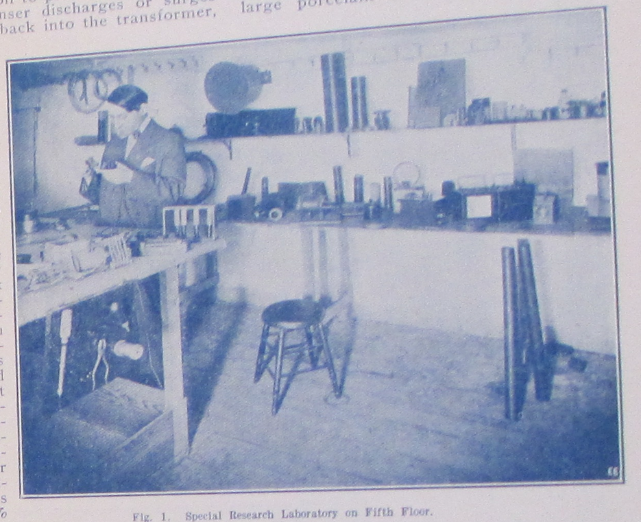
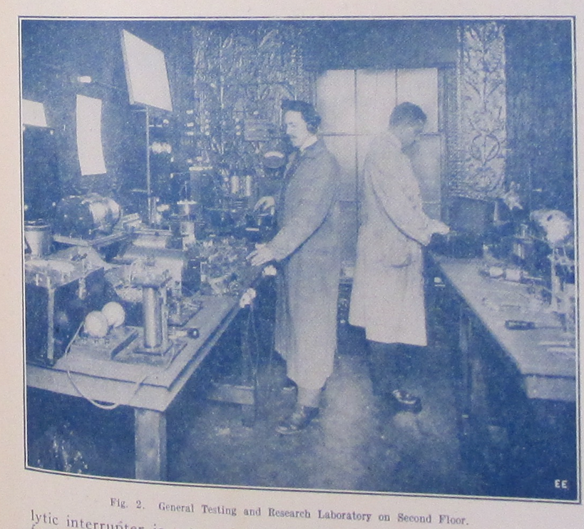
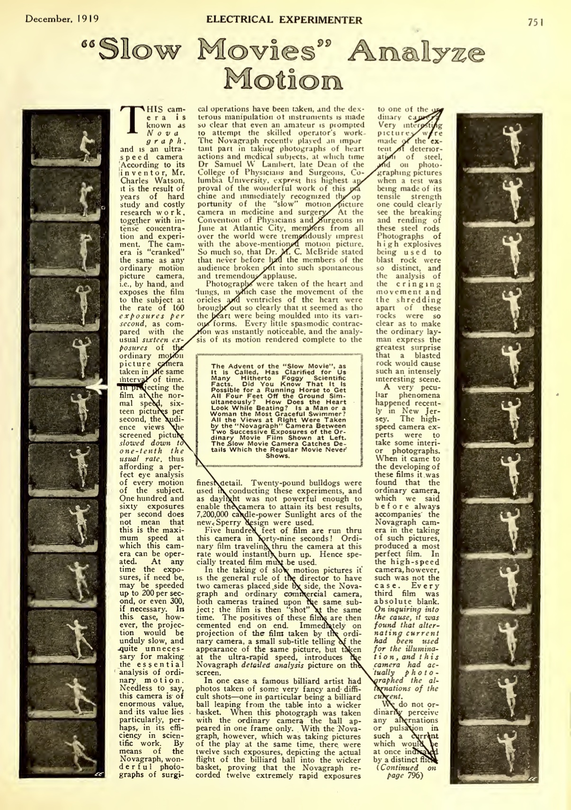

"we exploit the future"^[192308_predicting_future_inventions]
=======================

[Scientifiction]

(Begin with Mars -- each section begins with how the seemingly strange, to us, was totally commonplace in the weird early 20th century -- EMBRACE THE WEIRD).

In 1909, the canal controversy was in full swing, and the idea that there was an ancient race of Martians living on the red planet was more than just fanciful escapism.  It was part of a broader public discourse.  From 19… to 19…, the *New York Times* ran front page stories on the latest observations of the planet's surface, or the latest attempts to decode "messages" skimmed from the airwaves.

So in 1909, when Gernsback published **"Signaling to Mars,"** his was one of the more hard nosed proposals to communicate with the red planet.  The article is all about the possibility of sending a wireless message through space, and a concrete proposal for how to turn what may seem like a fanciful idea (the fantasy of extraterrestrial communication is, here at least, held at bay) into a technical reality.  For the most part, this would be the blueprint, the … core at the heart of what would become scientifiction over the next two decades.  Much like *narrative* scientifiction, early future-directed articles consist simply of a speculative technology and its engineering specifications.  The horizon of these proposals can be a few years, as it is for the feasibility of a workable prototype for television, decades, as it is in the Mars proposal, or several centuries, as it is in **"Our Cover,"** (1913) with its description of a cityscape that utilizes vertical space not through skyscrapers but floating buildings and infrastructure.  It's for this reason that Gernsback referred to Clement Fezandié as a "titan of science fiction"^[@gernsback_guest_1961].  These stories do exactly what G's earlier, ostensibly non-fiction editorials about the future do---posit a technology a technology, describe in minute detail how it works, and briefly explore why that technology will be economically and sometimes socially important.

Today, the phrase "science fiction" conjures up images of bug-eyed monsters, ray guns, starships, and sonic screwdrivers. But in the opening decades of the twentieth century, before a century's accretion of images, narratives, and clichés, that which was not yet called science fiction consisted of a great number of concrete practices all geared toward a reckoning with the technological revolutions in the fabric of everyday life. "Science," wrote Gernsback in the inaugural issue of *Amazing Stories*,

> through its various branches of mechanics, astronomy, etc., enters so intimately into all our lives today, and we are so much immersed in this science, that we have become rather prone to take new inventions and discoveries for granted. Our entire mode of living has been changed with the present progress, and it is little wonder, therefore, that many fantastic situations [...] are brought about today. It is in these situations that the new romancers find their great inspiration. (**"A New Sort of Magazine"** (1926))

Points
--------

Whose progress? Role of women, and masculinity seen as something genre specific to SF.
    192609_editorially_speaking -- though SF seen by readers as masculine and romance feminine, it was the rules of the former that allowed gender roles to be questioned in these magazines.  Also, "modern" scientifiction is distinguished from older by the speed with which a fantastic idea could be proven or disproven, through communications media

Writing SF stories as craft, and anonymous craftspeople.

Being taught without knowing it.  Wonder vs. technical knowledge.

Proper proportion of science to fiction, see fn to "Fiction Versus Facts" and consider removing the piece.  Just use quote from Wertenbaker.  What’s interesting is that the genre partly begins around a conversation on a problem to be solved: how to marry quality with technical complexity, how precisely science and fiction fit together in the best ratio?  See @westfahl_mightiest_2015, 25, on early complains about story quality and true fans’ dislike of space opera.

History/tradition of scientifiction
    As early as 1915, Gernsback cites nineteenth century dime novels like *Deadwood Dick* and authors like Luis Senarens ("The American Jules Verne"), revealing an awareness of the genealogy of science fiction over a decade before the launch of *Amazing Stories* in 1926, when most SF critics locate the birth of the genre.  These essays make clear that a very sophisticated understanding of the genre's roots was already in place by the 1910s, and that science fiction as we understand it today was a rich and variegated series of activities, rather than merely a literary form.
    191511_bookworm_patent -- an understanding of the 19th century precursors, the tradition on which his magazines built.  Also, an understanding that his readers were ravenous.
    192604_a_new_sort -- 200 years ago, these kind of stories were impossible without "science," which now enters so intimately into our daily lives.  So we take this science for granted, but the role of scientifiction is to teach us without being aware of being taught.
    192606_lure_of_scientifiction -- Scientifiction goes back to Da Vinci, Bacon, etc.  Even longer roots than the 19C.  Also, there's a community of "fans" whose imaginations are fired by these modern day SF authors.  Fans beginning to be a huge force

The defense of "fiction," "imagination," and "fantasy," as opposed to "facts."  See Donna Haraway in the opening to *Primitive Acts.*  “Facts are opposed to opinion, to prejudice, but not to fiction.  Both ficiton an fact are rooted in an epistemology that appeals to experience.”  Fiction is “an active form, referring to a present act of fashioning” and fact “is a descendant of a past participle, a word form which masks the generative deed or performance.  A fact seems done, unchangeable, fit only to be recorded” while “ficiton seems always inventive, open to other possibilities, other fashionings of life.” (quoted in Cheng, p. 103)
    191305_our_cover -- Defending the presence of the future and the "fantastic" in this technology magazine, which would have been foreign to other publications of the time (QST? Wireless World? Directly compare them!)  The point of these future scenes/portraits is to inspire the electrical experimenter.
    191604_imagination_versus_facts -- Yes, these magazines emphasize imaginary things, the imagination, but *progress* makes anything possible with time.  With time, the imagination becomes fact.  And it is the job of *Electrical Experimenter* to fire the imagination.
    192010_american_verne -- w/ Lu Senarens, imagination is quite literally invention
    193212_reasonableness_in -- a strong rejoinder to authors (and Campbell) that SF must be plausible!
    193009_science_faction -- There is a spectrum of the fantastic:  "probable, possible, and near-impossible."  But the best SF is "prophetic."  This SF, once read in the future, mutates with time, it becomes "science faction."  It loses its imaginative charge and just becomes a list of facts.  This is HG's take on paleofuturism.  **Relate this to "The Gernsback Continuum" idea of old futures.**
    192202_10k_years -- an article on the horizon of predictability for the "up-to-date scientist," then jumps 10,000 years to show just how good of a prophet HG is, perhaps.  Future truths will surpass today's wildest "fiction" or fantasies.

What is invention?
    192308_predicting_inventions -- Invention considered as a form of prophecy:  Working over the abstract idea of something that doesn't exist (what Chu calls the "cognitively estranging referent") using the raw material of hope and the imagination.  This leads to the strange idea that the inventor of the automobile wasn't Ford or ……… but nineteenth century approximators who constructed steam-powered prototypes of what they would later "know" to be the automobile:  "inventors over 150 years back knew the automobile."  So too is Verne seen as quite literally inventing the submarine, Leonardo da Vinci the steam engine and breech-loading gun, and Roger Bacon the telescope and gun powder (see "Lure of Scientifiction").  This is the essay where the idea of "exploiting the future" comes into play.
    192610_imagination_and_reality -- Gernsback's emphasis on the signature of scientifiction shifts in this editorial (192610_imagination_and_reality) away from objectively verifiable probability (as in **"Fiction Versus Facts"**) and toward an inspiration to future invention, no matter how seemingly fantastic. Given the fact that the wonders we've seen in the past years, the argument goes, the prophecies of the past that have seemingly been fulfilled, one would be a fool to dismiss anything as impossible.  He does, however, in this editorial, separate the author (stimulus) from the inventor (realization).
    But what is the "truth" of "The Moon Hoax", included in the canon? This is verifiably false yet counted as charming and imaginative. Gernsback clarifies the difference a bit in "Science Fiction Versus Science Faction." An economy by which (prophetic) fiction is transformed into (scientific) fact.  The Moon Hoax isn't prophetic scientifiction, because it didn't become fact.  Only the best does.
    19302_how_to_write -- scientific apparatus and methods are like clouds: the background, the setting of fiction.  And successful scientifiction writing requires research.  Also, first article in which HG uses the phrase "science fiction" (at least in this collection).

"certain future instrumentalities" ^[193212_reasonableness_in_sf]
===================================

[tinkering]

overarching story
------------------

The Electro Importing company's "main factory and office building at 233 Fulton Street," which is now the site of Ground Zero and the World Trade Center Transportation Hub.  Gernsback's private laboratory was on the fifth floor, "and the room abounds with bottles of all sizes, graduates, hydrometers, voltmeters and ammeters, crucibles, et cetera."  Working together in the main laboratory are Sidney Gernsback and H.W. Secor.  "…the Company makes practically all its own radio instruments, including telephone and wireless head 'phones."  @_e._1915.

* * * * * 

Immediately after launching *Modern Electrics,* Gernsback writes to luminaries in the field, requesting articles and interviews.  To Edison, 3.28.09: "The writer believes you to be interested in the propagation of the electrical arts among the Young and as MODERN ELECTRICS is devoted exclusively to young people the writer hopes that his step will find approval by the Master of Electricity."

Takes place between the machine shop model of innovation w/ the telegraph, according to Paul Israel (an age that some mythologize as the era of the independent inventor) and its transition, thanks largely to Edison, to corporate R&D (which many also mythologize as being solely the province of scientists disconnected from practical innovation, when in fact there was a great deal of small-scale tinkering, and, according to Hintz, independent inventors lived on).

* * * * * * 

What begins as an objective description of a new wireless component seems to eventually boil down to a product pitch.  Indeed, the Radioson would be advertised for sale from the Electro Importing Company in competitor's publications in the coming months.  But the level of detail Gernsback goes into here is unique, making this essay not just a product announcement, but a detailed discussion of how the device is constructed and why:

> Detectors and detector theory did not develop in smooth and rational progression, but in the usual fascinatingly wayward manner associated with most human activities. Only on rare occasions did researchers describe their technology with clarity. Moreover, commercial competition meant that there often was a great deal of secrecy about technical details. @thackeray_when_1983

One wonders then who Gernsback is pitching this device to, and why.  If this is such a valuable advance in radio technology, and if Gernsback was truly the obsessive profit-seeker that SF historians like to claim he is, why would he share blueprints for his design?  Why make this public and allow any experimenter to reproduce the results he's achieved?  Did he already try to pitch this to companies and they turned it down because, obviously, a Radioson detector can't be more powerful than the Audion?  Perhaps it is the best possible version:  that Gernsback was on to something, and he thought the best way for ideas travel is to share them, make them public, allow others to "fork" or "version" his hardware so that the idea grows faster that way.  Was this a possible model of collective tinkering before corporatized R&D and professional engineering?

points
-------

interested in the material possibility of inventions before they are an idea.  See 191608_perversity and…

how does one develop the inventor's intuition?  by learning about materials and process.  each technique involves the learning of countless other techniques. "Handicraft," quoted in fn for 192702_why_set_builder.

use fn on radio set building contest ending in intro, from 192702, p. 6?

use fn on 20th century independent inventors in intro? 192302_who_will_save

use Paul Israel on machine shop to corporate research

use big NYU prof activist guy on frustrated amateurs moving into science

links from Henry on popular scientific education here.  While Gernsback talks about sci edu more in the scientifiction section than tinkering, this is a good place to bring up these themes in the intro, esp. if i'm not directly tying each intro section to organizational "themes" of the book.  So, what role does the tinkerer have between 19thC and institutionalized science?  And, contextualize push for public science education in the US

wireless
==========

"radiophone" still being used as late as 192302_who_will_save

random notes
==============

Make it clear that the terms we take for granted mean nothing here, or at least mean something completely different.  "Science" was at once a citizen project, a new construction of public schools, a corporate R&D endeavor, and an academic project.  Often, Gernsback takes science to mean something like "applied science."  "Technology" wasn't yet a term.  And scientifiction was brand new.

<!-- Glass light bulbs filled with argon gas in order to detect telegraph messages flowing through the air. The sheer alchemy of these apparatuses by the modern eye... -->Thackeray 1983

while people like Tesla had already established the fact that invention was part of an entire discursive network of speculations, projections, etc., Gernsback was able to popularize these forms of using technology.  His work is all about amateurs thinking in the same way, and everyday people feeling this amazement as they use technology, not as dumb spectators with their minds blown by the magician Tesla, but as active participants.  Which actually makes him an interesting figure in Lori Emerson's argument that technology today (Apple especially) has become too magical.  Gernsback, especially in his writings on "spritism", was totally against magic.  Let's get our hands dirty with this technology, *while* we appreciate at the same time exactly how "amazing" it is.

* * * * * * * * * * * 

mention signaling Mars newspaper clipping: 

* * * * * * * * * * * 

Anonymity online: "Wireless Joker", "Signaling to Mars" (announcing first Blue Book), "Wireless Association."

* * * * * * * * * * *

Paul and illustrations
=======================

Gernsback says that producing realistic illustrations of the future is the most difficult, and most rewarding part of the magazine, and that the idea is to fire the imagination of a reader/experimenter:  "It is no easy matter to think out new things of the future and illustrating them adequately by means of expensive washdrawings or three-color cover illustrations.  Indeed, there is nothing more difficult connected with the publication." ("Imagination Versus Facts")