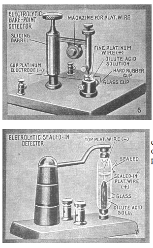
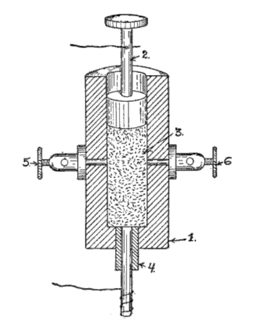

"Fessenden wants to bring signals on frequencies, not around signals from signals, instead of distinguishing from frequency to frequency."

====

[^fes]: The electrolytic detector, or "bare-point detector," was first developed by the Canadian inventor Reginald Fessenden.  Fessenden began his career as chief chemist for Thomas Edison, and in 1900 was hired by the United States Weather Bureau to develop a system of wireless transmission stations along the nation's coast to relay weather information and, perhaps, better predict hurricanes and floods.  The electrolytic detector emerged out of this research, which replaced the conductive minerals of the crystal detector (see "A Treatise on Wireless Telegraphy") with an electrically conductive liquid.  The electrolytic detector was Fessenden's answer to the problem of early wireless telegraph systems that couldn't tune to particular frequencies.  These early systems transmitted on one frequency only, creating a mess of interference for any two sets working in proximity with one another.  The electrolytic detector was sensitive enough to "tune."

    De Forest stole this technology two years later, in 1903.  See Lewis, p. 49.

    For Wolfgang Hagen, Fessenden was a member of a post-Edisonian wave of inventors (including Tesla and Marconi) who trafficked just as much in the fantastical and the occult as they did in capitalist entrepreneurialism and self-promotion.  A specifically American form of "radio" emerges from what Hagen calls the "law of alternating current," developed by the electrical engineer and socialist Charles Proteus Steinmetz in 1893.  Drawing on Lacan's tripartite division of the psyche into the imaginary, the real, and the symbolic, Hagen argues that the law of alternating current coalesces in a period of rapid development around the real of functioning machinery, the symbolic language of current, voltage, and resistance, and the imaginary of electrical phantasms.  Thus, in the same breath, Steinmetz could praise Tesla as a genius and dismiss him as a crackpot.

"From this point forward, one can say that electricians were able to fulfill their dreams of radio, which they perhaps once found in [Edward] Bellamy," Hagen writes, referring to the utopian novel *Looking Backward: 2000-1887* (1888) that included a representation of something like broadcast radio, piped to individual homes via cable.  "The could do it if they followed a law---the law of alternating current---and from this law their new machines could be built. […] All dreams now have a reference; not merely symbolic, but one that is actually constructed." [*Man kann also sagen: Ab jetzt können die >>Electricians<< ihre Träume vom Radio erfüllen, die sie vielleicht bei Bellamy fanden.  Sie Können es, wenn sie einem Gesetz, nämlich dem Gesetz des Wechselstroms folgen und nach diesem Gesetz ihre neuen Maschinen bauen (lassen).*]  @hagen_radio:_2005, p. 176.

For Steinmetz's political activism, see @garlin_three_1976.

====

[^rsn]:  Gernsback: "From the Greek Radio - Radius, and Sonus = Sound.

[^15]:  Gernsback's "radioson" was apparently an improvement on Canadian researcher Reginald Fessenden's bare-point electrolytic detector, the benefit being that the necessary acid solution was protected and sealed in.  "Another form of electrolytic detector which will stand considerable rough usage is that known as the Sealed-Point Electrolytic Detector. The commercial form of this instrument, as here illustrated, is known as the Radioson. The operation is the same as in the bare-point electrolytic type of detector and a battery of two dry cells is used with it, together with a pair of high resistance telephone receivers and having the battery potential preferably regulated by means of a high resistance potentiometer. The advantage of this type of electrolytic detector is that the acid is sealed in, consequently does not spill or evaporate."  H.  Winfield  Secor, ["Radio Detector Development,"](http://earlyradiohistory.us/1917de.htm) *The Electrical Experimenter,* January 1917, p. 652.

     <!-- no figure -->

[^2]:  A possible defense of G's first ever article published on an electrolytic interrupter?  Is this simply a retread/update of his initial design?

[^3]:  Wikipedia: "Wollaston wire is a very fine (less than .01 mm thick) platinum wire clad in silver and used in electrical instruments. For most uses, the silver cladding is etched away by acid to expose the platinum core.  The wire is named after its inventor, William Hyde Wollaston, who first produced it in England in the early 19th century. Platinum wire is drawn through successively smaller dies until it is about .003 inches (0.076 mm, 40 AWG) in diameter. It is then embedded in the middle of a silver wire having a diameter of about 0.1 inches (2.5 mm, 10 AWG). This composite wire is then drawn until the silver wire has a diameter of about .002 inches (0.051 mm, 44 AWG), causing the embedded platinum wire to be reduced by the same 50:1 ratio to a final diameter of .00006 inches (1.5 µm, 74 AWG). Removal of the silver coating with an acid bath leaves the fine platinum wire as a product of the process.  "Wollaston wire was used in early radio detectors known as electrolytic detectors and the hot wire barretter. Other uses include suspension of delicate devices, sensing of temperature, and sensitive electrical power measurements.  It continues to be used for the fastest-responding hot-wire anemometers."  On history of using Wollaston in electrolytic detectors, see **Thomas H. Lee**, The design of CMOS radio-frequency integrated circuits, 2nd edition, Cambridge University Press, 2004, p8, especially the chapter "A Nonlinear History of Radio" and "Overview of Wireless Principles".

[^4]:  On minerals and media, Parikka's book on geology, and current stuff on e-waste and rare earths.  Does Bill McKibben (who writes on a return to stationary state economics, "The Coming of the Stationary State") write on e-waste?  Our inability to conceive of an intergenerational ethics (phrase from Fredrik Johnson's "Victorian Anthropocene" talk).  "We can't articulate binding commitments to people not yet born."

[^45]:  Robert P. Murray, editor of the *Antique Wireless Association Review,* reports attempting to reconstruct this "radioson" detector:  Robert Murray, "Reginald Fessenden's Liquid Barretter," in *The Early Development of Radio in Canada, 1901-1930: An Illustrated History of Canada's Radio Pioneers, Broadcast Receiver Manufacturers, and Their Products* (Sonoran Publishing, 2005).  "I fashioned one [a detector more simple than Fessenden's original design] after that shown in the 1914 E.I. Co. catalog.  This had a similar arrangment of electrodes in a glass cup, but in this case the cathode was a coil of about 3 inches of the same platinum wire.  The anode was about 1/4 inch of platinum wire soldered into the advancing screw.  This detector worked, but very faintly.  I found that it worked best when the wire was just about drawn up out of the acid, and possibly pulling on the surface tension.  I do not know why the device worked this way.  I mention this only as a speculation.  I can hardly see 0.001 inch platinum wire without a magnifying glass.  I can certainly not see when it dips into the acid, but can hear the result in the headphones.  When I hold the wire between my fingers I can not feel it." (3)

[^5]:  This is a *huge* claim that is undoubtedly false.  Basically saying that vacuum tubes aren't as powerful as his electrolytic design.  Could this media archaeological path not taken (De Forest's audion tube obviously won out) truly be a possibility for the history of radio?  Gernsback hitched his star to the electrolytic interrupter design from his very first publication.  Doubling down here.  

    In a later editorial, Gernsback dials down his claims about the superiority of the coherer:  "Dr Branley of Paris was perhaps the first one to work extensively in this branch of radio and as far back as 1906 this investigator fired guns closed doors started and stopt motors by means of distant radio control This was in the age of the coherer and probably due to its inherent shortcomings the art of radio kinetics was not much advanced until very recently The coherer is a very unsatisfactory scientific instrument insofar that even if constructed by precision mechanics it has the great inherent fault of being susceptible to shocks as well as to most extraneous impulses Thus for instance a very sensitive coherer will usually operate on strays or static as well as inductive effects and stray waves In other words this instrument even the most balanced one is not reliable It will go Off when least expected A coherer heretofore was thought to be the prime necessity for radio kinetics because it was practically the only instrument known that could close the contacts of a relay Ordinary detectors such as the crystal type and others could not be used until about three or four years ago at which time very sensitive galvanometer relays were introduced which actually could be used to close a contact by means of a carborundum or silicon detector." "Radio Kinetics," *Radio Amateur News*, vol. 1 no. 12, June 1920
    
    The idea is that the audion was too complex (and too expensive) still by 1919/1920 for practical use if the radiophone / wireless telephone was to become a reality for amateurs: "Using the audion as a generator for undampt waves and as a RT transmitter is of course a great accomplishment in itself And the device works well better than anything else so far But it is not the ultimate goal Vacuum tubes of the audion type are tricky as yet and not too practical Unless you use special tubes and you can t just now due to a complicated patent situation the speech is not always clear and far from satisfactory At the critical period the tubes often go bluey and refuse to talk Amateurs therefore should look for substitutes of vacuum tubes or devise other tubes employing entirely different principles The writer years ago experimented." "Developing the Radiohpone," *Radio Amateur News*, vol. 1 no. 6, December 1919
    
    Later, in *Radio for All,* Gernsback admits the inherent technical limitations of the device: "Unfortunately the Radioson, once subjected to strong signals or even too strong static currents, would burn out the exceedingly fine Wollaston wire, after which the instrument became inoperative. Although the Radioson was perhaps one of the best electrolytic detectors ever designed, no means could be found to keep it from burning out and the manufacture of it was given up by the makers.  Soon after the invention of the electrolytic detector, crystal detectors came into vogue." (58)

[^6]:  Who is Gernsback pitching this device to right now, and why?  If this is such a valuable advance in radio technology, and if Gernsback was truly the obsessive profit-seeker SF historians like to claim he is, why would he share blueprints for his design?  Why make this public and allow any experimenter to reproduce the results he's achieved?  Did he already try to pitch this to companies and they turned it down because, obviously, a radioson detector can't be more powerful than the Audion?  Or is it the best possible version -- that Gernsback was on to something, and he thought the best way for ideas travel is to share them, make them public, allow others to "fork" or "version" his hardware so that the idea grows faster that way?  Was this a possible model of collective tinkering before corporatized R&D and professional engineering?  Can I make such a historical claim?  Knowing more about the technical specificities of this radioson would help me answer that question.  **As we see by the end,** however, this is all advertising rhetoric.  A huge technical article about a new advance is really an advertisement for a new product sold.

    "Detectors and detector theory did not develop in smooth and rational progres- sion, but in the usual fascinatingly wayward manner associated with most human activities. Only on rare occasions did research- ers describe their technology with clarity. Moreover, commercial competition meant that there often was a great deal of secrecy about technical details." @thackeray_when_1983  --This is what makes Hugo's announcement of the Radioson so unique. Not just an immediate product announcement, but a detailed discussion of how the part is made and why.--

[^7]:  Not only did the physicist and inventor Édouard Branly (1844 – 1940) discover the effect of heat on a coherer (later known as a detector), he was the first to describe and publish on the potential of the effect of electrical oscillations on metal filings.  In the words of Lee De Forest:  "The form and nature of the ordinary filings-tube coherer, as applied to-day in wireless telegraphy, is fairly familiar.  Branley [sic] discovered, in 1891, that the effect of electrical oscillations upon a body of metal fillings was to produce a marked increase in the conductivity of the mass, a conductivity which persisted until the particles were broken apart again by mechanical jar.  Although Varley, Hughes, Onesti and others had previously noted this phenomenon, none of these investigators had fully appreciated the causes involved, or given to the world of science the benefit of their researches in thorough published reports."  Lee De Forest, "Electrolytic Receivers: Wireless Telegraphy," *Telephony* vol. 8 no. 5 (November 1904), p. 424.

     <!-- no figure -->